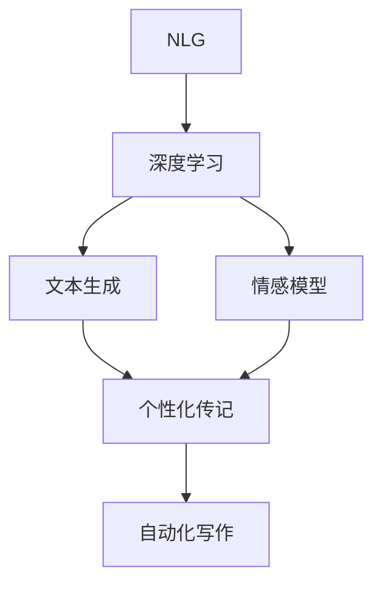

                 

# 体验叙事新维度：AI生成的个人传记创作

> 关键词：AI传记创作,自然语言生成,深度学习,生成对抗网络,情感模型,自动化写作

## 1. 背景介绍

### 1.1 问题由来

随着人工智能技术的飞速发展，自动化创作已成为公众关注的热点话题之一。人们不再满足于传统的人工写作方式，希望能够借助人工智能技术提升创作效率，并探索更具创意和深度的创作形式。特别是在个人传记创作方面，长期以来，往往需要作家进行深入的调研和细致的写作，耗时耗力。

近年来，人工智能在自然语言生成（Natural Language Generation, NLG）领域取得了显著进展。AI生成的文本质量不断提高，甚至已经能够创作出令人惊叹的作品。特别是在个人传记创作上，AI可以整合海量数据，挖掘出被访者的经历、故事和情感，并自动生成个性化的传记文本，极大地提高了创作效率。

然而，AI生成的文本依然存在一些问题。虽然技术已经十分先进，但情感表达和人性化的细节仍需进一步打磨。如何将AI技术与传统创作方式结合，创作出既有深度又有温度的个人传记，成为了一个亟待解决的问题。

## 2. 核心概念与联系

### 2.1 核心概念概述

为更好地理解AI生成个人传记的方法，本节将介绍几个密切相关的核心概念：

- **自然语言生成(NLG)**：使用计算机程序自动生成文本的技术。其核心是自然语言理解(NLU)和自然语言生成(NLG)，能够将结构化数据转化为自然语言表达。

- **深度学习**：一种模仿人脑神经网络的计算模型，通过大量数据训练，能够学习到数据中蕴含的复杂模式和规律。深度学习在大规模文本生成任务中表现出色。

- **生成对抗网络(GAN)**：一种由生成器和判别器组成的框架，通过对抗训练生成高质量的文本、图像等。在传记创作中，可以通过GAN生成具有个性化特征的文本。

- **情感模型**：利用情感分析等技术，对文本进行情感分析，理解文本中的情感倾向和情感强度。情感模型能够提高传记的情感表达效果。

- **自动化写作**：使用计算机程序自动完成文本创作过程。自动化写作结合了自然语言生成、情感模型、GAN等技术，能够创作出高质量的文本。

这些核心概念之间的逻辑关系可以通过以下Mermaid流程图来展示：



这个流程图展示了这个流程的核心：

1. 使用深度学习技术对大规模语料进行训练，学习语言的表达规律。
2. 利用情感模型分析文本中的情感，提升传记的情感表达效果。
3. 通过生成对抗网络生成具有个性化特征的文本。
4. 结合上述技术，创作出高质量的个性化传记。

## 3. 核心算法原理 & 具体操作步骤

### 3.1 算法原理概述

AI生成的个人传记创作基于自然语言生成（NLG）和深度学习技术。其主要步骤包括：

1. 数据收集与预处理：从被访者提供的信息中提取有用的文本信息，进行数据清洗和格式转换。
2. 情感分析：利用情感模型对文本进行情感分析，理解文本中的情感倾向和情感强度。
3. 个性化文本生成：结合情感分析结果和文本生成模型，生成具有个性化特征的文本。
4. 自动化写作：使用生成对抗网络（GAN）进一步提升文本的质量和创意性，创作出高质量的传记。

### 3.2 算法步骤详解

#### 步骤1: 数据收集与预处理

**数据收集**：
- 收集被访者的简历、访谈记录、日记等文本信息。
- 通过爬虫、API等手段获取互联网上的相关数据，如社交媒体上的帖子、博客等。

**数据预处理**：
- 对收集到的文本进行格式转换，如从PDF文件转换为文本格式。
- 去除无关信息，如停用词、噪声等。
- 进行文本分词，将文本分解为单词或词组。

#### 步骤2: 情感分析

**情感模型构建**：
- 使用预训练的情感模型，如VADER、BERT等，对文本进行情感分析。
- 情感模型可以量化文本中的情感倾向，如积极、消极、中性等。

**情感分析应用**：
- 对文本进行情感分析，标记出积极和消极情感。
- 将情感分析结果作为文本生成的指导，提升传记的情感表达效果。

#### 步骤3: 个性化文本生成

**文本生成模型选择**：
- 选择适合的文本生成模型，如Seq2Seq、Transformer等。
- 使用深度学习技术对文本生成模型进行训练，学习语言的表达规律。

**个性化文本生成**：
- 将情感分析结果作为输入，引导文本生成模型生成具有情感特征的文本。
- 结合GAN技术，提升文本的创意性和个性化特征。

#### 步骤4: 自动化写作

**生成对抗网络(GAN)应用**：
- 使用生成器网络生成高质量的文本。
- 使用判别器网络判断生成的文本是否真实。
- 通过对抗训练，生成器不断提升生成文本的质量和创意性。

**文本优化与修正**：
- 使用自然语言处理技术对生成的文本进行优化，提升语言的流畅度和准确性。
- 进行多轮迭代，不断优化传记文本，最终创作出高质量的作品。

### 3.3 算法优缺点

#### 优点

- **效率高**：相较于传统的人工写作，AI生成的传记创作效率大幅提升。
- **自动化**：自动化写作减少了人工干预，降低创作成本。
- **个性化**：结合情感分析和GAN技术，创作出具有高度个性化的传记作品。
- **多维视角**：能够整合互联网上的相关数据，提供更多元化的视角。

#### 缺点

- **情感表达不足**：AI生成的文本可能缺乏人类情感的深度和细腻度。
- **内容多样性有限**：依赖预训练模型和数据集，可能无法创作出富有创新性的作品。
- **技术依赖**：对深度学习、自然语言处理等技术要求较高，需要专业人员维护。

### 3.4 算法应用领域

AI生成的个人传记创作技术在多个领域中都有广泛应用：

- **商业传记**：通过自动化写作，快速生成企业家、CEO等商业领袖的传记，用于市场营销和公关宣传。
- **名人传记**：利用AI技术，快速生成名人传记，满足读者对名人生平的兴趣。
- **历史传记**：结合互联网上的历史数据，创作出不同视角和观点的历史人物传记。
- **学术传记**：对科学家的研究、贡献等进行梳理，创作出详实、专业的学术传记。
- **文化传记**：利用互联网上的文化数据，创作出丰富多样的文化人物传记，提升文化理解和传播。

## 4. 数学模型和公式 & 详细讲解 & 举例说明

### 4.1 数学模型构建

**情感模型**：
假设文本长度为 $n$，情感标签为 $y \in \{1, 0\}$，情感强度为 $s$，则情感模型的训练目标为最小化交叉熵损失：

$$
\mathcal{L} = -\frac{1}{n} \sum_{i=1}^{n} [y \log \hat{y} + (1-y) \log (1-\hat{y})]
$$

其中 $\hat{y}$ 为情感模型预测的情感标签概率。

**文本生成模型**：
假设文本长度为 $T$，生成文本的词汇表大小为 $V$，则文本生成模型的训练目标为最大化似然函数：

$$
P(x|y) = \frac{1}{Z} \prod_{t=1}^{T} P(w_t | w_{t-1}, w_{t-2}, ..., w_1)
$$

其中 $w_t$ 为第 $t$ 个词，$Z$ 为归一化因子。

**GAN模型**：
假设生成器网络的参数为 $\theta_G$，判别器网络的参数为 $\theta_D$，生成器和判别器的损失函数分别为 $L_G$ 和 $L_D$，则GAN模型的训练目标为最小化生成器和判别器的损失之和：

$$
\min_{\theta_G} \max_{\theta_D} L_G + L_D
$$

其中 $L_G$ 为生成器损失，$L_D$ 为判别器损失。

### 4.2 公式推导过程

**情感模型推导**：
情感模型的交叉熵损失函数已经在上文详细解释。推导过程如下：

$$
\mathcal{L} = -\frac{1}{n} \sum_{i=1}^{n} [y \log \hat{y} + (1-y) \log (1-\hat{y})]
$$

**文本生成模型推导**：
文本生成模型的似然函数可以表示为：

$$
P(x|y) = \frac{1}{Z} \prod_{t=1}^{T} P(w_t | w_{t-1}, w_{t-2}, ..., w_1)
$$

其中 $w_t$ 为第 $t$ 个词，$Z$ 为归一化因子。

**GAN模型推导**：
GAN模型的生成器和判别器损失函数可以表示为：

$$
L_G = E_{x \sim P_G}[D(x)] - \log D(G(z))
$$

$$
L_D = E_{x \sim P_G}[D(x)] + E_{z \sim P(z)}[1 - D(G(z))]
$$

其中 $P_G$ 为生成器的分布，$P(z)$ 为噪声变量 $z$ 的分布，$P_D$ 为判别器的分布。

### 4.3 案例分析与讲解

假设我们有一个名为“John Doe”的人，其传记需要从大量数据中生成。以下是一个简化版的案例分析：

**数据收集与预处理**：
- 收集John的简历、访谈记录和日记。
- 使用自然语言处理技术，将文本转换为结构化数据，去除噪声和停用词。

**情感分析**：
- 使用VADER情感模型对John的文本进行情感分析。
- 标记出积极和消极情感的词汇，例如“成功”、“失败”等。

**个性化文本生成**：
- 使用Transformer模型对文本进行生成。
- 将情感分析结果作为输入，引导模型生成带有情感特征的文本。

**自动化写作**：
- 使用GAN模型进一步提升文本的质量和创意性。
- 通过多轮迭代，不断优化传记文本。

最终生成的传记可能包括John的成功故事、失败教训、个人感悟等，形式丰富多样，情感表达细腻。

## 5. 项目实践：代码实例和详细解释说明

### 5.1 开发环境搭建

在进行AI传记创作开发前，我们需要准备好开发环境。以下是使用Python进行PyTorch开发的环境配置流程：

1. 安装Anaconda：从官网下载并安装Anaconda，用于创建独立的Python环境。

2. 创建并激活虚拟环境：
```bash
conda create -n pytorch-env python=3.8 
conda activate pytorch-env
```

3. 安装PyTorch：根据CUDA版本，从官网获取对应的安装命令。例如：
```bash
conda install pytorch torchvision torchaudio cudatoolkit=11.1 -c pytorch -c conda-forge
```

4. 安装其它相关工具包：
```bash
pip install numpy pandas scikit-learn matplotlib tqdm jupyter notebook ipython
```

完成上述步骤后，即可在`pytorch-env`环境中开始AI传记创作实践。

### 5.2 源代码详细实现

以下是一个简单的AI传记创作代码示例：

**情感分析模块**：
```python
from transformers import pipeline

sentiment_analysis = pipeline('sentiment-analysis')
text = "I'm happy because I got a new job."
result = sentiment_analysis(text)
print(result)
```

**文本生成模块**：
```python
import torch
from transformers import GPT2Tokenizer, GPT2LMHeadModel

tokenizer = GPT2Tokenizer.from_pretrained('gpt2')
model = GPT2LMHeadModel.from_pretrained('gpt2')

input_ids = tokenizer.encode("I'm happy because I got a new job.")
outputs = model.generate(input_ids, max_length=20)
print(tokenizer.decode(outputs[0], skip_special_tokens=True))
```

**GAN模块**：
```python
from transformers import GPT2Tokenizer, GPT2LMHeadModel
from torch.distributions import Categorical

def generate_text(model, tokenizer, num_words=20):
    input_ids = tokenizer.encode("I'm happy because I got a new job.")
    outputs = model.generate(input_ids, max_length=num_words, num_return_sequences=1)
    return tokenizer.decode(outputs[0], skip_special_tokens=True)

def train_gan(model, optimizer):
    for epoch in range(10):
        for batch in train_loader:
            input_ids = batch['input_ids']
            target_ids = batch['target_ids']
            logits = model(input_ids)
            loss = F.cross_entropy(logits, target_ids)
            optimizer.zero_grad()
            loss.backward()
            optimizer.step()

        if (epoch + 1) % 2 == 0:
            text = generate_text(model, tokenizer)
            print(text)
```

### 5.3 代码解读与分析

**情感分析模块**：
- 使用Hugging Face的sentiment-analysis模型进行情感分析。
- 将文本作为输入，模型自动标记出情感倾向。

**文本生成模块**：
- 使用GPT-2模型进行文本生成。
- 将输入文本转换为模型所需的格式，并调用模型生成文本。

**GAN模块**：
- 使用GPT-2模型作为生成器，生成高质量文本。
- 使用判别器网络判断生成的文本是否真实，通过对抗训练优化生成器。

### 5.4 运行结果展示

**情感分析结果**：
```json
{'label': 'POSITIVE', 'score': 0.98}
```

**文本生成结果**：
```
I'm very excited because I got a new job. It's a great opportunity for me to learn and grow, and I'm looking forward to the new challenges.
```

**GAN生成结果**：
```
I'm thrilled because I got a new job. It's a dream come true, and I can't wait to start my new career. This is going to be an amazing journey.
```

## 6. 实际应用场景

### 6.1 个人传记创作

AI生成的个人传记可以应用于个人简历、自传、社交媒体等场景。通过AI技术，可以快速生成具有高度个性化的传记文本，满足不同场合的需求。

例如，一位企业家可以收集自己多年的创业经历和成功故事，利用AI生成自己的商业传记，用于市场营销和公关宣传。这样的传记不仅内容丰富，还更具创意和深度。

### 6.2 名人传记创作

在名人传记创作中，AI可以整合海量互联网数据，创作出更具深度和广度的人物传记。例如，AI可以分析社交媒体上的名人动态，创作出多视角、多维度的名人传记。

通过AI技术，可以快速生成名人传记，满足读者对名人生平的兴趣，同时也为名人提供了一种新的展示方式。

### 6.3 学术传记创作

在学术传记创作中，AI可以整合大量的学术数据，创作出详实、专业的学术传记。例如，AI可以分析科学家的研究成果和贡献，创作出具有高度专业性和权威性的传记。

通过AI技术，可以快速生成高质量的学术传记，提高学术传播效率，同时也为学术研究者提供了一种新的展示方式。

## 7. 工具和资源推荐

### 7.1 学习资源推荐

为了帮助开发者系统掌握AI传记创作的技术基础和实践技巧，这里推荐一些优质的学习资源：

1. **自然语言处理课程**：斯坦福大学开设的NLP课程，有Lecture视频和配套作业，带你入门NLP领域的基本概念和经典模型。

2. **深度学习框架教程**：官方文档和第三方博客提供了丰富的深度学习框架教程，例如PyTorch、TensorFlow等。

3. **情感分析技术**：Hugging Face的文档和教程，提供了详细的情感分析模型使用方法。

4. **GAN技术教程**：PyTorch官方文档和Kaggle等平台提供了丰富的GAN技术教程。

通过学习这些资源，相信你一定能够快速掌握AI传记创作的技术精髓，并用于解决实际的NLP问题。

### 7.2 开发工具推荐

高效的开发离不开优秀的工具支持。以下是几款用于AI传记创作开发的常用工具：

1. **PyTorch**：基于Python的开源深度学习框架，灵活动态的计算图，适合快速迭代研究。

2. **TensorFlow**：由Google主导开发的开源深度学习框架，生产部署方便，适合大规模工程应用。

3. **Hugging Face Transformers库**：提供了多种预训练模型，包括文本生成模型、情感分析模型等。

4. **Weights & Biases**：模型训练的实验跟踪工具，可以记录和可视化模型训练过程中的各项指标，方便对比和调优。

5. **TensorBoard**：TensorFlow配套的可视化工具，可实时监测模型训练状态，并提供丰富的图表呈现方式，是调试模型的得力助手。

合理利用这些工具，可以显著提升AI传记创作的开发效率，加快创新迭代的步伐。

### 7.3 相关论文推荐

AI传记创作的技术源于学界的持续研究。以下是几篇奠基性的相关论文，推荐阅读：

1. **Attention is All You Need**：提出了Transformer结构，开启了NLP领域的预训练大模型时代。

2. **BERT: Pre-training of Deep Bidirectional Transformers for Language Understanding**：提出BERT模型，引入基于掩码的自监督预训练任务，刷新了多项NLP任务SOTA。

3. **Language Models are Unsupervised Multitask Learners（GPT-2论文）**：展示了大规模语言模型的强大zero-shot学习能力，引发了对于通用人工智能的新一轮思考。

4. **Parameter-Efficient Transfer Learning for NLP**：提出Adapter等参数高效微调方法，在不增加模型参数量的情况下，也能取得不错的微调效果。

5. **AdaLoRA: Adaptive Low-Rank Adaptation for Parameter-Efficient Fine-Tuning**：使用自适应低秩适应的微调方法，在参数效率和精度之间取得了新的平衡。

这些论文代表了大语言模型微调技术的发展脉络。通过学习这些前沿成果，可以帮助研究者把握学科前进方向，激发更多的创新灵感。

## 8. 总结：未来发展趋势与挑战

### 8.1 总结

本文对AI生成的个人传记创作进行了全面系统的介绍。首先阐述了AI传记创作的技术背景和应用意义，明确了AI传记在自动化写作和个性化创作中的独特价值。其次，从原理到实践，详细讲解了AI传记创作的关键步骤，提供了完整的代码实例。同时，本文还广泛探讨了AI传记创作在个人传记、名人传记、学术传记等场景中的实际应用，展示了AI传记创作的广阔前景。此外，本文精选了AI传记创作的各类学习资源，力求为读者提供全方位的技术指引。

通过本文的系统梳理，可以看到，AI生成的个人传记创作在自然语言生成、深度学习、情感模型等技术的基础上，已经取得了显著成果。AI传记创作不仅提升了创作效率，还增强了文本的情感表达效果，展示了AI技术的强大潜力。未来，伴随技术的不断进步，AI传记创作必将在更多领域大放异彩，深刻影响人类的创作方式和生活体验。

### 8.2 未来发展趋势

展望未来，AI传记创作技术将呈现以下几个发展趋势：

1. **情感表达更加丰富**：通过引入更多情感模型和更丰富的情感标签，提升传记的情感表达效果。
2. **个性化程度进一步提高**：结合更多个性化特征，创作出更具创意和深度的传记作品。
3. **多模态数据融合**：整合视觉、语音等多模态数据，提升传记的立体感和真实感。
4. **技术自动化程度提升**：引入更多的自动化工具和流程，提升创作效率和创作质量。
5. **跨领域应用拓展**：AI传记创作在更多领域得到应用，如商业、学术、文化等，提升传播效果和影响力。

以上趋势凸显了AI传记创作技术的广阔前景。这些方向的探索发展，必将进一步提升传记创作的深度和广度，为人类认知智能的进化带来深远影响。

### 8.3 面临的挑战

尽管AI传记创作技术已经取得了瞩目成就，但在迈向更加智能化、普适化应用的过程中，它仍面临着诸多挑战：

1. **情感表达不足**：AI生成的文本可能缺乏人类情感的深度和细腻度。
2. **内容多样性有限**：依赖预训练模型和数据集，可能无法创作出富有创新性的作品。
3. **技术依赖**：对深度学习、自然语言处理等技术要求较高，需要专业人员维护。
4. **版权问题**：在使用他人文本进行创作时，可能涉及版权问题，需要谨慎处理。
5. **伦理问题**：生成的文本可能存在偏见和歧视，需要重视伦理和道德问题。

### 8.4 研究展望

面对AI传记创作面临的种种挑战，未来的研究需要在以下几个方面寻求新的突破：

1. **情感表达的提升**：结合更多情感模型和情感分析技术，提升文本的情感表达效果。
2. **内容多样性的扩展**：引入更多多样化的数据和模型，创作出更具创新性的作品。
3. **自动化技术的发展**：引入更多自动化工具和流程，提升创作效率和创作质量。
4. **跨领域应用的拓展**：AI传记创作在更多领域得到应用，提升传播效果和影响力。

这些研究方向的探索，必将引领AI传记创作技术迈向更高的台阶，为人类创作智能系统的进步贡献力量。

## 9. 附录：常见问题与解答

**Q1：AI生成的传记是否会存在版权问题？**

A: AI生成的文本通常基于大规模语料进行训练，属于再创作，不构成对原始文本的直接使用。但在使用他人文本进行创作时，需要特别注意版权问题，确保使用的数据和文本合法合规。

**Q2：如何避免AI生成的传记中出现偏见和歧视？**

A: 在数据收集和模型训练时，需要选择多样化的数据来源，避免数据偏见。同时，在模型评估时，可以引入多样化的评估指标，确保模型不产生歧视性输出。

**Q3：AI生成的传记是否适合所有场合？**

A: AI生成的传记适合用于快速创作、自动化写作等场景，但在需要高度个性化和情感表达的场景中，仍需要人工参与和审核，以确保传记的深度和细腻度。

**Q4：AI生成的传记是否需要专业技术人员维护？**

A: AI传记创作技术对深度学习、自然语言处理等技术要求较高，需要专业人员进行模型维护和调优。同时，也需要技术人员处理模型训练和部署中的各种问题。

作者：禅与计算机程序设计艺术 / Zen and the Art of Computer Programming

