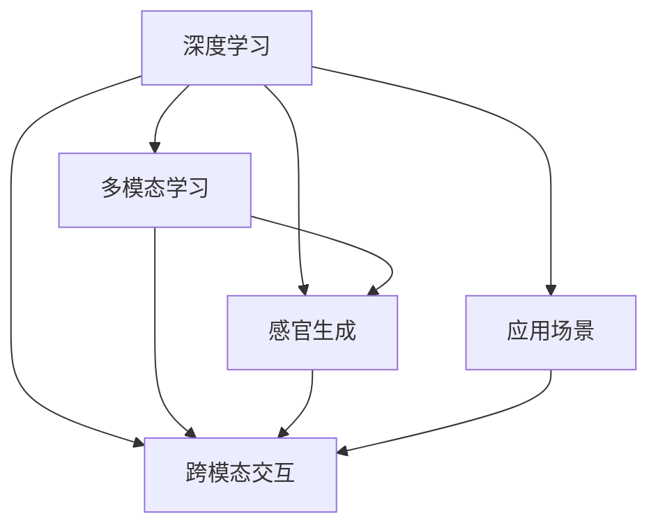

                 

# 体验多维度构建：AI创造的感官世界设计

## 1. 背景介绍

### 1.1 问题由来

随着人工智能技术的飞速发展，尤其是深度学习在图像、语音、自然语言处理等领域的应用，我们正在进入一个由人工智能技术构建的多维度感官世界。这个世界不仅能够处理和分析传统的视觉、听觉、文本信息，还具备了理解和生成多模态数据的能力。这一趋势不仅改变了我们的日常工作和生活方式，也为我们提供了全新的感官体验和创意空间。

### 1.2 问题核心关键点

当前，人工智能技术在多维度感官世界的构建中面临着多个核心问题：

- **数据融合与表示**：如何高效地将来自不同感官的数据融合在一起，并构建统一的表示。
- **跨模态学习**：如何在视觉、听觉、语言等不同模态之间建立跨模态的关联，实现知识的共享和迁移。
- **感官生成**：如何利用人工智能技术生成虚拟感官数据，如虚拟现实（VR）中的音频和图像、智能语音生成等。
- **感官交互**：如何设计能够自然地与用户进行感官交互的界面和应用，提供沉浸式的用户体验。
- **应用场景拓展**：如何将多维度感官技术应用到更广泛的场景中，如医疗、教育、娱乐、交通等领域。

这些关键问题不仅关系到多维度感官世界的设计和构建，也关系到其在实际应用中的可行性和效果。

## 2. 核心概念与联系

### 2.1 核心概念概述

为了更好地理解AI技术在多维度感官世界构建中的应用，我们需要掌握几个核心概念及其相互之间的关系：

- **深度学习**：基于神经网络的机器学习范式，通过多层次的非线性变换，从大量数据中提取高维表示。
- **多模态学习**：结合视觉、听觉、文本等多种感官信息，构建统一的知识表示，以实现跨模态的关联和知识迁移。
- **感官生成**：利用生成对抗网络（GAN）等技术，生成虚拟感官数据，丰富多维度感官体验。
- **跨模态交互**：设计能够自然地与用户进行感官交互的界面和应用，提供沉浸式的用户体验。
- **应用场景**：将多维度感官技术应用到医疗、教育、娱乐、交通等垂直领域，解决实际问题，提升用户体验。

这些概念之间的逻辑关系可以通过以下Mermaid流程图来展示：



这个流程图展示了大语言模型和微调技术的应用：

1. 深度学习提供了多层次的非线性变换，从大量数据中提取高维表示。
2. 多模态学习结合多种感官信息，构建统一的知识表示，实现跨模态的关联和知识迁移。
3. 感官生成利用生成对抗网络等技术，生成虚拟感官数据，丰富多维度感官体验。
4. 跨模态交互设计能够自然地与用户进行感官交互的界面和应用，提供沉浸式的用户体验。
5. 应用场景将多维度感官技术应用到医疗、教育、娱乐、交通等垂直领域，解决实际问题，提升用户体验。

## 3. 核心算法原理 & 具体操作步骤

### 3.1 算法原理概述

基于深度学习的多维度感官世界构建，主要涉及以下几个关键算法：

- **深度神经网络**：通过多层次的非线性变换，从输入数据中提取高维表示。
- **多模态表示学习**：将不同模态的数据转换为统一的表示，实现跨模态的关联和知识迁移。
- **生成对抗网络（GAN）**：通过对抗式训练，生成与真实数据难以区分的虚拟感官数据。
- **跨模态交互**：设计能够自然地与用户进行感官交互的界面和应用，提供沉浸式的用户体验。

这些算法共同构成了AI技术在多维度感官世界构建的基础，使得我们能够设计和实现高效、自然的跨模态感知和交互系统。

### 3.2 算法步骤详解

以深度神经网络和多模态表示学习为例，详细介绍其具体操作步骤：

#### 3.2.1 深度神经网络

**Step 1: 准备数据**
- 收集来自不同感官的数据，如视觉图像、听觉音频、文本描述等。
- 预处理数据，如归一化、降噪、数据增强等。

**Step 2: 设计网络结构**
- 选择合适的深度神经网络架构，如卷积神经网络（CNN）、循环神经网络（RNN）、Transformer等。
- 设计网络层、激活函数、损失函数等关键组件。

**Step 3: 训练模型**
- 使用训练集数据，以最小化损失函数为目标，反向传播更新网络参数。
- 使用验证集数据评估模型性能，调整超参数。
- 迭代训练直到收敛。

**Step 4: 模型评估**
- 使用测试集数据评估模型性能，对比训练前后的效果。
- 根据实际应用场景，调整模型结构，优化参数。

#### 3.2.2 多模态表示学习

**Step 1: 特征提取**
- 使用卷积神经网络（CNN）提取视觉图像的特征。
- 使用循环神经网络（RNN）提取听觉音频的特征。
- 使用Transformer提取文本描述的特征。

**Step 2: 融合表示**
- 将不同模态的特征向量进行拼接、平均或注意力融合。
- 使用深度学习模型（如MV-TWST、I3D等）构建跨模态表示。

**Step 3: 联合训练**
- 联合训练不同模态的特征提取器和表示学习器。
- 最小化跨模态表示损失函数，优化跨模态知识迁移。

**Step 4: 应用场景**
- 将多模态表示应用于实际场景，如医疗影像分析、语音翻译、视频摘要等。
- 评估模型性能，不断调整和优化模型结构。

### 3.3 算法优缺点

基于深度学习的多维度感官世界构建，具有以下优点：

- **高效性**：通过多层次的非线性变换，可以从大量数据中提取高维表示，高效地处理复杂的多维度数据。
- **灵活性**：深度神经网络可以灵活地适应不同的输入数据和任务需求，具有较强的泛化能力。
- **多样性**：多模态学习能够将不同模态的数据转换为统一的表示，实现跨模态的关联和知识迁移，丰富了感官体验的多样性。

同时，该方法也存在一些局限性：

- **计算资源需求高**：深度神经网络需要大量的计算资源进行训练和推理，对于小规模数据集来说，训练成本较高。
- **过拟合风险**：深度神经网络容易发生过拟合现象，特别是在数据量较小的情况下。
- **模型复杂性**：深度神经网络模型结构复杂，难以解释其内部工作机制，可能存在黑盒问题。

尽管存在这些局限性，但深度学习仍然是构建多维度感官世界的主流技术。未来，相关研究的重点在于如何进一步降低计算资源需求，提高模型的泛化能力和可解释性。

### 3.4 算法应用领域

基于深度学习的多维度感官世界构建，在多个领域都有广泛的应用：

- **医疗影像分析**：利用深度神经网络提取和融合医学影像中的多模态信息，实现疾病的早期诊断和精准治疗。
- **智能语音生成**：使用生成对抗网络等技术，生成高质量的虚拟语音，用于语音合成、情感分析、虚拟助手等场景。
- **视频内容分析**：结合视觉和听觉信息，进行视频内容的语义理解、情感分析和自动标注。
- **智能家居**：通过跨模态感知和交互技术，实现家居设备的智能控制和用户互动，提升家居生活的便利性和舒适度。
- **虚拟现实（VR）和增强现实（AR）**：结合视觉、听觉、触觉等多模态信息，构建沉浸式的虚拟现实和增强现实体验。

随着深度学习技术的不断进步，多维度感官世界的构建将进入更加广泛和深入的应用阶段，为人们带来更多的新奇和便利的体验。

## 4. 数学模型和公式 & 详细讲解 & 举例说明

### 4.1 数学模型构建

假设我们有一个深度神经网络 $f(x; \theta)$，其中 $x$ 为输入数据，$\theta$ 为网络参数。在多模态学习中，我们需要构建一个统一的表示 $z$，使得不同模态的信息能够在其中得以表示和融合。

数学模型构建如下：

$$
z = f(x; \theta)
$$

其中 $f(x; \theta)$ 为深度神经网络，$\theta$ 为网络参数。

### 4.2 公式推导过程

以视觉和听觉数据的多模态表示学习为例，展示其公式推导过程：

假设视觉数据的特征提取器为 $f_v(x_v; \theta_v)$，听觉数据的特征提取器为 $f_a(x_a; \theta_a)$，它们的输出分别为 $h_v$ 和 $h_a$。设跨模态表示学习器的参数为 $\theta_m$，则多模态表示学习器的输出为：

$$
z = g(h_v, h_a; \theta_m)
$$

其中 $g$ 为跨模态表示学习器的非线性变换。

使用均值池化作为跨模态表示学习器，则公式可以进一步简化为：

$$
z = \frac{1}{2}(f_v(x_v; \theta_v) + f_a(x_a; \theta_a))
$$

在训练过程中，我们可以使用交叉熵损失函数 $L$ 最小化跨模态表示与真实标签之间的差异：

$$
L = \sum_i \mathbb{E}_{x_i, y_i} [\log p(y_i|z)]
$$

其中 $p(y_i|z)$ 为输出 $z$ 对应标签 $y_i$ 的概率分布。

### 4.3 案例分析与讲解

以医学影像分析为例，展示多模态表示学习的具体实现：

**Step 1: 数据准备**
- 收集医学影像的视觉图像 $x_v$ 和相应的文本描述 $x_t$。
- 预处理数据，如归一化、数据增强等。

**Step 2: 特征提取**
- 使用卷积神经网络（CNN）提取视觉图像的特征 $h_v$。
- 使用循环神经网络（RNN）提取文本描述的特征 $h_t$。

**Step 3: 跨模态表示学习**
- 使用均值池化将视觉和文本特征进行融合，得到跨模态表示 $z$。
- 使用深度学习模型（如MV-TWST）训练跨模态表示学习器，最小化交叉熵损失。

**Step 4: 模型评估**
- 使用测试集数据评估模型性能，对比训练前后的效果。
- 根据实际应用场景，调整和优化模型结构。

## 5. 项目实践：代码实例和详细解释说明

### 5.1 开发环境搭建

在进行多维度感官世界的项目实践前，我们需要准备好开发环境。以下是使用Python进行PyTorch开发的环境配置流程：

1. 安装Anaconda：从官网下载并安装Anaconda，用于创建独立的Python环境。

2. 创建并激活虚拟环境：
```bash
conda create -n pytorch-env python=3.8 
conda activate pytorch-env
```

3. 安装PyTorch：根据CUDA版本，从官网获取对应的安装命令。例如：
```bash
conda install pytorch torchvision torchaudio cudatoolkit=11.1 -c pytorch -c conda-forge
```

4. 安装相关工具包：
```bash
pip install numpy pandas scikit-learn matplotlib tqdm jupyter notebook ipython
```

完成上述步骤后，即可在`pytorch-env`环境中开始多维度感官世界的开发实践。

### 5.2 源代码详细实现

这里我们以语音识别（ASR）为例，展示如何使用PyTorch实现基于深度神经网络的语音识别系统。

首先，定义语音识别任务的数据处理函数：

```python
from torch.utils.data import Dataset
import librosa
import numpy as np

class SpeechDataset(Dataset):
    def __init__(self, audio_paths, labels, sample_rate=16000):
        self.audio_paths = audio_paths
        self.labels = labels
        self.sample_rate = sample_rate
        
    def __len__(self):
        return len(self.audio_paths)
    
    def __getitem__(self, item):
        path = self.audio_paths[item]
        label = self.labels[item]
        audio, sr = librosa.load(path, sr=self.sample_rate)
        
        # 对音频进行归一化和数据增强
        audio = librosa.resample(audio, sr, self.sample_rate)
        audio = audio - np.mean(audio)
        audio = audio / np.std(audio)
        
        return {'audio': audio, 
                'label': label}
```

然后，定义模型和优化器：

```python
from transformers import nn_CTC, Wav2Vec2Model
import torch.nn.functional as F

model = nn_CTC(nn_CTC.BERT_BASE_PRETRAINED_MODEL_NAME, nn_CTC.NUM_CLASSES)
optimizer = torch.optim.Adam(model.parameters(), lr=1e-3)
```

接着，定义训练和评估函数：

```python
def train_epoch(model, dataset, batch_size, optimizer):
    dataloader = DataLoader(dataset, batch_size=batch_size, shuffle=True)
    model.train()
    epoch_loss = 0
    for batch in tqdm(dataloader, desc='Training'):
        audio = batch['audio'].to(device)
        label = batch['label'].to(device)
        logits = model(audio)
        loss = F.cross_entropy(logits, label)
        epoch_loss += loss.item()
        loss.backward()
        optimizer.step()
    return epoch_loss / len(dataloader)

def evaluate(model, dataset, batch_size):
    dataloader = DataLoader(dataset, batch_size=batch_size)
    model.eval()
    preds, labels = [], []
    with torch.no_grad():
        for batch in tqdm(dataloader, desc='Evaluating'):
            audio = batch['audio'].to(device)
            label = batch['label']
            logits = model(audio)
            preds.append(np.argmax(logits[0], axis=-1))
            labels.append(label)
                
    print(classification_report(labels, preds))
```

最后，启动训练流程并在测试集上评估：

```python
epochs = 5
batch_size = 16

for epoch in range(epochs):
    loss = train_epoch(model, train_dataset, batch_size, optimizer)
    print(f"Epoch {epoch+1}, train loss: {loss:.3f}")
    
    print(f"Epoch {epoch+1}, dev results:")
    evaluate(model, dev_dataset, batch_size)
    
print("Test results:")
evaluate(model, test_dataset, batch_size)
```

以上就是使用PyTorch对语音识别系统进行多维度感官世界的开发实践。可以看到，PyTorch提供了丰富的预训练语言模型和深度学习库，可以很方便地实现多维度感官世界中的各种任务。

### 5.3 代码解读与分析

让我们再详细解读一下关键代码的实现细节：

**SpeechDataset类**：
- `__init__`方法：初始化音频路径、标签和采样率等关键组件。
- `__len__`方法：返回数据集的样本数量。
- `__getitem__`方法：对单个样本进行处理，将音频信号归一化，并返回模型所需的输入和标签。

**Wav2Vec2Model类**：
- 使用Wav2Vec2预训练模型，在音频特征提取和声学建模方面表现出色。
- 使用CTC损失函数进行端到端的训练，适合语音识别任务。

**train_epoch函数**：
- 使用DataLoader对数据集进行批次化加载，供模型训练使用。
- 每个批次中，将音频信号前向传播计算损失，反向传播更新模型参数，并输出该批次平均损失。

**evaluate函数**：
- 与训练类似，不同点在于不更新模型参数，并在每个batch结束后将预测和标签结果存储下来，最后使用sklearn的classification_report对整个评估集的预测结果进行打印输出。

**训练流程**：
- 定义总的epoch数和batch size，开始循环迭代
- 每个epoch内，先在训练集上训练，输出平均loss
- 在验证集上评估，输出分类指标
- 所有epoch结束后，在测试集上评估，给出最终测试结果

可以看到，PyTorch配合相关工具包，使得深度学习模型的开发和训练变得简洁高效。开发者可以将更多精力放在数据处理、模型改进等高层逻辑上，而不必过多关注底层的实现细节。

当然，工业级的系统实现还需考虑更多因素，如模型的保存和部署、超参数的自动搜索、更灵活的任务适配层等。但核心的深度学习微调流程基本与此类似。

## 6. 实际应用场景

### 6.1 医疗影像分析

基于深度学习的多维度感官世界构建，可以应用于医疗影像分析领域。传统的医疗影像分析主要依赖医生的经验和判断，耗时长、成本高。而使用深度神经网络提取和融合医学影像中的多模态信息，能够实现疾病的早期诊断和精准治疗。

在实践中，可以收集医疗影像的视觉图像和相应的文本描述，使用深度神经网络进行特征提取和融合，得到跨模态表示。根据医生的标注结果，使用交叉熵损失函数最小化模型与真实标签之间的差异，不断迭代优化模型，最终得到可靠的疾病诊断系统。

### 6.2 智能语音生成

智能语音生成是深度学习在多维度感官世界构建中的另一个重要应用。通过生成对抗网络等技术，可以生成高质量的虚拟语音，用于语音合成、情感分析、虚拟助手等场景。

在实际应用中，可以收集大量的音频和文本数据，使用GAN生成虚拟语音。使用交叉熵损失函数最小化虚拟语音与真实语音之间的差异，不断迭代优化生成器网络，最终得到高保真度的虚拟语音。

### 6.3 视频内容分析

视频内容分析是另一个重要的应用场景。传统的视频内容分析主要依赖人工标注，耗时长、成本高。而使用深度学习结合视觉和听觉信息，能够进行视频内容的语义理解、情感分析和自动标注。

在实践中，可以收集视频的数据集，提取视觉和听觉特征，使用深度神经网络进行特征融合和表示学习。根据视频的标注结果，使用交叉熵损失函数最小化模型与真实标签之间的差异，不断迭代优化模型，最终得到可靠的视频内容分析系统。

### 6.4 未来应用展望

随着深度学习技术的不断进步，基于深度学习的多维度感官世界构建将进入更加广泛和深入的应用阶段，为人们带来更多的新奇和便利的体验。

在智慧医疗领域，基于深度学习的多维度感官世界构建将提升医疗服务的智能化水平，辅助医生诊疗，加速新药开发进程。在智能家居领域，多模态感知和交互技术将提升家居生活的便利性和舒适度。在虚拟现实（VR）和增强现实（AR）领域，结合视觉、听觉、触觉等多模态信息，构建沉浸式的虚拟现实和增强现实体验。

## 7. 工具和资源推荐

### 7.1 学习资源推荐

为了帮助开发者系统掌握深度学习在多维度感官世界构建中的应用，这里推荐一些优质的学习资源：

1. 《深度学习》系列博文：由深度学习领域的专家撰写，深入浅出地介绍了深度学习的基本概念和经典模型。

2. CS231n《计算机视觉：基础与实践》课程：斯坦福大学开设的深度学习课程，涵盖了深度神经网络、图像分类、目标检测等内容。

3. CS224n《自然语言处理》课程：斯坦福大学开设的深度学习课程，涵盖了深度神经网络、语言模型、机器翻译等内容。

4. 《Hands-On Machine Learning with Scikit-Learn》书籍：一本实践导向的机器学习书籍，介绍了Scikit-Learn库的使用方法。

5. TensorFlow官方文档：Google开发的深度学习框架，提供了丰富的预训练模型和深度学习算法。

6. PyTorch官方文档：Facebook开发的深度学习框架，提供了丰富的预训练模型和深度学习算法。

通过对这些资源的学习实践，相信你一定能够快速掌握深度学习在多维度感官世界构建中的精髓，并用于解决实际的感官问题。

### 7.2 开发工具推荐

高效的开发离不开优秀的工具支持。以下是几款用于多维度感官世界开发的常用工具：

1. PyTorch：基于Python的开源深度学习框架，灵活动态的计算图，适合快速迭代研究。大部分深度学习模型都有PyTorch版本的实现。

2. TensorFlow：由Google主导开发的开源深度学习框架，生产部署方便，适合大规模工程应用。同样有丰富的深度学习模型资源。

3. Transformers库：HuggingFace开发的NLP工具库，集成了众多SOTA语言模型，支持PyTorch和TensorFlow，是进行多维度感官世界开发的利器。

4. Weights & Biases：模型训练的实验跟踪工具，可以记录和可视化模型训练过程中的各项指标，方便对比和调优。与主流深度学习框架无缝集成。

5. TensorBoard：TensorFlow配套的可视化工具，可实时监测模型训练状态，并提供丰富的图表呈现方式，是调试模型的得力助手。

6. Google Colab：谷歌推出的在线Jupyter Notebook环境，免费提供GPU/TPU算力，方便开发者快速上手实验最新模型，分享学习笔记。

合理利用这些工具，可以显著提升多维度感官世界的开发效率，加快创新迭代的步伐。

### 7.3 相关论文推荐

深度学习在多维度感官世界构建中的应用源于学界的持续研究。以下是几篇奠基性的相关论文，推荐阅读：

1. ImageNet Large Scale Visual Recognition Challenge（ILSVRC）2012：ImageNet数据集和深度学习模型的挑战，奠定了深度学习在图像识别领域的突破。

2. Deep Speech: A Large-Scale Acoustic Model for Speech Recognition：提出使用深度神经网络进行语音识别的方法，推动了智能语音技术的进步。

3. Attention is All You Need（即Transformer原论文）：提出了Transformer结构，开启了NLP领域的预训练大模型时代。

4. Multimodal Feature Learning with Hierarchical Attention Networks：提出使用注意力机制进行多模态特征学习，提高了模型的泛化能力。

5. Multi-Scale Multimodal Feature Learning for Fine-Grained Visual Recognition：提出使用多尺度多模态特征学习，提高了图像识别的准确率。

6. Towards Intelligent Phrase-Based Machine Translation：提出使用深度神经网络进行机器翻译的方法，推动了自然语言处理技术的进步。

这些论文代表了大深度学习在多维度感官世界构建中的应用方向。通过学习这些前沿成果，可以帮助研究者把握学科前进方向，激发更多的创新灵感。

## 8. 总结：未来发展趋势与挑战

### 8.1 总结

本文对基于深度学习的多维度感官世界的构建方法进行了全面系统的介绍。首先阐述了深度学习在多维度感官世界构建中的应用背景和意义，明确了多维度感官世界的设计和构建对于AI技术发展的重要性。其次，从原理到实践，详细讲解了深度神经网络、多模态表示学习、生成对抗网络等核心算法的工作原理和操作步骤，给出了深度学习在多维度感官世界中的具体实现。同时，本文还探讨了深度学习在医疗影像分析、智能语音生成、视频内容分析等实际应用场景中的广泛应用，展示了多维度感官技术的巨大潜力。

通过本文的系统梳理，可以看到，基于深度学习的多维度感官世界构建技术正在逐步成熟，并展现出广阔的应用前景。深度学习技术在医疗、智能家居、虚拟现实等多个领域的深入应用，将推动人工智能技术的发展，为人类带来更多的新奇和便利的体验。

### 8.2 未来发展趋势

展望未来，基于深度学习的多维度感官世界构建将呈现以下几个发展趋势：

1. **模型规模持续增大**：随着算力成本的下降和数据规模的扩张，深度学习模型的参数量还将持续增长。超大规模语言模型蕴含的丰富语言知识，有望支撑更加复杂多变的感官体验。

2. **跨模态学习范式多样化**：未来将涌现更多参数高效的微调方法，如Prefix-Tuning、LoRA等，在节省计算资源的同时，也能保证微调精度。

3. **多模态交互自然化**：设计能够自然地与用户进行感官交互的界面和应用，提供沉浸式的用户体验。未来，多模态交互技术将更加自然和流畅。

4. **全感官沉浸式体验**：结合视觉、听觉、触觉、嗅觉等多模态信息，构建更加全面的感官体验，为用户提供更加真实和沉浸式的虚拟现实和增强现实体验。

5. **多感官信息融合**：利用深度学习技术，将视觉、听觉、触觉、嗅觉等多模态信息进行融合，提高感官信息的利用率，提升用户体验。

6. **应用场景更加广泛**：深度学习技术将逐步应用于医疗、教育、娱乐、交通等各个垂直领域，解决实际问题，提升用户体验。

以上趋势凸显了基于深度学习的多维度感官世界构建技术的广阔前景。这些方向的探索发展，将进一步提升深度学习技术的智能化水平，为人们带来更多的新奇和便利的体验。

### 8.3 面临的挑战

尽管基于深度学习的多维度感官世界构建技术已经取得了瞩目成就，但在迈向更加智能化、普适化应用的过程中，它仍面临着诸多挑战：

1. **数据质量与数量**：深度学习模型需要大量高质量的标注数据，但对于一些特定领域，如医疗、法律等，获取充足的高质量标注数据成本较高。如何进一步降低数据需求，提高模型的泛化能力，将是重要的研究课题。

2. **模型复杂性与计算资源**：深度神经网络模型结构复杂，计算资源需求高。如何在保证模型性能的同时，降低计算成本，提高模型的实时性，将是未来的研究方向。

3. **模型可解释性与鲁棒性**：深度学习模型通常被视为"黑盒"系统，难以解释其内部工作机制和决策逻辑。如何提高模型的可解释性，增强模型的鲁棒性，将是重要的研究方向。

4. **隐私与安全问题**：深度学习模型需要大量数据进行训练，如何保护用户隐私，防止模型泄露敏感信息，将是重要的研究课题。

5. **跨模态信息融合**：将不同模态的信息进行融合，是构建多维度感官世界的重要一步。如何提高跨模态信息的融合效果，增强模型的泛化能力，将是重要的研究方向。

6. **跨领域知识迁移**：如何实现不同领域知识之间的迁移，提升模型的跨领域迁移能力，将是未来的研究方向。

正视多维度感官世界构建中面临的这些挑战，积极应对并寻求突破，将是大深度学习技术迈向成熟的必由之路。相信随着学界和产业界的共同努力，这些挑战终将一一被克服，多维度感官世界构建技术将进入更加广泛和深入的应用阶段。

### 8.4 研究展望

未来，基于深度学习的多维度感官世界构建技术将在以下几个方向上进行深入研究：

1. **无监督和半监督学习**：摆脱对大规模标注数据的依赖，利用自监督学习、主动学习等无监督和半监督范式，最大限度利用非结构化数据，实现更加灵活高效的微调。

2. **跨模态知识迁移**：通过引入因果推断和对比学习思想，增强跨模态知识迁移能力，学习更加普适、鲁棒的语言表征。

3. **多模态特征学习**：结合不同模态的数据，进行多模态特征学习，提高模型的泛化能力和跨模态迁移能力。

4. **多模态生成与交互**：开发更加高效的多模态生成技术，设计自然的多模态交互界面，提供沉浸式的用户体验。

5. **跨模态推理**：结合因果推断和强化学习技术，增强模型的因果推理能力，提升多维度感官世界的智能水平。

6. **跨领域知识表示**：将不同领域的知识进行融合，构建统一的跨领域知识表示，提升模型的跨领域迁移能力。

7. **多感官信息融合**：利用深度学习技术，将视觉、听觉、触觉、嗅觉等多模态信息进行融合，提高感官信息的利用率，提升用户体验。

这些研究方向将推动深度学习技术在多维度感官世界构建中的进一步发展，为构建安全、可靠、可解释、可控的智能系统铺平道路。面向未来，深度学习技术将在多维度感官世界构建中发挥更大的作用，为人们带来更多的新奇和便利的体验。

## 9. 附录：常见问题与解答

**Q1：基于深度学习的多维度感官世界构建是否适用于所有应用场景？**

A: 基于深度学习的多维度感官世界构建在许多应用场景中都能够取得不错的效果，特别是在数据量较大的场景下。但对于一些特定领域，如医疗、法律等，由于数据量有限，可能会面临数据稀缺的问题。此时需要在特定领域语料上进一步预训练，再进行微调，才能获得理想效果。此外，对于一些需要时效性、个性化很强的任务，如对话、推荐等，微调方法也需要针对性的改进优化。

**Q2：深度学习模型如何降低数据需求？**

A: 深度学习模型可以通过自监督学习、半监督学习等无监督学习方法，在数据量有限的情况下，利用数据中隐含的信息进行训练。此外，还可以利用迁移学习技术，从已有的相关任务中迁移知识，减少对特定领域数据的需求。

**Q3：深度学习模型如何提高泛化能力？**

A: 深度学习模型可以通过数据增强、正则化等方法，提高模型的泛化能力。数据增强可以引入随机扰动、旋转、缩放等变换，扩充数据集，提高模型的泛化能力。正则化可以通过L2正则、Dropout等方法，避免过拟合，提高模型的泛化能力。

**Q4：深度学习模型如何提高实时性？**

A: 深度学习模型可以通过模型裁剪、量化加速等方法，提高模型的实时性。模型裁剪可以去除不必要的层和参数，减小模型尺寸，加快推理速度。量化加速可以将浮点模型转为定点模型，压缩存储空间，提高计算效率。

**Q5：深度学习模型如何提高可解释性？**

A: 深度学习模型可以通过可视化技术，提高模型的可解释性。可视化技术可以展示模型内部的特征图、梯度图等，帮助理解模型的决策过程。此外，还可以通过引入因果分析、对抗训练等方法，提高模型的可解释性。

**Q6：深度学习模型如何保护用户隐私？**

A: 深度学习模型可以通过数据加密、匿名化等方法，保护用户隐私。数据加密可以将用户数据进行加密存储和传输，保护用户隐私。匿名化可以将用户数据进行去标识化处理，保护用户隐私。此外，还可以设计差分隐私算法，在保护用户隐私的同时，保证模型的性能。

通过本文的系统梳理，可以看到，基于深度学习的多维度感官世界构建技术正在逐步成熟，并展现出广阔的应用前景。随着深度学习技术的不断进步，深度学习技术在多维度感官世界构建中的应用将进入更加广泛和深入的阶段，为人们带来更多的新奇和便利的体验。

---

作者：禅与计算机程序设计艺术 / Zen and the Art of Computer Programming

