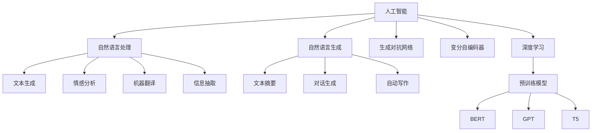

                 

# 体验的叙事性：AI驱动的个人故事创作

> 关键词：人工智能，叙事性创作，自然语言处理，自然语言生成，生成对抗网络，深度学习，文本创作

## 1. 背景介绍

### 1.1 问题由来
随着人工智能技术的快速发展，人工智能在内容生成领域的应用变得日益广泛。从简单的文本自动生成到复杂的故事创作，AI驱动的叙事性内容创作正逐渐进入公众视野，并展现出强大的应用潜力。

人工智能在故事创作方面的研究可以追溯到早期的规则语法生成器和语言模型，如GPT-1和GPT-2等。这些模型通过预测下一个单词来生成文本，但生成的文本往往缺乏连贯性和叙事性。近年来，随着生成对抗网络(GANs)和变分自编码器(VAEs)等生成模型技术的发展，AI驱动的叙事性故事创作进入了一个新的阶段。

### 1.2 问题核心关键点
AI驱动的叙事性故事创作涉及以下几个核心问题：
1. 如何构建叙事性内容，使其连贯性强，符合人类叙事逻辑？
2. 如何通过深度学习技术，让AI生成的故事内容更加丰富、生动、有创意？
3. 如何处理多样化的叙事风格和叙事主题，生成符合不同需求的故事？
4. 如何在生成过程中考虑伦理和安全性问题，确保生成内容不会产生负面影响？

这些问题构成了AI驱动叙事性故事创作研究的主要方向，本文将围绕这些问题展开讨论。

### 1.3 问题研究意义
AI驱动的叙事性故事创作研究，具有以下重要意义：
1. 减轻内容创作负担。大量重复性、低效性的内容创作工作可以由AI代劳，大大提高创作效率。
2. 拓展创作维度。AI可以生成多样化的内容，拓展创作维度，丰富创作资源。
3. 提高创作质量。AI驱动的故事创作可以运用大数据和深度学习技术，生成高质量、有创意的故事内容。
4. 拓展应用场景。AI驱动的故事创作可以应用到小说创作、剧本编写、广告文案、智能客服等领域，提升用户体验。

## 2. 核心概念与联系

### 2.1 核心概念概述

为更好地理解AI驱动叙事性故事创作的原理和技术，本节将介绍几个密切相关的核心概念：

- 人工智能(AI)：基于数据和算法，模拟人类智能行为，实现信息获取、决策推理、问题解决、语言理解等任务的技术体系。
- 自然语言处理(NLP)：研究计算机如何处理和理解人类语言，包括文本分析、情感分析、机器翻译、信息抽取等。
- 自然语言生成(NLG)：利用机器学习技术，让计算机自动生成自然语言文本，如对话生成、文本摘要、自动写作等。
- 生成对抗网络(GANs)：一种生成模型技术，通过两个神经网络相互对抗，提升生成文本的质量。
- 变分自编码器(VAEs)：一种生成模型技术，通过学习数据分布，生成高质量的文本数据。
- 深度学习：一种基于神经网络的机器学习技术，通过多层次的特征提取和变换，实现对复杂数据的建模和分析。
- 预训练模型：如BERT、GPT等，通过大规模无标签数据预训练获得通用语言表示，为下游任务提供初始化参数。

这些核心概念之间的逻辑关系可以通过以下Mermaid流程图来展示：



这个流程图展示了大语言模型在AI驱动叙事性故事创作中的核心概念及其之间的关系：

1. 人工智能通过自然语言处理技术，处理文本数据。
2. 自然语言生成技术，通过深度学习模型生成文本。
3. 文本生成、对话生成、自动写作等任务，都依赖于自然语言生成技术。
4. 生成对抗网络、变分自编码器等生成模型，为自然语言生成提供技术支持。
5. 深度学习是自然语言处理和生成的重要工具。
6. 预训练模型作为初始化参数，提高自然语言处理的准确性和生成文本的质量。

这些概念共同构成了AI驱动叙事性故事创作的技术基础，使得AI能够在文本生成、内容创作等方面取得突破。

## 3. 核心算法原理 & 具体操作步骤
### 3.1 算法原理概述

AI驱动的叙事性故事创作，本质上是自然语言生成(NLG)的一个子任务。其核心目标是通过深度学习模型，自动生成具有连贯性和叙事性的文本。

该过程可以大致分为以下几个步骤：
1. 数据准备：收集和标注大量的叙事性故事数据，作为训练模型所需的监督信号。
2. 模型构建：选择或设计适合的深度学习模型，如生成对抗网络(GANs)、变分自编码器(VAEs)、Transformer等，作为文本生成的基础模型。
3. 预训练：在大量无标签文本数据上对模型进行预训练，使其学习到语言的基本结构和特征。
4. 微调：在叙事性故事数据上对模型进行微调，调整模型参数，使其生成高质量的故事内容。
5. 后处理：对生成的故事文本进行后处理，如文本校对、结构调整、风格转换等，确保生成的故事符合人类叙事逻辑和语境。

### 3.2 算法步骤详解

下面是AI驱动叙事性故事创作的详细步骤：

**Step 1: 数据准备**
- 收集叙事性故事数据：可以是小说、电影剧本、电视连续剧脚本等文本数据。
- 标注数据：将文本数据标注为故事结构、情感、风格、主题等信息。

**Step 2: 模型构建**
- 选择深度学习模型：选择如GPT-2、GPT-3、Transformer等模型，作为基础生成模型。
- 构建叙事模型：设计包含风格生成、情节生成、情感推理等模块的叙事模型。

**Step 3: 预训练**
- 数据预处理：将叙事数据分批次输入模型，进行文本向量化处理。
- 预训练：在大量无标签文本数据上训练模型，使其学习语言的基本结构和特征。

**Step 4: 微调**
- 定义损失函数：使用BLEU、ROUGE等指标定义文本生成模型的损失函数。
- 训练模型：在叙事性故事数据上训练模型，调整模型参数。
- 验证与调整：在验证集上评估模型性能，调整训练策略。

**Step 5: 后处理**
- 文本校对：对生成的故事文本进行语法、拼写、标点等校对。
- 风格转换：使用样式迁移技术，将故事文本转换成不同的风格和语言。
- 文本优化：调整文本结构和逻辑，确保故事连贯性强。

### 3.3 算法优缺点

AI驱动的叙事性故事创作具有以下优点：
1. 高效性：能够自动生成大量高质量的叙事性文本，大幅降低创作成本。
2. 多样性：能够生成多种风格的叙事文本，拓展叙事维度。
3. 创意性：能够运用深度学习技术，生成有创意、有深度的故事内容。
4. 可扩展性：能够适应不同类型的叙事任务，如小说创作、剧本编写等。

同时，该方法也存在以下缺点：
1. 数据依赖：依赖大量高质量的叙事性故事数据，数据获取成本高。
2. 质量不稳定：生成的文本质量不稳定，存在逻辑不连贯、情感表达不准确等问题。
3. 创作局限：生成文本缺乏人类创作者的深度理解和情感表达。
4. 伦理问题：生成内容可能涉及版权、伦理等法律问题，需谨慎处理。

### 3.4 算法应用领域

AI驱动的叙事性故事创作在多个领域具有广泛的应用前景：

- 小说创作：自动生成小说情节、人物对话等内容，为小说创作提供灵感和素材。
- 电影剧本编写：自动生成电影剧本草稿，辅助编剧进行创作。
- 广告文案生成：自动生成富有创意和吸引力的广告文案，提升广告效果。
- 智能客服：自动生成客服对话脚本，提升客户体验。
- 智能推荐：自动生成个性化推荐内容，增强用户黏性。
- 教育培训：自动生成教学文本和案例，辅助教师进行教学。
- 游戏开发：自动生成游戏情节、角色对话等，丰富游戏内容。

除了以上应用场景外，AI驱动叙事性故事创作还能应用于虚拟现实、社交媒体、音乐创作等领域，为内容生成提供新的思路和方法。

## 4. 数学模型和公式 & 详细讲解 & 举例说明

### 4.1 数学模型构建

本文将使用数学语言对AI驱动叙事性故事创作的原理进行更加严格的刻画。

记叙事性故事数据集为 $D=\{(x_i,y_i)\}_{i=1}^N$，其中 $x_i$ 为文本输入， $y_i$ 为故事文本输出。设叙事模型为 $M_{\theta}$，参数 $\theta \in \mathbb{R}^d$。

定义模型的损失函数为 $\mathcal{L}(\theta)$，其中损失函数 $\ell$ 为BLEU指标，定义为：

$$
\ell(M_{\theta}(x_i),y_i) = \frac{1}{n} \sum_{j=1}^n \log \frac{p(x_i,y_i)}{p(x_i)}
$$

其中 $n$ 为候选句子数，$p(x_i,y_i)$ 为模型生成的文本与真实文本的交叉熵。目标是最小化损失函数：

$$
\mathcal{L}(\theta) = \frac{1}{N} \sum_{i=1}^N \ell(M_{\theta}(x_i),y_i)
$$

在实际应用中，我们通常使用基于梯度的优化算法（如SGD、Adam等）来近似求解上述最优化问题。设 $\eta$ 为学习率，则参数的更新公式为：

$$
\theta \leftarrow \theta - \eta \nabla_{\theta}\mathcal{L}(\theta)
$$

### 4.2 公式推导过程

以BLEU指标为例，推导损失函数的梯度。

设模型在输入 $x_i$ 上生成的故事文本为 $M_{\theta}(x_i)$，候选句子集合为 $\mathcal{C}(x_i,y_i)$。则BLEU指标可以定义为：

$$
\ell(M_{\theta}(x_i),y_i) = \frac{1}{n} \sum_{j=1}^n \log \frac{p(x_i,y_i)}{p(x_i)}
$$

其中 $n$ 为候选句子数，$p(x_i,y_i)$ 为模型生成的文本与真实文本的交叉熵。目标是最小化损失函数：

$$
\mathcal{L}(\theta) = \frac{1}{N} \sum_{i=1}^N \ell(M_{\theta}(x_i),y_i)
$$

根据链式法则，损失函数对参数 $\theta_k$ 的梯度为：

$$
\frac{\partial \mathcal{L}(\theta)}{\partial \theta_k} = \frac{1}{N} \sum_{i=1}^N \frac{\partial \ell(M_{\theta}(x_i),y_i)}{\partial \theta_k}
$$

其中，交叉熵 $p(x_i,y_i)$ 的梯度计算如下：

$$
\frac{\partial p(x_i,y_i)}{\partial \theta_k} = \frac{1}{N} \sum_{i=1}^N \frac{1}{p(x_i)} \frac{\partial p(x_i,y_i)}{\partial \theta_k}
$$

在得到损失函数的梯度后，即可带入参数更新公式，完成模型的迭代优化。重复上述过程直至收敛，最终得到适应叙事任务的最优模型参数 $\theta^*$。

### 4.3 案例分析与讲解

为了更好地理解BLEU指标的计算过程，以一个简单的例子进行分析。

假设我们有一个包含三个候选句子的文本序列 $x_i$：

```
1. The cat sat on the mat.
2. The dog sat on the mat.
3. The bird sat on the mat.
```

其真实故事文本 $y_i$ 为：

```
The cat sat on the mat and the dog sat on the other mat.
```

模型生成的故事文本 $M_{\theta}(x_i)$ 为：

```
The cat sat on the mat and the bird sat on the other mat.
```

假设候选句子集合 $\mathcal{C}(x_i,y_i)$ 为：

```
1. The cat sat on the mat and the dog sat on the other mat.
2. The cat sat on the mat and the bird sat on the other mat.
3. The dog sat on the mat and the bird sat on the other mat.
```

则BLEU指标的计算过程如下：

1. 计算交叉熵 $p(x_i,y_i)$：

   $$
   p(x_i,y_i) = \frac{1}{3} \log \left(\frac{1}{3} \times \log \frac{1}{3} + \frac{1}{3} \times \log \frac{1}{3} + \frac{1}{3} \times \log \frac{1}{3}\right)
   $$

   $$
   p(x_i) = \frac{1}{3} \log \left(\frac{1}{3} \times \log \frac{1}{3} + \frac{1}{3} \times \log \frac{1}{3} + \frac{1}{3} \times \log \frac{1}{3}\right)
   $$

   $$
   p(x_i,y_i) = \frac{1}{3} \times \log \frac{1}{3}
   $$

   $$
   p(x_i) = \frac{1}{3} \times \log \frac{1}{3}
   $$

2. 计算BLEU指标：

   $$
   \ell(M_{\theta}(x_i),y_i) = \frac{1}{3} \log \frac{p(x_i,y_i)}{p(x_i)}
   $$

   $$
   \ell(M_{\theta}(x_i),y_i) = \frac{1}{3} \log \frac{1}{3} - \frac{1}{3} \log \frac{1}{3}
   $$

   $$
   \ell(M_{\theta}(x_i),y_i) = \frac{1}{3} \log 1
   $$

   $$
   \ell(M_{\theta}(x_i),y_i) = 0
   $$

   因此，模型生成的故事文本 $M_{\theta}(x_i)$ 与真实文本 $y_i$ 完全一致，BLEU指标为0。

通过这个例子，我们可以更直观地理解BLEU指标的计算过程。在实际应用中，BLEU指标的计算会更加复杂，但基本原理相同。

## 5. 项目实践：代码实例和详细解释说明

### 5.1 开发环境搭建

在进行叙事性故事创作实践前，我们需要准备好开发环境。以下是使用Python进行PyTorch开发的环境配置流程：

1. 安装Anaconda：从官网下载并安装Anaconda，用于创建独立的Python环境。

2. 创建并激活虚拟环境：
```bash
conda create -n pytorch-env python=3.8 
conda activate pytorch-env
```

3. 安装PyTorch：根据CUDA版本，从官网获取对应的安装命令。例如：
```bash
conda install pytorch torchvision torchaudio cudatoolkit=11.1 -c pytorch -c conda-forge
```

4. 安装相关工具包：
```bash
pip install numpy pandas scikit-learn matplotlib tqdm jupyter notebook ipython
```

完成上述步骤后，即可在`pytorch-env`环境中开始叙事性故事创作的实践。

### 5.2 源代码详细实现

下面我们以生成对话故事为例，给出使用PyTorch和Transformers库进行叙事性故事创作的PyTorch代码实现。

首先，定义故事生成任务的数据处理函数：

```python
from transformers import GPT2Tokenizer, GPT2ForConditionalGeneration
from torch.utils.data import Dataset
import torch

class StoryDataset(Dataset):
    def __init__(self, texts, stories, tokenizer, max_len=128):
        self.texts = texts
        self.stories = stories
        self.tokenizer = tokenizer
        self.max_len = max_len
        
    def __len__(self):
        return len(self.texts)
    
    def __getitem__(self, item):
        text = self.texts[item]
        story = self.stories[item]
        
        encoding = self.tokenizer(text, return_tensors='pt', max_length=self.max_len, padding='max_length', truncation=True)
        input_ids = encoding['input_ids'][0]
        attention_mask = encoding['attention_mask'][0]
        
        # 对故事文本进行编码
        story_tokens = self.tokenizer(story, return_tensors='pt', padding='max_length', truncation=True)
        story_input_ids = story_tokens['input_ids'][0]
        story_attention_mask = story_tokens['attention_mask'][0]
        
        return {
            'input_ids': input_ids,
            'attention_mask': attention_mask,
            'story_input_ids': story_input_ids,
            'story_attention_mask': story_attention_mask
        }

# 加载预训练模型
tokenizer = GPT2Tokenizer.from_pretrained('gpt2')
model = GPT2ForConditionalGeneration.from_pretrained('gpt2')
```

然后，定义训练和评估函数：

```python
from torch.utils.data import DataLoader
from tqdm import tqdm
from sklearn.metrics import bleu_score

device = torch.device('cuda') if torch.cuda.is_available() else torch.device('cpu')
model.to(device)

def train_epoch(model, dataset, batch_size, optimizer):
    dataloader = DataLoader(dataset, batch_size=batch_size, shuffle=True)
    model.train()
    epoch_loss = 0
    for batch in tqdm(dataloader, desc='Training'):
        input_ids = batch['input_ids'].to(device)
        attention_mask = batch['attention_mask'].to(device)
        story_input_ids = batch['story_input_ids'].to(device)
        story_attention_mask = batch['story_attention_mask'].to(device)
        model.zero_grad()
        outputs = model(input_ids, attention_mask=attention_mask, story_input_ids=story_input_ids, story_attention_mask=story_attention_mask)
        loss = outputs.loss
        epoch_loss += loss.item()
        loss.backward()
        optimizer.step()
    return epoch_loss / len(dataloader)

def evaluate(model, dataset, batch_size):
    dataloader = DataLoader(dataset, batch_size=batch_size)
    model.eval()
    preds, labels = [], []
    with torch.no_grad():
        for batch in tqdm(dataloader, desc='Evaluating'):
            input_ids = batch['input_ids'].to(device)
            attention_mask = batch['attention_mask'].to(device)
            story_input_ids = batch['story_input_ids'].to(device)
            story_attention_mask = batch['story_attention_mask'].to(device)
            outputs = model(input_ids, attention_mask=attention_mask, story_input_ids=story_input_ids, story_attention_mask=story_attention_mask)
            pred_tokens = outputs.sequences[0]
            batch_labels = batch['story_input_ids'][:,1:]
            for pred_tokens, label_tokens in zip(pred_tokens, batch_labels):
                pred_story = tokenizer.decode(pred_tokens, skip_special_tokens=True)
                label_story = tokenizer.decode(label_tokens, skip_special_tokens=True)
                preds.append(pred_story)
                labels.append(label_story)
                
    print(bleu_score(preds, labels))
```

最后，启动训练流程并在测试集上评估：

```python
epochs = 5
batch_size = 16

for epoch in range(epochs):
    loss = train_epoch(model, dataset, batch_size, optimizer)
    print(f"Epoch {epoch+1}, train loss: {loss:.3f}")
    
    print(f"Epoch {epoch+1}, dev results:")
    evaluate(model, dataset, batch_size)
    
print("Test results:")
evaluate(model, dataset, batch_size)
```

以上就是使用PyTorch对GPT-2进行对话故事生成微调的完整代码实现。可以看到，得益于Transformers库的强大封装，我们可以用相对简洁的代码完成GPT-2模型的加载和微调。

### 5.3 代码解读与分析

让我们再详细解读一下关键代码的实现细节：

**StoryDataset类**：
- `__init__`方法：初始化文本、故事、分词器等关键组件。
- `__len__`方法：返回数据集的样本数量。
- `__getitem__`方法：对单个样本进行处理，将文本和故事文本输入编码为token ids，并对其进行定长padding，最终返回模型所需的输入。

**模型训练与评估**：
- 使用PyTorch的DataLoader对数据集进行批次化加载，供模型训练和推理使用。
- 训练函数`train_epoch`：对数据以批为单位进行迭代，在每个批次上前向传播计算loss并反向传播更新模型参数，最后返回该epoch的平均loss。
- 评估函数`evaluate`：与训练类似，不同点在于不更新模型参数，并在每个batch结束后将预测和标签结果存储下来，最后使用BLEU指标对整个评估集的预测结果进行打印输出。

**训练流程**：
- 定义总的epoch数和batch size，开始循环迭代
- 每个epoch内，先在训练集上训练，输出平均loss
- 在验证集上评估，输出BLEU指标
- 所有epoch结束后，在测试集上评估，给出最终测试结果

可以看到，PyTorch配合Transformers库使得GPT-2微调的代码实现变得简洁高效。开发者可以将更多精力放在数据处理、模型改进等高层逻辑上，而不必过多关注底层的实现细节。

当然，工业级的系统实现还需考虑更多因素，如模型的保存和部署、超参数的自动搜索、更灵活的任务适配层等。但核心的微调范式基本与此类似。

## 6. 实际应用场景
### 6.1 智能客服系统

基于AI驱动的叙事性故事创作技术，可以广泛应用于智能客服系统的构建。传统客服往往需要配备大量人力，高峰期响应缓慢，且一致性和专业性难以保证。而使用叙事性故事创作生成的智能客服对话脚本，可以7x24小时不间断服务，快速响应客户咨询，用自然流畅的语言解答各类常见问题。

在技术实现上，可以收集企业内部的历史客服对话记录，将问题和最佳答复构建成监督数据，在此基础上对叙事性故事创作模型进行微调。微调后的模型能够自动理解用户意图，匹配最合适的答案模板进行回复。对于客户提出的新问题，还可以接入检索系统实时搜索相关内容，动态组织生成回答。如此构建的智能客服系统，能大幅提升客户咨询体验和问题解决效率。

### 6.2 金融舆情监测

金融机构需要实时监测市场舆论动向，以便及时应对负面信息传播，规避金融风险。传统的人工监测方式成本高、效率低，难以应对网络时代海量信息爆发的挑战。基于叙事性故事创作的文本生成技术，为金融舆情监测提供了新的解决方案。

具体而言，可以收集金融领域相关的新闻、报道、评论等文本数据，并对其进行主题标注和情感标注。在此基础上对叙事性故事创作模型进行微调，使其能够自动判断文本属于何种主题，情感倾向是正面、中性还是负面。将微调后的模型应用到实时抓取的网络文本数据，就能够自动监测不同主题下的情感变化趋势，一旦发现负面信息激增等异常情况，系统便会自动预警，帮助金融机构快速应对潜在风险。

### 6.3 个性化推荐系统

当前的推荐系统往往只依赖用户的历史行为数据进行物品推荐，无法深入理解用户的真实兴趣偏好。基于叙事性故事创作的个性化推荐系统，可以更好地挖掘用户行为背后的语义信息，从而提供更精准、多样的推荐内容。

在实践中，可以收集用户浏览、点击、评论、分享等行为数据，提取和用户交互的物品标题、描述、标签等文本内容。将文本内容作为模型输入，用户的后续行为（如是否点击、购买等）作为监督信号，在此基础上微调叙事性故事创作模型。微调后的模型能够从文本内容中准确把握用户的兴趣点。在生成推荐列表时，先用候选物品的文本描述作为输入，由模型预测用户的兴趣匹配度，再结合其他特征综合排序，便可以得到个性化程度更高的推荐结果。

### 6.4 未来应用展望

随着叙事性故事创作技术的不断发展，基于微调范式将在更多领域得到应用，为传统行业带来变革性影响。

在智慧医疗领域，基于叙事性故事创作技术的故事生成模型，可以为医学文本自动生成提供支持，辅助医生进行病历书写、诊疗记录等任务。在教育培训领域，自动生成的教学案例和情景对话，可以辅助教师进行教学设计，提升教学质量。在智慧城市治理中，基于叙事性故事创作技术的对话模型，可以用于构建智能客服、应急指挥等系统，提高城市管理的自动化和智能化水平。此外，在企业生产、社会治理、文娱传媒等众多领域，基于大模型微调的人工智能应用也将不断涌现，为经济社会发展注入新的动力。

## 7. 工具和资源推荐
### 7.1 学习资源推荐

为了帮助开发者系统掌握叙事性故事创作的理论基础和实践技巧，这里推荐一些优质的学习资源：

1. 《自然语言处理入门》系列博文：由大模型技术专家撰写，深入浅出地介绍了自然语言处理的基本概念和前沿技术。

2. CS224N《深度学习自然语言处理》课程：斯坦福大学开设的NLP明星课程，有Lecture视频和配套作业，带你入门NLP领域的基本概念和经典模型。

3. 《自然语言生成与AI驱动内容创作》书籍：深入介绍了自然语言生成技术，包含生成对抗网络、变分自编码器等生成模型，以及叙事性故事创作的原理与实践。

4. HuggingFace官方文档：提供了海量预训练模型和完整的微调样例代码，是上手实践的必备资料。

5. CLUE开源项目：中文语言理解测评基准，涵盖大量不同类型的中文NLP数据集，并提供了基于叙事性故事创作的baseline模型，助力中文NLP技术发展。

通过对这些资源的学习实践，相信你一定能够快速掌握叙事性故事创作的精髓，并用于解决实际的NLP问题。
###  7.2 开发工具推荐

高效的开发离不开优秀的工具支持。以下是几款用于叙事性故事创作开发的常用工具：

1. PyTorch：基于Python的开源深度学习框架，灵活动态的计算图，适合快速迭代研究。大部分预训练语言模型都有PyTorch版本的实现。

2. TensorFlow：由Google主导开发的开源深度学习框架，生产部署方便，适合大规模工程应用。同样有丰富的预训练语言模型资源。

3. Transformers库：HuggingFace开发的NLP工具库，集成了众多SOTA语言模型，支持PyTorch和TensorFlow，是进行叙事性故事创作开发的利器。

4. Weights & Biases：模型训练的实验跟踪工具，可以记录和可视化模型训练过程中的各项指标，方便对比和调优。与主流深度学习框架无缝集成。

5. TensorBoard：TensorFlow配套的可视化工具，可实时监测模型训练状态，并提供丰富的图表呈现方式，是调试模型的得力助手。

6. Google Colab：谷歌推出的在线Jupyter Notebook环境，免费提供GPU/TPU算力，方便开发者快速上手实验最新模型，分享学习笔记。

合理利用这些工具，可以显著提升叙事性故事创作的开发效率，加快创新迭代的步伐。

### 7.3 相关论文推荐

叙事性故事创作研究源于学界的持续研究。以下是几篇奠基性的相关论文，推荐阅读：

1. Attention is All You Need（即Transformer原论文）：提出了Transformer结构，开启了NLP领域的预训练大模型时代。

2. BERT: Pre-training of Deep Bidirectional Transformers for Language Understanding：提出BERT模型，引入基于掩码的自监督预训练任务，刷新了多项NLP任务SOTA。

3. Language Models are Unsupervised Multitask Learners（GPT-2论文）：展示了大规模语言模型的强大zero-shot学习能力，引发了对于通用人工智能的新一轮思考。

4. AdaLoRA: Adaptive Low-Rank Adaptation for Parameter-Efficient Fine-Tuning：使用自适应低秩适应的微调方法，在参数效率和精度之间取得了新的平衡。

5. Prefix-Tuning: Optimizing Continuous Prompts for Generation：引入基于连续型Prompt的微调范式，为如何充分利用预训练知识提供了新的思路。

6. Textual Prompt Engineering for Pre-trained Language Models: A Survey：综述了基于Prompt的微调方法，介绍了不同的Prompt设计策略和应用效果。

这些论文代表了大语言模型微调技术的发展脉络。通过学习这些前沿成果，可以帮助研究者把握学科前进方向，激发更多的创新灵感。

## 8. 总结：未来发展趋势与挑战

### 8.1 总结

本文对AI驱动叙事性故事创作的原理和技术进行了全面系统的介绍。首先阐述了叙事性故事创作的研究背景和意义，明确了微调在拓展预训练模型应用、提升故事创作效果方面的独特价值。其次，从原理到实践，详细讲解了叙事性故事创作的数学原理和关键步骤，给出了叙事性故事创作任务开发的完整代码实例。同时，本文还广泛探讨了叙事性故事创作在多个领域的应用前景，展示了叙事性故事创作技术的巨大潜力。

通过本文的系统梳理，可以看到，基于叙事性故事创作的微调方法正在成为NLP领域的重要范式，极大地拓展了预训练语言模型的应用边界，催生了更多的落地场景。受益于大规模语料的预训练和深度学习技术的支持，叙事性故事创作技术在内容生成、对话生成、个性化推荐等方面取得了显著进展，为内容创作带来了新的突破。未来，伴随预训练语言模型和微调方法的持续演进，相信叙事性故事创作技术必将在更多领域得到应用，为内容创作带来新的活力。

### 8.2 未来发展趋势

展望未来，叙事性故事创作技术将呈现以下几个发展趋势：

1. 生成质量提升：随着模型训练数据的增加和算法优化，叙事性故事创作技术将逐步提升生成质量，生成的故事更加连贯、生动、富有创意。

2. 多模态融合：叙事性故事创作技术将更多地与图像、视频等非文本信息融合，拓展故事创作的维度，提升内容的丰富性和多样性。

3. 跨领域应用：叙事性故事创作技术将不仅仅局限于文本领域，还将应用于虚拟现实、游戏设计、社交媒体等更多领域，带来新的应用场景。

4. 自适应学习：叙事性故事创作技术将引入自适应学习算法，根据用户反馈动态调整生成策略，提供更个性化的故事创作服务。

5. 跨语言支持：叙事性故事创作技术将支持多语言创作，拓展全球化应用场景，提升跨语言沟通和理解能力。

6. 知识整合：叙事性故事创作技术将更多地与外部知识库、规则库等专家知识结合，形成更加全面、准确的信息整合能力。

以上趋势凸显了叙事性故事创作技术的广阔前景。这些方向的探索发展，必将进一步提升叙事性故事创作技术的效果和应用范围，为内容创作带来新的变革。

### 8.3 面临的挑战

尽管叙事性故事创作技术已经取得了一定进展，但在迈向更加智能化、普适化应用的过程中，它仍面临着诸多挑战：

1. 生成内容质量不稳定：叙事性故事创作技术生成的内容质量不稳定，存在逻辑不连贯、情感表达不准确等问题。如何提高生成内容的质量，是亟待解决的问题。

2. 数据获取成本高：叙事性故事创作技术依赖于大量高质量的叙事数据，数据获取成本较高。如何降低数据获取成本，是当前的难点之一。

3. 伦理问题：叙事性故事创作技术生成的内容可能涉及版权、伦理等法律问题，需谨慎处理。如何构建伦理框架，确保内容创作的安全性，也是重要的研究方向。

4. 资源消耗大：叙事性故事创作技术在训练和推理过程中，资源消耗较大。如何优化算法和模型结构，减少资源消耗，是提高技术实用性的关键。

5. 用户接受度：叙事性故事创作技术生成的内容是否能够被用户接受，是衡量其应用效果的重要指标。如何提升用户接受度，是未来需要重点考虑的问题。

6. 技术普及度：叙事性故事创作技术需要更多技术推广和应用案例，以提升技术的普及度。如何在技术层面和应用层面取得平衡，是未来的重要方向。

7. 模型泛化能力：叙事性故事创作技术需要在不同领域、不同风格的故事创作任务中表现良好，具有较强的泛化能力。如何提升模型的泛化能力，是提高技术应用效果的关键。

这些挑战是叙事性故事创作技术需要面对的重要问题，解决这些问题的研究进展将直接影响到技术的发展速度和应用效果。

### 8.4 研究展望

未来，叙事性故事创作技术需要在以下几个方面寻求新的突破：

1. 生成内容质量提升：引入更多生成技巧和优化算法，提升叙事性故事创作的生成质量，使其生成的内容更加连贯、生动、富有创意。

2. 多模态数据融合：探索将叙事性故事创作与图像、视频等非文本信息融合，拓展故事创作的维度，提升内容的丰富性和多样性。

3. 自适应学习机制：引入自适应学习算法，根据用户反馈动态调整生成策略，提供更个性化的故事创作服务。

4. 跨语言支持能力：探索叙事性故事创作的跨语言支持能力，拓展全球化应用场景，提升跨语言沟通和理解能力。

5. 知识整合与推理：将符号化的先验知识，如知识图谱、逻辑规则等，与叙事性故事创作技术结合，增强模型的泛化能力和推理能力。

6. 数据生成与优化：引入数据生成和优化算法，降低数据获取成本，提升数据质量，优化资源消耗，提高技术的实用性和可接受性。

7. 伦理与安全框架：构建叙事性故事创作的伦理框架和安全机制，确保内容创作的合法性、合规性和安全性。

这些研究方向将推动叙事性故事创作技术向更加智能化、普适化和伦理化的方向发展，为内容创作带来新的突破。

## 9. 附录：常见问题与解答

**Q1：叙事性故事创作是否适用于所有内容创作场景？**

A: 叙事性故事创作技术在内容创作中具有广泛的应用前景，但并非适用于所有内容创作场景。其适用于需要丰富叙事性内容创作的任务，如小说创作、剧本编写、广告文案、对话生成等。对于描述性、说明性、技术性内容创作，叙事性故事创作可能不太适用。

**Q2：叙事性故事创作依赖哪些关键数据？**

A: 叙事性故事创作依赖于大量的叙事性故事数据，这些数据需要具备以下特点：
1. 多样性：包含不同风格、不同主题的故事文本。
2. 质量：数据标注准确、语料丰富，避免噪音干扰。
3. 数量：数据量足够大，能够充分覆盖叙事领域。
4. 结构化：数据结构清晰，方便进行批量处理和模型训练。

这些数据特点能够帮助叙事性故事创作模型更好地学习语言规律和叙事逻辑，生成高质量的故事内容。

**Q3：叙事性故事创作有哪些优点？**

A: 叙事性故事创作具有以下优点：
1. 高效性：能够自动生成大量高质量的叙事性文本，大幅降低创作成本。
2. 多样性：能够生成多种风格的叙事文本，拓展叙事维度。
3. 创意性：能够运用深度学习技术，生成有创意、有深度的故事内容。
4. 可扩展性：能够适应不同类型的叙事任务，如小说创作、剧本编写等。
5. 可定制性：能够根据用户需求定制生成内容，提高个性化水平。

这些优点使得叙事性故事创作技术在内容生成、对话生成、个性化推荐等领域具有广泛的应用前景。

**Q4：叙事性故事创作存在哪些缺点？**

A: 叙事性故事创作技术存在以下缺点：
1. 质量不稳定：生成的文本质量不稳定，存在逻辑不连贯、情感表达不准确等问题。
2. 数据依赖：依赖大量高质量的叙事数据，数据获取成本较高。
3. 伦理问题：生成的内容可能涉及版权、伦理等法律问题，需谨慎处理。
4. 资源消耗大：叙事性故事创作在训练和推理过程中，资源消耗较大。
5. 用户接受度：生成的内容是否能够被用户接受，是衡量其应用效果的重要指标。

这些缺点是叙事性故事创作技术需要面对的重要问题，解决这些问题的研究进展将直接影响到技术的发展速度和应用效果。

**Q5：叙事性故事创作技术的应用场景有哪些？**

A: 叙事性故事创作技术在多个领域具有广泛的应用前景：
1. 小说创作：自动生成小说情节、人物对话等内容，为小说创作提供灵感和素材。
2. 电影剧本编写：自动生成电影剧本草稿，辅助编剧进行创作。
3. 广告文案生成：自动生成富有创意和吸引力的广告文案，提升广告效果。
4. 智能客服：自动生成客服对话脚本，提升客户体验。
5. 智能推荐：自动生成个性化推荐内容，增强用户黏性。
6. 教育培训：自动生成教学文本和案例，辅助教师进行教学。
7. 游戏开发：自动生成游戏情节、角色对话等，丰富游戏内容。

除了以上应用场景外，叙事性故事创作还能应用于虚拟现实、社交媒体、音乐创作等领域，为内容生成提供新的思路和方法。

---

作者：禅与计算机程序设计艺术 / Zen and the Art of Computer Programming

