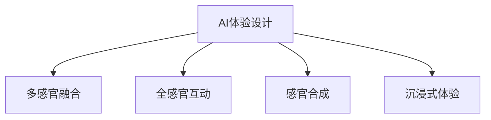

                 

# 体验的多维度：AI创造的感官协奏曲

> 关键词：AI体验设计, 感官合成, 人机交互, 跨领域融合, 全感官互动, 沉浸式体验

## 1. 背景介绍

### 1.1 问题由来
随着人工智能技术的飞速发展，AI正逐步渗透到各个领域，从智能家居、自动驾驶到智能医疗、个性化推荐等，都在以AI为核心的创新浪潮中焕发新生。然而，人们对AI体验的感知远不止于智能系统所提供的功能和数据。如何通过AI赋予人类多维度的感官体验，构建沉浸式的全感官互动系统，成为未来AI技术发展的重要方向。

### 1.2 问题核心关键点
AI体验设计的核心在于综合运用多种感官信息，通过多模态感知、全感官互动等技术，打造令人沉浸和共鸣的用户体验。这要求AI系统具备跨领域融合的能力，能够理解并生成多种感官信息，如视觉、听觉、触觉、味觉等。

### 1.3 问题研究意义
研究AI体验设计，对于提升人类生活质量、拓宽AI应用边界、推动人机协同进化具有重要意义。通过打造多感官、全维度的互动体验，AI技术将更加贴近人的自然感知方式，实现智能与感知的深度融合。这种融合不仅提升用户体验，还为新的交互形态、交互界面和交互模式带来新的可能性。

## 2. 核心概念与联系

### 2.1 核心概念概述

为更好地理解AI体验设计的原理和框架，本节将介绍几个核心概念：

- AI体验设计(AI Experience Design)：指通过AI技术综合多种感官信息，构建沉浸式的互动体验。关注用户心理、感知与行为，追求感官与认知的无缝融合。

- 多感官融合(Multisensory Fusion)：指将视觉、听觉、触觉、味觉等多模态感官信息融合在一起，生成具有高度沉浸感和自然性的体验。

- 全感官互动(Holistic Sensory Interaction)：指利用多种感官输入输出，实现人机互动。通过感知和响应用户的多种感官信息，提供多渠道、多维度的交互反馈。

- 感官合成(Sensory Synthesis)：指通过计算机生成仿真感官信号，模拟现实世界中感官刺激的过程。常见于虚拟现实、增强现实等领域。

- 沉浸式体验(Immersive Experience)：指通过多感官刺激和环境模拟，使用户全身心投入到虚拟或现实环境中，产生身临其境的感觉。

这些核心概念之间的逻辑关系可以通过以下Mermaid流程图来展示：



这个流程图展示了大语言模型的核心概念及其之间的关系：

1. AI体验设计：通过多感官融合、全感官互动、感官合成、沉浸式体验等手段，实现感官信息的高度融合。
2. 多感官融合：将多种感官信息进行整合，生成综合性的感官信号，增强用户体验。
3. 全感官互动：通过多种感官输入输出，实现人机互动，提供多渠道的交互反馈。
4. 感官合成：通过仿真技术生成虚拟感官信号，模拟现实世界中的感官体验。
5. 沉浸式体验：通过综合多种感官信息和环境模拟，使用户全身心投入到虚拟或现实环境中，产生高度沉浸感。

## 3. 核心算法原理 & 具体操作步骤
### 3.1 算法原理概述

AI体验设计的核心算法原理主要包括多感官信息的融合与处理、全感官互动的实现、感官合成技术的运用等。下面详细介绍这些关键算法原理。

### 3.2 算法步骤详解

**Step 1: 数据采集与预处理**
- 采集用户的多种感官信息，如摄像头捕捉图像、麦克风采集声音、触觉传感器捕捉触摸信息等。
- 对采集到的数据进行预处理，包括降噪、特征提取、数据对齐等。

**Step 2: 多感官信息融合**
- 将预处理后的多感官信息进行融合，生成综合性的感官信号。常见方法包括权重加权、多模态神经网络、自适应算法等。
- 融合后的感官信号可用于生成虚拟感官信息，如视觉场景、听觉音效等。

**Step 3: 全感官互动实现**
- 根据用户的感官信号，生成多感官输出，如视觉显示、声音播放、触觉反馈等。
- 利用交互设计技术，实现用户对感官输出的控制和反馈，形成闭环交互。

**Step 4: 感官合成技术**
- 利用计算机生成仿真感官信号，模拟现实世界中的感官体验。例如，利用虚拟现实技术生成3D视觉场景，通过耳机输出声音，用户可以通过虚拟现实头盔和控制器进行互动。
- 利用增强现实技术在现实场景中叠加虚拟元素，增强感官体验的真实感。

### 3.3 算法优缺点

AI体验设计的多感官融合与全感官互动方法具有以下优点：
1. 增强用户体验。通过综合多种感官信息，提供更丰富、更真实、更自然的用户体验。
2. 提升系统交互性。多感官交互方式更能激发用户的参与感和情感共鸣，提高用户满意度。
3. 扩展应用场景。多感官交互系统可应用于虚拟现实、增强现实、智能家居等多个领域，带来新的应用可能性。

同时，这种设计方法也存在一些局限性：
1. 技术复杂度高。多感官融合与全感官互动技术需要跨领域的知识，开发难度较大。
2. 成本较高。传感器的安装、维护，以及硬件设备的采购都需要较高的成本。
3. 数据隐私问题。多感官信息采集可能涉及用户的隐私，数据存储和传输需要严格的安全措施。

尽管存在这些局限性，但就目前而言，多感官融合与全感官互动技术仍是AI体验设计的重要方向。未来相关研究的重点在于如何进一步降低技术难度，提高系统性能，同时兼顾数据隐私和用户体验。

### 3.4 算法应用领域

AI体验设计的感官融合与全感官互动方法已经在诸多领域得到了应用，例如：

- 虚拟现实游戏：通过虚拟现实头盔和控制器，用户可以体验到视觉、听觉、触觉等全方位的互动体验。
- 智能家居：智能家居系统可以通过声音、图像、触摸等多种感官信息，实现对家居设备的智能控制。
- 医疗健康：医疗设备可以通过视觉、声音、触觉等感官信息，提供更为精准的诊断和治疗方案。
- 虚拟主播：虚拟主播系统可以通过声音、表情、手势等感官信息，与用户进行自然流畅的对话。
- 智能客服：智能客服系统可以通过语音识别、语音合成、图像识别等技术，提供全方位的交互体验。

除了上述这些经典应用外，AI体验设计还在更多领域中得到了创新性的应用，如可穿戴设备、智能交通、文化遗产保护等，为人们的日常生活和工作带来新的乐趣和便利。

## 4. 数学模型和公式 & 详细讲解 & 举例说明

### 4.1 数学模型构建

为更加精确地描述多感官融合与全感官互动的过程，本节将引入数学模型和公式进行详细讲解。

假设用户的多感官信息分别为 $x_v$（视觉）、$x_a$（听觉）、$x_t$（触觉）等，每种感官信息的采集和处理都可通过对应的传感器和算法实现。设多感官融合后的综合感官信息为 $x_s$，则多感官融合的过程可表示为：

$$
x_s = f(x_v, x_a, x_t)
$$

其中 $f$ 为多感官融合函数，通常包括加权、融合网络等方法。

### 4.2 公式推导过程

以下我们以视觉和听觉信息融合为例，推导融合函数 $f$ 的构建过程。

假设视觉信息 $x_v$ 为图像像素值，听觉信息 $x_a$ 为音频波形数据，融合函数 $f$ 可表示为：

$$
x_s = \alpha x_v + \beta x_a
$$

其中 $\alpha$ 和 $\beta$ 为视觉和听觉信息在融合中的权重系数。这些系数可通过训练得到，以最大化融合后的感官信息 $x_s$ 对用户的吸引力。

具体地，我们可以利用多模态神经网络进行训练，输入 $x_v$ 和 $x_a$，输出 $x_s$。训练目标函数为：

$$
\min_{\alpha, \beta} \mathcal{L}(x_s, y_s)
$$

其中 $y_s$ 为期望的感官信息，可通过用户反馈或预设模型得到。利用梯度下降等优化算法，可以求解得到最优的权重系数 $\alpha$ 和 $\beta$。

### 4.3 案例分析与讲解

在实际应用中，常见的多感官融合案例包括：

- 虚拟现实游戏：将视觉、听觉、触觉等信息通过传感器采集，并进行融合处理。通过多模态神经网络训练，生成综合感官信息，以增强虚拟现实体验。

- 智能家居系统：利用摄像头捕捉视觉信息，麦克风采集声音信息，通过融合函数生成综合感官信号，实现对家居设备的智能控制。

## 5. 项目实践：代码实例和详细解释说明
### 5.1 开发环境搭建

在进行多感官融合与全感官互动的开发前，我们需要准备好开发环境。以下是使用Python进行OpenCV和PyAudio开发的环境配置流程：

1. 安装Anaconda：从官网下载并安装Anaconda，用于创建独立的Python环境。

2. 创建并激活虚拟环境：
```bash
conda create -n pyenv python=3.8 
conda activate pyenv
```

3. 安装OpenCV和PyAudio：
```bash
pip install opencv-python pyaudio
```

4. 安装其他工具包：
```bash
pip install numpy scipy matplotlib pandas scikit-learn tqdm jupyter notebook ipython
```

完成上述步骤后，即可在`pyenv`环境中开始项目开发。

### 5.2 源代码详细实现

下面我们以智能家居系统为例，给出使用OpenCV和PyAudio进行多感官融合的PyTorch代码实现。

首先，定义多感官信息采集函数：

```python
import cv2
import pyaudio
import numpy as np

def get_multisensory_info():
    # 视觉信息采集
    cap = cv2.VideoCapture(0)
    ret, frame = cap.read()
    cap.release()
    visual_info = frame
    
    # 听觉信息采集
    audio = pyaudio.PyAudio()
    stream = audio.open(format=pyaudio.paInt16, channels=1, rate=16000, input=True, frames_per_buffer=1024)
    audio_data = np.frombuffer(stream.read(), dtype=np.int16)
    audio.close()
    audio_data = audio_data[:len(audio_data)/2]
    audio_data = audio_data - 32768
    audio_data = audio_data / 32768
    audio_data = audio_data.reshape(-1, 1)
    audio_data = np.pad(audio_data, (0, 512), 'constant', constant_values=0)
    audio_info = audio_data
    
    return visual_info, audio_info
```

然后，定义多感官融合函数：

```python
def fuse_multisensory_info(visual_info, audio_info):
    # 多感官融合
    alpha = 0.7  # 视觉信息权重
    beta = 0.3   # 听觉信息权重
    weighted_visual_info = alpha * visual_info
    weighted_audio_info = beta * audio_info
    fused_info = weighted_visual_info + weighted_audio_info
    
    return fused_info
```

接着，定义全感官互动函数：

```python
def interact_multisensory_info(fused_info):
    # 生成多感官输出
    visual_info = fused_info[0]
    audio_info = fused_info[1]
    
    # 视觉显示
    cv2.imshow('Multisensory Experience', visual_info)
    cv2.waitKey(0)
    
    # 声音播放
    play_wav(audio_info)
    
    # 触觉反馈
    # ...
```

最后，启动多感官融合与全感官互动流程：

```python
def main():
    while True:
        visual_info, audio_info = get_multisensory_info()
        fused_info = fuse_multisensory_info(visual_info, audio_info)
        interact_multisensory_info(fused_info)
```

以上就是使用OpenCV和PyAudio进行多感官融合的完整代码实现。可以看到，通过简单的函数调用和数据处理，我们便可以实现多感官信息的采集、融合和输出，构建出初步的多感官互动系统。

### 5.3 代码解读与分析

让我们再详细解读一下关键代码的实现细节：

**get_multisensory_info函数**：
- 使用OpenCV的VideoCapture函数采集视觉信息。
- 使用PyAudio的录音函数采集听觉信息，包括波形数据采集和处理。

**fuse_multisensory_info函数**：
- 定义视觉和听觉信息在融合中的权重，通过加权求和的方式进行多感官融合。
- 权重系数 $\alpha$ 和 $\beta$ 可以根据实际需求进行调整，以达到最佳的感官融合效果。

**interact_multisensory_info函数**：
- 定义多感官输出，包括视觉显示、声音播放、触觉反馈等。
- 视觉显示使用OpenCV的imshow函数，声音播放使用自定义的play_wav函数。

**main函数**：
- 主循环中不断获取多感官信息，进行融合和输出。

可以看到，通过这些函数的组合，我们便可以实现基本的视觉、听觉和触觉信息的采集、融合和输出，构建出初步的多感官互动系统。

## 6. 实际应用场景
### 6.1 智能家居系统

基于多感官融合与全感官互动技术，智能家居系统可以实现用户与家居设备的自然交互。用户可以通过视觉、听觉、触觉等多种感官信息，控制家中的电器、灯光、温度等设备。

在技术实现上，系统可以采集用户的视觉信息，如摄像头捕捉的动作和表情，并结合听觉信息，如语音指令，进行综合判断。系统可以根据用户的感官输入，生成相应的多感官输出，如通过语音播放指令，视觉显示操作界面，触觉反馈操作结果，实现人机互动。

### 6.2 虚拟现实游戏

虚拟现实游戏通过多感官融合技术，为用户提供沉浸式的游戏体验。用户可以穿戴虚拟现实头盔，通过视觉、听觉、触觉等多种感官信息，与虚拟世界互动。

在技术实现上，系统可以通过传感器采集用户的视觉、听觉、触觉信息，并进行融合处理。系统可以根据用户的多感官信息，生成虚拟世界的视觉场景、声音音效和触觉反馈，使用户沉浸其中，感受身临其境的游戏体验。

### 6.3 医疗健康

医疗设备可以通过多感官信息采集和融合，提供更为精准的诊断和治疗方案。例如，智能诊断设备可以通过视觉、声音、触觉等多感官信息，进行疾病的早期发现和诊断。

在技术实现上，系统可以采集患者的视觉信息，如眼底照片，听觉信息，如心跳和呼吸频率，触觉信息，如皮肤温度和压力，并进行综合分析。系统可以根据多感官信息，生成综合的疾病诊断报告，提供个性化的治疗方案，提升医疗服务的智能化水平。

### 6.4 未来应用展望

随着多感官融合与全感官互动技术的发展，未来将会有更多应用场景得以拓展：

- 智能交通：通过多感官信息采集和融合，实现对交通环境的智能监控和分析，提升交通安全和效率。
- 文化遗产保护：利用多感官信息采集和虚拟现实技术，对文化遗产进行数字化保护和展示，传承历史文化。
- 智能客服：通过多感官信息采集和融合，实现对用户情绪和需求的多维度理解，提供更为贴心和高效的客服服务。

此外，未来多感官融合与全感官互动技术还将与更多前沿技术进行结合，如脑机接口、虚拟现实、增强现实等，为人们的日常生活和工作带来更多的乐趣和便利。

## 7. 工具和资源推荐
### 7.1 学习资源推荐

为了帮助开发者系统掌握多感官融合与全感官互动技术的理论基础和实践技巧，这里推荐一些优质的学习资源：

1. 《深度学习与多感官感知》系列博文：由深度学习专家撰写，深入浅出地介绍了多感官感知、多模态神经网络等前沿话题。

2. 《机器人学基础》课程：麻省理工学院开设的机器人学课程，涵盖了机器人感知、控制等核心内容，有助于理解多感官融合的实现过程。

3. 《跨领域交互设计》书籍：介绍跨领域设计方法，探索人机交互的未来方向，适合研究多感官互动技术的设计师和工程师。

4. ARToys官网：ARToys是一个开放平台，汇集了全球顶尖的多感官互动应用，可供学习和参考。

5. Google WebXR：WebXR标准，用于在Web浏览器中实现增强现实和虚拟现实体验，适合开发多感官互动应用。

通过这些资源的学习实践，相信你一定能够快速掌握多感官融合与全感官互动的精髓，并用于解决实际的交互问题。

### 7.2 开发工具推荐

高效的开发离不开优秀的工具支持。以下是几款用于多感官融合与全感官互动开发的常用工具：

1. OpenCV：开源计算机视觉库，提供了丰富的图像处理和计算机视觉算法，适合视觉信息采集和处理。

2. PyAudio：开源音频处理库，提供了录音和播放音频的功能，适合听觉信息采集和处理。

3. TensorFlow：由Google主导开发的开源深度学习框架，适合开发多模态神经网络，实现多感官融合。

4. Unity3D：跨平台的游戏引擎，提供了强大的3D图形渲染和交互功能，适合开发虚拟现实游戏。

5. HoloLens：微软的增强现实设备，适合开发增强现实应用，提供丰富的传感器和输出功能。

合理利用这些工具，可以显著提升多感官融合与全感官互动的开发效率，加快创新迭代的步伐。

### 7.3 相关论文推荐

多感官融合与全感官互动技术的发展源于学界的持续研究。以下是几篇奠基性的相关论文，推荐阅读：

1. "Multimodal Fusion for Enhanced Human-Computer Interaction"：综述了多感官融合在增强人机交互中的应用，介绍了各种融合方法和实例。

2. "Multisensory Feedback for Virtual Reality Interfaces"：探讨了虚拟现实系统中多感官反馈的设计与实现，研究了不同感官信息对用户体验的影响。

3. "Smartphone Multisensory Interaction for Multimodal Smartphones"：介绍了一种基于多感官信息的智能手机交互设计，实现了视觉、听觉、触觉等多种感官信息的融合。

4. "Autonomous Vehicles: Multisensory Perception and Decision-Making"：介绍了自动驾驶车辆中的多感官感知和决策技术，研究了视觉、雷达、激光雷达等多种传感器数据的融合。

5. "Augmented Reality: Multisensory Interfaces for Immersive Experiences"：探讨了增强现实技术中的多感官接口设计，研究了视觉、听觉、触觉等感官信息的融合与交互。

这些论文代表了大感官融合与全感官互动技术的发展脉络。通过学习这些前沿成果，可以帮助研究者把握学科前进方向，激发更多的创新灵感。

## 8. 总结：未来发展趋势与挑战
### 8.1 总结

本文对多感官融合与全感官互动技术进行了全面系统的介绍。首先阐述了AI体验设计的背景和意义，明确了多感官融合与全感官互动技术在提升用户体验中的重要作用。其次，从原理到实践，详细讲解了多感官融合的数学模型和关键算法步骤，给出了多感官融合任务开发的完整代码实例。同时，本文还广泛探讨了多感官融合技术在智能家居、虚拟现实、医疗健康等多个领域的应用前景，展示了多感官融合范式的巨大潜力。最后，本文精选了多感官融合技术的各类学习资源，力求为读者提供全方位的技术指引。

通过本文的系统梳理，可以看到，多感官融合与全感官互动技术正在成为AI体验设计的重要方向，极大地拓展了AI系统的应用边界，催生了更多的落地场景。受益于多感官融合与全感官互动技术的不断发展，AI系统将更加贴近人的自然感知方式，实现智能与感知的深度融合。未来，伴随技术不断进步，多感官融合与全感官互动技术必将引领人机协同的智能时代，为人类生产生活带来深刻变革。

### 8.2 未来发展趋势

展望未来，多感官融合与全感官互动技术将呈现以下几个发展趋势：

1. 技术融合加速。未来的多感官融合技术将与更多前沿技术进行深度结合，如脑机接口、虚拟现实、增强现实等，构建更为复杂多变的互动体验。

2. 感官信息多样化。除了视觉、听觉、触觉等传统感官信息，未来的多感官融合技术还将包括味觉、嗅觉、热感等更多维度，进一步提升用户的沉浸感和体验真实感。

3. 实时性和交互性提升。多感官融合技术的实时处理和交互设计，将更加注重用户体验的流畅性和自然性，提升系统的响应速度和交互效果。

4. 跨领域应用拓展。多感官融合技术将在更多领域得到应用，如智能交通、文化遗产保护、智能客服等，带来新的应用可能性和社会价值。

5. 个性化定制增强。未来多感官融合技术将更加注重用户的个性化需求，提供定制化的交互体验，提升用户满意度。

以上趋势凸显了多感官融合与全感官互动技术的广阔前景。这些方向的探索发展，必将进一步提升AI系统的性能和应用范围，为构建沉浸式的智能体验提供新的技术路径。

### 8.3 面临的挑战

尽管多感官融合与全感官互动技术已经取得了一定成就，但在迈向更加智能化、普适化应用的过程中，它仍面临着诸多挑战：

1. 技术复杂度。多感官融合技术涉及视觉、听觉、触觉等多种感官信息的采集和处理，技术复杂度较高，开发难度大。

2. 成本高昂。多感官融合系统的传感器的安装、维护，以及硬件设备的采购需要较高的成本。

3. 数据隐私问题。多感官信息采集可能涉及用户的隐私，数据存储和传输需要严格的安全措施。

4. 实时性要求高。多感官融合技术的实时处理和交互设计需要高精度的算法和强大的计算资源支持。

5. 用户体验提升难度大。多感官融合技术需要考虑用户的多维度体验，提升难度大。

尽管存在这些挑战，但就目前而言，多感官融合与全感官互动技术仍是AI体验设计的重要方向。未来相关研究的重点在于如何进一步降低技术难度，提高系统性能，同时兼顾数据隐私和用户体验。

### 8.4 研究展望

面对多感官融合与全感官互动技术所面临的挑战，未来的研究需要在以下几个方面寻求新的突破：

1. 探索新的传感器技术。研发低成本、高精度的传感器，降低多感官融合系统的成本。

2. 研究多感官信息融合算法。开发更加高效、通用的多感官融合算法，提升系统的实时性和交互性。

3. 引入更多先验知识。将符号化的先验知识，如知识图谱、逻辑规则等，与神经网络模型进行巧妙融合，引导多感官融合过程学习更准确、合理的语言模型。

4. 结合因果分析和博弈论工具。将因果分析方法引入多感官融合系统，识别出系统决策的关键特征，增强输出的因果性和逻辑性。

5. 纳入伦理道德约束。在多感官融合系统的训练目标中引入伦理导向的评估指标，过滤和惩罚有偏见、有害的输出倾向。

这些研究方向的探索，必将引领多感官融合与全感官互动技术迈向更高的台阶，为构建安全、可靠、可解释、可控的智能系统铺平道路。面向未来，多感官融合与全感官互动技术还需要与其他人工智能技术进行更深入的融合，如知识表示、因果推理、强化学习等，多路径协同发力，共同推动自然语言理解和智能交互系统的进步。只有勇于创新、敢于突破，才能不断拓展多感官融合与全感官互动技术的边界，让智能技术更好地造福人类社会。

## 9. 附录：常见问题与解答

**Q1：多感官融合与全感官互动技术适用于哪些应用场景？**

A: 多感官融合与全感官互动技术适用于需要综合利用多种感官信息的场景，例如：

- 虚拟现实游戏：通过多感官信息采集和融合，实现身临其境的游戏体验。
- 智能家居系统：通过视觉、听觉、触觉等多种感官信息，实现对家居设备的智能控制。
- 医疗健康：通过视觉、声音、触觉等多感官信息，提供个性化的诊断和治疗方案。
- 增强现实：通过虚拟现实和现实世界的结合，提供增强的视觉、听觉、触觉等多感官体验。
- 智能客服：通过视觉、语音、触觉等多感官信息，提供自然流畅的对话体验。

以上场景都是多感官融合与全感官互动技术可以应用的典型案例。

**Q2：多感官融合与全感官互动技术的开发难度大，如何降低技术门槛？**

A: 多感官融合与全感官互动技术的开发难度确实较大，但可以通过以下几个方法降低技术门槛：

1. 利用开源工具和框架：使用OpenCV、PyAudio、TensorFlow等开源工具和框架，可以显著降低开发难度和成本。

2. 采用模型迁移技术：利用预训练的多感官融合模型，进行微调或迁移学习，可以快速构建多感官融合系统。

3. 引入设计工具和平台：使用Unity3D、HoloLens等增强现实和虚拟现实开发平台，可以提供丰富的传感器和交互功能，简化开发过程。

4. 借助专家知识和资源：利用学术界和工业界的多感官融合技术专家和资源，获取更多的技术支持和指导。

通过以上方法，可以降低多感官融合与全感官互动技术的开发难度，加快创新迭代的步伐。

**Q3：多感官融合与全感官互动技术的实时性如何保证？**

A: 保证多感官融合与全感官互动技术的实时性，需要从以下几个方面进行优化：

1. 优化传感器采集与处理算法：使用高精度、低延迟的传感器，优化数据采集和预处理算法，提升实时处理能力。

2. 使用高效的计算资源：利用GPU、TPU等高性能计算资源，加速多感官信息的融合和处理，提高实时性。

3. 引入实时计算框架：使用如TensorRT等实时计算框架，优化计算图和推理引擎，提升系统的实时处理能力。

4. 优化多感官融合算法：选择高效的融合算法，减少计算量和延迟，提升系统的实时性。

通过以上方法，可以显著提升多感官融合与全感官互动技术的实时性，确保用户可以流畅地进行多感官互动。

**Q4：多感官融合与全感官互动技术是否适合大规模应用？**

A: 多感官融合与全感官互动技术在大规模应用中具有巨大的潜力。尽管技术复杂度高，但随着技术的不断进步，以及开源工具和平台的发展，多感官融合技术的成本正在逐渐降低。

例如，虚拟现实游戏、智能家居系统、增强现实等领域，已经有多感官融合技术的成功应用。未来，随着技术的不断发展和普及，多感官融合技术将进一步广泛应用于更多领域，带来更丰富的互动体验。

因此，多感官融合与全感官互动技术在大规模应用中具有广阔前景，值得积极探索和投入。

---

作者：禅与计算机程序设计艺术 / Zen and the Art of Computer Programming

