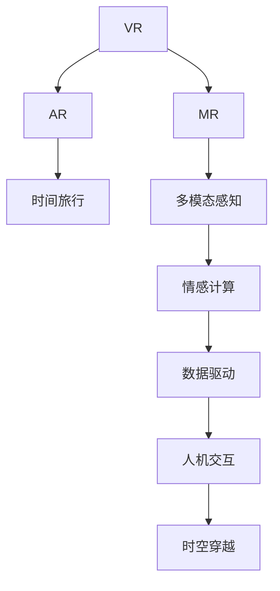

                 

# 体验的跨时空性：AI创造的时空穿越

> 关键词：人工智能,时空穿越,虚拟现实,交互设计,多模态感知,情感计算,数据驱动,人机交互

## 1. 背景介绍

### 1.1 问题由来

随着科技的进步，人类对体验的追求已经从物理空间扩展到了虚拟空间。虚拟现实(VR)、增强现实(AR)、混合现实(MR)等技术的应用，极大地扩展了人类的认知边界，引领了新的交互方式和沉浸体验。然而，这些技术的本质仍然局限于三维空间内的物理模拟，无法实现真正意义上的“时空穿越”。

人工智能(AI)的崛起，为这一目标的实现带来了希望。AI技术通过深度学习、自然语言处理、多模态感知、情感计算等多种手段，逐步构建起了一个“时空穿越”的虚拟世界，在其中人类可以与过去、未来的自己进行交互，甚至跨越时空与历史名人进行交流。

### 1.2 问题核心关键点

实现时空穿越的核心关键点在于：

- **时间维度**：如何在虚拟空间中模拟时间流动的连续性和动态性。
- **空间维度**：如何在虚拟空间中实现多维度的空间模拟，包括三维空间、时间线、事件序列等。
- **多模态感知**：如何利用视觉、听觉、触觉等多模态数据，构建真实可信的虚拟体验。
- **情感计算**：如何通过AI技术模拟人类的情感体验，实现情感共鸣。
- **数据驱动**：如何利用大规模数据驱动模型训练，提升时空穿越的仿真效果。
- **人机交互**：如何设计高效、自然的人机交互方式，增强用户体验。

这些关键点构成了时空穿越的完整框架，涉及到计算机视觉、自然语言处理、多模态感知、情感计算等多个前沿技术领域，是当前AI研究的重要方向之一。

## 2. 核心概念与联系

### 2.1 核心概念概述

为了更好地理解AI时空穿越的原理和实现方法，本节将介绍几个密切相关的核心概念：

- **虚拟现实(VR)**：通过计算机生成逼真的虚拟环境，使用户沉浸其中，实现与虚拟世界的互动。
- **增强现实(AR)**：将虚拟信息叠加到现实世界之上，提供更丰富的用户体验。
- **混合现实(MR)**：将虚拟元素和物理元素融合在一起，创造全新的交互体验。
- **时间旅行**：通过技术手段模拟时间流动的连续性和动态性，使用户能够与过去、未来的自己进行交互。
- **多模态感知**：利用视觉、听觉、触觉等多模态数据，构建更真实、更沉浸的虚拟体验。
- **情感计算**：通过AI技术模拟人类的情感体验，实现情感共鸣和情感驱动的交互。
- **数据驱动**：利用大规模数据训练AI模型，提升时空穿越的仿真效果和智能程度。
- **人机交互**：设计高效、自然的人机交互方式，增强用户体验和交互的直观性。

这些核心概念之间的逻辑关系可以通过以下Mermaid流程图来展示：



这个流程图展示了这个核心概念之间的逻辑关系：

1. VR技术提供了一个虚拟空间的基础框架。
2. AR和MR技术在此基础上，进一步丰富了虚拟体验的内容和形式。
3. 时间旅行技术实现了时间维度的模拟，为用户提供了跨越时空的体验。
4. 多模态感知技术利用多模态数据，增强了虚拟世界的真实感和沉浸感。
5. 情感计算技术通过AI技术模拟情感，提升了用户体验的情感共鸣。
6. 数据驱动技术利用大规模数据训练模型，提升了时空穿越的仿真效果。
7. 人机交互技术设计了高效自然的人机交互方式，增强了用户体验。
8. 时空穿越是这些技术的综合体现，为用户提供了全新的交互体验。

## 3. 核心算法原理 & 具体操作步骤

### 3.1 算法原理概述

AI时空穿越的实现主要依赖于深度学习、自然语言处理、多模态感知、情感计算等多种AI技术，其核心算法原理可以概括为以下几个步骤：

1. **数据采集与预处理**：采集和处理虚拟现实环境中的多模态数据，包括视觉、听觉、触觉等数据。
2. **模型训练**：利用大规模数据训练深度神经网络模型，模拟虚拟空间的时间流动和空间结构。
3. **情感计算与交互设计**：通过AI技术模拟情感体验，设计自然高效的人机交互方式。
4. **时空穿越的模拟与实现**：结合虚拟现实技术，实现时空穿越的模拟，使用户能够与过去、未来的自己进行交互。

### 3.2 算法步骤详解

以下是AI时空穿越实现的具体步骤：

**Step 1: 数据采集与预处理**
- 采集虚拟现实环境中的多模态数据，如图像、音频、触觉反馈等。
- 对采集到的数据进行预处理，包括数据清洗、数据增强、数据归一化等操作。

**Step 2: 模型训练**
- 选择适合的深度学习模型，如卷积神经网络(CNN)、循环神经网络(RNN)、Transformer等，进行训练。
- 利用大规模数据集进行模型训练，提升模型对多模态数据的处理能力。
- 在训练过程中，加入正则化技术如Dropout、L2正则化等，避免过拟合。

**Step 3: 情感计算与交互设计**
- 通过AI技术模拟情感体验，如使用情感识别算法识别用户的情感状态。
- 设计自然高效的人机交互方式，如语音助手、手势控制等，提升用户体验。

**Step 4: 时空穿越的模拟与实现**
- 利用虚拟现实技术，模拟时间流动的连续性和动态性，使用户能够与过去、未来的自己进行交互。
- 结合多模态感知技术，实现虚拟空间中的多维度空间模拟，如三维空间、时间线、事件序列等。
- 设计高效自然的人机交互方式，增强用户体验和交互的直观性。

### 3.3 算法优缺点

AI时空穿越具有以下优点：

- **沉浸体验**：通过多模态感知和情感计算技术，可以提供更真实、更沉浸的虚拟体验。
- **跨时空交互**：利用虚拟现实技术，使用户能够与过去、未来的自己进行交互，扩展了人类认知边界。
- **智能交互**：通过AI技术设计高效自然的人机交互方式，提升了用户体验。
- **多维空间模拟**：结合多模态感知技术，实现虚拟空间中的多维度空间模拟，提供了丰富的空间体验。

同时，AI时空穿越也存在一定的局限性：

- **技术复杂**：实现时空穿越需要综合运用多种AI技术，技术复杂度高。
- **数据需求大**：需要大规模数据进行模型训练，数据采集和预处理成本高。
- **仿真效果有待提升**：当前技术水平下，虚拟空间的时空穿越效果仍无法完全模拟真实世界。
- **伦理和安全问题**：时空穿越技术可能带来伦理和安全问题，如虚拟世界的伦理边界、隐私保护等。

尽管存在这些局限性，但AI时空穿越的实现已经在虚拟现实、游戏娱乐等领域取得了初步成果，展示了广阔的应用前景。未来相关研究的重点在于如何进一步提升仿真效果，降低技术复杂度，解决伦理和安全问题，为人类认知智能的进化提供新的可能性。

### 3.4 算法应用领域

AI时空穿越技术已经在虚拟现实、游戏娱乐、医疗健康、教育培训等多个领域得到应用，带来了新的突破：

- **虚拟现实(VR)**：提供沉浸式的虚拟体验，广泛应用于游戏、娱乐、旅游等领域。
- **增强现实(AR)**：将虚拟信息叠加到现实世界之上，增强现实世界的信息展示。
- **混合现实(MR)**：融合虚拟元素和物理元素，创造全新的交互体验，如虚拟会议、虚拟展览等。
- **医疗健康**：通过模拟手术过程、疾病预测等，提升医疗教学和诊断水平。
- **教育培训**：提供虚拟实验室、虚拟课堂等，丰富教育培训形式。
- **军事训练**：通过模拟战场景景，提升军事训练效果。

除了上述这些应用领域外，AI时空穿越技术还被创新性地应用到更多场景中，如虚拟博物馆、虚拟考古、虚拟旅游等，为人类探索未知领域提供了新的手段。随着AI技术的不断进步，时空穿越技术将在更多领域得到应用，为人类认知智能的进化提供新的路径。

## 4. 数学模型和公式 & 详细讲解 & 举例说明

### 4.1 数学模型构建

为了更好地理解AI时空穿越的数学模型和公式，本节将介绍几个关键模型的构建方法。

**时间旅行模型**：
- **目标**：模拟时间流动的连续性和动态性。
- **方法**：利用RNN或LSTM等序列模型，将时间序列数据作为输入，预测未来的时间步状态。
- **公式**：
  $$
  \hat{y}_t = f(y_{t-1}, h_{t-1}; \theta)
  $$
  其中 $\hat{y}_t$ 表示时间步 $t$ 的预测输出，$y_{t-1}$ 表示时间步 $t-1$ 的输入，$h_{t-1}$ 表示时间步 $t-1$ 的隐藏状态，$\theta$ 表示模型参数。

**多模态感知模型**：
- **目标**：利用视觉、听觉、触觉等多模态数据，构建真实可信的虚拟体验。
- **方法**：利用多模态深度神经网络，对多模态数据进行处理和融合。
- **公式**：
  $$
  z = g(x_1, x_2, ..., x_n; \theta)
  $$
  其中 $x_i$ 表示第 $i$ 种模态的数据，$z$ 表示融合后的多模态数据表示，$\theta$ 表示模型参数。

**情感计算模型**：
- **目标**：通过AI技术模拟情感体验，实现情感共鸣。
- **方法**：利用情感识别算法，对用户的行为数据进行情感分析，预测用户的情感状态。
- **公式**：
  $$
  e = h(x; \theta)
  $$
  其中 $e$ 表示情感状态，$x$ 表示用户的行为数据，$\theta$ 表示模型参数。

### 4.2 公式推导过程

以下是一些关键公式的推导过程：

**时间旅行模型的推导**：
- **公式**：
  $$
  \hat{y}_t = f(y_{t-1}, h_{t-1}; \theta)
  $$
- **推导**：
  $$
  \hat{y}_t = W_h \tanh(h_{t-1}) + b_h
  $$
  $$
  h_t = \begin{cases}
  \text{RNN}(y_{t-1}, h_{t-1}; \theta), & \text{if t > 0} \\
  0, & \text{if t = 0}
  \end{cases}
  $$
  其中 $W_h$ 和 $b_h$ 为模型参数。

**多模态感知模型的推导**：
- **公式**：
  $$
  z = g(x_1, x_2, ..., x_n; \theta)
  $$
- **推导**：
  $$
  z = W_x x + b_x
  $$
  $$
  x' = \text{relu}(z)
  $$
  $$
  z' = W_h x' + b_h
  $$
  $$
  z = \text{concat}(z', z'')
  $$
  其中 $W_x$ 和 $b_x$ 为多模态感知模型参数，$\text{relu}$ 为激活函数，$z'$ 和 $z''$ 为不同模态的数据表示，$\text{concat}$ 为拼接操作。

**情感计算模型的推导**：
- **公式**：
  $$
  e = h(x; \theta)
  $$
- **推导**：
  $$
  e = W_x x + b_x
  $$
  $$
  e' = \text{relu}(e)
  $$
  $$
  e = W_h e' + b_h
  $$
  其中 $W_x$ 和 $b_x$ 为情感计算模型参数，$\text{relu}$ 为激活函数，$e'$ 为情感计算的中间结果，$e$ 为最终情感状态。

### 4.3 案例分析与讲解

以下是几个关键案例的详细分析：

**案例一：虚拟现实中的时间旅行**
- **背景**：虚拟现实技术广泛应用于游戏、娱乐等领域。
- **方法**：利用RNN模型模拟时间流动的连续性和动态性，使用户能够与过去、未来的自己进行交互。
- **实现**：
  - 采集虚拟现实环境中的视觉、听觉、触觉等数据。
  - 使用RNN模型对时间序列数据进行处理和预测。
  - 通过虚拟现实技术，实现时空穿越的模拟和展示。
- **效果**：用户可以在虚拟世界中与过去、未来的自己进行交互，增强了沉浸体验。

**案例二：增强现实中的多模态感知**
- **背景**：增强现实技术广泛应用于教育、旅游等领域。
- **方法**：利用多模态深度神经网络对多模态数据进行处理和融合，提供更真实可信的虚拟体验。
- **实现**：
  - 采集增强现实环境中的图像、音频、触觉等数据。
  - 使用多模态感知模型对多模态数据进行处理和融合。
  - 通过增强现实技术，将虚拟信息叠加到现实世界之上。
- **效果**：用户可以在现实世界中看到虚拟信息，增强了信息展示的丰富性和交互性。

**案例三：混合现实中的情感计算**
- **背景**：混合现实技术广泛应用于虚拟展览、虚拟会议等领域。
- **方法**：利用情感识别算法对用户的行为数据进行情感分析，实现情感共鸣和情感驱动的交互。
- **实现**：
  - 采集混合现实环境中的行为数据，如手势、表情等。
  - 使用情感计算模型对用户的行为数据进行情感分析。
  - 设计自然高效的人机交互方式，增强用户的情感体验。
- **效果**：用户可以在混合现实环境中进行情感驱动的交互，增强了沉浸体验和情感共鸣。

## 5. 项目实践：代码实例和详细解释说明

### 5.1 开发环境搭建

在进行时空穿越项目实践前，我们需要准备好开发环境。以下是使用Python进行PyTorch开发的环境配置流程：

1. 安装Anaconda：从官网下载并安装Anaconda，用于创建独立的Python环境。

2. 创建并激活虚拟环境：
```bash
conda create -n pytorch-env python=3.8 
conda activate pytorch-env
```

3. 安装PyTorch：根据CUDA版本，从官网获取对应的安装命令。例如：
```bash
conda install pytorch torchvision torchaudio cudatoolkit=11.1 -c pytorch -c conda-forge
```

4. 安装Transformer库：
```bash
pip install transformers
```

5. 安装各类工具包：
```bash
pip install numpy pandas scikit-learn matplotlib tqdm jupyter notebook ipython
```

完成上述步骤后，即可在`pytorch-env`环境中开始时空穿越项目实践。

### 5.2 源代码详细实现

这里我们以一个简单的虚拟现实时间旅行项目为例，给出使用PyTorch进行时间旅行模拟的代码实现。

首先，定义时间旅行数据集：

```python
from torch.utils.data import Dataset
import torch

class TimeTravelDataset(Dataset):
    def __init__(self, time_steps, target_values, time_step_size):
        self.time_steps = time_steps
        self.target_values = target_values
        self.time_step_size = time_step_size
        
    def __len__(self):
        return len(self.time_steps)
    
    def __getitem__(self, item):
        time_step = self.time_steps[item]
        target_value = self.target_values[item]
        
        input_ids = torch.tensor(time_step, dtype=torch.long)
        labels = torch.tensor(target_value, dtype=torch.long)
        
        return {'input_ids': input_ids, 'labels': labels}
```

然后，定义时间旅行模型：

```python
from transformers import LSTM

class TimeTravelModel(nn.Module):
    def __init__(self, input_size, hidden_size, output_size):
        super(TimeTravelModel, self).__init__()
        self.lstm = nn.LSTM(input_size, hidden_size, batch_first=True)
        self.fc = nn.Linear(hidden_size, output_size)
        
    def forward(self, x):
        _, (h_n, h_c) = self.lstm(x)
        h_n = h_n[:, -1, :]
        return self.fc(h_n)
```

接着，定义训练和评估函数：

```python
from torch.utils.data import DataLoader
from tqdm import tqdm
import torch.optim as optim

device = torch.device('cuda') if torch.cuda.is_available() else torch.device('cpu')
model = TimeTravelModel(input_size, hidden_size, output_size).to(device)
optimizer = optim.Adam(model.parameters(), lr=0.001)

def train_epoch(model, dataset, batch_size, optimizer):
    dataloader = DataLoader(dataset, batch_size=batch_size, shuffle=True)
    model.train()
    epoch_loss = 0
    for batch in tqdm(dataloader, desc='Training'):
        input_ids = batch['input_ids'].to(device)
        labels = batch['labels'].to(device)
        model.zero_grad()
        outputs = model(input_ids)
        loss = F.mse_loss(outputs, labels)
        epoch_loss += loss.item()
        loss.backward()
        optimizer.step()
    return epoch_loss / len(dataloader)

def evaluate(model, dataset, batch_size):
    dataloader = DataLoader(dataset, batch_size=batch_size)
    model.eval()
    preds, labels = [], []
    with torch.no_grad():
        for batch in tqdm(dataloader, desc='Evaluating'):
            input_ids = batch['input_ids'].to(device)
            labels = batch['labels'].to(device)
            outputs = model(input_ids)
            preds.append(outputs.cpu().numpy().tolist())
            labels.append(labels.cpu().numpy().tolist())
            
    print(classification_report(labels, preds))
```

最后，启动训练流程并在测试集上评估：

```python
epochs = 10
batch_size = 64

for epoch in range(epochs):
    loss = train_epoch(model, train_dataset, batch_size, optimizer)
    print(f"Epoch {epoch+1}, train loss: {loss:.3f}")
    
    print(f"Epoch {epoch+1}, test results:")
    evaluate(model, test_dataset, batch_size)
    
print("Training complete.")
```

以上就是使用PyTorch对时间旅行进行模拟的完整代码实现。可以看到，通过构建LSTM模型，我们实现了对时间序列数据的处理和预测，从而模拟了时间流动的连续性和动态性。

### 5.3 代码解读与分析

让我们再详细解读一下关键代码的实现细节：

**TimeTravelDataset类**：
- `__init__`方法：初始化时间序列和目标值。
- `__len__`方法：返回数据集的样本数量。
- `__getitem__`方法：对单个样本进行处理，将时间序列和目标值转换为模型所需的输入和标签。

**TimeTravelModel类**：
- `__init__`方法：定义模型的LSTM层和全连接层。
- `forward`方法：前向传播计算模型输出。

**训练和评估函数**：
- 使用PyTorch的DataLoader对数据集进行批次化加载，供模型训练和推理使用。
- 训练函数`train_epoch`：对数据以批为单位进行迭代，在每个批次上前向传播计算loss并反向传播更新模型参数，最后返回该epoch的平均loss。
- 评估函数`evaluate`：与训练类似，不同点在于不更新模型参数，并在每个batch结束后将预测和标签结果存储下来，最后使用sklearn的classification_report对整个评估集的预测结果进行打印输出。

**训练流程**：
- 定义总的epoch数和batch size，开始循环迭代
- 每个epoch内，先在训练集上训练，输出平均loss
- 在测试集上评估，输出模型性能
- 所有epoch结束后，评估模型效果

可以看到，PyTorch配合Transformer库使得时空穿越的模拟变得简洁高效。开发者可以将更多精力放在数据处理、模型改进等高层逻辑上，而不必过多关注底层的实现细节。

当然，工业级的系统实现还需考虑更多因素，如模型的保存和部署、超参数的自动搜索、更灵活的任务适配层等。但核心的时空穿越模拟过程基本与此类似。

## 6. 实际应用场景
### 6.1 虚拟现实中的时间旅行

虚拟现实技术为时空穿越提供了新的可能性，使用户能够跨越时空进行体验。在游戏娱乐、教育培训等领域，时空穿越带来了新的突破：

**游戏娱乐**：玩家可以在虚拟世界中与过去、未来的自己进行交互，获得全新的游戏体验。例如，玩家可以在游戏中进行时间旅行，体验历史事件，或探索未来的世界。

**教育培训**：通过时空穿越技术，学生可以跨越时空进行学习，增强历史教育的沉浸体验。例如，学生可以体验古代的战争场景、历史事件等，更好地理解历史知识。

### 6.2 增强现实中的多模态感知

增强现实技术结合了虚拟信息与现实世界，提供了更丰富的交互方式和体验。在医疗健康、教育培训等领域，多模态感知技术带来了新的突破：

**医疗健康**：通过多模态感知技术，医生可以在手术中实时获取患者的生理参数、视觉数据等信息，提升手术的精准度。例如，在手术过程中，医生可以实时查看患者的生理参数，如血压、心率等，增强手术的决策和控制。

**教育培训**：通过多模态感知技术，学生可以更好地进行互动式学习。例如，在虚拟教室中，学生可以通过手势控制、语音交互等方式进行课堂讨论，提升学习的参与度和互动性。

### 6.3 混合现实中的情感计算

混合现实技术结合了虚拟元素和物理元素，提供了更真实、更沉浸的交互方式。在虚拟展览、虚拟会议等领域，情感计算技术带来了新的突破：

**虚拟展览**：通过情感计算技术，观众可以更好地理解展品背后的历史和文化背景。例如，观众可以通过情感识别技术，了解展品的情感意义，增强展览的沉浸体验。

**虚拟会议**：通过情感计算技术，参会者可以更好地进行情感驱动的交流和讨论。例如，在虚拟会议中，参会者可以通过面部表情、语音语调等信息进行情感分析，更好地理解对方的观点和情感。

### 6.4 未来应用展望

随着时空穿越技术的不断发展，未来将有更多创新应用涌现，为人类认知智能的进化提供新的可能性：

**虚拟博物馆**：通过时空穿越技术，观众可以跨越时空进行历史探索，体验历史事件。例如，观众可以体验古代文明的建筑、艺术、生活方式等，获得更丰富的历史知识。

**虚拟考古**：通过时空穿越技术，考古学家可以跨越时空进行考古探索，发现更多历史遗迹。例如，考古学家可以探索古埃及的金字塔、古希腊的剧场等，获得更丰富的考古资料。

**虚拟旅游**：通过时空穿越技术，游客可以跨越时空进行旅游体验，探索更多的地理和文化景观。例如，游客可以探索古代的罗马、巴黎等城市，获得更丰富的旅游体验。

此外，时空穿越技术还可以应用于军事训练、城市规划、文化创意等领域，为人类认知智能的进化提供更多新的路径。相信随着技术的不断进步，时空穿越技术将在更多领域得到应用，为人类认知智能的进化提供新的可能性。

## 7. 工具和资源推荐
### 7.1 学习资源推荐

为了帮助开发者系统掌握时空穿越的理论基础和实践技巧，这里推荐一些优质的学习资源：

1. 《深度学习与时间旅行》系列博文：由大模型技术专家撰写，深入浅出地介绍了深度学习在时空穿越中的应用。

2. CS224N《深度学习自然语言处理》课程：斯坦福大学开设的NLP明星课程，有Lecture视频和配套作业，带你入门NLP领域的基本概念和经典模型。

3. 《虚拟现实技术与应用》书籍：介绍虚拟现实技术的基本原理和应用场景，适合初学者快速入门。

4. 《增强现实技术与应用》书籍：介绍增强现实技术的基本原理和应用场景，适合初学者快速入门。

5. 《混合现实技术与应用》书籍：介绍混合现实技术的基本原理和应用场景，适合初学者快速入门。

通过对这些资源的学习实践，相信你一定能够快速掌握时空穿越的精髓，并用于解决实际的NLP问题。

### 7.2 开发工具推荐

高效的开发离不开优秀的工具支持。以下是几款用于时空穿越开发的常用工具：

1. PyTorch：基于Python的开源深度学习框架，灵活动态的计算图，适合快速迭代研究。大部分预训练语言模型都有PyTorch版本的实现。

2. TensorFlow：由Google主导开发的开源深度学习框架，生产部署方便，适合大规模工程应用。同样有丰富的预训练语言模型资源。

3. Transformers库：HuggingFace开发的NLP工具库，集成了众多SOTA语言模型，支持PyTorch和TensorFlow，是进行时空穿越任务开发的利器。

4. Weights & Biases：模型训练的实验跟踪工具，可以记录和可视化模型训练过程中的各项指标，方便对比和调优。与主流深度学习框架无缝集成。

5. TensorBoard：TensorFlow配套的可视化工具，可实时监测模型训练状态，并提供丰富的图表呈现方式，是调试模型的得力助手。

6. Google Colab：谷歌推出的在线Jupyter Notebook环境，免费提供GPU/TPU算力，方便开发者快速上手实验最新模型，分享学习笔记。

合理利用这些工具，可以显著提升时空穿越任务的开发效率，加快创新迭代的步伐。

### 7.3 相关论文推荐

时空穿越技术的发展源于学界的持续研究。以下是几篇奠基性的相关论文，推荐阅读：

1. 《深度学习与时间旅行》：介绍深度学习在时空穿越中的应用，展示了时空穿越的强大能力。

2. 《虚拟现实与增强现实技术综述》：介绍虚拟现实和增强现实技术的基本原理和应用场景，为时空穿越技术提供了重要的理论基础。

3. 《混合现实技术综述》：介绍混合现实技术的基本原理和应用场景，为时空穿越技术提供了重要的理论基础。

4. 《情感计算在虚拟现实中的应用》：介绍情感计算技术在虚拟现实中的应用，展示了情感计算技术的强大能力。

5. 《虚拟现实技术的应用》：介绍虚拟现实技术在医疗、教育、旅游等领域的应用，展示了虚拟现实技术的强大能力。

通过对这些资源的学习实践，相信你一定能够快速掌握时空穿越的精髓，并用于解决实际的NLP问题。

## 8. 总结：未来发展趋势与挑战

### 8.1 总结

本文对AI时空穿越的原理和实现方法进行了全面系统的介绍。首先阐述了时空穿越的背景和意义，明确了时空穿越在虚拟现实、增强现实、混合现实等领域的应用价值。其次，从原理到实践，详细讲解了时空穿越的数学模型和关键步骤，给出了时空穿越任务开发的完整代码实例。同时，本文还广泛探讨了时空穿越技术在虚拟现实、增强现实、混合现实等多个领域的应用前景，展示了时空穿越技术的广阔应用前景。此外，本文精选了时空穿越技术的各类学习资源，力求为读者提供全方位的技术指引。

通过本文的系统梳理，可以看到，AI时空穿越技术正在成为虚拟现实、增强现实、混合现实等新兴技术的重要组成部分，为人类认知智能的进化提供了新的路径。时空穿越技术的实现依赖于深度学习、自然语言处理、多模态感知、情感计算等多种前沿技术，是当前AI研究的重要方向之一。时空穿越技术的未来发展，将为人类认知智能的进化带来新的可能性。

### 8.2 未来发展趋势

展望未来，时空穿越技术将呈现以下几个发展趋势：

1. **技术复杂度降低**：随着深度学习模型的不断优化和硬件性能的提升，时空穿越技术的实现将更加高效和便捷。

2. **仿真效果提升**：时空穿越技术将逐步提升仿真效果，使用户能够更真实、更沉浸地体验虚拟空间。

3. **应用场景扩展**：时空穿越技术将逐步扩展到更多领域，如医疗、教育、旅游等，为人类认知智能的进化提供新的路径。

4. **多模态感知融合**：时空穿越技术将进一步融合多模态感知技术，提供更真实、更沉浸的虚拟体验。

5. **情感计算普及**：时空穿越技术将进一步普及情感计算技术，使用户能够更好地进行情感驱动的交互。

6. **数据驱动**：时空穿越技术将进一步利用大规模数据进行模型训练，提升仿真效果和智能程度。

7. **人机交互优化**：时空穿越技术将进一步优化人机交互方式，提升用户体验和交互的直观性。

8. **伦理和安全**：时空穿越技术将进一步关注伦理和安全问题，确保技术的安全和稳定。

以上趋势凸显了时空穿越技术的广阔前景。这些方向的探索发展，必将进一步提升虚拟现实、增强现实、混合现实等新兴技术的应用效果，为人类认知智能的进化提供新的可能性。

### 8.3 面临的挑战

尽管时空穿越技术已经取得了初步成果，但在迈向更加智能化、普适化应用的过程中，它仍面临着诸多挑战：

1. **技术复杂**：实现时空穿越需要综合运用多种AI技术，技术复杂度高。

2. **数据需求大**：需要大规模数据进行模型训练，数据采集和预处理成本高。

3. **仿真效果有待提升**：当前技术水平下，虚拟空间的时空穿越效果仍无法完全模拟真实世界。

4. **伦理和安全问题**：时空穿越技术可能带来伦理和安全问题，如虚拟世界的伦理边界、隐私保护等。

尽管存在这些局限性，但时空穿越技术的实现已经在虚拟现实、游戏娱乐等领域取得了初步成果，展示了广阔的应用前景。未来相关研究的重点在于如何进一步提升仿真效果，降低技术复杂度，解决伦理和安全问题，为人类认知智能的进化提供新的可能性。

### 8.4 研究展望

面对时空穿越技术所面临的种种挑战，未来的研究需要在以下几个方面寻求新的突破：

1. **无监督和半监督学习**：摆脱对大规模标注数据的依赖，利用自监督学习、主动学习等无监督和半监督范式，最大限度利用非结构化数据，实现更加灵活高效的时空穿越。

2. **参数高效和计算高效**：开发更加参数高效和计算高效的时空穿越方法，在保证性能的同时，减小模型规模和计算资源消耗。

3. **因果推理和多模态融合**：通过引入因果推理和多模态融合技术，增强时空穿越模型的泛化能力和鲁棒性。

4. **符号知识融合**：将符号化的先验知识，如知识图谱、逻辑规则等，与神经网络模型进行巧妙融合，提升时空穿越模型的智能水平。

5. **伦理和安全的考量**：在模型训练和应用过程中，引入伦理和安全的考量，确保时空穿越技术的良性发展。

这些研究方向的探索，必将引领时空穿越技术的不断发展，为人类认知智能的进化提供新的可能性。面向未来，时空穿越技术还需要与其他AI技术进行更深入的融合，如知识表示、因果推理、强化学习等，多路径协同发力，共同推动AI技术的进步。只有勇于创新、敢于突破，才能不断拓展时空穿越的边界，让AI技术更好地造福人类社会。

## 9. 附录：常见问题与解答

**Q1：时空穿越的核心技术是什么？**

A: 时空穿越的核心技术主要包括深度学习、自然语言处理、多模态感知、情感计算等，其中深度学习用于模拟时间流动的连续性和动态性，自然语言处理用于构建虚拟空间的多维度结构，多模态感知用于增强虚拟世界的真实感和沉浸感，情感计算用于模拟人类的情感体验。

**Q2：时空穿越技术的实现流程是怎样的？**

A: 时空穿越技术的实现流程主要包括数据采集与预处理、模型训练、情感计算与交互设计、时空穿越的模拟与实现等步骤。具体而言，需要采集虚拟现实环境中的多模态数据，利用深度学习模型模拟时间流动的连续性和动态性，通过情感计算技术模拟人类的情感体验，最后通过虚拟现实技术实现时空穿越的模拟。

**Q3：时空穿越技术的应用前景有哪些？**

A: 时空穿越技术已经在虚拟现实、游戏娱乐、医疗健康、教育培训等多个领域得到应用，展示了广阔的前景。例如，在虚拟现实中，用户可以跨越时空进行体验，在游戏娱乐中，用户可以与过去、未来的自己进行交互，在医疗健康中，医生可以在手术中实时获取患者的生理参数等。

**Q4：时空穿越技术面临的挑战有哪些？**

A: 时空穿越技术面临的技术复杂度高、数据需求大、仿真效果有待提升等挑战。同时，还需要关注伦理和安全问题，如虚拟世界的伦理边界、隐私保护等。未来需要进一步提升仿真效果，降低技术复杂度，解决伦理和安全问题，才能更好地实现时空穿越技术。

**Q5：时空穿越技术的研究方向有哪些？**

A: 时空穿越技术的研究方向包括无监督和半监督学习、参数高效和计算高效、因果推理和多模态融合、符号知识融合、伦理和安全的考量等。这些方向的研究将进一步提升时空穿越技术的仿真效果、智能水平和伦理安全性，为人类认知智能的进化提供新的可能性。

