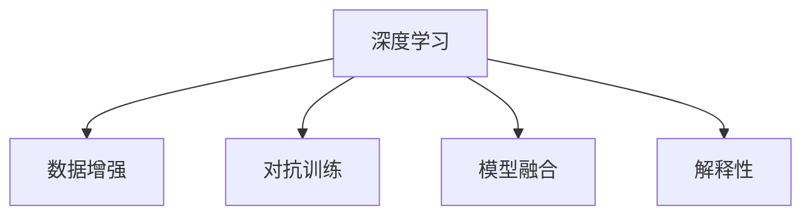

                 

# 体验真实性验证器：AI时代的authenticity检测仪

## 1. 背景介绍

### 1.1 问题由来
在数字化时代，信息的真实性验证变得越来越重要。假新闻、深度伪造（deepfakes）、恶意信息等对社会的危害日益严重，如何构建高效可靠的authenticity检测器成为了信息时代的一大挑战。近年来，随着人工智能技术的迅猛发展，深度学习模型在图像、视频、音频等媒体领域表现出色，成为实现真实性验证的重要手段。

### 1.2 问题核心关键点
为了有效应对这一挑战，需要开发一种基于深度学习的自动真实性检测器，用于鉴别文本、图像、视频、音频等各类信息源的真实性。该系统需要具备以下核心能力：
- **数据理解**：能够自动分析输入信息的特征，识别异常与可疑信息。
- **模式识别**：通过构建可解释的特征模型，学习鉴别信息真实性的模式。
- **环境适应**：在不断变化的环境下，持续优化和更新模型，保持检测器的有效性。
- **鲁棒性**：面对对抗样本和伪装攻击，仍能稳定识别出真实性。
- **可解释性**：解释检测过程和结果，增加用户信任。

## 2. 核心概念与联系

### 2.1 核心概念概述

为更好地理解真实性验证器的工作原理，本节将介绍几个密切相关的核心概念：

- **深度学习（Deep Learning）**：一种通过构建多层神经网络来学习复杂非线性映射的机器学习方法，广泛应用于图像、语音、文本等媒体处理。
- **数据增强（Data Augmentation）**：通过对训练样本进行随机变换，增加数据的多样性，避免过拟合，提高模型的泛化能力。
- **对抗训练（Adversarial Training）**：通过引入对抗样本，训练模型识别和防御攻击，增强模型的鲁棒性。
- **模型融合（Model Ensemble）**：将多个模型组合起来，通过投票或加权平均等方式，提高检测的准确性和稳定性。
- **解释性（Explainability）**：解释模型决策过程的能力，使得用户能够理解和信任检测结果。

这些核心概念之间的逻辑关系可以通过以下Mermaid流程图来展示：



这个流程图展示了几大核心概念之间的相互关系，以及它们在大规模真实性验证器中的协同工作。

## 3. 核心算法原理 & 具体操作步骤
### 3.1 算法原理概述

基于深度学习的真实性验证器，其核心思想是通过构建强大的特征提取器和分类器，自动分析输入信息的真实性。通常，该系统包括预处理、特征提取、模型训练和预测等多个步骤：

1. **预处理**：对输入信息进行清洗、格式转换等操作，以便于模型处理。
2. **特征提取**：利用深度学习模型提取输入信息的特征表示，捕捉其语义、模式和上下文等关键信息。
3. **模型训练**：在标注好的数据集上训练分类器，学习真实性判别的决策边界。
4. **预测**：对新的输入信息进行特征提取和分类，判断其真实性。

### 3.2 算法步骤详解

以下详细介绍基于深度学习的真实性验证器的算法步骤：

**Step 1: 数据预处理**
- 收集各种类型的真实性标注数据集，如假新闻、深度伪造视频等。
- 对数据进行预处理，包括清洗、去重、格式转换等操作。
- 对图像、视频等非结构化数据进行必要的特征提取。

**Step 2: 特征提取**
- 使用卷积神经网络（CNN）或残差网络（ResNet）等模型，提取输入信息的局部特征。
- 使用长短期记忆网络（LSTM）或双向循环神经网络（BiRNN）等模型，捕捉信息的序列关系。
- 使用预训练的BERT、GPT等语言模型，提取文本的语义信息。

**Step 3: 模型训练**
- 选择合适的损失函数，如交叉熵损失、余弦相似度损失等，定义真实性检测任务。
- 使用随机梯度下降（SGD）或Adam等优化算法，更新模型参数。
- 应用数据增强技术，如旋转、缩放、噪声注入等，增加数据多样性。
- 引入对抗训练，如FGM、PGD等方法，增加模型鲁棒性。

**Step 4: 预测与验证**
- 对测试数据集进行特征提取和预测，使用阈值分割得到真实性判定。
- 在验证集上评估模型性能，如准确率、召回率、F1分数等。
- 根据评估结果，调整模型参数和训练策略，不断优化模型性能。

### 3.3 算法优缺点

基于深度学习的真实性验证器具有以下优点：
1. 自动学习特征：能够自动提取输入信息的高级特征，无需手工设计特征。
2. 高效处理多模态数据：可以同时处理文本、图像、视频等多种类型的数据。
3. 鲁棒性高：通过对抗训练，模型能够防御对抗样本攻击。
4. 可解释性强：通过可视化手段，用户可以理解模型的决策过程。

同时，该方法也存在一定的局限性：
1. 对标注数据依赖高：需要大量标注数据，标注成本高。
2. 训练复杂度高：深度模型训练时间较长，需要大量计算资源。
3. 过拟合风险大：模型容易过拟合，泛化能力有限。
4. 数据隐私问题：真实性验证过程中可能侵犯用户隐私。

尽管存在这些局限性，但基于深度学习的真实性验证器仍是大规模检测任务的首选方法。未来相关研究的重点在于如何进一步降低标注数据的依赖，提高模型的泛化能力，同时兼顾可解释性和数据隐私等因素。

### 3.4 算法应用领域

基于深度学习的真实性验证器，在各个领域都有广泛的应用前景，例如：

- **新闻验证**：用于检测新闻报道的真假，防止假新闻传播。
- **视频内容审核**：用于检测视频中的伪造、篡改行为，保障内容真实性。
- **金融安全**：用于检测金融交易中的欺诈行为，保障交易安全。
- **社交媒体监控**：用于检测社交媒体上的虚假信息，防止虚假内容传播。
- **医学验证**：用于检测医学图像的真实性，保障医学研究的可靠性。

除了上述这些经典应用外，真实性验证器也被创新性地应用到更多场景中，如电商商品验证、司法证据识别等，为信息社会的多元化应用提供了新的解决方案。

## 4. 数学模型和公式 & 详细讲解 & 举例说明

### 4.1 数学模型构建

在真实性验证中，我们通常使用分类任务进行建模，目标是将输入信息分为真实和虚假两类。假设真实性验证器接收的输入为 $x$，输出为 $y \in \{0,1\}$，其中 $0$ 表示虚假，$1$ 表示真实。我们的目标是最大化以下对数似然函数：

$$
L(x; \theta) = \log p(y|x; \theta)
$$

其中 $p(y|x; \theta)$ 为模型在输入 $x$ 下预测真实性为 $y$ 的概率，$\theta$ 为模型参数。

### 4.2 公式推导过程

在深度学习中，我们通常使用神经网络对上述对数似然函数进行建模。以卷积神经网络（CNN）为例，假设我们使用 $L$ 层卷积和池化层，得到特征图 $z_L$。通过全连接层和 sigmoid 激活函数，得到输出 $y$ 的概率：

$$
y = \sigma(W_L z_L + b_L)
$$

其中 $W_L$ 和 $b_L$ 为全连接层的权重和偏置。通过反向传播算法，可以计算损失函数对各层参数的梯度，更新模型参数 $\theta$，最小化损失函数。

### 4.3 案例分析与讲解

以文本真实性验证为例，假设我们使用预训练的BERT模型作为特征提取器，利用其语义表示能力提取文本特征 $z$。然后，通过一个全连接层和sigmoid函数输出 $y$ 的概率：

$$
y = \sigma(W_L z + b_L)
$$

其中 $W_L$ 和 $b_L$ 为全连接层的权重和偏置。通过最大化对数似然函数 $L(x; \theta)$，训练得到最优参数 $\theta$，构建真实性验证器。

## 5. 项目实践：代码实例和详细解释说明
### 5.1 开发环境搭建

在进行真实性验证器的开发前，我们需要准备好开发环境。以下是使用Python进行PyTorch开发的环境配置流程：

1. 安装Anaconda：从官网下载并安装Anaconda，用于创建独立的Python环境。

2. 创建并激活虚拟环境：
```bash
conda create -n pytorch-env python=3.8 
conda activate pytorch-env
```

3. 安装PyTorch：根据CUDA版本，从官网获取对应的安装命令。例如：
```bash
conda install pytorch torchvision torchaudio cudatoolkit=11.1 -c pytorch -c conda-forge
```

4. 安装TensorBoard：用于实时监测模型训练状态，并提供丰富的图表呈现方式。
```bash
pip install tensorboard
```

完成上述步骤后，即可在`pytorch-env`环境中开始真实性验证器的开发。

### 5.2 源代码详细实现

以下是使用PyTorch实现文本真实性验证器的代码示例：

```python
import torch
import torch.nn as nn
from transformers import BertForSequenceClassification

# 定义模型
class AuthenticityClassifier(nn.Module):
    def __init__(self):
        super(AuthenticityClassifier, self).__init__()
        self.bert = BertForSequenceClassification.from_pretrained('bert-base-uncased', num_labels=2)
        
    def forward(self, input_ids, attention_mask):
        outputs = self.bert(input_ids, attention_mask=attention_mask)
        return outputs.logits

# 加载数据
from transformers import BertTokenizer, DataCollatorForLanguageModeling

tokenizer = BertTokenizer.from_pretrained('bert-base-uncased')
train_dataset = ...
dev_dataset = ...
test_dataset = ...

# 定义模型和优化器
model = AuthenticityClassifier()
optimizer = torch.optim.AdamW(model.parameters(), lr=2e-5)

# 定义损失函数
criterion = nn.BCEWithLogitsLoss()

# 训练过程
for epoch in range(num_epochs):
    model.train()
    train_loss = 0.0
    train_acc = 0.0
    for batch in train_dataloader:
        inputs, labels = batch
        outputs = model(inputs.input_ids, attention_mask=inputs.attention_mask)
        loss = criterion(outputs, labels)
        loss.backward()
        optimizer.step()
        train_loss += loss.item()
        train_acc += torch.nn.functional.binary_cross_entropy_with_logits(outputs, labels).item()
    
    train_loss /= len(train_dataloader)
    train_acc /= len(train_dataloader)
    print(f'Epoch {epoch+1}, Train Loss: {train_loss:.4f}, Train Acc: {train_acc:.4f}')

# 评估过程
model.eval()
dev_loss = 0.0
dev_acc = 0.0
for batch in dev_dataloader:
    inputs, labels = batch
    with torch.no_grad():
        outputs = model(inputs.input_ids, attention_mask=inputs.attention_mask)
        loss = criterion(outputs, labels)
        dev_loss += loss.item()
        dev_acc += torch.nn.functional.binary_cross_entropy_with_logits(outputs, labels).item()

dev_loss /= len(dev_dataloader)
dev_acc /= len(dev_dataloader)
print(f'Validation Loss: {dev_loss:.4f}, Validation Acc: {dev_acc:.4f}')

# 预测过程
model.eval()
predictions = []
for batch in test_dataloader:
    inputs, labels = batch
    with torch.no_grad():
        outputs = model(inputs.input_ids, attention_mask=inputs.attention_mask)
        predictions.append(outputs.max(dim=1)[1])
```

这个代码示例展示了如何使用BERT模型进行文本真实性验证，包括模型定义、数据加载、优化器设置、损失函数计算、训练评估和预测等步骤。

### 5.3 代码解读与分析

让我们再详细解读一下关键代码的实现细节：

**AuthenticityClassifier类**：
- `__init__`方法：定义模型架构，包括BERT分类器。
- `forward`方法：定义模型的前向传播过程，输入为token ids和attention mask，输出为预测的概率。

**数据加载**：
- 使用`BertTokenizer`进行文本预处理，包括分词、标记化、拼接等操作。
- 使用`DataCollatorForLanguageModeling`进行数据分批和归一化处理。

**模型和优化器**：
- 定义模型为`AuthenticityClassifier`，继承自`nn.Module`。
- 使用`AdamW`优化器进行模型参数更新，设置初始学习率。

**损失函数**：
- 定义交叉熵损失函数，用于计算真实性检测的准确率。

**训练过程**：
- 对数据集进行迭代，每个epoch内对模型进行前向传播和反向传播，更新参数。
- 在训练集上记录损失和准确率，及时调整模型。

**评估过程**：
- 在验证集上对模型进行评估，记录损失和准确率。

**预测过程**：
- 对测试集进行预测，得到最终的真实性分类结果。

可以看到，PyTorch配合Transformers库使得真实性验证器的代码实现变得简洁高效。开发者可以将更多精力放在数据处理、模型改进等高层逻辑上，而不必过多关注底层的实现细节。

当然，工业级的系统实现还需考虑更多因素，如模型的保存和部署、超参数的自动搜索、更灵活的任务适配层等。但核心的真实性验证器范式基本与此类似。

## 6. 实际应用场景
### 6.1 社交媒体监控

真实性验证器在社交媒体监控中的应用，可以帮助平台快速检测和处理虚假信息。社交媒体平台面临大量用户上传内容，需要实时监测信息真实性，防止虚假信息的传播。

在技术实现上，可以收集平台上的热门话题和用户反馈，构建监督数据集。在此基础上，对预训练模型进行微调，训练得到真实性检测器。检测器可以实时监测用户上传的内容，识别出虚假信息并加以处理，保障平台信息真实性。

### 6.2 金融欺诈检测

金融领域中，虚假信息和欺诈行为对投资者和市场稳定造成严重影响。真实性验证器可以用于检测金融交易中的欺诈行为，及时预警异常交易，保障金融安全。

在实践中，可以收集金融交易的历史数据，标注出虚假和欺诈行为。在此基础上，对预训练模型进行微调，训练得到真实性检测器。检测器可以实时监测交易记录，识别出可疑交易并发出警报，协助金融机构及时采取应对措施。

### 6.3 医学影像验证

医学研究中，图像的真实性验证对确保医学研究的可靠性至关重要。图像造假和篡改会对医学研究造成严重干扰，导致误导性结论。

在实践中，可以收集医学影像数据，标注出真实和造假图像。在此基础上，对预训练模型进行微调，训练得到真实性检测器。检测器可以对新上传的医学影像进行验证，识别出造假行为，防止虚假信息误导医学研究。

### 6.4 未来应用展望

随着深度学习技术的不断发展，基于真实性验证器的应用场景将不断拓展。未来，真实性验证器将在更多领域得到应用，为信息社会带来新的解决方案。

在智慧城市治理中，真实性验证器可以用于检测舆情信息的真实性，防止虚假信息传播，保障城市安全。在教育领域，可以用于检测作业的真实性，防止抄袭和作弊行为。在政治领域，可以用于检测虚假广告和政治宣传，防止信息误导。

总之，随着技术的日益成熟，真实性验证器必将成为信息时代的重要工具，为构建安全、可靠、可信的信息环境提供有力支撑。

## 7. 工具和资源推荐
### 7.1 学习资源推荐

为了帮助开发者系统掌握真实性验证器的理论基础和实践技巧，这里推荐一些优质的学习资源：

1. 《深度学习》课程（Coursera）：由吴恩达教授讲授，系统讲解深度学习原理和应用。
2. 《TensorFlow实战》书籍：深入浅出地介绍了TensorFlow的基本操作和应用，适合入门学习。
3. 《深度学习框架PyTorch》书籍：由PyTorch官方编写，详细介绍了PyTorch的使用方法和实践技巧。
4. 《Transformers》书籍：介绍Transformer模型的原理和应用，适合深度学习从业者阅读。
5. 《自然语言处理综论》书籍：涵盖自然语言处理的各个方面，适合深入学习NLP技术。

通过对这些资源的学习实践，相信你一定能够快速掌握真实性验证器的精髓，并用于解决实际的NLP问题。

### 7.2 开发工具推荐

高效的开发离不开优秀的工具支持。以下是几款用于真实性验证器开发的常用工具：

1. PyTorch：基于Python的开源深度学习框架，灵活易用，适合快速迭代研究。
2. TensorFlow：由Google主导开发的开源深度学习框架，生产部署方便，适合大规模工程应用。
3. TensorBoard：TensorFlow配套的可视化工具，实时监测模型训练状态，提供丰富的图表呈现方式。
4. Weights & Biases：模型训练的实验跟踪工具，记录和可视化模型训练过程中的各项指标，方便对比和调优。
5. PyTorch Lightning：轻量级PyTorch封装，简化模型训练流程，支持超参数搜索和模型部署。

合理利用这些工具，可以显著提升真实性验证器的开发效率，加快创新迭代的步伐。

### 7.3 相关论文推荐

真实性验证器的发展源于学界的持续研究。以下是几篇奠基性的相关论文，推荐阅读：

1. Detecting Deepfakes with a Multi-Cyclic Model （2019年，CVPR）：提出多周期模型检测深度伪造视频，取得了较高的准确率。
2. BERT Pretraining approaches for Natural Language Processing （2018年，NAAACL）：提出BERT模型，广泛应用于文本真实性检测。
3. Adversarial AutoAugment for GAN-based Data Augmentation（2019年，ICLR）：提出对抗自动增强算法，提高生成对抗网络的鲁棒性。
4. Towards Explainable Deepfake Detection （2019年，CVPR）：提出可解释的深度伪造检测方法，提高检测的可信度。
5. Real or Fake? Deep Learning-Based Detecting Deepfake Videos from a Few Examples （2019年，CVPR）：提出少样本学习框架，通过少数示例实现深度伪造检测。

这些论文代表了大规模真实性验证技术的发展脉络。通过学习这些前沿成果，可以帮助研究者把握学科前进方向，激发更多的创新灵感。

## 8. 总结：未来发展趋势与挑战
### 8.1 总结

本文对基于深度学习的真实性验证器进行了全面系统的介绍。首先阐述了真实性验证器在数字化时代的重要性，明确了其在新闻验证、视频内容审核、金融安全等领域的应用前景。其次，从原理到实践，详细讲解了真实性验证器的数学模型和算法步骤，给出了代码实例和详细解释。同时，本文还广泛探讨了真实性验证器在多个行业领域的应用场景，展示了其巨大的应用潜力。

通过本文的系统梳理，可以看到，基于深度学习的真实性验证器正逐步成为信息时代的重要工具，为构建安全、可靠、可信的信息环境提供了有力支撑。未来，伴随深度学习技术的进一步发展，真实性验证器必将在更多领域发挥重要作用，为信息社会带来新的变革。

### 8.2 未来发展趋势

展望未来，基于深度学习的真实性验证器将呈现以下几个发展趋势：

1. **多模态融合**：通过融合文本、图像、视频等多模态信息，提高检测的准确性和鲁棒性。
2. **跨领域迁移**：在多个领域之间进行模型迁移，减少数据依赖，提升模型的泛化能力。
3. **对抗样本防御**：通过引入对抗样本训练，提高模型对攻击的防御能力。
4. **自监督学习**：利用无监督学习技术，减少对标注数据的依赖，提高模型的鲁棒性。
5. **可解释性增强**：通过可视化技术，增强模型的可解释性，使用户信任检测结果。

以上趋势凸显了深度学习技术在真实性验证中的广阔前景。这些方向的探索发展，必将进一步提升真实性验证器的性能和应用范围，为构建安全、可靠、可信的信息环境提供有力支撑。

### 8.3 面临的挑战

尽管深度学习技术在真实性验证中取得了显著成果，但在迈向更加智能化、普适化应用的过程中，仍面临诸多挑战：

1. **标注数据依赖**：真实性验证器对标注数据的需求较高，标注成本高。如何降低数据依赖，提高模型的鲁棒性，是一个重要问题。
2. **对抗样本攻击**：深度学习模型容易受到对抗样本攻击，泛化能力有限。如何增强模型的鲁棒性，提高对抗样本防御能力，是一个重要研究方向。
3. **数据隐私问题**：真实性验证过程中可能侵犯用户隐私，如何在保护隐私的同时，提高检测的准确性，是一个重要挑战。
4. **计算资源消耗**：深度模型训练和推理消耗大量计算资源，如何提高模型的效率，是一个重要挑战。
5. **模型可解释性**：深度学习模型的黑盒特性，使得其决策过程难以解释，如何提高模型的可解释性，是一个重要研究方向。

正视真实性验证器面临的这些挑战，积极应对并寻求突破，将是大规模检测任务走向成熟的必由之路。相信随着学界和产业界的共同努力，这些挑战终将一一被克服，深度学习技术必将在信息社会的多元化应用中发挥重要作用。

### 8.4 研究展望

面对真实性验证器所面临的挑战，未来的研究需要在以下几个方面寻求新的突破：

1. **自监督学习范式**：探索无监督和半监督学习技术，减少对标注数据的依赖，提高模型的泛化能力。
2. **对抗样本防御**：研究对抗样本攻击的防御技术，提高模型对攻击的防御能力。
3. **多模态融合**：探索多模态融合技术，提高模型对信息真实性的综合判断能力。
4. **可解释性增强**：利用可视化技术，增强模型的可解释性，使用户信任检测结果。
5. **隐私保护**：研究隐私保护技术，确保用户数据的安全。

这些研究方向的探索，必将引领深度学习技术在真实性验证领域迈向更高的台阶，为构建安全、可靠、可信的信息环境提供有力支撑。

## 9. 附录：常见问题与解答

**Q1: 真实性验证器在实际应用中如何保证数据隐私？**

A: 数据隐私保护是真实性验证器面临的重要问题。在数据收集和处理过程中，可以采用以下几种技术来保护用户隐私：
1. 数据匿名化：对原始数据进行去标识化处理，防止个人信息泄露。
2. 差分隐私：在数据处理过程中引入随机噪声，确保数据集不泄露个体隐私。
3. 数据加密：对数据进行加密处理，防止未授权访问。
4. 联邦学习：在多方参与的情况下，通过分布式训练来保护数据隐私。

通过这些技术，可以在保护用户隐私的同时，实现真实性验证器的有效应用。

**Q2: 真实性验证器在面对对抗样本攻击时如何应对？**

A: 对抗样本攻击是深度学习模型面临的重要挑战。为了提高真实性验证器的鲁棒性，可以采用以下技术：
1. 对抗训练：在训练过程中引入对抗样本，使模型学习识别和防御攻击。
2. 数据增强：通过随机变换增加数据多样性，减少对抗样本的影响。
3. 鲁棒优化：使用鲁棒优化技术，提高模型的抗干扰能力。
4. 模型集成：将多个模型组合起来，通过投票或加权平均等方式，提高检测的稳定性。

这些技术可以在一定程度上提高真实性验证器的鲁棒性，应对对抗样本攻击。

**Q3: 真实性验证器在处理多模态数据时需要注意哪些问题？**

A: 多模态数据的融合是真实性验证器面临的重要问题。在处理多模态数据时，需要注意以下问题：
1. 数据对齐：不同模态的数据具有不同的特征表示，需要找到合适的对齐方式。
2. 特征融合：如何将不同模态的数据融合到一起，得到综合的特征表示。
3. 模型结构：如何设计多模态的模型结构，提高模型的综合判断能力。

通过这些问题，可以在处理多模态数据时，提高真实性验证器的性能和鲁棒性。

**Q4: 真实性验证器在应用中如何平衡速度和精度？**

A: 在实际应用中，真实性验证器需要平衡速度和精度。可以通过以下技术来实现：
1. 模型压缩：通过剪枝、量化等技术，减小模型大小，提高推理速度。
2. 异步推理：通过多线程、分布式计算等技术，提高推理效率。
3. 模型融合：将多个模型组合起来，通过投票或加权平均等方式，提高检测的准确性和鲁棒性。

通过这些技术，可以在保证精度的同时，提高真实性验证器的应用效率。

**Q5: 真实性验证器在处理长文本时需要注意哪些问题？**

A: 长文本的验证是真实性验证器面临的重要问题。在处理长文本时，需要注意以下问题：
1. 文本分块：将长文本分成多个块，并行处理，提高处理效率。
2. 注意力机制：使用注意力机制，提高模型对长文本的关注能力。
3. 文本摘要：使用文本摘要技术，提取长文本的关键信息，提高检测效率。

通过这些问题，可以在处理长文本时，提高真实性验证器的性能和鲁棒性。

综上所述，基于深度学习的真实性验证器在信息时代具有广阔的应用前景。通过对相关核心概念、算法原理、操作步骤的深入理解，以及实际应用场景的探索，我们相信，未来真实性验证器必将在更多领域发挥重要作用，为信息社会带来新的变革。通过不断的技术创新和应用实践，相信深度学习技术必将在真实性验证中发挥更大作用，为构建安全、可靠、可信的信息环境提供有力支撑。

