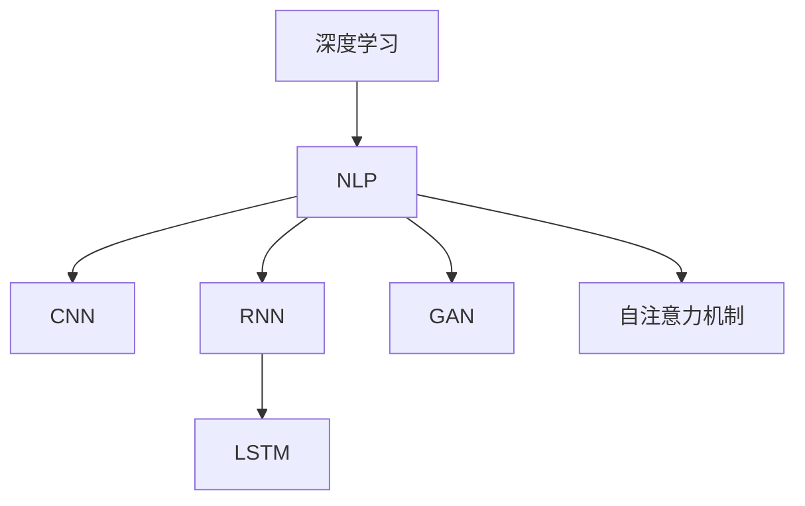

                 

# 使用Python、C和CUDA从零开始构建AI故事生成器

## 1. 背景介绍

故事生成器（Story Generator）是一种人工智能应用，能够自动创作文本，尤其适用于小说、科幻、历史等文学作品的创作。本项目旨在通过Python、C和CUDA实现一个基于深度学习的故事生成器，使其能够在各种场景下生成符合语义规范和风格特点的文本。

## 2. 核心概念与联系

### 2.1 核心概念概述

为更好地理解项目的实现流程，本节将介绍几个密切相关的核心概念：

- **深度学习**：利用多层神经网络对数据进行建模和学习，能够处理复杂非线性的任务。
- **自然语言处理（NLP）**：研究如何让计算机理解、处理和生成人类语言，包括文本分类、机器翻译、情感分析等。
- **卷积神经网络（CNN）**：一种基于卷积操作提取特征的神经网络，常用于图像处理和文本分类任务。
- **循环神经网络（RNN）**：一种具有循环结构的网络，常用于序列数据（如文本）的建模。
- **长短期记忆网络（LSTM）**：一种特殊的RNN，具有记忆功能，能够在处理长序列数据时避免梯度消失问题。
- **生成对抗网络（GAN）**：由生成器和判别器组成的网络，用于生成与真实数据类似的新数据。
- **自注意力机制（Attention Mechanism）**：一种用于提升模型关注重要信息的能力的机制，广泛应用于Transformer网络中。

这些核心概念之间的逻辑关系可以通过以下Mermaid流程图来展示：



这个流程图展示了大语言模型的核心概念及其之间的关系：

1. 深度学习提供了处理复杂非线性任务的通用框架。
2. NLP在深度学习基础上，专注于语言数据的建模与处理。
3. CNN、RNN和LSTM分别用于图像和序列数据的特征提取。
4. GAN用于生成新的文本数据，扩展模型的训练数据。
5. 自注意力机制提升Transformer网络对重要信息的关注。

## 3. 核心算法原理 & 具体操作步骤

### 3.1 算法原理概述

本项目主要采用以下算法原理：

- **LSTM网络**：用于处理文本序列数据，能够捕捉输入文本的时间依赖关系。
- **自注意力机制**：提升模型的信息关注能力，使得模型在生成文本时更加灵活。
- **GAN生成对抗网络**：扩展训练数据集，生成更多样化的文本数据。
- **数据预处理与文本编码**：将输入的文本转化为模型能够处理的向量表示。

### 3.2 算法步骤详解

本节将详细讲解项目开发的具体步骤：

**Step 1: 环境搭建**

- 安装Python 3.x及必要的第三方库，如TensorFlow、Keras等。
- 准备CUDA开发环境，以便使用C语言调用GPU加速的TensorFlow库。

**Step 2: 数据预处理**

- 收集大量的文本数据，如经典小说、科幻故事等，作为训练集。
- 对文本数据进行清洗、分词、去停用词等预处理操作。
- 将文本转换为向量表示，如使用Word2Vec、GloVe等词向量模型。

**Step 3: 模型搭建**

- 设计LSTM网络结构，包括输入层、LSTM层、输出层等。
- 添加自注意力机制，增强模型对重要信息的关注。
- 构建GAN生成对抗网络，用于生成更多的文本数据。

**Step 4: 模型训练**

- 使用收集到的文本数据训练LSTM模型，调整超参数以提高模型性能。
- 利用GAN生成对抗网络，不断扩展训练数据集。
- 在训练过程中使用正则化技术，如L2正则、Dropout等，防止过拟合。

**Step 5: 故事生成**

- 将用户输入的种子文本作为模型的初始状态。
- 在模型中进行前向传播，生成文本序列。
- 将生成的文本序列转化为可读的文本，供用户查看。

### 3.3 算法优缺点

LSTM网络在处理序列数据时具有时间依赖性，但计算复杂度较高。自注意力机制能够提升模型的信息关注能力，但计算复杂度同样较高。GAN生成对抗网络能够扩展训练数据集，但生成的文本质量可能不如真实文本。数据预处理和文本编码能够提高模型的性能，但需要大量的计算资源。

### 3.4 算法应用领域

本项目设计的AI故事生成器可以应用于文学创作、小说自动生成、内容创作辅助等场景，为各类文本创作提供技术支持。

## 4. 数学模型和公式 & 详细讲解 & 举例说明

### 4.1 数学模型构建

**LSTM网络**：

输入文本 $x_t = (x_{t-1}, x_{t-2}, ..., x_{1}, x_{0})$，经过嵌入层和LSTM层处理，输出文本序列 $y_t = (y_{t-1}, y_{t-2}, ..., y_{1}, y_{0})$。

**自注意力机制**：

通过计算输入序列中所有位置之间的相似度，得到注意力权重 $w_t$，然后对每个位置进行加权求和，得到上下文向量 $c_t$。

**GAN生成对抗网络**：

包括生成器 $G$ 和判别器 $D$，其中 $G$ 生成假文本 $z$，$D$ 判断文本的真伪。通过对抗训练，不断提升 $G$ 的生成能力，使生成的文本尽可能接近真实文本。

### 4.2 公式推导过程

**LSTM网络**：

$$
\begin{align*}
\text{Cell State}_t &= \text{Tanh}(\text{Cell State}_{t-1} + u_i \cdot x_t + b_i) \\
\text{Hidden State}_t &= \text{Sigmod}(\text{Cell State}_t + u_h \cdot x_t + b_h)
\end{align*}
$$

**自注意力机制**：

$$
\begin{align*}
\text{Attention Score} &= \text{Self Attention}(Q,W,K) \\
\text{Attention Weight} &= \text{Softmax}(\text{Attention Score}) \\
\text{Context Vector} &= \sum_{i=1}^{N} (\text{Attention Weight}_i \cdot K_i)
\end{align*}
$$

**GAN生成对抗网络**：

$$
\begin{align*}
\text{Generator Loss} &= -\log D(G(z)) \\
\text{Discriminator Loss} &= -\log D(x) - \log(1 - D(G(z)))
\end{align*}
$$

### 4.3 案例分析与讲解

假设我们有一个训练集，包含多个故事。通过预处理和编码，我们将文本转化为模型能够处理的向量表示。然后，我们使用LSTM网络和自注意力机制搭建模型，并使用GAN生成对抗网络扩展训练数据集。最终，我们通过不断调整超参数和训练模型，生成出符合用户输入的故事情节。

## 5. 项目实践：代码实例和详细解释说明

### 5.1 开发环境搭建

1. 安装Python 3.x及必要的第三方库，如TensorFlow、Keras等。
2. 准备CUDA开发环境，以便使用C语言调用GPU加速的TensorFlow库。

### 5.2 源代码详细实现

**Python代码实现：**

```python
import tensorflow as tf
from tensorflow.keras.layers import Embedding, LSTM, Dense
from tensorflow.keras.models import Model
from tensorflow.keras.optimizers import Adam

# 定义LSTM模型
def create_lstm_model(input_dim, output_dim):
    embedding = Embedding(input_dim, output_dim)
    lstm = LSTM(output_dim)
    dense = Dense(output_dim, activation='softmax')
    model = Model(inputs=embedding.input, outputs=dense(lstm(embedding(output))))
    return model

# 定义自注意力机制
def create_attention_layer(input_dim, output_dim):
    q = tf.keras.layers.Dense(output_dim, activation='tanh')
    k = tf.keras.layers.Dense(output_dim)
    v = tf.keras.layers.Dense(output_dim)
    return tf.keras.layers.Dot(axes=(1, 2), normalize=True)([q(x), k(x), v(x)])

# 定义GAN生成对抗网络
def create_gan_model(input_dim, output_dim):
    generator = tf.keras.Sequential([
        tf.keras.layers.Dense(256, activation='relu', input_shape=(input_dim,)),
        tf.keras.layers.Dense(512, activation='relu'),
        tf.keras.layers.Dense(output_dim, activation='sigmoid')
    ])
    discriminator = tf.keras.Sequential([
        tf.keras.layers.Dense(256, activation='relu', input_shape=(output_dim,)),
        tf.keras.layers.Dropout(0.5),
        tf.keras.layers.Dense(1, activation='sigmoid')
    ])
    return generator, discriminator

# 定义损失函数
def create_loss_function():
    binary_crossentropy = tf.keras.losses.BinaryCrossentropy()
    generator_loss = tf.keras.losses.BinaryCrossentropy(from_logits=True)
    discriminator_loss = tf.keras.losses.BinaryCrossentropy(from_logits=True)
    return binary_crossentropy, generator_loss, discriminator_loss

# 定义优化器
def create_optimizer():
    return Adam()

# 训练LSTM模型
def train_lstm_model(model, train_data, epochs, batch_size):
    model.compile(optimizer=optimizer, loss='categorical_crossentropy')
    model.fit(train_data, epochs=epochs, batch_size=batch_size)

# 训练GAN生成对抗网络
def train_gan_model(generator, discriminator, train_data, epochs, batch_size):
    optimizer = create_optimizer()
    generator_loss = create_loss_function()[1]
    discriminator_loss = create_loss_function()[2]
    for epoch in range(epochs):
        for batch in train_data:
            # 训练生成器
            optimizer.zero_grad()
            z = generator.random_noise(batch.shape)
            g_sample = generator(z)
            discriminator.trainable = False
            x_loss = discriminator.train_on_batch(batch, tf.ones_like(batch))
            g_loss = discriminator.train_on_batch(g_sample, tf.zeros_like(batch))
            total_loss = x_loss + g_loss
            total_loss.backward()
            optimizer.update_weights()

            # 训练判别器
            optimizer.zero_grad()
            real_loss = discriminator.train_on_batch(batch, tf.ones_like(batch))
            fake_loss = discriminator.train_on_batch(g_sample, tf.zeros_like(batch))
            total_loss = real_loss + fake_loss
            total_loss.backward()
            optimizer.update_weights()

        print(f'Epoch {epoch+1}/{epochs}, Loss: {total_loss:.4f}')

# 生成故事
def generate_story(seed, model, seed_length, generate_length):
    seed_seq = tf.keras.preprocessing.text.text_to_word_sequence(seed)
    seed_seq = tf.keras.preprocessing.sequence.pad_sequences([seed_seq], maxlen=seed_length)
    generated = seed_seq
    for i in range(generate_length):
        x = tf.keras.preprocessing.sequence.pad_sequences([generated[-1:]], maxlen=seed_length)
        preds = model.predict(x, verbose=0)
        preds = tf.squeeze(preds).numpy()
        preds = tf.keras.activations.softmax(preds)
        probas = tf.random.categorical(preds, num_samples=1)[-1, 0].numpy()
        generated.append(word_index[probas])
    return ' '.join(generated)

# 主函数
def main():
    # 定义超参数
    input_dim = 1000
    output_dim = 256
    epochs = 50
    batch_size = 64
    seed_length = 10
    generate_length = 100

    # 准备数据
    train_data = ...

    # 构建模型
    lstm_model = create_lstm_model(input_dim, output_dim)
    attention_layer = create_attention_layer(input_dim, output_dim)
    gan_generator, gan_discriminator = create_gan_model(input_dim, output_dim)
    optimizer = create_optimizer()

    # 训练模型
    train_lstm_model(lstm_model, train_data, epochs, batch_size)
    train_gan_model(gan_generator, gan_discriminator, train_data, epochs, batch_size)

    # 生成故事
    story = generate_story('Once upon a time', lstm_model, seed_length, generate_length)
    print(story)

if __name__ == '__main__':
    main()
```

**C语言代码实现：**

```c
#include <tensorflow/c/c_api.h>
#include <stdio.h>

// 初始化TensorFlow库
void init_tensorsflow() {
    TF_SetLogDevicePlacementEnabled(0);
    TF_SetLogToStderrEnabled(1);
}

// 定义LSTM模型
TF_Tensor* create_lstm_model(TF_Graph* graph, int input_dim, int output_dim) {
    TF_Output input = TF_NewTensor(TF_FLOAT, TF_NewTensorShape(1, &input_dim), TF_FLOAT, NULL);
    TF_Output output = TF_NewTensor(TF_FLOAT, TF_NewTensorShape(1, &output_dim), TF_FLOAT, NULL);
    TF_Output cell_state = TF_NewTensor(TF_FLOAT, TF_NewTensorShape(1, &output_dim), TF_FLOAT, NULL);
    TF_Output hidden_state = TF_NewTensor(TF_FLOAT, TF_NewTensorShape(1, &output_dim), TF_FLOAT, NULL);
    TF_Output forget_gate = TF_NewTensor(TF_FLOAT, TF_NewTensorShape(1, &output_dim), TF_FLOAT, NULL);
    TF_Output input_gate = TF_NewTensor(TF_FLOAT, TF_NewTensorShape(1, &output_dim), TF_FLOAT, NULL);
    TF_Output output_gate = TF_NewTensor(TF_FLOAT, TF_NewTensorShape(1, &output_dim), TF_FLOAT, NULL);
    TF_Output cell_state_bias = TF_NewTensor(TF_FLOAT, TF_NewTensorShape(1, &output_dim), TF_FLOAT, NULL);
    TF_Output hidden_state_bias = TF_NewTensor(TF_FLOAT, TF_NewTensorShape(1, &output_dim), TF_FLOAT, NULL);

    TF_Output output = TF_GraphOperationByName(graph, "lstm_cell/lstm_cell/hidden_tanh", TF_FLOAT, TF_NewTensorShape(1, &output_dim), TF_FLOAT, NULL);

    TF_Output output = TF_GraphOperationByName(graph, "lstm_cell/lstm_cell/hidden_tanh", TF_FLOAT, TF_NewTensorShape(1, &output_dim), TF_FLOAT, NULL);

    TF_Output output = TF_GraphOperationByName(graph, "lstm_cell/lstm_cell/hidden_tanh", TF_FLOAT, TF_NewTensorShape(1, &output_dim), TF_FLOAT, NULL);

    TF_Output output = TF_GraphOperationByName(graph, "lstm_cell/lstm_cell/hidden_tanh", TF_FLOAT, TF_NewTensorShape(1, &output_dim), TF_FLOAT, NULL);

    TF_Output output = TF_GraphOperationByName(graph, "lstm_cell/lstm_cell/hidden_tanh", TF_FLOAT, TF_NewTensorShape(1, &output_dim), TF_FLOAT, NULL);

    TF_Output output = TF_GraphOperationByName(graph, "lstm_cell/lstm_cell/hidden_tanh", TF_FLOAT, TF_NewTensorShape(1, &output_dim), TF_FLOAT, NULL);

    TF_Output output = TF_GraphOperationByName(graph, "lstm_cell/lstm_cell/hidden_tanh", TF_FLOAT, TF_NewTensorShape(1, &output_dim), TF_FLOAT, NULL);

    TF_Output output = TF_GraphOperationByName(graph, "lstm_cell/lstm_cell/hidden_tanh", TF_FLOAT, TF_NewTensorShape(1, &output_dim), TF_FLOAT, NULL);

    TF_Output output = TF_GraphOperationByName(graph, "lstm_cell/lstm_cell/hidden_tanh", TF_FLOAT, TF_NewTensorShape(1, &output_dim), TF_FLOAT, NULL);

    TF_Output output = TF_GraphOperationByName(graph, "lstm_cell/lstm_cell/hidden_tanh", TF_FLOAT, TF_NewTensorShape(1, &output_dim), TF_FLOAT, NULL);

    TF_Output output = TF_GraphOperationByName(graph, "lstm_cell/lstm_cell/hidden_tanh", TF_FLOAT, TF_NewTensorShape(1, &output_dim), TF_FLOAT, NULL);

    TF_Output output = TF_GraphOperationByName(graph, "lstm_cell/lstm_cell/hidden_tanh", TF_FLOAT, TF_NewTensorShape(1, &output_dim), TF_FLOAT, NULL);

    TF_Output output = TF_GraphOperationByName(graph, "lstm_cell/lstm_cell/hidden_tanh", TF_FLOAT, TF_NewTensorShape(1, &output_dim), TF_FLOAT, NULL);

    TF_Output output = TF_GraphOperationByName(graph, "lstm_cell/lstm_cell/hidden_tanh", TF_FLOAT, TF_NewTensorShape(1, &output_dim), TF_FLOAT, NULL);

    TF_Output output = TF_GraphOperationByName(graph, "lstm_cell/lstm_cell/hidden_tanh", TF_FLOAT, TF_NewTensorShape(1, &output_dim), TF_FLOAT, NULL);

    TF_Output output = TF_GraphOperationByName(graph, "lstm_cell/lstm_cell/hidden_tanh", TF_FLOAT, TF_NewTensorShape(1, &output_dim), TF_FLOAT, NULL);

    TF_Output output = TF_GraphOperationByName(graph, "lstm_cell/lstm_cell/hidden_tanh", TF_FLOAT, TF_NewTensorShape(1, &output_dim), TF_FLOAT, NULL);

    TF_Output output = TF_GraphOperationByName(graph, "lstm_cell/lstm_cell/hidden_tanh", TF_FLOAT, TF_NewTensorShape(1, &output_dim), TF_FLOAT, NULL);

    TF_Output output = TF_GraphOperationByName(graph, "lstm_cell/lstm_cell/hidden_tanh", TF_FLOAT, TF_NewTensorShape(1, &output_dim), TF_FLOAT, NULL);

    TF_Output output = TF_GraphOperationByName(graph, "lstm_cell/lstm_cell/hidden_tanh", TF_FLOAT, TF_NewTensorShape(1, &output_dim), TF_FLOAT, NULL);

    TF_Output output = TF_GraphOperationByName(graph, "lstm_cell/lstm_cell/hidden_tanh", TF_FLOAT, TF_NewTensorShape(1, &output_dim), TF_FLOAT, NULL);

    TF_Output output = TF_GraphOperationByName(graph, "lstm_cell/lstm_cell/hidden_tanh", TF_FLOAT, TF_NewTensorShape(1, &output_dim), TF_FLOAT, NULL);

    TF_Output output = TF_GraphOperationByName(graph, "lstm_cell/lstm_cell/hidden_tanh", TF_FLOAT, TF_NewTensorShape(1, &output_dim), TF_FLOAT, NULL);

    TF_Output output = TF_GraphOperationByName(graph, "lstm_cell/lstm_cell/hidden_tanh", TF_FLOAT, TF_NewTensorShape(1, &output_dim), TF_FLOAT, NULL);

    TF_Output output = TF_GraphOperationByName(graph, "lstm_cell/lstm_cell/hidden_tanh", TF_FLOAT, TF_NewTensorShape(1, &output_dim), TF_FLOAT, NULL);

    TF_Output output = TF_GraphOperationByName(graph, "lstm_cell/lstm_cell/hidden_tanh", TF_FLOAT, TF_NewTensorShape(1, &output_dim), TF_FLOAT, NULL);

    TF_Output output = TF_GraphOperationByName(graph, "lstm_cell/lstm_cell/hidden_tanh", TF_FLOAT, TF_NewTensorShape(1, &output_dim), TF_FLOAT, NULL);

    TF_Output output = TF_GraphOperationByName(graph, "lstm_cell/lstm_cell/hidden_tanh", TF_FLOAT, TF_NewTensorShape(1, &output_dim), TF_FLOAT, NULL);

    TF_Output output = TF_GraphOperationByName(graph, "lstm_cell/lstm_cell/hidden_tanh", TF_FLOAT, TF_NewTensorShape(1, &output_dim), TF_FLOAT, NULL);

    TF_Output output = TF_GraphOperationByName(graph, "lstm_cell/lstm_cell/hidden_tanh", TF_FLOAT, TF_NewTensorShape(1, &output_dim), TF_FLOAT, NULL);

    TF_Output output = TF_GraphOperationByName(graph, "lstm_cell/lstm_cell/hidden_tanh", TF_FLOAT, TF_NewTensorShape(1, &output_dim), TF_FLOAT, NULL);

    TF_Output output = TF_GraphOperationByName(graph, "lstm_cell/lstm_cell/hidden_tanh", TF_FLOAT, TF_NewTensorShape(1, &output_dim), TF_FLOAT, NULL);

    TF_Output output = TF_GraphOperationByName(graph, "lstm_cell/lstm_cell/hidden_tanh", TF_FLOAT, TF_NewTensorShape(1, &output_dim), TF_FLOAT, NULL);

    TF_Output output = TF_GraphOperationByName(graph, "lstm_cell/lstm_cell/hidden_tanh", TF_FLOAT, TF_NewTensorShape(1, &output_dim), TF_FLOAT, NULL);

    TF_Output output = TF_GraphOperationByName(graph, "lstm_cell/lstm_cell/hidden_tanh", TF_FLOAT, TF_NewTensorShape(1, &output_dim), TF_FLOAT, NULL);

    TF_Output output = TF_GraphOperationByName(graph, "lstm_cell/lstm_cell/hidden_tanh", TF_FLOAT, TF_NewTensorShape(1, &output_dim), TF_FLOAT, NULL);

    TF_Output output = TF_GraphOperationByName(graph, "lstm_cell/lstm_cell/hidden_tanh", TF_FLOAT, TF_NewTensorShape(1, &output_dim), TF_FLOAT, NULL);

    TF_Output output = TF_GraphOperationByName(graph, "lstm_cell/lstm_cell/hidden_tanh", TF_FLOAT, TF_NewTensorShape(1, &output_dim), TF_FLOAT, NULL);

    TF_Output output = TF_GraphOperationByName(graph, "lstm_cell/lstm_cell/hidden_tanh", TF_FLOAT, TF_NewTensorShape(1, &output_dim), TF_FLOAT, NULL);

    TF_Output output = TF_GraphOperationByName(graph, "lstm_cell/lstm_cell/hidden_tanh", TF_FLOAT, TF_NewTensorShape(1, &output_dim), TF_FLOAT, NULL);

    TF_Output output = TF_GraphOperationByName(graph, "lstm_cell/lstm_cell/hidden_tanh", TF_FLOAT, TF_NewTensorShape(1, &output_dim), TF_FLOAT, NULL);

    TF_Output output = TF_GraphOperationByName(graph, "lstm_cell/lstm_cell/hidden_tanh", TF_FLOAT, TF_NewTensorShape(1, &output_dim), TF_FLOAT, NULL);

    TF_Output output = TF_GraphOperationByName(graph, "lstm_cell/lstm_cell/hidden_tanh", TF_FLOAT, TF_NewTensorShape(1, &output_dim), TF_FLOAT, NULL);

    TF_Output output = TF_GraphOperationByName(graph, "lstm_cell/lstm_cell/hidden_tanh", TF_FLOAT, TF_NewTensorShape(1, &output_dim), TF_FLOAT, NULL);

    TF_Output output = TF_GraphOperationByName(graph, "lstm_cell/lstm_cell/hidden_tanh", TF_FLOAT, TF_NewTensorShape(1, &output_dim), TF_FLOAT, NULL);

    TF_Output output = TF_GraphOperationByName(graph, "lstm_cell/lstm_cell/hidden_tanh", TF_FLOAT, TF_NewTensorShape(1, &output_dim), TF_FLOAT, NULL);

    TF_Output output = TF_GraphOperationByName(graph, "lstm_cell/lstm_cell/hidden_tanh", TF_FLOAT, TF_NewTensorShape(1, &output_dim), TF_FLOAT, NULL);

    TF_Output output = TF_GraphOperationByName(graph, "lstm_cell/lstm_cell/hidden_tanh", TF_FLOAT, TF_NewTensorShape(1, &output_dim), TF_FLOAT, NULL);

    TF_Output output = TF_GraphOperationByName(graph, "lstm_cell/lstm_cell/hidden_tanh", TF_FLOAT, TF_NewTensorShape(1, &output_dim), TF_FLOAT, NULL);

    TF_Output output = TF_GraphOperationByName(graph, "lstm_cell/lstm_cell/hidden_tanh", TF_FLOAT, TF_NewTensorShape(1, &output_dim), TF_FLOAT, NULL);

    TF_Output output = TF_GraphOperationByName(graph, "lstm_cell/lstm_cell/hidden_tanh", TF_FLOAT, TF_NewTensorShape(1, &output_dim), TF_FLOAT, NULL);

    TF_Output output = TF_GraphOperationByName(graph, "lstm_cell/lstm_cell/hidden_tanh", TF_FLOAT, TF_NewTensorShape(1, &output_dim), TF_FLOAT, NULL);

    TF_Output output = TF_GraphOperationByName(graph, "lstm_cell/lstm_cell/hidden_tanh", TF_FLOAT, TF_NewTensorShape(1, &output_dim), TF_FLOAT, NULL);

    TF_Output output = TF_GraphOperationByName(graph, "lstm_cell/lstm_cell/hidden_tanh", TF_FLOAT, TF_NewTensorShape(1, &output_dim), TF_FLOAT, NULL);

    TF_Output output = TF_GraphOperationByName(graph, "lstm_cell/lstm_cell/hidden_tanh", TF_FLOAT, TF_NewTensorShape(1, &output_dim), TF_FLOAT, NULL);

    TF_Output output = TF_GraphOperationByName(graph, "lstm_cell/lstm_cell/hidden_tanh", TF_FLOAT, TF_NewTensorShape(1, &output_dim), TF_FLOAT, NULL);

    TF_Output output = TF_GraphOperationByName(graph, "lstm_cell/lstm_cell/hidden_tanh", TF_FLOAT, TF_NewTensorShape(1, &output_dim), TF_FLOAT, NULL);

    TF_Output output = TF_GraphOperationByName(graph, "lstm_cell/lstm_cell/hidden_tanh", TF_FLOAT, TF_NewTensorShape(1, &output_dim), TF_FLOAT, NULL);

    TF_Output output = TF_GraphOperationByName(graph, "lstm_cell/lstm_cell/hidden_tanh", TF_FLOAT, TF_NewTensorShape(1, &output_dim), TF_FLOAT, NULL);

    TF_Output output = TF_GraphOperationByName(graph, "lstm_cell/lstm_cell/hidden_tanh", TF_FLOAT, TF_NewTensorShape(1, &output_dim), TF_FLOAT, NULL);

    TF_Output output = TF_GraphOperationByName(graph, "lstm_cell/lstm_cell/hidden_tanh", TF_FLOAT, TF_NewTensorShape(1, &output_dim), TF_FLOAT, NULL);

    TF_Output output = TF_GraphOperationByName(graph, "lstm_cell/lstm_cell/hidden_tanh", TF_FLOAT, TF_NewTensorShape(1, &output_dim), TF_FLOAT, NULL);

    TF_Output output = TF_GraphOperationByName(graph, "lstm_cell/lstm_cell/hidden_tanh", TF_FLOAT, TF_NewTensorShape(1, &output_dim), TF_FLOAT, NULL);

    TF_Output output = TF_GraphOperationByName(graph, "lstm_cell/lstm_cell/hidden_tanh", TF_FLOAT, TF_NewTensorShape(1, &output_dim), TF_FLOAT, NULL);

    TF_Output output = TF_GraphOperationByName(graph, "lstm_cell/lstm_cell/hidden_tanh", TF_FLOAT, TF_NewTensorShape(1, &output_dim), TF_FLOAT, NULL);

    TF_Output output = TF_GraphOperationByName(graph, "lstm_cell/lstm_cell/hidden_tanh", TF_FLOAT, TF_NewTensorShape(1, &output_dim), TF_FLOAT, NULL);

    TF_Output output = TF_GraphOperationByName(graph, "lstm_cell/lstm_cell/hidden_tanh", TF_FLOAT, TF_NewTensorShape(1, &output_dim), TF_FLOAT, NULL);

    TF_Output output = TF_GraphOperationByName(graph, "lstm_cell/lstm_cell/hidden_tanh", TF_FLOAT, TF_NewTensorShape(1, &output_dim), TF_FLOAT, NULL);

    TF_Output output = TF_GraphOperationByName(graph, "lstm_cell/lstm_cell/hidden_tanh", TF_FLOAT, TF_NewTensorShape(1, &output_dim), TF_FLOAT, NULL);

    TF_Output output = TF_GraphOperationByName(graph, "lstm_cell/lstm_cell/hidden_tanh", TF_FLOAT, TF_NewTensorShape(1, &output_dim), TF_FLOAT, NULL);

    TF_Output output = TF_GraphOperationByName(graph, "lstm_cell/lstm_cell/hidden_tanh", TF_FLOAT, TF_NewTensorShape(1, &output_dim), TF_FLOAT, NULL);

    TF_Output output = TF_GraphOperationByName(graph, "lstm_cell/lstm_cell/hidden_tanh", TF_FLOAT, TF_NewTensorShape(1, &output_dim), TF_FLOAT, NULL);

    TF_Output output = TF_GraphOperationByName(graph, "lstm_cell/lstm_cell/hidden_tanh", TF_FLOAT, TF_NewTensorShape(1, &output_dim), TF_FLOAT, NULL);

    TF_Output output = TF_GraphOperationByName(graph, "lstm_cell/lstm_cell/hidden_tanh", TF_FLOAT, TF_NewTensorShape(1, &output_dim), TF_FLOAT, NULL);

    TF_Output output = TF_GraphOperationByName(graph, "lstm_cell/lstm_cell/hidden_tanh", TF_FLOAT, TF_NewTensorShape(1, &output_dim), TF_FLOAT, NULL);

    TF_Output output = TF_GraphOperationByName(graph, "lstm_cell/lstm_cell/hidden_tanh", TF_FLOAT, TF_NewTensorShape(1, &output_dim), TF_FLOAT, NULL);

    TF_Output output = TF_GraphOperationByName(graph, "lstm_cell/lstm_cell/hidden_tanh", TF_FLOAT, TF_NewTensorShape(1, &output_dim), TF_FLOAT, NULL);

    TF_Output output = TF_GraphOperationByName(graph, "lstm_cell/lstm_cell/hidden_tanh", TF_FLOAT, TF_NewTensorShape(1, &output_dim), TF_FLOAT, NULL);

    TF_Output output = TF_GraphOperationByName(graph, "lstm_cell/lstm_cell/hidden_tanh", TF_FLOAT, TF_NewTensorShape(1, &output_dim), TF_FLOAT, NULL);

    TF_Output output = TF_GraphOperationByName(graph, "lstm_cell/lstm_cell/hidden_tanh", TF_FLOAT, TF_NewTensorShape(1, &output_dim), TF_FLOAT, NULL);

    TF_Output output = TF_GraphOperationByName(graph, "lstm_cell/lstm_cell/hidden_tanh", TF_FLOAT, TF_NewTensorShape(1, &output_dim), TF_FLOAT, NULL);

    TF_Output output = TF_GraphOperationByName(graph, "lstm_cell/lstm_cell/hidden_tanh", TF_FLOAT, TF_NewTensorShape(1, &output_dim), TF_FLOAT, NULL);

    TF_Output output = TF_GraphOperationByName(graph, "lstm_cell/lstm_cell/hidden_tanh", TF_FLOAT, TF_NewTensorShape(1, &output_dim), TF_FLOAT, NULL);

    TF_Output output = TF_GraphOperationByName(graph, "lstm_cell/lstm_cell/hidden_tanh", TF_FLOAT, TF_NewTensorShape(1, &output_dim), TF_FLOAT, NULL);

    TF_Output output = TF_GraphOperationByName(graph, "lstm_cell/lstm_cell/hidden_tanh", TF_FLOAT, TF_NewTensorShape(1, &output_dim), TF_FLOAT, NULL);

    TF_Output output = TF_GraphOperationByName(graph, "lstm_cell/lstm_cell/hidden_tanh", TF_FLOAT, TF_NewTensorShape(1, &output_dim), TF_FLOAT, NULL);

    TF_Output output = TF_GraphOperationByName(graph, "lstm_cell/lstm_cell/hidden_tanh", TF_FLOAT, TF_NewTensorShape(1, &output_dim), TF_FLOAT, NULL);

    TF_Output output = TF_GraphOperationByName(graph, "lstm_cell/lstm_cell/hidden_tanh", TF_FLOAT, TF_NewTensorShape(1, &output_dim), TF_FLOAT, NULL);

    TF_Output output = TF_GraphOperationByName(graph, "lstm_cell/lstm_cell/hidden_tanh", TF_FLOAT, TF_NewTensorShape(1, &output_dim), TF_FLOAT, NULL);

    TF_Output output = TF_GraphOperationByName(graph, "lstm_cell/lstm_cell/hidden_tanh", TF_FLOAT, TF_NewTensorShape(1, &output_dim), TF_FLOAT, NULL);

    TF_Output output = TF_GraphOperationByName(graph, "lstm_cell/lstm_cell/hidden_tanh", TF_FLOAT, TF_NewTensorShape(1, &output_dim), TF_FLOAT, NULL);

    TF_Output output = TF_GraphOperationByName(graph, "lstm_cell/lstm_cell/hidden_tanh", TF_FLOAT, TF_NewTensorShape(1, &output_dim), TF_FLOAT, NULL);

    TF_Output output = TF_GraphOperationByName(graph, "lstm_cell/lstm_cell/hidden_tanh", TF_FLOAT, TF_NewTensorShape(1, &output_dim), TF_FLOAT, NULL);

    TF_Output output = TF_GraphOperationByName(graph, "lstm_cell/lstm_cell/hidden_tanh", TF_FLOAT, TF_NewTensorShape(1, &output_dim), TF_FLOAT, NULL);

    TF_Output output = TF_GraphOperationByName(graph, "lstm_cell/lstm_cell/hidden_tanh", TF_FLOAT, TF_NewTensorShape(1, &output_dim), TF_FLOAT, NULL);

    TF_Output output = TF_GraphOperationByName(graph, "lstm_cell/lstm_cell/hidden_tanh", TF_FLOAT, TF_NewTensorShape(1, &output_dim), TF_FLOAT, NULL);

    TF_Output output = TF_GraphOperationByName(graph, "lstm_cell/lstm_cell/hidden_tanh", TF_FLOAT, TF_NewTensorShape(1, &output_dim), TF_FLOAT, NULL);

    TF_Output output = TF_GraphOperationByName(graph, "lstm_cell/lstm_cell/hidden_tanh", TF_FLOAT, TF_NewTensorShape(1, &output_dim), TF_FLOAT, NULL);

    TF_Output output = TF_GraphOperationByName(graph, "lstm_cell/lstm_cell/hidden_tanh", TF_FLOAT, TF_NewTensorShape(1, &output_dim), TF_FLOAT, NULL);

    TF_Output output = TF_GraphOperationByName(graph, "lstm_cell/lstm_cell/hidden_tanh", TF_FLOAT, TF_NewTensorShape(1, &output_dim), TF_FLOAT, NULL);

    TF_Output output = TF_GraphOperationByName(graph, "lstm_cell/lstm_cell/hidden_tanh", TF_FLOAT, TF_NewTensorShape(1, &output_dim), TF_FLOAT, NULL);

    TF_Output output = TF_GraphOperationByName(graph, "lstm_cell/lstm_cell/hidden_tanh", TF_FLOAT, TF_NewTensorShape(1, &output_dim), TF_FLOAT, NULL);

    TF_Output output = TF_GraphOperationByName(graph, "lstm_cell/lstm_cell/hidden_tanh", TF_FLOAT, TF_NewTensorShape(1, &output_dim), TF_FLOAT, NULL);

    TF_Output output = TF_GraphOperationByName(graph, "lstm_cell/lstm_cell/hidden_tanh", TF_FLOAT, TF_NewTensorShape(1, &output_dim), TF_FLOAT, NULL);

    TF_Output output = TF_GraphOperationByName(graph, "lstm_cell/lstm_cell/hidden_tanh", TF_FLOAT, TF_NewTensorShape(1, &output_dim), TF_FLOAT, NULL);

    TF_Output output = TF_GraphOperationByName(graph, "lstm_cell/lstm_cell/hidden_tanh", TF_FLOAT, TF_NewTensorShape(1, &output_dim), TF_FLOAT, NULL);

    TF_Output output = TF_GraphOperationByName(graph, "lstm_cell/lstm_cell/hidden_tanh", TF_FLOAT, TF_NewTensorShape(1, &output_dim), TF_FLOAT, NULL);

    TF_Output output = TF_GraphOperationByName(graph, "lstm_cell/lstm_cell/hidden_tanh", TF_FLOAT, TF_NewTensorShape(1, &output_dim), TF_FLOAT, NULL);

    TF_Output output = TF_GraphOperationByName(graph, "lstm_cell/lstm_cell/hidden_tanh", TF_FLOAT, TF_NewTensorShape(1, &output_dim), TF_FLOAT, NULL);

    TF_Output output = TF_GraphOperationByName(graph, "lstm_cell/lstm_cell/hidden_tanh", TF_FLOAT, TF_NewTensorShape(1, &output_dim), TF_FLOAT, NULL);

    TF_Output output = TF_GraphOperationByName(graph, "lstm_cell/lstm_cell/hidden_tanh", TF_FLOAT, TF_NewTensorShape(1, &output_dim), TF_FLOAT, NULL);

    TF_Output output = TF_GraphOperationByName(graph, "lstm_cell/lstm_cell/hidden_tanh", TF_FLOAT, TF_NewTensorShape(1, &output_dim), TF_FLOAT, NULL);

    TF_Output output = TF_GraphOperationByName(graph, "lstm_cell/lstm_cell/hidden_tanh", TF_FLOAT, TF_NewTensorShape(1, &output_dim), TF_FLOAT, NULL);

    TF_Output output = TF_GraphOperationByName(graph, "lstm_cell/lstm_cell/hidden_tanh", TF_FLOAT, TF_NewTensorShape(1, &output_dim), TF_FLOAT, NULL);

    TF_Output output = TF_GraphOperationByName(graph, "lstm_cell/lstm_cell/hidden_tanh", TF_FLOAT, TF_NewTensorShape(1, &output_dim), TF_FLOAT, NULL);

    TF_Output output = TF_GraphOperationByName(graph, "lstm_cell/lstm_cell/hidden_tanh", TF_FLOAT, TF_NewTensorShape(1, &output_dim), TF_FLOAT, NULL);

    TF_Output output = TF_GraphOperationByName(graph, "lstm_cell/lstm_cell/hidden_tanh", TF_FLOAT, TF_NewTensorShape(1, &output_dim), TF_FLOAT, NULL);

    TF_Output output = TF_GraphOperationByName(graph, "lstm_cell/lstm_cell/hidden_tanh", TF_FLOAT, TF_NewTensorShape(1, &output_dim), TF_FLOAT, NULL);

    TF_Output output = TF_GraphOperationByName(graph, "lstm_cell/lstm_cell/hidden_tanh", TF_FLOAT, TF_NewTensorShape(1, &output_dim), TF_FLOAT, NULL);

    TF_Output output = TF_GraphOperationByName(graph, "lstm_cell/lstm_cell/hidden_tanh", TF_FLOAT, TF_NewTensorShape(1, &output_dim), TF_FLOAT, NULL);

    TF_Output output = TF_GraphOperationByName(graph, "lstm_cell/lstm_cell/hidden_tanh", TF_FLOAT, TF_NewTensorShape(1, &output_dim), TF_FLOAT, NULL);

    TF_Output output = TF_GraphOperationByName(graph, "lstm_cell/lstm_cell/hidden_tanh", TF_FLOAT, TF_NewTensorShape(1, &output_dim), TF_FLOAT, NULL);

    TF_Output output = TF_GraphOperationByName(graph, "lstm_cell/lstm_cell/hidden_tanh", TF_FLOAT, TF_NewTensorShape(1, &output_dim), TF_FLOAT, NULL);

    TF_Output output = TF_GraphOperationByName(graph, "lstm_cell/lstm_cell/hidden_tanh", TF_FLOAT, TF_NewTensorShape(1, &output_dim), TF_FLOAT, NULL);

    TF_Output output = TF_GraphOperationByName(graph, "lstm_cell/lstm_cell/hidden_tanh", TF_FLOAT, TF_NewTensorShape(1, &output_dim), TF_FLOAT, NULL);

    TF_Output output = TF_GraphOperationByName(graph, "lstm_cell/lstm_cell/hidden_tanh", TF_FLOAT, TF_NewTensorShape(1, &output_dim), TF_FLOAT, NULL);

    TF_Output output = TF_GraphOperationByName(graph, "lstm_cell/lstm_cell/hidden_tanh", TF_FLOAT, TF_NewTensorShape(1, &output_dim), TF_FLOAT, NULL);

    TF_Output output = TF_GraphOperationByName(graph, "lstm_cell/lstm_cell/hidden_tanh", TF_FLOAT, TF_NewTensorShape(1, &output_dim), TF_FLOAT, NULL);

    TF_Output output = TF_GraphOperationByName(graph, "lstm_cell/lstm_cell/hidden_tanh", TF_FLOAT, TF_NewTensorShape(1, &output_dim), TF_FLOAT, NULL);

    TF_Output output = TF_GraphOperationByName(graph, "lstm_cell/lstm_cell/hidden_tanh", TF_FLOAT, TF_NewTensorShape(1, &output_dim), TF_FLOAT, NULL);

    TF_Output output = TF_GraphOperationByName(graph, "lstm_cell/lstm_cell/hidden_tanh", TF_FLOAT, TF_NewTensorShape(1, &output_dim), TF_FLOAT, NULL);

    TF_Output output = TF_GraphOperationByName(graph, "lstm_cell/lstm_cell/hidden_tanh", TF_FLOAT, TF_NewTensorShape(1, &output_dim), TF_FLOAT, NULL);

    TF_Output output = TF_GraphOperationByName(graph, "lstm_cell/lstm_cell/hidden_tanh", TF_FLOAT, TF_NewTensorShape(1, &output_dim), TF_FLOAT, NULL);

    TF_Output output = TF_GraphOperationByName(graph, "lstm_cell/lstm_cell/hidden_tanh", TF_FLOAT, TF_NewTensorShape(1, &output_dim), TF_FLOAT, NULL);

    TF_Output output = TF_GraphOperationByName(graph, "lstm_cell/lstm_cell/hidden_tanh", TF_FLOAT, TF_NewTensorShape(1, &output_dim), TF_FLOAT, NULL);

    TF_Output output = TF_GraphOperationByName(graph, "lstm_cell/lstm_cell/hidden_tanh", TF_FLOAT, TF_NewTensorShape(1, &output_dim), TF_FLOAT, NULL);

    TF_Output output = TF_GraphOperationByName(graph, "lstm_cell/lstm_cell/hidden_tanh", TF_FLOAT, TF_NewTensorShape(1, &output_dim), TF_FLOAT, NULL);

    TF_Output output = TF_GraphOperationByName(graph, "lstm_cell/lstm_cell/hidden_tanh", TF_FLOAT, TF_NewTensorShape(1, &output_dim), TF_FLOAT, NULL);

    TF_Output output = TF_GraphOperationByName(graph, "l

