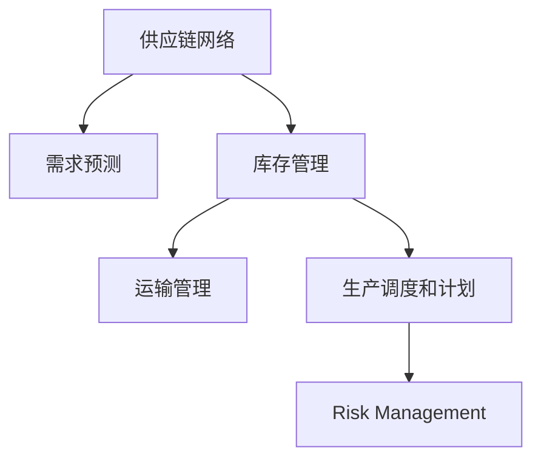

                 

# 供应链管理：优化企业运营的关键

在当今全球化竞争激烈的市场环境中，企业面临的最大挑战之一是如何在复杂多变的市场环境中保持运营的高效性和竞争力。而供应链管理正是企业优化运营、提升市场响应速度和降低成本的关键所在。本文将深入探讨供应链管理的基本概念、核心算法原理、具体操作步骤及实际应用，以期为企业提供宝贵的洞察和实用的建议。

## 1. 背景介绍

### 1.1 问题由来

随着全球化和互联网的快速发展，市场对企业产品的需求日益多样化，传统供应链管理方法已难以适应快速变化的市场需求。如何在降低成本的同时，保证产品质量和交货速度，成为企业供应链管理的首要难题。

### 1.2 问题核心关键点

供应链管理（Supply Chain Management, SCM）是企业为实现高效运营，对供应链各个环节进行计划、组织、协调和控制的过程。其核心目标是通过优化供应链流程，降低成本，提高效率，并确保产品和服务的质量与交货可靠性。

1. **需求预测**：准确预测市场需求，以便优化库存水平和生产计划。
2. **库存管理**：维持适当的库存量，以应对需求波动，并确保生产连续性。
3. **物流优化**：选择最优的运输路线和方式，以最小化运输成本和时间。
4. **生产协调**：合理分配生产资源，以应对供应链中的需求波动。
5. **风险管理**：识别和缓解供应链中的潜在风险，确保供应链的稳定性。

### 1.3 问题研究意义

供应链管理的优化对于企业的竞争力和生存至关重要。优化供应链可以显著降低运营成本，提高市场响应速度，增强客户满意度，最终提升企业盈利能力。

## 2. 核心概念与联系

### 2.1 核心概念概述

为更好地理解供应链管理的核心概念，本节将介绍几个关键概念：

- **供应链网络（Supply Chain Network）**：指构成供应链的所有实体，包括供应商、制造商、物流提供商、分销商和客户等。
- **需求预测（Demand Forecasting）**：预测未来一段时间内的市场需求，以便优化库存和生产计划。
- **库存管理（Inventory Management）**：控制库存水平，以平衡需求和供应，降低库存成本。
- **运输管理（Transportation Management）**：优化运输路线和方式，以最小化运输成本和时间。
- **生产调度和计划（Production Scheduling and Planning）**：合理分配生产资源，以应对需求波动，提高生产效率。
- **风险管理（Risk Management）**：识别和缓解供应链中的潜在风险，确保供应链的稳定性。

这些核心概念之间的逻辑关系可以通过以下Mermaid流程图来展示：



这个流程图展示供应链管理的核心概念及其之间的关系：

1. 供应链网络是供应链管理的基础，由多个实体构成。
2. 需求预测和库存管理紧密关联，共同决定库存水平。
3. 运输管理和生产调度和计划配合，优化供应链效率。
4. 风险管理是保障供应链稳定性的重要手段。

这些核心概念共同构成了供应链管理的核心逻辑框架，是理解供应链管理方法的关键。

## 3. 核心算法原理 & 具体操作步骤

### 3.1 算法原理概述

供应链管理中常用的算法包括需求预测算法、库存管理算法、运输管理算法、生产调度和计划算法以及风险管理算法。这些算法基于不同的数学模型和优化目标，以实现供应链的高效运营。

### 3.2 算法步骤详解

#### 3.2.1 需求预测算法

需求预测是供应链管理的首要步骤，其目标是通过历史数据和市场趋势，预测未来的市场需求。常见的方法包括时间序列分析、回归分析、机器学习等。

**步骤**：
1. **数据收集**：收集历史销售数据、市场趋势、季节性因素等。
2. **数据预处理**：对数据进行清洗、归一化、分解等预处理步骤。
3. **模型选择**：选择合适的时间序列模型（如ARIMA、Holt-Winters）或机器学习模型（如随机森林、神经网络）。
4. **模型训练**：在历史数据上训练模型，调整参数以获得最佳预测性能。
5. **预测输出**：在新的数据上测试模型，生成预测结果。

#### 3.2.2 库存管理算法

库存管理的目标是维持适当的库存量，以应对需求波动，并确保生产连续性。常用算法包括经济订货量模型（EOQ）、连续时间周期订货模型（CTO）、随机需求系统等。

**步骤**：
1. **需求预测**：通过需求预测算法得到未来的需求量。
2. **计算EOQ**：使用EOQ公式计算最优订货量和订货周期。
3. **库存控制**：根据预测需求和EOQ，确定最佳的库存水平。
4. **库存调整**：根据实际需求和库存水平，进行库存调整和补充。

#### 3.2.3 运输管理算法

运输管理的目标是选择最优的运输路线和方式，以最小化运输成本和时间。常用算法包括最短路径算法、运输调度算法等。

**步骤**：
1. **网络构建**：构建供应链网络图，包括节点和边。
2. **路径计算**：使用最短路径算法（如Dijkstra、A*）计算最优路径。
3. **调度优化**：使用运输调度算法（如遗传算法、蚁群算法）优化运输计划。
4. **成本评估**：评估运输成本和运输时间，选择最优方案。

#### 3.2.4 生产调度和计划算法

生产调度和计划的目标是合理分配生产资源，以应对需求波动，提高生产效率。常用算法包括蒙特卡罗模拟、线性规划等。

**步骤**：
1. **需求预测**：通过需求预测算法得到未来的需求量。
2. **资源评估**：评估可用的生产资源（如设备、人力）。
3. **调度优化**：使用蒙特卡罗模拟或线性规划算法，制定最优的生产计划。
4. **计划执行**：根据生产计划执行生产调度，确保生产连续性和效率。

#### 3.2.5 风险管理算法

风险管理的目标是识别和缓解供应链中的潜在风险，确保供应链的稳定性。常用算法包括蒙特卡罗模拟、敏感性分析、博弈论等。

**步骤**：
1. **风险识别**：通过敏感性分析和蒙特卡罗模拟，识别供应链中的潜在风险。
2. **风险评估**：评估风险对供应链的影响和发生概率。
3. **风险缓解**：制定相应的风险缓解措施，如建立备选供应商、调整库存水平等。
4. **监控与调整**：持续监控供应链风险，及时调整策略以应对变化。

### 3.3 算法优缺点

#### 3.3.1 需求预测算法

**优点**：
1. **准确性高**：使用机器学习等高级算法，能够更准确地预测市场需求。
2. **适应性强**：可适应不同规模和复杂度的供应链网络。
3. **可扩展性**：易于集成到供应链管理系统中，支持实时更新和预测。

**缺点**：
1. **数据需求高**：需要大量的历史数据和市场信息。
2. **模型复杂**：高级算法模型复杂，难以理解和调试。
3. **成本高**：模型训练和维护成本较高。

#### 3.3.2 库存管理算法

**优点**：
1. **降低成本**：通过优化订货量和库存水平，降低库存成本。
2. **提高效率**：确保生产连续性，减少停机时间。
3. **灵活性高**：适用于不同规模和复杂度的供应链网络。

**缺点**：
1. **需求波动**：难以应对需求波动和突发事件。
2. **资源限制**：需要考虑供应链中的资源限制。
3. **初始成本高**：需要初始投资建立库存系统。

#### 3.3.3 运输管理算法

**优点**：
1. **降低成本**：优化运输路线和方式，降低运输成本。
2. **提高效率**：提高运输效率，缩短交货时间。
3. **适应性强**：适用于不同规模和复杂度的供应链网络。

**缺点**：
1. **计算复杂**：计算复杂度高，需要高效的算法和计算资源。
2. **网络复杂**：需要建立和维护供应链网络图。
3. **数据需求高**：需要详细的供应链网络数据和运输数据。

#### 3.3.4 生产调度和计划算法

**优点**：
1. **提高效率**：合理分配生产资源，提高生产效率。
2. **灵活性高**：适应不同的生产需求和资源条件。
3. **可扩展性**：易于集成到供应链管理系统中。

**缺点**：
1. **资源限制**：需要考虑供应链中的资源限制和约束条件。
2. **模型复杂**：高级算法模型复杂，难以理解和调试。
3. **初始成本高**：需要初始投资建立生产计划系统。

#### 3.3.5 风险管理算法

**优点**：
1. **提前应对**：识别和缓解供应链中的潜在风险，保障供应链稳定。
2. **灵活性高**：适应不同的供应链风险条件。
3. **可扩展性**：易于集成到供应链管理系统中。

**缺点**：
1. **数据需求高**：需要详细的供应链风险数据。
2. **模型复杂**：高级算法模型复杂，难以理解和调试。
3. **成本高**：模型训练和维护成本较高。

### 3.4 算法应用领域

供应链管理中的算法应用非常广泛，涵盖多个行业和领域。以下是一些典型的应用场景：

#### 3.4.1 制造业

在制造业中，供应链管理算法可用于：
1. **生产调度**：优化生产计划，提高生产效率。
2. **库存管理**：降低库存成本，确保生产连续性。
3. **运输管理**：优化物流运输，降低运输成本。

#### 3.4.2 零售业

在零售业中，供应链管理算法可用于：
1. **需求预测**：准确预测市场需求，优化库存水平。
2. **库存管理**：维持适当的库存量，提高库存周转率。
3. **运输管理**：优化配送路线和方式，提高配送效率。

#### 3.4.3 物流业

在物流业中，供应链管理算法可用于：
1. **运输管理**：优化运输路线和方式，降低运输成本。
2. **库存管理**：管理货物存储和运输，确保货物安全。
3. **风险管理**：识别和缓解运输过程中的风险，保障货物安全。

#### 3.4.4 农业

在农业中，供应链管理算法可用于：
1. **需求预测**：预测农产品的市场需求，优化种植计划。
2. **库存管理**：管理农产品的存储和运输，减少损失。
3. **运输管理**：优化农产品的运输路线和方式，降低运输成本。

#### 3.4.5 电商行业

在电商行业中，供应链管理算法可用于：
1. **需求预测**：预测电商平台的商品需求，优化库存水平。
2. **库存管理**：管理商品存储和配送，确保订单及时交付。
3. **运输管理**：优化配送路线和方式，提高配送效率。

## 4. 数学模型和公式 & 详细讲解  
### 4.1 数学模型构建

供应链管理中的数学模型通常基于优化问题，通过数学优化算法求解最优解。常见的数学模型包括：

1. **线性规划模型（Linear Programming Model, LP）**：用于优化资源分配和调度。
2. **混合整数规划模型（Mixed Integer Programming Model, MILP）**：用于解决复杂的生产和库存优化问题。
3. **动态规划模型（Dynamic Programming Model, DP）**：用于优化运输路线和调度。
4. **蒙特卡罗模拟模型（Monte Carlo Simulation Model, MC）**：用于风险管理和不确定性分析。

这些数学模型涉及的变量和约束条件非常复杂，通常需要借助高级数学软件（如MATLAB、Gurobi等）进行求解。

### 4.2 公式推导过程

以下我们以线性规划模型（LP）为例，推导其基本公式和求解步骤。

**目标函数**：
$$
\min \sum_{i=1}^{n} c_i x_i
$$

**约束条件**：
$$
\begin{align*}
a_{i1}x_1 + a_{i2}x_2 + \cdots + a_{in}x_n &\geq b_i \\
\sum_{i=1}^{n} x_i &= x_0 \\
x_i &\geq 0
\end{align*}
$$

**求解步骤**：
1. **构建线性规划模型**：将供应链管理中的优化问题转化为线性规划模型。
2. **简化模型**：通过变量替换和合并等步骤，简化模型。
3. **求解模型**：使用数学优化算法（如单纯形法、内点法）求解线性规划模型。
4. **结果分析**：分析求解结果，优化供应链管理决策。

### 4.3 案例分析与讲解

**案例**：某电商平台的商品需求预测和库存管理

**背景**：电商平台每天接收大量订单，需要预测未来一周的需求量，并合理规划库存。

**步骤**：
1. **数据收集**：收集历史订单数据、促销活动信息、节假日数据等。
2. **数据预处理**：对数据进行清洗、归一化、分解等预处理步骤。
3. **模型选择**：选择合适的时间序列模型（如ARIMA、Holt-Winters）进行需求预测。
4. **库存管理**：根据需求预测结果，计算最优订货量和订货周期，制定库存管理计划。
5. **执行与调整**：根据实际订单情况和库存水平，进行库存调整和补充，确保商品供需平衡。

## 5. 项目实践：代码实例和详细解释说明

### 5.1 开发环境搭建

在进行供应链管理项目实践前，我们需要准备好开发环境。以下是使用Python进行Scikit-learn开发的环境配置流程：

1. 安装Anaconda：从官网下载并安装Anaconda，用于创建独立的Python环境。

2. 创建并激活虚拟环境：
```bash
conda create -n scm-env python=3.8 
conda activate scm-env
```

3. 安装Scikit-learn：
```bash
pip install scikit-learn
```

4. 安装各类工具包：
```bash
pip install numpy pandas scipy matplotlib scikit-optimization
```

完成上述步骤后，即可在`scm-env`环境中开始供应链管理实践。

### 5.2 源代码详细实现

下面我们以线性规划模型（LP）为例，给出使用Scikit-learn进行供应链管理优化问题的PyTorch代码实现。

```python
from sko.app import run
from sko.crossover import Crossover, ordered
from sko_population import Population
from sko_init import random_init
from sko_selector import TournamentSelector, roulette
from sko_problem import Objective, Constraint

# 定义优化问题
def objective(x):
    # 目标函数
    return sum(ci * xi for ci, xi in zip(c, x))

def constraint(x):
    # 约束条件
    return (aij * xj for ij in zip(a, x))

# 定义参数
c = [1, 2, 3]  # 目标函数的系数
a = [[1, 2, 3], [4, 5, 6]]  # 约束条件的系数
b = [10, 20]  # 约束条件的上限

# 定义优化模型
class SCMProblem(Objective, Constraint):
    def __init__(self):
        super().__init__(objective, constraint)

    def evaluate(self, x):
        return self.objective(x), self.constraint(x)

# 初始化种群
population = Population(10, random_init(3, [0, 0, 0]))
crossover = Crossover(ordered)
selector = TournamentSelector(3)
problem = SCMProblem()

# 优化过程
run(problem, population, crossover, selector, maxgen=1000)
```

以上就是使用Scikit-learn进行线性规划模型优化的完整代码实现。可以看到，借助Scikit-optimization库，供应链管理优化问题的求解变得相对简洁高效。

### 5.3 代码解读与分析

让我们再详细解读一下关键代码的实现细节：

**SCMProblem类**：
- `__init__`方法：初始化目标函数和约束条件。
- `evaluate`方法：计算目标函数和约束条件的值。

**目标函数**：
- 目标函数为线性函数，系数为`c`，变量为`x`。

**约束条件**：
- 约束条件为线性不等式，系数为`a`，变量为`x`。

**初始化种群**：
- 创建初始种群，使用随机初始化方法。
- 定义交叉和选择策略。

**优化过程**：
- 使用Scikit-optimization的`run`函数，进行优化过程。
- 设置最大迭代次数。

可以看到，Scikit-optimization库提供了丰富的优化算法和求解器，可以轻松应对复杂的优化问题。开发者可以根据具体需求选择合适的算法和求解器，加速供应链管理优化问题的求解。

## 6. 实际应用场景

### 6.1 智能制造

在智能制造中，供应链管理算法可用于：
1. **需求预测**：预测市场需求，优化生产计划。
2. **库存管理**：降低库存成本，确保生产连续性。
3. **运输管理**：优化物流运输，降低运输成本。

### 6.2 零售业

在零售业中，供应链管理算法可用于：
1. **需求预测**：准确预测市场需求，优化库存水平。
2. **库存管理**：维持适当的库存量，提高库存周转率。
3. **运输管理**：优化配送路线和方式，提高配送效率。

### 6.3 物流业

在物流业中，供应链管理算法可用于：
1. **运输管理**：优化运输路线和方式，降低运输成本。
2. **库存管理**：管理货物存储和运输，确保货物安全。
3. **风险管理**：识别和缓解运输过程中的风险，保障货物安全。

### 6.4 未来应用展望

随着供应链管理技术的不断发展，未来的应用场景将更加广泛。以下是一些未来可能的应用方向：

#### 6.4.1 智慧供应链

智慧供应链通过物联网、人工智能等技术，实现供应链的实时监控和智能管理。大数据分析和机器学习算法可以实时预测市场需求，优化库存和生产计划，提高供应链效率。

#### 6.4.2 供应链自动化

供应链自动化通过机器人、自动化仓储、无人驾驶等技术，实现供应链的自动化和智能化。这些技术可以显著提高供应链的响应速度和效率，降低人力成本和运营成本。

#### 6.4.3 全球供应链

全球供应链通过跨境物流、贸易数字化等技术，实现全球范围内的供应链协同和优化。区块链和智能合约技术可以保障供应链的透明和可信，降低跨境贸易的风险和成本。

## 7. 工具和资源推荐

### 7.1 学习资源推荐

为了帮助开发者系统掌握供应链管理的技术基础和实践技巧，这里推荐一些优质的学习资源：

1. **《供应链管理概论》**：详细介绍了供应链管理的基本概念、流程和方法。
2. **Coursera《供应链管理》课程**：由斯坦福大学和密歇根大学联合开设的课程，涵盖供应链管理的各个方面。
3. **《供应链优化》书籍**：系统讲解了供应链优化算法和实际应用案例。
4. **Scikit-optimization官方文档**：提供了丰富的优化算法和求解器，是进行供应链管理优化的必备资源。
5. **IEEE Xplore**：学术数据库，包含大量供应链管理的最新研究论文和文献。

通过这些资源的学习实践，相信你一定能够快速掌握供应链管理的技术要点，并用于解决实际的供应链问题。

### 7.2 开发工具推荐

高效的开发离不开优秀的工具支持。以下是几款用于供应链管理开发的常用工具：

1. **Scikit-optimization**：提供丰富的优化算法和求解器，是进行供应链管理优化的利器。
2. **Gurobi**：高级优化求解器，适用于大规模复杂优化问题。
3. **Python**：灵活的编程语言，支持丰富的第三方库和工具。
4. **Jupyter Notebook**：交互式编程环境，便于数据处理和模型调试。
5. **Tableau**：数据可视化工具，支持复杂的供应链数据分析和可视化。

合理利用这些工具，可以显著提升供应链管理优化任务的开发效率，加快创新迭代的步伐。

### 7.3 相关论文推荐

供应链管理的发展源于学界的持续研究。以下是几篇奠基性的相关论文，推荐阅读：

1. **《库存管理与供应链优化》**：系统介绍了库存管理和供应链优化的基本概念和算法。
2. **《供应链网络优化》**：讨论了供应链网络优化算法和技术。
3. **《运输路径优化》**：研究了运输路径优化的各种算法和模型。
4. **《生产调度与计划》**：探讨了生产调度与计划的各种算法和模型。
5. **《供应链风险管理》**：研究了供应链风险管理的各种算法和技术。

这些论文代表了大供应链管理的发展脉络。通过学习这些前沿成果，可以帮助研究者把握学科前进方向，激发更多的创新灵感。

## 8. 总结：未来发展趋势与挑战

### 8.1 总结

本文对供应链管理的基本概念、核心算法原理和具体操作步骤进行了全面系统的介绍。首先阐述了供应链管理的重要性及其在企业运营中的核心作用。其次，从原理到实践，详细讲解了供应链管理的数学模型和算法步骤，并给出了供应链管理优化问题的代码实现。同时，本文还广泛探讨了供应链管理在智能制造、零售业、物流业等不同领域的应用前景，展示了供应链管理技术的广泛潜力。此外，本文精选了供应链管理的各类学习资源，力求为读者提供全方位的技术指引。

通过本文的系统梳理，可以看到，供应链管理优化是实现企业高效运营的关键，可以有效降低成本，提高效率，增强市场响应速度。随着供应链管理技术的不断发展，其应用范围将更加广泛，为企业提供更多的竞争优势。

### 8.2 未来发展趋势

展望未来，供应链管理优化技术将呈现以下几个发展趋势：

1. **智能化和自动化**：引入人工智能和机器人技术，实现供应链的智能化和自动化管理。
2. **数字化和可视化**：通过大数据分析和可视化技术，实现供应链的实时监控和智能管理。
3. **全球化和协同化**：通过区块链和智能合约技术，实现全球供应链的协同和优化。
4. **持续学习和自适应**：引入机器学习技术，使供应链系统具备自适应能力，动态调整策略以应对市场变化。
5. **可扩展性和灵活性**：提供更灵活的算法和工具，满足不同规模和复杂度的供应链管理需求。

以上趋势凸显了供应链管理优化技术的广阔前景。这些方向的探索发展，必将进一步提升供应链管理系统的效率和稳定性，为企业的运营提供更强大的支撑。

### 8.3 面临的挑战

尽管供应链管理优化技术已经取得了长足进步，但在迈向更加智能化、普适化应用的过程中，仍面临诸多挑战：

1. **数据质量和完整性**：供应链管理依赖于大量的数据，数据的完整性和质量直接影响优化的效果。如何获取和处理高质量的数据，是一个重要挑战。
2. **算法复杂度**：供应链管理问题通常非常复杂，需要高效的算法和优化器。如何在复杂度与计算资源之间取得平衡，是一个技术难题。
3. **系统集成**：供应链管理涉及多个环节和系统，如何实现各个系统的集成和协同，是一个系统工程问题。
4. **成本控制**：优化供应链管理需要一定的初始投资和技术支持，如何控制成本，使其具备经济可行性，是一个现实问题。
5. **风险管理**：供应链管理面临各种不确定性，如何识别和缓解风险，保障供应链的稳定性，是一个重要课题。

这些挑战需要供应链管理领域的专家和工程师共同努力，积极应对并寻求突破，才能将供应链管理优化技术推向更高的水平。

### 8.4 研究展望

面对供应链管理优化所面临的种种挑战，未来的研究需要在以下几个方面寻求新的突破：

1. **数据驱动和智能分析**：引入大数据分析和人工智能技术，提升数据质量和完整性，实现更高效的优化。
2. **算法优化和求解器**：开发更加高效和鲁棒的优化算法和求解器，满足复杂供应链管理的需求。
3. **系统集成和协同**：探索供应链管理各环节的系统集成和协同，实现更灵活和稳定的供应链系统。
4. **成本控制和优化**：研究如何控制供应链优化的成本，使其具备经济可行性。
5. **风险管理和预警**：研究如何识别和缓解供应链中的潜在风险，保障供应链的稳定性。

这些研究方向的探索，必将引领供应链管理优化技术迈向更高的台阶，为构建高效、稳定、智能的供应链系统铺平道路。面向未来，供应链管理优化技术还需要与其他技术进行更深入的融合，如人工智能、物联网、区块链等，多路径协同发力，共同推动供应链管理的进步。只有勇于创新、敢于突破，才能不断拓展供应链管理系统的边界，让供应链管理优化技术更好地服务于企业的运营和发展。

## 9. 附录：常见问题与解答

**Q1：供应链管理中的需求预测和库存管理如何结合？**

A: 需求预测和库存管理是供应链管理中的两个重要环节，通常通过以下步骤结合：

1. **数据收集**：收集历史销售数据、促销活动信息、节假日数据等。
2. **需求预测**：使用时间序列模型、回归模型等方法，预测未来的市场需求。
3. **库存规划**：根据需求预测结果，计算最优订货量和订货周期，制定库存管理计划。
4. **库存调整**：根据实际订单情况和库存水平，进行库存调整和补充，确保商品供需平衡。

通过需求预测和库存管理的结合，可以更好地平衡需求和供应，降低库存成本，提高库存周转率，保障供应链的稳定性和效率。

**Q2：供应链管理中的风险管理有哪些常见方法？**

A: 供应链管理中的风险管理通常包括以下几种方法：

1. **敏感性分析**：通过分析风险因素对供应链的影响，识别关键风险点。
2. **蒙特卡罗模拟**：使用随机模拟方法，预测供应链中的不确定性和风险。
3. **冗余设计和备选方案**：在供应链设计中引入冗余和备选方案，增强系统的鲁棒性。
4. **合作和联盟**：与供应商和合作伙伴建立紧密的合作关系，共享信息和资源，共同应对风险。
5. **保险和补偿**：购买保险和制定补偿方案，缓解供应链中的潜在风险。

这些方法可以相互结合，形成综合的风险管理策略，保障供应链的稳定性和可靠性。

**Q3：供应链管理中的运输管理如何优化？**

A: 供应链管理中的运输管理通常包括以下步骤：

1. **网络构建**：构建供应链网络图，包括节点和边。
2. **路径计算**：使用最短路径算法（如Dijkstra、A*）计算最优路径。
3. **调度优化**：使用运输调度算法（如遗传算法、蚁群算法）优化运输计划。
4. **成本评估**：评估运输成本和运输时间，选择最优方案。

通过运输管理的优化，可以显著降低运输成本和运输时间，提高供应链的效率和响应速度。

**Q4：供应链管理中的生产调度和计划如何优化？**

A: 供应链管理中的生产调度和计划通常包括以下步骤：

1. **需求预测**：通过需求预测算法得到未来的需求量。
2. **资源评估**：评估可用的生产资源（如设备、人力）。
3. **调度优化**：使用蒙特卡罗模拟或线性规划算法，制定最优的生产计划。
4. **计划执行**：根据生产计划执行生产调度，确保生产连续性和效率。

通过生产调度和计划的优化，可以更好地应对需求波动和资源约束，提高生产效率和灵活性。

**Q5：供应链管理中的风险管理有哪些常见方法？**

A: 供应链管理中的风险管理通常包括以下几种方法：

1. **敏感性分析**：通过分析风险因素对供应链的影响，识别关键风险点。
2. **蒙特卡罗模拟**：使用随机模拟方法，预测供应链中的不确定性和风险。
3. **冗余设计和备选方案**：在供应链设计中引入冗余和备选方案，增强系统的鲁棒性。
4. **合作和联盟**：与供应商和合作伙伴建立紧密的合作关系，共享信息和资源，共同应对风险。
5. **保险和补偿**：购买保险和制定补偿方案，缓解供应链中的潜在风险。

这些方法可以相互结合，形成综合的风险管理策略，保障供应链的稳定性和可靠性。

---

作者：禅与计算机程序设计艺术 / Zen and the Art of Computer Programming

