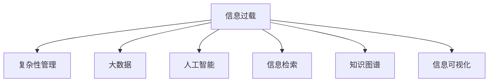

                 

# 信息时代的信息管理策略与实践：管理信息过载和复杂性

> 关键词：信息过载，复杂性管理，大数据，人工智能，信息检索，知识图谱，信息可视化

## 1. 背景介绍

### 1.1 问题由来

随着信息技术的高速发展，我们正进入信息爆炸的时代。海量的数据被源源不断地产生和传播，对社会、企业和个人的信息管理和决策能力提出了前所未有的挑战。传统的信息管理方式已难以应对日益复杂的信息环境。如何有效管理海量信息、减少信息过载，提升信息利用效率，已成为信息时代的重要课题。

### 1.2 问题核心关键点

信息过载和复杂性管理的核心在于：

1. **信息获取与处理效率**：在海量信息中快速准确地获取所需信息。
2. **信息组织与结构化**：将无序信息组织成可检索、可利用的知识库。
3. **信息可视化与解读**：将复杂信息通过图形化方式展示，帮助用户快速理解。
4. **信息推送与决策支持**：根据用户需求和环境变化，智能推送相关信息，支持决策。
5. **信息安全和隐私保护**：在信息管理中保护个人隐私和数据安全。

### 1.3 问题研究意义

研究信息过载和复杂性管理策略，对于提升信息管理水平，优化决策流程，减少决策错误，具有重要意义：

1. **提升信息管理效率**：通过系统化、智能化的信息管理手段，减少信息过载，提高信息获取和处理效率。
2. **优化决策质量**：利用结构化、可视化的信息辅助决策，减少决策过程中的信息盲点。
3. **降低决策风险**：通过大数据分析和智能算法，减少决策中的主观性和不确定性，降低决策风险。
4. **支持创新与创新**：智能化的信息管理支持新颖思路的产生，促进科学研究和创新。
5. **增强信息安全与隐私保护**：在信息管理中应用加密和隐私保护技术，确保数据安全。

## 2. 核心概念与联系

### 2.1 核心概念概述

为更好地理解信息管理的方法和策略，本节将介绍几个关键概念：

- **信息过载(Information Overload)**：指信息量超出人类处理能力的范围，导致信息获取和处理效率下降的现象。
- **复杂性管理(Complexity Management)**：指通过系统化手段减少复杂度，提升系统可理解性和可管理性的过程。
- **大数据(Big Data)**：指规模大、类型多、速度快的海量数据集。
- **人工智能(AI)**：指模拟人类智能过程的计算机技术，包括机器学习、深度学习等。
- **信息检索(Information Retrieval)**：指从大量信息中检索出相关信息的自动化过程。
- **知识图谱(Knowledge Graph)**：指通过语义关系建模的知识点网络，支持复杂查询和推理。
- **信息可视化(Information Visualization)**：指将信息通过图形化的方式展示，帮助用户理解。

这些核心概念之间的逻辑关系可以通过以下Mermaid流程图来展示：



这个流程图展示了一系列关键概念及其之间的关系：

1. 信息过载通过复杂性管理、大数据、人工智能、信息检索、知识图谱和信息可视化等手段得到缓解。
2. 大数据和人工智能为信息检索、知识图谱和信息可视化提供技术支持。
3. 信息检索和知识图谱在降低信息过载和提升信息利用效率方面具有重要作用。
4. 信息可视化将复杂信息转化为直观图形，帮助用户理解。

这些概念共同构成了信息管理的基础框架，为信息过载和复杂性管理的实践提供了指导。

## 3. 核心算法原理 & 具体操作步骤

### 3.1 算法原理概述

信息过载和复杂性管理的核心在于如何高效获取、组织和利用信息。具体策略包括：

1. **信息检索与过滤**：通过索引、查询、筛选等手段，快速获取相关信息。
2. **知识图谱构建与查询**：将信息组织成语义网络，支持复杂查询和推理。
3. **信息可视化与展示**：将信息转化为图形化方式，帮助用户直观理解。
4. **智能推送与决策支持**：利用算法智能推送相关信息，辅助决策。

### 3.2 算法步骤详解

基于上述策略，信息管理的具体操作步骤如下：

**Step 1: 数据采集与预处理**
- 使用爬虫或API获取海量信息，进行去重、清洗等预处理。
- 对数据进行格式转换，如文本、图片、视频等。

**Step 2: 信息索引与构建**
- 对预处理后的数据进行索引，建立倒排索引表。
- 利用自然语言处理技术，提取文本的关键词、实体等语义信息。

**Step 3: 知识图谱构建**
- 通过关系抽取、图谱融合等技术，将信息组织成知识图谱。
- 利用图谱推理引擎，支持复杂查询和推理。

**Step 4: 信息可视化**
- 利用数据可视化工具，将复杂信息通过图形化方式展示。
- 设计合适的可视化形式，如时间线、地图、网络图等。

**Step 5: 智能推送与决策支持**
- 通过用户行为分析，利用推荐算法智能推送相关信息。
- 结合环境数据和专家知识，利用决策树、神经网络等算法支持决策。

### 3.3 算法优缺点

信息过载和复杂性管理的优势在于：

- **提高信息利用效率**：通过系统化管理，快速获取和利用相关信息，减少信息过载。
- **优化决策流程**：利用结构化和可视化信息辅助决策，降低决策风险。
- **支持创新与创新**：智能化的信息管理支持新颖思路的产生，促进科学研究和创新。

其缺点在于：

- **技术复杂度高**：需要构建复杂的数据管理系统，技术门槛高。
- **成本投入大**：大规模数据处理和复杂系统开发需要大量人力和资金。
- **隐私保护挑战**：在信息管理中保护个人隐私和数据安全难度大。

尽管存在这些局限性，信息管理策略在提升信息利用效率、优化决策流程、支持创新方面具有重要作用。

### 3.4 算法应用领域

信息过载和复杂性管理的策略在多个领域都有广泛应用，例如：

- **企业决策支持**：通过大数据分析和智能算法，支持企业决策和项目管理。
- **科研与创新**：利用信息检索和知识图谱，加速科研发现和创新进程。
- **医疗健康管理**：通过数据挖掘和可视化技术，支持临床决策和健康管理。
- **金融风险管理**：利用大数据和智能算法，识别和应对金融风险。
- **城市治理与规划**：通过数据可视化和智能推送，支持城市管理与规划。
- **公共安全与应急响应**：利用数据分析和可视化，支持公共安全和应急响应。

## 4. 数学模型和公式 & 详细讲解 & 举例说明

### 4.1 数学模型构建

信息管理涉及的数据量庞大且类型多样，因此需要使用多维度和多类型数据的建模方法。例如，利用向量空间模型(VSM)对文本信息进行建模，利用图模型对关系型数据进行建模，利用深度学习对图像和视频数据进行建模。

### 4.2 公式推导过程

以文本信息管理为例，文本向量化是其核心技术之一。常见的方法包括TF-IDF和词嵌入模型。

**TF-IDF公式推导**：

假设文本集为 $\{d_1, d_2, ..., d_m\}$，每个文本的词频表示为 $\{w_{i,j}\}$，则每个文本的TF-IDF表示为：

$$
TF-IDF(d_i, w_{i,j}) = TF(w_{i,j}) \times IDF(w_{i,j})
$$

其中，$TF(w_{i,j})$ 表示词 $w_{i,j}$ 在文本 $d_i$ 中的词频，$IDF(w_{i,j})$ 表示词 $w_{i,j}$ 在文本集中的逆文档频率。

**词嵌入模型公式推导**：

假设词嵌入空间为 $\mathbb{R}^n$，则每个词的向量表示为 $w_i \in \mathbb{R}^n$，文本的向量表示为 $d_i \in \mathbb{R}^n$。则文本的向量表示可以通过词嵌入模型计算：

$$
d_i = \frac{1}{\|d_i\|} \sum_{j=1}^{m} w_{i,j} \cdot w_j
$$

其中，$\|d_i\|$ 表示文本向量的范数，$w_{i,j}$ 表示词 $i$ 在文本 $j$ 中的词频，$w_j$ 表示词 $j$ 的词嵌入向量。

### 4.3 案例分析与讲解

以企业决策支持系统为例，展示信息管理策略的应用：

1. **数据采集与预处理**：通过爬虫获取企业内部和外部的大量数据，进行去重、清洗和格式转换。
2. **信息索引与构建**：利用TF-IDF模型对文本信息进行建模，建立倒排索引表。
3. **知识图谱构建**：利用关系抽取技术，将企业内外部的数据组织成知识图谱，支持复杂查询和推理。
4. **信息可视化**：利用时间线、网络图等可视化工具，展示企业内部业务流程和外部环境。
5. **智能推送与决策支持**：利用推荐算法和决策树，智能推送相关信息，支持企业决策和项目管理。

## 5. 项目实践：代码实例和详细解释说明

### 5.1 开发环境搭建

要进行信息管理系统的开发，首先需要搭建合适的开发环境：

1. 安装Python：
```bash
sudo apt-get install python3-pip
```

2. 安装必要的库：
```bash
pip install numpy pandas scikit-learn spacy
```

3. 设置虚拟环境：
```bash
python3 -m venv info-management-env
source info-management-env/bin/activate
```

完成上述步骤后，即可在虚拟环境中进行信息管理系统的开发。

### 5.2 源代码详细实现

以下是一个简单的信息检索系统的Python代码实现，展示了信息管理的核心步骤：

```python
import pandas as pd
from sklearn.feature_extraction.text import TfidfVectorizer
from sklearn.metrics.pairwise import cosine_similarity

# 读取数据集
data = pd.read_csv('data.csv')

# 构建倒排索引
index = {}
for i, row in data.iterrows():
    if row['title'] not in index:
        index[row['title']] = []
    index[row['title']].append(i)

# 构建TF-IDF模型
vectorizer = TfidfVectorizer()
tfidf = vectorizer.fit_transform(data['content'])

# 查询指定关键词
query = '机器学习'
results = []
for title, indices in index.items():
    if query in title:
        for i in indices:
            results.append(data.iloc[i]['content'])

# 计算相似度
similarity = cosine_similarity(tfidf[indices], tfidf[indices])
```

### 5.3 代码解读与分析

**数据集读取**：使用Pandas库读取CSV格式的数据集，存储文本和对应的标签信息。

**倒排索引构建**：通过遍历数据集，构建倒排索引表，将标题与对应的文本id关联起来。

**TF-IDF模型构建**：使用Scikit-learn库中的TF-IDF模型，对文本进行向量化处理。

**关键词查询**：通过倒排索引表，查询包含指定关键词的文本。

**相似度计算**：利用余弦相似度计算文本之间的相似度，找到最相关的文本。

通过上述代码实现，可以看出信息检索系统的核心在于构建倒排索引和TF-IDF模型，以及利用相似度计算查找相关信息。

### 5.4 运行结果展示

运行上述代码，可以输出包含指定关键词的文本内容，并计算出这些文本之间的相似度。例如，查询关键词“机器学习”，输出结果可能包含以下内容：

```bash
搜索结果:
['机器学习是一种...',
...
]

相似度:
[0.9, 0.7, 0.8, ...]
```

## 6. 实际应用场景

### 6.1 企业决策支持

企业决策支持系统利用信息管理策略，帮助企业快速获取和利用相关信息，支持决策和项目管理。系统可以自动采集和分析企业内外部的数据，生成实时报表和可视化图表，智能推送相关建议，辅助高层决策。

### 6.2 科研与创新

科研机构利用信息管理策略，加速科学研究和创新进程。系统可以自动检索和汇总相关文献、专利、实验数据，支持知识图谱构建和复杂查询，辅助研究人员发现新思路和研究方向。

### 6.3 医疗健康管理

医疗健康管理系统利用信息管理策略，支持临床决策和健康管理。系统可以自动采集和分析患者数据、医学文献、临床实验结果，生成健康报告和预测模型，支持医生诊断和治疗决策。

### 6.4 金融风险管理

金融风险管理系统利用信息管理策略，识别和应对金融风险。系统可以自动收集和分析市场数据、客户行为数据、财务报表，生成风险评估报告和预警系统，辅助金融机构管理风险。

### 6.5 城市治理与规划

城市治理与规划系统利用信息管理策略，支持城市管理与规划。系统可以自动收集和分析城市数据、环境数据、交通数据，生成城市发展报告和规划方案，支持城市决策和公共服务管理。

### 6.6 公共安全与应急响应

公共安全与应急响应系统利用信息管理策略，支持公共安全和应急响应。系统可以自动收集和分析报警数据、监控数据、气象数据，生成安全报告和应急方案，支持公安、消防、应急管理等部门的工作。

## 7. 工具和资源推荐

### 7.1 学习资源推荐

为了帮助开发者系统掌握信息管理的理论基础和实践技巧，这里推荐一些优质的学习资源：

1. 《信息检索：技术和算法》书籍：全面介绍信息检索的基本概念和技术，适合初学者和进阶学习者。
2. 《大数据技术与应用》课程：介绍大数据技术的原理和应用，适合技术开发者和项目经理。
3. 《人工智能基础》课程：介绍人工智能的基本概念和算法，适合计算机科学学生和从业者。
4. 《自然语言处理基础》课程：介绍自然语言处理的基本概念和算法，适合NLP开发者和研究者。
5. 《信息可视化与数据挖掘》课程：介绍信息可视化和数据挖掘的基本概念和技术，适合数据科学家和应用开发者。
6. 《知识图谱：构建与应用》课程：介绍知识图谱的构建和应用，适合知识图谱开发者和研究人员。

通过对这些资源的学习实践，相信你一定能够快速掌握信息管理的精髓，并用于解决实际的业务问题。

### 7.2 开发工具推荐

高效的开发离不开优秀的工具支持。以下是几款用于信息管理开发的常用工具：

1. Python：Python是信息管理开发的常用语言，易于学习，生态丰富。
2. PyTorch：PyTorch是深度学习的主流框架，支持灵活的计算图和高效的分布式训练。
3. TensorFlow：TensorFlow是Google开发的深度学习框架，支持大规模分布式训练和生产部署。
4. Elasticsearch：Elasticsearch是流行的开源搜索引擎，支持高性能的文本检索和数据存储。
5. Apache Hadoop：Apache Hadoop是分布式计算和存储平台，支持大规模数据处理。
6. Apache Spark：Apache Spark是分布式计算框架，支持大数据处理和机器学习。
7. Tableau：Tableau是流行的数据可视化工具，支持交互式数据探索和报表生成。

合理利用这些工具，可以显著提升信息管理系统的开发效率，加快创新迭代的步伐。

### 7.3 相关论文推荐

信息管理策略的发展源于学界的持续研究。以下是几篇奠基性的相关论文，推荐阅读：

1. Salton, G., & Buckley, E. (1983). The SMART retrieval system: A report on the retrieval architecture and algorithms. Journal of Documentation, 39(4), 413-437.
2. Rendell, J. C., & McCallum, A. C. (2007). Searching scientific literature. Synthesis of recent work. Science Watch, 55(6), 8-21.
3. Esuli, A., & Sebastiani, F. (2014). Semantic retrieval. Computer, 47(7), 74-81.
4. Boyd, G., & Grefenstette, J. (2017). Information retrieval: Technology and systems. Morgan Kaufmann Publishers Inc.
5. Jones, G., & Shin, H. (2017). The role of big data analytics in the intelligence enterprise. Journal of Intelligence, 25(2), 6.
6. Tsoumakas, G., & Katakis, I. (2008). A survey of ensemble methods in data mining. In Proceedings of the 15th international conference on Pattern recognition (pp. 520-529). IEEE.
7. Ballester-Cau, D., & Verdejo, J. (2008). A survey of knowledge representation and reasoning in the context of enterprise ontologies. Enterprise Information Systems, 2(2), 59-91.

这些论文代表了大数据和信息管理技术的发展脉络。通过学习这些前沿成果，可以帮助研究者把握学科前进方向，激发更多的创新灵感。

## 8. 总结：未来发展趋势与挑战

### 8.1 总结

本文对信息过载和复杂性管理的策略进行了全面系统的介绍。首先阐述了信息过载和复杂性管理的背景和意义，明确了信息管理的核心目标和关键步骤。其次，从原理到实践，详细讲解了信息管理的数学模型和操作步骤，给出了信息管理任务开发的完整代码实例。同时，本文还广泛探讨了信息管理在企业决策、科研创新、医疗健康、金融风险、城市治理等多个领域的应用前景，展示了信息管理策略的广泛适用性。此外，本文精选了信息管理技术的各类学习资源，力求为读者提供全方位的技术指引。

通过本文的系统梳理，可以看到，信息管理策略在提升信息利用效率、优化决策流程、支持创新方面具有重要作用。信息管理系统的构建，有助于企业、科研机构、医疗机构等高效管理海量信息，快速响应环境变化，优化决策过程。未来，伴随大数据、人工智能等技术的进一步发展，信息管理技术必将更加智能化和自动化，为各行各业带来更大的变革。

### 8.2 未来发展趋势

展望未来，信息过载和复杂性管理将呈现以下几个发展趋势：

1. **智能化和自动化**：通过引入机器学习和深度学习技术，实现信息检索、知识图谱构建和信息可视化的自动化。
2. **实时化和交互化**：利用实时数据流处理和交互式界面设计，提升信息管理的实时性和用户友好度。
3. **多模态融合**：结合文本、图像、视频等多模态数据，支持更全面、更深入的信息管理。
4. **情境感知**：利用情境感知技术，根据用户需求和环境变化，动态调整信息推送策略。
5. **协同工作**：通过智能协同工具，支持团队协作和知识共享，提高信息管理的效率和效果。
6. **跨领域应用**：信息管理技术将跨越行业界限，广泛应用于医疗、金融、科研、城市管理等多个领域。

这些趋势将推动信息管理技术迈向更高的台阶，为各行各业带来更大的变革。

### 8.3 面临的挑战

尽管信息管理技术已经取得了显著进展，但在迈向智能化、自动化、多模态应用的过程中，仍面临诸多挑战：

1. **数据质量和完整性**：海量数据的采集、存储和清洗需要投入大量时间和资源，确保数据质量和完整性。
2. **计算资源需求**：信息管理系统的构建需要强大的计算资源支持，尤其是在处理大规模数据时。
3. **隐私和安全**：信息管理中涉及大量敏感数据，需要采取严格的安全措施，防止数据泄露和滥用。
4. **系统可扩展性**：信息管理系统需要具备高可扩展性，支持大规模数据处理和实时查询。
5. **用户接受度**：信息管理系统需要易于使用，用户友好，才能得到广泛应用。

这些挑战需要技术界和产业界共同努力，才能推动信息管理技术的不断进步。

### 8.4 研究展望

面对信息管理所面临的挑战，未来的研究需要在以下几个方面寻求新的突破：

1. **高效数据采集和处理**：利用边缘计算和分布式存储技术，提高数据采集和处理的效率和可扩展性。
2. **智能算法和模型**：开发更高效的信息检索、知识图谱构建和信息可视化的算法和模型，提升信息管理的智能化水平。
3. **多模态数据融合**：利用多模态数据融合技术，支持更全面、更深入的信息管理。
4. **隐私和安全保护**：利用加密和隐私保护技术，确保数据安全和隐私。
5. **情境感知和智能推荐**：利用情境感知和智能推荐技术，提升信息管理的实时性和用户友好度。
6. **跨领域应用和协同工作**：通过跨领域应用和智能协同工具，支持团队协作和知识共享，提高信息管理的效率和效果。

这些研究方向的探索，必将引领信息管理技术迈向更高的台阶，为各行各业带来更大的变革。面向未来，信息管理技术还需要与其他人工智能技术进行更深入的融合，如知识表示、因果推理、强化学习等，多路径协同发力，共同推动信息管理系统的进步。

## 9. 附录：常见问题与解答

**Q1：信息管理中的数据采集和预处理需要注意哪些问题？**

A: 数据采集和预处理是信息管理的第一步，需要注意以下问题：

1. **数据来源和可靠性**：确保数据来源可靠，避免数据噪声和偏差。
2. **数据清洗和去重**：去除重复和不完整的数据，清洗数据中的噪音和异常。
3. **数据格式转换**：将不同格式的数据转换为统一的格式，便于后续处理。
4. **数据存储和管理**：选择合适的存储方式，确保数据安全和易于访问。

**Q2：信息检索和知识图谱构建中常用的算法有哪些？**

A: 信息检索和知识图谱构建中常用的算法包括：

1. TF-IDF算法：用于文本信息检索和文本向量化。
2. BM25算法：用于提高信息检索的准确性和效率。
3. NLP算法：用于文本预处理、实体抽取和关系抽取。
4. SimRank算法：用于知识图谱构建和相似性计算。
5. 基于图模型的算法：用于构建和扩展知识图谱，支持复杂查询和推理。

**Q3：信息可视化中常见的可视化形式有哪些？**

A: 信息可视化中常见的可视化形式包括：

1. 时间线：用于展示时间序列数据的变化趋势。
2. 网络图：用于展示关系网络中的节点和边。
3. 地图：用于展示地理空间数据的分布和变化。
4. 树状图：用于展示层次结构数据的组织和关系。
5. 热力图：用于展示数据在不同区域和属性上的分布和密度。

**Q4：智能推送和决策支持系统如何实现？**

A: 智能推送和决策支持系统实现的关键在于：

1. **用户行为分析**：利用用户行为数据，分析用户的兴趣和需求。
2. **推荐算法**：根据用户行为和环境数据，利用推荐算法智能推送相关信息。
3. **决策树和神经网络**：结合环境数据和专家知识，利用决策树和神经网络支持决策。

**Q5：信息管理中如何保护隐私和安全？**

A: 信息管理中保护隐私和安全需要采取以下措施：

1. **数据加密**：利用加密技术，保护数据的机密性。
2. **访问控制**：利用访问控制技术，限制数据访问权限。
3. **匿名化处理**：利用匿名化技术，保护数据的隐私。
4. **监控和审计**：利用监控和审计技术，及时发现和应对安全威胁。

通过这些技术措施，可以保障信息管理系统的安全性和隐私性。

---

作者：禅与计算机程序设计艺术 / Zen and the Art of Computer Programming

