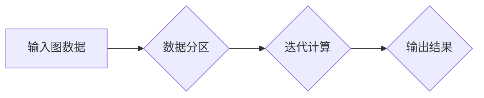

> 图计算框架，Giraph，图算法，数据处理，分布式计算，Hadoop，Spark

## 1. 背景介绍

随着互联网和移动互联网的蓬勃发展，海量数据呈指数级增长，其中图数据作为一种重要的数据类型，在社交网络、推荐系统、知识图谱、生物信息学等领域发挥着越来越重要的作用。传统的数据库和数据处理技术难以有效地处理复杂图数据，因此，图计算框架应运而生。

Giraph是一个开源的图计算框架，基于Hadoop平台，提供了一种高效、分布式的图计算解决方案。它支持多种图算法，例如PageRank、ShortestPath、ConnectedComponents等，并能够处理海量图数据。Giraph的出现，为图数据分析和挖掘提供了强大的工具，推动了图计算技术的快速发展。

## 2. 核心概念与联系

Giraph的核心概念包括图、顶点、边、算法、迭代、数据分区等。

**图:** 图是由顶点和边组成的集合，顶点代表实体，边代表实体之间的关系。

**顶点:** 图中的节点，代表一个实体。

**边:** 连接两个顶点的线，代表两个实体之间的关系。

**算法:** 图计算框架支持多种图算法，例如PageRank、ShortestPath、ConnectedComponents等。

**迭代:** Giraph采用迭代的方式进行图计算，通过多次迭代，逐步计算出图的最终结果。

**数据分区:** Giraph将图数据划分为多个分区，并分布在不同的节点上，以实现分布式计算。

**Mermaid 流程图:**



## 3. 核心算法原理 & 具体操作步骤

### 3.1  算法原理概述

Giraph支持多种图算法，例如PageRank算法。PageRank算法是一种用于计算网页重要性的算法，它基于网页之间的链接关系，将网页的重要性赋予一个数值。

### 3.2  算法步骤详解

1. **初始化:** 为每个网页赋予一个初始PageRank值，通常为1。

2. **迭代计算:** 

   - 对于每个网页，计算其所有指向它的网页的PageRank值之和。
   - 将该和除以指向该网页的网页的数量，得到该网页的新的PageRank值。
   - 重复上述步骤，直到PageRank值收敛。

3. **输出结果:** 输出每个网页的最终PageRank值。

### 3.3  算法优缺点

**优点:**

- 能够有效地计算网页的重要性。
- 算法原理简单易懂。

**缺点:**

- 对于动态变化的网页链接关系，算法需要重新计算，效率较低。
- 无法完全反映网页的真实重要性。

### 3.4  算法应用领域

PageRank算法广泛应用于搜索引擎排名、社交网络分析、推荐系统等领域。

## 4. 数学模型和公式 & 详细讲解 & 举例说明

### 4.1  数学模型构建

PageRank算法的数学模型可以表示为以下公式：

$$PR(A) = (1-d) + d \sum_{i \in I(A)} \frac{PR(i)}{C(i)}$$

其中：

- $PR(A)$ 表示网页A的PageRank值。
- $d$ 表示阻尼系数，通常取值为0.85。
- $I(A)$ 表示指向网页A的所有网页的集合。
- $PR(i)$ 表示网页i的PageRank值。
- $C(i)$ 表示网页i的出度，即指向其他网页的数量。

### 4.2  公式推导过程

PageRank算法的公式推导过程基于马尔科夫链的理论。

假设用户在网页之间随机跳转，每个网页都有一个跳转概率，该概率等于该网页的PageRank值除以该网页的出度。

根据马尔科夫链的理论，用户在网页之间的跳转过程是一个稳态过程，最终会达到一个稳定的状态，此时每个网页的跳转概率等于该网页的PageRank值。

### 4.3  案例分析与讲解

假设有三个网页A、B、C，它们的PageRank值分别为0.5、0.3、0.2。

网页A指向网页B和C，网页B指向网页A，网页C不指向任何网页。

根据PageRank算法的公式，我们可以计算出每个网页的新的PageRank值：

$$PR(A) = (1-0.85) + 0.85 \times (\frac{0.3}{1} + \frac{0.2}{1}) = 0.15 + 0.85 \times 0.5 = 0.525$$

$$PR(B) = (1-0.85) + 0.85 \times (\frac{0.525}{1}) = 0.15 + 0.85 \times 0.525 = 0.525$$

$$PR(C) = (1-0.85) + 0.85 \times (\frac{0.525}{1}) = 0.15 + 0.85 \times 0.525 = 0.525$$

## 5. 项目实践：代码实例和详细解释说明

### 5.1  开发环境搭建

Giraph需要基于Hadoop平台运行，因此需要先搭建Hadoop环境。

### 5.2  源代码详细实现

Giraph提供了丰富的API，可以方便地实现各种图算法。

以下是一个简单的PageRank算法的代码实例：

```java
import org.apache.giraph.graph.BasicComputation;
import org.apache.giraph.graph.Vertex;
import org.apache.hadoop.io.DoubleWritable;
import org.apache.hadoop.io.LongWritable;
import org.apache.hadoop.io.Text;

public class PageRankComputation extends BasicComputation<LongWritable, Text, DoubleWritable, DoubleWritable> {

    private static final double DAMPING_FACTOR = 0.85;

    @Override
    public void compute(Vertex<LongWritable, Text, DoubleWritable> vertex,
                        Iterable<DoubleWritable> messages) throws Exception {
        long vertexId = vertex.getId().get();
        Text vertexValue = vertex.getValue();
        double currentPageRank = vertex.getValue().get();
        double newPageRank = (1 - DAMPING_FACTOR) + DAMPING_FACTOR * sumIncomingMessages(messages);
        vertex.setValue(new DoubleWritable(newPageRank));
        sendMessageToAllNeighbors(new DoubleWritable(currentPageRank / vertexValue.getLength()));
    }

    private double sumIncomingMessages(Iterable<DoubleWritable> messages) {
        double sum = 0;
        for (DoubleWritable message : messages) {
            sum += message.get();
        }
        return sum;
    }
}
```

### 5.3  代码解读与分析

- `PageRankComputation`类继承自`BasicComputation`类，实现PageRank算法。
- `DAMPING_FACTOR`常量表示阻尼系数，通常取值为0.85。
- `compute()`方法执行每个顶点的计算逻辑。
- `sumIncomingMessages()`方法计算所有指向当前顶点的消息的总和。
- `sendMessageToAllNeighbors()`方法将当前顶点的PageRank值发送给所有邻居顶点。

### 5.4  运行结果展示

运行Giraph程序后，可以得到每个网页的最终PageRank值。

## 6. 实际应用场景

Giraph在许多实际应用场景中发挥着重要作用，例如：

### 6.1  社交网络分析

Giraph可以用于分析社交网络的结构和用户之间的关系，例如发现社区、识别关键用户、预测用户行为等。

### 6.2  推荐系统

Giraph可以用于构建基于图的推荐系统，例如推荐用户可能感兴趣的商品、文章、电影等。

### 6.3  知识图谱构建

Giraph可以用于构建知识图谱，例如将实体和关系连接起来，形成一个知识网络。

### 6.4  未来应用展望

Giraph在未来将有更广泛的应用场景，例如：

- **生物信息学:** 分析蛋白质相互作用网络、基因调控网络等。
- **金融领域:** 识别欺诈交易、预测市场风险等。
- **城市规划:** 分析城市交通网络、人口流动等。

## 7. 工具和资源推荐

### 7.1  学习资源推荐

- Giraph官方文档: https://giraph.apache.org/
- Hadoop官方文档: https://hadoop.apache.org/

### 7.2  开发工具推荐

- Eclipse IDE
- IntelliJ IDEA

### 7.3  相关论文推荐

- PageRank: The Anatomy of a Web Page Rank
- Giraph: A Distributed Graph Processing Framework

## 8. 总结：未来发展趋势与挑战

### 8.1  研究成果总结

Giraph是一个高效、分布式的图计算框架，为图数据分析和挖掘提供了强大的工具。

### 8.2  未来发展趋势

Giraph将继续朝着以下方向发展：

- **性能优化:** 提高Giraph的计算效率和吞吐量。
- **功能扩展:** 支持更多类型的图算法和数据结构。
- **易用性提升:** 提供更友好的用户界面和开发工具。

### 8.3  面临的挑战

Giraph还面临一些挑战，例如：

- **大规模图数据处理:** 如何处理海量图数据，提高计算效率。
- **异构图数据处理:** 如何处理不同类型和结构的图数据。
- **隐私保护:** 如何保护图数据中的隐私信息。

### 8.4  研究展望

未来，Giraph的研究将继续关注以下方面：

- **图数据存储和管理:** 开发高效、可扩展的图数据存储和管理系统。
- **图数据分析和挖掘:** 开发更强大的图算法和分析工具，挖掘图数据中的隐藏价值。
- **图计算应用:** 将图计算技术应用于更多领域，解决实际问题。

## 9. 附录：常见问题与解答

### 9.1  Giraph与Hadoop的关系是什么？

Giraph是一个基于Hadoop平台的图计算框架。它利用Hadoop的分布式存储和计算能力，实现高效的图数据处理。

### 9.2  Giraph支持哪些图算法？

Giraph支持多种图算法，例如PageRank、ShortestPath、ConnectedComponents等。

### 9.3  如何安装和配置Giraph？

Giraph的安装和配置过程可以参考官方文档: https://giraph.apache.org/


作者：禅与计算机程序设计艺术 / Zen and the Art of Computer Programming 
<end_of_turn>