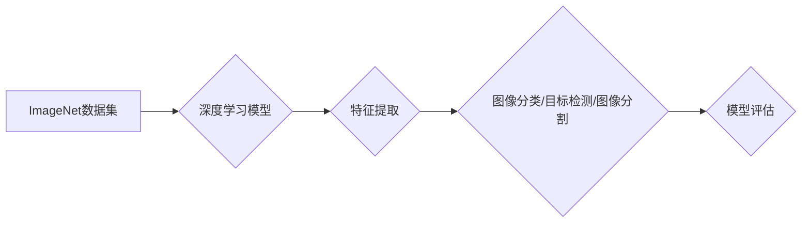

> ImageNet, 深度学习, 计算机视觉, 迁移学习, 算法原理, 模型训练, 应用场景

## 1. 背景介绍

人工智能（AI）的蓬勃发展离不开海量数据的支撑。在计算机视觉领域，ImageNet数据集扮演着至关重要的角色。ImageNet是一个由超过1400万张图像组成的庞大图像数据库，涵盖了超过2万个类别。它为深度学习模型的训练和评估提供了丰富的样本，推动了计算机视觉技术的飞速发展。

ImageNet的诞生源于2009年，由斯坦福大学的Daphne Koller和Princeton大学的Yann LeCun等学者发起。他们意识到，传统的计算机视觉算法难以处理图像的复杂性和多样性，而深度学习模型具有强大的学习能力，能够从海量数据中提取特征，从而实现更准确的图像识别。

为了验证深度学习模型的潜力，ImageNet组织了ImageNet Large Scale Visual Recognition Challenge（ILSVRC），这是一个面向全球计算机视觉研究者的竞赛。每年，参赛者都会提交他们的模型，并在ImageNet数据集上进行测试，最终评选出最佳模型。

## 2. 核心概念与联系

ImageNet数据集的核心概念包括：

* **图像分类:** 将图像归类到特定的类别中，例如猫、狗、汽车等。
* **目标检测:** 在图像中识别和定位特定的目标，例如人脸、车辆、交通标志等。
* **图像分割:** 将图像分割成不同的区域，每个区域对应一个特定的类别。

ImageNet数据集与深度学习模型之间的联系如下：

* **数据驱动:** 深度学习模型的训练依赖于海量数据，ImageNet数据集提供了丰富的训练样本。
* **特征提取:** 深度学习模型能够从图像中自动提取特征，而ImageNet数据集的标签信息可以指导模型学习有效的特征。
* **模型评估:** ImageNet数据集可以用来评估深度学习模型的性能，例如准确率、召回率、F1-score等。

**Mermaid 流程图:**



## 3. 核心算法原理 & 具体操作步骤

### 3.1  算法原理概述

深度学习模型的核心算法是卷积神经网络（CNN）。CNN是一种专门用于处理图像数据的网络结构，它能够学习图像的特征，并进行分类、检测或分割。

CNN的结构主要由以下几个部分组成：

* **卷积层:** 使用卷积核对图像进行卷积运算，提取图像的局部特征。
* **池化层:** 对卷积层的输出进行降维，减少计算量，并提高模型的鲁棒性。
* **全连接层:** 将池化层的输出连接到全连接层，进行分类或回归。

### 3.2  算法步骤详解

1. **数据预处理:** 将图像数据预处理，例如调整大小、归一化等。
2. **模型构建:** 根据任务需求，构建CNN模型，包括卷积层、池化层和全连接层。
3. **模型训练:** 使用ImageNet数据集训练模型，通过反向传播算法更新模型参数。
4. **模型评估:** 在测试集上评估模型的性能，例如准确率、召回率、F1-score等。
5. **模型调优:** 根据评估结果，调整模型参数或结构，提高模型性能。

### 3.3  算法优缺点

**优点:**

* **高准确率:** CNN能够学习图像的复杂特征，从而实现高准确率的图像识别。
* **鲁棒性:** 池化层可以提高模型的鲁棒性，使其对图像的噪声和变形更具抵抗力。
* **可迁移性:** 训练好的CNN模型可以迁移到其他图像识别任务中，例如目标检测、图像分割等。

**缺点:**

* **计算量大:** CNN的训练需要大量的计算资源。
* **参数量大:** CNN模型的参数量较大，需要大量的存储空间。
* **数据依赖:** CNN模型的性能依赖于训练数据的质量和数量。

### 3.4  算法应用领域

CNN算法广泛应用于以下领域：

* **图像分类:** 自动识别图像中的物体类别，例如猫、狗、汽车等。
* **目标检测:** 在图像中定位和识别特定的目标，例如人脸、车辆、交通标志等。
* **图像分割:** 将图像分割成不同的区域，每个区域对应一个特定的类别。
* **视频分析:** 分析视频内容，例如动作识别、场景理解等。
* **医疗诊断:** 辅助医生进行疾病诊断，例如肿瘤检测、病灶识别等。

## 4. 数学模型和公式 & 详细讲解 & 举例说明

### 4.1  数学模型构建

CNN模型的数学模型主要基于卷积运算和激活函数。

* **卷积运算:** 卷积运算是一种线性运算，它将卷积核与图像进行滑动计算，提取图像的局部特征。

* **激活函数:** 激活函数用于引入非线性，使模型能够学习更复杂的特征。常用的激活函数包括ReLU、Sigmoid和Tanh等。

### 4.2  公式推导过程

**卷积运算公式:**

$$
y(i,j) = \sum_{m=0}^{M-1} \sum_{n=0}^{N-1} x(i+m,j+n) * w(m,n)
$$

其中：

* $y(i,j)$ 是卷积输出的像素值。
* $x(i+m,j+n)$ 是输入图像的像素值。
* $w(m,n)$ 是卷积核的权值。
* $M$ 和 $N$ 是卷积核的大小。

**ReLU激活函数公式:**

$$
f(x) = max(0, x)
$$

### 4.3  案例分析与讲解

假设我们有一个3x3的卷积核，用于提取图像的边缘特征。卷积核的权值如下：

$$
w = \begin{bmatrix}
-1 & 0 & 1 \\
-1 & 0 & 1 \\
-1 & 0 & 1
\end{bmatrix}
$$

当卷积核滑动到图像上的一个像素点时，它会与该像素点及其周围的像素点进行卷积运算，从而提取该像素点的边缘特征。

## 5. 项目实践：代码实例和详细解释说明

### 5.1  开发环境搭建

* **操作系统:** Ubuntu 18.04
* **编程语言:** Python 3.6
* **深度学习框架:** TensorFlow 2.0

### 5.2  源代码详细实现

```python
import tensorflow as tf

# 定义卷积神经网络模型
model = tf.keras.models.Sequential([
    tf.keras.layers.Conv2D(32, (3, 3), activation='relu', input_shape=(224, 224, 3)),
    tf.keras.layers.MaxPooling2D((2, 2)),
    tf.keras.layers.Conv2D(64, (3, 3), activation='relu'),
    tf.keras.layers.MaxPooling2D((2, 2)),
    tf.keras.layers.Flatten(),
    tf.keras.layers.Dense(10, activation='softmax')
])

# 编译模型
model.compile(optimizer='adam',
              loss='sparse_categorical_crossentropy',
              metrics=['accuracy'])

# 训练模型
model.fit(x_train, y_train, epochs=10)

# 评估模型
loss, accuracy = model.evaluate(x_test, y_test)
print('Test loss:', loss)
print('Test accuracy:', accuracy)
```

### 5.3  代码解读与分析

* **模型定义:** 使用`tf.keras.models.Sequential`定义一个顺序模型，包含卷积层、池化层和全连接层。
* **卷积层:** 使用`tf.keras.layers.Conv2D`定义卷积层，提取图像的局部特征。
* **池化层:** 使用`tf.keras.layers.MaxPooling2D`定义池化层，对卷积层的输出进行降维。
* **全连接层:** 使用`tf.keras.layers.Dense`定义全连接层，进行分类。
* **模型编译:** 使用`model.compile`编译模型，指定优化器、损失函数和评价指标。
* **模型训练:** 使用`model.fit`训练模型，传入训练数据和训练轮数。
* **模型评估:** 使用`model.evaluate`评估模型，传入测试数据和真实标签。

### 5.4  运行结果展示

训练完成后，模型会输出测试集上的损失值和准确率。

## 6. 实际应用场景

### 6.1  图像分类

ImageNet数据集的图像分类任务是深度学习模型的经典应用场景。例如，可以训练一个模型识别不同种类的动物、植物、交通工具等。

### 6.2  目标检测

ImageNet数据集也可以用于训练目标检测模型，例如识别图像中的人脸、车辆、交通标志等。

### 6.3  图像分割

ImageNet数据集可以用于训练图像分割模型，例如将图像分割成不同的区域，每个区域对应一个特定的类别。

### 6.4  未来应用展望

随着深度学习技术的不断发展，ImageNet数据集将在更多领域得到应用，例如：

* **自动驾驶:** 帮助自动驾驶汽车识别道路上的障碍物、交通信号灯等。
* **医疗诊断:** 辅助医生进行疾病诊断，例如识别肿瘤、骨折等。
* **机器人视觉:** 帮助机器人理解周围环境，进行导航和操作。

## 7. 工具和资源推荐

### 7.1  学习资源推荐

* **深度学习书籍:**
    * 《深度学习》
    * 《动手学深度学习》
* **在线课程:**
    * Coursera: 深度学习
    * Udacity: 深度学习工程师

### 7.2  开发工具推荐

* **深度学习框架:** TensorFlow, PyTorch
* **图像处理库:** OpenCV

### 7.3  相关论文推荐

* **ImageNet Classification with Deep Convolutional Neural Networks**
* **AlexNet**
* **VGGNet**

## 8. 总结：未来发展趋势与挑战

### 8.1  研究成果总结

ImageNet数据集和深度学习模型的结合推动了计算机视觉技术的飞速发展，取得了显著的成果。例如，图像分类、目标检测和图像分割的准确率大幅提升。

### 8.2  未来发展趋势

* **模型规模和复杂度:** 未来深度学习模型将更加庞大复杂，能够学习更复杂的特征。
* **数据增强:** 数据增强技术将更加成熟，能够生成更多高质量的训练数据。
* **迁移学习:** 迁移学习技术将更加广泛应用，能够将预训练模型迁移到新的任务中。

### 8.3  面临的挑战

* **数据标注:** 大规模图像数据标注仍然是一个难题。
* **计算资源:** 训练大型深度学习模型需要大量的计算资源。
* **模型解释性:** 深度学习模型的决策过程难以解释，这限制了其在一些领域中的应用。

### 8.4  研究展望

未来研究将集中在以下几个方面:

* **高效的深度学习算法:** 开发更加高效的深度学习算法，能够在有限的计算资源下训练出高性能的模型。
* **可解释的深度学习模型:** 研究可解释的深度学习模型，能够解释模型的决策过程。
* **跨模态学习:** 研究跨模态学习，能够将不同模态的数据融合在一起，例如图像和文本。

## 9. 附录：常见问题与解答

**Q1: ImageNet数据集的规模有多大？**

A1: ImageNet数据集包含超过1400万张图像，涵盖超过2万个类别。

**Q2: 如何使用ImageNet数据集进行训练？**

A2: 可以使用深度学习框架，例如TensorFlow或PyTorch，加载ImageNet数据集并训练模型。

**Q3: Image