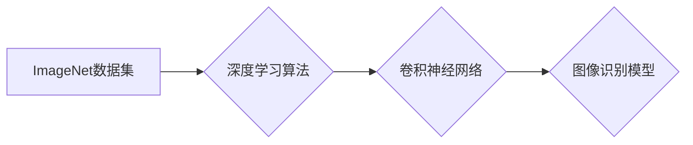

> ImageNet, 图像识别, 深度学习, 卷积神经网络, 计算机视觉, 数据集, 迁移学习

## 1. 背景介绍

图像识别作为人工智能领域的重要分支，在过去几十年中取得了长足的进步。从传统的基于规则的图像识别方法到如今的深度学习时代，图像识别技术在各个领域都得到了广泛应用，例如医疗诊断、自动驾驶、人脸识别、物体检测等。

ImageNet是一个由斯坦福大学和麻省理工学院共同创建的大规模图像识别数据集，它包含了超过1400万张图像，并被分类到超过2万个类别。ImageNet的建立标志着深度学习在图像识别领域的重大突破，它为研究人员和开发者提供了大量的训练数据，促进了深度学习算法的快速发展。

## 2. 核心概念与联系

### 2.1  ImageNet数据集

ImageNet数据集包含了来自互联网的各种图像，涵盖了广泛的主题和场景。每个图像都配有相应的标签，用于标注图像的内容。ImageNet数据集的规模和多样性使其成为深度学习图像识别模型训练的理想选择。

### 2.2  深度学习

深度学习是一种机器学习的子领域，它利用多层神经网络来学习数据中的复杂模式。深度学习算法能够自动从数据中提取特征，无需人工特征工程。

### 2.3  卷积神经网络 (CNN)

卷积神经网络是一种专门用于处理图像数据的深度学习算法。CNN利用卷积操作和池化操作来提取图像特征，并通过全连接层进行分类。CNN的结构和功能使其非常适合图像识别任务。

**ImageNet与深度学习的关系**

ImageNet数据集为深度学习算法提供了大量的训练数据，而深度学习算法，特别是卷积神经网络，能够有效地学习ImageNet数据集中的图像特征，从而提高图像识别的准确率。

**Mermaid 流程图**

## 3. 核心算法原理 & 具体操作步骤

### 3.1  算法原理概述

卷积神经网络 (CNN) 是一种专门用于处理图像数据的深度学习算法。CNN 的结构灵感来源于生物视觉系统，它由多个卷积层、池化层和全连接层组成。

* **卷积层:** 卷积层使用卷积核 (filter) 来提取图像特征。卷积核是一个小的矩阵，它在图像上滑动，并计算每个位置的卷积结果。卷积操作可以提取图像的边缘、纹理等特征。

* **池化层:** 池化层用于降低图像尺寸，并提取图像的鲁棒性特征。常见的池化操作包括最大池化和平均池化。

* **全连接层:** 全连接层将卷积层和池化层提取的特征进行分类。全连接层将每个特征映射到一个类别，并使用 softmax 函数输出每个类别的概率。

### 3.2  算法步骤详解

1. **数据预处理:** 将图像数据预处理，例如调整大小、归一化等。

2. **卷积层:** 将图像输入到卷积层，使用卷积核提取图像特征。

3. **池化层:** 对卷积层的输出进行池化操作，降低图像尺寸并提取鲁棒性特征。

4. **重复步骤 2 和 3:** 将卷积层和池化层重复若干次，以提取更深层次的特征。

5. **全连接层:** 将卷积层和池化层提取的特征输入到全连接层，进行分类。

6. **输出结果:** 使用 softmax 函数输出每个类别的概率，并选择概率最高的类别作为最终预测结果。

### 3.3  算法优缺点

**优点:**

* 能够自动学习图像特征，无需人工特征工程。
* 能够处理高维图像数据。
* 在图像识别任务中取得了优异的性能。

**缺点:**

* 训练时间长，需要大量的计算资源。
* 对训练数据要求高，数据质量直接影响模型性能。
* 难以解释模型的决策过程。

### 3.4  算法应用领域

* **图像分类:** 将图像分类到预定义的类别中。
* **物体检测:** 在图像中检测到特定物体的位置和类别。
* **图像分割:** 将图像分割成不同的区域，每个区域代表不同的物体或场景。
* **人脸识别:** 根据人脸特征识别个人身份。

## 4. 数学模型和公式 & 详细讲解 & 举例说明

### 4.1  数学模型构建

卷积神经网络的数学模型主要包括卷积操作、池化操作和全连接操作。

**卷积操作:**

$$
y_{i,j} = \sum_{m=0}^{M-1} \sum_{n=0}^{N-1} x_{i+m,j+n} * w_{m,n} + b
$$

其中:

* $x_{i,j}$ 是输入图像的像素值。
* $w_{m,n}$ 是卷积核的权重值。
* $b$ 是偏置项。
* $y_{i,j}$ 是卷积层的输出值。

**池化操作:**

常见的池化操作包括最大池化和平均池化。

* **最大池化:** 选择池化窗口内最大值作为输出。
* **平均池化:** 计算池化窗口内所有像素值的平均值作为输出。

**全连接操作:**

全连接层将卷积层和池化层提取的特征进行分类。全连接层的输出可以使用 softmax 函数进行归一化，得到每个类别的概率。

$$
p_i = \frac{e^{z_i}}{\sum_{j=1}^{C} e^{z_j}}
$$

其中:

* $p_i$ 是第 $i$ 个类别的概率。
* $z_i$ 是第 $i$ 个类别的得分。
* $C$ 是类别总数。

### 4.2  公式推导过程

卷积操作的公式推导过程可以参考相关机器学习教材或论文。

### 4.3  案例分析与讲解

可以以 ImageNet 数据集中的某个图像分类任务为例，分析卷积神经网络的训练过程和预测结果。

## 5. 项目实践：代码实例和详细解释说明

### 5.1  开发环境搭建

使用 Python 语言和深度学习框架 TensorFlow 或 PyTorch 搭建开发环境。

### 5.2  源代码详细实现

使用 TensorFlow 或 PyTorch 的 API 实现一个简单的卷积神经网络模型，并使用 ImageNet 数据集进行训练。

### 5.3  代码解读与分析

解释代码中使用的函数、类和参数，并分析模型的结构和训练过程。

### 5.4  运行结果展示

展示模型的训练过程和测试结果，包括准确率、损失函数等指标。

## 6. 实际应用场景

### 6.1  医疗诊断

使用卷积神经网络对医学图像进行分析，例如 X 光片、CT 扫描、MRI 图像等，辅助医生诊断疾病。

### 6.2  自动驾驶

使用卷积神经网络识别道路上的物体，例如车辆、行人、交通信号灯等，帮助自动驾驶汽车安全行驶。

### 6.3  人脸识别

使用卷积神经网络识别人脸特征，用于身份验证、人脸搜索等应用。

### 6.4  未来应用展望

卷积神经网络在图像识别领域的应用前景广阔，未来可能在更多领域得到应用，例如：

* **图像生成:** 使用卷积神经网络生成逼真的图像。
* **图像编辑:** 使用卷积神经网络对图像进行编辑，例如修复图像、改变图像风格等。
* **视频分析:** 使用卷积神经网络分析视频内容，例如识别视频中的物体、事件等。

## 7. 工具和资源推荐

### 7.1  学习资源推荐

* **书籍:**
    * 深度学习 (Deep Learning) - Ian Goodfellow, Yoshua Bengio, Aaron Courville
    * 计算机视觉:算法与应用 (Computer Vision: Algorithms and Applications) - Richard Szeliski
* **在线课程:**
    * Coursera: 深度学习 Specialization
    * Udacity: 计算机视觉 Nanodegree

### 7.2  开发工具推荐

* **深度学习框架:** TensorFlow, PyTorch
* **图像处理库:** OpenCV, Pillow

### 7.3  相关论文推荐

* ImageNet Classification with Deep Convolutional Neural Networks - Alex Krizhevsky, Ilya Sutskever, Geoffrey E. Hinton
* Going Deeper with Convolutions - Christian Szegedy, Wei Liu, Yangqing Jia, Pierre Sermanet, Scott Reed, Dragomir Anguelov, Dumitru Erhan, Vincent Vanhoucke, Andrew Rabinovich

## 8. 总结：未来发展趋势与挑战

### 8.1  研究成果总结

ImageNet 数据集和深度学习算法的结合推动了图像识别领域的快速发展，取得了显著的成果。卷积神经网络在图像识别任务中取得了优异的性能，并被广泛应用于各个领域。

### 8.2  未来发展趋势

* **模型更深更广:** 研究更深层次、更广阔的卷积神经网络模型，以提高图像识别精度和泛化能力。
* **迁移学习:** 利用预训练模型进行迁移学习，减少训练数据和训练时间。
* **解释性模型:** 研究更具解释性的卷积神经网络模型，以便更好地理解模型的决策过程。
* **边缘计算:** 将卷积神经网络部署到边缘设备上，实现实时图像识别。

### 8.3  面临的挑战

* **数据标注:** 高质量的图像数据标注仍然是一个挑战，需要大量的人工标注工作。
* **计算资源:** 训练大型卷积神经网络需要大量的计算资源，成本较高。
* **模型可解释性:** 卷积神经网络的决策过程难以解释，这限制了其在一些安全关键应用中的应用。

### 8.4  研究展望

未来，图像识别领域的研究将继续朝着更深、更广、更智能的方向发展，并将在更多领域得到应用，为人类社会带来更多便利和福祉。

## 9. 附录：常见问题与解答

* **什么是 ImageNet 数据集？**

ImageNet 是一个包含超过1400万张图像的大规模图像识别数据集，被分类到超过2万个类别。

* **卷积神经网络 (CNN) 是什么？**

卷积神经网络是一种专门用于处理图像数据的深度学习算法，它利用卷积操作和池化操作来提取图像特征，并通过全连接层进行分类。

* **ImageNet 数据集对图像识别领域有什么影响？**

ImageNet 数据集为深度学习算法提供了大量的训练数据，促进了深度学习算法在图像识别领域的快速发展。

* **如何使用 ImageNet 数据集进行图像识别任务？**

可以使用深度学习框架 TensorFlow 或 PyTorch，并使用 ImageNet 数据集进行模型训练和测试。

* **ImageNet 数据集的未来发展趋势是什么？**

未来，ImageNet 数据集将继续扩大规模，并涵盖更多类别和场景，以满足深度学习算法的训练需求。

作者：禅与计算机程序设计艺术 / Zen and the Art of Computer Programming 
<end_of_turn>