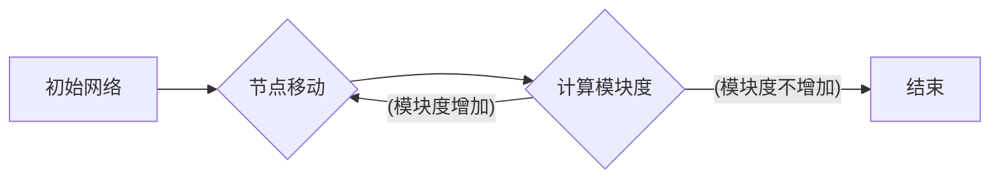

> Louvain算法，社区发现，网络分析，图论，Python

## 1. 背景介绍

在当今数据爆炸的时代，网络数据以指数级增长，如何有效地挖掘网络中的隐藏结构和模式成为了一个重要的研究课题。社区发现作为网络分析领域的核心问题之一，旨在将网络节点划分为若干个紧密连接的子集，即社区，这些社区之间连接相对稀疏。社区发现算法可以帮助我们理解网络的结构，发现网络中的潜在关系和信息，并应用于各种领域，例如社交网络分析、推荐系统、生物网络分析等。

Louvain算法是一种基于贪心策略的社区发现算法，它在2008年由Vincent D Blondel等学者提出，并迅速成为社区发现领域最受欢迎的算法之一。Louvain算法的优势在于其计算效率高，能够处理规模较大的网络，同时也能发现较为合理的社区结构。

## 2. 核心概念与联系

### 2.1  网络表示

在社区发现算法中，网络通常用图论模型来表示，其中节点代表网络中的实体，边代表实体之间的关系。

### 2.2  社区结构

社区是指网络中紧密连接的节点子集，这些节点之间连接密度高，而与其他社区的连接密度相对较低。

### 2.3  模块度

模块度是衡量社区结构优劣的指标，它反映了社区结构的“紧密程度”。模块度越高，社区结构越优。

**Louvain算法流程图**



## 3. 核心算法原理 & 具体操作步骤

### 3.1  算法原理概述

Louvain算法的核心思想是通过迭代地移动节点来优化网络的模块度。算法首先将网络中的每个节点作为一个独立的社区，然后通过以下步骤迭代优化社区结构：

1. 对于每个节点，计算它移动到其他社区的模块度变化量。
2. 选择使模块度增加最大的节点移动到对应的社区。
3. 重复步骤1和2，直到模块度不再增加。

### 3.2  算法步骤详解

1. **初始化:** 将网络中的每个节点作为一个独立的社区。
2. **迭代:** 
    * 对于每个节点，计算它移动到其他社区的模块度变化量。
    * 选择使模块度增加最大的节点移动到对应的社区。
    * 重复上述步骤，直到模块度不再增加。

### 3.3  算法优缺点

**优点:**

* 计算效率高，能够处理规模较大的网络。
* 能够发现较为合理的社区结构。

**缺点:**

* 容易陷入局部最优解。
* 对网络结构的敏感性较高，不同的初始社区划分可能会导致不同的结果。

### 3.4  算法应用领域

Louvain算法广泛应用于以下领域：

* 社交网络分析
* 推荐系统
* 生物网络分析
* 文本挖掘
* 图像分割

## 4. 数学模型和公式 & 详细讲解 & 举例说明

### 4.1  数学模型构建

Louvain算法的核心是模块度函数，它用来衡量社区结构的优劣。模块度函数定义如下：

$$Q = \frac{1}{2m} \sum_{i,j} A_{ij} \left( \frac{k_i}{2m} - \frac{c_i c_j}{2m} \right)$$

其中：

* $m$ 是网络中边的总数。
* $A_{ij}$ 是节点 $i$ 和节点 $j$ 之间的边权重，如果存在边则为 1，否则为 0。
* $k_i$ 是节点 $i$ 的度数，即与节点 $i$ 相连的边的数量。
* $c_i$ 是节点 $i$ 所属的社区的标识。

### 4.2  公式推导过程

模块度函数的推导过程较为复杂，涉及到网络结构的分析和概率论的知识。

### 4.3  案例分析与讲解

假设有一个网络，其中节点 A 和 B 属于同一个社区，节点 C 和 D 属于另一个社区。如果将节点 A 移动到另一个社区，则模块度会发生变化。可以通过计算模块度函数的变化量来判断节点 A 移动到另一个社区是否会提高模块度。

## 5. 项目实践：代码实例和详细解释说明

### 5.1  开发环境搭建

本项目使用 Python 语言进行开发，需要安装以下库：

* NetworkX: 用于构建和操作网络图。
* Scikit-learn: 用于数据处理和模型评估。

### 5.2  源代码详细实现

```python
import networkx as nx
from community import community_louvain

# 创建网络图
G = nx.karate_club_graph()

# 使用 Louvain 算法进行社区发现
partition = community_louvain.best_partition(G)

# 打印社区划分结果
print(partition)

# 可视化社区结构
nx.draw(G, partition.keys(), with_labels=True, node_color=[partition[node] for node in G.nodes()])
plt.show()
```

### 5.3  代码解读与分析

* `networkx.karate_club_graph()`: 创建一个标准的社交网络图，用于演示 Louvain 算法。
* `community_louvain.best_partition(G)`: 使用 Louvain 算法对网络图 G 进行社区发现，返回一个字典，其中键为节点，值为节点所属的社区标识。
* `nx.draw()`: 可视化网络图，将节点颜色根据社区划分进行区分。

### 5.4  运行结果展示

运行代码后，将输出社区划分结果，并生成一个可视化的网络图，其中节点颜色根据社区划分进行区分。

## 6. 实际应用场景

### 6.1  社交网络分析

Louvain算法可以用于分析社交网络，发现用户之间的潜在关系和社区结构。例如，可以发现用户兴趣相似的群体，进行精准的广告投放。

### 6.2  推荐系统

Louvain算法可以用于构建推荐系统，根据用户的兴趣和社区结构，推荐用户可能感兴趣的内容。

### 6.3  生物网络分析

Louvain算法可以用于分析生物网络，发现基因之间的相互作用关系和功能模块。

### 6.4  未来应用展望

随着数据量的不断增长，Louvain算法在未来将有更广泛的应用场景，例如：

* 知识图谱构建
* 文本挖掘
* 图像识别

## 7. 工具和资源推荐

### 7.1  学习资源推荐

* **论文:** Blondel, V. D., Guillaume, J.-L., Lambiotte, R., & Lefebvre, E. (2008). Fast unfolding of communities in large networks. Journal of Statistical Mechanics: Theory and Experiment, 2008(10), P10008.
* **书籍:**
* **在线课程:** Coursera, edX 等平台提供网络分析相关的课程。

### 7.2  开发工具推荐

* **NetworkX:** Python 库，用于构建和操作网络图。
* **Gephi:** 用于可视化和分析网络图的开源软件。

### 7.3  相关论文推荐

* Girvan, M., & Newman, M. E. (2002). Community structure in social networks. Proceedings of the National Academy of Sciences, 99(12), 7821-7826.
* Newman, M. E. J. (2006). Finding and evaluating community structure in networks. Physical review E, 74(3), 036104.

## 8. 总结：未来发展趋势与挑战

### 8.1  研究成果总结

Louvain算法在社区发现领域取得了显著的成果，为网络分析提供了有效的工具。

### 8.2  未来发展趋势

未来社区发现算法的研究方向包括：

* 探索新的社区发现算法，提高算法的效率和准确性。
* 研究动态网络的社区发现算法，能够适应网络结构的不断变化。
* 将社区发现算法与其他机器学习算法结合，提高社区发现的精度和泛化能力。

### 8.3  面临的挑战

社区发现算法面临的挑战包括：

* 如何处理大规模网络数据。
* 如何提高算法的鲁棒性，使其能够适应不同的网络结构。
* 如何量化社区结构的质量，并将其与实际应用场景相结合。

### 8.4  研究展望

社区发现算法的研究前景广阔，未来将继续推动网络分析领域的发展，为我们理解复杂网络结构提供更深入的洞察。

## 9. 附录：常见问题与解答

### 9.1  Q1: Louvain算法的计算复杂度是多少？

### 9.2  Q2: Louvain算法的初始社区划分对结果有什么影响？

### 9.3  Q3: 如何评估社区发现算法的性能？

### 9.4  Q4: Louvain算法有哪些改进版本？

### 9.5  Q5: Louvain算法有哪些局限性？


作者：禅与计算机程序设计艺术 / Zen and the Art of Computer Programming 
<end_of_turn>