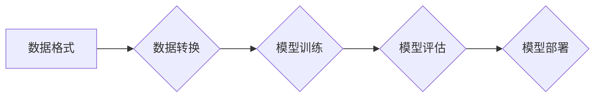

> MLlib,机器学习,Spark,算法原理,代码实例,实践应用

## 1. 背景介绍

在当今数据爆炸的时代，机器学习（Machine Learning，ML）已成为解决复杂问题、挖掘数据价值的关键技术。Spark MLlib 是 Apache Spark 的机器学习库，为大规模数据上的机器学习提供了高效、易用的工具。它支持多种机器学习算法，涵盖分类、回归、聚类、推荐系统等领域，并提供了丰富的 API 和接口，方便用户进行模型训练、评估和部署。

Spark MLlib 的优势在于：

* **高性能：** 基于 Spark 的分布式计算框架，能够充分利用集群资源，实现高吞吐量和低延迟的机器学习训练。
* **易用性：** 提供简洁易用的 API，用户无需深入了解底层算法实现，即可快速构建和训练机器学习模型。
* **灵活性：** 支持多种数据格式和算法，能够满足不同场景的需求。
* **开源免费：** 作为 Apache Spark 的一部分，MLlib 是开源免费的，用户可以自由使用和修改。

## 2. 核心概念与联系

MLlib 的核心概念包括：

* **数据格式：** MLlib 支持多种数据格式，例如文本文件、CSV 文件、Parquet 文件等。
* **数据转换：** 提供数据预处理、特征工程等工具，帮助用户将原始数据转换为适合机器学习算法的格式。
* **模型训练：** 支持多种机器学习算法，例如线性回归、逻辑回归、决策树、随机森林、支持向量机等。
* **模型评估：** 提供模型评估指标，例如准确率、召回率、F1 值等，帮助用户评估模型性能。
* **模型部署：** 支持将训练好的模型部署到生产环境中，用于进行预测或其他应用。

**核心概念架构图：**



## 3. 核心算法原理 & 具体操作步骤

### 3.1  算法原理概述

本节将以线性回归为例，介绍 MLlib 中常用的机器学习算法原理。

线性回归是一种监督学习算法，用于预测连续值。其基本思想是找到一条直线或超平面，使得预测值与真实值之间的误差最小。

### 3.2  算法步骤详解

1. **数据准备：** 将数据转换为 MLlib 支持的格式，例如 RDD。
2. **特征工程：** 对数据进行预处理，例如特征缩放、缺失值处理等。
3. **模型训练：** 使用梯度下降算法训练线性回归模型，找到最佳的权重参数。
4. **模型评估：** 使用测试数据评估模型性能，例如计算均方误差 (MSE)。
5. **模型部署：** 将训练好的模型部署到生产环境中，用于进行预测。

### 3.3  算法优缺点

**优点：**

* 算法简单易懂，易于实现。
* 计算效率高，适合处理大规模数据。
* 可解释性强，可以直观地理解模型的决策边界。

**缺点：**

* 只能处理线性关系的数据。
* 对异常值敏感。

### 3.4  算法应用领域

线性回归广泛应用于以下领域：

* **预测分析：** 预测销售额、房价、股票价格等。
* **风险评估：** 评估贷款风险、信用风险等。
* **广告投放：** 预测广告点击率、转化率等。

## 4. 数学模型和公式 & 详细讲解 & 举例说明

### 4.1  数学模型构建

线性回归模型的数学表达式为：

$$
y = \theta_0 + \theta_1 x_1 + \theta_2 x_2 + ... + \theta_n x_n + \epsilon
$$

其中：

* $y$ 是预测值。
* $\theta_0, \theta_1, ..., \theta_n$ 是模型参数，也称为权重。
* $x_1, x_2, ..., x_n$ 是输入特征。
* $\epsilon$ 是误差项。

### 4.2  公式推导过程

为了找到最佳的权重参数，我们需要最小化模型的误差。常用的误差函数是均方误差 (MSE)：

$$
MSE = \frac{1}{n} \sum_{i=1}^{n} (y_i - \hat{y}_i)^2
$$

其中：

* $n$ 是样本数量。
* $y_i$ 是真实值。
* $\hat{y}_i$ 是预测值。

通过梯度下降算法，我们可以迭代地更新权重参数，使得 MSE 逐渐减小。

### 4.3  案例分析与讲解

假设我们想要预测房屋价格，输入特征包括房屋面积、房间数量、地理位置等。我们可以使用线性回归模型进行预测。

通过训练数据，我们可以得到模型参数，例如：

* $\theta_0 = 100000$
* $\theta_1 = 500$ (房屋面积每增加 1 平方米，价格增加 500 元)
* $\theta_2 = 10000$ (每增加一个房间，价格增加 10000 元)

根据这些参数，我们可以预测新房子的价格。例如，如果新房子的面积为 100 平方米，房间数量为 3 个，那么预测价格为：

$$
\hat{y} = 100000 + 500 * 100 + 10000 * 3 = 200000
$$

## 5. 项目实践：代码实例和详细解释说明

### 5.1  开发环境搭建

* 安装 Java JDK
* 安装 Apache Spark
* 安装 MLlib 依赖库

### 5.2  源代码详细实现

```python
from pyspark.ml import Pipeline
from pyspark.ml.classification import LogisticRegression
from pyspark.ml.feature import VectorAssembler
from pyspark.sql import SparkSession

# 创建 SparkSession
spark = SparkSession.builder.appName("MLlibExample").getOrCreate()

# 加载数据
data = spark.read.csv("data.csv", header=True, inferSchema=True)

# 选择特征和目标变量
features = ["feature1", "feature2", "feature3"]
label = "target"

# 使用 VectorAssembler 将特征组合成向量
assembler = VectorAssembler(inputCols=features, outputCol="features")

# 创建 LogisticRegression 模型
lr = LogisticRegression(maxIter=10, regParam=0.1)

# 创建 Pipeline
pipeline = Pipeline(stages=[assembler, lr])

# 训练模型
model = pipeline.fit(data)

# 预测结果
predictions = model.transform(data)

# 显示结果
predictions.show()

# 停止 SparkSession
spark.stop()
```

### 5.3  代码解读与分析

* **数据加载：** 使用 `spark.read.csv()` 加载数据。
* **特征选择：** 选择需要用于训练模型的特征和目标变量。
* **特征组合：** 使用 `VectorAssembler` 将特征组合成向量。
* **模型创建：** 创建 `LogisticRegression` 模型，并设置超参数。
* **Pipeline 创建：** 使用 `Pipeline` 将数据预处理和模型训练步骤组合在一起。
* **模型训练：** 使用 `pipeline.fit()` 训练模型。
* **预测结果：** 使用 `model.transform()` 对数据进行预测。
* **结果展示：** 使用 `predictions.show()` 显示预测结果。

### 5.4  运行结果展示

运行代码后，将显示预测结果，包括预测标签和预测概率。

## 6. 实际应用场景

MLlib 在各个领域都有广泛的应用场景，例如：

* **推荐系统：** 基于用户行为数据，推荐用户可能感兴趣的商品或内容。
* **欺诈检测：** 识别异常交易行为，防止欺诈活动。
* **医疗诊断：** 基于患者病历数据，辅助医生进行诊断。
* **自然语言处理：** 进行文本分类、情感分析、机器翻译等任务。

### 6.4  未来应用展望

随着数据量的不断增长和算法的不断发展，MLlib 将在更多领域发挥重要作用，例如：

* **个性化推荐：** 提供更加精准的个性化推荐服务。
* **智能客服：** 开发更加智能的聊天机器人，提供更便捷的客户服务。
* **自动驾驶：** 辅助自动驾驶系统进行决策，提高驾驶安全性。

## 7. 工具和资源推荐

### 7.1  学习资源推荐

* **Spark 官方文档：** https://spark.apache.org/docs/latest/ml-guide.html
* **MLlib 文档：** https://spark.apache.org/docs/latest/mllib-guide.html
* **Spark 中文社区：** https://spark.apache.org/zh-cn/

### 7.2  开发工具推荐

* **PySpark：** Python API for Spark
* **Scala：** Spark 的主要编程语言

### 7.3  相关论文推荐

* **Spark MLlib：** https://dl.acm.org/doi/10.1145/2939672.2939797

## 8. 总结：未来发展趋势与挑战

### 8.1  研究成果总结

MLlib 作为 Apache Spark 的机器学习库，为大规模数据上的机器学习提供了高效、易用的工具。它支持多种机器学习算法，并提供了丰富的 API 和接口，方便用户进行模型训练、评估和部署。

### 8.2  未来发展趋势

* **算法创新：** 持续开发新的机器学习算法，提高模型的性能和效率。
* **模型解释性：** 研究如何提高机器学习模型的解释性，帮助用户更好地理解模型的决策过程。
* **自动化机器学习：** 开发自动化机器学习工具，降低机器学习的门槛，让更多人能够使用机器学习技术。

### 8.3  面临的挑战

* **数据质量：** 机器学习模型的性能依赖于数据质量，如何处理不完整、不准确的数据仍然是一个挑战。
* **模型可解释性：** 许多机器学习模型是黑盒模型，难以解释其决策过程，这限制了模型在一些领域中的应用。
* **计算资源：** 训练大型机器学习模型需要大量的计算资源，如何降低训练成本是一个重要的挑战。

### 8.4  研究展望

未来，MLlib 将继续朝着更强大、更易用、更可解释的方向发展，为解决更复杂的问题提供更有效的工具。


## 9. 附录：常见问题与解答

**Q1：如何安装 MLlib？**

A1：MLlib 是 Apache Spark 的一部分，因此需要先安装 Spark。安装 Spark 后，MLlib 将自动包含在内。

**Q2：MLlib 支持哪些机器学习算法？**

A2：MLlib 支持多种机器学习算法，包括分类、回归、聚类、推荐系统等。

**Q3：如何评估 MLlib 模型的性能？**

A3：MLlib 提供多种模型评估指标，例如准确率、召回率、F1 值等。

**Q4：如何部署 MLlib 模型？**

A4：MLlib 支持将训练好的模型部署到生产环境中，用于进行预测或其他应用。

**Q5：MLlib 的学习资源有哪些？**

A5：Spark 官方文档、MLlib 文档、Spark 中文社区等都是很好的学习资源。


作者：禅与计算机程序设计艺术 / Zen and the Art of Computer Programming 
<end_of_turn>