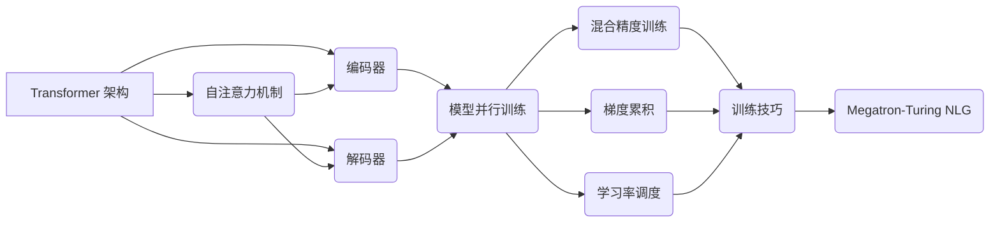

> Megatron-Turing NLG, 大规模语言模型, Transformer, 训练技巧, 代码实例, 实际应用

## 1. 背景介绍

近年来，大规模语言模型（LLM）在自然语言处理领域取得了显著进展，展现出强大的文本生成、翻译、摘要等能力。其中，Megatron-Turing NLG 是由 NVIDIA 和 Microsoft 联合开发的，拥有 530 亿参数的巨型语言模型，在多个 NLP 任务上取得了 state-of-the-art 的性能。

Megatron-Turing NLG 的诞生标志着 LLMs 规模和能力的进一步提升，但也带来了新的挑战，例如训练成本高、模型部署复杂等。本文将深入探讨 Megatron-Turing NLG 的原理、训练技巧、代码实例以及实际应用场景，帮助读者理解和应用这一先进的语言模型。

## 2. 核心概念与联系

Megatron-Turing NLG 基于 Transformer 架构，并结合了多种先进的训练技巧，使其能够处理海量文本数据并生成高质量的文本输出。

**2.1 Transformer 架构**

Transformer 架构是近年来 NLP 领域最成功的模型之一，其核心特点是利用自注意力机制（Self-Attention）来捕捉文本序列中的长距离依赖关系。

**2.2 训练技巧**

Megatron-Turing NLG 的训练过程中采用了多种先进的技巧，例如：

* **模型并行训练:** 将模型参数分布在多个 GPU 上进行训练，以加速训练速度。
* **混合精度训练:** 使用 FP16 格式进行计算，降低内存占用和训练时间。
* **梯度累积:** 将多个梯度累积后再更新模型参数，提高训练稳定性。
* **学习率调度:** 动态调整学习率，帮助模型更快地收敛。

**2.3 核心概念关系图**

## 3. 核心算法原理 & 具体操作步骤

### 3.1  算法原理概述

Megatron-Turing NLG 的核心算法是基于 Transformer 架构的深度学习模型。其训练目标是通过最大化预测下一个词的概率，从而学习语言的语法和语义规律。

### 3.2  算法步骤详解

1. **数据预处理:** 将文本数据进行清洗、分词、词嵌入等预处理操作，使其能够被模型理解。
2. **模型输入:** 将预处理后的文本数据输入到 Transformer 模型中。
3. **编码器:** 编码器将输入文本序列编码成一个固定长度的向量表示，捕捉文本序列中的语义信息。
4. **解码器:** 解码器根据编码器的输出，预测下一个词的概率分布。
5. **损失函数:** 使用交叉熵损失函数计算模型预测结果与真实标签之间的差异。
6. **反向传播:** 利用梯度下降算法更新模型参数，降低损失函数的值。
7. **模型评估:** 在验证集上评估模型的性能，并根据评估结果调整训练参数。

### 3.3  算法优缺点

**优点:**

* 能够捕捉长距离依赖关系，生成更流畅的文本。
* 训练数据量大，模型能力强。
* 能够应用于多种 NLP 任务。

**缺点:**

* 训练成本高，需要大量的计算资源。
* 模型参数量大，部署成本高。
* 训练数据质量对模型性能影响较大。

### 3.4  算法应用领域

Megatron-Turing NLG 广泛应用于以下领域：

* **文本生成:** 自动写作、故事创作、诗歌生成等。
* **机器翻译:** 将一种语言翻译成另一种语言。
* **文本摘要:** 将长篇文本压缩成短篇摘要。
* **对话系统:** 开发更自然、更智能的对话系统。

## 4. 数学模型和公式 & 详细讲解 & 举例说明

### 4.1  数学模型构建

Megatron-Turing NLG 的数学模型基于 Transformer 架构，其核心是自注意力机制和多头注意力机制。

**4.1.1 自注意力机制**

自注意力机制允许模型关注输入序列中的不同位置，并计算每个位置之间的相关性。其计算公式如下：

$$
Attention(Q, K, V) = softmax(\frac{QK^T}{\sqrt{d_k}})V
$$

其中：

* $Q$：查询矩阵
* $K$：键矩阵
* $V$：值矩阵
* $d_k$：键向量的维度

**4.1.2 多头注意力机制**

多头注意力机制将自注意力机制应用于多个不同的子空间，并将其结果进行融合，从而提高模型的表达能力。其计算公式如下：

$$
MultiHead(Q, K, V) = Concat(head_1, head_2, ..., head_h)W^O
$$

其中：

* $head_i$：第 $i$ 个子空间的注意力输出
* $h$：注意力头的数量
* $W^O$：最终输出层的权重矩阵

### 4.2  公式推导过程

自注意力机制和多头注意力机制的公式推导过程可以参考 Transformer 原文论文。

### 4.3  案例分析与讲解

假设我们有一个句子 "The cat sat on the mat"，其词嵌入向量分别为：

* The: [0.1, 0.2, 0.3]
* cat: [0.4, 0.5, 0.6]
* sat: [0.7, 0.8, 0.9]
* on: [1.0, 1.1, 1.2]
* the: [0.1, 0.2, 0.3]
* mat: [1.3, 1.4, 1.5]

通过自注意力机制，模型可以计算每个词与其他词之间的相关性，例如 "cat" 与 "sat" 之间的关系较高，因为它们在语义上紧密相关。

## 5. 项目实践：代码实例和详细解释说明

### 5.1  开发环境搭建

Megatron-Turing NLG 的开发环境需要满足以下条件：

* **硬件:** 多个高性能 GPU
* **软件:** CUDA、cuDNN、PyTorch 等深度学习框架

### 5.2  源代码详细实现

Megatron-Turing NLG 的源代码开源在 GitHub 上，可以参考官方文档进行实现。

### 5.3  代码解读与分析

Megatron-Turing NLG 的代码主要包含以下部分：

* **模型定义:** 定义 Transformer 模型的结构和参数。
* **数据加载:** 加载和预处理训练数据。
* **训练流程:** 实现模型训练的循环过程。
* **评估指标:** 计算模型在验证集上的性能指标。

### 5.4  运行结果展示

训练完成后，可以将模型应用于实际任务，并展示其性能结果。

## 6. 实际应用场景

Megatron-Turing NLG 在多个实际应用场景中取得了成功，例如：

* **文本生成:** 生成高质量的新闻文章、小说、诗歌等。
* **机器翻译:** 实现高质量的跨语言翻译。
* **对话系统:** 开发更自然、更智能的聊天机器人。

### 6.4  未来应用展望

Megatron-Turing NLG 的未来应用前景广阔，例如：

* **个性化教育:** 为每个学生提供个性化的学习内容和辅导。
* **医疗诊断:** 辅助医生进行疾病诊断和治疗方案制定。
* **科学研究:** 帮助科学家进行数据分析和知识发现。

## 7. 工具和资源推荐

### 7.1  学习资源推荐

* **Transformer 原文论文:** https://arxiv.org/abs/1706.03762
* **Megatron-Turing NLG 官方文档:** https://github.com/NVIDIA/Megatron-Turing-NLG

### 7.2  开发工具推荐

* **PyTorch:** https://pytorch.org/
* **TensorFlow:** https://www.tensorflow.org/

### 7.3  相关论文推荐

* **BERT:** https://arxiv.org/abs/1810.04805
* **GPT-3:** https://openai.com/blog/gpt-3/

## 8. 总结：未来发展趋势与挑战

### 8.1  研究成果总结

Megatron-Turing NLG 的成功表明，大规模语言模型在 NLP 领域具有巨大的潜力。其先进的架构和训练技巧为后续研究提供了重要的参考。

### 8.2  未来发展趋势

未来，大规模语言模型将朝着以下方向发展：

* **模型规模更大:** 训练参数量更大，模型能力更强。
* **训练效率更高:** 采用更有效的训练算法和硬件加速技术。
* **应用场景更广泛:** 应用于更多领域，例如科学研究、医疗诊断等。

### 8.3  面临的挑战

大规模语言模型也面临着一些挑战，例如：

* **训练成本高:** 训练大型模型需要大量的计算资源和时间。
* **模型部署复杂:** 部署大型模型需要强大的硬件设施和软件支持。
* **数据安全和隐私:** 大规模模型的训练需要大量数据，如何保证数据安全和隐私是一个重要问题。

### 8.4  研究展望

未来，我们需要继续探索大规模语言模型的潜力，并解决其面临的挑战，使其更好地服务于人类社会。

## 9. 附录：常见问题与解答

**Q1: Megatron-Turing NLG 的训练数据是什么？**

**A1:** Megatron-Turing NLG 的训练数据来自公开的文本数据集，例如 Common Crawl、Wikipedia 等。

**Q2: Megatron-Turing NLG 的模型参数量是多少？**

**A2:** Megatron-Turing NLG 的模型参数量为 530 亿。

**Q3: 如何部署 Megatron-Turing NLG 模型？**

**A3:** Megatron-Turing NLG 模型的部署需要强大的硬件设施和软件支持，可以参考官方文档进行部署。

作者：禅与计算机程序设计艺术 / Zen and the Art of Computer Programming 
<end_of_turn>