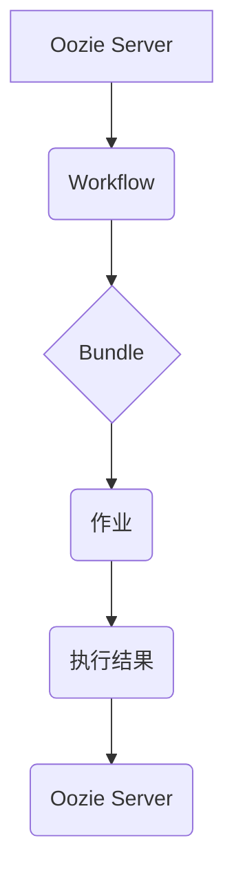

> Oozie, Bundle, Workflow, Hadoop, Spark, ETL, 数据处理, 代码实例

## 1. 背景介绍

在现代数据处理领域，海量数据的采集、存储和分析日益重要。Hadoop生态系统作为大数据处理的基石，提供了强大的分布式计算和存储能力。而Oozie作为Hadoop生态系统中的一员，则专门负责管理和调度Hadoop作业，使其能够高效、可靠地执行。

Oozie Bundle是Oozie中的一种高级调度功能，它允许用户将多个独立的Hadoop作业组合成一个逻辑单元，并将其作为一个整体进行调度和执行。这种组合方式能够简化复杂数据处理流程，提高作业执行效率和可靠性。

## 2. 核心概念与联系

Oozie Bundle的核心概念是将多个作业组合成一个逻辑单元，并通过依赖关系和控制流来管理它们的执行顺序和状态。

**Oozie Bundle的组成部分：**

* **作业（Action）：** 每个Bundle都包含多个作业，每个作业代表一个独立的Hadoop任务，例如MapReduce作业、Spark作业、Pig作业等。
* **依赖关系（Dependencies）：** 不同的作业之间可以建立依赖关系，例如作业A的执行结果作为作业B的输入。
* **控制流（Control Flow）：** Bundle定义了作业之间的执行顺序和分支逻辑，例如根据某个条件执行不同的作业分支。

**Oozie Bundle与其他Oozie组件的关系：**

* **Oozie Workflow：** Bundle可以看作是Workflow的一种高级形式，它提供了更灵活的作业组合和控制流管理能力。
* **Oozie Coordinator：** Coordinator负责定期调度Workflow或Bundle，例如每天执行一次数据处理流程。

**Oozie Bundle的架构：**



## 3. 核心算法原理 & 具体操作步骤

### 3.1  算法原理概述

Oozie Bundle的调度算法基于作业依赖关系和控制流的分析，它会根据定义的规则和条件，确定作业的执行顺序和状态。

**核心算法步骤：**

1. **解析Bundle定义：** Oozie Server解析Bundle的定义文件，包括作业列表、依赖关系和控制流。
2. **构建作业执行图：** 根据解析结果，构建作业执行图，其中每个节点代表一个作业，边代表作业之间的依赖关系。
3. **确定执行顺序：** 算法根据依赖关系和控制流，确定作业的执行顺序，并生成执行计划。
4. **调度作业执行：** Oozie Server根据执行计划，调度作业执行，并监控作业状态。
5. **处理异常情况：** 如果某个作业执行失败，算法会根据定义的异常处理策略，采取相应的措施，例如重新执行作业或跳过失败作业。

### 3.2  算法步骤详解

1. **解析Bundle定义：** Oozie Server使用XML格式解析Bundle定义文件，提取作业信息、依赖关系和控制流信息。
2. **构建作业执行图：** 算法将作业信息和依赖关系转换为作业执行图，其中每个节点代表一个作业，边代表作业之间的依赖关系。
3. **确定执行顺序：** 算法使用拓扑排序算法确定作业的执行顺序，确保依赖关系满足。
4. **调度作业执行：** Oozie Server根据执行顺序，调度作业执行，并使用YARN或其他资源管理系统分配资源。
5. **监控作业状态：** Oozie Server监控作业执行状态，并根据状态更新执行计划。
6. **处理异常情况：** 如果某个作业执行失败，Oozie Server会根据定义的异常处理策略，采取相应的措施，例如重新执行作业或跳过失败作业。

### 3.3  算法优缺点

**优点：**

* **灵活的作业组合：** Bundle允许用户将多个作业组合成一个逻辑单元，并通过依赖关系和控制流进行管理。
* **高效的作业调度：** Oozie Server使用高效的调度算法，确保作业按需执行，并优化资源利用率。
* **可靠的作业执行：** Oozie Bundle提供异常处理机制，确保作业能够可靠地执行。

**缺点：**

* **复杂度较高：** Bundle的定义和管理相对复杂，需要一定的Oozie和Hadoop知识。
* **依赖关系管理：** 复杂的依赖关系可能会导致Bundle的维护和调试难度增加。

### 3.4  算法应用领域

Oozie Bundle广泛应用于各种数据处理场景，例如：

* **数据 ETL：** 将数据从源系统提取、转换和加载到目标系统。
* **数据清洗：** 对数据进行清洗和预处理，例如去除重复数据、填充缺失值等。
* **数据分析：** 对数据进行分析和挖掘，例如统计分析、机器学习等。

## 4. 数学模型和公式 & 详细讲解 & 举例说明

### 4.1  数学模型构建

Oozie Bundle的调度算法可以抽象为一个图论模型，其中：

* **节点：** 代表作业
* **边：** 代表作业之间的依赖关系

**状态转移方程：**

```
S(t+1) = f(S(t), D(t))
```

其中：

* **S(t)：**  t时刻的作业状态集合
* **D(t)：**  t时刻的依赖关系集合
* **f：** 状态转移函数

### 4.2  公式推导过程

状态转移函数f根据依赖关系和控制流，确定作业的执行顺序和状态。

**状态定义：**

* **未执行：** 作业尚未开始执行
* **执行中：** 作业正在执行
* **成功：** 作业执行成功
* **失败：** 作业执行失败

**状态转移规则：**

* 如果作业状态为“未执行”，且所有依赖作业都已执行成功，则状态变为“执行中”。
* 如果作业执行成功，则状态变为“成功”。
* 如果作业执行失败，则状态变为“失败”。

### 4.3  案例分析与讲解

**案例：**

假设一个Bundle包含三个作业A、B、C，其中A依赖于B，B依赖于C。

**状态转移过程：**

1. C执行成功，状态变为“成功”。
2. B执行成功，状态变为“成功”。
3. A执行成功，状态变为“成功”。

**分析：**

根据依赖关系和状态转移规则，Oozie Server能够正确确定作业的执行顺序和状态，确保Bundle的顺利执行。

## 5. 项目实践：代码实例和详细解释说明

### 5.1  开发环境搭建

* **Hadoop环境：** 安装并配置Hadoop集群。
* **Oozie环境：** 安装并配置Oozie Server。
* **开发工具：** 使用Eclipse或IntelliJ IDEA等IDE进行代码开发。

### 5.2  源代码详细实现

```xml
<?xml version="1.0" encoding="UTF-8"?>
<bundle xmlns="uri:oozie:bundle-def:0.4">
  <description>Oozie Bundle Example</description>
  <name>my-bundle</name>
  <input-dir>${input_dir}</input-dir>
  <output-dir>${output_dir}</output-dir>
  <action>
    <map-reduce>
      <job-tracker>${job_tracker}</job-tracker>
      <name-node>${name_node}</name-node>
      <configuration>
        <property>
          <name>mapreduce.input.format.class</name>
          <value>org.apache.hadoop.mapred.TextInputFormat</value>
        </property>
        <property>
          <name>mapreduce.output.format.class</name>
          <value>org.apache.hadoop.mapred.TextOutputFormat</value>
        </property>
      </configuration>
      <input>${input_dir}</input>
      <output>${output_dir}</output>
      <mapper>mapper.py</mapper>
      <reducer>reducer.py</reducer>
    </map-reduce>
  </action>
</bundle>
```

### 5.3  代码解读与分析

* **Bundle定义：** XML文件定义了Bundle的名称、描述、输入目录和输出目录。
* **Action：** 定义了Bundle中的作业，例如MapReduce作业。
* **配置：** 配置了作业的运行环境和参数，例如JobTracker、NameNode、输入格式、输出格式等。
* **输入和输出：** 指定了作业的输入和输出目录。
* **Mapper和Reducer：** 指定了作业的Mapper和Reducer类。

### 5.4  运行结果展示

Oozie Server会根据Bundle定义，调度作业执行，并将执行结果存储在输出目录中。

## 6. 实际应用场景

### 6.1  数据 ETL

Oozie Bundle可以用于构建数据ETL流程，将数据从源系统提取、转换和加载到目标系统。例如，可以将数据从MySQL数据库提取，转换格式，并加载到HDFS存储系统。

### 6.2  数据清洗

Oozie Bundle可以用于构建数据清洗流程，对数据进行清洗和预处理，例如去除重复数据、填充缺失值等。例如，可以将数据从CSV文件导入，去除重复数据，并填充缺失值。

### 6.3  数据分析

Oozie Bundle可以用于构建数据分析流程，对数据进行分析和挖掘，例如统计分析、机器学习等。例如，可以将数据从HDFS存储系统导入，进行统计分析，并生成报表。

### 6.4  未来应用展望

随着大数据处理技术的不断发展，Oozie Bundle的应用场景将会更加广泛。例如，可以用于构建实时数据处理流程、云计算数据处理流程等。

## 7. 工具和资源推荐

### 7.1  学习资源推荐

* **Oozie官方文档：** https://oozie.apache.org/docs/
* **Hadoop官方文档：** https://hadoop.apache.org/docs/
* **Oozie教程：** https://www.tutorialspoint.com/oozie/index.htm

### 7.2  开发工具推荐

* **Eclipse：** https://www.eclipse.org/
* **IntelliJ IDEA：** https://www.jetbrains.com/idea/

### 7.3  相关论文推荐

* **Oozie: A Workflow Scheduler for Hadoop:** https://www.usenix.org/system/files/conference/osdi09/osdi09-paper-jain.pdf

## 8. 总结：未来发展趋势与挑战

### 8.1  研究成果总结

Oozie Bundle作为Hadoop生态系统中的一员，为大数据处理提供了强大的调度和管理能力。它能够简化复杂数据处理流程，提高作业执行效率和可靠性。

### 8.2  未来发展趋势

* **更强大的调度算法：** 为了应对更复杂的作业调度需求，Oozie Bundle将继续发展更强大的调度算法，例如基于机器学习的调度算法。
* **更丰富的功能支持：** Oozie Bundle将继续扩展功能，支持更多类型的作业和数据处理场景。
* **更完善的监控和管理：** Oozie Bundle将提供更完善的监控和管理功能，方便用户管理和维护Bundle。

### 8.3  面临的挑战

* **复杂性挑战：** 随着功能的不断扩展，Oozie Bundle的复杂性也会不断增加，需要不断优化设计和架构，提高易用性和可维护性。
* **性能挑战：** 随着数据规模的不断增长，Oozie Bundle需要不断优化性能，提高调度效率和资源利用率。
* **生态系统挑战：** Oozie Bundle需要与其他Hadoop组件和工具保持良好的兼容性和互操作性，需要不断与生态系统进行协作和融合。

### 8.4  研究展望

未来，Oozie Bundle将继续朝着更智能、更自动化、更易用、更可靠的方向发展，为大数据处理提供更强大的支持。


## 9. 附录