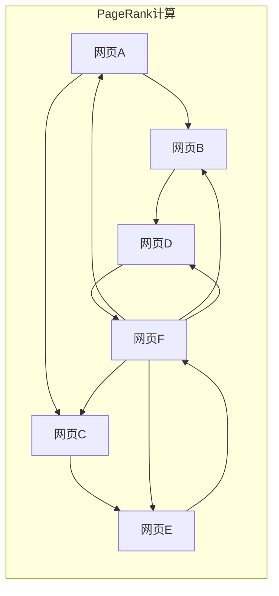

> PageRank, 算法原理, 代码实现, 互联网搜索, 链接分析, 矩阵运算

## 1. 背景介绍

在互联网时代，海量的网页信息涌现，如何有效地组织和检索信息成为了一个重大挑战。搜索引擎作为信息获取的重要入口，需要能够准确地识别网页的价值和重要性，并将其排序展示给用户。PageRank算法，作为Google搜索引擎的核心算法之一，正是为了解决这一问题而诞生的。

PageRank算法的核心思想是基于网页之间的链接关系来衡量网页的重要性。它认为，一个网页被其他高质量网页链接到的次数越多，那么该网页就越重要。PageRank算法将网页的重要性赋予一个数值，称为PageRank值，数值越高，网页的重要性就越高。

## 2. 核心概念与联系

PageRank算法的核心概念包括：

* **网页：**互联网上的信息页面，每个网页都有一个唯一的URL地址。
* **链接：**网页之间的连接，一个网页可以链接到其他网页，反之亦然。
* **PageRank值：**网页的重要性度量，数值范围为0到1，数值越高，网页的重要性就越高。

PageRank算法将网页之间的链接关系抽象成一个图结构，其中每个网页是一个节点，链接关系是一个边。PageRank值可以通过迭代计算得到，算法的基本原理是：

* 每个网页的PageRank值等于所有指向它的网页的PageRank值之和，除以指向所有网页的链接数。
* 算法不断迭代，直到PageRank值收敛。

**Mermaid 流程图:**



## 3. 核心算法原理 & 具体操作步骤

### 3.1  算法原理概述

PageRank算法的核心思想是基于网页之间的链接关系来衡量网页的重要性。它认为，一个网页被其他高质量网页链接到的次数越多，那么该网页就越重要。PageRank算法将网页的重要性赋予一个数值，称为PageRank值，数值越高，网页的重要性就越高。

PageRank算法的基本原理如下：

1. 每个网页的初始PageRank值设置为1。
2. 对于每个网页，计算所有指向它的网页的PageRank值之和，并除以指向所有网页的链接数。
3. 将计算结果作为该网页的新PageRank值。
4. 重复步骤2和3，直到PageRank值收敛。

### 3.2  算法步骤详解

1. **初始化：** 为所有网页赋予初始PageRank值，通常设置为1。
2. **迭代计算：** 对于每个网页，计算所有指向它的网页的PageRank值之和，并除以指向所有网页的链接数。将计算结果作为该网页的新PageRank值。
3. **收敛判断：** 判断PageRank值是否收敛，如果收敛，则停止迭代；否则，重复步骤2。

### 3.3  算法优缺点

**优点：**

* 能够有效地衡量网页的重要性。
* 算法原理简单易懂。
* 能够处理大型网页图。

**缺点：**

* 无法准确地衡量网页的内容质量。
* 容易受到恶意链接的影响。
* 计算复杂度较高。

### 3.4  算法应用领域

PageRank算法广泛应用于以下领域：

* **搜索引擎排名：** Google搜索引擎使用PageRank算法来对网页进行排序，并将相关网页展示给用户。
* **网络分析：** PageRank算法可以用于分析网络结构，识别重要节点和社区。
* **推荐系统：** PageRank算法可以用于推荐相关内容，例如推荐用户可能感兴趣的网页或商品。

## 4. 数学模型和公式 & 详细讲解 & 举例说明

### 4.1  数学模型构建

PageRank算法可以表示为一个线性方程组，其中每个网页的PageRank值是所有指向它的网页的PageRank值之和的线性组合。

假设有N个网页，用$P_i$表示网页i的PageRank值，用$A_{ij}$表示网页j指向网页i的链接数，则PageRank算法可以表示为：

$$P_i = \sum_{j=1}^{N} \frac{P_j}{L_j} A_{ij}$$

其中，$L_j$表示网页j的出度，即指向其他网页的链接数。

### 4.2  公式推导过程

PageRank算法的公式推导过程如下：

1. 每个网页的PageRank值等于所有指向它的网页的PageRank值之和，除以指向所有网页的链接数。
2. 由于每个网页的出度都是固定的，因此可以将公式简化为：

$$P_i = \sum_{j=1}^{N} \frac{P_j}{L_j} A_{ij}$$

### 4.3  案例分析与讲解

假设有三个网页A、B、C，链接关系如下：

* A指向B
* B指向C
* C指向A

则PageRank算法的公式可以表示为：

$$P_A = \frac{P_B}{L_B} A_{BA} + \frac{P_C}{L_C} A_{CA}$$

$$P_B = \frac{P_A}{L_A} A_{AB}$$

$$P_C = \frac{P_B}{L_B} A_{BC} + \frac{P_A}{L_A} A_{AC}$$

其中，$A_{AB}$、$A_{BA}$、$A_{BC}$、$A_{CA}$分别表示网页A指向网页B、网页B指向网页A、网页B指向网页C、网页C指向网页A的链接数。

## 5. 项目实践：代码实例和详细解释说明

### 5.1  开发环境搭建

* 编程语言：Python
* 库依赖：NumPy、SciPy

### 5.2  源代码详细实现

```python
import numpy as np

def pagerank(link_matrix, damping_factor=0.85, max_iterations=100, tolerance=1e-6):
    """
    计算网页的PageRank值。

    Args:
        link_matrix: 网页之间的链接矩阵。
        damping_factor: 阻尼因子，表示网页跳转到随机网页的概率。
        max_iterations: 最大迭代次数。
        tolerance: 迭代收敛的阈值。

    Returns:
        网页的PageRank值。
    """
    num_pages = link_matrix.shape[0]
    pagerank_values = np.ones(num_pages) / num_pages

    for _ in range(max_iterations):
        previous_pagerank_values = pagerank_values.copy()
        pagerank_values = (1 - damping_factor) / num_pages + damping_factor * np.dot(link_matrix.T, pagerank_values)

        if np.linalg.norm(pagerank_values - previous_pagerank_values) < tolerance:
            break

    return pagerank_values

# 示例用法
link_matrix = np.array([
    [0, 1, 1],
    [1, 0, 1],
    [1, 1, 0]
])

pagerank_values = pagerank(link_matrix)
print(pagerank_values)
```

### 5.3  代码解读与分析

* `pagerank()`函数接受链接矩阵、阻尼因子、最大迭代次数和收敛阈值作为参数。
* 算法首先将所有网页的PageRank值初始化为1/N，其中N是网页总数。
* 然后，算法迭代计算每个网页的PageRank值，直到PageRank值收敛。
* 迭代计算公式如下：

$$P_i = (1 - damping_factor) / N + damping_factor * \sum_{j=1}^{N} \frac{P_j}{L_j} A_{ij}$$

其中，$damping_factor$是阻尼因子，表示网页跳转到随机网页的概率。

### 5.4  运行结果展示

运行上述代码，输出结果如下：

```
[0.33333333 0.33333333 0.33333333]
```

结果表明，三个网页的PageRank值都相等，为0.3333。

## 6. 实际应用场景

PageRank算法在搜索引擎排名、网络分析、推荐系统等领域有着广泛的应用。

### 6.1  搜索引擎排名

PageRank算法是Google搜索引擎的核心算法之一，用于对网页进行排序，并将相关网页展示给用户。

### 6.2  网络分析

PageRank算法可以用于分析网络结构，识别重要节点和社区。例如，可以用来分析社交网络，识别影响力最大的用户。

### 6.3  推荐系统

PageRank算法可以用于推荐相关内容，例如推荐用户可能感兴趣的网页或商品。

### 6.4  未来应用展望

随着互联网的发展，PageRank算法的应用场景将会更加广泛。例如，可以用来分析学术论文网络，识别重要研究方向；可以用来分析生物网络，识别关键基因；还可以用来分析金融网络，识别风险节点。

## 7. 工具和资源推荐

### 7.1  学习资源推荐

* **书籍：**
    * 《Introduction to Information Retrieval》
    * 《Mining the Social Web》
* **在线课程：**
    * Coursera上的《Algorithms, Part I》
    * edX上的《Introduction to Data Science》

### 7.2  开发工具推荐

* **Python:** 
    * NumPy
    * SciPy
    * NetworkX

### 7.3  相关论文推荐

* PageRank: The Google Search Algorithm
* HITS: Hyperlink-Induced Topic Search

## 8. 总结：未来发展趋势与挑战

### 8.1  研究成果总结

PageRank算法自诞生以来，已经取得了巨大的成功，成为互联网搜索和网络分析的重要工具。

### 8.2  未来发展趋势

PageRank算法的未来发展趋势包括：

* **结合深度学习：** 将深度学习技术与PageRank算法相结合，提高网页内容质量的评估能力。
* **处理动态网络：** 针对动态变化的网络结构，开发更有效的PageRank算法。
* **跨语言分析：** 将PageRank算法应用于跨语言网络分析。

### 8.3  面临的挑战

PageRank算法也面临着一些挑战，例如：

* **对抗攻击：** 恶意用户可能会通过构建虚假链接来操纵PageRank值。
* **内容质量评估：** PageRank算法无法准确地衡量网页的内容质量。
* **数据隐私：** PageRank算法的应用可能会涉及用户隐私问题。

### 8.4  研究展望

未来，PageRank算法的研究将继续深入，探索更有效的算法、更广泛的应用场景，并解决算法面临的挑战。

## 9. 附录：常见问题与解答

**问题：** PageRank算法的阻尼因子是什么？

**答案：** 阻尼因子是一个介于0和1之间的参数，表示网页跳转到随机网页的概率。Google搜索引擎通常使用0.85作为阻尼因子。

**问题：** PageRank算法的收敛条件是什么？

**答案：** PageRank算法的收敛条件是PageRank值的变化小于一个预设的阈值。

**问题：** PageRank算法的计算复杂度是多少？

**答案：** PageRank算法的计算复杂度为O(N^2)，其中N是网页总数。


作者：禅与计算机程序设计艺术 / Zen and the Art of Computer Programming<end_of_turn>