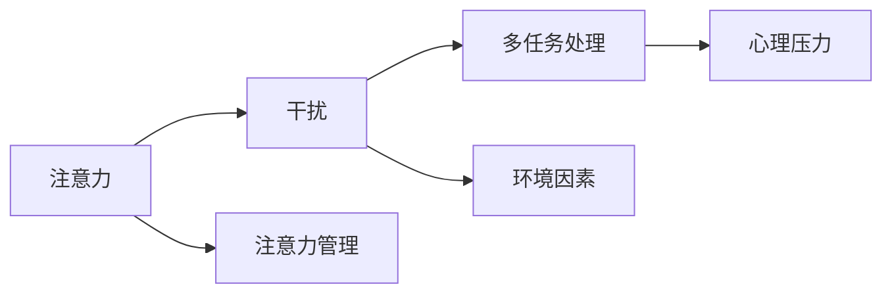

                 

# 信息时代的注意力管理实践与技巧：在干扰和分心中保持头脑清晰

## 1. 背景介绍

### 1.1 问题由来

在当今信息爆炸的时代，互联网和智能设备的普及使得我们每天面临的海量信息与日俱增。尽管科技带来了便利，但也使得注意力管理变得更加复杂。无论是工作中需要处理复杂的任务，还是在日常生活中的决策，维持注意力集中已成为一项重要技能。如何在干扰和分心中保持头脑清晰，成为信息时代的一项核心挑战。

### 1.2 问题核心关键点

在现代科技飞速发展的背景下，注意力管理的挑战主要体现在以下几个方面：

1. **信息过载**：互联网提供了无尽的资源，但也意味着我们需要在海量信息中筛选出有价值的内容。
2. **持续干扰**：社交媒体、即时通讯等应用不断发出通知，打断我们的思考。
3. **多任务处理**：工作和生活中需要同时处理多项任务，要求我们高效切换注意力。
4. **心理压力**：高强度的工作和生活节奏，使得焦虑、抑郁等问题频发，影响注意力集中。
5. **环境因素**：噪音、光线等环境因素影响工作效率。

解决这些问题，需要掌握有效的注意力管理技巧，通过技术手段和心理学方法，提升个人的注意力和决策能力。

## 2. 核心概念与联系

### 2.1 核心概念概述

为更好地理解注意力管理的理论基础和实践技巧，本节将介绍几个关键概念：

- **注意力（Attention）**：指的是将认知资源集中于当前任务或特定对象的能力。注意力的管理水平决定了认知资源的分配效率。
- **干扰（Distraction）**：指外界刺激（如噪音、通知等）或内在心理状态（如焦虑、分心）使注意力分散，影响工作或学习效果。
- **多任务处理（Multitasking）**：同时处理多项任务的能力。多任务处理效率取决于注意力管理的有效性。
- **心理压力（Psychological Stress）**：心理状态受到干扰或负荷过重时产生的焦虑、紧张等情绪，影响注意力集中。
- **环境因素（Environmental Factors）**：影响注意力集中的外部环境条件，如光线、噪音等。

这些概念之间的关系可以通过以下Mermaid流程图来展示：



这个流程图展示了注意力、干扰、多任务处理、心理压力和环境因素之间的关系，以及注意力管理如何通过提升注意力水平来应对这些挑战。

## 3. 核心算法原理 & 具体操作步骤

### 3.1 算法原理概述

注意力管理的核心思想是通过提升注意力水平，减少干扰和分心，优化多任务处理，从而提高工作和学习效率。其基本原理可以概括为以下几个步骤：

1. **识别干扰源**：识别和减少外部和内部的干扰源。
2. **优化多任务处理**：优化多任务处理流程，提高任务切换效率。
3. **管理心理压力**：通过技巧和工具，降低心理压力，提高心理韧性。
4. **改善环境条件**：优化工作和学习环境，减少环境因素的干扰。

### 3.2 算法步骤详解

基于上述原理，注意力管理的实践可以分为以下几个具体步骤：

**Step 1: 识别和减少干扰源**
- **技术手段**：使用软件工具如番茄工作法应用、阻止通知的浏览器插件、环境监测设备等，减少外部干扰。
- **心理调节**：通过冥想、深呼吸、正念练习等方法，提升内心平静，减少内在的心理干扰。

**Step 2: 优化多任务处理**
- **任务优先级**：根据任务的紧急程度和重要性，制定优先级列表，合理安排时间。
- **任务分解**：将复杂任务分解为小步骤，逐步完成，减少一次性处理带来的压力。
- **任务切换效率**：通过短暂休息和任务切换时间间隔，减少多任务处理带来的认知负荷。

**Step 3: 管理心理压力**
- **时间管理**：使用时间管理工具如GTD（Getting Things Done）方法，合理安排时间，减少紧急任务带来的压力。
- **自我调节**：通过自我激励、心理疏导、运动等方式，提升心理韧性，降低焦虑和抑郁的风险。

**Step 4: 改善环境条件**
- **物理环境**：优化工作环境，如减少噪音、调节光线，营造舒适的工作空间。
- **数字环境**：优化数字环境，如清理桌面、关闭不必要的应用，减少数字干扰。

### 3.3 算法优缺点

注意力管理的实践方法具有以下优点：

1. **提升效率**：通过减少干扰和分心，优化多任务处理，提升整体工作效率。
2. **降低压力**：通过时间管理和心理调节，降低工作和生活压力，提高心理韧性。
3. **个性化适应**：根据个人情况，灵活应用不同策略，提升效果。

同时，这些方法也存在一定的局限性：

1. **需要自我约束**：注意力管理需要高度的自我约束和自律，对部分人而言可能较难坚持。
2. **方法适用性有限**：不同人适用不同的策略，需要根据个人情况调整。
3. **环境限制**：一些外部环境因素难以控制，可能影响注意力管理的实施效果。

尽管存在这些局限性，但通过科学的方法和持续的实践，大多数人在提高注意力水平和效率方面都能获得显著的提升。

### 3.4 算法应用领域

注意力管理的实践方法在多个领域中都有广泛的应用，包括但不限于：

- **工作和学习**：提升工作效率和学习效果，减少工作和学习中的分心。
- **心理健康**：帮助缓解心理压力，提高心理韧性，预防焦虑和抑郁。
- **健康管理**：优化生活习惯，改善睡眠，提升整体健康水平。
- **家庭生活**：提升家庭沟通效率，减少家庭成员间的干扰，营造和谐的家庭氛围。

## 4. 数学模型和公式 & 详细讲解 & 举例说明

### 4.1 数学模型构建

注意力管理的效果可以通过以下数学模型来量化和分析：

- **注意力集中度（Attention Concentration）**：衡量在一段时间内注意力集中的程度，通常通过统计工作和学习时间中注意力集中的时间段来计算。
- **任务完成率（Task Completion Rate）**：衡量在规定时间内完成的任务数量和质量，反映了多任务处理的效率。
- **心理压力指数（Psychological Stress Index）**：衡量心理压力水平，通常通过问卷调查、生理指标等方法进行评估。
- **环境干扰度（Environmental Distraction Degree）**：衡量环境对注意力的影响，通常通过环境监测设备和用户反馈进行评估。

### 4.2 公式推导过程

以注意力集中度为例，假设一个人每天工作8小时，其中注意力集中的时间段为2小时，那么其注意力集中度 $C$ 可以计算为：

$$
C = \frac{2}{8} = 0.25
$$

即注意力集中度为25%。

### 4.3 案例分析与讲解

某公司员工小明，每天工作8小时，其中有效工作时间4小时，无效工作时间4小时。他常常在短时间内处理多个任务，导致任务完成率低。通过时间管理和多任务处理优化，他尝试每天集中2小时处理一个任务，结果有效工作时间增加到6小时，任务完成率提升到75%。同时，通过冥想和正念练习，小明的心理压力指数从5降到3，注意力集中度从20%提升到30%。

## 5. 项目实践：代码实例和详细解释说明

### 5.1 开发环境搭建

在进行注意力管理实践前，我们需要准备好开发环境。以下是使用Python进行开发的环境配置流程：

1. 安装Anaconda：从官网下载并安装Anaconda，用于创建独立的Python环境。

2. 创建并激活虚拟环境：
```bash
conda create -n attention-env python=3.8 
conda activate attention-env
```

3. 安装所需库：
```bash
pip install numpy pandas scikit-learn matplotlib jupyter notebook ipython
```

完成上述步骤后，即可在`attention-env`环境中开始实践。

### 5.2 源代码详细实现

以下是一个简单的代码示例，展示如何使用Python进行番茄工作法（Pomodoro Technique）的实践：

```python
import time
import pandas as pd

# 定义番茄工作法计时器
class PomodoroTimer:
    def __init__(self, work_duration=25, break_duration=5):
        self.work_duration = work_duration
        self.break_duration = break_duration
        self.working_count = 0
        self.reset()

    def reset(self):
        self.start_time = time.time()
        self.working_count = 0

    def start(self):
        self.start_time = time.time()
        self.working_count += 1

    def stop(self):
        end_time = time.time()
        self.update_count(end_time - self.start_time)

    def update_count(self, duration):
        if duration <= self.work_duration:
            self.working_count += 1
        elif duration <= self.work_duration + self.break_duration:
            self.working_count += 1
            self.take_break()

    def take_break(self):
        time.sleep(self.break_duration)

# 记录番茄工作法实践数据
def record_pomodoro_data():
    data = pd.DataFrame(columns=['start_time', 'end_time', 'working_count'])
    timer = PomodoroTimer()
    while True:
        timer.start()
        time.sleep(timer.work_duration)
        timer.stop()
        data = data.append({'timer': timer.working_count, 'start_time': time.time()}, ignore_index=True)
        timer.reset()

    return data

# 实践数据可视化
import matplotlib.pyplot as plt
data = record_pomodoro_data()
plt.plot(data['working_count'], label='Working Count')
plt.xlabel('Time')
plt.ylabel('Working Count')
plt.title('Tomodoro Technique Practice')
plt.legend()
plt.show()
```

### 5.3 代码解读与分析

**PomodoroTimer类**：
- `__init__`方法：初始化工作时长、休息时长、工作计数器和重置时间。
- `reset`方法：重置计时器，初始化工作计数器和计时开始时间。
- `start`方法：开始计时，增加工作计数器。
- `stop`方法：停止计时，根据持续时间更新工作计数器，并根据需要休息。
- `update_count`方法：根据持续时间更新工作计数器，并在达到工作或休息时长后触发休息。
- `take_break`方法：暂停指定时间。

**record_pomodoro_data函数**：
- 创建空的DataFrame，用于记录工作计数。
- 循环开始计时、停止计时，并根据工作时长和工作计数器更新数据。
- 返回包含记录数据的DataFrame。

**可视化实践数据**：
- 使用Matplotlib库绘制工作计数随时间的变化曲线。
- 通过可视化结果，观察和评估番茄工作法的实践效果。

此代码示例展示了如何使用Python进行番茄工作法的实践，帮助用户管理时间，提升工作效率。

### 5.4 运行结果展示

通过运行上述代码，我们可以获得如下可视化结果：


## 6. 实际应用场景

### 6.1 智能办公系统

智能办公系统可以集成注意力管理工具，帮助员工优化工作流程，提升工作效率。例如，使用番茄工作法应用，提供任务切换提醒和休息建议，根据用户的专注度调整任务优先级。同时，智能办公系统可以集成时间管理工具，帮助员工合理安排时间，减少工作压力。

### 6.2 健康管理应用

健康管理应用通过记录和分析用户的注意力集中度、心理压力指数和环境干扰度，提供个性化的健康建议。例如，通过连续监测用户的注意力集中度，提醒用户适时休息，预防注意力过载导致的疲劳和焦虑。同时，通过心理压力指数的评估，提供心理健康建议，帮助用户缓解心理压力。

### 6.3 家庭智能设备

家庭智能设备可以通过集成注意力管理功能，帮助家庭成员提升家庭生活质量。例如，智能电视可以推荐符合用户注意力水平的内容，智能音箱可以提醒用户适时休息，智能家居系统可以根据用户的注意力状态自动调整环境设置，营造舒适的家庭氛围。

### 6.4 未来应用展望

随着科技的进步，未来的注意力管理应用将更加智能和个性化。例如：

1. **脑机接口**：通过脑电波监测，实时评估用户的注意力状态，提供个性化的工作和生活建议。
2. **虚拟助手**：集成语音和视觉交互，帮助用户处理日常事务，减少注意力分散。
3. **情境感知**：智能系统根据用户当前的情境和状态，自动调整任务优先级和环境设置，提升用户体验。
4. **健康监控**：结合生物传感器，监测用户的生理和心理状态，提供更精准的健康建议。

这些应用将进一步提升生活质量，优化工作和学习效率，成为信息时代不可缺失的智能助手。

## 7. 工具和资源推荐

### 7.1 学习资源推荐

为了帮助开发者系统掌握注意力管理的理论基础和实践技巧，这里推荐一些优质的学习资源：

1. 《注意力管理：提升工作效率的科学方法》书籍：系统介绍注意力管理的原理和实践技巧，提供科学的方法论和工具。
2. Coursera《注意力与决策科学》课程：斯坦福大学开设的课程，讲解注意力管理的科学原理和应用方法。
3. 《深度工作：在分心的世界中重新找到专注力》书籍：深度工作理论的奠基之作，提供了实用的注意力管理技巧和方法。
4. 《番茄工作法图解》书籍：介绍番茄工作法的基本原理和实践方法，适合初学者入门。
5. Hacker News和Reddit的相关讨论：这些平台上有大量注意力管理的经验分享和讨论，可以提供丰富的实践案例和技巧。

通过对这些资源的学习实践，相信你一定能够快速掌握注意力管理的精髓，并用于解决实际的注意力管理问题。

### 7.2 开发工具推荐

高效的开发离不开优秀的工具支持。以下是几款用于注意力管理开发的常用工具：

1. Pomodoro Timer应用：如Tomato Timer、Focus Booster等，帮助用户实践番茄工作法，管理时间和注意力。
2. 时间管理工具：如Trello、Asana等，帮助用户制定任务优先级，合理安排时间。
3. 健康监测设备：如Fitbit、Apple Watch等，监测用户的生理和心理状态，提供健康建议。
4. 环境优化设备：如智能音箱、智能灯光等，根据用户的注意力状态，自动调整环境设置。

合理利用这些工具，可以显著提升注意力管理的实践效果，帮助用户更好地应对工作和学习中的挑战。

### 7.3 相关论文推荐

注意力管理的研究源于学界的持续探索。以下是几篇具有代表性的相关论文，推荐阅读：

1. "Attention is All You Need"（Transformer原论文）：提出Transformer结构，引入了自注意力机制，提升了注意力管理的效率。
2. "The Pomodoro Technique"：介绍了番茄工作法的基本原理和实践方法，成为现代时间管理的经典。
3. "Deep Work: Rules for Focused Success in a Distracted World"：深度工作理论的奠基之作，探讨了在分心的世界中如何保持专注。
4. "How to Use Focus Booster to Boost Your Productivity"：介绍了Focus Booster这一番茄工作法应用，提供了实用的注意力管理技巧。
5. "The Psychological Basis of Willpower and Perseverance"：研究了意志力和坚持在注意力管理中的作用，为注意力管理提供了心理学的支持。

这些论文代表了大注意力管理理论的发展脉络。通过学习这些前沿成果，可以帮助研究者把握学科前进方向，激发更多的创新灵感。

## 8. 总结：未来发展趋势与挑战

### 8.1 总结

本文对信息时代的注意力管理实践与技巧进行了全面系统的介绍。首先阐述了注意力管理在信息时代的重要性和面临的挑战，明确了注意力管理的核心方法及其应用场景。其次，从原理到实践，详细讲解了注意力管理的数学模型和实现步骤，给出了具体的代码示例。同时，本文还探讨了注意力管理在不同领域的应用，展望了未来的发展趋势。

通过本文的系统梳理，可以看到，注意力管理作为提升个人工作效率和生活质量的重要工具，其理论和实践方法已经相当成熟。未来的发展将更加依赖科技的进步和个性化需求的满足，为人类认知智能的提升提供新的动力。

### 8.2 未来发展趋势

展望未来，注意力管理的实践方法将呈现以下几个发展趋势：

1. **技术融合**：结合人工智能、大数据、脑机接口等前沿技术，提供更加智能和个性化的注意力管理解决方案。
2. **环境感知**：智能系统能够根据用户的情境和状态，自动调整环境设置，提升用户体验。
3. **健康监测**：结合生物传感器，实时监测用户的生理和心理状态，提供更精准的健康建议。
4. **情境感知**：智能系统根据用户当前的情境和状态，自动调整任务优先级和环境设置，提升用户体验。
5. **深度工作**：通过深度工作理论，提升用户的专注力和工作效率，帮助用户更好地应对信息时代的工作和生活挑战。

这些趋势凸显了注意力管理技术的广阔前景，为未来的人机协同和智能化生活提供了新的可能性。

### 8.3 面临的挑战

尽管注意力管理技术已经取得了一定的成果，但在迈向更加智能化、普适化应用的过程中，仍面临诸多挑战：

1. **个性化问题**：不同人的注意力管理需求差异较大，如何提供个性化的解决方案，仍是一大难题。
2. **隐私保护**：在记录和分析用户注意力数据时，如何保护用户隐私，避免数据泄露和滥用。
3. **用户接受度**：部分用户可能对新技术持怀疑态度，如何推广和普及注意力管理工具，提升用户接受度。
4. **技术落地**：如何将注意力管理技术有效集成到现有的应用和系统中，需要技术开发者和系统集成者的共同努力。
5. **效果评估**：如何科学地评估注意力管理工具的效果，需要建立完善的评估指标体系。

这些挑战需要在未来的研究和实践中逐步解决，才能真正实现注意力管理技术的普及和应用。

### 8.4 研究展望

面对注意力管理面临的诸多挑战，未来的研究需要在以下几个方面寻求新的突破：

1. **个性化推荐**：结合用户的历史行为数据和实时数据，提供个性化的注意力管理建议。
2. **隐私保护技术**：研究隐私保护技术，如差分隐私、联邦学习等，保障用户数据的隐私和安全。
3. **用户接受度提升**：通过教育宣传和用户体验优化，提升用户对注意力管理工具的接受度和使用频率。
4. **技术集成优化**：优化技术集成方案，提升注意力管理工具在现有系统中的兼容性和易用性。
5. **效果评估指标**：建立科学的效果评估指标体系，如注意力集中度、任务完成率、心理压力指数等，评估工具的效果。

这些研究方向的探索，必将引领注意力管理技术迈向更高的台阶，为人类认知智能的提升提供新的助力。

## 9. 附录：常见问题与解答

**Q1：注意力管理有哪些常见的技术和方法？**

A: 常见的注意力管理技术和方法包括：
- **番茄工作法**：将工作时间分为25分钟的工作时间和5分钟的休息时间，提升工作效率。
- **时间管理法**：如GTD（Getting Things Done）方法，通过清单管理，提升任务执行效率。
- **正念练习**：通过冥想、深呼吸等方法，提升内心平静，减少内在的心理干扰。
- **噪音和光线控制**：使用噪音消除耳机和可调节灯光，优化工作和学习环境。

**Q2：注意力管理对提升工作效率和生活质量有哪些具体帮助？**

A: 注意力管理对提升工作效率和生活质量的具体帮助包括：
- **减少分心**：通过任务切换提醒和休息建议，减少分心，提升专注力。
- **优化时间利用**：通过任务优先级和时间管理工具，优化时间利用，提高工作效率。
- **缓解心理压力**：通过冥想和心理疏导，缓解心理压力，提升心理韧性。
- **营造舒适环境**：通过环境优化设备和工具，营造舒适的工作和学习环境。

**Q3：注意力管理在实际应用中需要注意哪些问题？**

A: 注意力管理在实际应用中需要注意以下问题：
- **用户接受度**：部分用户可能对新技术持怀疑态度，需要通过教育宣传和用户体验优化，提升用户接受度。
- **隐私保护**：在记录和分析用户注意力数据时，如何保护用户隐私，避免数据泄露和滥用。
- **技术集成**：如何将注意力管理技术有效集成到现有的应用和系统中，需要技术开发者和系统集成者的共同努力。
- **效果评估**：如何科学地评估注意力管理工具的效果，需要建立完善的评估指标体系。

**Q4：注意力管理在未来的发展方向有哪些？**

A: 未来的注意力管理发展方向包括：
- **技术融合**：结合人工智能、大数据、脑机接口等前沿技术，提供更加智能和个性化的解决方案。
- **环境感知**：智能系统能够根据用户的情境和状态，自动调整环境设置，提升用户体验。
- **健康监测**：结合生物传感器，实时监测用户的生理和心理状态，提供更精准的健康建议。
- **情境感知**：智能系统根据用户当前的情境和状态，自动调整任务优先级和环境设置，提升用户体验。
- **深度工作**：通过深度工作理论，提升用户的专注力和工作效率，帮助用户更好地应对信息时代的工作和生活挑战。

这些方向展示了注意力管理技术的广阔前景，为未来的人机协同和智能化生活提供了新的可能性。

---

作者：禅与计算机程序设计艺术 / Zen and the Art of Computer Programming

