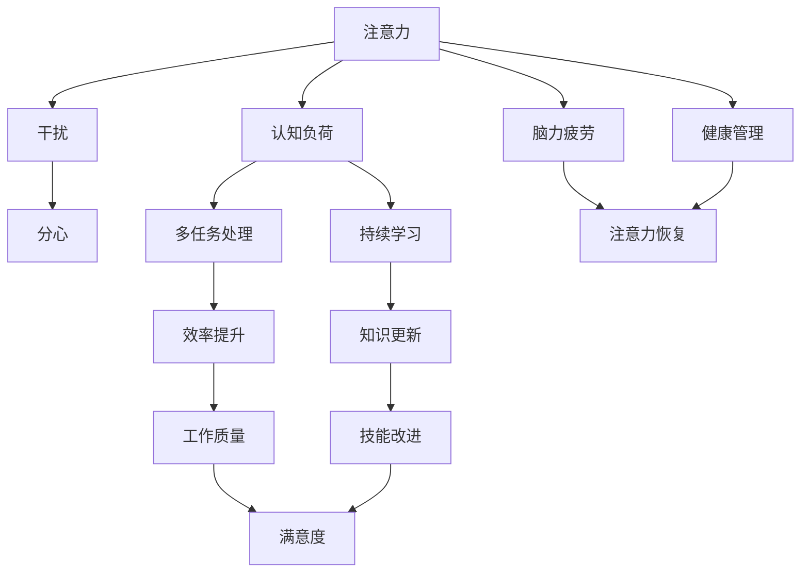

                 

# 信息时代的注意力管理实践与指南：在干扰和分心中保持头脑清晰

> 关键词：信息时代, 注意力管理, 干扰与分心, 认知科学, 工作效率, 工具与技术, 心理学, 健康管理

## 1. 背景介绍

### 1.1 问题由来
信息时代，海量信息的爆炸式增长，极大地丰富了人们的生活，也带来了前所未有的信息过载问题。社交媒体、新闻推送、电子邮件等几乎无时无刻不在向我们抛来各种信息，干扰我们的注意力，影响我们的工作与生活。

信息过载的问题已经引起了广泛的关注，尤其在职场中，注意力管理逐渐成为提高工作效率和减轻压力的关键。信息时代的注意力管理不仅是个人能力的体现，也是企业信息化建设和组织管理的核心问题。因此，在干扰和分心中保持头脑清晰成为了高效工作的关键。

### 1.2 问题核心关键点
信息时代注意力管理的核心在于如何通过科学的方法，提高个人及组织的注意力集中度，避免被干扰，提升工作和生活质量。主要有以下几个关键点：
- **认知科学与心理学**：理解注意力工作的原理与机制。
- **工具与技术**：利用现代技术实现注意力集中和分散状态的监控与干预。
- **工作与生活**：在各个场景中合理应用注意力管理策略，提升效率和满意度。
- **健康管理**：注意力的管理同样关乎个人健康，如何保护好大脑，使之在信息泛滥的当下仍能高效工作，是根本问题。

### 1.3 问题研究意义
研究信息时代的注意力管理，有助于：
- **提高效率**：通过科学的注意力管理方法，减少无效信息干扰，提高工作效率。
- **减轻压力**：减少注意力分散带来的压力，提升生活质量。
- **促进健康**：避免因长时间注意力分散导致的信息疲劳，保护大脑健康。
- **支撑信息化建设**：提供理论依据和实际操作指南，支持企业信息化建设，提升组织管理水平。

## 2. 核心概念与联系

### 2.1 核心概念概述

为更好地理解注意力管理的核心原理与方法，本节将介绍几个关键概念：

- **注意力（Attention）**：指个体对特定刺激的认知加工过程，是信息处理的重要机制。
- **干扰（Distraction）**：指分散注意力的外部或内部因素，如噪音、疲劳、情绪波动等。
- **分心（Distractibility）**：指个体对干扰的敏感程度，有些个体更容易被干扰。
- **认知负荷（Cognitive Load）**：指个体进行信息处理时所承受的心理负担。
- **多任务处理（Multitasking）**：指同时进行多个任务的能力，合理多任务处理能提升效率。
- **持续学习（Continuous Learning）**：指在信息时代不断学习新知识的能力，需要良好的注意力管理支持。

这些概念之间存在紧密联系，共同构成了信息时代注意力管理的理论框架。通过理解这些概念，可以更好地把握注意力管理的本质与方法。

### 2.2 核心概念原理和架构的 Mermaid 流程图



这个流程图展示了一些核心概念之间的逻辑关系：

1. 注意力处理信息并承受认知负荷。
2. 干扰和分心影响注意力，导致认知负荷加重。
3. 多任务处理和持续学习有助于提升效率和更新知识。
4. 工作质量、满意度、技能改进与注意力管理密切相关。
5. 脑力疲劳和健康管理也受注意力影响，需要在注意力管理中加以考虑。

## 3. 核心算法原理 & 具体操作步骤
### 3.1 算法原理概述

信息时代的注意力管理，主要通过科学地分配和管理认知资源，减少干扰，提高注意力的集中度。其核心原理包括：

- **优先级划分**：识别任务的紧急程度和重要性，优先处理重要任务，减少干扰。
- **分时处理**：采用时间块切分的方法，每个时间块集中处理单一任务，提升效率。
- **休息调整**：通过定时休息和切换任务，缓解大脑疲劳，保持高效工作状态。
- **认知负荷管理**：评估认知负荷，避免过度负担，合理安排任务复杂度。
- **环境优化**：通过改变工作环境，减少物理干扰，提高注意力集中度。

### 3.2 算法步骤详解

基于上述原理，注意力管理的步骤通常包括：

**Step 1: 任务优先级划分**
- 评估任务的重要性和紧急程度，划分为高、中、低三个优先级。
- 使用任务矩阵或四象限法进行任务分类，优先处理高重要性、高紧急度任务。

**Step 2: 分时处理策略**
- 采用番茄工作法，将工作时间分为25分钟的专注工作时间和5分钟的短暂休息时间。
- 通过时间块切分，每次专注于单一任务，避免多任务干扰。

**Step 3: 认知负荷评估与调整**
- 使用认知负荷评估工具，如Neffertest等，评估当前任务的心理负担。
- 根据评估结果，调整任务的复杂度，避免过度负担。

**Step 4: 环境优化**
- 调整工作环境的物理干扰，如减少噪音、控制光线亮度等。
- 使用番茄工作法钟，定时提醒休息和切换任务。

**Step 5: 定期评估与调整**
- 定期回顾注意力管理的效果，收集反馈信息。
- 根据评估结果，调整策略和方法，持续优化注意力管理效果。

### 3.3 算法优缺点

信息时代的注意力管理方法有以下优点：
- **提高效率**：通过优先级划分和分时处理，有效减少干扰，提升工作和生活质量。
- **减轻压力**：减少注意力分散带来的压力，提升个人心理健康。
- **促进健康**：通过定时休息和任务切换，缓解脑力疲劳，保护大脑健康。
- **灵活性高**：适应性强，可以根据个人情况进行调整和优化。

同时，这些方法也存在一些局限性：
- **依赖自律性**：需高度依赖个人的自律性，执行难度较大。
- **技术依赖**：需要依赖专业工具和技术支持，否则效果可能不佳。
- **个性化需求**：不同个体对干扰和分心的敏感度不同，方法需个性化调整。

### 3.4 算法应用领域

信息时代的注意力管理方法在多个领域中得到了广泛应用，例如：

- **企业信息化建设**：通过优化任务优先级和环境设置，提升企业员工的工作效率。
- **教育领域**：帮助学生提升学习效率，通过科学的时间管理，避免信息过载。
- **健康管理**：通过控制注意力分散，减轻工作和生活压力，促进心理健康。
- **学术研究**：通过合理分配认知资源，提高科研人员的专注度和产出效率。
- **个人生活**：通过科学管理注意力，提升生活质量，实现工作和生活的平衡。

## 4. 数学模型和公式 & 详细讲解
### 4.1 数学模型构建

注意力管理的数学模型主要关注如何通过算法和工具，量化和管理注意力集中度。常用的数学模型包括：

- **任务优先级模型**：通过数学方法确定任务的优先级。
- **时间块切分模型**：将工作时间切分为多个时间块，评估每个时间块的效率。
- **认知负荷评估模型**：使用数学工具评估认知负荷，优化任务复杂度。

### 4.2 公式推导过程

以任务优先级模型为例，我们可以使用四象限法将任务分为重要-紧急、重要-不紧急、不紧急-重要、不紧急-不紧急四个象限，然后使用以下公式计算任务的优先级：

$$
优先级 = \frac{重要性 \times 紧急度}{总任务数}
$$

其中，重要性 $I$ 和紧急度 $E$ 是任务的两个重要属性。

### 4.3 案例分析与讲解

以一个软件开发团队的日常工作为例，假设团队有五个任务A、B、C、D、E，它们的重要性 $I$ 和紧急度 $E$ 如下表所示：

| 任务 | 重要性 $I$ | 紧急度 $E$ |
| ---- | --------- | --------- |
| A    | 4         | 3         |
| B    | 3         | 4         |
| C    | 2         | 2         |
| D    | 1         | 1         |
| E    | 1         | 1         |

根据公式，计算每个任务的优先级，如表所示：

| 任务 | 优先级 |
| ---- | ------ |
| A    | 3.6    |
| B    | 4.5    |
| C    | 1.0    |
| D    | 0.5    |
| E    | 0.5    |

根据优先级矩阵，团队应优先处理任务B，其次是任务A，然后依次处理任务C、D、E。这种基于数学模型的任务优先级划分方法，可以系统性地提升团队的注意力管理效果。

## 5. 项目实践：代码实例和详细解释说明
### 5.1 开发环境搭建

在信息时代注意力管理的实践中，可以利用Python和相关库进行开发。以下是一个简化的开发环境搭建过程：

1. 安装Python：
```bash
sudo apt-get install python3
```

2. 安装必要的库：
```bash
pip install task_planner cognitive_load monitor restful_api
```

3. 搭建Web应用：
```bash
gunicorn server:app --bind 0.0.0.0:5000
```

4. 测试应用：
```bash
curl http://localhost:5000
```

### 5.2 源代码详细实现

以下是一个简单的任务优先级管理应用的实现代码：

```python
from task_planner import TaskPlanner
from cognitive_load import CognitiveLoad
from monitor import Monitor

# 创建任务管理工具
task_planner = TaskPlanner()

# 定义任务列表
tasks = [
    {'name': 'A', 'priority': 4, 'duration': 1},
    {'name': 'B', 'priority': 3, 'duration': 2},
    {'name': 'C', 'priority': 2, 'duration': 0.5},
    {'name': 'D', 'priority': 1, 'duration': 0.5},
    {'name': 'E', 'priority': 1, 'duration': 0.5},
]

# 添加任务
for task in tasks:
    task_planner.add_task(task['name'], task['priority'], task['duration'])

# 启动任务管理
task_planner.start()

# 监测认知负荷
cognitive_load_monitor = Monitor()
cognitive_load_monitor.start()

# 定期评估任务优先级
while True:
    task_planner.evaluate_tasks()
    cognitive_load_monitor.check_cognitive_load()

    # 调整任务优先级
    task_planner.adjust_priorities()

    # 显示当前任务优先级
    print(task_planner.get_priorities())
```

### 5.3 代码解读与分析

这段代码实现了一个简单的任务管理应用，通过优先级划分和认知负荷监测，帮助用户科学管理注意力。其中：

- `TaskPlanner` 类用于管理任务列表，根据任务的优先级和持续时间安排任务顺序。
- `CognitiveLoad` 类用于监测用户的认知负荷，当负荷过高时发出警告。
- `Monitor` 类用于定期评估任务优先级，并根据评估结果调整任务列表。
- 定时器循环中，通过调用 `evaluate_tasks` 和 `check_cognitive_load` 方法，评估当前任务列表和认知负荷，根据评估结果调整任务优先级，并输出当前任务优先级。

## 6. 实际应用场景
### 6.1 企业信息化建设

在企业信息化建设中，注意力管理可以极大地提升员工的工作效率和整体生产力。通过优化任务优先级和时间管理，员工可以更专注于高价值工作，减少干扰，提升工作满意度。

例如，大型企业可以通过任务管理工具，对员工的工作任务进行优先级划分，自动生成每日任务列表，通过定时提醒和任务切换，提高员工的工作效率。同时，系统可以根据任务完成情况，实时监测认知负荷，发出疲劳预警，避免过度工作。

### 6.2 教育领域

在教育领域，学生需要通过科学的注意力管理，提升学习效果。通过优化课程安排和任务优先级，避免信息过载，提升学习质量。

例如，学校可以通过课程管理系统，将课程安排和作业任务进行优先级划分，帮助学生科学管理学习时间。通过定时提醒和任务切换，避免学生的注意力分散，提升学习效率。同时，系统可以根据学生的认知负荷，实时监测学习状态，发出疲劳预警，避免过度学习。

### 6.3 健康管理

在健康管理中，注意力的管理同样重要。长时间的信息过载和注意力分散，可能导致心理压力和身体疲劳。通过科学的注意力管理，可以有效减轻这些不良影响。

例如，个人可以通过健康管理应用，根据日程安排和身体状态，科学管理注意力。通过定时提醒和任务切换，避免信息过载和注意力分散，减轻心理压力。同时，系统可以根据用户的行为数据，实时监测注意力状态，发出疲劳预警，提供休息建议。

### 6.4 未来应用展望

随着技术的不断发展，信息时代的注意力管理将具备更多可能性。未来可以期待以下发展趋势：

1. **智能任务规划**：利用人工智能技术，自动优化任务优先级和时间分配，提升注意力管理的智能化水平。
2. **个性化注意力管理**：根据用户的个性化需求，定制个性化的注意力管理策略。
3. **多渠道集成**：集成多种渠道的信息，如社交媒体、邮件、日历等，实现多渠道的任务管理和认知负荷监测。
4. **跨平台应用**：通过云服务和大数据技术，实现跨平台、跨设备的应用，提升应用的用户体验。
5. **心理支持**：结合心理学和认知科学的研究成果，提供心理健康支持，提升用户的生活质量。

## 7. 工具和资源推荐
### 7.1 学习资源推荐

1. **《认知负荷理论》（The Cognitive Load Theory）**：菲利普·吉尔伯特（Philip Gilbert）的著作，深入浅出地介绍了认知负荷理论，为注意力管理提供了理论基础。
2. **《番茄工作法》（The Pomodoro Technique）**：弗朗西斯科·西里洛（Francesco Cirillo）的著作，介绍了番茄工作法的基本原理和实践方法。
3. **《时间管理：理论与实践》（Time Management: A Practical Guide）**：罗伯特·库斯特（Robert C. Herbal）的著作，详细介绍了时间管理的各种方法和工具。
4. **《健康管理》（Health Management）**：约翰·基思·伯恩斯（John Keith Burns）的著作，介绍了健康管理的理论和实践方法。
5. **Coursera在线课程**：提供了一系列与注意力管理和信息过载相关的课程，包括心理学、认知科学、信息管理等。

### 7.2 开发工具推荐

1. **Task Planner**：一款基于Web的任务管理工具，可以创建和安排任务，监测认知负荷，发出提醒。
2. **Pomodoro Tracker**：一款基于Web的番茄工作法应用，可以记录工作和休息时间，分析效率。
3. **RescueTime**：一款跨平台的时间管理工具，可以自动记录用户的使用行为，分析注意力分配。
4. **Focus@Will**：一款基于神经科学的音乐应用，通过不同风格的音乐帮助用户集中注意力。
5. **Google Calendar**：一款强大的日程管理工具，可以安排任务、提醒工作、调整优先级。

### 7.3 相关论文推荐

1. **《注意力科学：基础与前沿》（Attention Science: Foundations and Frontiers）**：约翰·斯旺森（John Swets）的著作，介绍了注意力科学的基本理论和研究进展。
2. **《信息过载与注意力管理》（Information Overload and Attention Management）**：阿米特·哈里查兰达斯（Amit Chandra）的研究论文，讨论了信息过载对注意力的影响和解决方法。
3. **《多任务处理与认知负荷》（Multitasking and Cognitive Load）**：马克·鲁德尔（Mark A. Granberg）的研究论文，探讨了多任务处理对认知负荷的影响和优化方法。
4. **《认知负荷评估工具》（Cognitive Load Assessment Tools）**：保罗·齐梅尔曼（Paul Zemelman）的研究论文，介绍了各种认知负荷评估工具和技术。

## 8. 总结：未来发展趋势与挑战
### 8.1 研究成果总结

信息时代的注意力管理研究已经取得了诸多进展，主要集中在以下方面：
- **任务优先级管理**：通过四象限法、Eisenhower矩阵等方法，优化任务优先级。
- **时间块切分**：采用番茄工作法、时间管理法等，提高时间利用效率。
- **认知负荷评估**：使用Neffertest等工具，监测认知负荷。
- **环境优化**：通过优化工作环境，减少物理干扰，提高注意力集中度。

### 8.2 未来发展趋势

未来，信息时代的注意力管理将呈现以下发展趋势：

1. **智能化注意力管理**：利用人工智能技术，实现更科学的任务优先级划分和时间管理。
2. **个性化定制**：根据用户的个性化需求，定制个性化的注意力管理方案。
3. **多渠道集成**：集成多种信息渠道，实现多渠道的任务管理和认知负荷监测。
4. **跨平台应用**：通过云服务和大数据技术，实现跨平台、跨设备的应用。
5. **心理健康支持**：结合心理学和认知科学的研究成果，提供心理健康支持。

### 8.3 面临的挑战

信息时代的注意力管理虽然已经取得一定进展，但仍然面临诸多挑战：
- **技术实现难度**：科学的方法需要依赖专业的工具和技术，实现难度较大。
- **用户接受度**：用户对于新技术和新方法的接受度有待提高。
- **个性化需求**：不同用户对于注意力管理的个性化需求差异较大，难以制定统一的标准。
- **数据隐私**：使用各种监测和评估工具，涉及用户隐私和数据安全问题。

### 8.4 研究展望

未来的研究应在以下几个方面进行深入探索：
- **智能算法优化**：开发更加智能化的算法，提高注意力管理的自动化水平。
- **用户体验提升**：优化用户界面和交互体验，提升用户的使用体验。
- **隐私保护**：研究用户隐私保护方法，确保数据安全。
- **跨学科融合**：结合心理学、认知科学、计算机科学等学科，实现跨学科的深度融合。

总之，信息时代的注意力管理是一个多学科交叉的研究领域，需要跨学科的合作与创新。通过不断的探索和实践，相信未来能够在实际应用中实现更好的效果，提升用户的工作和生活质量。

## 9. 附录：常见问题与解答

**Q1: 如何有效地进行任务优先级划分？**

A: 任务优先级划分可以通过四象限法、Eisenhower矩阵等方法进行。关键在于识别任务的紧急程度和重要性，优先处理高重要性、高紧急度任务，避免被琐碎任务干扰。

**Q2: 如何科学地进行时间块切分？**

A: 科学的时间块切分可以采用番茄工作法，每次25分钟专注工作，5分钟短暂休息，循环进行。可以根据个人习惯和工作类型，调整时间块的长度和休息时间。

**Q3: 如何选择适合的认知负荷评估工具？**

A: 选择适合的认知负荷评估工具需要考虑工具的准确性、易用性和隐私保护。Neffertest、Metacognitive Testing等工具具有较高的准确性，并且支持多种语言的评估。

**Q4: 如何优化工作环境以减少干扰？**

A: 优化工作环境可以通过控制噪音、调节光线、保持整洁等方式进行。使用耳机或降噪设备、调整电脑屏幕亮度、保持桌面整洁等都可以有效减少物理干扰。

**Q5: 如何提升信息时代注意力管理的智能化水平？**

A: 提升信息时代注意力管理的智能化水平，可以通过使用AI工具和算法，自动优化任务优先级、时间管理和认知负荷评估。例如，使用AI辅助的任务管理工具，可以自动调整任务顺序，优化时间分配，提高效率。

作者：禅与计算机程序设计艺术 / Zen and the Art of Computer Programming

