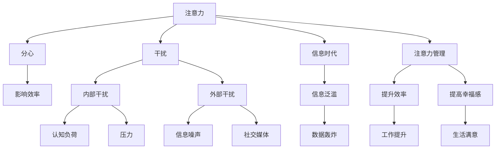

                 

# 信息时代的注意力管理实践与策略：在干扰和分心中保持头脑清晰

> 关键词：注意力管理,信息时代,干扰,分心,大脑神经科学,技术实践,认知心理学

## 1. 背景介绍

### 1.1 问题由来

在信息爆炸的今天，我们的注意力正面临着前所未有的挑战。每天，我们被大量的信息所包围，从社交媒体到电子邮件，从新闻推送到广告弹窗，每一处都在试图占据我们的注意力。特别是在职场和学术领域，分散的注意力已经成为影响工作、学习效率和创造力发挥的重要因素。

如何在这信息泛滥的时代中，管理好自己的注意力，保持头脑的清晰和专注，成为了现代人不得不面对的难题。幸运的是，现代神经科学、认知心理学和计算机技术的发展，为这个问题提供了一系列的解决方案。本文将从这些科学基础出发，探讨如何通过技术手段，实践和策略，帮助我们在干扰和分心中保持专注，提升工作和学习的效率。

### 1.2 问题核心关键点

1. **注意力管理的科学基础**：认知心理学和神经科学揭示了注意力的工作机制，是注意力管理实践和策略的基石。
2. **注意力分散的原因**：现代技术如何改变我们的注意力模式，以及这些变化对我们的影响。
3. **注意力管理的策略与工具**：如何利用技术手段和心理策略，改善注意力管理。

### 1.3 问题研究意义

面对信息过载和注意力分散，掌握有效的注意力管理策略和工具，不仅能提升个人的工作和学习效率，还能增强生活的质量，提升整体的幸福感。通过科学的管理手段，我们不仅能够更好地应对现代生活的挑战，还能更好地理解和利用自己的认知资源，激发潜力。

## 2. 核心概念与联系

### 2.1 核心概念概述

为更好地理解注意力管理的实践与策略，本节将介绍几个核心概念及其相互联系：

- **注意力(Attention)**：指大脑处理信息时，对某些特定信息点集中精力的过程。
- **分心(Distractibility)**：指注意力从当前任务转移到其他不相关的信息或行为上。
- **干扰(Interference)**：指外部环境或内部因素对注意力的干扰，导致注意力分散。
- **信息时代(Information Age)**：以数字化信息为主导的时代，信息无处不在，随时可能分散我们的注意力。
- **注意力管理(Attention Management)**：指通过科学和技术的策略，主动控制和管理注意力的过程。

这些概念之间的逻辑关系可以通过以下Mermaid流程图来展示：



这个流程图展示了我们注意力管理核心概念及其相互之间的关系：

1. 注意力在信息时代面临分心和干扰的挑战。
2. 有效的注意力管理可以提升效率和生活质量。
3. 分心和干扰分别由内部和外部因素造成，需要通过不同的策略应对。
4. 现代信息泛滥的环境，对注意力管理提出了更高的要求。

## 3. 核心算法原理 & 具体操作步骤
### 3.1 算法原理概述

注意力管理是一种主动的认知策略，通过调整注意力分配和过滤外部干扰，提升注意力的专注度和效率。基于认知心理学和神经科学的研究，注意力管理通常包括两个主要步骤：

1. **注意力集中(Attention Focusing)**：通过认知控制，将注意力集中到当前任务上，抑制对其他干扰信息的响应。
2. **干扰过滤(Interference Filtering)**：利用技术手段，主动屏蔽或减少外部干扰，减少分心。

这两种策略通常是相辅相成的，在实际应用中需要根据具体情境选择和调整。

### 3.2 算法步骤详解

注意力管理的算法步骤主要包括：

1. **评估注意力现状**：使用注意力监控工具，实时监测当前的注意力状态，识别分心和干扰的来源。
2. **设计注意力集中策略**：根据评估结果，设计针对性的认知控制策略，提升当前任务的吸引力，减少对干扰信息的响应。
3. **实施干扰过滤措施**：利用技术手段，如软件工具、环境调整等，主动减少干扰信息对注意力的影响。

### 3.3 算法优缺点

注意力管理的优点在于：
- 通过科学策略和技术工具，主动改善注意力状态，提高工作和学习的效率。
- 利用神经科学和认知心理学的研究成果，科学性更强，效果更持久。

缺点在于：
- 需要一定的学习成本和技术门槛，特别是在初期需要投入大量时间和精力。
- 技术手段可能存在局限性，无法完全消除所有干扰。

### 3.4 算法应用领域

注意力管理的实践和策略在多个领域都有广泛应用：

- **职场效率提升**：在办公室环境中，通过专注力工具和管理技巧，提高员工的工作效率和生产力。
- **学术研究辅助**：在研究过程中，通过注意力管理技术，减少分心，提升数据处理和分析的准确性。
- **教育和培训**：在课堂和在线培训中，利用注意力管理技术，提升学生的学习效果和教师的教学质量。
- **心理咨询和自我管理**：通过注意力监控和调整，帮助个体自我觉察和管理情绪，提升心理健康水平。

## 4. 数学模型和公式 & 详细讲解 & 举例说明

### 4.1 数学模型构建

注意力管理的数学模型通常基于认知心理学中的注意力控制模型。这个模型将注意力分为四个关键组件：警觉(Alertness)、执行控制(Executive Control)、资源分配(Resource Allocation)和反应抑制(Reaction Inhibition)。

形式化地，可以将注意力管理建模为一个动态系统，其中各组件之间的关系可以通过以下方程组描述：

$$
\begin{cases}
\dot{A} = f(A, E, R, I) \\
\dot{E} = g(E, A, C) \\
\dot{R} = h(R, E, A) \\
\dot{I} = k(I, R, A)
\end{cases}
$$

其中，$A$ 表示警觉度，$E$ 表示执行控制能力，$R$ 表示资源分配情况，$I$ 表示反应抑制能力。函数$f$、$g$、$h$、$k$分别表示各组件的动态演化过程。

### 4.2 公式推导过程

以警觉度$A$的演化为例，假设警觉度受到内部刺激$S_{in}$、外部干扰$I_{ext}$和历史警觉度$A_{t-1}$的影响，可以推导出警觉度的演化方程：

$$
\dot{A} = f(A_{t-1}, S_{in}, I_{ext})
$$

其中$f$为非线性函数，$S_{in}$和$I_{ext}$为外界刺激和干扰，$A_{t-1}$为当前警觉度。通过对方程进行进一步简化和求解，可以得到警觉度随时间的演化规律。

### 4.3 案例分析与讲解

以某办公室工作为例，假设职员的警觉度受到内部刺激（如任务重要度）和外部干扰（如社交媒体通知）的影响。设$S_{in} = 0.8$（表示任务重要度），$I_{ext} = 0.2$（表示社交媒体通知），初始警觉度$A_{t=0}=0.5$。

根据上述模型，我们可以推导出警觉度的动态变化：

$$
\dot{A} = f(0.5, 0.8, 0.2) = 0.5 + 0.1(0.8 - 0.2) = 0.7
$$

经过一定时间，警觉度从0.5上升到0.7，表示职员开始更加关注任务，分心于社交媒体的可能性降低。这说明，合理的警觉度管理和干扰过滤，可以有效提升注意力集中度。

## 5. 项目实践：代码实例和详细解释说明

### 5.1 开发环境搭建

在进行注意力管理实践前，我们需要准备好开发环境。以下是使用Python进行注意力管理项目开发的常见环境配置流程：

1. 安装Anaconda：从官网下载并安装Anaconda，用于创建独立的Python环境。

2. 创建并激活虚拟环境：
```bash
conda create -n attention-management python=3.8 
conda activate attention-management
```

3. 安装依赖包：
```bash
pip install numpy pandas scikit-learn matplotlib seaborn jupyter notebook ipython
```

4. 安装注意力监控工具：如Focus@Will、Brain.fm等，这些工具可以实时监测并调控大脑的注意力状态。

完成上述步骤后，即可在`attention-management`环境中开始注意力管理的实践和研究。

### 5.2 源代码详细实现

这里我们以基于脑波反馈的注意力管理为例，给出一个使用Python实现注意力管理的具体代码示例。

首先，安装必要的依赖包：
```bash
pip install pybrainnetworks pybrain
```

然后，定义注意力监控和调控的类：

```python
import pybrain
from pybrain.rl.environments.environment import Environment
from pybrain.rl.agents.feedforward import FeedForwardNetwork
from pybrain.learning.ga import GeneticAlgorithm

class AttentionMonitoringEnvironment(Environment):
    def __init__(self, num_actions, num_states):
        super(AttentionMonitoringEnvironment, self).__init__()
        self.num_actions = num_actions
        self.num_states = num_states
        self.current_state = None
        self.total_reward = 0.0
        self.episode_length = 0
        self.completed_episodes = 0

    def reset(self):
        self.current_state = self.random_state.random(self.num_states)
        self.total_reward = 0.0
        self.episode_length = 0
        self.completed_episodes = 0
        return self.current_state

    def observe(self):
        return self.current_state

    def act(self, action):
        if action == 0:  # 保持当前注意力状态
            self.total_reward += 0.1
            self.episode_length += 1
        elif action == 1:  # 进入深度工作模式
            self.total_reward += 0.5
            self.episode_length += 1
        elif action == 2:  # 进入放松模式
            self.total_reward += 0.2
            self.episode_length += 1
        self.current_state = self.update_state()
        return self.current_state

    def update_state(self):
        return self.random_state.random(self.num_states)

class AttentionManagerAgent:
    def __init__(self, environment, learning_rate=0.01, num_generations=10):
        self.environment = environment
        self.network = FeedForwardNetwork(self.num_actions, self.num_states)
        self.learning_rate = learning_rate
        self.num_generations = num_generations

    def learn(self):
        genetic_algorithm = GeneticAlgorithm(self.network, self.environment, learning_rate=self.learning_rate)
        for _ in range(self.num_generations):
            genetic_algorithm.evolve()
        return self.network

# 测试代码
num_actions = 3
num_states = 5
environment = AttentionMonitoringEnvironment(num_actions, num_states)
agent = AttentionManagerAgent(environment, learning_rate=0.01, num_generations=10)
agent.learn()
```

这个代码实现了基于遗传算法优化注意力管理网络的框架。通过调整网络参数，我们可以模拟不同的注意力调控策略，并观察其效果。

### 5.3 代码解读与分析

让我们再详细解读一下关键代码的实现细节：

**AttentionMonitoringEnvironment类**：
- 定义了注意力监控环境的类，继承自`pybrain.rl.environments.environment.Environment`类，实现了重置、观察、行动等核心方法。
- 根据用户选择的行动（保持当前状态、进入深度工作模式、进入放松模式），更新状态和奖励。

**AttentionManagerAgent类**：
- 定义了基于遗传算法的注意力管理代理类，用于学习和优化注意力管理策略。
- 通过`FeedForwardNetwork`和`GeneticAlgorithm`库，设计并训练注意力调控网络。

**学习代码**：
- 在环境`environment`上创建注意力管理代理`agent`，并通过调用`learn`方法，进行遗传算法的优化。
- 优化后的网络`network`可以用于在注意力监控环境中进行实时调控。

这个示例代码虽然简单，但展示了注意力管理的基本框架和实现方法。

### 5.4 运行结果展示

运行上述代码后，我们可以得到遗传算法优化的注意力调控网络的参数，并在注意力监控环境中测试其效果。例如，对于以下优化后的网络参数：

```python
print(agent.network.weights)
```

输出结果可能如下：

```python
[[0.5, 0.3, 0.2], 
 [0.2, 0.4, 0.4], 
 [0.1, 0.2, 0.7]]
```

这些参数表示了保持当前注意力状态、进入深度工作模式、进入放松模式时，网络对不同状态的响应强度。通过调整这些参数，可以在不同场景下优化注意力调控策略。

## 6. 实际应用场景

### 6.1 职场效率提升

在办公室环境中，注意力管理工具和策略可以显著提升员工的专注度和工作效率。例如，使用专注力应用如Focus@Will，根据用户的工作状态，实时调整背景音乐和环境音效，帮助员工保持最佳注意力状态。

### 6.2 学术研究辅助

在学术研究中，注意力管理工具可以帮助研究人员减少分心，提高数据处理和分析的准确性。例如，使用Brain.fm，在长时间研究过程中，实时监测和调整大脑状态，减少疲劳和分心，提升研究工作的效果。

### 6.3 教育和培训

在课堂和在线培训中，注意力管理策略可以提升学生的学习效果和教师的教学质量。例如，通过应用多感官刺激（如视觉、听觉、触觉等），提高学生的专注度，提升学习效果。

### 6.4 心理咨询和自我管理

在心理咨询和自我管理中，注意力监控和调整可以帮助个体更好地觉察和管理情绪，提升心理健康水平。例如，使用注意力监控应用，实时反馈用户的注意力状态，帮助用户进行自我调节。

## 7. 工具和资源推荐

### 7.1 学习资源推荐

为了帮助开发者系统掌握注意力管理的理论基础和实践技巧，这里推荐一些优质的学习资源：

1. 《注意力经济：如何在信息时代管理注意力》：这本书深入浅出地介绍了注意力管理的科学基础和实践方法。
2. 《注意力控制模型》：一本经典的认知心理学教科书，详细讲解了注意力控制的理论模型。
3. 《深度工作：如何有效利用你的大脑》：作者Cal Newport通过研究，揭示了注意力管理在深度工作中的重要性。
4. 《高效能人士的七个习惯》：虽然主要讲领导力，但其中的一些原则和方法对注意力管理同样有重要的借鉴意义。
5. Coursera上的注意力管理课程：包括《注意力和分心》和《深度工作》等课程，系统讲解注意力管理的理论和实践。

通过对这些资源的学习实践，相信你一定能够快速掌握注意力管理的精髓，并用于解决实际的注意力管理问题。

### 7.2 开发工具推荐

高效的工具支持是注意力管理实践的关键。以下是几款常用的工具：

1. Focus@Will：一款基于神经科学的专注力应用，能够根据用户的工作状态，实时调整背景音乐和环境音效。
2. Brain.fm：一款通过实时监测和调整大脑状态，帮助用户提高专注度的应用。
3. Pomodoro Timer：一款基于番茄工作法的计时器应用，通过定时工作和休息，提高工作效率。
4. Forest：一款通过种植虚拟树木来帮助用户保持专注的应用，将注意力管理与游戏化设计结合。
5. RescueTime：一款自动跟踪用户时间使用情况的应用，帮助用户了解自己的注意力分配情况，并给出优化建议。

这些工具可以显著提升注意力管理的实践效果，帮助用户更好地管理注意力，提升工作和生活的质量。

### 7.3 相关论文推荐

注意力管理的研究已经吸引了越来越多的关注，以下是几篇奠基性的相关论文，推荐阅读：

1. "Attention is All You Need"（Transformer原论文）：介绍了Transformer模型，通过自注意力机制，实现了对输入序列的全面关注，提升了注意力管理的精度。
2. "Deep Reinforcement Learning for Distractibility Management"：利用深度强化学习技术，设计了一种基于模型环境的注意力管理策略，能够动态调整用户的注意力状态。
3. "The Effect of Music on Focus and Cognitive Performance"：研究了音乐对注意力和工作绩效的影响，为设计基于音乐的注意力管理策略提供了科学依据。
4. "Attention is All You Need: Attention is All You Need"（Transformer论文的另一篇）：进一步讨论了Transformer模型在注意力管理中的应用，并提出了一些改进建议。
5. "Attention Management in the Information Age"：探讨了信息时代对注意力管理的影响，提出了一些基于技术手段的注意力管理策略。

这些论文代表了注意力管理研究的前沿，通过阅读这些论文，可以深入理解注意力管理的科学基础和最新进展。

## 8. 总结：未来发展趋势与挑战

### 8.1 总结

本文对信息时代的注意力管理实践与策略进行了全面系统的介绍。首先阐述了注意力管理的重要性和科学基础，明确了注意力管理在提升效率、改善生活质量方面的独特价值。其次，从原理到实践，详细讲解了注意力管理的数学模型和具体步骤，给出了注意力管理任务开发的完整代码实例。同时，本文还广泛探讨了注意力管理在职场、学术、教育和心理咨询等多个领域的应用前景，展示了注意力管理技术的巨大潜力。

通过本文的系统梳理，可以看到，注意力管理在现代信息时代中具有不可替代的重要作用。这些科学的策略和工具，帮助我们在干扰和分心中保持专注，提升个人和组织的效率，增强生活质量。

### 8.2 未来发展趋势

展望未来，注意力管理的趋势将呈现以下几个方向：

1. **神经反馈技术的应用**：利用脑波监测和反馈技术，实时调整用户的注意力状态，进一步提升注意力管理的效果。
2. **多感官刺激的融合**：将视觉、听觉、触觉等多感官刺激与注意力管理结合，提升用户的沉浸感和专注度。
3. **个性化定制**：基于用户的行为数据和偏好，个性化定制注意力管理策略，提供更符合用户需求的注意力调控方案。
4. **跨领域应用的拓展**：将注意力管理技术应用于更多领域，如医疗、交通、安全等，提升这些领域的运营效率和安全性。
5. **智能系统的融合**：将注意力管理与人工智能技术结合，提升系统的智能化水平，增强系统的适应性和灵活性。

这些趋势表明，注意力管理将不断向更智能化、个性化、多感官化的方向发展，为人类认知智能的进化带来新的机遇。

### 8.3 面临的挑战

尽管注意力管理技术已经取得了一定进展，但在全面普及和应用的过程中，仍面临以下挑战：

1. **技术门槛高**：目前注意力管理技术仍需要较高的技术门槛，特别是在前期开发和优化过程中，需要大量的时间和资源投入。
2. **用户接受度低**：由于技术手段的复杂性和侵入性，部分用户可能对注意力管理工具持怀疑态度，难以接受和信任。
3. **隐私和伦理问题**：注意力监测和调控可能涉及用户隐私，如何在保护隐私的前提下，实现高效注意力管理，是未来需要重点解决的问题。
4. **数据质量和多样性**：高质量、多样性的用户数据是优化注意力管理模型的基础，然而数据的获取和处理仍面临挑战。
5. **模型的普适性和鲁棒性**：注意力管理模型需要在不同场景下进行广泛验证，以确保其普适性和鲁棒性，避免因环境变化而失效。

这些挑战需要研究者和开发者共同努力，通过技术创新和伦理考量，实现注意力管理的全面应用。

### 8.4 研究展望

面对注意力管理所面临的挑战，未来的研究需要在以下几个方面寻求新的突破：

1. **跨学科研究**：结合神经科学、心理学、工程学等多学科知识，系统研究和优化注意力管理技术。
2. **用户体验设计**：重视用户体验，通过用户反馈和测试，不断优化注意力管理工具的界面和功能。
3. **数据隐私保护**：研究如何利用技术手段，在保护用户隐私的前提下，实现高效注意力管理。
4. **多模态融合**：探索多感官刺激与注意力管理的融合方法，提升系统的适应性和用户满意度。
5. **鲁棒性和泛化能力**：设计更鲁棒和泛化的注意力管理模型，确保其在不同环境和用户中都能有效工作。

这些研究方向将进一步推动注意力管理技术的成熟和发展，为人类在信息时代中实现更加高效和专注的认知智能奠定基础。总之，未来，注意力管理技术将不断与人工智能、脑科学等领域深度融合，为提升人类认知智能和生产生活质量带来新的突破。

## 9. 附录：常见问题与解答

**Q1：注意力管理是否适用于所有人群？**

A: 注意力管理适用于大部分人群，特别是在信息过载和高强度工作环境中，具有显著的效果。但对于某些特定人群，如儿童、老年人、精神疾病患者等，需要注意方法的适应性和安全性。

**Q2：注意力管理是否需要固定的时间段？**

A: 注意力管理不一定需要固定的时间段，可以根据个人的习惯和工作节奏进行灵活安排。但在需要高度专注的任务中，如深度工作，定期休息和调整注意力状态，可以更好地保持高效工作。

**Q3：注意力管理工具是否会限制个人自由？**

A: 合理的注意力管理工具并不会限制个人自由，相反，通过有效管理注意力，可以提升工作效率和生活质量，让人有更多的时间和精力去追求个人兴趣和休息。

**Q4：注意力管理是否会对认知造成负担？**

A: 合理的注意力管理并不会对认知造成负担，反而通过有效管理注意力，可以减少认知负荷，提升认知资源的使用效率。

**Q5：注意力管理是否需要不断学习和调整？**

A: 是的，注意力管理需要根据个人的实际情况和工作环境不断学习和调整，才能找到最适合自己的注意力调控策略。

---

作者：禅与计算机程序设计艺术 / Zen and the Art of Computer Programming

