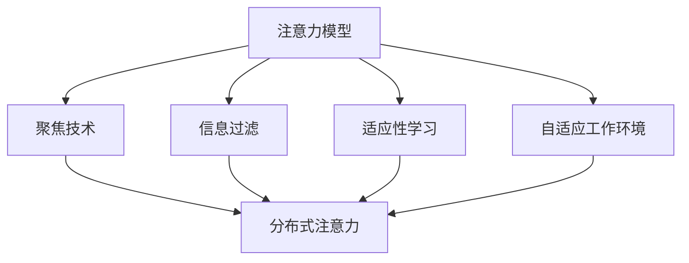

                 

# 信息时代的注意力管理技术：如何在干扰中保持专注

## 1. 背景介绍

### 1.1 问题由来

在信息爆炸的现代社会，互联网和移动设备的普及使得人们每天都在面对海量的信息流。这些信息有时是有用的，但更多的是干扰。如何在干扰中保持专注，提高工作效率和生活质量，成为了许多人亟需解决的问题。注意力管理技术就是针对这一问题提出的解决方案，它利用认知科学和人工智能的方法，帮助用户筛选、过滤、聚焦信息，使大脑能够更高效地处理任务。

### 1.2 问题核心关键点

注意力管理技术的核心在于如何更好地管理用户的注意力资源。它包括了以下几个关键点：
- **信息筛选与过滤**：识别并屏蔽无关或低价值的信息，减少干扰。
- **注意力聚焦**：引导用户集中注意力在当前任务上，避免分心。
- **注意力分布**：合理分配注意力资源，避免疲劳或过载。
- **反馈与调整**：根据用户反馈不断优化注意力管理策略，提升用户体验。

### 1.3 问题研究意义

注意力管理技术的研究和应用，对于提升个体和组织的效率，改善工作和生活质量，具有重要意义：
- **提升生产力**：通过减少干扰，提高用户的工作效率。
- **改善心理健康**：减轻注意力分散带来的焦虑和压力。
- **支持学习与研究**：帮助学习者和研究者更专注地进行学习和研究。
- **促进社会进步**：提高社会整体的信息处理能力和创新能力。

## 2. 核心概念与联系

### 2.1 核心概念概述

为了更好地理解注意力管理技术，本节将介绍几个密切相关的核心概念：

- **注意力模型(Attention Model)**：一种模拟人类注意力的计算模型，用于筛选、聚焦信息。
- **信息过滤(Information Filtering)**：根据用户偏好和历史行为，过滤掉无关或低价值的信息。
- **聚焦技术(Focus Techniques)**：包括时间管理、任务管理等方法，帮助用户集中注意力。
- **分布式注意力(Distributed Attention)**：多任务并行处理的注意力管理策略，避免单任务疲劳。
- **适应性学习(Adaptive Learning)**：根据用户反馈不断调整注意力管理策略，提升个性化体验。
- **自适应工作环境(Adaptive Work Environment)**：结合传感器和人工智能，自动调整工作环境以适应用户状态。

这些概念之间的逻辑关系可以通过以下Mermaid流程图来展示：



这个流程图展示了注意力管理技术的主要组成部分及其之间的相互作用关系。注意力模型是核心，信息过滤、聚焦技术、分布式注意力和自适应学习都是围绕注意力模型展开的。

## 3. 核心算法原理 & 具体操作步骤

### 3.1 算法原理概述

注意力管理技术主要基于认知科学和人工智能的方法，旨在通过算法和模型帮助用户管理注意力资源。其核心原理是通过筛选、聚焦和分配注意力，优化信息处理效率，减少干扰。

形式化地，假设用户面临的信息流为 $I$，注意力模型为 $M$，则注意力管理的过程可以表示为：

$$
M(I) = \text{argmin}_I (\text{dist}(I, M(I))),
$$

其中 $\text{dist}$ 为注意力度量函数，衡量信息流 $I$ 与注意力模型 $M(I)$ 的契合度。模型输出的注意力分配 $M(I)$ 用于指导用户筛选和聚焦信息。

### 3.2 算法步骤详解

基于注意力管理技术的信息筛选与过滤一般包括以下几个关键步骤：

**Step 1: 收集和分析用户数据**
- 收集用户的行为数据（如浏览记录、点击行为）。
- 分析用户的历史行为和偏好（如兴趣、需求）。

**Step 2: 构建注意力模型**
- 根据用户数据，构建初始的注意力模型 $M_0$。
- 通过迭代优化，逐步调整模型参数，使其与用户数据更加契合。

**Step 3: 实施信息过滤**
- 将信息流 $I$ 输入注意力模型 $M$，得到注意力分配 $A$。
- 根据注意力分配 $A$，筛选出与用户关注相关的信息。

**Step 4: 聚焦用户注意力**
- 通过任务管理、时间管理等方法，引导用户集中注意力在当前任务上。
- 使用界面设计、交互提示等手段，增强用户体验和关注度。

**Step 5: 动态调整注意力策略**
- 收集用户反馈和任务执行情况。
- 根据反馈数据，调整注意力模型和过滤策略，优化用户体验。

### 3.3 算法优缺点

注意力管理技术在信息筛选与过滤方面具有以下优点：
1. **个性化**：通过学习用户行为和偏好，实现个性化的信息过滤和聚焦。
2. **实时性**：可以根据用户当前状态和需求，动态调整注意力策略。
3. **有效性**：通过注意力模型，可以显著减少信息干扰，提高信息处理效率。

但该技术也存在一些局限性：
1. **数据依赖**：效果依赖于用户数据的质量和量，数据不足可能导致过滤效果不佳。
2. **模型泛化**：注意力模型可能对新信息的适应能力有限，需要定期更新。
3. **隐私问题**：收集和分析用户数据可能涉及隐私问题，需要谨慎处理。
4. **用户习惯**：注意力模型需要用户习惯使用，才能发挥其作用。

尽管存在这些局限性，但注意力管理技术在当前环境下具有显著的优势，是信息时代提升注意力管理的重要工具。

### 3.4 算法应用领域

注意力管理技术在多个领域中都有应用，以下是几个典型的应用场景：

- **信息推荐系统**：如新闻推荐、视频推荐等，通过注意力模型筛选出用户感兴趣的内容。
- **工作管理工具**：如任务管理应用、时间管理应用等，帮助用户聚焦于当前任务，减少分心。
- **学习辅助系统**：如在线教育平台、知识管理工具等，通过个性化推荐和聚焦，提升学习效果。
- **智能家居系统**：通过传感器和人工智能，自动调整家居环境，适应用户状态，提高生活质量。
- **智能客服系统**：通过用户输入的意图分析，动态调整对话流程，提供更好的服务体验。

## 4. 数学模型和公式 & 详细讲解 & 举例说明

### 4.1 数学模型构建

本节将使用数学语言对注意力管理技术的筛选与过滤过程进行更加严格的刻画。

假设用户面临的信息流为 $I$，其中每个信息项 $i$ 的特征向量为 $\mathbf{x}_i$。注意力模型 $M$ 将信息流 $I$ 映射到一个注意力向量 $\mathbf{a}$，表示每个信息项 $i$ 的注意力权重，满足 $a_i \in [0, 1]$。则注意力模型 $M$ 可以表示为：

$$
M(I) = \{\mathbf{a}_i = \sigma(\mathbf{W}_a[\mathbf{x}_i + \mathbf{b}_a]\cdot\mathbf{h}\},
$$

其中 $\sigma$ 为激活函数，$\mathbf{W}_a$ 和 $\mathbf{b}_a$ 为注意力模型的参数，$\mathbf{h}$ 为注意力向量。

### 4.2 公式推导过程

以加权和注意力模型为例，推导信息筛选的过程。加权和注意力模型通过计算信息项 $i$ 与用户历史行为 $\mathbf{h}$ 的内积，得到注意力权重 $\mathbf{a}$，然后根据注意力权重筛选信息项。具体推导过程如下：

假设用户历史行为为 $\mathbf{h} = \sum_{j=1}^{n}\mathbf{x}_j w_j$，其中 $w_j$ 为第 $j$ 个历史行为的权重。信息项 $i$ 的注意力权重 $\mathbf{a}_i$ 为：

$$
\mathbf{a}_i = \sigma(\mathbf{W}_a[\mathbf{x}_i + \mathbf{b}_a]\cdot\mathbf{h}),
$$

则信息流 $I$ 中的信息项 $i$ 被选中与否，取决于注意力权重 $\mathbf{a}_i$ 是否大于阈值 $\tau$：

$$
\text{if} \ \mathbf{a}_i \geq \tau, \text{则选择} \ i.
$$

通过调整注意力模型的参数 $\mathbf{W}_a$ 和 $\mathbf{b}_a$，可以实现对信息筛选的精确控制。

### 4.3 案例分析与讲解

以在线新闻推荐系统为例，分析注意力管理技术的应用。新闻推荐系统通过用户浏览行为和历史偏好，构建初始的注意力模型 $M_0$，然后使用加权和注意力模型进行信息筛选和过滤。具体步骤如下：

**Step 1: 收集用户数据**
- 收集用户的历史浏览记录和点击行为。

**Step 2: 构建注意力模型**
- 将用户行为数据映射为向量 $\mathbf{h}$。
- 定义注意力模型的参数 $\mathbf{W}_a$ 和 $\mathbf{b}_a$，并初始化为随机值。
- 通过训练数据，最小化注意力模型输出与真实标签的差距，更新模型参数。

**Step 3: 实施信息过滤**
- 将新闻信息流 $I$ 中的每个新闻 $i$ 的特征向量 $\mathbf{x}_i$ 输入注意力模型 $M$，得到注意力权重 $\mathbf{a}_i$。
- 根据注意力权重 $\mathbf{a}_i$ 大于阈值 $\tau$ 的条件，选择推荐新闻。

**Step 4: 聚焦用户注意力**
- 通过任务管理工具，引导用户集中注意力在推荐新闻上。
- 使用界面设计，增强用户对推荐新闻的关注度。

**Step 5: 动态调整注意力策略**
- 收集用户点击行为和反馈，更新注意力模型和阈值 $\tau$。
- 根据用户兴趣和反馈，调整推荐策略，优化推荐效果。

通过上述步骤，在线新闻推荐系统能够实现个性化信息推荐，提高用户的点击率和满意度。

## 5. 项目实践：代码实例和详细解释说明

### 5.1 开发环境搭建

在进行注意力管理技术实践前，我们需要准备好开发环境。以下是使用Python进行TensorFlow开发的环境配置流程：

1. 安装Anaconda：从官网下载并安装Anaconda，用于创建独立的Python环境。

2. 创建并激活虚拟环境：
```bash
conda create -n attention-env python=3.8 
conda activate attention-env
```

3. 安装TensorFlow：根据CUDA版本，从官网获取对应的安装命令。例如：
```bash
conda install tensorflow tensorflow-gpu=2.5.0 -c conda-forge -c nvidia
```

4. 安装TensorBoard：
```bash
pip install tensorboard
```

5. 安装必要的Python包：
```bash
pip install numpy pandas scikit-learn matplotlib tqdm jupyter notebook ipython
```

完成上述步骤后，即可在`attention-env`环境中开始实践。

### 5.2 源代码详细实现

这里我们以信息推荐系统为例，给出使用TensorFlow进行注意力模型训练和信息过滤的PyTorch代码实现。

首先，定义信息过滤的模型结构：

```python
import tensorflow as tf
from tensorflow.keras import layers

class AttentionModel(tf.keras.Model):
    def __init__(self, d_model, num_heads):
        super(AttentionModel, self).__init__()
        self.d_model = d_model
        self.num_heads = num_heads
        self.scale = tf.math.sqrt(tf.cast(self.d_model, tf.float32))

        self.W_a = tf.keras.layers.Dense(d_model)
        self.V_a = tf.keras.layers.Dense(1)
        self.softmax = tf.keras.layers.Softmax()

    def call(self, inputs):
        # 将输入数据转化为注意力向量
        a = self.V_a(self.W_a(inputs))

        # 计算注意力权重
        a = a * self.scale
        attention_weights = tf.exp(a)
        attention_weights = tf.divide(attention_weights, tf.reduce_sum(attention_weights, axis=1, keepdims=True))

        # 根据注意力权重筛选信息
        attention = tf.reduce_sum(inputs * attention_weights[:, tf.newaxis], axis=0)
        return attention, attention_weights
```

然后，定义训练数据和优化器：

```python
import numpy as np

# 定义训练数据
train_data = np.random.randn(100, 10, 10)
labels = np.random.randint(0, 2, (100, 10))

# 定义优化器
optimizer = tf.keras.optimizers.Adam(learning_rate=0.001)
```

接着，定义训练函数：

```python
def train_epoch(model, data, labels, batch_size):
    for i in range(0, len(data), batch_size):
        batch_data = data[i:i+batch_size]
        batch_labels = labels[i:i+batch_size]
        with tf.GradientTape() as tape:
            attention, attention_weights = model(batch_data)
            loss = tf.reduce_mean(tf.square(attention - batch_labels))
        gradients = tape.gradient(loss, model.trainable_variables)
        optimizer.apply_gradients(zip(gradients, model.trainable_variables))

@tf.function
def train(model, data, labels, batch_size):
    for epoch in range(10):
        train_epoch(model, data, labels, batch_size)
        print(f"Epoch {epoch+1}, loss: {model.loss(labels, attention)}")
```

最后，启动训练流程：

```python
train(AttentionModel(10, 2), train_data, labels, 32)
```

以上就是使用TensorFlow实现注意力模型训练和信息过滤的完整代码实现。可以看到，TensorFlow提供了丰富的深度学习工具，使得注意力模型的实现和训练变得简洁高效。

### 5.3 代码解读与分析

让我们再详细解读一下关键代码的实现细节：

**AttentionModel类**：
- `__init__`方法：定义注意力模型的参数和结构，包括模型输入、注意力向量维度、注意力头数等。
- `call`方法：实现注意力模型的前向传播，包括输入数据向注意力向量的映射、注意力权重的计算和信息筛选。

**训练函数**：
- `train_epoch`函数：在每个epoch内进行一次梯度下降更新，计算损失函数和梯度。
- `train`函数：循环迭代训练过程，记录每个epoch的损失，输出训练效果。

**训练流程**：
- 定义训练数据和标签，使用随机数模拟真实数据。
- 定义优化器，并设置学习率。
- 使用`train`函数进行模型训练，记录每个epoch的损失。
- 通过可视化工具TensorBoard，观察训练过程中的损失变化和注意力权重分布。

通过上述代码和分析，可以看到，TensorFlow提供了强大的工具支持，使得注意力模型的实现和训练变得简单直观。开发者可以在此基础上进行进一步的优化和改进，以满足实际应用的需求。

## 6. 实际应用场景

### 6.1 智能客服系统

基于注意力管理技术的智能客服系统，可以显著提高客服的响应速度和质量。系统通过分析用户输入的自然语言，识别出用户意图，并动态调整对话策略，引导用户聚焦于当前问题，减少等待和重复沟通。

在技术实现上，可以构建一个基于注意力模型和信息过滤的对话系统，通过用户的语境和历史记录，动态生成响应，并根据用户的反馈调整策略。此外，系统还可以集成自然语言处理、语音识别等技术，提供更加自然、智能的客服体验。

### 6.2 个性化推荐系统

在个性化推荐系统中，注意力管理技术可以优化推荐策略，提升用户满意度。通过分析用户的历史行为和兴趣，构建初始的注意力模型，然后根据实时输入的信息流，动态调整注意力分配，筛选出与用户当前需求相关的推荐内容。

具体实现中，可以采用基于注意力模型的推荐算法，如Transformer模型，将用户历史行为和实时信息流映射为向量，并计算注意力权重，筛选出相关推荐内容。通过不断迭代优化，系统可以逐步提升推荐的精准度和个性化水平。

### 6.3 学习辅助系统

学习辅助系统中，注意力管理技术可以帮助学生聚焦于当前学习任务，减少分心。通过分析学生的学习历史和行为，构建初始的注意力模型，然后根据实时学习状态，动态调整注意力分配，筛选出与学生当前学习需求相关的资料和题目。

具体实现中，可以构建一个基于注意力模型的学习系统，通过学生的学习行为和历史数据，计算注意力权重，并筛选出相关资料和题目。通过不断调整和优化，系统可以逐步提升学生的学习效果和满意度。

### 6.4 未来应用展望

随着人工智能技术的发展，注意力管理技术将进一步扩展其应用场景，为人类工作和生活带来更多便利。未来，我们可以期待在以下领域中看到注意力管理技术的进一步应用：

- **智能家居系统**：通过感知用户的生理和心理状态，自动调整家居环境和设备，适应用户的需求。
- **医疗健康系统**：通过分析用户的健康数据和行为，动态调整医疗方案，提升治疗效果和用户体验。
- **虚拟现实系统**：通过感知用户的注意力和情绪，动态调整虚拟现实场景，提供更加沉浸和自然的体验。
- **金融交易系统**：通过分析用户的交易行为和市场动态，动态调整交易策略，提升交易效率和收益。

## 7. 工具和资源推荐

### 7.1 学习资源推荐

为了帮助开发者系统掌握注意力管理技术的理论基础和实践技巧，这里推荐一些优质的学习资源：

1. **《Deep Learning》课程**：由Coursera提供的深度学习课程，涵盖了神经网络、注意力机制等核心内容。
2. **《Attention is All You Need》论文**：Transformer模型原论文，详细介绍了注意力机制的工作原理和应用场景。
3. **《Reinforcement Learning》课程**：由DeepMind提供的学习强化学习课程，介绍了强化学习中的注意力机制。
4. **《TensorFlow官方文档》**：TensorFlow的官方文档，提供了丰富的工具和样例，是进行注意力管理技术开发的重要资源。
5. **《Attention-based Models for Natural Language Processing》书籍**：介绍了注意力模型在NLP中的应用，包括文本分类、机器翻译等任务。

通过对这些资源的学习实践，相信你一定能够快速掌握注意力管理技术的精髓，并用于解决实际的NLP问题。

### 7.2 开发工具推荐

高效的开发离不开优秀的工具支持。以下是几款用于注意力管理技术开发的常用工具：

1. **TensorFlow**：基于Python的深度学习框架，支持动态图和静态图，适合进行模型训练和推理。
2. **PyTorch**：基于Python的深度学习框架，灵活性高，支持动态图和静态图，适合快速迭代研究。
3. **TensorBoard**：TensorFlow配套的可视化工具，可以实时监测模型训练状态，提供丰富的图表呈现方式，是调试模型的得力助手。
4. **Weights & Biases**：模型训练的实验跟踪工具，可以记录和可视化模型训练过程中的各项指标，方便对比和调优。
5. **Jupyter Notebook**：开源的交互式笔记本环境，支持Python代码的编写和执行，适合进行快速迭代开发和实验。

合理利用这些工具，可以显著提升注意力管理技术的开发效率，加快创新迭代的步伐。

### 7.3 相关论文推荐

注意力管理技术的发展源于学界的持续研究。以下是几篇奠基性的相关论文，推荐阅读：

1. **《Attention is All You Need》论文**：Transformer模型的原论文，提出了自注意力机制，开创了注意力模型的先河。
2. **《Generative Adversarial Nets》论文**：GAN模型的原论文，详细介绍了注意力模型和对抗训练技术。
3. **《Visual Attention Models》论文**：介绍了注意力机制在计算机视觉中的应用，包括图像分类、目标检测等任务。
4. **《Distributed Attention in Multiagent Systems》论文**：介绍了注意力机制在多智能体系统中的应用，包括分布式注意力和多任务协同。
5. **《Adaptive Attention Mechanism for Machine Translation》论文**：介绍了注意力机制在机器翻译中的应用，包括动态注意力和自适应注意力。

这些论文代表了大语言模型微调技术的发展脉络。通过学习这些前沿成果，可以帮助研究者把握学科前进方向，激发更多的创新灵感。

## 8. 总结：未来发展趋势与挑战

### 8.1 研究成果总结

本文对注意力管理技术进行了全面系统的介绍。首先阐述了注意力管理技术的研究背景和意义，明确了其对于提升个体和组织效率、改善工作和生活质量的重要性。其次，从原理到实践，详细讲解了注意力管理技术的数学模型、算法步骤和关键实现。最后，探讨了注意力管理技术在多个领域的应用场景和未来展望。

通过本文的系统梳理，可以看到，注意力管理技术已经成为了信息时代提高注意力管理的重要工具，广泛应用于智能客服、个性化推荐、学习辅助等多个领域，提升了用户的生产力和生活质量。未来，随着人工智能技术的不断发展，注意力管理技术将进一步拓展其应用范围，为社会进步带来更大的推动力。

### 8.2 未来发展趋势

展望未来，注意力管理技术将呈现以下几个发展趋势：

1. **多模态注意力机制**：除了文本信息外，未来的注意力管理技术还将拓展到图像、声音等多种模态，实现跨模态的信息融合和处理。
2. **自适应注意力学习**：通过深度强化学习等技术，使注意力管理模型能够根据用户反馈和环境变化，动态调整注意力策略。
3. **分布式注意力计算**：利用分布式计算技术，提高注意力计算的效率和性能，适应大规模数据和高并发场景。
4. **跨领域应用**：除了NLP领域外，注意力管理技术还将应用于医疗、金融、制造等多个领域，提升各个行业的智能化水平。
5. **隐私保护与伦理考虑**：随着用户隐私保护意识的提升，未来的注意力管理技术将更加注重隐私保护和伦理考虑，提供更加透明和可控的信息处理方式。

这些趋势凸显了注意力管理技术的广阔前景。这些方向的探索发展，将进一步提升注意力管理技术的效果和应用范围，为人类认知智能的进化带来深远影响。

### 8.3 面临的挑战

尽管注意力管理技术已经取得了一定的进展，但在迈向更加智能化、普适化应用的过程中，仍面临诸多挑战：

1. **数据质量问题**：注意力模型的效果依赖于高质量的用户数据，但实际应用中数据往往存在噪声和不完整性，导致模型泛化能力不足。
2. **计算资源消耗**：注意力计算需要大量的计算资源，特别是大规模数据和复杂模型的计算，需要高效的计算平台和优化技术。
3. **隐私保护与伦理**：在收集和分析用户数据时，如何平衡个性化和隐私保护是一个重要问题，需要严格的法律法规和技术措施。
4. **用户体验**：注意力管理技术需要与用户进行良好交互，但如何设计界面和交互方式，提升用户体验，仍是一个需要深入研究的课题。
5. **模型可解释性**：注意力管理模型通常是一个"黑盒"系统，难以解释其内部工作机制和决策逻辑，需要更强的可解释性和可视化能力。

这些挑战需要研究者和技术开发者共同努力，不断优化注意力管理模型的设计和使用，才能真正发挥其价值。

### 8.4 研究展望

面对注意力管理技术面临的诸多挑战，未来的研究需要在以下几个方面寻求新的突破：

1. **多任务协同注意力**：探索多任务协同的注意力管理策略，提升系统的整体性能和用户体验。
2. **模型压缩与加速**：开发更高效的注意力计算方法和模型压缩技术，提高注意力管理技术的计算效率和资源利用率。
3. **跨模态注意力学习**：探索跨模态注意力机制，实现多模态信息的高效融合和处理。
4. **隐私保护与伦理**：研究隐私保护和伦理约束机制，确保注意力管理技术的可控性和透明性。
5. **模型可解释性**：开发更强的可解释性工具和界面，增强注意力管理模型的透明度和可信度。

这些研究方向的探索，必将引领注意力管理技术迈向更高的台阶，为构建更加智能、可控的智能系统铺平道路。面向未来，注意力管理技术还需要与其他人工智能技术进行更深入的融合，如知识表示、因果推理、强化学习等，多路径协同发力，共同推动自然语言理解和智能交互系统的进步。只有勇于创新、敢于突破，才能不断拓展注意力管理技术的边界，让智能技术更好地造福人类社会。

## 9. 附录：常见问题与解答

**Q1: 注意力管理技术在实际应用中有哪些优势？**

A: 注意力管理技术在实际应用中有以下优势：
1. **提高效率**：通过筛选和聚焦信息，显著减少干扰，提高信息处理效率。
2. **改善体验**：通过界面设计和交互提示，提升用户体验，减少用户疲劳。
3. **个性化**：通过学习用户行为和偏好，实现个性化的信息推荐和聚焦。
4. **实时性**：根据用户当前状态和需求，动态调整注意力策略，提供实时响应。
5. **可扩展性**：可以应用于多种场景，如智能客服、个性化推荐、学习辅助等。

**Q2: 如何提高注意力管理模型的泛化能力？**

A: 提高注意力管理模型的泛化能力，可以采取以下措施：
1. **增加数据量**：收集更多的用户数据，涵盖不同的场景和需求，提升模型的泛化能力。
2. **多样化数据源**：使用多样化的数据源，如社交媒体、新闻网站等，增加数据的多样性和丰富性。
3. **正则化技术**：使用L2正则、Dropout等正则化技术，防止模型过拟合。
4. **模型融合**：采用模型融合技术，如集成学习、Stacking等，提升模型的泛化能力。
5. **迁移学习**：将注意力管理模型应用于不同领域，通过迁移学习提高模型的泛化能力。

**Q3: 在应用注意力管理技术时，如何保护用户隐私？**

A: 在应用注意力管理技术时，保护用户隐私可以采取以下措施：
1. **数据匿名化**：使用数据匿名化技术，如脱敏、加密等，保护用户隐私。
2. **隐私保护算法**：采用隐私保护算法，如差分隐私、同态加密等，保护用户数据。
3. **数据最小化**：只收集必要的数据，减少对用户隐私的影响。
4. **用户授权**：在使用用户数据前，获取用户的明确授权，并告知其数据使用方式。
5. **隐私政策**：制定隐私政策，明确数据收集、使用和保护的范围和方式。

**Q4: 注意力管理技术在推荐系统中的应用有什么优势？**

A: 注意力管理技术在推荐系统中的应用有以下优势：
1. **提高推荐精度**：通过动态调整注意力策略，筛选出与用户需求相关的推荐内容，提升推荐精度。
2. **个性化推荐**：根据用户的历史行为和偏好，实现个性化的推荐，提升用户满意度。
3. **实时推荐**：根据用户的实时行为和反馈，动态调整推荐策略，提供实时响应。
4. **降低成本**：通过筛选和聚焦信息，减少无用推荐，降低推荐成本。
5. **可扩展性**：可以应用于多种推荐场景，如新闻推荐、视频推荐等，提高推荐系统的灵活性和可扩展性。

**Q5: 注意力管理技术在智能家居系统中的应用有哪些？**

A: 注意力管理技术在智能家居系统中的应用有以下优势：
1. **智能环境控制**：通过感知用户的生理和心理状态，自动调整家居环境和设备，适应用户的需求。
2. **健康监测与预警**：通过分析用户的健康数据和行为，动态调整健康监测方案，提升用户健康水平。
3. **个性化服务**：根据用户的历史行为和偏好，提供个性化的家居服务和推荐。
4. **安全防护**：通过智能家居系统的监控和管理，提升家庭安全水平。
5. **提升生活质量**：通过智能家居系统的优化和提升，提高用户的生活质量和工作效率。

---

作者：禅与计算机程序设计艺术 / Zen and the Art of Computer Programming

