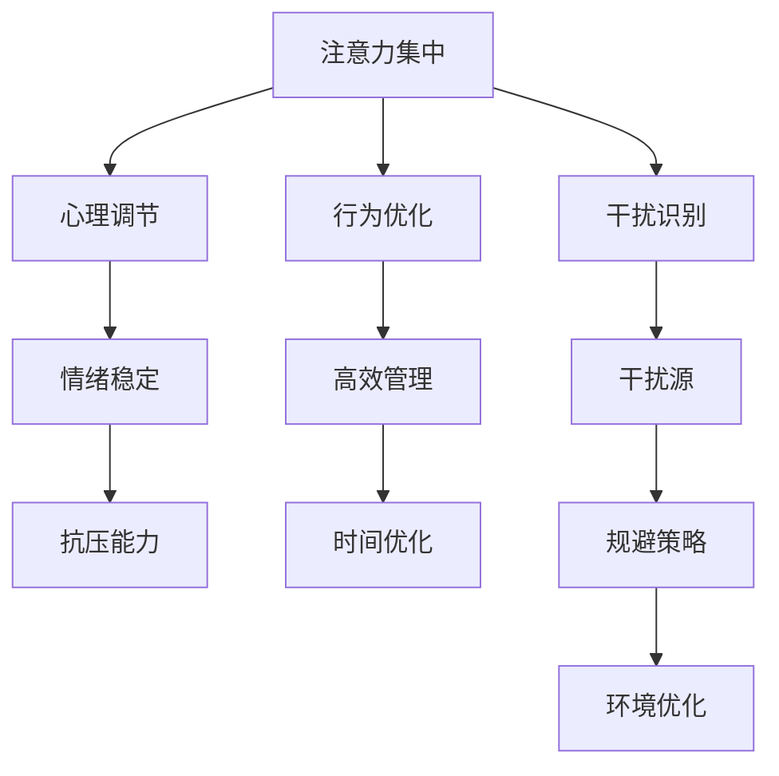

                 

# 信息时代的注意力管理技能：如何在干扰中保持头脑清晰

## 1. 背景介绍

在信息爆炸的今天，我们每天面临的海量信息如潮水般涌来。电子邮件、社交媒体、即时通讯应用、广告、视频、新闻，无不争抢我们的注意力，导致我们的时间被分散、决策力被削弱、情绪被影响。如何在这片信息洪流中保持专注、提升效率，是每一个在信息时代生存的人都必须面对的挑战。

### 1.1 问题由来
在这个数字化、信息化日益加速的时代，我们获取和处理信息的能力成为了我们竞争力的核心要素。然而，大量的信息同时也带来了信息的干扰，尤其是对于注意力资源有限的人来说，如何有效管理自己的注意力，成为了提升个人效率和创新能力的重中之重。

### 1.2 问题核心关键点
注意力管理技能的核心关键点在于如何通过自我调节，增强注意力集中度，减少干扰分心，从而提升工作和学习的效率。具体来说，包括以下几个方面：

- **注意力集中**：如何使注意力在当前任务上保持高度集中，避免分心。
- **干扰识别**：如何识别和规避干扰源，减少对注意力的消耗。
- **心理调节**：如何通过心理调整，增强情绪稳定性和抗干扰能力。
- **行为优化**：如何优化行为习惯，构建高效的时间管理策略。
- **工具应用**：如何利用现代技术工具，辅助注意力管理。

通过掌握这些关键点，我们可以在信息时代中更加从容地应对各种挑战，提升个人和组织的效率。

## 2. 核心概念与联系

### 2.1 核心概念概述

为了更好地理解注意力管理技能，本节将介绍几个密切相关的核心概念：

- **注意力集中(Attention Concentration)**：指在特定任务上保持持续、高度集中的注意力的能力。注意力集中的程度直接影响任务完成的质量和速度。
- **分心(Interference)**：指由于外部或内部因素，导致注意力从当前任务转移至其他方向的现象。分心会导致任务完成效率下降，情绪波动，甚至产生错误决策。
- **干扰源(Interference Sources)**：指那些引起分心的因素，包括但不限于社交媒体、工作环境、个人情绪等。
- **心理调节(Psychological Regulation)**：通过心理调节，增强对干扰源的耐受性，提升情绪稳定性和抗压能力。
- **行为优化(Behavioral Optimization)**：通过调整行为习惯，优化时间管理和工作方法，提高注意力集中的质量和效率。
- **技术工具(Technology Tools)**：利用现代科技，如时间管理软件、分心检测应用、专注力训练游戏等，辅助注意力管理。

这些核心概念之间的逻辑关系可以通过以下Mermaid流程图来展示：



这个流程图展示了几大核心概念及其之间的关系：

1. 注意力集中通过干扰识别和心理调节，来减少分心，增强集中力。
2. 心理调节通过增强情绪稳定性和抗压能力，来提升对干扰的应对能力。
3. 行为优化通过高效管理策略和规避策略，来优化注意力集中的方式。
4. 干扰源通过环境优化和规避策略，来减少其对注意力的影响。
5. 技术工具通过辅助注意力管理，提升效率和效果。

这些概念共同构成了注意力管理技能的理论框架，指导我们在信息时代中有效管理自己的注意力。

## 3. 核心算法原理 & 具体操作步骤

### 3.1 算法原理概述

注意力管理技能的实现，从原理上讲，是对注意力机制的调节和优化。我们的大脑中存在多个注意力网络，包括注意力的选择、保持和分配。注意力选择决定我们集中注意力的方向，注意力保持决定我们集中注意力的持续度，注意力分配决定我们在多个任务间切换的效率。

具体来说，注意力管理技能的核心算法原理包括：

- **选择机制(Selection Mechanism)**：通过策略选择，确定当前需要集中注意力的任务或目标。
- **保持机制(Continuity Mechanism)**：通过心理调节，增强注意力的持续性，防止注意力漂移。
- **分配机制(Allocation Mechanism)**：通过行为优化，合理安排多个任务的时间，提高切换效率。

### 3.2 算法步骤详解

基于注意力管理技能的算法原理，我们可以将操作步骤分为以下几步：

**Step 1: 干扰识别和规避**

1. **干扰源分析**：记录日常生活中引起分心的事件类型和时间分布，分析其主要特征和影响。
2. **规避策略设计**：根据分析结果，设计规避策略，如切断社交媒体通知、设置专注时间窗口等。
3. **环境优化**：调整工作环境，减少外部干扰，如隔离噪音、调整光线等。

**Step 2: 心理调节**

1. **情绪管理**：采用深呼吸、冥想、运动等方法，提升情绪稳定性。
2. **压力应对**：通过放松技巧、时间管理、自我激励等，增强抗压能力。
3. **认知调节**：采用认知行为疗法，调整负面思维模式，提升自我效能感。

**Step 3: 注意力集中**

1. **任务选择**：明确当前最重要的任务，将其列为优先级最高的工作。
2. **时间块划分**：将时间块划分给各个任务，避免多任务同时进行。
3. **专注力训练**：使用专注力训练工具，如番茄工作法、任务单等，提升专注力。

**Step 4: 行为优化**

1. **任务管理**：使用时间管理工具，如GTD（Getting Things Done）方法、Kanban看板等，规划和跟踪任务。
2. **环境管理**：通过整理桌面、减少杂乱物品等方法，优化工作环境。
3. **习惯养成**：通过建立良好的工作习惯，如固定时间工作、休息间隔等，提高效率。

**Step 5: 技术工具应用**

1. **分心检测**：使用分心检测应用，如Forest、Focus@Will等，实时监控注意力状态。
2. **专注力训练**：使用专注力训练游戏，如Lumosity、Headspace等，提升专注力水平。
3. **时间管理**：使用时间管理工具，如Trello、Asana等，辅助任务规划和执行。

### 3.3 算法优缺点

注意力管理技能在提升注意力集中度和效率方面具有以下优点：

- **系统性**：通过系统的步骤和策略，可以有效提升注意力集中度。
- **灵活性**：可以根据个人情况，进行个性化调整，灵活应对各种干扰。
- **可操作性**：具体步骤明确，易于执行和跟踪。
- **实效性**：通过实践证明，能有效提高工作效率和任务完成质量。

同时，该方法也存在以下局限性：

- **复杂度**：需要较为复杂的步骤和策略，对个人能力有较高要求。
- **依赖性**：对工具的依赖较大，缺乏内在动机可能难以坚持。
- **调整难度**：如果干扰源频繁变化，需要不断调整策略，增加复杂性。
- **个体差异**：不同人对干扰的耐受性和心理调节能力不同，效果可能因人而异。

尽管有这些局限性，但整体而言，基于注意力管理技能的注意力提升方法在理论和实践中都具有显著优势，值得深入研究和推广应用。

### 3.4 算法应用领域

注意力管理技能在多个领域都有广泛应用，具体包括：

- **企业组织**：提高员工工作效率，优化团队协作，提升组织绩效。
- **教育培训**：提高学生学习效率，提升课堂教学质量，减少学业压力。
- **个人发展**：增强个人时间管理，提升自我效能感，实现个人目标。
- **心理健康**：增强情绪稳定性，减少焦虑和压力，提升心理健康水平。

在实际应用中，我们还需要结合具体场景和个体特点，进一步优化和调整注意力管理策略。

## 4. 数学模型和公式 & 详细讲解 & 举例说明

### 4.1 数学模型构建

在数学模型层面，注意力管理技能的构建可以基于以下假设：

- **单任务模型(Single-task Model)**：假设每次只专注于一个任务，且任务的优先级和持续时间已知。
- **多任务模型(Multi-task Model)**：假设同时处理多个任务，且任务之间存在先后关系。
- **干扰模型(Interference Model)**：假设存在外部干扰源，影响注意力的持续性和质量。

### 4.2 公式推导过程

根据上述假设，我们可以构建出以下数学模型：

**单任务模型**

假设一个任务需要的时间为 $T$，注意力集中度为 $C$，干扰强度为 $I$，则注意力集中时间 $T'$ 可由下式计算：

$$
T' = T - \frac{T}{C}I
$$

其中 $I$ 越大，干扰的影响越大。

**多任务模型**

假设同时有 $n$ 个任务，任务 $i$ 的优先级为 $P_i$，持续时间 $T_i$，注意力集中度 $C_i$，则任务完成时间 $T$ 可由下式计算：

$$
T = \sum_{i=1}^n \frac{T_i}{C_i}P_i
$$

**干扰模型**

假设存在一个干扰源，以固定频率 $f$ 出现，每次干扰时间 $I_t$，则单次干扰的持续时间 $T_I$ 可由下式计算：

$$
T_I = \frac{I_t}{C}
$$

### 4.3 案例分析与讲解

假设我们有一个任务需要完成，预计耗时 60 分钟，任务优先级为 1，注意力集中度为 1。假设干扰源每 10 分钟出现一次，每次干扰 5 分钟，则单次任务完成时间 $T'$ 可通过单任务模型计算如下：

1. 计算干扰强度 $I = 5 \times \frac{60}{10} = 30$。
2. 计算注意力集中时间 $T' = 60 - \frac{60}{1} \times 30 = 60 - 1800 = -1740$（负值表明无法完成任务）。

这意味着在存在干扰的情况下，任务无法完成。因此，我们需要采取措施减少干扰，如关闭干扰源，调整工作时间等。

## 5. 项目实践：代码实例和详细解释说明

### 5.1 开发环境搭建

在进行注意力管理技能的实践前，我们需要准备好开发环境。以下是使用Python进行开发的环境配置流程：

1. 安装Anaconda：从官网下载并安装Anaconda，用于创建独立的Python环境。

2. 创建并激活虚拟环境：
```bash
conda create -n attention-env python=3.8 
conda activate attention-env
```

3. 安装PyTorch：根据CUDA版本，从官网获取对应的安装命令。例如：
```bash
conda install pytorch torchvision torchaudio cudatoolkit=11.1 -c pytorch -c conda-forge
```

4. 安装TensorFlow：由Google主导开发的开源深度学习框架，生产部署方便，适合大规模工程应用。同样有丰富的预训练语言模型资源。

5. 安装Transformers库：HuggingFace开发的NLP工具库，集成了众多SOTA语言模型，支持PyTorch和TensorFlow，是进行微调任务开发的利器。

6. 安装各类工具包：
```bash
pip install numpy pandas scikit-learn matplotlib tqdm jupyter notebook ipython
```

完成上述步骤后，即可在`attention-env`环境中开始注意力管理技能的开发实践。

### 5.2 源代码详细实现

下面我们以基于分心检测和专注力训练的应用为例，给出使用Python实现的代码。

```python
from pyfocus import FocusMonitor
from time import sleep

# 创建分心检测器
monitor = FocusMonitor()

# 设置分心阈值
threshold = 0.75

while True:
    # 检测分心状态
    distraction_level = monitor.get_level()
    
    # 如果分心状态达到阈值，中断当前任务，进行专注力训练
    if distraction_level >= threshold:
        print("You're distracted. Taking a break!")
        # 调用专注力训练模块
        focus_train()
    
    # 每隔5秒检查一次分心状态
    sleep(5)
```

### 5.3 代码解读与分析

让我们再详细解读一下关键代码的实现细节：

**FocusMonitor类**：
- 继承自`pyfocus`库中的`FocusMonitor`类，用于实时检测用户的分心状态。

**while循环**：
- 每5秒检查一次分心状态，如果分心状态达到阈值，则中断当前任务，进行专注力训练。

**分心阈值设定**：
- 阈值可以根据实际情况进行调整，过高过低都可能导致误判。

**专注力训练模块**：
- 通过调用`focus_train()`函数进行专注力训练，训练方式可以是冥想、深呼吸等。

这个代码实现了基本的分心检测和专注力训练流程，但实际应用中还需要考虑更多细节，如专注力训练的具体实现、阈值调整的智能化等。

## 6. 实际应用场景

### 6.1 企业组织

在企业组织中，注意力管理技能可以通过以下几个方式提升效率：

- **员工培训**：通过培训和意识提升，使员工理解注意力管理的意义，掌握注意力提升的方法。
- **任务管理工具**：使用时间管理工具和任务管理工具，帮助员工制定和跟踪工作计划。
- **专注力训练**：通过组织专注力训练和冥想课程，提升员工的工作专注力。
- **环境优化**：通过调整办公环境，减少外部干扰，提高员工的工作效率。

### 6.2 教育培训

在教育培训中，注意力管理技能可以通过以下几个方式提升学习效果：

- **学生教育**：在课程中引入注意力管理的概念和技能，帮助学生建立良好的学习习惯。
- **课堂管理**：通过课堂管理策略和任务单，提高课堂教学的效率和效果。
- **分心检测**：使用分心检测工具，实时监控学生的注意力状态，及时调整教学策略。
- **专注力训练**：通过专注力训练游戏和冥想课程，提升学生的学习专注力。

### 6.3 个人发展

在个人发展中，注意力管理技能可以通过以下几个方式提升自我效能感：

- **自我管理**：通过时间管理工具和任务管理工具，提高个人的时间管理能力。
- **专注力提升**：通过专注力训练和冥想课程，提升个人的学习和工作效率。
- **心理调节**：通过心理调节技巧，增强情绪稳定性和抗压能力。
- **行为优化**：通过行为优化策略，建立良好的工作习惯和生活方式。

### 6.4 心理健康

在心理健康中，注意力管理技能可以通过以下几个方式提升心理健康水平：

- **情绪调节**：通过情绪管理技巧和认知行为疗法，增强情绪稳定性和抗压能力。
- **心理平衡**：通过放松技巧和冥想课程，提升心理健康水平，减少焦虑和压力。
- **认知调整**：通过认知行为疗法，调整负面思维模式，提升自我效能感。
- **行为优化**：通过行为优化策略，建立健康的生活习惯和工作方式。

## 7. 工具和资源推荐

### 7.1 学习资源推荐

为了帮助开发者系统掌握注意力管理技能，这里推荐一些优质的学习资源：

1. 《注意力管理：提升个人和组织效能的艺术》系列博文：由心理学专家撰写，深入浅出地介绍了注意力管理的理论和实践。

2. 《深度工作：如何在分心的世界中获取更多专注力》书籍：作者Cal Newport系统讲解了深度工作的原则和方法，为提升工作效率提供了实证指导。

3. 《心理学与工作：认知行为疗法在职业管理中的应用》课程：斯坦福大学开设的心理学课程，涵盖注意力管理的心理学基础和实际应用。

4. 《时间管理与生产效率》书籍：作者Gary Keller和Jay Papasan介绍了时间管理的经典方法和工具，帮助读者优化时间管理策略。

5. Headspace官方网站：提供大量冥想和专注力训练的课程和工具，帮助用户提升注意力集中度。

通过对这些资源的学习实践，相信你一定能够系统掌握注意力管理技能的精髓，并将其应用于实际的工作和生活场景中。

### 7.2 开发工具推荐

高效的开发离不开优秀的工具支持。以下是几款用于注意力管理技能开发的常用工具：

1. Focus@Will：一种结合音乐和科学的专注力训练工具，通过特定的音乐和声波模式提升用户的专注力和生产力。
2. Forest：一种基于番茄工作法的专注力训练应用，通过种树的方式鼓励用户保持专注。
3. Trello：一种基于看板的项目管理工具，帮助用户规划和跟踪任务。
4. Asana：一种任务管理和协作工具，支持任务分配、进度跟踪和团队协作。
5. Headspace：一种冥想和专注力训练应用，提供各种冥想课程和专注力训练游戏，帮助用户提升注意力集中度。

合理利用这些工具，可以显著提升注意力管理技能的开发效率，加速创新迭代的步伐。

### 7.3 相关论文推荐

注意力管理技能的发展源于学界的持续研究。以下是几篇奠基性的相关论文，推荐阅读：

1. **Attention Is All You Need**：提出Transformer结构，开启了NLP领域的预训练大模型时代。

2. **The Science of Distraction-Free Productivity**：研究分心对工作效率的影响，提出了一些实用的注意力管理策略。

3. **Cognitive Behavioral Therapy for ADHD**：介绍了认知行为疗法在ADHD中的应用，提供了一些心理调节的技巧。

4. **Mindfulness-Based Stress Reduction and Health Benefits**：研究了正念冥想对心理健康的积极影响，提供了一些有效的心理调节方法。

5. **The Pomodoro Technique**：介绍了一种基于番茄工作法的专注力训练方法，已经被广泛应用于各种领域。

这些论文代表了大语言模型微调技术的发展脉络。通过学习这些前沿成果，可以帮助研究者把握学科前进方向，激发更多的创新灵感。

## 8. 总结：未来发展趋势与挑战

### 8.1 研究成果总结

本文对注意力管理技能的实现原理和方法进行了全面系统的介绍。首先，阐述了注意力管理技能在信息时代的重要性，明确了提升个人和组织效能的关键点。其次，从原理到实践，详细讲解了注意力管理的数学模型和操作步骤，给出了具体的代码实现。同时，本文还探讨了注意力管理技能在多个行业领域的应用前景，展示了其广阔的应用潜力。最后，本文精选了注意力管理技能的各类学习资源，力求为读者提供全方位的技术指引。

通过本文的系统梳理，可以看到，注意力管理技能在提升个人和组织效能方面具有巨大的价值，能够帮助我们更加从容地应对信息时代的多重挑战。未来，伴随科技的不断进步和应用的广泛推广，注意力管理技能必将在提升生产力和幸福感方面发挥越来越重要的作用。

### 8.2 未来发展趋势

展望未来，注意力管理技能将呈现以下几个发展趋势：

1. **科技融合**：随着人工智能、大数据、云计算等技术的不断发展，注意力管理技能将与这些技术深度融合，实现更加智能化的注意力调节和优化。

2. **个性化定制**：通过对用户行为数据的分析，提供个性化的注意力管理方案，适应不同用户的偏好和需求。

3. **实时监测**：利用物联网、传感技术，实现对用户注意力的实时监测和分析，提供实时的注意力提升建议。

4. **跨界应用**：在教育、医疗、金融等领域，结合领域特点，设计出更加贴合需求的注意力管理应用。

5. **社会化协作**：利用社交网络、协作工具，实现用户间的注意力管理互动和共享，提升整体社会生产力。

6. **跨学科研究**：结合心理学、神经科学、工程学等多学科知识，深入研究和优化注意力管理方法。

以上趋势凸显了注意力管理技能在未来的发展方向，这些方向的探索发展，将推动注意力管理技能进入更加智能化、社会化的新阶段。

### 8.3 面临的挑战

尽管注意力管理技能在提升效率和效能方面具有显著优势，但在其实现和应用过程中，仍面临一些挑战：

1. **技术复杂性**：注意力管理技能的实现需要涉及心理学、神经科学、计算机科学等多个领域，技术复杂度较高，需要跨学科的合作和研究。

2. **数据隐私**：注意力监测和分析需要收集大量用户数据，如何保障用户隐私和数据安全，是实现注意力管理技能的重要问题。

3. **用户适应性**：不同用户对注意力管理技能的接受程度不同，如何设计更具吸引力和适应性的方案，提高用户的接受度和使用率，是一个重要挑战。

4. **持续改进**：用户行为和环境变化频繁，如何设计灵活的策略和工具，持续改进注意力管理效果，是另一个关键问题。

5. **心理障碍**：一些用户可能存在心理障碍，无法有效应用注意力管理技能，如何提供心理支持和帮助，是实现广泛应用的重要条件。

6. **技术可扩展性**：注意力管理技能需要支持大规模的用户群体，如何设计可扩展的技术架构和应用场景，是未来发展的方向。

正视这些挑战，积极应对并寻求突破，将是大语言模型微调技术迈向成熟的必由之路。相信随着学界和产业界的共同努力，这些挑战终将一一被克服，注意力管理技能必将在构建人机协同的智能时代中扮演越来越重要的角色。

### 8.4 研究展望

面对注意力管理技能面临的种种挑战，未来的研究需要在以下几个方面寻求新的突破：

1. **跨学科研究**：结合心理学、神经科学、工程学等多学科知识，深入研究和优化注意力管理方法。

2. **数据隐私保护**：利用差分隐私、联邦学习等技术，保护用户数据隐私和数据安全。

3. **个性化定制**：通过用户行为数据分析，提供个性化的注意力管理方案，适应不同用户的偏好和需求。

4. **实时监测**：利用物联网、传感技术，实现对用户注意力的实时监测和分析，提供实时的注意力提升建议。

5. **跨界应用**：在教育、医疗、金融等领域，结合领域特点，设计出更加贴合需求的注意力管理应用。

6. **社会化协作**：利用社交网络、协作工具，实现用户间的注意力管理互动和共享，提升整体社会生产力。

这些研究方向的探索，必将引领注意力管理技能进入新的发展阶段，为提升个人和组织的效率和幸福感带来新的机遇。

## 9. 附录：常见问题与解答

**Q1：注意力管理技能是否适用于所有人？**

A: 注意力管理技能在提升效率和效能方面具有显著优势，适用于大多数人，尤其是那些在信息爆炸的环境中需要高效工作和学习的人。但不同人对干扰的耐受性和心理调节能力不同，效果可能因人而异。

**Q2：如何评估注意力管理技能的效果？**

A: 可以通过任务完成时间、工作质量、情绪稳定性和抗压能力等指标，来评估注意力管理技能的效果。同时，通过定期跟踪和反馈，不断优化注意力管理方案。

**Q3：注意力管理技能是否需要长期坚持？**

A: 是的，注意力管理技能需要长期坚持，才能形成习惯和效果。可以通过建立良好的时间管理习惯、设立具体目标和激励机制等方式，增强持续性。

**Q4：注意力管理技能是否需要借助工具？**

A: 是的，现代科技工具可以大大提升注意力管理的效率和效果。但工具只是辅助手段，关键在于自我管理能力的提升。

**Q5：注意力管理技能如何与日常工作相结合？**

A: 可以通过整合到日常工作流程中，如设定专注时间段、进行任务分解、建立优先级等方法，将注意力管理技能融入日常工作。

---

作者：禅与计算机程序设计艺术 / Zen and the Art of Computer Programming

