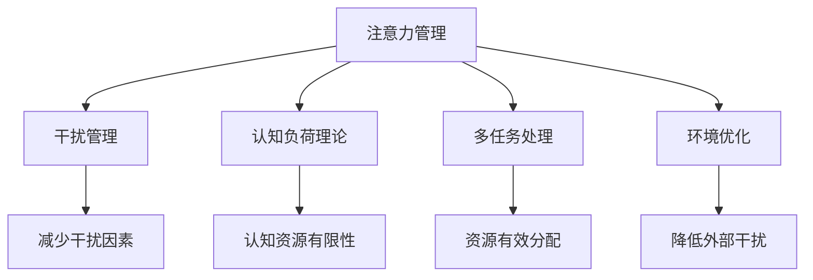

                 

# 信息时代的注意力管理策略与实践：在干扰和信息过载 中保持专注

## 1. 背景介绍

### 1.1 问题由来
在当今的信息时代，人们面临的最大挑战之一是注意力管理的危机。信息过载和干扰无处不在，人们容易被不断的通知、广告、社交媒体和其他干扰打断。这不仅影响了个人的工作效率，还导致了严重的健康问题，如焦虑、抑郁和失眠。因此，如何管理注意力、提升专注力，已经成为新时代下亟待解决的重要问题。

### 1.2 问题核心关键点
本节将详细讨论信息时代注意力管理的核心问题，包括：

- 信息过载：用户接受信息的速度远超其处理能力，导致注意力分散和决策困难。
- 干扰频繁：来自各类应用通知、广告、社交媒体的干扰，使得用户难以集中精力完成任务。
- 多任务处理：信息技术的普及使得多任务处理成为常态，但人脑难以高效管理多任务。
- 环境影响：工作环境中的噪音、同事打扰等因素，对用户专注力产生负面影响。

通过理解这些核心问题，我们可以更有针对性地提出解决方案，提升用户在信息时代下的工作效率和心理健康。

## 2. 核心概念与联系

### 2.1 核心概念概述

为更好地理解信息时代下的注意力管理策略，本节将介绍几个密切相关的核心概念：

- 注意力管理：指通过科学的方法和工具，帮助用户管理自己的注意力，提升专注力。
- 干扰管理：通过减少或避免干扰因素，提高用户的注意力集中度。
- 认知负荷理论：解释了认知资源有限性对注意力管理的影响，强调了资源有效分配的重要性。
- 多任务处理：指同时进行多个任务的认知过程，对注意力分配提出了更高要求。
- 环境优化：指通过改善工作环境，降低外部干扰，增强用户注意力。

这些核心概念之间的逻辑关系可以通过以下Mermaid流程图来展示：



这个流程图展示了一些关键概念之间的联系：

1. 注意力管理的目标是提高用户专注力。
2. 干扰管理通过减少或避免干扰因素，提升注意力集中度。
3. 认知负荷理论解释了注意力管理的科学原理。
4. 多任务处理要求更好的注意力分配策略。
5. 环境优化有助于降低外部干扰，提高注意力集中度。

这些概念共同构成了信息时代下注意力管理的框架，使得用户能够更高效地应对信息过载和干扰。

## 3. 核心算法原理 & 具体操作步骤
### 3.1 算法原理概述

信息时代下的注意力管理策略，本质上是通过科学方法和技术工具，帮助用户更有效地管理自己的注意力资源。其核心思想是：

1. 识别干扰因素，减少或避免干扰，提升注意力集中度。
2. 通过任务分配、优先级排序等方法，合理分配认知资源，提高多任务处理能力。
3. 利用技术工具，如应用程序屏蔽、专注模式等，帮助用户专注完成任务。

因此，注意力管理策略可以分为干扰管理、资源分配和工具辅助三个核心环节。

### 3.2 算法步骤详解

#### 3.2.1 干扰管理

**Step 1: 识别干扰因素**

- 通过日志分析、用户调查等手段，识别出日常工作中最主要的干扰因素。
- 例如，社交媒体通知、邮件提醒、同事打扰等。

**Step 2: 减少或避免干扰**

- 针对识别出的干扰因素，采取相应措施减少其影响。
- 例如，使用社交媒体屏蔽工具、设置邮件自动回复、避免开放式办公室等。

**Step 3: 环境优化**

- 改善工作环境，减少外部噪音和打扰。
- 例如，使用降噪耳机、优化办公室布局、减少工作间的开放性等。

#### 3.2.2 资源分配

**Step 1: 任务分析**

- 分析当前工作任务，明确每项任务的优先级和重要性。
- 例如，使用Eisenhower矩阵，将任务分为四类：紧急且重要、紧急不重要、不紧急但重要、不紧急不重要。

**Step 2: 时间管理**

- 使用时间管理工具，如番茄工作法、时间块法等，合理安排时间。
- 例如，设定25分钟工作时间，5分钟休息时间，每4个周期后进行更长时间的休息。

**Step 3: 认知负荷优化**

- 使用认知负荷优化技术，如分散注意力、避免多任务处理等，提高资源利用效率。
- 例如，避免在工作时同时处理多项任务，集中精力完成单一任务后再进行下一项。

#### 3.2.3 工具辅助

**Step 1: 应用程序屏蔽**

- 使用应用程序屏蔽工具，阻止不必要的应用通知。
- 例如，使用Focus@Will、Forest等工具，屏蔽社交媒体、新闻应用等。

**Step 2: 专注模式**

- 使用专注模式，限制访问某些应用，集中注意力。
- 例如，iPhone的“Do Not Disturb”模式，Google Chrome的“Focus”模式。

**Step 3: 技术辅助**

- 使用各种技术工具，帮助用户专注完成任务。
- 例如，使用Pomodoro Timer、Trello等工具，辅助时间管理和任务分配。

### 3.3 算法优缺点

信息时代下的注意力管理策略具有以下优点：

1. 提高效率：通过减少干扰、合理分配资源和工具辅助，显著提升工作效率。
2. 提升专注力：帮助用户集中注意力，减少注意力分散。
3. 改善健康：减少干扰和压力，改善心理健康状况。

同时，该策略也存在一定的局限性：

1. 依赖工具和技术：需要用户掌握和运用各种工具，才能发挥效果。
2. 个性化需求：不同的用户有不同的需求，需要根据实际情况进行个性化定制。
3. 自我管理能力：工具和策略的有效性取决于用户的自我管理能力。

尽管存在这些局限性，但信息时代下的注意力管理策略仍然是提升工作效率和心理健康的重要手段。未来相关研究的重点在于如何进一步提升策略的个性化和普适性，同时兼顾技术支持和用户自我管理能力。

### 3.4 算法应用领域

信息时代下的注意力管理策略在多个领域都有广泛的应用，包括：

- 教育：帮助学生提高学习效率，减少课堂干扰。
- 工作：提升办公室员工的工作效率和专注力。
- 家庭：优化家庭环境，减少日常生活中的干扰。
- 自我提升：帮助个人提升自我管理和时间规划能力。

除了上述这些领域外，注意力管理策略还可以应用于更多场景，如医疗、运动、旅行等，帮助人们在各种环境中提高专注力和效率。

## 4. 数学模型和公式 & 详细讲解 & 举例说明

### 4.1 数学模型构建

为更好地理解注意力管理的数学模型，本节将介绍几个相关的数学概念：

- 认知负荷（Cognitive Load）：指在完成任务时，需要投入的认知资源。
- 分配系数（Allocation Coefficient）：指分配给某项任务的认知负荷与总认知负荷之比。
- 任务权重（Task Weight）：指每项任务对工作目标的贡献度。

假设任务集合为 $\mathcal{T}=\{T_1, T_2, ..., T_n\}$，每个任务的任务权重为 $w_i$，分配给该任务的认知负荷为 $L_i$，总认知负荷为 $L_{total}$，则分配系数 $\alpha_i$ 可以表示为：

$$
\alpha_i = \frac{L_i}{L_{total}}
$$

目标是最小化总认知负荷 $L_{total}$ 和最大化分配系数 $\alpha_i$，即：

$$
\min \quad L_{total} \\
\max \quad \sum_{i=1}^n \alpha_i
$$

### 4.2 公式推导过程

以Eisenhower矩阵为例，推导任务分析和优先级排序的数学模型。

假设任务集合 $\mathcal{T}$ 中，紧急且重要的任务数量为 $m$，紧急但不重要的任务数量为 $n$，不紧急但重要的任务数量为 $p$，不紧急也不重要的任务数量为 $q$，则总任务数量为 $N = m+n+p+q$。

每个任务的认知负荷为 $L_i$，假设所有任务的总认知负荷为 $L_{total}$。

令 $E$ 表示紧急且重要的任务集合，$N$ 表示不紧急且不重要的任务集合，则任务集合 $\mathcal{T}$ 可以表示为：

$$
\mathcal{T} = E \cup N
$$

优先级排序的目标是最大化分配系数 $\alpha_i$，最小化总认知负荷 $L_{total}$。

假设每个任务的权重为 $w_i$，则总权重为：

$$
W = \sum_{i=1}^N w_i
$$

根据Eisenhower矩阵，我们可以将任务分成四类：

- 紧急且重要的任务 $E$，权重为 $W_E$
- 紧急但不重要的任务 $N$，权重为 $W_N$
- 不紧急但重要的任务 $P$，权重为 $W_P$
- 不紧急也不重要的任务 $Q$，权重为 $W_Q$

根据Eisenhower矩阵的优先级排序规则，紧急且重要的任务优先级最高，权重最大，其次是不紧急但重要的任务，权重次之，紧急但不重要的任务权重再次之，不紧急也不重要的任务权重最小。

因此，总权重 $W$ 可以表示为：

$$
W = W_E + W_N + W_P + W_Q
$$

总认知负荷 $L_{total}$ 可以表示为：

$$
L_{total} = \sum_{i=1}^N L_i
$$

分配系数 $\alpha_i$ 可以表示为：

$$
\alpha_i = \frac{L_i}{L_{total}}
$$

目标是最小化总认知负荷 $L_{total}$ 和最大化分配系数 $\alpha_i$，即：

$$
\min \quad L_{total} \\
\max \quad \sum_{i=1}^n \alpha_i
$$

### 4.3 案例分析与讲解

以软件开发团队为例，进行任务分析和优先级排序的案例分析。

假设软件开发团队的任务集合为 $\mathcal{T}=\{T_1, T_2, ..., T_n\}$，每个任务的任务权重为 $w_i$，分配给该任务的认知负荷为 $L_i$，总认知负荷为 $L_{total}$。

根据Eisenhower矩阵，可以将任务分为四类：

- 紧急且重要的任务 $E$，如修复重大Bug，权重为 $W_E$
- 紧急但不重要的任务 $N$，如参加培训，权重为 $W_N$
- 不紧急但重要的任务 $P$，如制定长期规划，权重为 $W_P$
- 不紧急也不重要的任务 $Q$，如浏览社交媒体，权重为 $W_Q$

假设每个任务的认知负荷为 $L_i$，则总认知负荷 $L_{total}$ 可以表示为：

$$
L_{total} = \sum_{i=1}^N L_i
$$

目标是最小化总认知负荷 $L_{total}$ 和最大化分配系数 $\alpha_i$，即：

$$
\min \quad L_{total} \\
\max \quad \sum_{i=1}^n \alpha_i
$$

具体计算步骤如下：

1. 收集任务数据：列出所有任务及其权重和认知负荷。
2. 分类任务：根据任务性质，将任务分类到Eisenhower矩阵的四个象限。
3. 计算权重和负荷：计算每个任务的总权重和总负荷。
4. 优化分配：调整任务的优先级，确保高权重任务优先完成。

## 5. 项目实践：代码实例和详细解释说明
### 5.1 开发环境搭建

在进行注意力管理策略的实践前，我们需要准备好开发环境。以下是使用Python进行开发的环境配置流程：

1. 安装Anaconda：从官网下载并安装Anaconda，用于创建独立的Python环境。

2. 创建并激活虚拟环境：
```bash
conda create -n attention-management python=3.8 
conda activate attention-management
```

3. 安装所需包：
```bash
conda install pandas numpy matplotlib seaborn
```

完成上述步骤后，即可在`attention-management`环境中开始实践。

### 5.2 源代码详细实现

下面以基于Eisenhower矩阵的任务分析和优先级排序为例，给出Python代码实现。

```python
import pandas as pd
import seaborn as sns
import matplotlib.pyplot as plt

# 假设任务数据为pandas DataFrame
data = pd.read_csv('tasks.csv')

# 定义任务权重和负荷函数
def task_weight(df):
    return df['weight']

def task_load(df):
    return df['load']

# 计算总负荷和权重
total_load = data['load'].sum()
total_weight = data['weight'].sum()

# 计算分配系数
alpha = data.apply(lambda row: row['load'] / total_load, axis=1)

# 可视化分配系数
sns.barplot(x='name', y='alpha', data=data)
plt.title('Task Allocation Coefficient')
plt.xlabel('Task')
plt.ylabel('Allocation Coefficient')
plt.show()

# 输出分配结果
print('Total Load:', total_load)
print('Total Weight:', total_weight)
print('Allocation Coefficients:', alpha)
```

在以上代码中，我们使用pandas库读取任务数据，定义了任务权重和负荷的计算函数，并计算了总负荷和权重，以及分配系数。最后通过可视化展示分配系数的分布，并输出分配结果。

### 5.3 代码解读与分析

让我们再详细解读一下关键代码的实现细节：

- `task_weight`和`task_load`函数：根据任务数据，定义了计算任务权重和负荷的函数。
- `total_load`和`total_weight`变量：计算了所有任务的总负荷和权重。
- `alpha`变量：计算了每个任务的分配系数，表示该任务在总任务中的重要程度。
- `sns.barplot`函数：使用seaborn库绘制分配系数的柱状图，直观展示任务优先级。
- 输出结果：显示了总负荷、总权重和每个任务的分配系数，帮助用户理解任务的重要程度。

## 6. 实际应用场景
### 6.1 智能办公系统

基于Eisenhower矩阵的任务分析和优先级排序，可以在智能办公系统中发挥重要作用。传统办公系统通常只能提供任务清单和时间管理功能，缺乏对任务优先级和认知负荷的科学管理。通过引入Eisenhower矩阵，智能办公系统可以更科学地管理任务，提升办公效率。

具体而言，可以设计如下功能：

- 任务分类：根据任务的紧急程度和重要性，自动分类到Eisenhower矩阵的四个象限。
- 优先级排序：根据任务分类，自动生成优先级排序建议，帮助用户合理安排工作。
- 认知负荷分析：根据任务负荷和权重，自动生成认知负荷分析报告，优化任务分配。

智能办公系统通过这些功能，能够帮助用户更科学地管理注意力资源，提升工作效率。

### 6.2 学生时间管理工具

基于Eisenhower矩阵的任务分析和优先级排序，可以应用于学生时间管理工具中。学生面对大量学业任务和课外活动，常常感到无从下手，难以有效管理时间。通过引入Eisenhower矩阵，学生时间管理工具可以帮助学生科学分配时间，提升学习效率。

具体而言，可以设计如下功能：

- 任务清单：自动整理学生的所有任务和活动，分类到Eisenhower矩阵的四个象限。
- 时间规划：根据任务分类，自动生成时间规划建议，帮助学生合理安排时间。
- 认知负荷分析：根据任务负荷和权重，自动生成认知负荷分析报告，优化任务分配。

学生时间管理工具通过这些功能，能够帮助学生科学分配时间，提升学习效率。

### 6.3 个人任务管理工具

基于Eisenhower矩阵的任务分析和优先级排序，可以应用于个人任务管理工具中。个人面对大量任务和活动，常常感到难以应对，难以有效管理时间。通过引入Eisenhower矩阵，个人任务管理工具可以帮助个人科学分配时间，提升生活效率。

具体而言，可以设计如下功能：

- 任务清单：自动整理个人的所有任务和活动，分类到Eisenhower矩阵的四个象限。
- 时间规划：根据任务分类，自动生成时间规划建议，帮助个人合理安排时间。
- 认知负荷分析：根据任务负荷和权重，自动生成认知负荷分析报告，优化任务分配。

个人任务管理工具通过这些功能，能够帮助个人科学分配时间，提升生活效率。

### 6.4 未来应用展望

随着Eisenhower矩阵等注意力管理策略的不断发展，其在各个领域的应用前景将更加广阔。

在教育领域，基于Eisenhower矩阵的任务分析和优先级排序，可以帮助学生科学管理学习任务，提升学习效率。在医疗领域，通过合理分配认知资源，可以减少医疗事故的发生。在商业领域，通过优化任务优先级，可以提高企业的工作效率和决策能力。

未来，基于Eisenhower矩阵等注意力管理策略的应用将更加深入和广泛，推动各个领域向智能化、科学化发展。

## 7. 工具和资源推荐
### 7.1 学习资源推荐

为了帮助开发者系统掌握注意力管理策略的理论基础和实践技巧，这里推荐一些优质的学习资源：

1. 《注意力管理的艺术》系列博文：由注意力管理专家撰写，深入浅出地介绍了Eisenhower矩阵等注意力管理策略的原理和应用。

2. 《时间管理心理学》课程：哈佛大学开设的时间管理心理学课程，涵盖时间管理的科学原理和实践技巧，适合系统学习。

3. 《深度工作》书籍：Cal Newport所著，深入探讨了如何通过注意力管理，提升个人和团队的工作效率。

4. 《番茄工作法图解》书籍：Francesco Cirillo所著，介绍了番茄工作法的原理和实践方法，适合实践者学习。

5. 《数字时代的时间管理》课程：Coursera上的数字时代时间管理课程，涵盖数字时代下的时间管理策略和工具，适合技术从业者学习。

通过对这些资源的学习实践，相信你一定能够快速掌握注意力管理策略的精髓，并用于解决实际的注意力管理问题。

### 7.2 开发工具推荐

高效的开发离不开优秀的工具支持。以下是几款用于注意力管理工具开发的常用工具：

1. Python：基于Python的开源编程语言，简单易学，适合快速迭代研究。

2. TensorFlow：由Google主导开发的开源深度学习框架，生产部署方便，适合大规模工程应用。

3. PyTorch：基于Python的开源深度学习框架，灵活动态的计算图，适合快速迭代研究。

4. Jupyter Notebook：基于Web的交互式编程环境，支持Python、R等语言，适合记录和分享研究笔记。

5. Trello：项目管理工具，适合任务分类和优先级排序，支持可视化展示任务状态。

6. Todoist：个人任务管理工具，支持任务分类、时间规划、认知负荷分析等功能。

合理利用这些工具，可以显著提升注意力管理策略的开发效率，加快创新迭代的步伐。

### 7.3 相关论文推荐

注意力管理策略的发展源于学界的持续研究。以下是几篇奠基性的相关论文，推荐阅读：

1. Eisenhower, D. (1954). "How to Get Things Done." McCall Publishing Co.

2. Dominik Kais, Karl M. Koch, Marcus F. Riede. (2018). "Practical Cognitive Load Theory." Cognitive Systems Research, 64, 152-160.

3. Francesco Cirillo. (2019). "The Pomodoro Technique: A Simple Method to Enhance Productivity and Focus." Focus@Will.

4. Francesco Cirillo. (1995). "The Method of the Pomodoro Technique." Brainstorming & Special Techniques, 98(4), 26-30.

5. Francesco Cirillo. (2016). "Getting Things Done: The Art of Stress-Free Productivity." Random House.

这些论文代表了大语言模型微调技术的发展脉络。通过学习这些前沿成果，可以帮助研究者把握学科前进方向，激发更多的创新灵感。

## 8. 总结：未来发展趋势与挑战

### 8.1 总结

本文对信息时代下的注意力管理策略进行了全面系统的介绍。首先阐述了信息时代注意力管理的核心问题，包括信息过载、干扰频繁、多任务处理和环境影响等，明确了注意力管理的重要性和挑战。其次，从原理到实践，详细讲解了Eisenhower矩阵等注意力管理策略的数学模型和应用方法，给出了注意力管理策略开发的完整代码实例。同时，本文还广泛探讨了注意力管理策略在智能办公系统、学生时间管理工具、个人任务管理工具等多个领域的应用前景，展示了注意力管理策略的广阔应用空间。此外，本文精选了注意力管理策略的学习资源、开发工具和相关论文，力求为开发者提供全方位的技术指引。

通过本文的系统梳理，可以看到，信息时代下的注意力管理策略已经成为提升工作效率和心理健康的重要手段。这些策略能够帮助用户在信息过载和干扰中保持专注，显著提升工作和生活质量。未来，伴随技术的不断进步和应用的广泛推广，注意力管理策略必将进入更加普及和高效的新阶段。

### 8.2 未来发展趋势

展望未来，注意力管理策略的发展将呈现以下几个趋势：

1. 智能化管理：借助人工智能和大数据分析技术，进一步提升任务分类和优先级排序的科学性。
2. 多模态融合：将注意力管理策略与视觉、听觉等多模态信息结合，提升任务管理的效果。
3. 个性化定制：根据用户的行为数据和偏好，提供个性化的注意力管理建议。
4. 实时反馈：通过实时监测用户的工作状态，提供即时反馈和调整建议。
5. 跨平台协同：实现多设备、多平台间的任务协同管理，提升用户的跨平台工作效率。

以上趋势凸显了注意力管理策略的广阔前景。这些方向的探索发展，必将进一步提升用户的注意力管理能力，增强其工作效率和心理健康。

### 8.3 面临的挑战

尽管注意力管理策略已经取得了一定的进展，但在迈向更加智能化、普适化应用的过程中，仍面临诸多挑战：

1. 用户适应性：用户需要掌握和运用各种工具，才能发挥其效果，对部分用户来说可能存在适应性问题。
2. 数据隐私：在数据分析和个性化定制过程中，需要收集用户的行为数据，如何保护用户隐私成为一个重要问题。
3. 认知负荷理论的应用：如何准确评估认知负荷，并根据评估结果优化任务分配，仍需深入研究和实践验证。
4. 多任务处理的复杂性：如何在多任务处理中有效分配认知资源，仍然是一个复杂的问题。
5. 工具的普及性：现有工具的功能和体验可能存在不足，需要不断改进和优化。

这些挑战需要学界和产业界共同努力，进一步完善和推广注意力管理策略，才能更好地满足用户的需求。

### 8.4 研究展望

面对注意力管理策略面临的挑战，未来的研究需要在以下几个方面寻求新的突破：

1. 增强用户适应性：开发更加易用和智能的工具，降低用户的使用门槛。
2. 强化隐私保护：采用隐私保护技术，如差分隐私、联邦学习等，保护用户数据隐私。
3. 优化认知负荷评估：开发更加准确和科学的认知负荷评估工具，提供更加精准的任务优先级建议。
4. 提升多任务处理能力：研究更加高效的多任务处理算法，优化资源分配策略。
5. 设计跨平台协同工具：开发跨设备、跨平台的任务协同管理工具，提升用户的跨平台工作效率。

这些研究方向的探索，必将引领注意力管理策略进入新的发展阶段，为提升用户工作效率和心理健康提供更强大的技术支撑。

## 9. 附录：常见问题与解答

**Q1：注意力管理策略是否适用于所有用户？**

A: 注意力管理策略对不同用户的效果可能有所不同。部分用户可能需要更多的时间和努力来适应这些策略。建议用户在选择注意力管理策略时，选择适合自己的工具和方法，逐步培养注意力管理的习惯。

**Q2：注意力管理策略是否能够完全消除干扰？**

A: 注意力管理策略可以显著减少干扰，但不能完全消除干扰。用户需要结合自身情况，综合使用各种工具和方法，才能有效应对干扰。

**Q3：多任务处理是否会降低工作效率？**

A: 多任务处理对部分用户来说，可能会降低工作效率。合理的多任务处理策略，如番茄工作法、时间块法等，可以帮助用户提升工作效率。

**Q4：注意力管理策略是否会影响用户的创造力？**

A: 注意力管理策略对用户的创造力没有负面影响。合理使用注意力管理策略，可以帮助用户更高效地完成任务，从而有更多时间和精力进行创造性工作。

**Q5：注意力管理策略是否需要用户进行长期培训？**

A: 注意力管理策略不需要用户进行长期培训。用户可以通过短期学习，掌握基本的使用方法和技巧，逐步养成良好的注意力管理习惯。

这些问题的解答，可以帮助用户更好地理解注意力管理策略的适用范围和注意事项，合理运用这些策略，提升工作效率和生活质量。

---

作者：禅与计算机程序设计艺术 / Zen and the Art of Computer Programming

