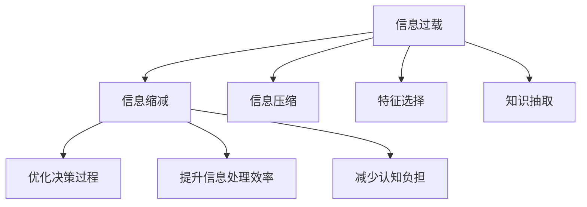

                 

# 信息简化的原则与艺术：在混乱中建立秩序与简化

## 1. 背景介绍

### 1.1 问题由来
在信息爆炸的时代，数据和知识的海量增长带来了前所未有的挑战。每天，我们被大量信息包围，面临着信息过载、噪音干扰、冗余信息等多重困扰。如何在复杂多变的环境中提取有用信息，保持清晰的思考和决策，成为每个人都需要面对的问题。

### 1.2 问题核心关键点
信息简化（Information Simplification）的核心在于通过去繁就简，提取出关键信息，去除冗余和噪音，帮助人们更好地理解和处理信息。信息简化涉及多个层面，包括数据预处理、特征选择、模型压缩等，其核心目标是降低信息复杂度，提升信息的可用性。

### 1.3 问题研究意义
信息简化技术对于提升信息处理效率、优化决策过程、减少认知负担具有重要意义：

- **提升信息处理效率**：通过去除无关信息，减少信息过载，使得信息的处理更加高效。
- **优化决策过程**：简化的信息更易于理解，帮助决策者快速做出准确判断。
- **减少认知负担**：简化的信息更容易被记忆和理解，减轻决策者的心理压力。
- **促进知识共享**：简化的信息更易于传播和共享，提升组织内部的知识流动。

## 2. 核心概念与联系

### 2.1 核心概念概述

为更好地理解信息简化的原理和应用，本节将介绍几个关键概念：

- **信息过载（Information Overload）**：指信息量远超个人处理能力的现象，导致注意力分散、决策困难。
- **信息缩减（Information Reduction）**：通过去除不必要的信息，降低信息复杂度，提升信息处理效率。
- **信息压缩（Information Compression）**：使用数学和算法手段，将信息压缩到更小的空间。
- **特征选择（Feature Selection）**：从大量特征中挑选出对目标任务最有价值的特征。
- **知识抽取（Knowledge Extraction）**：从大规模数据中提取出有用的知识信息。

这些概念之间的逻辑关系可以通过以下Mermaid流程图来展示：



这个流程图展示了信息过载与信息简化技术之间的关系：

1. 信息过载通过信息缩减、信息压缩、特征选择和知识抽取等技术，转化为有用的信息。
2. 简化的信息可以优化决策过程，提升信息处理效率，减少认知负担，促进知识共享。

## 3. 核心算法原理 & 具体操作步骤
### 3.1 算法原理概述

信息简化的核心思想是通过算法和技术手段，对原始信息进行预处理和转换，提炼出关键信息，去除冗余和噪音，从而降低信息复杂度，提升信息可用性。

### 3.2 算法步骤详解

信息简化的主要步骤如下：

**Step 1: 数据预处理**
- 对原始数据进行清洗，去除缺失值、异常值等。
- 数据归一化、标准化，使得不同特征在相同的尺度上。

**Step 2: 特征选择**
- 使用统计方法（如卡方检验、互信息）选择与目标任务最相关的特征。
- 使用模型（如Lasso、Ridge、决策树）进行特征重要性评估。
- 根据特征重要性，删除或保留特征。

**Step 3: 信息压缩**
- 使用数据压缩算法（如Huffman编码、LZ77、LZ78等）对信息进行压缩。
- 使用深度学习模型（如Autoencoder、GAN等）学习数据压缩编码。

**Step 4: 知识抽取**
- 使用自然语言处理技术（如BERT、ELMo等）进行文本信息抽取。
- 使用信息检索技术（如TF-IDF、LSI等）检索相关信息。

**Step 5: 优化输出**
- 将压缩和抽取的信息转化为易于理解和使用的格式。
- 可视化关键信息，展示信息结构。

### 3.3 算法优缺点

信息简化技术具有以下优点：
1. 提升信息处理效率。通过去除冗余和噪音，使得信息更加精炼，处理效率显著提高。
2. 优化决策过程。简化的信息更易于理解和处理，帮助决策者快速做出准确判断。
3. 减少认知负担。简化的信息更容易记忆和理解，减轻决策者的心理压力。
4. 促进知识共享。简化的信息更易于传播和共享，提升组织内部的知识流动。

同时，信息简化技术也存在一定的局限性：
1. 依赖高质量数据。信息简化的效果很大程度上取决于数据的质量，获取高质量数据往往成本较高。
2. 模型复杂度。信息简化的过程通常涉及复杂的算法和技术，模型构建和调试难度较大。
3. 精度损失。在压缩和选择过程中，可能丢失部分关键信息，导致精度损失。

尽管存在这些局限性，但就目前而言，信息简化技术仍是大数据时代处理海量信息的重要手段。未来相关研究的重点在于如何进一步降低模型复杂度，提高模型泛化能力，同时兼顾精度和效率等因素。

### 3.4 算法应用领域

信息简化技术在各个领域都有着广泛的应用，例如：

- **金融分析**：通过信息简化，从海量交易数据中提取关键财务指标，辅助金融决策。
- **医学诊断**：从医学影像和病历数据中提取关键信息，辅助医生诊断。
- **智能推荐**：在用户行为数据中提取关键特征，提升推荐系统的个性化程度。
- **文本处理**：通过信息抽取和压缩技术，提升文本处理效率，支持搜索引擎、文本摘要等应用。
- **图像处理**：从大规模图像数据中提取关键信息，提升图像识别和分析能力。
- **语音识别**：通过信息压缩和特征选择，提升语音识别系统的鲁棒性和精度。

## 4. 数学模型和公式 & 详细讲解 & 举例说明

### 4.1 数学模型构建

本节将使用数学语言对信息简化的主要步骤进行更加严格的刻画。

假设原始信息集合为 $\mathcal{X}$，目标信息集合为 $\mathcal{Y}$，信息简化过程可以表示为：

$$
f: \mathcal{X} \rightarrow \mathcal{Y}
$$

其中 $f$ 为信息简化的映射函数，$\mathcal{X}$ 为原始信息集合，$\mathcal{Y}$ 为简化后的信息集合。

### 4.2 公式推导过程

以下我们以特征选择为例，推导使用卡方检验选择特征的公式。

假设原始数据为 $D=\{(x_i,y_i)\}_{i=1}^N$，其中 $x_i$ 为输入特征，$y_i$ 为输出标签。卡方检验的目标是计算特征 $x_j$ 与输出 $y_i$ 之间的统计显著性。

卡方检验的公式为：

$$
\chi^2 = \frac{(O_{ij}-E_{ij})^2}{E_{ij}}
$$

其中 $O_{ij}$ 为实际观测到的频数，$E_{ij}$ 为期望频数。通过计算卡方统计量 $\chi^2$，可以判断特征 $x_j$ 与输出 $y_i$ 之间的相关性。

在实际应用中，通常使用 $p$ 值和阈值 $\alpha$ 进行显著性判断，即如果 $p$ 值小于 $\alpha$，则认为特征 $x_j$ 与输出 $y_i$ 相关，保留该特征，否则删除该特征。

### 4.3 案例分析与讲解

**案例一：金融数据分析**

在金融数据分析中，信息简化可以通过特征选择和知识抽取实现。例如，对股票交易数据进行分析，可以提取关键财务指标（如市盈率、市净率等），辅助投资决策。

使用卡方检验对股票特征进行选择，选择与股票涨跌幅显著相关的特征，保留对预测效果有贡献的特征。然后，使用信息抽取技术，从新闻、公告等非结构化数据中提取关键信息，辅助预测股票价格变化。

**案例二：医学影像分析**

医学影像分析中，信息简化可以通过特征选择和知识抽取实现。例如，对X光影像进行分析，可以提取关键特征（如钙化点、肿块等），辅助医生诊断。

使用决策树对影像特征进行选择，选择与疾病诊断显著相关的特征，保留对疾病判断有贡献的特征。然后，使用信息抽取技术，从医学报告中提取关键信息，辅助医生制定治疗方案。

## 5. 项目实践：代码实例和详细解释说明
### 5.1 开发环境搭建

在进行信息简化项目实践前，我们需要准备好开发环境。以下是使用Python进行Scikit-learn开发的环境配置流程：

1. 安装Anaconda：从官网下载并安装Anaconda，用于创建独立的Python环境。

2. 创建并激活虚拟环境：
```bash
conda create -n sklearn-env python=3.8 
conda activate sklearn-env
```

3. 安装Scikit-learn：
```bash
conda install scikit-learn
```

4. 安装各类工具包：
```bash
pip install numpy pandas scikit-learn matplotlib tqdm jupyter notebook ipython
```

完成上述步骤后，即可在`sklearn-env`环境中开始信息简化的实践。

### 5.2 源代码详细实现

这里我们以特征选择为例，给出使用Scikit-learn进行卡方检验特征选择的Python代码实现。

```python
from sklearn.feature_selection import SelectKBest, chi2
from sklearn.datasets import load_breast_cancer
from sklearn.model_selection import train_test_split
from sklearn.linear_model import LogisticRegression

# 加载乳腺癌数据集
data = load_breast_cancer()
X = data.data
y = data.target

# 划分训练集和测试集
X_train, X_test, y_train, y_test = train_test_split(X, y, test_size=0.3, random_state=42)

# 使用卡方检验进行特征选择
selector = SelectKBest(chi2, k=10)
X_train_selected = selector.fit_transform(X_train, y_train)
X_test_selected = selector.transform(X_test)

# 训练逻辑回归模型
model = LogisticRegression()
model.fit(X_train_selected, y_train)
print(model.score(X_test_selected, y_test))
```

以上代码实现了对乳腺癌数据集的特征选择。首先加载数据集，然后将其划分为训练集和测试集。使用卡方检验选择前10个最重要的特征，并将其用于训练逻辑回归模型。最后，评估模型在测试集上的性能。

### 5.3 代码解读与分析

让我们再详细解读一下关键代码的实现细节：

**数据加载和划分**：
- `load_breast_cancer`函数加载乳腺癌数据集，`X`和`y`分别表示特征和标签。
- `train_test_split`函数将数据集划分为训练集和测试集。

**特征选择**：
- `SelectKBest`函数选择前`k`个最重要的特征。
- `chi2`函数计算卡方统计量，选择与标签显著相关的特征。
- `fit_transform`和`transform`方法分别用于训练和应用特征选择模型。

**模型训练和评估**：
- `LogisticRegression`模型用于训练逻辑回归模型。
- `fit`方法用于训练模型，`score`方法用于评估模型性能。

可以看到，使用Scikit-learn进行特征选择不仅代码简洁，而且功能强大。开发者可以根据具体任务选择不同的特征选择方法，如互信息、Lasso回归等。

## 6. 实际应用场景
### 6.1 智能推荐系统

信息简化技术在智能推荐系统中有着广泛应用。传统的推荐系统往往依赖于用户行为数据进行推荐，难以充分挖掘用户兴趣的多样性。通过信息简化，可以从文本数据中提取关键特征，提升推荐系统的个性化程度。

在实践中，可以收集用户阅读、点击、评论等行为数据，提取并分析文本内容。使用信息抽取技术，从用户评论中提取关键信息，如情感倾向、偏好领域等，辅助推荐系统生成个性化推荐结果。

### 6.2 医学诊断系统

信息简化技术在医学诊断中也有着重要应用。医疗数据通常包含大量冗余和噪音，使用信息简化技术可以提取出关键特征，辅助医生诊断。

在实践中，可以收集电子病历、医学影像等数据，使用特征选择方法，选择与疾病诊断显著相关的特征。然后，使用信息抽取技术，从医学报告中提取关键信息，辅助医生制定治疗方案。

### 6.3 智能客服系统

智能客服系统中，信息简化技术可以用于提升问答系统的效率和准确性。传统的客服系统往往需要大量人工干预，无法满足高并发和自然语言处理的需要。通过信息简化，可以从客户问题中提取出关键信息，辅助智能问答系统生成准确的答复。

在实践中，可以收集历史客服对话记录，使用特征选择方法，选择与问题解决显著相关的特征。然后，使用信息抽取技术，从客户问题中提取关键信息，辅助智能问答系统生成响应。

### 6.4 未来应用展望

随着信息简化技术的不断发展，其在各个领域的应用将更加广泛，为技术落地应用带来新的突破。

在智慧城市治理中，信息简化技术可以用于智能交通管理、环境监测、公共安全等领域，提高城市管理的自动化和智能化水平，构建更安全、高效的未来城市。

在智慧医疗领域，信息简化技术可以用于医学影像分析、疾病预测、个性化治疗等环节，辅助医生进行精准医疗，提升医疗服务的智能化水平。

在智慧教育领域，信息简化技术可以用于学习内容推荐、学习效果评估、知识图谱构建等环节，因材施教，促进教育公平，提高教学质量。

此外，在企业生产、社会治理、文娱传媒等众多领域，信息简化技术也将不断涌现，为传统行业数字化转型升级提供新的技术路径。

## 7. 工具和资源推荐
### 7.1 学习资源推荐

为了帮助开发者系统掌握信息简化的理论基础和实践技巧，这里推荐一些优质的学习资源：

1. **《数据科学与机器学习基础》**：由知名教授撰写，全面介绍了数据预处理、特征选择、信息压缩等基本概念和经典方法。

2. **《Python数据科学手册》**：详细介绍了使用Python进行数据处理、特征选择、模型训练等操作。

3. **《机器学习实战》**：提供了丰富的项目案例，涵盖信息简化技术的多个方面，适合实践学习。

4. **Kaggle平台**：提供在线数据集和竞赛，可以帮助开发者实践信息简化的应用，积累实战经验。

5. **Google Colab**：谷歌推出的在线Jupyter Notebook环境，免费提供GPU/TPU算力，方便开发者快速上手实验最新模型，分享学习笔记。

通过对这些资源的学习实践，相信你一定能够快速掌握信息简化的精髓，并用于解决实际的NLP问题。

### 7.2 开发工具推荐

高效的开发离不开优秀的工具支持。以下是几款用于信息简化开发的常用工具：

1. **Scikit-learn**：Python中强大的机器学习库，提供了丰富的特征选择、信息压缩等工具。

2. **TensorFlow**：由Google主导开发的深度学习框架，支持复杂的模型构建和优化。

3. **PyTorch**：基于Python的深度学习框架，支持动态计算图和高效模型训练。

4. **Weights & Biases**：模型训练的实验跟踪工具，可以记录和可视化模型训练过程中的各项指标，方便对比和调优。

5. **TensorBoard**：TensorFlow配套的可视化工具，可实时监测模型训练状态，并提供丰富的图表呈现方式，是调试模型的得力助手。

6. **H2O.ai**：开源机器学习平台，提供了可视化界面和API接口，方便开发者进行信息简化的项目开发。

合理利用这些工具，可以显著提升信息简化的开发效率，加快创新迭代的步伐。

### 7.3 相关论文推荐

信息简化技术的发展源于学界的持续研究。以下是几篇奠基性的相关论文，推荐阅读：

1. **《基于特征选择和深度学习的文本摘要技术》**：提出了使用深度学习模型进行文本摘要的方法，结合特征选择技术，提升了文本简化的效果。

2. **《信息检索与知识发现》**：详细介绍了信息检索和知识抽取的基本概念和技术，适合深入理解信息简化的原理。

3. **《深度学习与信息压缩》**：介绍了深度学习在信息压缩中的应用，包括Autoencoder、GAN等模型，适合实践学习。

4. **《知识抽取与语义分析》**：介绍了知识抽取和语义分析的基本技术，适合理解信息简化的语义层面的应用。

5. **《基于图神经网络的信息抽取》**：介绍了图神经网络在信息抽取中的应用，适合了解最新的信息抽取技术。

这些论文代表了大语言模型微调技术的发展脉络。通过学习这些前沿成果，可以帮助研究者把握学科前进方向，激发更多的创新灵感。

## 8. 总结：未来发展趋势与挑战

### 8.1 总结

本文对信息简化的主要步骤进行了全面系统的介绍。首先阐述了信息过载与信息简化技术的研究背景和意义，明确了信息简化的目标和应用场景。其次，从原理到实践，详细讲解了信息简化的数学原理和关键步骤，给出了信息简化的完整代码实例。同时，本文还广泛探讨了信息简化的技术在各个领域的应用前景，展示了信息简化的广泛应用。

通过本文的系统梳理，可以看到，信息简化技术正在成为大数据时代处理海量信息的重要手段。未来信息简化技术的发展，必将进一步提升信息处理效率、优化决策过程、减少认知负担，促进知识共享。

### 8.2 未来发展趋势

展望未来，信息简化技术将呈现以下几个发展趋势：

1. **自动化水平提升**：自动化特征选择和信息压缩技术将进一步发展，使信息简化过程更加高效和便捷。

2. **多模态融合**：信息简化的应用将扩展到更多模态数据，如图像、语音、视频等，实现跨模态信息的整合和简化。

3. **实时处理能力增强**：信息简化的算法和技术将进一步优化，支持实时数据处理和分析，提升信息处理的响应速度。

4. **深度学习融合**：深度学习模型将被更广泛地应用在信息简化中，提高信息的压缩和提取精度。

5. **知识图谱的引入**：知识图谱技术将与信息简化结合，实现知识的关联和推理，提升信息简化的智能化水平。

以上趋势凸显了信息简化技术的广阔前景。这些方向的探索发展，必将进一步提升信息处理的效率和准确性，为各个领域的信息应用带来新的突破。

### 8.3 面临的挑战

尽管信息简化技术已经取得了瞩目成就，但在迈向更加智能化、普适化应用的过程中，它仍面临着诸多挑战：

1. **数据质量瓶颈**：信息简化的效果很大程度上取决于数据的质量，获取高质量数据往往成本较高。如何进一步降低数据质量对信息简化的影响，将是一大难题。

2. **模型复杂度**：信息简化的过程通常涉及复杂的算法和技术，模型构建和调试难度较大。如何降低模型复杂度，提高模型泛化能力，还需要更多理论和实践的积累。

3. **精度损失**：在压缩和选择过程中，可能丢失部分关键信息，导致精度损失。如何在保证精度的前提下，实现信息的压缩和选择，还需要进一步研究。

4. **鲁棒性不足**：信息简化的过程可能受到数据分布变化的影响，导致模型性能下降。如何提高模型的鲁棒性，避免灾难性遗忘，还需要更多研究。

5. **计算资源需求高**：信息简化的过程需要大量计算资源，如何优化算法，降低计算成本，还需要进一步研究。

6. **隐私和安全问题**：信息简化的过程中可能涉及到敏感信息，如何保护隐私和安全，还需要更多技术和法律保障。

这些挑战凸显了信息简化技术的发展潜力，同时也表明了信息简化的研究方向和重点。

### 8.4 研究展望

面对信息简化技术所面临的挑战，未来的研究需要在以下几个方面寻求新的突破：

1. **自动化特征选择**：开发更加自动化的特征选择方法，减少手动干预，提高信息简化的效率。

2. **深度学习融合**：引入深度学习模型，提高信息的压缩和提取精度，提升信息简化的智能化水平。

3. **多模态融合**：研究跨模态的信息简化技术，实现图像、语音、视频等多模态信息的整合和简化。

4. **鲁棒性提升**：研究鲁棒性强的信息简化算法，提高模型对数据分布变化的适应能力。

5. **知识图谱结合**：将知识图谱技术引入信息简化，实现知识的关联和推理，提升信息简化的智能化水平。

6. **隐私和安全保障**：研究信息简化的隐私和安全技术，保护敏感信息，确保信息简化的安全性。

这些研究方向的探索，必将引领信息简化技术迈向更高的台阶，为各个领域的信息应用带来新的突破。面向未来，信息简化技术还需要与其他人工智能技术进行更深入的融合，共同推动信息处理的进步。

## 9. 附录：常见问题与解答

**Q1：信息简化的目标是什么？**

A: 信息简化的目标是通过去除冗余和噪音，提取出关键信息，使得信息更加精炼和易于理解，从而提升信息处理效率、优化决策过程、减少认知负担，促进知识共享。

**Q2：信息简化有哪些常用方法？**

A: 信息简化的常用方法包括数据预处理、特征选择、信息压缩、知识抽取等。数据预处理包括清洗和归一化；特征选择包括卡方检验、互信息、Lasso回归等；信息压缩包括Huffman编码、LZ77、LZ78等；知识抽取包括BERT、ELMo等自然语言处理技术。

**Q3：如何评估信息简化的效果？**

A: 信息简化的效果评估可以从多个方面进行，包括信息处理效率、决策准确性、认知负担等。使用信息检索技术（如TF-IDF、LSI等）评估信息的相关性和覆盖度；使用可视化工具（如WordCloud、Umap等）展示信息的结构和分布；使用机器学习模型（如Logistic Regression、SVM等）评估信息简化的预测性能。

**Q4：信息简化在各个领域有哪些应用？**

A: 信息简化在各个领域都有着广泛的应用，例如金融分析、医学诊断、智能推荐、文本处理、图像处理、语音识别等。金融分析中，从海量交易数据中提取关键财务指标；医学诊断中，从医学影像和病历数据中提取关键特征；智能推荐中，从用户行为数据中提取关键特征；文本处理中，从大规模文本数据中提取关键信息；图像处理中，从大规模图像数据中提取关键特征；语音识别中，从语音数据中提取关键特征。

通过本文的系统梳理，可以看到，信息简化技术正在成为大数据时代处理海量信息的重要手段。未来信息简化技术的发展，必将进一步提升信息处理效率、优化决策过程、减少认知负担，促进知识共享。

---

作者：禅与计算机程序设计艺术 / Zen and the Art of Computer Programming

