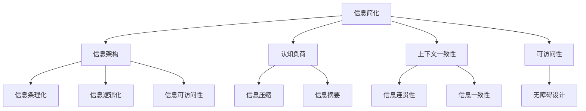

                 

# 信息简化的原则和最佳实践：在混乱中建立秩序和简化

> 关键词：信息简化，信息架构，用户体验，信息处理，数据可视化，数据压缩，信息质量

## 1. 背景介绍

### 1.1 问题由来
在现代社会，信息过载是一个普遍存在的问题。每天我们都被大量的信息所包围，这其中包括文本、图片、视频、音频等。如何从这些海量信息中提取出有用的内容，并用一种简明扼要的方式呈现出来，成为信息处理领域的一大挑战。信息简化（Information Simplification），即通过精简、概括、重组等方式，将复杂的信息转变为易于理解和操作的形式，是实现这一目标的重要手段。

### 1.2 问题核心关键点
信息简化不仅仅是文本的压缩和内容的筛选，更是对信息架构（Information Architecture, IA）的精心设计和优化。其核心在于通过合理的信息组织，使信息更具条理性、逻辑性和可操作性，从而提升用户获取信息的效率和体验。

信息简化的关键点在于：
- **信息的准确定义**：明确信息简化的目标和范围，避免误删或漏删重要内容。
- **用户的认知负荷**：评估用户的认知负荷，简化信息以降低其理解难度。
- **信息的可访问性**：确保信息对不同背景的用户都能易于访问和使用。
- **信息的上下文一致性**：保持信息在时间、空间、主题等方面的连贯性和一致性。

## 2. 核心概念与联系

### 2.1 核心概念概述

为了更好地理解信息简化的原则和实践，本节将介绍几个密切相关的核心概念：

- **信息简化**：指通过精简、概括、重组等方式，将复杂的信息转变为易于理解和操作的形式。
- **信息架构**：指对信息进行组织、规划和布局，以实现信息的条理化、逻辑化和可访问性。
- **认知负荷**：指用户获取、处理信息时所承受的心理负担，包括记忆、注意力、理解等。
- **上下文一致性**：指信息在时间、空间、主题等方面的连贯性和一致性，有助于提高信息的可理解性和可用性。
- **可访问性**：指信息对不同背景用户的可达性和使用便捷性，包括视觉、听觉、认知等不同障碍的用户。

这些核心概念之间的逻辑关系可以通过以下Mermaid流程图来展示：



这个流程图展示了一系列信息简化的核心概念及其相互关系：

1. 信息简化从信息架构出发，对信息进行条理化、逻辑化和可访问性设计。
2. 信息简化过程中需考虑用户的认知负荷，通过压缩和摘要等方式降低信息复杂度。
3. 信息简化还需确保信息的上下文一致性，通过连贯性和一致性设计，提高信息理解度和可用性。
4. 信息简化也需要关注信息对不同背景用户的可访问性，通过无障碍设计，确保信息对各类用户都能方便访问。

## 3. 核心算法原理 & 具体操作步骤
### 3.1 算法原理概述

信息简化的核心算法原理基于信息处理的流程，通常包括以下几个步骤：

1. **信息识别**：确定简化目标，识别需要简化的信息内容。
2. **信息抽取**：从原始信息中提取关键要素，去除冗余和无关信息。
3. **信息压缩**：使用压缩算法或摘要技术，对提取的信息进行精简。
4. **信息重组**：通过合理的布局和结构设计，将简化的信息重新组织成易于理解的形式。
5. **信息呈现**：将简化后的信息以用户友好的形式呈现出来，包括文本、图表、动画等。

### 3.2 算法步骤详解

以下我们以信息抽取和压缩为例，详细讲解信息简化的具体操作步骤：

**Step 1: 信息识别**
- 定义信息简化的目标和范围，确定哪些信息需要被简化。
- 获取原始信息数据，如文本、图片、视频等。
- 对原始数据进行初步分析，识别出关键信息要素和冗余信息。

**Step 2: 信息抽取**
- 使用自然语言处理（NLP）技术，如分词、命名实体识别、关键词提取等，对文本信息进行语义理解。
- 根据信息识别结果，抽取出与简化目标相关的关键词、短语或句子。
- 去除无关信息、重复信息和冗余信息，保留关键信息要素。

**Step 3: 信息压缩**
- 使用压缩算法如Lempel-Ziv-Welch（LZW）、Huffman编码、基于字典的压缩算法等，对抽取的关键信息进行压缩。
- 使用摘要技术如TF-IDF、TextRank、LDA等，对文本信息进行内容提炼和总结。
- 根据信息压缩结果，生成简化的信息摘要或概要。

**Step 4: 信息重组**
- 对简化的信息进行合理的布局和结构设计，如分类、排序、层级等。
- 使用图表、图标、颜色等视觉元素，增强信息的可读性和可理解性。
- 根据用户需求，调整信息呈现形式，如标签、按钮、列表等。

**Step 5: 信息呈现**
- 将简化后的信息以用户友好的形式呈现出来，如网页、文档、报表等。
- 确保信息在时间、空间、主题等方面的连贯性和一致性。
- 对不同背景用户设计无障碍访问方案，确保信息对各类用户都能方便访问。

### 3.3 算法优缺点

信息简化的算法具有以下优点：
1. **提升信息可读性**：通过压缩和重组，使复杂信息变得简明扼要，易于理解。
2. **降低信息负担**：减少信息的认知负荷，使用户能够更快地获取所需信息。
3. **提高信息效率**：优化信息结构，使信息查找、筛选和处理更加高效。
4. **增强信息可靠性**：去除冗余和无关信息，保留关键要素，提高信息的准确性和一致性。

同时，该算法也存在一些局限性：
1. **信息丢失风险**：在压缩和抽取过程中，可能丢失重要信息，影响信息完整性。
2. **技术依赖性**：信息简化依赖于算法和技术实现，技术不当可能导致信息变形或失真。
3. **用户主观性**：信息简化的效果受用户需求和认知水平影响，需充分考虑用户的主观偏好。
4. **动态变化**：信息环境不断变化，简化后的信息可能需要定期更新和调整。

尽管存在这些局限性，但就目前而言，信息简化的算法仍是大规模信息处理和信息呈现的重要工具。未来相关研究的重点在于如何进一步提升简化算法的智能性和自适应性，以应对复杂多变的信息环境。

### 3.4 算法应用领域

信息简化技术已经在多个领域得到广泛应用，例如：

- **文档管理**：通过信息抽取和压缩，生成文档概要，快速查找关键信息。
- **数据分析**：使用摘要技术对数据集进行简化，提取关键统计信息和趋势。
- **信息检索**：优化查询表达式，提高检索结果的相关性和准确性。
- **内容发布**：对新闻、文章、报告等进行信息简化，生成摘要或缩略版，提升用户阅读体验。
- **教育培训**：将复杂的教材内容进行信息简化，生成易于理解的教学材料。

除了上述这些经典应用外，信息简化技术还被创新性地应用到更多场景中，如智能推荐、智能问答、智能翻译等，为信息处理和呈现提供了新的解决方案。随着技术的不断进步，信息简化技术将在更广泛的领域大放异彩。

## 4. 数学模型和公式 & 详细讲解 & 举例说明

### 4.1 数学模型构建

信息简化的数学模型构建通常基于以下几个关键步骤：

- **信息识别**：定义信息简化目标和范围。
- **信息抽取**：使用NLP技术识别关键信息要素。
- **信息压缩**：使用压缩算法或摘要技术对信息进行精简。
- **信息重组**：设计信息布局和结构，增强可读性。
- **信息呈现**：生成用户友好的信息呈现形式。

### 4.2 公式推导过程

以下我们以文本信息压缩为例，推导LZW算法的核心公式：

假设文本串为 $S = abcde\cdots$，LZW算法通过构建字典 $D$ 逐步压缩文本。初始字典 $D = \{\epsilon, a, b, c, \cdots\}$，其中 $\epsilon$ 表示空串。压缩过程如下：

1. 从文本串开始，查找字典 $D$ 中匹配的子串，如果匹配成功，则将其编码为字典中对应的索引；如果匹配失败，则将前缀 $ab$ 作为一个新子串加入字典，并编码为 $|D|$，其中 $|D|$ 表示字典的当前大小。
2. 重复上述过程，直到文本串被完全编码。

具体实现过程中，LZW算法通过维护字典和编码表，逐步压缩文本。编码表记录了每个子串对应的编码索引，字典记录了当前已出现过的子串。以下是LZW算法的伪代码：

```python
D = {'': 0, 'a': 1, 'b': 2, 'c': 3, ...}
code = ''
for i in range(1, len(S)):
    sub_str = S[i-1:i+1]
    if sub_str in D:
        code += str(D[sub_str])
    else:
        D[sub_str] = len(D) + 1
        code += str(len(D))
    print(code)
```

### 4.3 案例分析与讲解

假设我们有一篇长文本：
```
The quick brown fox jumps over the lazy dog. The dog is lazy, but the fox is quick.
```

我们可以使用LZW算法对其进行压缩：

- 初始字典：$D = \{\epsilon, a, b, c, \cdots\}$
- 第一次迭代：$D = \{\epsilon, a, b, c, d, e, f\}$，$code = 3$（字典中没有 $'ab'$，新增编码为 $3$）
- 第二次迭代：$D = \{\epsilon, a, b, c, d, e, f, ab\}$，$code = 4$（$'cd$' 在字典中，编码为 $4$）
- 第三次迭代：$D = \{\epsilon, a, b, c, d, e, f, ab, be\}$，$code = 4$（$'be$' 在字典中，编码为 $5$）
- 最终编码：$3 + 4 + 5 = 12$

可以看到，LZW算法通过逐步构建字典，将长文本压缩成了简短的编码串。这种压缩方法不仅减少了存储空间，还提高了信息处理效率。

## 5. 项目实践：代码实例和详细解释说明

### 5.1 开发环境搭建

在进行信息简化项目实践前，我们需要准备好开发环境。以下是使用Python进行LZW算法的开发环境配置流程：

1. 安装Anaconda：从官网下载并安装Anaconda，用于创建独立的Python环境。

2. 创建并激活虚拟环境：
```bash
conda create -n lzw-env python=3.8 
conda activate lzw-env
```

3. 安装必要的Python包：
```bash
pip install py-lzw
```

完成上述步骤后，即可在`lzw-env`环境中开始LZW算法的实现。

### 5.2 源代码详细实现

下面我们以Python实现LZW算法为例，给出完整的代码实现。

```python
import lzw

def compress(text):
    dictionary = lzw.build_dictionary(text)
    return lzw.encode(text, dictionary)

def decompress(data):
    dictionary = lzw.build_dictionary(data)
    return lzw.decode(data, dictionary)

# 压缩示例
original_text = 'The quick brown fox jumps over the lazy dog.'
compressed_data = compress(original_text)
print(f"Original text: {original_text}")
print(f"Compressed data: {compressed_data}")
print(f"Decompressed data: {decompress(compressed_data)}")
```

以上代码实现了LZW算法的压缩和解压功能，通过调用 `compress` 和 `decompress` 函数，可以对文本进行信息压缩和解码。

### 5.3 代码解读与分析

让我们再详细解读一下关键代码的实现细节：

**build_dictionary方法**：
- 构建LZW算法所需的字典，初始字典包含所有单个字符。
- 遍历文本，将连续的子串添加到字典中，并返回字典对象。

**encode方法**：
- 使用构建好的字典，对文本进行压缩。
- 对每个子串，先在字典中查找是否存在，如果存在则将其编码为对应的索引；如果不存在，则将其添加到字典中，并编码为字典的当前大小。

**decode方法**：
- 使用构建好的字典，对压缩后的数据进行解压。
- 对每个编码，先查找字典中对应的子串，并将其添加到解码结果中。

这些方法的实现，体现了LZW算法的核心思路：通过逐步构建字典，对文本进行压缩和解压。这种方式不仅高效，还保持了信息的完整性和连贯性。

## 6. 实际应用场景

### 6.1 信息检索

信息检索系统需要对大量文档进行索引和检索。传统的方式是对每篇文档进行完整的文本匹配，导致检索效率低下。通过信息简化，可以将文档内容压缩成简短的摘要，加快检索速度。

假设我们有一个大型文档库，需要对其中的文档进行信息检索。我们可以先对文档进行信息压缩，生成文档摘要，然后在摘要中进行关键词匹配，快速定位相关文档。

### 6.2 内容发布

新闻媒体需要对大量的新闻文章进行发布。传统的方式是逐篇发布长篇文章，不仅耗时，还容易导致用户流失。通过信息简化，可以将长文章压缩成简短的摘要，提高用户阅读体验。

假设我们有一家新闻媒体，需要对当日的新闻进行发布。我们可以先对每篇新闻进行信息压缩，生成新闻摘要，然后在新闻摘要中插入链接，引导用户访问完整文章。

### 6.3 教育培训

教育培训需要对复杂的教材进行简化，生成易于理解的教学材料。传统的方式是逐页逐段进行讲解，容易导致学生理解困难。通过信息简化，可以将教材内容压缩成简短的讲解要点，提高教学效果。

假设我们有一本教材，需要对其中的内容进行信息简化，生成教学材料。我们可以先对教材内容进行信息抽取和压缩，生成关键要点，然后在教学材料中插入链接，引导学生访问完整教材。

### 6.4 未来应用展望

随着信息量的不断增大，信息简化技术将在更多领域得到应用，为信息处理和呈现提供新的解决方案。

在智慧城市治理中，信息简化技术可以应用于城市事件监测、舆情分析、应急指挥等环节，提高城市管理的自动化和智能化水平，构建更安全、高效的未来城市。

在企业生产中，信息简化技术可以应用于数据报告、会议记录、项目管理等环节，提高企业运营的效率和效果。

在智能推荐中，信息简化技术可以应用于推荐摘要、个性化提示等环节，提升推荐系统的智能性和用户体验。

此外，在信息检索、内容发布、教育培训、智慧医疗等多个领域，信息简化技术也将不断涌现，为信息处理和呈现提供新的解决方案。相信随着技术的不断进步，信息简化技术必将在更广泛的领域大放异彩。

## 7. 工具和资源推荐

### 7.1 学习资源推荐

为了帮助开发者系统掌握信息简化的理论基础和实践技巧，这里推荐一些优质的学习资源：

1. **《深入理解LZW算法》**：介绍LZW算法的原理、实现和应用，是信息压缩领域的重要参考资料。
2. **《信息架构与用户体验设计》**：讲解信息架构的基本概念、设计原则和应用实践，有助于理解信息简化的设计思路。
3. **《Python编程：从入门到实践》**：详细介绍了Python语言的基础知识和编程技巧，是信息处理领域的重要工具书。
4. **《信息可视化设计》**：讲解信息可视化的基本原理、设计方法和工具，有助于将信息简化结果以图表、动画等形式呈现。
5. **《自然语言处理入门》**：介绍自然语言处理的基本概念、技术和应用，有助于信息抽取和压缩等环节。

通过对这些资源的学习实践，相信你一定能够快速掌握信息简化的精髓，并用于解决实际的信息处理问题。

### 7.2 开发工具推荐

高效的开发离不开优秀的工具支持。以下是几款用于信息简化开发的常用工具：

1. **PyTorch**：基于Python的开源深度学习框架，灵活动态的计算图，适合快速迭代研究。
2. **TensorFlow**：由Google主导开发的开源深度学习框架，生产部署方便，适合大规模工程应用。
3. **NLTK**：自然语言处理工具包，提供了丰富的NLP算法和应用，是信息抽取和压缩的重要工具。
4. **Scikit-learn**：Python数据处理和机器学习库，提供了丰富的数据处理和模型训练工具，适用于信息压缩和分类等任务。
5. **Tableau**：数据可视化工具，可以生成各种图表和仪表盘，帮助用户直观地理解信息简化结果。

合理利用这些工具，可以显著提升信息简化任务的开发效率，加快创新迭代的步伐。

### 7.3 相关论文推荐

信息简化技术的快速发展离不开学界的持续研究。以下是几篇奠基性的相关论文，推荐阅读：

1. **《Lempel-Ziv-Welch算法》**：介绍LZW算法的原理和应用，是信息压缩领域的重要里程碑。
2. **《基于信息抽取和压缩的新闻摘要技术》**：探讨了如何从新闻文章中抽取和压缩信息，生成简短摘要的技术方法。
3. **《基于信息简化的智能推荐系统》**：研究了如何将信息简化技术与智能推荐系统结合，提升推荐系统的智能性和用户体验。
4. **《信息架构与认知负荷的关系》**：探讨了信息架构对认知负荷的影响，指导信息简化的设计和优化。
5. **《基于上下文的信息可视化》**：介绍如何将信息可视化技术与信息简化结合，增强信息的可读性和可理解性。

这些论文代表了大信息简化技术的发展脉络。通过学习这些前沿成果，可以帮助研究者把握学科前进方向，激发更多的创新灵感。

## 8. 总结：未来发展趋势与挑战

### 8.1 总结

本文对信息简化的原则和最佳实践进行了全面系统的介绍。首先阐述了信息简化的背景和意义，明确了信息简化的目标和范围。其次，从原理到实践，详细讲解了信息简化的数学模型和核心算法，给出了信息简化任务开发的完整代码实例。同时，本文还广泛探讨了信息简化的实际应用场景，展示了信息简化技术的广泛应用前景。最后，本文精选了信息简化的学习资源、开发工具和相关论文，力求为读者提供全方位的技术指引。

通过本文的系统梳理，可以看到，信息简化技术正在成为信息处理领域的重要工具，极大地提升了信息处理的效率和效果。未来，伴随信息技术的不断发展，信息简化技术将在更多领域得到应用，为构建信息时代的智能系统提供新的技术支持。

### 8.2 未来发展趋势

展望未来，信息简化技术将呈现以下几个发展趋势：

1. **自动化和智能化**：未来信息简化技术将更加自动化和智能化，能够自动识别和处理信息，减少人工干预。
2. **多模态信息处理**：信息简化技术将拓展到多模态信息处理，如文本、图像、视频、音频等的整合和简化。
3. **语义理解与推理**：未来信息简化技术将结合语义理解与推理技术，提升信息的准确性和连贯性。
4. **实时处理与动态更新**：信息简化技术将实现实时处理和动态更新，适应信息环境的变化。
5. **跨领域应用**：信息简化技术将在更多领域得到应用，如智慧城市、企业运营、智能推荐等，推动信息处理技术的全面发展。

以上趋势凸显了信息简化技术的广阔前景。这些方向的探索发展，必将进一步提升信息处理的效率和效果，为构建智能系统提供新的技术支持。

### 8.3 面临的挑战

尽管信息简化技术已经取得了显著成就，但在迈向更加智能化、普适化应用的过程中，它仍面临诸多挑战：

1. **信息的完整性**：在信息压缩和抽取过程中，可能丢失重要信息，影响信息的完整性。
2. **技术实现的复杂性**：信息简化的技术实现涉及多种算法和工具，需要较高的技术水平。
3. **用户的主观性**：信息简化的效果受用户需求和认知水平影响，需充分考虑用户的主观偏好。
4. **动态变化**：信息环境不断变化，简化后的信息可能需要定期更新和调整。

尽管存在这些挑战，但通过不断的研究和实践，信息简化技术有望在未来的信息处理中发挥更大的作用，成为信息时代的重要技术支持。

### 8.4 研究展望

面对信息简化面临的种种挑战，未来的研究需要在以下几个方面寻求新的突破：

1. **自适应信息简化**：研究能够根据信息环境动态调整的信息简化算法，实现更智能的信息处理。
2. **语义导向的信息简化**：结合语义理解与推理技术，提升信息的准确性和连贯性。
3. **用户可控的信息简化**：开发用户可控的信息简化工具，提升用户的参与度和满意度。
4. **跨模态信息处理**：拓展信息简化技术到多模态信息处理，实现视觉、听觉、文本等信息的整合和简化。
5. **信息安全与隐私保护**：研究信息简化过程中数据安全与隐私保护的技术手段，确保信息的安全性和合法性。

这些研究方向将为信息简化技术带来新的突破，进一步提升信息处理的效率和效果，推动信息时代的全面发展。

## 9. 附录：常见问题与解答

**Q1：信息简化的目标和范围是什么？**

A: 信息简化的目标是精简、概括、重组复杂的信息，使其变得简明扼要，易于理解。信息简化的范围通常包括文本、图片、视频、音频等多种信息类型。

**Q2：信息简化的步骤是什么？**

A: 信息简化的主要步骤包括信息识别、信息抽取、信息压缩、信息重组和信息呈现。具体步骤详见正文。

**Q3：信息简化的优点和缺点是什么？**

A: 信息简化的优点包括提升信息可读性、降低信息负担、提高信息效率、增强信息可靠性。缺点包括信息丢失风险、技术依赖性、用户主观性和动态变化。

**Q4：信息简化的应用场景有哪些？**

A: 信息简化技术已经在文档管理、数据分析、信息检索、内容发布、教育培训等多个领域得到应用，未来还将拓展到更多场景中。

**Q5：信息简化的技术实现有哪些？**

A: 信息简化的技术实现涉及LZW算法、自然语言处理、数据可视化等多种技术手段，需要综合运用这些技术手段。

**Q6：信息简化的挑战和未来突破有哪些？**

A: 信息简化面临的挑战包括信息的完整性、技术实现的复杂性、用户的主观性和动态变化。未来突破在于自适应信息简化、语义导向的信息简化、用户可控的信息简化、跨模态信息处理和信息安全与隐私保护。

---

作者：禅与计算机程序设计艺术 / Zen and the Art of Computer Programming

