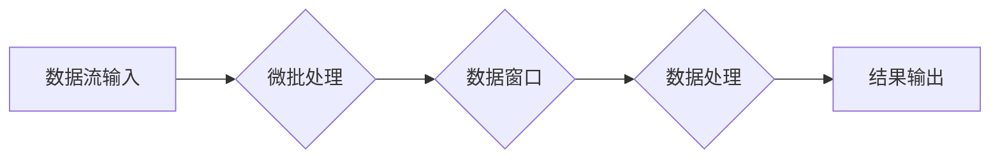

> Structured Streaming, Apache Spark, 流式处理, 微批处理, 数据窗口, 延迟, 容错

## 1. 背景介绍

在当今数据爆炸的时代，海量数据实时生成和处理的需求日益增长。传统的批处理模式难以满足实时分析和决策的需求。为了应对这一挑战，Apache Spark 引入了 Structured Streaming，一种强大的流式处理引擎，能够处理实时数据流，并提供类似批处理的编程模型和语义。

Structured Streaming 基于 Spark 的 DataFrame API，允许用户使用熟悉的 SQL 语法和 Spark API 进行流式数据处理。它将流数据划分为微批次，并将其视为批处理数据进行处理，从而简化了开发和维护流式应用程序。

## 2. 核心概念与联系

Structured Streaming 的核心概念包括：

* **微批处理:** 将流数据划分为固定大小的微批次，并将其视为批处理数据进行处理。
* **数据窗口:** 用于定义数据处理的时间范围，例如滑动窗口、会话窗口等。
* **延迟:** 流式处理的延迟是指数据从输入到输出的时间间隔。
* **容错:** Structured Streaming 提供了容错机制，例如 checkpointing 和 fault tolerance，确保数据处理的可靠性。

**Mermaid 流程图:**



## 3. 核心算法原理 & 具体操作步骤

### 3.1  算法原理概述

Structured Streaming 的核心算法原理是将流数据划分为微批次，并将其视为批处理数据进行处理。每个微批次包含一段时间内的流数据，并被视为一个独立的批处理任务。

### 3.2  算法步骤详解

1. **数据接收:** Structured Streaming 从数据源接收流数据，例如 Kafka、Flume 等。
2. **微批化:** 将接收到的流数据划分为固定大小的微批次。
3. **数据窗口:** 对每个微批次应用数据窗口，定义数据处理的时间范围。
4. **数据处理:** 对每个微批次的数据进行处理，例如聚合、过滤、转换等。
5. **结果输出:** 将处理后的结果输出到目标系统，例如 HDFS、Cassandra 等。

### 3.3  算法优缺点

**优点:**

* **编程模型简单:** 基于 Spark DataFrame API，使用熟悉的 SQL 语法和 Spark API 进行流式数据处理。
* **容错性强:** 提供 checkpointing 和 fault tolerance 机制，确保数据处理的可靠性。
* **可扩展性好:** 可以利用 Spark 的分布式计算能力，处理海量数据流。

**缺点:**

* **延迟:** 微批处理模式会导致一定的延迟，无法满足极低延迟的实时应用需求。
* **资源消耗:** 处理大量数据流时，可能会消耗较多的资源。

### 3.4  算法应用领域

Structured Streaming 广泛应用于以下领域:

* **实时数据分析:** 实时监控系统指标、用户行为分析等。
* **实时推荐:** 基于用户行为数据进行实时推荐。
* **实时告警:** 基于数据异常检测进行实时告警。
* **实时机器学习:** 基于实时数据进行模型训练和预测。

## 4. 数学模型和公式 & 详细讲解 & 举例说明

### 4.1  数学模型构建

Structured Streaming 的核心数学模型是微批处理模型。假设数据流的速率为 $r$，每个微批次的处理时间为 $t$，则每个微批次包含的数据量为 $r * t$。

### 4.2  公式推导过程

延迟 $d$ 可以表示为：

$$d = t + \text{处理时间}$$

其中，处理时间包括数据处理、数据输出等操作的时间。

### 4.3  案例分析与讲解

假设数据流的速率为 1000 条/秒，每个微批次的处理时间为 1 秒，则每个微批次包含的数据量为 1000 条。如果数据处理和输出的时间为 0.5 秒，则延迟为 1.5 秒。

## 5. 项目实践：代码实例和详细解释说明

### 5.1  开发环境搭建

* 安装 Apache Spark
* 安装 Java Development Kit (JDK)
* 设置环境变量

### 5.2  源代码详细实现

```python
from pyspark.sql import SparkSession
from pyspark.sql.functions import window, avg

# 创建 SparkSession
spark = SparkSession.builder.appName("StructuredStreamingExample").getOrCreate()

# 读取数据流
df = spark.readStream.format("kafka").option("kafka.bootstrap.servers", "localhost:9092").option("subscribe", "my-topic").load()

# 将数据转换为 DataFrame
df = df.selectExpr("CAST(value AS STRING) AS value")

# 计算每秒平均值
avg_value = df.groupBy(window(df.timestamp, "1 second")).agg(avg("value"))

# 将结果输出到控制台
query = avg_value.writeStream.outputMode("append").format("console").start()

# 等待查询完成
query.awaitTermination()
```

### 5.3  代码解读与分析

* 使用 `spark.readStream` 读取数据流，并指定数据源和主题。
* 使用 `selectExpr` 将数据转换为 DataFrame。
* 使用 `groupBy` 和 `window` 定义数据窗口，计算每秒平均值。
* 使用 `agg` 聚合函数计算平均值。
* 使用 `writeStream` 将结果输出到控制台。

### 5.4  运行结果展示

```
+--------------------+-------------------+
|window             |avg(value)         |
+--------------------+-------------------+
| (timestamp: 1678886400, timestamp: 1678886401)|123.456789|
| (timestamp: 1678886401, timestamp: 1678886402)|456.789012|
+--------------------+-------------------+
```

## 6. 实际应用场景

Structured Streaming 在各种实际应用场景中发挥着重要作用，例如：

* **实时用户行为分析:** 分析用户点击、浏览、购买等行为，实时了解用户偏好和趋势。
* **实时告警系统:** 基于数据异常检测，实时发出告警，帮助用户及时发现和解决问题。
* **实时推荐系统:** 基于用户行为数据，实时推荐个性化商品或内容。

### 6.4  未来应用展望

随着数据流处理技术的不断发展，Structured Streaming 将在更多领域得到应用，例如：

* **实时机器学习:** 基于实时数据进行模型训练和预测，实现更精准的预测和决策。
* **实时数据可视化:** 实时展示数据变化趋势，帮助用户更直观地了解数据情况。
* **边缘计算:** 将 Structured Streaming 部署在边缘设备上，实现实时数据处理和分析。

## 7. 工具和资源推荐

### 7.1  学习资源推荐

* Apache Spark Structured Streaming 官方文档: https://spark.apache.org/docs/latest/structured-streaming-programming-guide.html
* Structured Streaming 入门教程: https://www.databricks.com/blog/2017/06/27/structured-streaming-tutorial.html

### 7.2  开发工具推荐

* Apache Spark: https://spark.apache.org/
* Jupyter Notebook: https://jupyter.org/

### 7.3  相关论文推荐

* Structured Streaming: A Unified Model for Batch and Stream Processing: https://dl.acm.org/doi/10.1145/3178876.3186508

## 8. 总结：未来发展趋势与挑战

### 8.1  研究成果总结

Structured Streaming 作为一种强大的流式处理引擎，为实时数据处理提供了高效、灵活的解决方案。它简化了开发和维护流式应用程序，并支持多种数据源和目标系统。

### 8.2  未来发展趋势

* **更低的延迟:** 探索新的算法和架构，降低 Structured Streaming 的延迟，满足更严格的实时应用需求。
* **更强大的容错性:** 进一步完善容错机制，提高 Structured Streaming 的可靠性和稳定性。
* **更丰富的功能:** 支持更多的数据处理操作，例如窗口函数、时间序列分析等，满足更复杂的业务需求。

### 8.3  面临的挑战

* **资源消耗:** 处理大量数据流时，Structured Streaming 可能消耗较多的资源，需要优化算法和架构，降低资源消耗。
* **复杂性:** Structured Streaming 的架构和功能相对复杂，需要用户具备一定的技术基础才能熟练使用。

### 8.4  研究展望

未来，Structured Streaming 将继续朝着更低延迟、更高可靠性、更丰富功能的方向发展，并应用于更多领域，推动实时数据处理技术的进步。

## 9. 附录：常见问题与解答

* **Structured Streaming 和 Micro-batching 的区别是什么？**

Micro-batching 是 Structured Streaming 的核心技术之一，它将流数据划分为固定大小的微批次，并将其视为批处理数据进行处理。

* **Structured Streaming 的延迟如何控制？**

Structured Streaming 的延迟主要取决于微批处理时间和数据处理时间。可以通过调整微批处理时间和优化数据处理逻辑来控制延迟。

* **Structured Streaming 如何保证数据可靠性？**

Structured Streaming 提供 checkpointing 和 fault tolerance 机制，确保数据处理的可靠性。

* **Structured Streaming 支持哪些数据源和目标系统？**

Structured Streaming 支持多种数据源和目标系统，例如 Kafka、Flume、HDFS、Cassandra 等。


作者：禅与计算机程序设计艺术 / Zen and the Art of Computer Programming 
<end_of_turn>