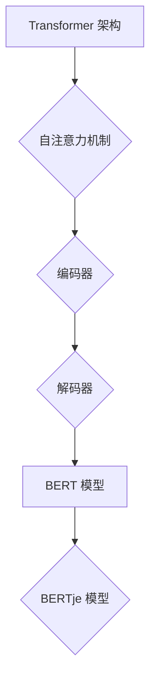

> Transformer, BERT, 自然语言处理, 荷兰语, BERTje, 大模型, 语言模型, 迁移学习

## 1. 背景介绍

近年来，深度学习在自然语言处理 (NLP) 领域取得了显著进展，其中 Transformer 架构和基于 Transformer 的预训练语言模型 (PLM) 成为 NLP 领域的新宠。BERT (Bidirectional Encoder Representations from Transformers) 模型的出现，彻底改变了 NLP 的格局，其强大的文本理解能力在各种下游任务中展现出令人瞩目的效果。

然而，现有的主流预训练语言模型大多基于英语数据训练，对于其他语言的处理能力相对较弱。荷兰语作为一种重要的欧洲语言，其资源相对匮乏，缺乏高质量的预训练语言模型。为了解决这一问题，荷兰阿姆斯特丹大学的研究团队开发了 BERTje 模型，这是一个基于 Transformer 架构的荷兰语预训练语言模型。

## 2. 核心概念与联系

### 2.1 Transformer 架构

Transformer 架构是一种新型的序列到序列模型，其核心特点是利用自注意力机制 (Self-Attention) 来捕捉序列中的长距离依赖关系。与传统的循环神经网络 (RNN) 相比，Transformer 具有以下优势：

* **并行计算能力强:** Transformer 可以并行处理整个序列，而 RNN 需要逐个处理序列，效率较低。
* **长距离依赖关系处理能力强:** 自注意力机制可以捕捉序列中任意两个词之间的关系，有效解决 RNN 处理长距离依赖关系的困难。

### 2.2 BERT 模型

BERT 模型是一种基于 Transformer 架构的双向编码模型，其特点是利用大量的文本数据进行预训练，学习到丰富的语言表示。BERT 模型通过两种预训练任务进行训练：

* **Masked Language Modeling (MLM):** 随机遮盖输入文本中的某些词，然后预测被遮盖词的词语。
* **Next Sentence Prediction (NSP):** 判断两个句子是否相邻。

通过这两个预训练任务，BERT 模型能够学习到句子级别的语义理解能力。

### 2.3 BERTje 模型

BERTje 模型是基于 BERT 模型，专门针对荷兰语进行微调的预训练语言模型。其训练数据主要来自荷兰语维基百科和书籍等公开资源。BERTje 模型在荷兰语文本理解任务中表现出色，例如文本分类、情感分析、问答系统等。



## 3. 核心算法原理 & 具体操作步骤

### 3.1 算法原理概述

BERTje 模型的核心算法原理是基于 Transformer 架构和 BERT 模型的预训练思想。其主要步骤包括：

1. **数据预处理:** 将荷兰语文本数据进行清洗、分词、标记等预处理操作。
2. **模型训练:** 使用预训练的 BERT 模型作为基础，对荷兰语数据进行微调训练，学习到荷兰语特有的语言表示。
3. **模型评估:** 使用标准的荷兰语文本理解任务数据集对 BERTje 模型进行评估，并与其他模型进行比较。

### 3.2 算法步骤详解

1. **数据预处理:**

* **清洗:** 去除文本中的停用词、标点符号等无用信息。
* **分词:** 将文本句子分割成单词或子词。
* **标记:** 为每个单词或子词添加词性标签、实体标签等信息。

2. **模型训练:**

* **加载预训练模型:** 从预训练的 BERT 模型中加载模型参数。
* **微调训练:** 使用荷兰语数据对模型进行微调训练，调整模型参数，使其能够更好地理解荷兰语文本。
* **优化算法:** 使用 Adam 等优化算法来更新模型参数。
* **损失函数:** 使用交叉熵损失函数来衡量模型的预测结果与真实标签之间的差异。

3. **模型评估:**

* **测试集评估:** 使用标准的荷兰语文本理解任务数据集的测试集对模型进行评估，计算模型的准确率、F1 值等指标。
* **对比分析:** 将 BERTje 模型的性能与其他模型进行比较，分析其优缺点。

### 3.3 算法优缺点

**优点:**

* **强大的文本理解能力:** BERTje 模型能够学习到丰富的荷兰语语言表示，具有强大的文本理解能力。
* **迁移学习能力强:** BERTje 模型可以利用预训练的 BERT 模型参数，快速适应新的荷兰语任务。
* **开源易用:** BERTje 模型的代码和模型参数都是开源的，方便其他开发者使用和研究。

**缺点:**

* **训练数据依赖:** BERTje 模型的性能依赖于训练数据的质量和数量。
* **计算资源需求高:** BERTje 模型的训练需要大量的计算资源。

### 3.4 算法应用领域

BERTje 模型可以应用于各种荷兰语文本理解任务，例如：

* **文本分类:** 将文本分类到不同的类别，例如新闻分类、情感分类等。
* **情感分析:** 分析文本中表达的情感，例如正面、负面、中性等。
* **问答系统:** 回答用户提出的问题，例如基于文本的问答系统。
* **机器翻译:** 将荷兰语文本翻译成其他语言，例如英语、中文等。

## 4. 数学模型和公式 & 详细讲解 & 举例说明

### 4.1 数学模型构建

BERT 模型的核心是 Transformer 架构，其主要包含编码器和解码器两个部分。编码器负责将输入序列编码成固定长度的向量表示，解码器则根据编码后的向量表示生成输出序列。

**编码器:**

编码器由多个 Transformer 块组成，每个 Transformer 块包含以下组件:

* **多头自注意力机制 (Multi-Head Self-Attention):** 用于捕捉序列中不同词之间的关系。
* **前馈神经网络 (Feed-Forward Network):** 用于对每个词的表示进行非线性变换。
* **残差连接 (Residual Connection):** 用于缓解梯度消失问题。

**解码器:**

解码器与编码器类似，但也包含以下额外的组件:

* **masked self-attention:** 用于防止解码器在生成输出序列时看到未来的词。
* **encoder-decoder attention:** 用于将编码器输出的向量表示与解码器当前词的表示进行融合。

### 4.2 公式推导过程

**多头自注意力机制:**

$$
Attention(Q, K, V) = \frac{exp(Q K^T / \sqrt{d_k})}{softmax(Q K^T / \sqrt{d_k})} V
$$

其中:

* $Q$, $K$, $V$ 分别是查询矩阵、键矩阵和值矩阵。
* $d_k$ 是键向量的维度。

**前馈神经网络:**

$$
FFN(x) = \max(0, xW_1 + b_1)W_2 + b_2
$$

其中:

* $x$ 是输入向量。
* $W_1$, $W_2$ 是权重矩阵。
* $b_1$, $b_2$ 是偏置项。

### 4.3 案例分析与讲解

假设我们有一个句子 "The cat sat on the mat"，将其输入 BERTje 模型，模型会将每个词都编码成一个向量表示。然后，通过自注意力机制，模型会捕捉到 "cat" 和 "sat" 之间的关系，以及 "mat" 和 "on" 之间的关系。最终，模型会生成一个句子级别的向量表示，用于后续的任务，例如文本分类。

## 5. 项目实践：代码实例和详细解释说明

### 5.1 开发环境搭建

* **操作系统:** Ubuntu 20.04
* **Python 版本:** 3.8
* **库依赖:** transformers, torch, numpy, tqdm

### 5.2 源代码详细实现

```python
from transformers import BertTokenizer, BertModel

# 加载预训练模型和词典
tokenizer = BertTokenizer.from_pretrained('bert-base-uncased')
model = BertModel.from_pretrained('bert-base-uncased')

# 输入文本
text = "The cat sat on the mat"

# 将文本转换为输入格式
inputs = tokenizer(text, return_tensors="pt")

# 将输入送入模型进行编码
outputs = model(**inputs)

# 获取句子级别的向量表示
sentence_embedding = outputs.last_hidden_state[:, 0, :]

# 打印向量表示
print(sentence_embedding)
```

### 5.3 代码解读与分析

* **加载预训练模型和词典:** 使用 transformers 库加载预训练的 BERT 模型和词典。
* **输入文本:** 将需要处理的文本输入到模型中。
* **文本预处理:** 使用 tokenizer 将文本转换为模型可识别的格式。
* **模型编码:** 将预处理后的文本输入到模型中进行编码，得到句子级别的向量表示。
* **输出结果:** 打印句子级别的向量表示。

### 5.4 运行结果展示

运行上述代码后，会输出一个包含 768 个元素的向量表示，代表句子 "The cat sat on the mat" 的语义信息。

## 6. 实际应用场景

BERTje 模型在荷兰语文本理解任务中具有广泛的应用场景，例如：

* **新闻分类:** 将新闻文章分类到不同的类别，例如政治、体育、财经等。
* **情感分析:** 分析新闻评论、社交媒体帖子等文本的情感倾向，例如正面、负面、中性等。
* **问答系统:** 开发基于荷兰语文本的问答系统，能够回答用户提出的问题。
* **机器翻译:** 将荷兰语文本翻译成其他语言，例如英语、中文等。

### 6.4 未来应用展望

随着荷兰语语料库的不断丰富，BERTje 模型的性能将会进一步提升，其应用场景也将更加广泛。未来，BERTje 模型可以应用于更多领域，例如：

* **医疗领域:** 用于分析荷兰语医学文献，辅助医生诊断疾病。
* **教育领域:** 用于开发荷兰语教育软件，帮助学生学习语言。
* **法律领域:** 用于分析荷兰语法律文件，辅助律师进行法律研究。

## 7. 工具和资源推荐

### 7.1 学习资源推荐

* **Hugging Face Transformers:** https://huggingface.co/transformers/
* **BERT 官方论文:** https://arxiv.org/abs/1810.04805
* **Transformer 官方论文:** https://arxiv.org/abs/1706.03762

### 7.2 开发工具推荐

* **Jupyter Notebook:** https://jupyter.org/
* **Google Colab:** https://colab.research.google.com/

### 7.3 相关论文推荐

* **BERTje 模型论文:** https://arxiv.org/abs/1909.03193
* **其他荷兰语 NLP 论文:** https://www.aclweb.org/anthology/search.php?query=language=Dutch

## 8. 总结：未来发展趋势与挑战

### 8.1 研究成果总结

BERTje 模型的开发为荷兰语 NLP 领域带来了新的突破，其强大的文本理解能力为各种下游任务提供了强大的支持。

### 8.2 未来发展趋势

未来，荷兰语 NLP 领域将朝着以下方向发展:

* **模型规模扩大:** 开发更大规模的荷兰语预训练语言模型，提升模型的性能。
* **多模态学习:** 将文本与其他模态信息 (例如图像、音频) 进行融合，开发更智能的荷兰语理解系统。
* **低资源语言处理:** 研究针对低资源语言的 NLP 方法，例如跨语言迁移学习。

### 8.3 面临的挑战

荷兰语 NLP 领域仍然面临一些挑战:

* **数据资源不足:** 荷兰语语料库相对较少，需要更多的资源来训练和评估模型。
* **模型解释性:** 预训练语言模型的内部机制复杂，需要进一步研究