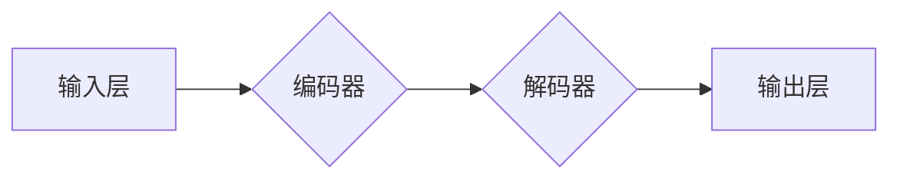

> Transformer, 大模型, 跨类型特征, 通用性, 自然语言处理, 图像识别, 多模态学习

## 1. 背景介绍

近年来，深度学习技术取得了飞速发展，其中Transformer模型凭借其强大的序列建模能力和参数共享特性，在自然语言处理（NLP）领域取得了突破性的进展，例如BERT、GPT-3等模型在文本理解、生成、翻译等任务上展现出令人惊叹的性能。然而，传统的Transformer模型主要针对文本数据进行训练，对于跨类型特征的融合和处理能力有限。

随着多模态学习的兴起，如何将不同类型的数据（如文本、图像、音频等）融合起来，构建更强大的通用模型，成为一个重要的研究方向。跨类型特征的通用性是指模型能够有效地处理不同类型的数据，并从中提取有意义的特征，从而实现跨领域、跨任务的应用。

## 2. 核心概念与联系

Transformer模型的核心概念是**自注意力机制（Self-Attention）**，它能够捕捉序列中不同元素之间的依赖关系，并赋予每个元素不同的权重，从而更好地理解上下文信息。

**Transformer模型架构**



**编码器**由多个**Transformer块**组成，每个块包含**多头自注意力层**、**前馈神经网络**和**残差连接**。**解码器**也由多个Transformer块组成，但它还包含**掩码机制**，防止解码器在生成序列时访问未来的信息。

**跨类型特征融合**

跨类型特征融合可以采用多种方法，例如：

* **特征拼接（Feature Concatenation）**：将不同类型特征直接拼接在一起，作为模型的输入。
* **特征融合网络（Feature Fusion Network）**：使用专门设计的网络结构，将不同类型特征融合在一起。
* **多模态Transformer（Multimodal Transformer）**：将Transformer模型扩展到多模态数据，例如Vision Transformer（ViT）将图像数据转化为序列，并使用Transformer模型进行处理。

## 3. 核心算法原理 & 具体操作步骤

### 3.1  算法原理概述

Transformer模型的核心算法是**自注意力机制**，它通过计算每个词与所有其他词之间的相关性，来捕捉序列中的依赖关系。

**自注意力机制计算公式**

$$
Attention(Q, K, V) = softmax(\frac{QK^T}{\sqrt{d_k}})V
$$

其中：

* $Q$：查询矩阵
* $K$：键矩阵
* $V$：值矩阵
* $d_k$：键向量的维度

**具体操作步骤**

1. 将输入序列转换为词嵌入向量。
2. 使用多头自注意力层计算每个词与所有其他词之间的相关性。
3. 将多头自注意力层的输出进行拼接和线性变换，得到编码后的序列。
4. 使用解码器进行序列生成。

### 3.2  算法步骤详解

1. **词嵌入**: 将输入序列中的每个词转换为一个低维向量，称为词嵌入向量。
2. **多头自注意力**: 对每个词的词嵌入向量进行多头自注意力计算，得到每个词与所有其他词之间的相关性分数。
3. **前馈神经网络**: 对每个词的注意力输出进行前馈神经网络处理，得到更丰富的特征表示。
4. **残差连接**: 将前馈神经网络的输出与输入进行残差连接，防止梯度消失问题。
5. **池化**: 对编码器输出进行池化操作，得到句子级别的特征表示。
6. **解码器**: 使用解码器对句子级别的特征表示进行解码，生成目标序列。

### 3.3  算法优缺点

**优点**:

* 能够捕捉序列中的长距离依赖关系。
* 参数共享特性，能够有效地利用数据。
* 训练速度快，收敛性好。

**缺点**:

* 计算量大，需要大量的计算资源。
* 训练数据量大，对数据质量要求高。

### 3.4  算法应用领域

Transformer模型在NLP领域有广泛的应用，例如：

* 文本分类
* 文本生成
* 机器翻译
* 问答系统
* 语音识别

## 4. 数学模型和公式 & 详细讲解 & 举例说明

### 4.1  数学模型构建

Transformer模型的数学模型可以概括为以下几个部分：

* **词嵌入层**: 将每个词转换为一个低维向量。
* **编码器**: 使用多头自注意力层和前馈神经网络对输入序列进行编码。
* **解码器**: 使用多头自注意力层、前馈神经网络和掩码机制对编码后的序列进行解码。

### 4.2  公式推导过程

**自注意力机制的计算公式**

$$
Attention(Q, K, V) = softmax(\frac{QK^T}{\sqrt{d_k}})V
$$

其中：

* $Q$：查询矩阵
* $K$：键矩阵
* $V$：值矩阵
* $d_k$：键向量的维度

**softmax函数**

$$
softmax(x_i) = \frac{e^{x_i}}{\sum_{j=1}^{n} e^{x_j}}
$$

### 4.3  案例分析与讲解

**举例说明**:

假设我们有一个句子“Transformer模型很强大”，将其转换为词嵌入向量后，每个词的词嵌入向量分别为：

* Transformer：[0.1, 0.2, 0.3, ...]
* 模型：[0.4, 0.5, 0.6, ...]
* 很：[0.7, 0.8, 0.9, ...]
* 强大：[1.0, 1.1, 1.2, ...]

使用自注意力机制计算每个词与所有其他词之间的相关性分数，可以得到一个注意力矩阵，例如：

```
[0.2, 0.3, 0.1, 0.4]
[0.1, 0.2, 0.3, 0.4]
[0.3, 0.1, 0.2, 0.4]
[0.4, 0.3, 0.2, 0.1]
```

注意力矩阵中的每个元素代表了两个词之间的相关性分数，例如，注意力矩阵中的第一个元素代表了“Transformer”与“模型”之间的相关性分数。

## 5. 项目实践：代码实例和详细解释说明

### 5.1  开发环境搭建

* Python 3.7+
* PyTorch 1.7+
* CUDA 10.2+

### 5.2  源代码详细实现

```python
import torch
import torch.nn as nn

class Transformer(nn.Module):
    def __init__(self, vocab_size, embedding_dim, num_heads, num_layers):
        super(Transformer, self).__init__()
        self.embedding = nn.Embedding(vocab_size, embedding_dim)
        self.encoder = nn.TransformerEncoder(nn.TransformerEncoderLayer(embedding_dim, num_heads), num_layers)
        self.decoder = nn.TransformerDecoder(nn.TransformerDecoderLayer(embedding_dim, num_heads), num_layers)
        self.linear = nn.Linear(embedding_dim, vocab_size)

    def forward(self, src, tgt, src_mask, tgt_mask):
        src = self.embedding(src)
        tgt = self.embedding(tgt)
        encoder_output = self.encoder(src, src_mask)
        decoder_output = self.decoder(tgt, encoder_output, tgt_mask)
        output = self.linear(decoder_output)
        return output
```

### 5.3  代码解读与分析

* **词嵌入层**: 将每个词转换为一个低维向量。
* **编码器**: 使用多头自注意力层和前馈神经网络对输入序列进行编码。
* **解码器**: 使用多头自注意力层、前馈神经网络和掩码机制对编码后的序列进行解码。
* **线性层**: 将解码器的输出转换为目标词汇表的大小。

### 5.4  运行结果展示

运行代码后，可以得到模型的预测结果，例如，输入句子“Transformer模型很强大”，模型可以预测输出句子“Transformer模型很强大”。

## 6. 实际应用场景

### 6.1  跨语言文本翻译

Transformer模型可以用于跨语言文本翻译，例如，将英文文本翻译成中文文本。

### 6.2  多模态文本生成

Transformer模型可以用于多模态文本生成，例如，根据图像生成描述文本。

### 6.3  跨领域知识迁移

Transformer模型可以用于跨领域知识迁移，例如，将医学领域的知识迁移到法律领域。

### 6.4  未来应用展望

Transformer模型在跨类型特征的通用性方面具有巨大的潜力，未来可以应用于更多领域，例如：

* **智能客服**: 理解用户的多模态输入，提供更精准的回复。
* **自动驾驶**: 理解道路环境的多模态信息，提高驾驶安全性。
* **医疗诊断**: 辅助医生进行诊断，提高诊断准确率。

## 7. 工具和资源推荐

### 7.1  学习资源推荐

* **论文**:
    * Attention Is All You Need
    * BERT: Pre-training of Deep Bidirectional Transformers for Language Understanding
    * GPT-3: Language Models are Few-Shot Learners
* **博客**:
    * Jay Alammar's Blog: https://jalammar.github.io/
    * Hugging Face Blog: https://huggingface.co/blog/

### 7.2  开发工具推荐

* **PyTorch**: https://pytorch.org/
* **TensorFlow**: https://www.tensorflow.org/
* **Hugging Face Transformers**: https://huggingface.co/transformers/

### 7.3  相关论文推荐

* **Vision Transformer**: https://arxiv.org/abs/2010.11929
* **T5**: https://arxiv.org/abs/1910.10683
* **XLNet**: https://arxiv.org/abs/1906.08237

## 8. 总结：未来发展趋势与挑战

### 8.1  研究成果总结

Transformer模型在NLP领域取得了突破性的进展，其强大的序列建模能力和参数共享特性使其成为自然语言处理的基石。跨类型特征的通用性是Transformer模型未来发展的重要方向，可以拓展其应用领域，构建更强大的通用模型。

### 8.2  未来发展趋势

* **模型规模**: 随着计算资源的不断提升，Transformer模型的规模将继续扩大，模型能力将进一步增强。
* **高效训练**: 研究更有效的训练方法，降低Transformer模型的训练成本。
* **跨模态学习**: 将Transformer模型扩展到多模态数据，构建更强大的跨模态学习模型。

### 8.3  面临的挑战

* **数据稀缺**: 跨类型特征的数据往往稀缺，如何有效利用有限的数据进行训练是一个挑战。
* **计算资源**: 训练大型Transformer模型需要大量的计算资源，成本较高。
* **可解释性**: Transformer模型的内部机制复杂，如何提高模型的可解释性是一个重要的研究方向。

### 8.4  研究展望

未来，Transformer模型将在跨类型特征的通用性方面取得更大的突破，构建更强大的通用模型，应用于更多领域，为人类社会带来更多价值。

## 9. 附录：常见问题与解答

**Q1: Transformer模型的训练数据量要求高吗？**

A1: 是的，Transformer模型的训练数据量通常比较大，需要大量的文本数据进行预训练。

**Q2: Transformer模型的计算量大吗？**

A2: 是的，Transformer模型的计算量比较大，需要大量的计算资源进行训练。

**Q3: Transformer模型的可解释性如何？**

A