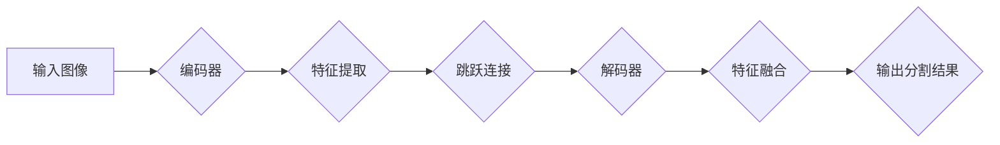

> U-Net, U-Net++, 深度学习, 图像分割, 医学图像分析, 计算机视觉

## 1. 背景介绍

图像分割是计算机视觉领域的核心任务之一，它旨在将图像划分为多个互不重叠的区域，每个区域代表着图像中不同的物体或特征。在医学图像分析、遥感图像处理、自动驾驶等领域，图像分割技术有着广泛的应用。

传统的图像分割方法通常依赖于手工设计的特征和规则，难以应对复杂图像场景的挑战。随着深度学习技术的快速发展，基于卷积神经网络（CNN）的图像分割方法取得了显著的进展。其中，U-Net 是一种经典的深度学习图像分割网络，它具有结构简单、参数量少、性能优异的特点，在医学图像分割领域得到了广泛应用。

然而，U-Net 的结构存在一定的局限性，例如信息传递路径单一、特征融合不够充分等问题。为了解决这些问题，研究者们提出了 U-Net++ 网络，它在 U-Net 的基础上进行了改进，通过引入跳跃连接和多尺度特征融合机制，提升了网络的性能和鲁棒性。

## 2. 核心概念与联系

U-Net++ 网络的核心概念是多尺度特征融合和跳跃连接。

**2.1 多尺度特征融合**

U-Net++ 网络通过在编码器和解码器中分别添加多个卷积层，构建多尺度特征提取机制。编码器阶段提取图像的低层特征，解码器阶段则利用这些低层特征和高层特征进行融合，从而获得更加丰富的语义信息。

**2.2 跳跃连接**

跳跃连接是指将编码器阶段的特征直接连接到解码器阶段相对应的层，从而实现特征信息的跨层传递。跳跃连接可以有效缓解梯度消失问题，并帮助网络学习到更丰富的空间信息。

**2.3 Mermaid 流程图**



## 3. 核心算法原理 & 具体操作步骤

### 3.1 算法原理概述

U-Net++ 网络的算法原理基于 U-Net 的基础，并通过引入多尺度特征融合和跳跃连接机制，提升了网络的性能和鲁棒性。

### 3.2 算法步骤详解

1. **输入图像预处理:** 将输入图像进行尺寸调整和归一化处理，使其符合网络的输入要求。
2. **编码器阶段:** 将输入图像通过多个卷积层和池化层进行特征提取，逐步降低图像分辨率，并提取图像的低层特征。
3. **跳跃连接:** 在编码器阶段的每个层级，将特征信息通过跳跃连接传递到解码器阶段相对应的层级。
4. **解码器阶段:** 利用跳跃连接传递的特征信息和编码器阶段提取的低层特征，通过多个卷积层和上采样层进行特征融合，逐步恢复图像分辨率，并提取图像的高层特征。
5. **输出分割结果:** 将解码器阶段的输出特征通过一个 1x1 的卷积层进行分类，生成图像的分割结果。

### 3.3 算法优缺点

**优点:**

* 结构简单，易于实现和训练。
* 参数量少，训练效率高。
* 性能优异，在医学图像分割等领域取得了显著的成果。

**缺点:**

* 对于复杂图像场景，网络可能难以学习到更丰富的语义信息。
* 训练数据量较大，需要大量的标注数据进行训练。

### 3.4 算法应用领域

U-Net++ 网络在医学图像分割、遥感图像处理、自动驾驶等领域有着广泛的应用。

* **医学图像分割:** 用于分割医学图像中的器官、肿瘤、血管等结构，辅助医生进行诊断和治疗。
* **遥感图像处理:** 用于分割遥感图像中的地物类型、植被覆盖度等信息，辅助土地利用规划和环境监测。
* **自动驾驶:** 用于分割道路、行人、车辆等信息，辅助自动驾驶系统进行决策和控制。

## 4. 数学模型和公式 & 详细讲解 & 举例说明

### 4.1 数学模型构建

U-Net++ 网络的数学模型主要基于卷积神经网络的结构，其核心操作包括卷积、池化、激活函数和全连接层。

**4.1.1 卷积操作:**

卷积操作是 U-Net++ 网络的核心操作之一，它通过卷积核对输入图像进行滑动计算，提取图像的局部特征。卷积操作的数学公式如下：

$$
y(i,j) = \sum_{m=0}^{M-1} \sum_{n=0}^{N-1} x(i+m,j+n) * w(m,n) + b
$$

其中：

* $y(i,j)$ 是输出特征图的像素值。
* $x(i+m,j+n)$ 是输入图像的像素值。
* $w(m,n)$ 是卷积核的权重值。
* $b$ 是偏置项。

**4.1.2 池化操作:**

池化操作用于降低图像分辨率，并提取图像的全局特征。常见的池化操作包括最大池化和平均池化。

**4.1.3 激活函数:**

激活函数用于引入非线性，提高网络的表达能力。常见的激活函数包括 ReLU、Sigmoid 和 Tanh。

**4.1.4 全连接层:**

全连接层将特征图展平成一维向量，并进行分类或回归。

### 4.2 公式推导过程

U-Net++ 网络的具体公式推导过程较为复杂，涉及到卷积、池化、激活函数和全连接层的组合。

### 4.3 案例分析与讲解

通过对 U-Net++ 网络的数学模型和公式进行分析，我们可以更好地理解其工作原理和性能特点。例如，我们可以通过调整卷积核的大小、池化层的步长和激活函数的类型，来优化网络的性能。

## 5. 项目实践：代码实例和详细解释说明

### 5.1 开发环境搭建

U-Net++ 网络的开发环境搭建需要以下软件：

* Python 3.x
* TensorFlow 或 PyTorch 深度学习框架
* OpenCV 图像处理库
* NumPy 数值计算库

### 5.2 源代码详细实现

```python
import tensorflow as tf

# 定义 U-Net++ 网络结构
def unet_pp(input_shape):
    inputs = tf.keras.Input(shape=input_shape)

    # 编码器阶段
    conv1 = tf.keras.layers.Conv2D(64, 3, activation='relu', padding='same')(inputs)
    conv1 = tf.keras.layers.Conv2D(64, 3, activation='relu', padding='same')(conv1)
    pool1 = tf.keras.layers.MaxPooling2D(pool_size=(2, 2))(conv1)

    conv2 = tf.keras.layers.Conv2D(128, 3, activation='relu', padding='same')(pool1)
    conv2 = tf.keras.layers.Conv2D(128, 3, activation='relu', padding='same')(conv2)
    pool2 = tf.keras.layers.MaxPooling2D(pool_size=(2, 2))(conv2)

    # ... (添加更多编码器层)

    # 解码器阶段
    up1 = tf.keras.layers.Conv2DTranspose(128, 2, strides=(2, 2), padding='same')(pool2)
    merge1 = tf.keras.layers.concatenate([up1, conv2], axis=3)
    conv3 = tf.keras.layers.Conv2D(128, 3, activation='relu', padding='same')(merge1)
    conv3 = tf.keras.layers.Conv2D(128, 3, activation='relu', padding='same')(conv3)

    # ... (添加更多解码器层)

    outputs = tf.keras.layers.Conv2D(1, 1, activation='sigmoid')(conv_out)

    model = tf.keras.Model(inputs=inputs, outputs=outputs)
    return model

# 实例化 U-Net++ 网络
model = unet_pp(input_shape=(256, 256, 3))

# 打印网络结构
model.summary()
```

### 5.3 代码解读与分析

以上代码实现了 U-Net++ 网络的结构定义和实例化。

* `unet_pp(input_shape)` 函数定义了 U-Net++ 网络的结构，其中 `input_shape` 参数指定了输入图像的尺寸。
* 编码器阶段和解码器阶段分别使用卷积层、池化层和转置卷积层构建，并通过跳跃连接进行特征融合。
* `tf.keras.layers.Conv2D` 用于定义卷积层，`tf.keras.layers.MaxPooling2D` 用于定义池化层，`tf.keras.layers.Conv2DTranspose` 用于定义转置卷积层。
* `tf.keras.layers.concatenate` 用于将特征图进行拼接。
* `tf.keras.Model` 用于定义网络模型。

### 5.4 运行结果展示

运行以上代码后，可以得到 U-Net++ 网络的结构信息和权重参数。

## 6. 实际应用场景

### 6.1 医学图像分割

U-Net++ 网络在医学图像分割领域有着广泛的应用，例如：

* **肿瘤分割:** 用于分割医学图像中的肿瘤区域，辅助医生进行肿瘤诊断和治疗规划。
* **器官分割:** 用于分割医学图像中的器官区域，例如心脏、肺部、肝脏等，辅助医生进行器官功能评估和疾病诊断。
* **血管分割:** 用于分割医学图像中的血管区域，辅助医生进行血管疾病诊断和治疗规划。

### 6.2 遥感图像处理

U-Net++ 网络在遥感图像处理领域也具有重要的应用价值，例如：

* **地物分类:** 用于分割遥感图像中的不同地物类型，例如森林、水体、城市等，辅助土地利用规划和环境监测。
* **植被覆盖度分析:** 用于分割遥感图像中的植被区域，并计算植被覆盖度，辅助农业生产和生态环境监测。
* **灾害监测:** 用于分割遥感图像中的灾害区域，例如洪水、火灾、地震等，辅助灾害救援和灾后重建。

### 6.3 自动驾驶

U-Net++ 网络在自动驾驶领域也具有重要的应用价值，例如：

* **道路分割:** 用于分割道路区域，辅助自动驾驶系统进行路径规划和避障。
* **行人检测:** 用于检测行人区域，辅助自动驾驶系统进行人机交互和安全驾驶。
* **车辆识别:** 用于识别车辆区域，辅助自动驾驶系统进行交通流分析和车道保持。

### 6.4 未来应用展望

随着深度学习技术的不断发展，U-Net++ 网络的应用场景将会更加广泛，例如：

* **医疗诊断辅助:** U-Net++ 网络可以辅助医生进行疾病诊断，提高诊断准确率和效率。
* **个性化医疗:** U-Net++ 网络可以根据患者的个体特征进行个性化治疗方案设计。
* **智能制造:** U-Net++ 网络可以用于工业缺陷检测、产品质量控制等应用场景。

## 7. 工具和资源推荐

### 7.1 学习资源推荐

* **论文:**

    * Ronneberger, O., Fischer, P., & Brox, T. (2015). U-Net: Convolutional networks for biomedical image segmentation. In International Conference on Medical image computing and computer-assisted intervention (pp. 234-241). Springer, Cham.
    * Çiçek, Ö., Abdulkadir, A., Lienkamp, S. S., Brox, T