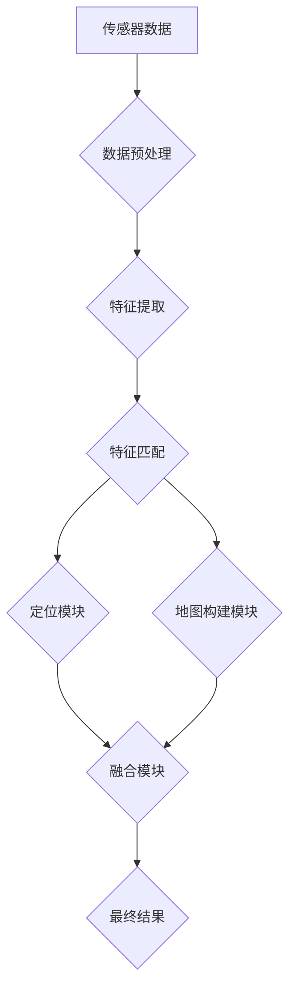

> SLAM, Simultaneous Localization and Mapping, 机器人导航, 视觉SLAM, 测距, 地图构建, 滤波算法, 卡尔曼滤波

## 1. 背景介绍

在机器人领域，**Simultaneous Localization and Mapping (SLAM)** 是一种关键技术，它允许机器人同时构建环境地图并确定自身位置。SLAM 广泛应用于自主导航、机器人探索、3D 建模等领域，为机器人赋予了自主感知和决策的能力。

传统的机器人导航方法依赖于预先构建好的地图，但这种方法在未知环境中无法应用。SLAM 技术克服了这一限制，使机器人能够在未知环境中自主导航和地图构建。

## 2. 核心概念与联系

SLAM 的核心概念是**同时**地进行定位和地图构建。

* **定位 (Localization):**  机器人根据传感器数据估计自身在环境中的位置。
* **地图构建 (Mapping):**  机器人根据传感器数据构建环境地图。

SLAM 系统通常由以下几个模块组成：

* **传感器模块:**  负责获取环境信息，常见的传感器包括激光雷达、摄像头、惯性测量单元 (IMU) 等。
* **数据处理模块:**  负责对传感器数据进行预处理、特征提取和匹配等操作。
* **定位模块:**  根据传感器数据估计机器人的位置。
* **地图构建模块:**  根据传感器数据构建环境地图。
* **融合模块:**  将定位和地图构建结果进行融合，提高系统的鲁棒性和精度。

**Mermaid 流程图:**



## 3. 核心算法原理 & 具体操作步骤

### 3.1  算法原理概述

SLAM 算法的原理是利用传感器数据和运动模型，通过迭代优化来估计机器人的位置和环境地图。常见的 SLAM 算法包括：

* **扩展卡尔曼滤波 (EKF):**  一种基于概率的滤波算法，可以估计机器人位置和地图信息。
* **粒子滤波 (PF):**  一种基于蒙特卡罗方法的滤波算法，可以处理非线性系统。
* **图优化 (Graph Optimization):**  将 SLAM 问题转化为图优化问题，通过优化图的能量函数来估计机器人位置和地图信息。

### 3.2  算法步骤详解

以 EKF 算法为例，其基本步骤如下：

1. **初始化:**  设置机器人的初始位置和地图信息。
2. **预测:**  根据机器人的运动模型预测下一个时刻的机器人位置和地图信息。
3. **更新:**  根据传感器数据更新预测结果，得到新的机器人位置和地图信息。
4. **迭代:**  重复步骤 2 和 3，直到达到收敛条件。

### 3.3  算法优缺点

**EKF 算法:**

* **优点:**  计算效率高，易于实现。
* **缺点:**  对非线性系统鲁棒性较差。

**PF 算法:**

* **优点:**  可以处理非线性系统。
* **缺点:**  计算效率低，容易出现粒子退化问题。

**图优化算法:**

* **优点:**  可以全局优化 SLAM 问题，精度高。
* **缺点:**  计算复杂度高，需要较大的内存空间。

### 3.4  算法应用领域

SLAM 算法广泛应用于以下领域:

* **机器人导航:**  使机器人能够在未知环境中自主导航。
* **机器人探索:**  使机器人能够探索未知环境并构建地图。
* **3D 建模:**  构建三维环境模型。
* **增强现实 (AR):**  将虚拟物体叠加到现实世界中。
* **自动驾驶:**  构建车辆周围环境地图，辅助车辆导航和避障。

## 4. 数学模型和公式 & 详细讲解 & 举例说明

### 4.1  数学模型构建

SLAM 问题可以建模为一个状态空间模型，其中状态向量包含机器人的位置和地图信息。

**状态向量:**

$$
x = \begin{bmatrix}
x_r \\
y_r \\
\theta_r \\
\mathbf{m}
\end{bmatrix}
$$

其中:

* $x_r$, $y_r$ : 机器人的位置坐标。
* $\theta_r$: 机器人的航向角。
* $\mathbf{m}$: 环境地图信息。

**运动模型:**

$$
x_t = f(x_{t-1}, u_t)
$$

其中:

* $x_t$:  当前时刻的状态向量。
* $x_{t-1}$:  上一个时刻的状态向量。
* $u_t$:  控制输入，例如机器人的速度和转角。

**观测模型:**

$$
z_t = h(x_t, \mathbf{w}_t)
$$

其中:

* $z_t$:  当前时刻的传感器观测数据。
* $\mathbf{w}_t$:  观测噪声。

### 4.2  公式推导过程

SLAM 算法通常使用滤波算法来估计状态向量。例如，EKF 算法利用卡尔曼滤波公式来更新状态估计。

**卡尔曼滤波公式:**

$$
\hat{x}_t = \hat{x}_{t-1} + K_t (z_t - h(\hat{x}_{t-1}))
$$

$$
P_t = (I - K_t h') P_{t-1}
$$

其中:

* $\hat{x}_t$:  当前时刻的状态估计。
* $P_t$:  当前时刻的状态协方差矩阵。
* $K_t$:  卡尔曼增益。
* $h'$:  观测模型的雅可比矩阵。

### 4.3  案例分析与讲解

假设一个机器人使用激光雷达传感器进行 SLAM。

* **运动模型:**  假设机器人的运动模型为匀速直线运动。
* **观测模型:**  激光雷达传感器测量到周围环境的距离信息。

通过 EKF 算法，机器人可以根据激光雷达数据和运动模型，估计自身位置和构建环境地图。

## 5. 项目实践：代码实例和详细解释说明

### 5.1  开发环境搭建

* 操作系统: Ubuntu 20.04
* 编程语言: Python 3.8
* 库依赖: ROS (Robot Operating System), OpenCV, NumPy, SciPy

### 5.2  源代码详细实现

```python
# 导入必要的库
import rospy
from sensor_msgs.msg import LaserScan
from nav_msgs.msg import Odometry
from geometry_msgs.msg import PoseWithCovarianceStamped

# 定义 SLAM 算法类
class SLAM:
    def __init__(self):
        # 初始化节点
        rospy.init_node('slam')
        # 订阅激光雷达数据
        self.laser_sub = rospy.Subscriber('/scan', LaserScan, self.laser_callback)
        # 发布机器人位姿信息
        self.odom_pub = rospy.Publisher('/odom', Odometry, queue_size=10)

    def laser_callback(self, msg):
        # 处理激光雷达数据
        # ...
        # 更新机器人位姿
        # ...
        # 发布机器人位姿信息
        odom_msg = Odometry()
        # ...
        self.odom_pub.publish(odom_msg)

# 创建 SLAM 对象
slam = SLAM()

# 循环处理数据
rospy.spin()
```

### 5.3  代码解读与分析

* **节点初始化:**  创建 ROS 节点并订阅激光雷达数据，发布机器人位姿信息。
* **激光雷达回调函数:**  处理激光雷达数据，更新机器人位姿，并发布位姿信息。
* **位姿更新:**  根据激光雷达数据和运动模型，使用 EKF 算法或其他 SLAM 算法更新机器人位姿。

### 5.4  运行结果展示

运行代码后，机器人将能够根据激光雷达数据构建环境地图并估计自身位置。

## 6. 实际应用场景

### 6.1  自主导航

SLAM 技术使机器人能够在未知环境中自主导航，例如在仓库、工厂、医院等场所进行货物运输、巡逻、清洁等任务。

### 6.2  机器人探索

SLAM 技术可以帮助机器人探索未知环境，例如在火星、月球等星球进行探测和采样。

### 6.3  3D 建模

SLAM 技术可以用于构建三维环境模型，例如用于建筑设计、文物保护、城市规划等领域。

### 6.4  未来应用展望

SLAM 技术在未来将有更广泛的应用，例如：

* **自动驾驶:**  SLAM 技术可以帮助自动驾驶汽车构建周围环境地图，提高驾驶安全性。
* **增强现实 (AR):**  SLAM 技术可以使 AR 应用更加逼真和交互性强。
* **虚拟现实 (VR):**  SLAM 技术可以用于构建虚拟环境，提高 VR 体验的沉浸感。

## 7. 工具和资源推荐

### 7.1  学习资源推荐

* **书籍:**
    * Probabilistic Robotics by Sebastian Thrun, Wolfram Burgard, and Dieter Fox
    * SLAM for Everyone by Michael Milford
* **在线课程:**
    * Coursera: Robotics: Perception and Navigation
    * Udacity: Self-Driving Car Engineer Nanodegree

### 7.2  开发工具推荐

* **ROS (Robot Operating System):**  一个开源的机器人软件框架。
* **OpenCV:**  一个开源的计算机视觉库。
* **g2o:**  一个开源的图优化库。

### 7.3  相关论文推荐

* **Simultaneous Localization and Mapping: A Survey** by S. Thrun, W. Burgard, and D. Fox
* **FastSLAM: A Factor Graph Approach to Monocular SLAM** by S. Thrun, W. Burgard, and D. Fox
* **Visual SLAM: A Survey** by M. Milford and P. Furgale

## 8. 总结：未来发展趋势与挑战

### 8.1  研究成果总结

SLAM 技术在过去几十年取得了显著进展，从传统的基于激光雷达的 SLAM 到现在的基于视觉的 SLAM，算法精度和鲁棒性不断提高。

### 8.2  未来发展趋势

* **多传感器融合:**  利用多种传感器数据，例如激光雷达、摄像头、IMU 等，提高 SLAM 系统的精度和鲁棒性。
* **实时性:**  提高 SLAM 系统的实时性，满足实时导航和决策的需求。
* **自主学习:**  利用机器学习技术，使 SLAM 系统能够自主学习和优化。

### 8.3  面临的挑战

* **非线性系统处理:**  SLAM 问题本质上是一个非线性系统，需要开发更有效的非线性滤波算法。
* **数据关联:**  在复杂环境中，需要准确地关联传感器数据，避免错误的匹配。
* **鲁棒性:**  SLAM 系统需要能够应对环境变化、传感器噪声等挑战。

### 8.4  研究展望

未来 SLAM 研究将继续朝着更智能、更鲁棒、更实时的方向发展，为机器人技术的发展提供更强大的支持。

## 9. 附录：常见问题与解答

### 9.1  SLAM 和 GPS 的区别

SLAM 是在未知环境中构建地图和定位的算法，而 GPS 需要卫星信号才能定位。

### 9.2  SLAM 的应用场景有哪些？

SLAM 的应用场景非常广泛，例如自主导航、机器人探索、3D 建模、增强现实等。

### 9.