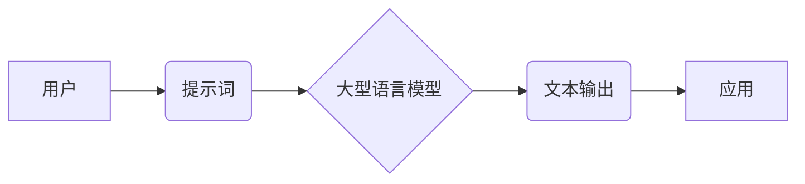

> LangChain, 聊天模型, 提示词, 构建, 优化, 应用场景, 实践

## 1. 背景介绍

近年来，大型语言模型（LLM）的快速发展，如GPT-3、LaMDA等，为自然语言处理（NLP）领域带来了革命性的变革。这些模型展现出惊人的文本生成、翻译、摘要等能力，并逐渐应用于聊天机器人、智能客服、内容创作等多个领域。然而，LLM的性能很大程度上依赖于精心设计的**提示词**（Prompt）。

提示词是用户与LLM交互的关键环节，它引导模型理解用户意图，并生成符合预期结果的文本。一个好的提示词能够显著提升模型的准确率、流畅度和针对性。

LangChain是一个强大的开源框架，旨在简化与LLM的交互，并构建更复杂的应用。它提供了丰富的工具和组件，帮助开发者构建、管理和优化LLM应用，其中包括**提示词构建和管理**的功能。

## 2. 核心概念与联系

**2.1 核心概念**

* **大型语言模型 (LLM):** 训练于海量文本数据，具备强大的文本理解和生成能力的深度学习模型。
* **提示词 (Prompt):** 用于引导LLM理解用户意图并生成相应文本的输入信息。
* **LangChain:** 一个开源框架，用于构建和管理基于LLM的应用。

**2.2 架构关系**



## 3. 核心算法原理 & 具体操作步骤

**3.1 算法原理概述**

提示词构建的核心算法原理是**自然语言处理（NLP）**和**机器学习（ML）**的结合。

* **NLP:** 用于分析和理解提示词的语法结构、语义关系和上下文信息。
* **ML:** 用于训练模型，学习不同类型提示词与模型输出之间的关系，从而生成更精准、更有效的提示词。

**3.2 算法步骤详解**

1. **数据收集:** 收集大量高质量的提示词和对应的模型输出数据。
2. **数据预处理:** 对数据进行清洗、格式化和标记，以便模型训练。
3. **模型选择:** 选择合适的机器学习模型，例如循环神经网络（RNN）、Transformer等，用于训练提示词生成模型。
4. **模型训练:** 使用训练数据训练模型，学习提示词与模型输出之间的关系。
5. **模型评估:** 使用测试数据评估模型的性能，例如准确率、流畅度等。
6. **模型优化:** 根据评估结果，调整模型参数或训练策略，不断优化模型性能。
7. **提示词生成:** 使用训练好的模型，根据用户输入的上下文信息，生成最合适的提示词。

**3.3 算法优缺点**

* **优点:**
    * 可以生成更精准、更有效的提示词，提升模型性能。
    * 可以根据不同的应用场景和用户需求，定制化生成提示词。
* **缺点:**
    * 需要大量的训练数据和计算资源。
    * 模型训练过程复杂，需要专业的机器学习知识。

**3.4 算法应用领域**

* 聊天机器人
* 智能客服
* 内容创作
* 代码生成
* 数据分析

## 4. 数学模型和公式 & 详细讲解 & 举例说明

**4.1 数学模型构建**

提示词生成模型通常采用**序列到序列（Seq2Seq）**的架构，例如Transformer。

**4.2 公式推导过程**

Transformer模型的核心是**注意力机制**，它能够学习文本序列中不同词语之间的关系，并赋予每个词语不同的权重。

注意力机制的计算公式如下：

$$
Attention(Q, K, V) = softmax(\frac{QK^T}{\sqrt{d_k}})V
$$

其中：

* $Q$：查询矩阵
* $K$：键矩阵
* $V$：值矩阵
* $d_k$：键向量的维度
* $softmax$：softmax函数

**4.3 案例分析与讲解**

假设我们有一个提示词“写一首关于春天的诗”，模型需要根据这个提示词生成一首关于春天的诗。

Transformer模型会将提示词“写一首关于春天的诗”编码成一个向量表示，然后利用注意力机制学习到每个词语之间的关系，例如“写”与“诗”之间的关系，“春天”与“诗”之间的关系等。

最后，模型会根据学习到的关系，生成一首关于春天的诗。

## 5. 项目实践：代码实例和详细解释说明

**5.1 开发环境搭建**

* Python 3.7+
* LangChain 0.0.20+
* OpenAI API key

**5.2 源代码详细实现**

```python
from langchain.prompts import PromptTemplate
from langchain.llms import OpenAI

# 创建 OpenAI LLM 实例
llm = OpenAI(temperature=0.7)

# 定义提示词模板
template = """
写一首关于{主题}的诗。
"""

# 创建 PromptTemplate 实例
prompt = PromptTemplate(
    input_variables=["主题"],
    template=template,
)

# 设置主题
theme = "春天"

# 生成诗歌
response = llm(prompt.format(主题=theme))

# 打印结果
print(response.text)
```

**5.3 代码解读与分析**

* 首先，我们导入必要的库，并创建 OpenAI LLM 实例。
* 然后，我们定义一个提示词模板，其中包含一个占位符 `{主题}`。
* 创建 PromptTemplate 实例，并将模板和占位符信息传递进去。
* 设置主题，并使用 `prompt.format()` 方法将主题填充到模板中。
* 最后，我们使用 OpenAI LLM 调用 `llm()` 方法，传入格式化的提示词，并打印生成的诗歌。

**5.4 运行结果展示**

```
春风拂面暖如春，
花开满园香飘远。
小鸟歌唱枝头俏，
万物复苏生机新。
```

## 6. 实际应用场景

**6.1 聊天机器人**

* 使用提示词引导聊天机器人理解用户意图，并生成自然流畅的回复。
* 例如，用户输入“今天天气怎么样？”，提示词可以引导机器人查询天气信息并生成回复。

**6.2 智能客服**

* 使用提示词帮助智能客服理解用户问题，并提供准确的解决方案。
* 例如，用户咨询产品信息，提示词可以引导客服查询产品数据库并生成回复。

**6.3 内容创作**

* 使用提示词辅助内容创作，例如生成文章标题、段落内容、诗歌等。
* 例如，用户输入“写一篇关于人工智能的文章”，提示词可以引导模型生成文章标题、段落内容等。

**6.4 未来应用展望**

* 随着LLM技术的不断发展，提示词构建将成为更重要的研究方向。
* 未来，我们可以期待看到更智能、更灵活的提示词生成模型，能够更好地理解用户意图，并生成更精准、更符合用户需求的文本。

## 7. 工具和资源推荐

**7.1 学习资源推荐**

* **LangChain 官方文档:** https://python.langchain.com/docs/
* **OpenAI API 文档:** https://platform.openai.com/docs/api-reference

**7.2 开发工具推荐**

* **Python:** https://www.python.org/
* **Jupyter Notebook:** https://jupyter.org/

**7.3 相关论文推荐**

* **Attention Is All You Need:** https://arxiv.org/abs/1706.03762
* **BERT: Pre-training of Deep Bidirectional Transformers for Language Understanding:** https://arxiv.org/abs/1810.04805

## 8. 总结：未来发展趋势与挑战

**8.1 研究成果总结**

* 提示词构建技术在LLM应用中发挥着至关重要的作用。
* 结合NLP和ML的算法能够生成更精准、更有效的提示词。
* LangChain框架提供了丰富的工具和组件，简化了提示词构建和管理。

**8.2 未来发展趋势**

* 更智能、更灵活的提示词生成模型。
* 基于用户行为和上下文信息的个性化提示词生成。
* 提示词的可解释性和可控性提升。

**8.3 面临的挑战**

* 训练高质量的提示词数据集。
* 提升模型的泛化能力，使其能够适应不同的应用场景。
* 确保提示词的安全性、可靠性和可解释性。

**8.4 研究展望**

* 研究更有效的提示词生成算法和模型架构。
* 开发更强大的提示词管理和优化工具。
* 探索提示词在其他领域，例如代码生成、数据分析等方面的应用。

## 9. 附录：常见问题与解答

**9.1 如何选择合适的提示词模板？**

* 考虑应用场景和用户需求。
* 尽量简洁明了，避免冗余信息。
* 使用占位符，方便用户输入特定信息。

**9.2 如何评估提示词的质量？**

* 评估模型生成的文本的准确率、流畅度和针对性。
* 收集用户反馈，了解提示词的易用性和有效性。

**9.3 如何优化提示词？**

* 尝试不同的提示词模板和参数设置。
* 使用反馈信息进行迭代优化。
* 参考其他领域的最佳实践。


作者：禅与计算机程序设计艺术 / Zen and the Art of Computer Programming 
<end_of_turn>