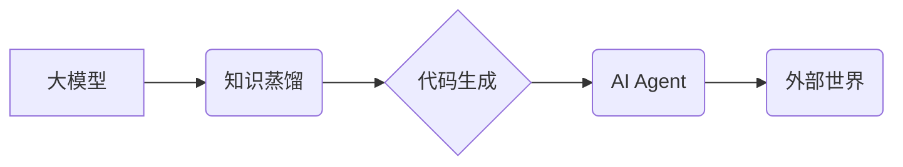

> MetaGPT, 大模型, AI Agent, 应用开发, 编程, 知识蒸馏, 代码生成, 聊天机器人

## 1. 背景介绍

近年来，大模型技术取得了飞速发展，其强大的泛化能力和知识表示能力为人工智能领域带来了革命性的变革。从文本生成、机器翻译到代码编写、图像识别，大模型已在各个领域展现出令人瞩目的应用潜力。然而，将这些强大的模型转化为实际应用场景中可用的智能代理仍然面临着诸多挑战。

MetaGPT 作为一种新型的 AI Agent 开发框架，旨在通过知识蒸馏和代码生成等技术，将大模型的强大能力转化为可部署、可交互的智能代理，从而推动大模型技术向更广泛的应用领域拓展。

## 2. 核心概念与联系

MetaGPT 的核心概念是将大模型视为一个强大的知识库和推理引擎，并通过编程接口将其与外部世界连接起来。

**MetaGPT 架构**

**核心概念解释:**

* **大模型:** 作为 MetaGPT 的基础，大模型提供丰富的知识和强大的推理能力。
* **知识蒸馏:** 通过训练一个更小的模型来模仿大模型的行为，从而降低部署成本和延迟。
* **代码生成:** 利用大模型的文本生成能力，自动生成执行特定任务的代码。
* **AI Agent:** 基于知识蒸馏和代码生成的智能代理，能够与外部世界交互，执行用户指令。

## 3. 核心算法原理 & 具体操作步骤

### 3.1  算法原理概述

MetaGPT 的核心算法原理基于知识蒸馏和代码生成技术。

* **知识蒸馏:** 将大模型的知识通过训练一个更小的模型的方式进行传递。
* **代码生成:** 利用大模型的文本生成能力，根据用户指令或任务描述自动生成执行特定任务的代码。

### 3.2  算法步骤详解

1. **数据准备:** 收集和预处理用于知识蒸馏和代码生成的训练数据。
2. **大模型训练:** 使用大量的文本数据训练一个强大的大模型。
3. **知识蒸馏:** 使用大模型的输出作为教师信号，训练一个更小的学生模型。
4. **代码生成模型训练:** 使用大模型的文本生成能力，训练一个专门用于代码生成的模型。
5. **AI Agent 开发:** 将知识蒸馏后的学生模型和代码生成模型集成到一个 AI Agent 中。
6. **部署和测试:** 将 AI Agent 部署到目标环境中，并进行测试和评估。

### 3.3  算法优缺点

**优点:**

* **高效性:** 知识蒸馏可以有效降低模型大小和计算成本。
* **可解释性:** 代码生成模型的输出是可读的代码，更容易理解和调试。
* **灵活性:** MetaGPT 可以根据不同的任务需求定制不同的 AI Agent。

**缺点:**

* **数据依赖:** 算法性能依赖于高质量的训练数据。
* **模型复杂性:** 训练和部署大模型仍然需要较高的技术门槛。
* **安全风险:** AI Agent 的行为需要进行严格的安全评估和控制。

### 3.4  算法应用领域

MetaGPT 的应用领域非常广泛，包括但不限于：

* **聊天机器人:** 开发更智能、更自然的对话机器人。
* **代码辅助:** 自动生成代码片段、完成代码补全、查找代码错误。
* **自动化任务:** 自动化重复性任务，例如数据处理、文件管理等。
* **个性化服务:** 提供个性化的产品推荐、内容生成等服务。

## 4. 数学模型和公式 & 详细讲解 & 举例说明

### 4.1  数学模型构建

MetaGPT 的核心数学模型是基于 Transformer 架构的编码器-解码器模型。

* **编码器:** 用于将输入文本序列编码成一个固定长度的向量表示。
* **解码器:** 用于根据编码后的向量表示生成输出文本序列。

### 4.2  公式推导过程

Transformer 模型的核心是注意力机制，它允许模型关注输入序列中与当前位置相关的词语，从而更好地理解上下文信息。

**注意力机制公式:**

$$
Attention(Q, K, V) = softmax(\frac{QK^T}{\sqrt{d_k}})V
$$

其中:

* $Q$: 查询矩阵
* $K$: 键矩阵
* $V$: 值矩阵
* $d_k$: 键向量的维度

### 4.3  案例分析与讲解

例如，在代码生成任务中，输入文本序列可能是用户提供的任务描述，而输出文本序列则是相应的代码片段。Transformer 模型通过注意力机制，可以关注任务描述中与代码相关的关键信息，从而生成更准确、更符合语义的代码。

## 5. 项目实践：代码实例和详细解释说明

### 5.1  开发环境搭建

MetaGPT 的开发环境需要包含以下软件：

* Python 3.x
* PyTorch 或 TensorFlow
* CUDA 和 cuDNN (可选，用于 GPU 加速)

### 5.2  源代码详细实现

MetaGPT 的源代码可以从 GitHub 或其他开源平台获取。

### 5.3  代码解读与分析

MetaGPT 的源代码主要包含以下部分:

* **数据处理模块:** 用于加载和预处理训练数据。
* **模型训练模块:** 用于训练知识蒸馏模型和代码生成模型。
* **AI Agent 模块:** 用于集成知识蒸馏模型和代码生成模型，并实现与外部世界的交互。

### 5.4  运行结果展示

MetaGPT 的运行结果可以根据具体的应用场景进行展示。例如，在代码生成任务中，可以展示生成的代码片段和其执行结果。

## 6. 实际应用场景

### 6.1  聊天机器人

MetaGPT 可以用于开发更智能、更自然的对话机器人。例如，可以训练一个 MetaGPT 驱动的聊天机器人，能够理解用户的自然语言输入，并提供相关信息或完成用户的指令。

### 6.2  代码辅助

MetaGPT 可以用于辅助程序员编写代码。例如，可以训练一个 MetaGPT 驱动的代码辅助工具，能够根据程序员的代码注释或自然语言描述自动生成相应的代码片段。

### 6.3  自动化任务

MetaGPT 可以用于自动化重复性任务。例如，可以训练一个 MetaGPT 驱动的自动化任务执行器，能够根据预先定义的规则自动执行诸如数据处理、文件管理等任务。

### 6.4  未来应用展望

MetaGPT 的应用场景还在不断扩展，未来可能应用于更多领域，例如：

* **个性化教育:** 提供个性化的学习内容和辅导。
* **医疗诊断:** 辅助医生进行疾病诊断和治疗方案制定。
* **金融分析:** 分析市场数据，预测股票价格走势。

## 7. 工具和资源推荐

### 7.1  学习资源推荐

* **论文:**
    * Attention Is All You Need (Vaswani et al., 2017)
    * BERT: Pre-training of Deep Bidirectional Transformers for Language Understanding (Devlin et al., 2018)
    * GPT-3: Language Models are Few-Shot Learners (Brown et al., 2020)
* **书籍:**
    * Deep Learning (Goodfellow et al., 2016)
    * Natural Language Processing with Python (Bird et al., 2009)

### 7.2  开发工具推荐

* **PyTorch:** 深度学习框架
* **TensorFlow:** 深度学习框架
* **Hugging Face Transformers:** 预训练模型库

### 7.3  相关论文推荐

* **Meta-Learning with Differentiable Convex Optimization** (Finn et al., 2017)
* **Learning to Learn by Gradient Descent by Gradient Descent** (Andrychowicz et al., 2017)
* **Model-Agnostic Meta-Learning for Fast Adaptation of Deep Networks** (Munkhdalai et al., 2017)

## 8. 总结：未来发展趋势与挑战

### 8.1  研究成果总结

MetaGPT 作为一种新型的 AI Agent 开发框架，为将大模型技术应用于实际场景提供了新的思路和方法。

### 8.2  未来发展趋势

未来，MetaGPT 将朝着以下方向发展:

* **模型效率提升:** 探索更轻量级的模型架构，降低部署成本和延迟。
* **多模态交互:** 支持文本、图像、音频等多模态的交互。
* **安全可靠性增强:** 加强 AI Agent 的安全性和可靠性，防止恶意攻击和不可预知行为。

### 8.3  面临的挑战

MetaGPT 的发展也面临着一些挑战:

* **数据获取和标注:** 训练高质量的 AI Agent 需要大量的标注数据，数据获取和标注成本较高。
* **模型解释性和可控性:** 大模型的决策过程往往难以解释，如何提高模型的透明度和可控性是一个重要的研究方向。
* **伦理和社会影响:** AI Agent 的应用可能带来一些伦理和社会问题，需要进行深入的探讨和研究。

### 8.4  研究展望

MetaGPT 的研究将继续深入，探索更智能、更安全、更可靠的 AI Agent，推动人工智能技术向更广泛的应用领域拓展。

## 9. 附录：常见问题与解答

**常见问题:**

* MetaGPT 的开发难度如何？
* MetaGPT 的应用场景有哪些？
* MetaGPT 的开源代码在哪里可以获取？

**解答:**

* MetaGPT 的开发难度取决于用户的技术水平和应用场景的复杂度。
* MetaGPT 的应用场景非常广泛，包括聊天机器人、代码辅助、自动化任务等。
* MetaGPT 的开源代码可以从 GitHub 或其他开源平台获取。

作者：禅与计算机程序设计艺术 / Zen and the Art of Computer Programming 
<end_of_turn>