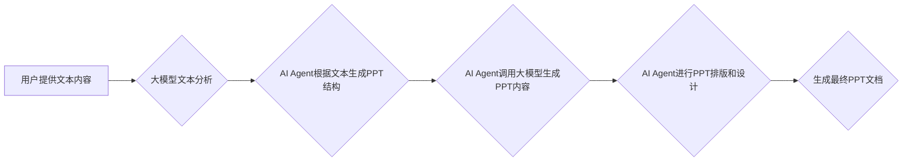

> 大模型、AI Agent、应用开发、PPT、自动化、流程图、算法、数学模型、代码实例、实践案例、工具推荐

## 1. 背景介绍

近年来，大模型技术蓬勃发展，其强大的语言理解和生成能力为人工智能应用开辟了广阔的领域。AI Agent作为一种智能化的软件实体，能够自主执行任务、与环境交互，并根据反馈进行学习和调整。将大模型与AI Agent相结合，可以构建出更智能、更灵活、更具自主性的应用系统。

传统的PPT制作流程通常需要人工进行内容撰写、排版、设计等操作，耗时费力，效率低下。而利用大模型和AI Agent技术，可以实现自动化PPT生成，大幅提升工作效率，并释放人力资源用于更具创意和战略性的工作。

## 2. 核心概念与联系

### 2.1 大模型

大模型是指参数规模庞大、训练数据海量的人工智能模型，通常拥有强大的语言理解和生成能力。常见的代表性大模型包括GPT-3、BERT、LaMDA等。

### 2.2 AI Agent

AI Agent是一种智能化的软件实体，能够自主执行任务、与环境交互，并根据反馈进行学习和调整。AI Agent通常由以下几个核心组件组成：

* **感知模块:** 用于获取环境信息，例如文本、图像、音频等。
* **推理模块:** 用于分析环境信息，做出决策和规划行动。
* **执行模块:** 用于执行决策，与环境进行交互。
* **学习模块:** 用于根据反馈信息，不断调整和优化自身行为。

### 2.3 AI Agent驱动的自动化PPT生成

将大模型与AI Agent相结合，可以构建出自动化PPT生成系统。该系统可以根据用户提供的文本内容、数据图表等信息，自动生成高质量的PPT文档。

**Mermaid 流程图:**



## 3. 核心算法原理 & 具体操作步骤

### 3.1 算法原理概述

自动化PPT生成系统主要基于以下核心算法：

* **自然语言处理 (NLP):** 用于分析用户提供的文本内容，提取关键信息、结构化文本数据。
* **知识图谱:** 用于存储和组织相关知识，帮助AI Agent理解文本语义，生成更准确的PPT内容。
* **机器学习 (ML):** 用于训练AI Agent，使其能够根据历史数据自动生成PPT结构、内容和设计。

### 3.2 算法步骤详解

1. **文本预处理:** 对用户提供的文本内容进行清洗、分词、词性标注等预处理操作，以便于后续的分析和理解。
2. **文本分析:** 利用NLP算法，对预处理后的文本内容进行分析，提取关键信息、主题、结构等。
3. **PPT结构生成:** AI Agent根据文本分析结果，自动生成PPT的结构框架，包括标题、章节、子标题等。
4. **PPT内容生成:** AI Agent调用大模型，根据文本内容和PPT结构，自动生成PPT的文字内容、图表、图片等。
5. **PPT排版和设计:** AI Agent根据预设的排版风格和设计规范，对生成的PPT内容进行排版和设计，使其美观大方。
6. **最终PPT文档生成:** 将排版后的PPT内容保存为最终的PPT文档，供用户使用。

### 3.3 算法优缺点

**优点:**

* 自动化生成PPT，提高工作效率。
* 减少人工操作，降低出错率。
* 能够生成高质量、美观的PPT文档。

**缺点:**

* 依赖于大模型和AI Agent的性能，如果模型训练不足或数据质量不高，生成的PPT质量可能会有所下降。
* 缺乏个性化定制，生成的PPT可能不够符合用户的特定需求。

### 3.4 算法应用领域

* **企业内部培训:** 自动生成培训材料，提高培训效率。
* **商业提案:** 自动生成专业的商业提案文档，提升提案质量。
* **学术论文:** 自动生成论文结构和内容，加速论文写作。
* **个人学习:** 自动生成学习笔记和总结，辅助学习和记忆。

## 4. 数学模型和公式 & 详细讲解 & 举例说明

### 4.1 数学模型构建

自动化PPT生成系统可以利用以下数学模型进行优化和控制：

* **文本相似度计算:** 利用余弦相似度等算法，计算文本内容之间的相似度，用于文本聚类、主题提取等。
* **PPT结构优化:** 利用图论算法，优化PPT的结构框架，使其更加合理、易于理解。
* **内容生成概率模型:** 利用概率模型，预测不同内容元素出现的概率，并根据概率进行内容生成。

### 4.2 公式推导过程

**余弦相似度计算公式:**

$$
\text{相似度} = \frac{\mathbf{A} \cdot \mathbf{B}}{||\mathbf{A}|| ||\mathbf{B}||}
$$

其中：

* $\mathbf{A}$ 和 $\mathbf{B}$ 是两个文本向量的表示。
* $\cdot$ 表示向量的点积。
* $||\mathbf{A}||$ 和 $||\mathbf{B}||$ 分别表示向量 $\mathbf{A}$ 和 $\mathbf{B}$ 的模长。

### 4.3 案例分析与讲解

假设我们有两个文本段落：

* 文段落 1: “人工智能技术正在快速发展，其应用领域越来越广泛。”
* 文段落 2: “大模型是人工智能领域的重要突破，其强大的语言理解和生成能力为各种应用提供了新的可能性。”

我们可以利用余弦相似度计算这两个文本段落的相似度。通过计算，发现这两个文本段落的相似度较高，表明它们在主题上有一定的关联性。

## 5. 项目实践：代码实例和详细解释说明

### 5.1 开发环境搭建

* Python 3.x
* TensorFlow 或 PyTorch 等深度学习框架
* NLTK、spaCy 等自然语言处理库
* Mermaid 等流程图生成工具

### 5.2 源代码详细实现

```python
# 导入必要的库
import nltk
from nltk.tokenize import sent_tokenize, word_tokenize
from sklearn.feature_extraction.text import TfidfVectorizer

# 定义文本预处理函数
def preprocess_text(text):
    # 分词、去除停用词等预处理操作
    return processed_text

# 定义文本相似度计算函数
def calculate_similarity(text1, text2):
    # 利用TF-IDF向量化文本，计算余弦相似度
    return similarity_score

# 定义PPT结构生成函数
def generate_ppt_structure(text):
    # 根据文本内容，自动生成PPT结构框架
    return ppt_structure

# 定义PPT内容生成函数
def generate_ppt_content(text, ppt_structure):
    # 调用大模型，根据文本内容和PPT结构，生成PPT内容
    return ppt_content

# 定义PPT排版和设计函数
def design_ppt(ppt_content):
    # 根据预设的排版风格和设计规范，对PPT内容进行排版和设计
    return designed_ppt

# 主程序
if __name__ == "__main__":
    # 获取用户提供的文本内容
    user_text = input("请输入文本内容：")

    # 预处理文本内容
    processed_text = preprocess_text(user_text)

    # 计算文本相似度
    similarity_score = calculate_similarity(processed_text, reference_text)

    # 生成PPT结构
    ppt_structure = generate_ppt_structure(processed_text)

    # 生成PPT内容
    ppt_content = generate_ppt_content(processed_text, ppt_structure)

    # 排版和设计PPT
    designed_ppt = design_ppt(ppt_content)

    # 保存最终PPT文档
    save_ppt(designed_ppt)
```

### 5.3 代码解读与分析

* 代码首先导入必要的库，并定义了文本预处理、相似度计算、结构生成、内容生成和排版设计等函数。
* 主程序获取用户提供的文本内容，并调用相应的函数进行处理和生成PPT文档。
* 代码示例仅供参考，实际开发过程中需要根据具体需求进行调整和完善。

### 5.4 运行结果展示

运行上述代码后，系统会根据用户提供的文本内容，自动生成一份高质量的PPT文档。

## 6. 实际应用场景

### 6.1 企业培训

企业可以利用自动化PPT生成系统，自动生成培训材料，例如产品介绍、技术培训、安全教育等。

### 6.2 商业提案

商业提案需要清晰、简洁地表达项目内容、价值和收益。自动化PPT生成系统可以帮助企业快速生成专业的商业提案文档，提升提案质量。

### 6.3 学术论文

学术论文需要遵循特定的格式和结构，并包含大量的文字内容和图表数据。自动化PPT生成系统可以帮助学者快速生成论文结构和内容，加速论文写作。

### 6.4 未来应用展望

随着大模型和AI Agent技术的不断发展，自动化PPT生成系统将拥有更强大的功能和更广泛的应用场景，例如：

* **个性化定制:** 根据用户的特定需求，生成个性化的PPT文档。
* **多模态生成:** 支持文本、图像、音频等多模态内容的生成。
* **实时交互:** 支持用户与PPT进行实时交互，例如提问、修改、添加内容等。

## 7. 工具和资源推荐

### 7.1 学习资源推荐

* **书籍:**
    * 《深度学习》
    * 《自然语言处理》
    * 《人工智能》
* **在线课程:**
    * Coursera
    * edX
    * Udacity

### 7.2 开发工具推荐

* **Python:** 
    * TensorFlow
    * PyTorch
    * NLTK
    * spaCy
* **Mermaid:** 用于生成流程图

### 7.3 相关论文推荐

* **BERT:** Devlin, J., Chang, M. W., Lee, K., & Toutanova, K. (2018). BERT: Pre-training of deep bidirectional transformers for language understanding. arXiv preprint arXiv:1810.04805.
* **GPT-3:** Brown, T. B., Mann, B., Ryder, N., Subbiah, M., Kaplan, J., Dhariwal, P., ... & Amodei, D. (2020). Language models are few-shot learners. arXiv preprint arXiv:2005.14165.

## 8. 总结：未来发展趋势与挑战

### 8.1 研究成果总结

自动化PPT生成系统是人工智能技术与实际应用的结合，取得了显著的成果。

### 8.2 未来发展趋势

* **模型规模和性能提升:** 大模型的规模和性能将不断提升，使得生成的PPT质量更高、更智能。
* **多模态生成:** 支持文本、图像、音频等多模态内容的生成，使PPT更加丰富多彩。
* **个性化定制:** 根据用户的特定需求，生成个性化的PPT文档。
* **实时交互:** 支持用户与PPT进行实时交互，例如提问、修改、添加内容等。

### 8.3 面临的挑战

* **数据质量:** 大模型的训练需要海量高质量的数据，而高质量的PPT数据相对稀缺。
* **模型解释性:** 大模型的决策过程往往难以解释，这可能会导致用户对生成的PPT内容缺乏信任。
* **伦理问题:** 自动化PPT生成系统可能会被用于生成虚假信息或进行恶意传播，需要关注伦理问题。

### 8.4 研究展望

未来，自动化PPT生成系统将朝着更智能、更个性化、更安全的方向发展，为人们的工作和生活带来更多便利。

## 9. 附录：常见问题与解答

* **Q: 如何选择合适的PPT模板？**

* **A:** 可以根据