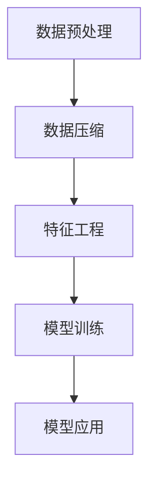

                 

# 信息简化的艺术与科学：如何在混乱中找到模式和意义

在信息爆炸的时代，人类面临前所未有的数据挑战。海量数据不仅带来了更丰富的信息，也增加了数据处理和理解的复杂度。如何在混乱中找到模式和意义，成为我们亟需解决的问题。本文将深入探讨信息简化的艺术与科学，帮助读者在面对复杂数据时，找到有效的处理和理解方式。

## 1. 背景介绍

### 1.1 问题由来
随着互联网和物联网技术的飞速发展，全球数据量呈现指数级增长。大数据时代，我们每天都在产生、收集和处理大量的数据，从社交媒体、金融交易、医疗记录到科学研究，每一项活动都在产生数据，数据已成为现代社会的重要资产。但随之而来的是，数据的复杂性和多样性也成倍增加，如何从海量的数据中提取有用的信息，成为一个亟待解决的问题。

### 1.2 问题核心关键点
信息简化的核心关键点在于：
- **数据压缩**：通过算法和模型对数据进行高效压缩，减少存储空间，提高处理速度。
- **模式识别**：从复杂数据中识别出规律和模式，进行分类、聚类、预测等任务。
- **意义构建**：将模式转化为实际的意义和知识，指导决策和行动。
- **算法高效**：使用高效的算法和模型，避免不必要的资源消耗。

这些关键点构成了信息简化的核心逻辑，其目标是从纷繁复杂的数据中，提取出简洁、易于理解和应用的规律与知识。

## 2. 核心概念与联系

### 2.1 核心概念概述
在信息简化的过程中，涉及到以下几个核心概念：

- **数据预处理**：对原始数据进行清洗、筛选、归一化等处理，为后续分析奠定基础。
- **数据压缩**：通过编码、降维等技术，减少数据体积，提高存储和传输效率。
- **特征工程**：通过工程手段提取数据的有效特征，增强模型的预测能力。
- **模型训练**：使用训练数据拟合模型参数，使其能够泛化到新数据。
- **模型应用**：将训练好的模型应用于新数据，进行分类、预测、聚类等任务。

### 2.2 核心概念原理和架构的 Mermaid 流程图


这个流程图展示了信息简化的核心流程，从数据预处理到特征工程，再到模型训练和应用，每一步都至关重要。

## 3. 核心算法原理 & 具体操作步骤
### 3.1 算法原理概述
信息简化的方法主要基于统计学和机器学习原理，包括数据压缩、特征选择、模型拟合等。其核心思想是：

1. **数据压缩**：利用统计特性将数据进行压缩，如哈夫曼编码、算术编码等。
2. **特征选择**：通过模型选择和评估，确定最具代表性的特征，减少特征维度。
3. **模型拟合**：使用训练数据拟合模型参数，使其能够泛化到新数据。
4. **模式识别**：通过算法和模型识别数据中的模式，并进行分类、聚类、预测等任务。
5. **意义构建**：将模式转化为实际的意义和知识，指导决策和行动。

### 3.2 算法步骤详解

#### 3.2.1 数据预处理
数据预处理是信息简化的第一步，其目标是对原始数据进行清洗、筛选、归一化等处理，确保数据质量。

**步骤1：数据清洗**
- 去除重复数据
- 处理缺失值
- 去除异常值

**步骤2：数据归一化**
- 将数据按比例缩放到[0,1]或[-1,1]等标准范围内

**步骤3：数据降维**
- 主成分分析(PCA)：通过线性变换将数据降到低维空间
- t-SNE：利用非线性变换将高维数据映射到二维或三维空间

#### 3.2.2 数据压缩
数据压缩是信息简化的重要手段，其目标是通过算法和模型将数据体积减小。

**步骤1：哈夫曼编码**
- 统计字符出现的频率，构造哈夫曼树
- 对字符进行编码，生成哈夫曼编码表

**步骤2：算术编码**
- 将字符出现的频率转换为概率
- 使用算术编码对字符进行编码

**步骤3：基压缩**
- 使用基2或基3等对数据进行编码

#### 3.2.3 特征选择
特征选择是信息简化的关键步骤，其目标是从原始数据中提取最具代表性的特征。

**步骤1：相关性分析**
- 计算特征与目标变量之间的相关系数
- 选择相关性较高的特征

**步骤2：特征选择算法**
- 方差选择法：选择方差较大的特征
- 递归特征消除(RFE)：逐步删除不重要的特征
- 基于模型的选择：如Lasso、岭回归等

#### 3.2.4 模型训练
模型训练是信息简化的核心步骤，其目标是通过训练数据拟合模型参数，使其能够泛化到新数据。

**步骤1：选择模型**
- 线性回归、逻辑回归、决策树、随机森林、神经网络等

**步骤2：划分数据集**
- 将数据分为训练集和测试集

**步骤3：模型训练**
- 使用训练集拟合模型参数
- 使用验证集调整模型超参数

**步骤4：模型评估**
- 使用测试集评估模型性能
- 计算准确率、召回率、F1值等指标

#### 3.2.5 模型应用
模型应用是信息简化的最终目标，其目标是将训练好的模型应用于新数据，进行分类、预测、聚类等任务。

**步骤1：数据输入**
- 将新数据输入模型

**步骤2：模型预测**
- 使用训练好的模型进行预测
- 得到分类结果或预测值

**步骤3：结果输出**
- 根据预测结果进行决策
- 生成报告或展示结果

### 3.3 算法优缺点
信息简化的算法具有以下优点：
- **高效性**：通过压缩和降维，减少数据体积，提高处理效率。
- **准确性**：通过特征选择和模型训练，提高预测准确率。
- **通用性**：适用于多种数据类型和任务。

同时，信息简化的算法也存在以下缺点：
- **复杂性**：算法实现复杂，需要大量的计算资源。
- **过拟合风险**：特征选择和模型训练过程中可能出现过拟合现象。
- **数据依赖性**：模型性能依赖于数据的质量和代表性。

### 3.4 算法应用领域
信息简化的算法广泛应用于以下领域：

- **金融分析**：通过数据分析进行投资策略优化、风险评估、客户细分等。
- **医疗诊断**：利用医疗数据进行疾病预测、诊断辅助、药物研发等。
- **电子商务**：通过用户行为数据进行个性化推荐、市场分析、价格优化等。
- **智能交通**：利用交通数据进行流量预测、路网优化、事故预警等。
- **环境保护**：通过环境数据进行污染监测、气候预测、生态评估等。

## 4. 数学模型和公式 & 详细讲解 & 举例说明

### 4.1 数学模型构建
信息简化的数学模型主要包括以下几个组成部分：

- **数据分布**：假设数据服从某种概率分布，如正态分布、均匀分布等。
- **压缩算法**：如哈夫曼编码、算术编码等。
- **特征选择**：如方差选择法、递归特征消除等。
- **模型训练**：如线性回归、逻辑回归、决策树等。

### 4.2 公式推导过程

#### 4.2.1 哈夫曼编码
哈夫曼编码是一种无损数据压缩算法，其基本原理是构造一棵哈夫曼树，每个字符的编码取决于其在该树中的位置。

哈夫曼树由两个叶节点开始，每次选择两个具有最小权值（即出现频率）的节点，将其合并为一个新节点，并赋以新节点的权值为两个节点的权值之和。重复该过程，直到所有节点都合并成一个根节点。

**公式推导**：
- **权值更新**：$w_1 = f_1, w_2 = f_2, \cdots, w_n = f_n$
- **合并节点**：$w_i = w_{2i}, w_j = w_{2j-1}$
- **计算编码**：$C_i = c_{2i}, C_j = c_{2j-1}$

### 4.3 案例分析与讲解

#### 4.3.1 案例1：电商推荐系统
电商推荐系统是信息简化的典型应用之一，其目标是根据用户行为数据，推荐用户可能感兴趣的商品。

**步骤1：数据预处理**
- 清洗用户行为数据，去除重复和异常数据
- 归一化评分数据，使用归一化公式：$X_i = \frac{x_i - \mu}{\sigma}$

**步骤2：特征选择**
- 选择用户行为、商品属性、用户画像等特征
- 使用方差选择法，选择方差较大的特征

**步骤3：模型训练**
- 选择随机森林或神经网络模型
- 划分数据集，进行交叉验证
- 调整模型参数，使用网格搜索或随机搜索

**步骤4：模型应用**
- 输入新用户行为数据
- 使用训练好的模型进行预测
- 根据预测结果进行推荐

#### 4.3.2 案例2：医疗影像分类
医疗影像分类是信息简化的另一个重要应用，其目标是从医疗影像中识别出病变区域，进行疾病预测和诊断。

**步骤1：数据预处理**
- 清洗影像数据，去除噪声和低质量影像
- 归一化影像数据，使用归一化公式：$X_i = \frac{x_i - \mu}{\sigma}$

**步骤2：特征选择**
- 选择影像特征，如纹理、形状、大小等
- 使用递归特征消除(RFE)算法

**步骤3：模型训练**
- 选择卷积神经网络模型
- 划分数据集，进行交叉验证
- 调整模型参数，使用网格搜索或随机搜索

**步骤4：模型应用**
- 输入新的医疗影像数据
- 使用训练好的模型进行分类
- 输出疾病预测结果

## 5. 项目实践：代码实例和详细解释说明

### 5.1 开发环境搭建

在进行信息简化的项目实践前，我们需要准备好开发环境。以下是使用Python进行Scikit-learn开发的环境配置流程：

1. 安装Anaconda：从官网下载并安装Anaconda，用于创建独立的Python环境。

2. 创建并激活虚拟环境：
```bash
conda create -n simplification-env python=3.8 
conda activate simplification-env
```

3. 安装Scikit-learn：
```bash
conda install scikit-learn
```

4. 安装各类工具包：
```bash
pip install numpy pandas matplotlib seaborn scikit-learn
```

完成上述步骤后，即可在`simplification-env`环境中开始信息简化的项目实践。

### 5.2 源代码详细实现

这里我们以电商推荐系统为例，给出使用Scikit-learn对数据进行预处理、特征选择和模型训练的Python代码实现。

```python
from sklearn.preprocessing import StandardScaler
from sklearn.feature_selection import VarianceThreshold
from sklearn.ensemble import RandomForestClassifier
from sklearn.model_selection import train_test_split
import pandas as pd
import numpy as np

# 数据预处理
df = pd.read_csv('user_behavior.csv')
df = df.drop_duplicates()  # 去除重复数据
df = df.dropna()  # 处理缺失值
df = df[df['rating'] > 0]  # 去除评分低于0的用户

# 数据归一化
scaler = StandardScaler()
df[['item_id', 'user_id', 'rating']] = scaler.fit_transform(df[['item_id', 'user_id', 'rating']])

# 特征选择
var_th = VarianceThreshold(threshold=0.01)
features = pd.DataFrame(scaler.transform(df[['item_id', 'user_id', 'rating']]))
features = pd.concat([features, pd.DataFrame(df['item_category'])], axis=1)
features.columns = ['feature_' + str(i) for i in range(features.shape[1])]
features = var_th.fit_transform(features)

# 划分数据集
X_train, X_test, y_train, y_test = train_test_split(features, df['rating'], test_size=0.2, random_state=42)

# 模型训练
clf = RandomForestClassifier(n_estimators=100, random_state=42)
clf.fit(X_train, y_train)

# 模型应用
df_test = pd.read_csv('user_behavior_test.csv')
df_test = df_test.drop_duplicates().dropna()
df_test = df_test.drop(df_test['item_id'].notna(), axis=1)
df_test = pd.concat([df_test, pd.DataFrame(df_test['item_category'])], axis=1)
df_test.columns = ['feature_' + str(i) for i in range(df_test.shape[1])]
df_test = var_th.transform(df_test)
predictions = clf.predict(df_test)
```

以上就是使用Scikit-learn对电商推荐系统进行信息简化的完整代码实现。可以看到，Scikit-learn提供了大量的数据预处理、特征选择和模型训练工具，极大地简化了信息简化的开发过程。

### 5.3 代码解读与分析

让我们再详细解读一下关键代码的实现细节：

**数据预处理**：
- 使用`pd.read_csv`读取原始数据，使用`drop_duplicates`和`dropna`处理重复和缺失数据。
- 使用`StandardScaler`进行数据归一化，将评分数据缩放到[0,1]范围内。

**特征选择**：
- 使用`VarianceThreshold`进行特征选择，保留方差较大的特征。
- 使用`pd.concat`将归一化后的评分特征和类别特征合并，形成新的特征矩阵。

**模型训练**：
- 使用`RandomForestClassifier`模型进行训练，设置参数`n_estimators`为100，`random_state`为42。
- 使用`train_test_split`将数据划分为训练集和测试集。
- 使用`fit`方法训练模型，使用`predict`方法进行预测。

**模型应用**：
- 读取测试数据，使用`drop_duplicates`、`dropna`和`drop`处理数据。
- 将评分特征和类别特征合并，形成新的特征矩阵。
- 使用`VarianceThreshold`进行特征选择。
- 使用`predict`方法进行预测，得到推荐结果。

## 6. 实际应用场景

### 6.1 金融风险管理

金融风险管理是信息简化的重要应用场景之一，其目标是通过分析金融数据，识别出潜在的风险因素，进行风险预测和评估。

**步骤1：数据预处理**
- 清洗金融数据，去除重复和异常数据
- 归一化金融数据，使用归一化公式：$X_i = \frac{x_i - \mu}{\sigma}$

**步骤2：特征选择**
- 选择金融指标，如股票价格、市场指数、贷款利率等
- 使用方差选择法，选择方差较大的特征

**步骤3：模型训练**
- 选择随机森林或支持向量机模型
- 划分数据集，进行交叉验证
- 调整模型参数，使用网格搜索或随机搜索

**步骤4：模型应用**
- 输入新的金融数据
- 使用训练好的模型进行风险预测
- 输出风险评估结果

### 6.2 医疗诊断预测

医疗诊断预测是信息简化的另一个重要应用场景，其目标是从医疗数据中识别出疾病因素，进行疾病预测和诊断。

**步骤1：数据预处理**
- 清洗医疗数据，去除重复和异常数据
- 归一化医疗数据，使用归一化公式：$X_i = \frac{x_i - \mu}{\sigma}$

**步骤2：特征选择**
- 选择医疗指标，如生化指标、影像特征、临床数据等
- 使用递归特征消除(RFE)算法

**步骤3：模型训练**
- 选择卷积神经网络或支持向量机模型
- 划分数据集，进行交叉验证
- 调整模型参数，使用网格搜索或随机搜索

**步骤4：模型应用**
- 输入新的医疗数据
- 使用训练好的模型进行疾病预测
- 输出疾病诊断结果

### 6.3 智能交通系统

智能交通系统是信息简化的另一个重要应用场景，其目标是通过交通数据进行交通流量预测和事故预警。

**步骤1：数据预处理**
- 清洗交通数据，去除重复和异常数据
- 归一化交通数据，使用归一化公式：$X_i = \frac{x_i - \mu}{\sigma}$

**步骤2：特征选择**
- 选择交通指标，如车速、车流量、交通信号等
- 使用方差选择法，选择方差较大的特征

**步骤3：模型训练**
- 选择支持向量机或随机森林模型
- 划分数据集，进行交叉验证
- 调整模型参数，使用网格搜索或随机搜索

**步骤4：模型应用**
- 输入新的交通数据
- 使用训练好的模型进行交通流量预测
- 输出交通流量预测结果

## 7. 工具和资源推荐

### 7.1 学习资源推荐

为了帮助开发者系统掌握信息简化的理论基础和实践技巧，这里推荐一些优质的学习资源：

1. 《Python数据科学手册》：由Jake VanderPlas著，全面介绍了Python在数据科学中的应用，包括数据预处理、特征工程、模型训练等。
2. 《统计学习方法》：李航著，系统介绍了统计学习的基本原理和方法，涵盖了信息简化的核心算法。
3. Kaggle平台：Kaggle提供了大量的数据集和竞赛，是学习和实践信息简化的绝佳场所。
4. Coursera和edX：提供了众多信息简化和机器学习的在线课程，适合各层次的学习者。

### 7.2 开发工具推荐

高效的开发离不开优秀的工具支持。以下是几款用于信息简化的常用工具：

1. Python：Python是目前最流行的数据科学编程语言，拥有丰富的第三方库和工具支持。
2. Scikit-learn：Scikit-learn提供了大量的数据处理和模型训练工具，适合快速迭代研究。
3. TensorFlow和PyTorch：Google和Facebook开发的深度学习框架，支持大规模工程应用。
4. Jupyter Notebook：Jupyter Notebook提供了交互式的编程环境，方便调试和展示结果。
5. Weights & Biases：模型训练的实验跟踪工具，可以记录和可视化模型训练过程中的各项指标。
6. TensorBoard：TensorFlow配套的可视化工具，可实时监测模型训练状态，并提供丰富的图表呈现方式。

### 7.3 相关论文推荐

信息简化的发展得益于学界的持续研究。以下是几篇奠基性的相关论文，推荐阅读：

1. A Brief Introduction to the Theory of Information (1948) - Claude Shannon：香农的经典论文，奠定了信息论的基础。
2. Information Theory and Statistics (1976) - Claude Shannon：香农的另一篇经典论文，进一步拓展了信息论的应用。
3. Machine Learning: A Probabilistic Perspective (2012) - Kevin Murphy：Murfirh的书籍，系统介绍了机器学习的基本原理和方法。
4. Learning from Data: A Statistical Perspective (2015) - Christopher M. Bishop：Bishop的书籍，深入浅出地介绍了统计学习方法。
5. Information Bottleneck Method (1997) - A. Tishby, N. Raz, and W. Bialek：Tishby的论文，提出了信息瓶颈方法，拓展了信息论的应用。

这些论文代表了信息简化的研究脉络，通过学习这些前沿成果，可以帮助研究者把握学科前进方向，激发更多的创新灵感。

## 8. 总结：未来发展趋势与挑战

### 8.1 总结

本文对信息简化的艺术与科学进行了全面系统的介绍。首先阐述了信息简化的背景和意义，明确了其在数据处理和理解中的核心作用。其次，从原理到实践，详细讲解了信息简化的数学模型和操作步骤，给出了信息简化的完整代码实现。同时，本文还广泛探讨了信息简化的应用场景和未来趋势，展示了信息简化技术的广阔前景。

通过本文的系统梳理，可以看到，信息简化技术在数据处理和理解中的应用前景广阔，不仅能够提升数据处理效率，还能够增强模型预测的准确性和可解释性。未来，伴随算力、数据和技术的不断进步，信息简化技术必将带来更多的创新应用，深刻影响各行业的数字化进程。

### 8.2 未来发展趋势

展望未来，信息简化的技术将呈现以下几个发展趋势：

1. **自动化和智能化**：随着AI技术的不断发展，信息简化过程将逐步自动化，能够自动进行数据预处理、特征选择和模型训练。
2. **跨领域融合**：信息简化技术将与其他AI技术，如自然语言处理、计算机视觉、强化学习等进行融合，形成更全面、更强大的数据处理能力。
3. **实时化处理**：随着大数据和云计算技术的发展，信息简化过程将能够实现实时化处理，能够实时应对海量数据的挑战。
4. **多模态数据融合**：信息简化技术将能够处理多种模态的数据，如文本、图像、音频、视频等，提升多模态数据处理能力。
5. **分布式计算**：信息简化过程将能够实现分布式计算，利用集群资源处理大规模数据，提升计算效率。

这些趋势将推动信息简化技术进入新的发展阶段，为各行业的数字化转型提供更强大的技术支撑。

### 8.3 面临的挑战

尽管信息简化技术已经取得了不小的进展，但在实现上述发展趋势的过程中，仍面临诸多挑战：

1. **数据质量**：信息简化效果很大程度上依赖于数据质量，高质量数据获取难度大，成本高。如何获取和清洗高质量数据，仍是挑战之一。
2. **算法复杂性**：信息简化算法复杂，实现和调参难度大。如何在保持算法复杂性的同时，提升模型性能，是另一个重要挑战。
3. **模型可解释性**：信息简化模型的可解释性较差，难以解释模型内部的决策过程。如何增强模型的可解释性，将是未来的一个重要研究方向。
4. **资源消耗**：信息简化过程涉及大量的计算和存储资源，如何在资源有限的情况下，实现高效的信息简化，是一个重要问题。
5. **跨领域应用**：信息简化技术在不同领域的应用场景中，可能存在一定的局限性，如何更好地适应各领域的特征和需求，是未来的一个重要研究方向。

正视信息简化技术面临的这些挑战，积极应对并寻求突破，将是大数据时代信息处理技术迈向成熟的必由之路。

### 8.4 研究展望

面对信息简化技术面临的挑战，未来的研究需要在以下几个方面寻求新的突破：

1. **自动化和智能化**：开发更智能的信息简化算法，能够自动进行数据预处理、特征选择和模型训练。
2. **模型可解释性**：开发可解释性强、易于理解的信息简化模型，增强模型的可解释性。
3. **跨领域应用**：研究信息简化技术在不同领域的应用方法，提升其在各领域的适应性。
4. **分布式计算**：研究分布式信息简化算法，利用集群资源处理大规模数据，提升计算效率。
5. **多模态数据融合**：研究多模态数据的信息简化方法，提升信息处理能力。

这些研究方向将推动信息简化技术迈向更高的台阶，为大数据时代的数字化转型提供更强大的技术支持。面向未来，信息简化技术将与其他AI技术进行更深入的融合，共同推动数据处理和理解的进步。

## 9. 附录：常见问题与解答

**Q1：信息简化过程中，如何选择最优的特征？**

A: 特征选择是信息简化的关键步骤，其目标是选择最具代表性的特征。常用的方法包括方差选择法、递归特征消除、基于模型的选择等。其中，基于模型的选择方法，如Lasso、岭回归等，能够更有效地选择具有预测能力的特征。

**Q2：信息简化的算法是否适用于所有数据类型？**

A: 信息简化的算法适用于大多数数据类型，包括数值型、分类型、文本型等。但需要注意的是，不同数据类型的特征选择和模型训练方法可能有所不同，需要根据具体数据类型进行选择。

**Q3：信息简化过程中，如何选择最优的模型？**

A: 模型选择是信息简化的重要步骤，其目标是选择最适合数据和任务的模型。常用的模型包括线性回归、逻辑回归、决策树、随机森林、神经网络等。选择模型时需要考虑数据类型、特征数量、任务目标等因素，通过交叉验证等方法评估模型性能。

**Q4：信息简化的算法是否容易过拟合？**

A: 信息简化的算法容易出现过拟合现象，特别是在特征选择和模型训练过程中。为避免过拟合，可以采用正则化技术、交叉验证等方法。同时，使用参数高效的模型，如Lasso、岭回归等，也能够有效减少过拟合风险。

**Q5：信息简化的算法是否需要大量的计算资源？**

A: 信息简化的算法通常需要大量的计算资源，特别是特征选择和模型训练过程中。为提高效率，可以使用分布式计算、GPU加速等技术。同时，使用参数高效的模型和算法，如随机森林、岭回归等，也能够减少计算资源的消耗。

---

作者：禅与计算机程序设计艺术 / Zen and the Art of Computer Programming

