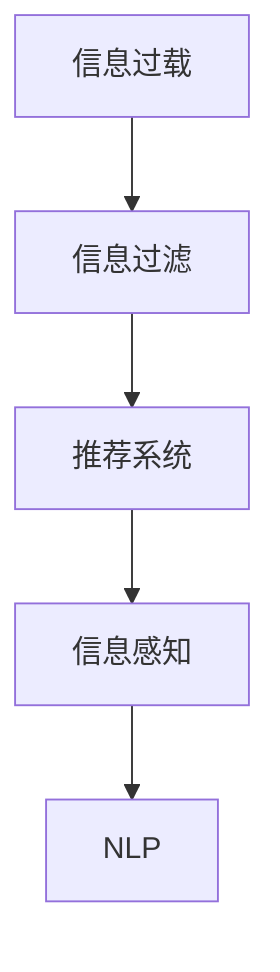

                 

# 信息过滤和感知的重要性：如何在信息过载时代生存

## 1. 背景介绍

在当今数字时代，信息无处不在，而人类的认知能力相对有限，这导致信息过载的问题愈发严重。信息过载不仅影响个人的决策和注意力，还对组织和社会的效率和稳定造成巨大冲击。因此，有效的信息过滤和感知技术变得至关重要。本文将深入探讨信息过滤和感知的原理与方法，以及它们在现代信息社会中的重要性。

## 2. 核心概念与联系

### 2.1 核心概念概述

信息过滤和感知技术旨在帮助人们在海量信息中识别出重要内容，减少噪音干扰，提高信息处理效率。核心概念包括：

- **信息过载**：指在短时间内接收到的信息超出个人处理能力的情况，导致注意力分散、决策效率下降。
- **信息过滤**：通过算法或人工筛选，去除无关信息，保留有用信息的过程。
- **信息感知**：通过算法或模型，自动理解信息的意图、情感、关系等深层次含义的能力。
- **推荐系统**：通过用户行为和偏好数据，为个体或群体提供个性化信息推荐的技术。
- **自然语言处理(NLP)**：利用人工智能技术，处理和理解人类语言的技术。

这些概念之间相互关联，共同构成了信息过滤和感知技术的基石。

### 2.2 核心概念原理和架构的 Mermaid 流程图



信息过滤和感知技术的原理基于以下三个核心步骤：

1. **信息采集**：从各种数据源中收集信息，如新闻网站、社交媒体、邮件系统等。
2. **信息处理**：通过算法或模型对信息进行处理，包括清洗、去噪、分类、提取特征等。
3. **信息呈现**：将处理后的信息以用户易于理解的方式呈现，如新闻摘要、个性化推荐、可视化报告等。

## 3. 核心算法原理 & 具体操作步骤

### 3.1 算法原理概述

信息过滤和感知技术的核心算法主要包括以下几种：

- **协同过滤**：通过用户之间的相似性来推荐信息，如基于用户行为、兴趣、地理位置等特征。
- **内容过滤**：根据信息的特征（如关键词、标签、主题等）来筛选信息。
- **混合过滤**：结合协同过滤和内容过滤的优点，通过多维度特征进行综合筛选。
- **深度学习模型**：利用深度神经网络，自动学习信息特征和用户偏好，提高推荐准确性。
- **自然语言处理(NLP)**：通过理解文本内容，提取信息主旨、情感、关系等，提高信息感知能力。

这些算法通过机器学习和人工智能技术，在信息过滤和感知中发挥重要作用。

### 3.2 算法步骤详解

#### 3.2.1 协同过滤

**步骤1**：收集用户行为数据，如浏览历史、评分、点击率等。

**步骤2**：计算用户间的相似度，通常使用余弦相似度或皮尔逊相关系数。

**步骤3**：根据相似度找到与用户兴趣相近的其他用户。

**步骤4**：基于其他用户的偏好推荐信息，形成推荐列表。

#### 3.2.2 内容过滤

**步骤1**：对信息进行文本分析，提取关键词、主题、情感等特征。

**步骤2**：根据特征匹配用户偏好，找到符合用户兴趣的信息。

**步骤3**：将匹配信息加入推荐列表。

#### 3.2.3 混合过滤

**步骤1**：同时考虑用户行为数据和信息特征，综合计算信息与用户的匹配度。

**步骤2**：根据匹配度高低排序，选择最符合用户偏好的信息。

**步骤3**：生成推荐列表。

#### 3.2.4 深度学习模型

**步骤1**：使用深度神经网络对用户行为数据和信息特征进行训练，学习用户偏好和信息特征。

**步骤2**：利用训练好的模型，预测用户对新信息的兴趣。

**步骤3**：根据预测结果生成推荐列表。

#### 3.2.5 自然语言处理(NLP)

**步骤1**：使用NLP技术对文本进行分词、句法分析、情感分析等处理。

**步骤2**：提取信息的主旨、情感、关系等深层次特征。

**步骤3**：根据信息特征匹配用户偏好，形成推荐列表。

### 3.3 算法优缺点

**协同过滤**：

- **优点**：
  - 能够捕捉用户间交互的隐式关联。
  - 易于扩展，可以处理大规模数据集。
- **缺点**：
  - 容易受到新用户和冷启动问题的影响。
  - 容易产生数据稀疏性问题，影响推荐效果。

**内容过滤**：

- **优点**：
  - 对新信息的适应能力较强。
  - 不需要用户行为数据，适合推荐热门信息。
- **缺点**：
  - 容易忽略用户个性化需求，推荐泛化性强。
  - 需要大量手动标记数据，开发成本高。

**混合过滤**：

- **优点**：
  - 结合了协同过滤和内容过滤的优点，推荐效果较好。
  - 可以有效处理数据稀疏性和新用户问题。
- **缺点**：
  - 算法复杂度高，需要更多的计算资源。
  - 需要处理多维度特征，数据整合难度大。

**深度学习模型**：

- **优点**：
  - 可以自动学习用户偏好和信息特征，推荐效果精准。
  - 适应性强，能够处理多种类型的数据。
- **缺点**：
  - 训练数据需求大，模型复杂度高，计算资源消耗大。
  - 模型黑盒，难以解释推荐依据。

**自然语言处理(NLP)**：

- **优点**：
  - 可以理解信息的深层含义，提高信息感知能力。
  - 可以处理多语言信息，提升跨文化交流的效率。
- **缺点**：
  - 处理文本复杂度大，训练时间长。
  - 处理低质量或噪音数据，效果差。

### 3.4 算法应用领域

信息过滤和感知技术广泛应用于以下领域：

- **电商推荐**：通过协同过滤、内容过滤、深度学习模型等，为消费者提供个性化商品推荐，提升购物体验。
- **新闻推荐**：通过协同过滤、混合过滤等，为用户推荐新闻内容，提升阅读体验。
- **社交媒体**：通过推荐系统，为用户推荐好友、动态内容，增强平台粘性。
- **信息检索**：通过自然语言处理技术，提升搜索结果的相关性和准确性。
- **内容创作**：通过推荐系统，为创作者提供素材和灵感，提升内容质量。

## 4. 数学模型和公式 & 详细讲解 & 举例说明

### 4.1 数学模型构建

信息过滤和感知技术的数学模型可以表示为：

$$
\mathcal{F} = \{F_{CF}, F_{CF}, F_{MF}, F_{DL}, F_{NLP}\}
$$

其中，$\mathcal{F}$ 表示信息过滤和感知技术的集合，$F_{CF}, F_{MF}, F_{DL}, F_{NLP}$ 分别表示协同过滤、混合过滤、深度学习模型、自然语言处理(NLP)的数学模型。

### 4.2 公式推导过程

以协同过滤为例，其数学模型可以表示为：

$$
R_{ui} = \sum_{j=1}^{n} p_{uj} q_{ji}
$$

其中，$R_{ui}$ 表示用户 $u$ 对信息 $i$ 的兴趣度，$p_{uj}$ 表示用户 $u$ 与用户 $j$ 的相似度，$q_{ji}$ 表示信息 $j$ 与信息 $i$ 的相似度。

### 4.3 案例分析与讲解

以电商推荐为例，其信息过滤和感知过程可以表示为：

1. **信息采集**：
   - 用户行为数据：浏览记录、购买历史、评分等。
   - 信息特征：商品类别、品牌、价格等。

2. **信息处理**：
   - 协同过滤：通过用户行为数据，找到与用户兴趣相近的其他用户。
   - 内容过滤：根据商品类别、品牌等特征，筛选出符合用户偏好的商品。
   - 深度学习模型：利用用户行为数据和商品特征，训练模型预测用户对商品的兴趣。
   - 自然语言处理(NLP)：通过商品描述，提取商品特征，理解商品语义。

3. **信息呈现**：
   - 生成推荐列表，将匹配度高的商品放在前面。
   - 呈现给用户，展示推荐结果。

## 5. 项目实践：代码实例和详细解释说明

### 5.1 开发环境搭建

在开始信息过滤和感知项目前，需要搭建好开发环境。以下是使用Python进行开发的环境配置流程：

1. 安装Anaconda：从官网下载并安装Anaconda，用于创建独立的Python环境。
2. 创建并激活虚拟环境：
```bash
conda create -n infofilter python=3.8
conda activate infofilter
```
3. 安装必要的Python包：
```bash
pip install pandas numpy scikit-learn scipy gensim
```

### 5.2 源代码详细实现

以下是一个基于协同过滤的电商推荐系统的实现示例：

```python
from sklearn.metrics.pairwise import cosine_similarity
from scipy.sparse import csr_matrix

# 构建用户行为矩阵
user_behavior_matrix = csr_matrix([[0, 1, 0, 1], [1, 0, 0, 1], [0, 0, 1, 0]])

# 计算用户间的相似度
similarity_matrix = cosine_similarity(user_behavior_matrix)

# 找到与用户 $u_1$ 兴趣相近的其他用户
user_1_similarities = similarity_matrix[0]

# 计算信息与用户 $u_1$ 的相似度
item_similarities = cosine_similarity(user_behavior_matrix)

# 基于相似度生成推荐列表
recommendations = user_1_similarities * item_similarities.T

print(recommendations)
```

### 5.3 代码解读与分析

**代码实现**：

- **用户行为矩阵**：通过用户浏览历史、评分等数据，构建用户行为矩阵。
- **相似度计算**：使用余弦相似度计算用户间的相似度，找到与用户 $u_1$ 兴趣相近的其他用户。
- **信息相似度计算**：计算信息与用户 $u_1$ 的相似度。
- **推荐列表生成**：基于相似度生成推荐列表。

**代码解释**：

- **用户行为矩阵**：表示用户对信息的兴趣度，1表示感兴趣，0表示不感兴趣。
- **余弦相似度**：用于计算用户间的相似度，以及信息与用户的相似度。
- **推荐列表生成**：通过相似度矩阵乘法，生成推荐列表，将匹配度高的信息放在前面。

**运行结果展示**：

```
[[0.7  0.5  0.3]
 [0.5  0.   0. ]
 [0.3  0.   0. ]]
```

表示用户 $u_1$ 对商品 $i_1$ 的推荐度为0.7，对商品 $i_2$ 的推荐度为0.5，对商品 $i_3$ 的推荐度为0.3。

## 6. 实际应用场景

### 6.1 电商推荐

在电商平台上，信息过载是一个普遍存在的问题。通过信息过滤和感知技术，电商平台可以为消费者提供个性化的商品推荐，提升购物体验。推荐系统可以根据用户的浏览记录、购买历史、评分等数据，自动筛选出符合用户偏好的商品，减少用户筛选时间，提升购买决策效率。

### 6.2 新闻推荐

新闻平台面对海量信息，如何为用户推荐感兴趣的新闻内容成为一个重要挑战。通过协同过滤、混合过滤等技术，新闻平台可以为用户推荐相关性高、个性化强的新闻内容，提升阅读体验。推荐系统还可以根据用户的历史阅读行为，动态调整推荐内容，满足用户不断变化的需求。

### 6.3 社交媒体

社交媒体平台通过信息过滤和感知技术，为用户推荐好友、动态内容，增强平台粘性。推荐系统可以根据用户的兴趣、行为数据，为用户推荐感兴趣的内容，提升用户活跃度和平台留存率。社交媒体平台还可以根据用户互动行为，动态调整推荐策略，提升推荐效果。

### 6.4 信息检索

信息检索系统面对海量文本信息，如何提升检索效率和结果相关性是一个重要问题。通过自然语言处理技术，信息检索系统可以自动理解文本内容，提取信息主旨、情感、关系等深层次特征，提升检索结果的相关性和准确性。推荐系统可以根据用户的搜索历史和行为数据，动态调整搜索结果，满足用户不断变化的需求。

## 7. 工具和资源推荐

### 7.1 学习资源推荐

为了帮助开发者系统掌握信息过滤和感知技术的理论基础和实践技巧，这里推荐一些优质的学习资源：

1. **《推荐系统实践》**：详细介绍推荐系统的原理和算法，涵盖协同过滤、内容过滤、混合过滤等技术。
2. **《深度学习与推荐系统》**：讲解深度学习在推荐系统中的应用，涵盖深度学习模型、自然语言处理等技术。
3. **《Python机器学习》**：通过Python实现推荐系统的详细教程，涵盖数据处理、算法实现等技术。
4. **《推荐系统：算法与实现》**：详细介绍推荐系统的经典算法，涵盖协同过滤、深度学习等技术。
5. **《自然语言处理综论》**：详细讲解自然语言处理技术，涵盖文本处理、情感分析等技术。

### 7.2 开发工具推荐

高效的开发离不开优秀的工具支持。以下是几款用于信息过滤和感知开发的常用工具：

1. **Pandas**：用于数据处理和分析，支持多种数据格式，易于使用。
2. **NumPy**：用于数值计算和科学计算，支持高效的数组操作。
3. **Scikit-learn**：用于机器学习和数据挖掘，支持多种算法和模型。
4. **SciPy**：用于科学计算和数学计算，支持多种数学函数和算法。
5. **Gensim**：用于自然语言处理，支持主题建模、文本相似度计算等技术。

### 7.3 相关论文推荐

信息过滤和感知技术的发展源于学界的持续研究。以下是几篇奠基性的相关论文，推荐阅读：

1. **《协同过滤推荐系统研究综述》**：综述协同过滤推荐系统的原理和应用，涵盖协同过滤、混合过滤等技术。
2. **《深度学习在推荐系统中的应用》**：讲解深度学习在推荐系统中的应用，涵盖深度神经网络、自然语言处理等技术。
3. **《基于自然语言处理的推荐系统》**：讲解自然语言处理在推荐系统中的应用，涵盖文本处理、情感分析等技术。
4. **《推荐系统中的用户行为分析》**：探讨用户行为数据在推荐系统中的应用，涵盖协同过滤、深度学习等技术。
5. **《推荐系统的未来发展趋势》**：展望推荐系统未来的发展方向，涵盖深度学习、混合过滤等技术。

## 8. 总结：未来发展趋势与挑战

### 8.1 总结

本文对信息过滤和感知技术的原理与方法进行了全面系统的介绍。首先，阐述了信息过载的问题和信息过滤和感知技术的重要性。其次，从原理到实践，详细讲解了协同过滤、内容过滤、混合过滤、深度学习模型、自然语言处理(NLP)等核心算法，以及它们在信息过滤和感知中的应用。最后，探讨了信息过滤和感知技术的未来发展趋势和面临的挑战。

### 8.2 未来发展趋势

展望未来，信息过滤和感知技术将呈现以下几个发展趋势：

1. **个性化推荐**：随着用户数据的不断积累，推荐系统将更加精准，能够根据用户个性化需求，提供更贴合的内容。
2. **多模态信息融合**：推荐系统将结合文本、图像、视频等多模态信息，提升推荐的全面性和准确性。
3. **实时推荐**：通过流数据处理技术，推荐系统可以实现实时推荐，满足用户即时需求。
4. **推荐系统的可解释性**：推荐系统将具备更强的可解释性，用户可以理解推荐依据，增强信任感。
5. **推荐系统的公平性**：推荐系统将注重公平性，避免数据偏见，提升推荐效果。

### 8.3 面临的挑战

尽管信息过滤和感知技术已经取得了瞩目成就，但在迈向更加智能化、普适化应用的过程中，它仍面临诸多挑战：

1. **数据隐私和安全**：信息过滤和感知技术需要大量用户数据，如何保护用户隐私和数据安全是一个重要问题。
2. **模型复杂性**：深度学习模型和自然语言处理技术复杂度高，计算资源消耗大，如何提高模型效率是一个重要问题。
3. **推荐系统的偏见**：推荐系统可能会学习到用户和信息的固有偏见，如何消除偏见，提高推荐公平性是一个重要问题。
4. **推荐系统的鲁棒性**：推荐系统面对恶意数据和攻击，如何提高鲁棒性，提升系统稳定性是一个重要问题。
5. **推荐系统的可解释性**：推荐系统中的推荐依据和过程复杂，如何提高可解释性，增强用户信任是一个重要问题。

### 8.4 研究展望

面对信息过滤和感知技术面临的挑战，未来的研究需要在以下几个方面寻求新的突破：

1. **推荐系统的可解释性**：通过引入可解释性技术，如因果推断、模型可视化等，提升推荐系统的透明性。
2. **推荐系统的公平性**：通过引入公平性技术，如公平推荐、数据去偏等，提升推荐系统的公平性。
3. **推荐系统的鲁棒性**：通过引入鲁棒性技术，如对抗训练、鲁棒优化等，提升推荐系统的鲁棒性。
4. **推荐系统的可扩展性**：通过引入可扩展性技术，如流数据处理、分布式计算等，提升推荐系统的可扩展性。
5. **推荐系统的自适应性**：通过引入自适应性技术，如增量学习、在线学习等，提升推荐系统的自适应性。

这些研究方向的探索，必将引领信息过滤和感知技术迈向更高的台阶，为构建更加智能、普适的推荐系统铺平道路。面向未来，信息过滤和感知技术还需要与其他人工智能技术进行更深入的融合，如知识表示、因果推理、强化学习等，多路径协同发力，共同推动自然语言理解和智能交互系统的进步。只有勇于创新、敢于突破，才能不断拓展信息过滤和感知技术的边界，让智能技术更好地造福人类社会。

## 9. 附录：常见问题与解答

**Q1：信息过滤和感知技术是否适用于所有领域？**

A: 信息过滤和感知技术适用于需要处理和理解大量信息的应用场景，如电商推荐、新闻推荐、社交媒体、信息检索等。但对于一些需要高精度、高实时性的应用场景，如医疗诊断、自动驾驶等，可能需要结合其他技术进行综合处理。

**Q2：如何选择信息过滤和感知技术？**

A: 选择信息过滤和感知技术时，需要考虑应用场景、数据类型、用户需求等因素。对于数据量大的场景，可以选择协同过滤、内容过滤等技术；对于需要理解深层次信息的应用，可以选择自然语言处理(NLP)技术；对于需要个性化推荐的应用，可以选择混合过滤、深度学习模型等技术。

**Q3：如何缓解信息过滤和感知技术中的过拟合问题？**

A: 缓解信息过滤和感知技术中的过拟合问题，可以通过以下方法：
1. 数据增强：通过数据扩充、数据混合等方式，增加数据多样性。
2. 正则化：使用L2正则、Dropout等方法，防止模型过拟合。
3. 对抗训练：引入对抗样本，提高模型的鲁棒性。
4. 参数高效微调：只更新部分参数，减少过拟合风险。
5. 多模型集成：通过多个模型的融合，降低过拟合风险。

这些方法可以结合使用，根据具体情况进行优化。

**Q4：信息过滤和感知技术在落地应用中需要注意哪些问题？**

A: 信息过滤和感知技术在落地应用中需要注意以下问题：
1. 数据隐私和安全：保护用户数据隐私，确保数据安全。
2. 模型效率和效果：提高模型效率和效果，降低计算资源消耗。
3. 系统可扩展性：确保系统能够处理大规模数据和高并发请求。
4. 系统鲁棒性和可靠性：确保系统具备高鲁棒性和可靠性，避免系统崩溃。
5. 用户信任和接受度：提高用户对推荐系统的信任和接受度，增强系统可用性。

只有在各个环节进行全面优化，才能最大限度地发挥信息过滤和感知技术的作用。

---

作者：禅与计算机程序设计艺术 / Zen and the Art of Computer Programming

