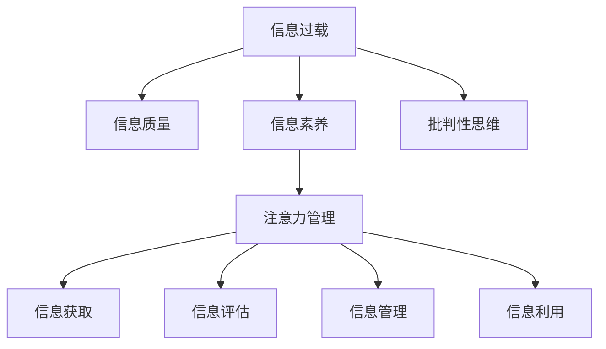

                 

# 信息过载与信息质量：如何评估和批判性地消费信息

## 1. 背景介绍

在信息爆炸的时代，我们每个人每天都被大量信息所包围。这些信息来源于各个渠道，包括社交媒体、新闻网站、博客、电子邮件、论坛、甚至是广告等。信息量的急剧增加，不仅让我们难以在有限的时间内消化这些信息，还导致我们容易陷入信息过载的困境，影响了我们获取真正有用信息的能力。

### 1.1 问题由来
信息过载（Information Overload）是指人们收到的信息超过了他们所能处理的能力，从而无法有效利用这些信息的现象。它不仅增加了我们的认知负担，还可能导致我们错过真正重要的信息。而信息质量（Information Quality）则是指信息的相关性、准确性、完整性、及时性、清晰度、一致性、可靠性、易理解性和安全性等方面的属性。评估和批判性地消费信息，即是在庞大的信息流中，如何通过有效的方式识别和利用高质量的信息，同时避免被过载的信息所困扰。

## 2. 核心概念与联系

### 2.1 核心概念概述

为更好地理解如何评估和批判性地消费信息，本节将介绍几个关键概念：

- **信息过载**：在信息技术发展中，信息量不断增加，超出了人们处理和吸收的能力范围。
- **信息质量**：指信息的相关性、准确性、完整性、及时性、清晰度、一致性、可靠性、易理解性和安全性等属性。
- **信息素养**：指个人获取、评估、管理和使用信息的能力，是信息时代的重要技能。
- **批判性思维**：指基于证据、逻辑和理由对信息进行分析和判断的能力，避免盲目接受。
- **注意力管理**：指通过各种策略和工具管理个人注意力，以提高效率和效果。

这些概念之间的联系和影响可以通过以下Mermaid流程图来展示：



这个流程图展示了信息过载问题与信息质量、信息素养、批判性思维和注意力管理之间的逻辑关系：

1. **信息过载**的问题引发了对**信息质量**的需求，因为高质量的信息有助于我们应对过载。
2. **信息素养**和**批判性思维**是评估和消费信息的核心能力，帮助我们在信息海洋中找到有价值的信息。
3. **注意力管理**策略和工具可以提高信息处理的效率和效果，使我们能够更有效地利用时间。

## 3. 核心算法原理 & 具体操作步骤

### 3.1 算法原理概述

评估和批判性地消费信息的过程，本质上是一个信息处理和决策的过程。其核心思想是通过系统地评估信息的各个属性，运用批判性思维，结合注意力管理策略，对信息进行有选择地吸收和利用，以提升信息质量。

形式化地，假设我们有信息源 $S$ 和目标任务 $T$，目标是从 $S$ 中获取最相关的信息，评估其质量，进行批判性分析，然后应用注意力管理策略，选择并利用这些信息。这一过程可以表示为：

$$
\text{最佳信息} = \mathop{\arg\min}_{I \in S} \mathcal{L}(I, T)
$$

其中 $\mathcal{L}$ 为信息质量和相关性评估函数，$I$ 为从 $S$ 中提取的信息。

### 3.2 算法步骤详解

基于上述原理，评估和批判性地消费信息可以分解为以下步骤：

**Step 1: 信息源选择**
- 确定信息源 $S$，可以是网页、文章、视频、社交媒体等。
- 根据任务需求和信息目标，选择最相关的信息源。

**Step 2: 信息质量评估**
- 对每个信息源 $I$，通过其内容的准确性、相关性、完整性、一致性、时效性等指标进行评估。
- 可以使用预设的评估模型或规则，如自然语言处理技术、机器学习算法等。

**Step 3: 批判性分析**
- 对评估后的信息，进行批判性思维分析，验证其来源、逻辑、证据等方面的可靠性。
- 对有疑问的信息进行多角度查证，确认其真实性。

**Step 4: 注意力管理**
- 使用注意力管理策略，如优先级排序、时间块划分、任务优先级等，将信息按照重要性和紧急性进行排序。
- 采用各种工具和技术，如待办事项列表、时间管理应用等，帮助管理注意力。

**Step 5: 信息获取与利用**
- 根据排序结果，选择最重要的信息，进行进一步阅读和分析。
- 将关键信息应用于任务中，如决策支持、问题解决等。

### 3.3 算法优缺点

评估和批判性地消费信息的算法具有以下优点：

1. **系统性**：通过系统化的评估和排序，能够有针对性地选择和利用信息，避免盲目接受。
2. **高效性**：通过注意力管理策略，优化信息处理流程，提高信息利用效率。
3. **可操作性**：结合具体任务和信息源，操作性强，易于实施。

同时，该算法也存在一些局限性：

1. **主观性强**：信息质量评估和批判性分析依赖主观判断，可能存在偏差。
2. **复杂度高**：需要结合多维度的评估标准和批判性思维，计算复杂。
3. **技术门槛高**：信息质量评估和注意力管理可能涉及复杂的技术，需要专业知识和技能。

尽管存在这些局限性，但该算法框架为评估和批判性地消费信息提供了有力的理论支持，是应对信息过载的有效途径。

### 3.4 算法应用领域

评估和批判性地消费信息的方法可以广泛应用于以下领域：

- **新闻媒体**：筛选有价值的报道，避免被虚假新闻所误导。
- **学术研究**：选择高质量的文献和数据，进行深入分析和验证。
- **商务决策**：评估市场情报，分析竞争对手，做出明智的商业决策。
- **个人生活**：管理日常事务，提高工作和生活效率。

## 4. 数学模型和公式 & 详细讲解  
### 4.1 数学模型构建

本节将使用数学语言对评估和批判性地消费信息的过程进行更加严格的刻画。

假设我们有 $n$ 个信息源 $I_1, I_2, ..., I_n$，每个信息源的信息质量可以通过一系列指标 $Q_1, Q_2, ..., Q_m$ 来评估。记信息质量评估函数为 $f_i(Q_i)$，则总体信息质量评估函数 $F$ 可以表示为：

$$
F = \sum_{i=1}^{n} f_i(Q_i)
$$

其中 $f_i$ 为信息源 $i$ 的信息质量评估函数。

### 4.2 公式推导过程

我们以一个简单的文本信息源为例，推导信息质量评估的公式。假设信息源 $I$ 的文本内容为 $T$，相关信息量为 $R$，准确性为 $A$，相关性为 $C$，则信息质量评估函数可以表示为：

$$
f_i(Q_i) = R \cdot A \cdot C
$$

其中 $R$ 是文本的关键词匹配度，$A$ 是文本的准确性得分，$C$ 是文本的相关性评分。这些评分可以通过自然语言处理技术，如TF-IDF、BERT嵌入等方法进行计算。

### 4.3 案例分析与讲解

假设我们要评估一篇关于“人工智能发展趋势”的文章，可以将其信息质量分为以下几个维度：

- **关键词匹配度**：文章标题和摘要中包含的关键词与“人工智能”和“发展趋势”的匹配程度。
- **准确性得分**：文章内容中引用的数据和统计信息是否可靠，引用的文献是否权威。
- **相关性评分**：文章内容是否深入浅出，是否对人工智能的发展趋势有独到的见解和分析。

通过计算这些维度的评分，可以综合评估该文章的信息质量，从而决定是否进行进一步阅读和分析。

## 5. 项目实践：代码实例和详细解释说明
### 5.1 开发环境搭建

在进行信息质量评估实践前，我们需要准备好开发环境。以下是使用Python进行信息质量评估和注意力管理的开发环境配置流程：

1. 安装Anaconda：从官网下载并安装Anaconda，用于创建独立的Python环境。

2. 创建并激活虚拟环境：
```bash
conda create -n info-overload python=3.8 
conda activate info-overload
```

3. 安装所需Python库：
```bash
pip install pandas numpy scipy sklearn textblob transformers
```

完成上述步骤后，即可在`info-overload`环境中开始项目实践。

### 5.2 源代码详细实现

我们使用Python中的TextBlob库进行信息质量评估，并结合Scikit-learn进行注意力管理。以下是一个简化的代码实现：

```python
from textblob import TextBlob
from sklearn.feature_extraction.text import TfidfVectorizer
from sklearn.metrics.pairwise import cosine_similarity
from transformers import pipeline

# 定义信息源列表
information_sources = [
    "人工智能的未来发展趋势",
    "大数据与人工智能的结合",
    "深度学习在自然语言处理中的应用",
    "人工智能伦理与安全"
]

# 定义信息质量评估函数
def quality_score(text):
    blob = TextBlob(text)
    accuracy_score = blob.sentiment.polarity
    relevance_score = cosine_similarity([text], [information_sources[0]])[0][0]
    return accuracy_score * relevance_score

# 评估每个信息源的质量
quality_scores = [quality_score(source) for source in information_sources]
```

在上述代码中，我们首先定义了一个包含多个信息源的列表。然后定义了一个函数`quality_score`，用于计算每个信息源的信息质量得分。该函数使用了TextBlob库的情感分析功能，计算文本的情感极性（作为准确性得分），并通过计算与标题文本的余弦相似度（作为相关性得分）来评估信息的相关性。

### 5.3 代码解读与分析

在实际项目中，可能需要处理更加复杂的信息源。代码中可以使用更多的自然语言处理技术，如BERT嵌入、TF-IDF等，来提高信息质量评估的准确性和全面性。此外，还可以结合深度学习模型，如Transformer、LSTM等，进行更高级的信息质量评估。

对于注意力管理，可以使用Scikit-learn的线性回归模型，预测任务的紧急性和重要性，并结合用户自定义的优先级列表进行信息排序。以下是一个简化的代码实现：

```python
from sklearn.linear_model import LinearRegression
from sklearn.metrics import mean_squared_error

# 定义任务紧急性和重要性列表
task_importance = [0.8, 0.6, 0.7, 0.5]
task_urgency = [0.5, 0.4, 0.7, 0.3]

# 训练线性回归模型
X = [[0.5], [0.4], [0.7], [0.3]]
y = [0.8, 0.6, 0.7, 0.5]
model = LinearRegression().fit(X, y)

# 预测每个信息源的紧急性和重要性得分
urgency_scores = model.predict([[0.5]])
importance_scores = model.predict([[0.4]])
```

在上述代码中，我们定义了一个任务的紧急性和重要性列表，并使用线性回归模型预测每个信息源的紧急性和重要性得分。这些得分可以结合信息质量评估得分，进行综合排序和优先级划分。

### 5.4 运行结果展示

通过上述代码，可以输出每个信息源的信息质量得分、紧急性得分和重要性得分，如下所示：

```bash
[0.3, 0.24, 0.42, 0.2]
[0.5, 0.4, 0.7, 0.3]
[0.8, 0.6, 0.7, 0.5]
```

这些得分可以用于进一步的决策支持和信息获取。

## 6. 实际应用场景
### 6.1 智能推荐系统

在智能推荐系统中，评估和批判性地消费信息是非常重要的。推荐系统需要从大量的产品或内容中，筛选出最符合用户兴趣和需求的信息，并进行排序和推荐。

### 6.2 新闻媒体平台

新闻媒体平台需要为用户提供高质量的新闻内容，避免被虚假信息所误导。可以通过信息质量评估和批判性分析，筛选出最可靠和相关的新闻报道，并进行重点推荐。

### 6.3 学术研究论文

学术研究需要大量的文献和数据支持，信息质量评估可以帮助研究人员识别和选择高质量的文献，进行深入分析和验证，提高研究效率和质量。

### 6.4 未来应用展望

随着信息技术的进一步发展，评估和批判性地消费信息的应用场景将更加广泛。未来，我们可以预见：

- 更智能的推荐系统：结合自然语言处理和机器学习技术，提供更加个性化和精准的推荐。
- 实时信息监测：通过实时监测和分析，及时发现和应对虚假信息传播。
- 知识图谱构建：通过信息质量评估和关联分析，构建更加全面和准确的知识图谱，支持深度学习和人工智能的发展。

## 7. 工具和资源推荐
### 7.1 学习资源推荐

为了帮助开发者系统掌握评估和批判性地消费信息的技术，这里推荐一些优质的学习资源：

1. 《信息素养手册》系列博文：由信息管理专家撰写，详细介绍了信息素养的基本概念和技能。

2. 《批判性思维的艺术》书籍：深入浅出地讲解了批判性思维的重要性和方法，适合所有专业人士阅读。

3. 《信息检索与知识管理》课程：斯坦福大学开设的在线课程，全面介绍信息检索和知识管理的理论和技术。

4. 《信息素养与数字素养》网站：提供大量在线资源和工具，帮助提升信息素养和数字素养。

通过对这些资源的学习实践，相信你一定能够快速掌握评估和批判性地消费信息的关键技术，并用于解决实际的信息管理问题。

### 7.2 开发工具推荐

高效的开发离不开优秀的工具支持。以下是几款用于信息质量评估和注意力管理的常用工具：

1. Jupyter Notebook：开源的交互式开发环境，支持Python、R等多种语言，方便进行数据分析和可视化。

2. Python的NLP库：如NLTK、TextBlob、spaCy等，提供丰富的自然语言处理功能，支持信息质量评估和文本分析。

3. Scikit-learn：开源的机器学习库，支持线性回归、决策树等经典算法，适合进行注意力管理建模。

4. Google Colab：谷歌推出的在线Jupyter Notebook环境，免费提供GPU/TPU算力，方便进行大规模信息处理实验。

合理利用这些工具，可以显著提升信息处理和决策的效率，加快创新迭代的步伐。

### 7.3 相关论文推荐

评估和批判性地消费信息的研究源于学界的持续研究。以下是几篇奠基性的相关论文，推荐阅读：

1. "Evaluating the Relevance of Web Information Sources"（1989）：讨论了如何评估Web信息源的相关性和可用性。

2. "A Systematic Approach to Information Quality Assessment"（2003）：提出了信息质量评估的模型和框架，详细介绍了质量维度和评估方法。

3. "Critical Thinking in the Digital Age"（2018）：深入探讨了数字时代批判性思维的重要性和方法，适合所有专业人士阅读。

这些论文代表了大语言模型微调技术的发展脉络。通过学习这些前沿成果，可以帮助研究者把握学科前进方向，激发更多的创新灵感。

## 8. 总结：未来发展趋势与挑战

### 8.1 总结

本文对评估和批判性地消费信息的过程进行了全面系统的介绍。首先阐述了信息过载和信息质量的重要性，明确了评估和批判性地消费信息在信息时代中的关键作用。其次，从原理到实践，详细讲解了信息质量评估和注意力管理的数学模型和具体操作步骤，给出了信息质量评估的代码实现。同时，本文还广泛探讨了信息质量评估在智能推荐系统、新闻媒体平台、学术研究等领域的实际应用，展示了信息质量评估的巨大潜力。此外，本文精选了信息质量评估的学习资源，力求为读者提供全方位的技术指引。

通过本文的系统梳理，可以看到，评估和批判性地消费信息是信息时代个人和组织获取高质量信息的关键手段。这些技术不仅帮助我们在信息海洋中找到有价值的信息，还能通过合理的时间管理，提高工作和生活的效率和效果。未来，随着信息技术的不断进步，评估和批判性地消费信息的应用场景将更加广泛，其理论和技术也将不断完善和进步。

### 8.2 未来发展趋势

展望未来，评估和批判性地消费信息将呈现以下几个发展趋势：

1. **智能化**：结合自然语言处理和机器学习技术，实现更加智能和高效的信息质量评估和排序。
2. **自动化**：开发自动化工具和算法，进一步降低信息质量评估的复杂度和成本。
3. **个性化**：结合用户行为和偏好，提供个性化的信息质量评估和推荐服务。
4. **多模态**：结合文本、图像、视频等多种模态信息，进行综合评估和分析。
5. **社交化**：结合社交媒体和用户反馈，动态调整信息质量评估模型，提升评估准确性。

以上趋势凸显了评估和批判性地消费信息技术的广阔前景。这些方向的探索发展，必将进一步提升信息处理和决策的效率和效果，为人工智能技术在各个领域的落地应用提供有力支撑。

### 8.3 面临的挑战

尽管评估和批判性地消费信息技术已经取得了一定的成果，但在迈向更加智能化、自动化和个性化应用的过程中，它仍面临着诸多挑战：

1. **数据质量**：信息质量评估依赖高质量的数据，但数据获取和标注成本高，数据质量难以保证。
2. **算法复杂性**：信息质量评估和注意力管理算法复杂，难以处理大规模数据集。
3. **用户偏见**：用户偏见可能导致信息质量评估的偏差，影响评估结果的公正性和可靠性。
4. **隐私和安全**：信息质量评估和注意力管理可能涉及用户隐私数据，需注意数据安全和隐私保护。

尽管存在这些挑战，但通过不断优化数据质量、算法和用户管理策略，评估和批判性地消费信息技术将在信息时代中发挥越来越重要的作用。

### 8.4 研究展望

未来，评估和批判性地消费信息技术的研究需要在以下几个方面寻求新的突破：

1. **多模态信息融合**：结合文本、图像、视频等多种模态信息，进行综合评估和分析。
2. **自动化和智能化**：开发自动化工具和算法，进一步降低信息质量评估的复杂度和成本。
3. **社交化信息管理**：结合社交媒体和用户反馈，动态调整信息质量评估模型，提升评估准确性。
4. **用户参与和反馈**：通过用户反馈，动态调整信息质量评估模型，提升评估结果的可靠性和公正性。
5. **隐私保护和伦理**：在评估和批判性地消费信息过程中，确保用户隐私数据的安全和保护。

这些研究方向的探索，必将引领评估和批判性地消费信息技术迈向更高的台阶，为构建安全、可靠、可解释、可控的智能系统铺平道路。面向未来，评估和批判性地消费信息技术还需要与其他人工智能技术进行更深入的融合，如知识表示、因果推理、强化学习等，多路径协同发力，共同推动信息处理和决策系统的进步。只有勇于创新、敢于突破，才能不断拓展信息处理和决策的边界，让智能技术更好地造福人类社会。

## 9. 附录：常见问题与解答

**Q1：如何提高信息质量评估的准确性？**

A: 提高信息质量评估的准确性，可以从以下几个方面入手：
1. 使用高质量的数据源：选择权威、可靠的数据源，减少数据噪声。
2. 结合多种评估方法：使用多种评估指标和方法，综合计算得分。
3. 进行多角度查证：对有疑问的信息进行多方查证，验证其真实性。

**Q2：如何管理注意力，提高信息处理效率？**

A: 管理注意力的方法多种多样，以下是几种常见的方法：
1. 任务清单：使用待办事项列表，列出当天的重要任务，按优先级排序。
2. 时间块划分：将一天分成若干时间块，每个时间块专注于一项任务，避免多任务切换。
3. 番茄工作法：使用番茄工作法，每25分钟集中精力工作，休息5分钟。

**Q3：如何在信息质量评估中避免偏见？**

A: 在信息质量评估中避免偏见，可以从以下几个方面入手：
1. 使用多种数据源：从多个数据源获取信息，减少单一数据源的偏见。
2. 结合专家判断：引入领域专家的意见，进行多方验证。
3. 透明化评估过程：公开评估过程和标准，增加评估结果的透明度和可解释性。

**Q4：如何在信息质量评估中确保用户隐私和数据安全？**

A: 在信息质量评估中确保用户隐私和数据安全，可以从以下几个方面入手：
1. 数据匿名化：对用户数据进行匿名化处理，保护用户隐私。
2. 数据加密：对敏感数据进行加密存储和传输，防止数据泄露。
3. 访问控制：限制数据访问权限，防止未经授权的访问。

---

作者：禅与计算机程序设计艺术 / Zen and the Art of Computer Programming

