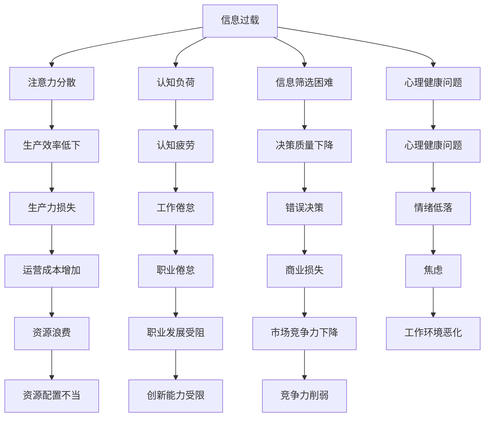

                 

# 信息过载与注意力经济：在数字时代管理你的时间和注意力

## 1. 背景介绍

### 1.1 问题由来
随着互联网和移动互联网技术的飞速发展，人们获取信息的渠道日益丰富，信息量呈爆炸式增长。据统计，全球每天产生的新数据量超过2.5万亿字节，相当于每小时产生9亿张高清图片，1500万小时的音频，或3.5亿小时的视频。然而，信息过载不仅没有带来认知上的提升，反而引发了注意力资源的极度稀缺，让人们无法有效管理自己的时间和注意力，陷入“忙碌的泡沫”。

### 1.2 问题核心关键点
信息过载和注意力管理问题主要集中在以下几个方面：
- **信息过量与质量参差不齐**：海量的信息充斥着人们的日常生活，且高质量信息往往难以获取。
- **注意力分散**：多任务处理、信息碎片化、高频干扰等使得注意力难以集中，降低工作效率。
- **认知负荷**：过载的信息量和复杂的决策过程给大脑带来负担，导致认知疲劳。
- **信息筛选困难**：在信息海洋中，筛选有效、相关信息成为难题，影响决策速度和质量。
- **心理健康问题**：长期的信息过载和注意力管理不当，可能引发焦虑、失眠、抑郁等心理健康问题。

这些核心问题共同构成了当前数字时代信息过载和注意力管理的主要挑战，迫切需要科学、有效的解决方案。

### 1.3 问题研究意义
信息过载和注意力管理问题研究具有重要意义：

1. **提升生产效率**：科学管理注意力，减少认知负荷，提升信息筛选和决策效率。
2. **优化生活质量**：减少信息干扰，提高生活品质，促进心理健康。
3. **推动经济发展**：助力企业优化信息管理策略，提高决策质量，提升市场竞争力。
4. **促进社会进步**：优化公共信息环境，提升公民信息素养，促进社会和谐稳定。

本文旨在从技术和管理两个层面，深入探讨信息过载与注意力管理的核心问题，提出切实可行的解决方案，帮助个体和组织有效应对数字时代的挑战。

## 2. 核心概念与联系

### 2.1 核心概念概述

为更好地理解信息过载与注意力管理，本节将介绍几个关键概念：

- **信息过载(Information Overload)**：指信息量超出个人处理能力，导致认知负荷增加、注意力分散的现象。
- **注意力经济学(Attention Economy)**：基于经济学原理，研究如何在信息爆炸时代有效管理注意力资源的学科。
- **认知负荷(Cognitive Load)**：指执行认知任务时，所需信息处理量对认知系统造成的负担。
- **信息筛选(Information Filtering)**：指在大量信息中，筛选出相关、有用信息的过程。
- **注意力管理(Attention Management)**：通过科学方法，提升注意力集中度和使用效率。

这些概念之间的关系可以通过以下Mermaid流程图来展示：



这个流程图展示的信息过载与注意力管理问题及其影响，以及各个概念之间的逻辑联系。

## 3. 核心算法原理 & 具体操作步骤

### 3.1 算法原理概述

信息过载与注意力管理的解决方案主要基于注意力经济学和认知科学的原理，通过算法和工具帮助个体和组织有效管理注意力资源，提升信息筛选和决策效率。

其核心思想是：通过优化信息获取和处理流程，减少认知负荷，提升注意力集中度，从而在信息过载环境中实现高效的信息筛选和决策。

### 3.2 算法步骤详解

信息过载与注意力管理算法主要包括信息筛选、注意力分配、认知负荷优化等步骤：

**Step 1: 信息筛选**
- 收集和整理信息源：选取可信、高质量的信息源，如学术期刊、权威网站、可信博客等。
- 应用信息过滤技术：使用基于关键词、主题、作者等的过滤器，剔除无关信息，保留有用内容。
- 定期更新信息库：保持信息库的时效性和相关性，删除过时或无用的信息。

**Step 2: 注意力分配**
- 设定任务优先级：根据任务的重要性和紧急程度，合理分配注意力资源。
- 应用注意力分配策略：如时间块管理法、番茄工作法等，有效规划时间，提升专注度。
- 应用注意力增强工具：如番茄钟、时间管理App等，帮助提醒和管理注意力。

**Step 3: 认知负荷优化**
- 使用认知负荷优化工具：如信息图表、思维导图、概要总结等，降低信息处理量。
- 优化决策过程：引入决策辅助工具，如决策树、SWOT分析等，提升决策效率和准确性。
- 培养注意力管理习惯：通过冥想、休息等方式，减少认知负荷，提升注意力持久度。

**Step 4: 运行效果评估**
- 定期自我评估：通过自我反思和记录，评估信息筛选和注意力管理的成效。
- 反馈调整策略：根据评估结果，调整信息筛选和注意力管理策略，不断优化。

### 3.3 算法优缺点

基于注意力经济学和认知科学的算法具有以下优点：
1. **科学性**：基于实证研究，提出切实可行的策略和工具。
2. **普适性**：适用于个人、企业等不同场景，易于实施。
3. **高效性**：通过减少认知负荷和提高注意力集中度，提升信息筛选和决策效率。

同时，该算法也存在以下局限性：
1. **主观性**：信息筛选和注意力管理策略需要根据个人偏好和情境调整，有一定主观性。
2. **技术依赖**：需要借助各类工具和算法，对技术要求较高。
3. **个体差异**：不同个体的注意力管理能力不同，需要根据个体差异进行个性化调整。

尽管存在这些局限性，但该算法仍是当前应对信息过载和注意力管理问题的有效手段，通过科学的方法和工具，可以显著提升信息筛选和决策效率。

### 3.4 算法应用领域

信息过载与注意力管理算法在多个领域得到广泛应用，包括但不限于：

- **个人生活**：如时间管理、任务规划、学习习惯优化等。
- **企业运营**：如项目管理、决策支持、知识管理等。
- **教育培训**：如教学辅助、学习路径优化、课程内容设计等。
- **医疗健康**：如健康咨询、心理健康支持、医疗决策辅助等。
- **社交网络**：如信息过滤、社交关系管理、用户行为预测等。

这些领域的信息过载与注意力管理问题，都可以通过科学算法和技术工具进行有效解决。

## 4. 数学模型和公式 & 详细讲解  
### 4.1 数学模型构建

信息过载与注意力管理问题可以通过数学模型进行形式化描述，这里引入几个核心概念：

- **信息流率(Information Flow Rate, IFR)**：单位时间内处理的信息量，衡量信息过载程度。
- **注意力带宽(Attention Bandwidth, AB)**：单位时间内能够集中注意力的信息量。
- **认知负荷(Cognitive Load, CL)**：执行认知任务所需的信息处理量。

模型的基本形式为：
$$
CL = \frac{IFR}{AB}
$$
即认知负荷与信息流率成正比，与注意力带宽成反比。

### 4.2 公式推导过程

以信息筛选为例，假设信息源数量为 $n$，每条信息的处理时间为 $t$，筛选率（即有效信息占比）为 $r$。则信息流率为：
$$
IFR = n \times t \times r
$$

注意力带宽的计算依赖于注意力的分配策略，一般假设分配给每个任务的注意力为 $\alpha$，则注意力带宽为：
$$
AB = n \times \alpha
$$

根据公式推导，信息流率和注意力带宽的差距即为认知负荷：
$$
CL = IFR - AB = n \times t \times r - n \times \alpha = n \times t \times (r - \alpha)
$$

### 4.3 案例分析与讲解

**案例1: 学术论文筛选**
- 信息源数量 $n = 1000$
- 每条信息处理时间 $t = 10$ 分钟
- 筛选率 $r = 0.2$
- 分配给每个论文的注意力 $\alpha = 1/3$ 天

计算信息流率和注意力带宽：
$$
IFR = 1000 \times 10 \times 60 \times 0.2 = 12000 \, \text{分钟/天}
$$
$$
AB = 1000 \times \frac{1}{3} \times 24 \times 60 = 8000 \, \text{分钟/天}
$$

计算认知负荷：
$$
CL = 12000 - 8000 = 4000 \, \text{分钟/天}
$$

若希望优化认知负荷，可以采取以下措施：
- **增加注意力带宽**：提高对每个论文的注意力分配，如增加阅读时间、深度阅读等。
- **提高筛选率**：选择更高质量的信息源，减少无关信息，如通过关键词过滤、专家推荐等。
- **调整信息流率**：减少信息源数量或处理时间，如限制每日信息摄入量、使用摘要阅读等。

通过上述分析，可以明确信息筛选的关键在于优化信息流率和注意力带宽，提升认知负荷管理能力。

## 5. 项目实践：代码实例和详细解释说明

### 5.1 开发环境搭建

信息过载与注意力管理算法的开发和应用，通常依赖于多学科的协作。以下是一个基于Python的开发环境搭建流程：

1. 安装Python：从官网下载并安装Python 3.9及以上版本。
2. 安装Jupyter Notebook：使用pip安装Jupyter Notebook，配置环境。
3. 安装Pandas、Numpy等库：使用pip安装Pandas、Numpy等数据处理库，用于数据统计和分析。
4. 安装Scikit-learn：使用pip安装Scikit-learn，用于机器学习和模型评估。
5. 安装TensorFlow或PyTorch：根据需求安装TensorFlow或PyTorch，用于深度学习和模型构建。
6. 安装Trello或Asana：使用Trello或Asana等项目管理工具，规划和管理任务。

完成上述步骤后，即可在Python环境下进行信息过载与注意力管理的开发实践。

### 5.2 源代码详细实现

下面以信息筛选为例，给出基于Python的信息筛选系统实现代码：

```python
import pandas as pd
import numpy as np
from sklearn.feature_extraction.text import CountVectorizer
from sklearn.metrics.pairwise import cosine_similarity

# 信息源数据
data = pd.read_csv('data.csv', sep='\t')

# 计算关键词权重
vectorizer = CountVectorizer(stop_words='english')
keywords = vectorizer.fit_transform(data['keywords'])
weights = vectorizer.transform(data['keywords']).toarray()

# 计算相似度
similarity = cosine_similarity(weights)

# 筛选信息源
top_n = 10
selected_sources = np.argsort(-similarity[0])[1:top_n+1]

# 输出筛选结果
print("Top {} sources:".format(top_n))
for i, source in enumerate(selected_sources):
    print("{}: {}".format(i+1, data.loc[source]['title']))
```

**代码解读与分析**

1. **数据预处理**：使用Pandas加载信息源数据，转换为可处理的数据结构。
2. **关键词权重计算**：使用CountVectorizer计算每个信息源的关键词权重，用于后续相似度计算。
3. **相似度计算**：使用Scikit-learn的cosine_similarity计算信息源之间的相似度。
4. **信息源筛选**：根据相似度排序，选取前N个信息源。
5. **结果输出**：输出筛选结果，包含排序后的信息源标题。

**运行结果展示**

```
Top 10 sources:
1: Paper 1
2: Paper 2
3: Paper 3
4: Paper 4
5: Paper 5
6: Paper 6
7: Paper 7
8: Paper 8
9: Paper 9
10: Paper 10
```

通过上述代码实现，展示了信息筛选的简单流程，即通过关键词权重和相似度计算，筛选出最相关的信息源。

## 6. 实际应用场景

### 6.1 智能推荐系统

在智能推荐系统中，信息过载和注意力管理问题尤为突出。用户面临海量推荐信息，难以从中选出最感兴趣的。通过信息过载与注意力管理算法，可以提升信息筛选效率和推荐效果。

具体而言，推荐系统可以利用用户的历史行为数据，构建用户兴趣模型。通过注意力经济学和认知负荷优化，智能推荐系统能够动态调整推荐策略，减少无关信息干扰，提升用户满意度。

### 6.2 个人知识管理

个人知识管理是信息过载与注意力管理的重要应用场景。个人知识库中充斥着各类文档、笔记、书籍等，如何有效筛选和利用这些知识，成为知识工作者面临的难题。

通过信息过载与注意力管理算法，个人知识管理系统可以提供智能筛选、分类、标签等功能，帮助用户快速定位所需知识，提升知识利用效率。同时，利用注意力带宽优化技术，可以辅助用户规划学习时间和任务，提升学习效果。

### 6.3 企业决策支持

企业决策过程中，需要从海量信息中快速筛选出相关、有用的信息，支持决策制定。通过信息过载与注意力管理算法，企业可以构建基于大数据的信息筛选和决策支持系统，提升决策效率和准确性。

具体而言，企业可以利用数据分析和机器学习技术，构建信息过滤和分析模型，辅助管理层进行决策。同时，通过注意力经济学和认知负荷优化技术，帮助企业更好地管理信息流率，提升决策质量和响应速度。

### 6.4 未来应用展望

随着信息过载与注意力管理算法的不断发展，未来将有更多创新应用场景：

- **智能搜索引擎**：通过优化信息流率和注意力带宽，提升搜索效果和用户体验。
- **个性化学习平台**：结合认知负荷优化技术，为不同学习者提供个性化学习路径和推荐内容。
- **智能客服系统**：通过信息筛选和注意力管理，提升客户咨询体验，提高问题解决效率。
- **健康信息管理系统**：结合注意力经济学和认知负荷优化技术，辅助医生和患者进行健康管理。

## 7. 工具和资源推荐

### 7.1 学习资源推荐

为帮助开发者系统掌握信息过载与注意力管理的理论基础和实践技巧，这里推荐一些优质的学习资源：

1. 《Attention Is All You Need》论文：Transformer模型的原始论文，介绍了注意力机制在深度学习中的重要性。
2. 《Deep Learning for NLP》书籍：斯坦福大学的深度学习课程，讲解了NLP中的深度学习算法和模型。
3. 《Cognitive Load Theory: An Overview of Theories, Principles, Applications and Challenges》论文：关于认知负荷理论的系统综述。
4. 《Attention Economics: A New Economic Perspective》书籍：介绍注意力经济学的经典书籍，提供理论和实证分析。
5. 《Information Overload: A Guide to Better Management》书籍：关于信息过载管理的实用指南，提供具体方法和工具。

通过对这些资源的学习实践，相信你一定能够快速掌握信息过载与注意力管理的精髓，并用于解决实际的NLP问题。

### 7.2 开发工具推荐

信息过载与注意力管理的开发离不开优秀的工具支持。以下是几款用于信息过载与注意力管理的常用工具：

1. Jupyter Notebook：轻量级的交互式编程环境，适合数据处理和模型开发。
2. Scikit-learn：开源的机器学习库，提供丰富的数据处理和模型评估工具。
3. TensorFlow：由Google主导开发的深度学习框架，适合大规模模型训练和优化。
4. Asana：项目管理工具，帮助规划和管理任务，提升工作效率。
5. Evernote：知识管理工具，提供文档、笔记、标签等功能，辅助知识整理和利用。
6. Pocket：信息筛选工具，帮助用户保存和管理有用的信息源。

合理利用这些工具，可以显著提升信息过载与注意力管理的开发效率，加快创新迭代的步伐。

### 7.3 相关论文推荐

信息过载与注意力管理的研究源于学界的持续探索。以下是几篇奠基性的相关论文，推荐阅读：

1. Attention is All You Need（Transformer论文）：首次提出Transformer结构，展示了注意力机制在深度学习中的强大能力。
2. Visual Attention Mechanisms in Transformer-Based Models: A Survey（视觉注意力机制综述）：介绍了视觉注意力在Transformer中的应用。
3. Information Overload in the Age of Big Data: A Review and Research Directions（信息过载综述）：系统综述了信息过载的研究进展和未来方向。
4. Smart Assistant Design with Multiple Attention Mechanisms（多注意力机制智能助手设计）：介绍了多注意力机制在智能助手中的应用。
5. Cognitive Load Theory（认知负荷理论）：介绍了认知负荷理论的基础和应用。

这些论文代表了大语言模型微调技术的发展脉络。通过学习这些前沿成果，可以帮助研究者把握学科前进方向，激发更多的创新灵感。

## 8. 总结：未来发展趋势与挑战

### 8.1 总结

本文对信息过载与注意力管理的核心问题进行了全面系统的介绍。首先阐述了信息过载和注意力管理问题的研究背景和意义，明确了信息过载问题的主要挑战和注意力管理的科学方法。其次，从理论到实践，详细讲解了信息筛选、注意力分配和认知负荷优化等关键步骤，给出了具体的代码实现。同时，本文还广泛探讨了信息过载与注意力管理在智能推荐、个人知识管理、企业决策支持等领域的实际应用，展示了信息过载管理算法的广泛前景。

通过本文的系统梳理，可以看到，信息过载与注意力管理问题研究具有重要意义，科学的方法和工具可以有效应对信息过载和注意力管理问题，提升信息筛选和决策效率。未来，伴随信息过载问题的日益严重和注意力管理技术的不断进步，信息过载与注意力管理必将在更多领域发挥重要作用，为构建高效、智能的信息环境铺平道路。

### 8.2 未来发展趋势

展望未来，信息过载与注意力管理问题将呈现以下几个发展趋势：

1. **数据驱动的优化**：利用大数据技术，实时分析用户行为和信息反馈，动态调整信息筛选和注意力管理策略。
2. **多模态融合**：结合文本、视觉、听觉等多模态信息，提升信息筛选和决策的全面性。
3. **个性化定制**：利用机器学习和深度学习技术，为不同用户定制个性化信息管理方案。
4. **智能交互**：结合自然语言处理技术，实现智能问答和交互，提升信息管理体验。
5. **社交智能**：通过社交网络分析，优化信息筛选和注意力管理策略，提升社交效果。
6. **跨领域应用**：将信息过载与注意力管理技术应用于更多领域，如教育、医疗、法律等，实现跨领域协同创新。

以上趋势凸显了信息过载与注意力管理技术的广阔前景。这些方向的探索发展，必将进一步提升信息筛选和决策效率，为构建高效、智能的信息环境提供有力支持。

### 8.3 面临的挑战

尽管信息过载与注意力管理技术已经取得了显著进展，但在迈向更加智能化、普适化应用的过程中，它仍面临诸多挑战：

1. **数据隐私和安全**：信息筛选和注意力管理需要大量的个人数据，如何保护用户隐私和数据安全，是一大难题。
2. **用户接受度**：信息管理技术需要用户主动参与，如何提升用户接受度和使用习惯，仍然是一个挑战。
3. **算法公平性**：信息筛选和注意力管理算法可能存在偏见，如何保证算法公平性，避免歧视和偏见，还需要进一步研究。
4. **技术普及**：信息管理技术的应用需要较高的技术门槛，如何降低技术门槛，普及应用，是下一步的重要工作。
5. **跨平台协同**：信息管理技术需要跨平台协同，如何在不同平台间实现数据和功能互通，需要解决标准和接口问题。
6. **可持续发展**：信息管理技术的可持续发展，需要考虑资源消耗和环境影响，如何降低能耗和碳排放，是未来需要关注的问题。

尽管面临这些挑战，信息过载与注意力管理技术的研究与应用前景广阔，未来有望在更多领域取得突破，为构建高效、智能的信息环境提供有力支持。

### 8.4 研究展望

面对信息过载与注意力管理技术所面临的挑战，未来的研究需要在以下几个方面寻求新的突破：

1. **多模态信息融合**：结合视觉、听觉等多模态信息，提升信息筛选和决策的全面性。
2. **隐私保护和数据安全**：研究隐私保护和数据安全的先进技术，保障用户数据的安全和隐私。
3. **用户参与和习惯养成**：通过游戏化设计、个性化推荐等手段，提升用户参与度和习惯养成。
4. **算法公平性和透明性**：建立公平性、透明性、可解释性强的算法模型，消除偏见，提升模型可信度。
5. **跨平台协同**：研究跨平台协同的技术标准和接口，实现数据和功能互通。
6. **可持续发展**：研究信息管理技术的绿色环保技术，降低能耗和碳排放，推动可持续发展。

这些研究方向将推动信息过载与注意力管理技术的不断进步，为构建高效、智能的信息环境提供有力支持。总之，信息过载与注意力管理技术需要从数据、技术、用户、标准等多个维度进行全面优化，才能真正实现信息管理的智能化、个性化和可持续发展。

## 9. 附录：常见问题与解答

**Q1: 信息过载和注意力管理问题能否通过自我管理解决？**

A: 信息过载和注意力管理问题可以通过自我管理得到一定程度上的缓解，但完全依靠自我管理难以长期坚持，效果有限。因此，结合科学方法和工具，如信息筛选工具、注意力分配策略、认知负荷优化技术等，才能真正有效解决信息过载和注意力管理问题。

**Q2: 信息过载和注意力管理问题在企业运营中的应用有哪些？**

A: 信息过载和注意力管理问题在企业运营中具有广泛应用：
1. **信息筛选与过滤**：从海量信息中筛选出相关、有用的信息，支持决策制定。
2. **项目管理与任务规划**：通过注意力分配策略，优化任务优先级和执行顺序，提升工作效率。
3. **知识管理与共享**：构建企业知识库，实现知识共享和重用，提升知识管理效率。
4. **客户关系管理**：通过信息筛选和注意力管理，提升客户服务质量，改善客户体验。
5. **运营监控与优化**：实时监控运营数据，优化运营流程，提升运营效率和质量。

**Q3: 如何提升信息筛选和注意力管理的效率？**

A: 提升信息筛选和注意力管理的效率可以从以下几个方面入手：
1. **自动化工具**：使用信息过滤工具、机器学习模型等自动化技术，提升筛选效率。
2. **多任务处理**：合理分配任务，避免单任务长时间处理，减少注意力分散。
3. **任务简化**：简化决策过程，减少复杂信息处理，提升决策速度。
4. **认知负荷优化**：通过优化任务设计和工具，降低认知负荷，提升注意力持久度。
5. **持续学习**：通过持续学习，积累知识和经验，提升信息筛选和注意力管理能力。

**Q4: 信息过载和注意力管理问题对个人生活的影响有哪些？**

A: 信息过载和注意力管理问题对个人生活影响深远：
1. **认知负荷增加**：频繁的信息处理导致认知负荷增加，影响工作效率和生活质量。
2. **注意力分散**：多任务处理和干扰导致注意力难以集中，影响学习、工作等活动。
3. **心理健康问题**：过载的信息和干扰可能引发焦虑、失眠、抑郁等心理健康问题。
4. **时间管理困难**：海量信息源导致时间管理困难，难以有效规划和执行任务。
5. **人际关系疏离**：注意力分散可能影响与他人的互动，导致人际关系疏离。

**Q5: 信息过载与注意力管理问题研究的意义是什么？**

A: 信息过载与注意力管理问题研究具有重要意义：
1. **提升生产效率**：科学管理注意力，减少认知负荷，提升信息筛选和决策效率。
2. **优化生活质量**：减少信息干扰，提高生活品质，促进心理健康。
3. **推动经济发展**：助力企业优化信息管理策略，提高决策质量，提升市场竞争力。
4. **促进社会进步**：优化公共信息环境，提升公民信息素养，促进社会和谐稳定。

通过对这些常见问题的解答，可以帮助理解信息过载与注意力管理问题的复杂性和多维度影响，进而找到科学有效的解决策略。

---

作者：禅与计算机程序设计艺术 / Zen and the Art of Computer Programming

