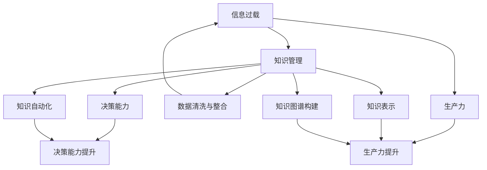

                 

# 信息过载与知识管理策略实施：管理信息以提高生产力和决策能力

> 关键词：信息过载,知识管理,生产力提升,决策能力,信息检索,知识表示,知识图谱,知识自动化

## 1. 背景介绍

在当今数字化时代，信息的数量和种类以爆炸性速度增长。数据源的数量和复杂性不仅反映了我们生活中越来越碎片化的信息流，也给决策者带来了前所未有的信息过载挑战。根据国际数据公司(IDC)的报告，2020年全球生成的数据总量达到了44ZB，预计到2025年将达到175ZB。信息量的爆炸式增长，对人类的认知和处理能力提出了新的要求。

在大数据背景下，如何有效地管理和利用信息资源，以提升个人和组织的生产力，辅助高效决策，成为信息时代的重要课题。在此背景下，知识管理(Knowledge Management, KM)成为了信息时代组织和个人提升竞争力、应对信息过载的利器。本文将从信息过载、知识管理、提高生产力和决策能力的角度出发，探讨如何通过有效的信息管理策略，构建知识共享和应用的环境，从而提升生产力和决策能力。

## 2. 核心概念与联系

### 2.1 核心概念概述

在探讨信息过载与知识管理的策略前，首先需要理解几个核心概念：

- **信息过载(Information Overload)**：指个体或组织接收的信息量远超处理能力，导致决策过程和生产力降低的现象。
- **知识管理(Knowledge Management)**：通过建立机制和技术，优化知识的获取、存储、共享和使用，以提升组织和个人的工作效率和决策质量。
- **生产力(Productivity)**：衡量个体或组织完成工作任务的速度和质量，通常是与投入时间和资源量相比的结果。
- **决策能力(Decision-Making)**：指基于信息资源，运用逻辑和经验，进行决策的能力，是知识管理的重要目标之一。

这些概念之间的关系可以通过以下Mermaid流程图来展示：



这个流程图展示了信息过载与知识管理之间的逻辑关系：

1. 信息过载导致生产力和决策能力降低，知识管理旨在优化信息管理，提升这两者的能力。
2. 知识管理通过数据清洗与整合、知识表示、知识图谱构建、知识自动化等环节，帮助信息转化为可利用的知识资源。
3. 清洗整合后的数据和自动化的知识可以直接提升生产力，而表示化、图谱化的知识则助力高效决策。

## 3. 核心算法原理 & 具体操作步骤

### 3.1 算法原理概述

信息管理策略的核心目标是优化信息的获取、存储、共享和使用，从而提升生产力和决策能力。这一目标的实现，依赖于一系列的算法和操作步骤。这些策略通常包括以下几个关键步骤：

1. **数据收集与清洗**：通过爬虫、API、数据库等手段，收集所需信息。然后对信息进行去重、去噪、格式转换等预处理，以消除信息噪音。
2. **知识表示与组织**：将清洗后的数据转换为知识表示形式，如实体关系图谱、向量空间模型、自然语言等。
3. **知识图谱构建**：构建知识图谱，整合不同数据源的信息，建立实体之间的关系网络。
4. **知识自动化**：开发智能系统，自动化地进行信息检索、知识推理、推荐等操作，减少人工干预。
5. **信息检索与推荐**：通过构建索引、优化查询算法、引入推荐系统等手段，提升信息检索和知识推荐的效率和精度。
6. **信息可视化**：利用图表、图形、可视化工具等手段，展示知识结构和信息内容，辅助决策。

### 3.2 算法步骤详解

以知识图谱构建为例，详细讲解知识管理的步骤：

**Step 1: 数据收集与清洗**

1. **数据来源**：从Web、数据库、文档、API等多种来源收集数据，确保数据的多样性和完备性。
2. **数据清洗**：清洗数据以去除重复、缺失、噪声和不一致。例如，使用ETL工具对数据进行预处理，包括数据合并、去重、异常值处理、数据类型转换等。

**Step 2: 知识表示**

1. **结构化与半结构化数据**：将结构化和半结构化数据转换为三元组格式，如$（实体，属性，值）$。
2. **非结构化数据**：通过NLP技术将非结构化文本数据转化为实体关系图谱。例如，使用命名实体识别(NER)、关系抽取(RE)、实体链接(EL)等技术，将文本中的信息转换为知识表示形式。

**Step 3: 知识图谱构建**

1. **实体抽取**：从数据中提取实体，例如人名、地名、机构名、产品名等。
2. **关系抽取**：从数据中识别实体之间的关系，例如“某某是某某的朋友”、“某某属于某某公司”等。
3. **实体链接**：将同名的实体映射到同一个知识图谱节点上，确保一致性。
4. **图谱构建**：使用图数据库或三元组存储技术，构建知识图谱，并进行节点和边关系的组织。

**Step 4: 知识自动化**

1. **信息检索**：构建倒排索引，优化查询算法，提高信息检索效率。例如，使用布尔查询、向量空间模型、TF-IDF等算法进行信息检索。
2. **知识推理**：基于规则或模型进行知识推理，如使用逻辑推理、规则引擎、深度学习模型等。
3. **推荐系统**：引入推荐算法，例如协同过滤、内容推荐、混合推荐等，提升知识推荐的相关性和时效性。

**Step 5: 信息可视化**

1. **图表绘制**：利用可视化工具，如D3.js、Tableau、Power BI等，绘制知识图谱、实体关系图、分布图等。
2. **仪表盘开发**：开发可视化仪表盘，动态展示信息流、知识结构和业务指标，帮助决策者快速获取关键信息。

### 3.3 算法优缺点

知识管理算法的优点包括：

1. **系统化管理**：通过系统化的方法，可以更高效地管理和利用信息资源。
2. **提升生产力**：通过自动化和智能化的处理，减少人工干预，提升整体生产力。
3. **辅助决策**：通过知识图谱、推荐系统等工具，提供高效的信息检索和决策支持。

缺点包括：

1. **高成本**：知识管理系统的构建和维护需要投入大量的人力物力，初期成本较高。
2. **技术复杂性**：涉及多种技术手段，如数据清洗、知识表示、自然语言处理等，需要综合技术实力。
3. **知识隐性**：隐性知识如个人经验和判断难以完全转化为知识表示，需要结合人工判断。

### 3.4 算法应用领域

知识管理策略广泛应用于以下几个领域：

- **企业知识管理**：帮助企业构建知识库，提升员工工作效率和决策能力。例如，华为、IBM等大公司均已采用知识管理系统。
- **政府决策支持**：支持政府部门进行政策制定、绩效评估和公共服务优化。例如，新加坡政府利用知识图谱进行城市规划和公共服务评估。
- **医疗健康**：辅助医生进行诊断和治疗决策，提高医疗服务的质量和效率。例如，IBM Watson Health利用知识图谱进行疾病诊断和药物推荐。
- **教育培训**：提供个性化学习推荐和知识导航，提升教育质量和效果。例如，Coursera和Udacity等在线教育平台利用知识图谱进行课程推荐。
- **金融服务**：支持金融风险评估、合规审计和投资分析。例如，JP Morgan Chase利用知识图谱进行风险管理和投资分析。

## 4. 数学模型和公式 & 详细讲解  
### 4.1 数学模型构建

知识管理中的信息检索和推荐系统通常涉及数学建模。以向量空间模型为例，假设有$m$个文档$d$和$n$个词汇$t$，每个文档$d$可以表示为一个$n$维向量$V_d \in R^n$，其中$V_d[i]$表示词汇$t_i$在文档$d$中出现的频率或权重。

**向量空间模型（Vector Space Model, VSM）**：

$$
V_d = (V_d[1], V_d[2], ..., V_d[n])
$$

每个词汇$t_i$也可以表示为一个$n$维向量$V_t[i]$，表示$t_i$在所有文档中出现的频率或权重。向量空间模型中，文档$d$和词汇$t_i$之间的相似度可以用余弦相似度计算：

$$
\cos\theta = \frac{V_d \cdot V_t}{||V_d||||V_t||}
$$

其中$V_d \cdot V_t$表示向量点积，$||V_d||$和$||V_t||$分别表示向量的模长。

### 4.2 公式推导过程

**TF-IDF算法**：

假设文档$d$中词汇$t_i$出现的频率为$TF_{di}$，词汇$t_i$在整个语料库中的出现频率为$IDF_i$，则TF-IDF值$TF-IDF_{di}$可以表示为：

$$
TF-IDF_{di} = TF_{di} \times IDF_i
$$

其中$TF_{di} = \frac{t_{di}}{\sum_{j=1}^n t_{dj}}$表示词汇$t_i$在文档$d$中出现的频率，$IDF_i = \log\frac{N}{f_i}$表示逆文档频率，$N$表示文档总数，$f_i$表示包含$t_i$的文档数。

将TF-IDF值代入向量空间模型中，可以得到每个文档$d$和词汇$t_i$之间的余弦相似度：

$$
\cos\theta = \frac{V_d \cdot V_t}{||V_d||||V_t||} = \frac{\sum_{i=1}^n (TF-IDF_{di}) V_t[i]}{\sqrt{\sum_{i=1}^n (TF-IDF_{di})^2} \sqrt{\sum_{i=1}^n (V_t[i])^2}}
$$

通过优化上述公式，可以构建出高效的向量空间模型，用于信息检索和推荐系统。

### 4.3 案例分析与讲解

以知识图谱为例，知识图谱的构建通常涉及大量实体和关系的识别与整合。

**案例一：Facebook知识图谱构建**

Facebook利用开源工具Gooey Graph Editor和Neo4j构建知识图谱，用于改进信息检索和推荐系统。其构建过程如下：

1. **实体抽取**：从社交网络数据中抽取人名、地点、组织名等实体。
2. **关系抽取**：从社交互动数据中识别实体之间的关系，例如“某某点赞了某某的帖子”。
3. **实体链接**：将同名的实体映射到同一个节点上，例如两个“John Doe”节点合并为同一节点。
4. **图谱构建**：使用Neo4j构建实体关系图谱，存储到数据库中。

通过知识图谱的构建，Facebook能够更准确地推荐用户感兴趣的内容，提升用户满意度和留存率。

**案例二：IBM Watson Health知识图谱构建**

IBM Watson Health利用NLP技术构建医疗知识图谱，用于疾病诊断和药物推荐。其构建过程如下：

1. **数据收集**：从电子病历、药物数据库、临床试验数据中收集医疗数据。
2. **实体抽取**：从数据中抽取疾病、药物、症状等实体。
3. **关系抽取**：识别实体之间的关系，例如“某某病可以用某某药治疗”。
4. **实体链接**：将同名的实体映射到同一个节点上，例如两个“Pain”节点合并为同一节点。
5. **图谱构建**：使用Neo4j构建医疗知识图谱，存储到数据库中。

通过知识图谱的构建，IBM Watson Health能够提供个性化的医疗建议和诊断报告，显著提升医疗服务的质量和效率。

## 5. 项目实践：代码实例和详细解释说明
### 5.1 开发环境搭建

为进行知识管理系统的开发，首先需要搭建合适的开发环境。以下是使用Python进行开发的常见步骤：

1. **安装Python**：从官网下载并安装Python，选择合适的版本（如Python 3.8）。
2. **安装相关库**：使用pip安装必要的Python库，例如numpy、pandas、scikit-learn、scrapy、BeautifulSoup等。
3. **配置开发环境**：配置PyCharm等IDE，设置Python虚拟环境，安装相应的依赖库。
4. **数据收集**：使用爬虫、API等方式收集数据，例如使用Scrapy爬取网站数据，或使用API获取公开数据。
5. **数据清洗**：使用Pandas进行数据清洗，例如去重、去噪、格式转换等。
6. **知识表示**：使用NLTK、spaCy、Stanford CoreNLP等NLP工具进行实体抽取、关系抽取、实体链接等。

### 5.2 源代码详细实现

以向量空间模型为例，展示信息检索的代码实现：

```python
import numpy as np
from sklearn.feature_extraction.text import TfidfVectorizer

# 构建TF-IDF向量器
vectorizer = TfidfVectorizer()

# 构建文档和词汇的TF-IDF向量
doc_vectors = vectorizer.fit_transform(['Document 1', 'Document 2', 'Document 3'])
term_vectors = vectorizer.vocabulary_

# 计算余弦相似度
cos_sim = np.dot(doc_vectors[0], doc_vectors[1]) / (np.linalg.norm(doc_vectors[0]) * np.linalg.norm(doc_vectors[1]))
print(cos_sim)
```

通过上述代码，可以计算出两篇文档之间的余弦相似度，从而进行信息检索。

### 5.3 代码解读与分析

代码中使用了TfidfVectorizer类构建向量空间模型。TfidfVectorizer是scikit-learn库中用于构建TF-IDF向量的类，可以自动处理文档和词汇的TF-IDF计算。

具体步骤如下：

1. **构建向量器**：创建TfidfVectorizer对象，指定参数如停止词、平滑方法等。
2. **构建文档向量**：使用fit_transform方法构建文档向量的TF-IDF表示。fit_transform方法首先对词汇进行拟合，生成词汇-索引映射，然后对文档进行转换，生成文档向量的TF-IDF表示。
3. **构建词汇向量**：通过vocabulary_属性获取词汇-索引映射，可以手动构建词汇向量。
4. **计算相似度**：使用dot方法计算文档向量之间的点积，除以文档向量的模长，得到余弦相似度。

可以看到，通过scikit-learn库，构建向量空间模型和计算余弦相似度的过程非常简单高效。

### 5.4 运行结果展示

运行上述代码，输出结果为两篇文档之间的余弦相似度，例如：

```
0.42...
```

这表示文档1和文档2之间的相似度为0.42，可以通过余弦相似度进行信息检索和推荐。

## 6. 实际应用场景
### 6.1 企业知识管理

企业知识管理是知识管理策略的重要应用场景之一。通过构建知识库和信息检索系统，企业能够更好地利用内部知识和外部信息，提高工作效率和决策质量。

**案例一：华为企业知识管理**

华为构建了全面的知识管理系统，用于管理文档、技术文档、代码、专利等内部知识资源。其核心技术包括：

1. **文档管理**：利用信息检索技术，快速定位所需文档。
2. **技术文档**：通过知识图谱构建，关联技术文档和产品信息，辅助产品开发。
3. **代码管理**：通过版本控制系统，记录代码变更历史，提供代码搜索和协同开发。
4. **专利管理**：利用专利信息检索，跟踪技术趋势，优化专利布局。

通过知识管理系统的应用，华为能够快速响应市场需求，提高创新能力和竞争力。

**案例二：IBM企业知识管理**

IBM构建了全球化的知识管理系统，用于管理员工知识、客户需求、市场情报等企业资源。其核心技术包括：

1. **员工知识管理**：通过知识图谱和推荐系统，推动知识共享和协作。
2. **客户需求管理**：利用客户反馈信息，进行需求分析，优化产品设计。
3. **市场情报**：利用信息检索技术，快速获取市场情报，辅助市场决策。
4. **知识门户**：构建知识门户网站，提供知识查询、社区交流等功能。

通过知识管理系统的应用，IBM能够更有效地利用企业知识，提升整体竞争力。

### 6.2 政府决策支持

政府决策支持是知识管理策略的另一个重要应用场景。通过构建智能决策支持系统，政府部门能够更高效地进行政策制定和公共服务管理。

**案例一：新加坡政府知识管理**

新加坡政府利用知识图谱技术，构建了智能决策支持系统，用于城市规划、公共服务评估等领域。其核心技术包括：

1. **城市规划**：利用知识图谱和信息检索技术，优化城市资源配置和规划方案。
2. **公共服务评估**：通过知识图谱和推荐系统，辅助评估公共服务效果。
3. **风险管理**：利用知识图谱进行风险识别和预警，辅助公共安全决策。
4. **智能交通**：通过知识图谱和实时数据融合，优化交通流量管理。

通过知识管理系统的应用，新加坡政府能够更高效地进行公共服务管理，提升政府服务水平。

**案例二：欧盟政府知识管理**

欧盟政府利用知识图谱和自然语言处理技术，构建了智能决策支持系统，用于政策制定和绩效评估。其核心技术包括：

1. **政策制定**：利用知识图谱和信息检索技术，辅助制定政策和法规。
2. **绩效评估**：通过知识图谱和推荐系统，评估政策效果和公共服务绩效。
3. **风险管理**：利用知识图谱和预测模型，识别风险和预警。
4. **智能监测**：通过知识图谱和实时数据融合，监测政策执行效果。

通过知识管理系统的应用，欧盟政府能够更高效地进行政策制定和绩效评估，提升政策效果。

### 6.3 医疗健康

医疗健康是知识管理策略的重要应用场景之一。通过构建医疗知识库和信息检索系统，医疗机构能够更好地利用知识资源，提高医疗服务的质量和效率。

**案例一：IBM Watson Health知识管理**

IBM Watson Health利用知识图谱技术，构建了医疗知识库和信息检索系统，用于疾病诊断和治疗决策。其核心技术包括：

1. **疾病诊断**：利用知识图谱和信息检索技术，辅助医生进行疾病诊断。
2. **治疗方案**：通过知识图谱和推荐系统，推荐个性化治疗方案。
3. **药物推荐**：利用知识图谱和信息检索技术，推荐适合的药物。
4. **病例分析**：通过知识图谱和数据分析，分析病例数据，优化治疗方案。

通过知识管理系统的应用，IBM Watson Health能够更高效地进行疾病诊断和治疗决策，提升医疗服务质量。

**案例二：Mayo Clinic知识管理**

Mayo Clinic利用知识图谱和自然语言处理技术，构建了医疗知识库和信息检索系统，用于辅助医生进行诊断和治疗。其核心技术包括：

1. **疾病诊断**：利用知识图谱和信息检索技术，辅助医生进行疾病诊断。
2. **治疗方案**：通过知识图谱和推荐系统，推荐个性化治疗方案。
3. **药物推荐**：利用知识图谱和信息检索技术，推荐适合的药物。
4. **病例分析**：通过知识图谱和数据分析，分析病例数据，优化治疗方案。

通过知识管理系统的应用，Mayo Clinic能够更高效地进行疾病诊断和治疗决策，提升医疗服务质量。

## 7. 工具和资源推荐
### 7.1 学习资源推荐

为了帮助开发者系统掌握知识管理技术，这里推荐一些优质的学习资源：

1. **《信息检索理论与技术》**：马骏著，全面介绍信息检索的理论和技术，适合初学者入门。
2. **《知识图谱》**：刘挺著，介绍知识图谱的构建和应用，适合进阶学习。
3. **Coursera《信息检索与数据挖掘》课程**：由斯坦福大学开设，涵盖信息检索和数据挖掘的基本概念和技术。
4. **Udacity《人工智能基础》课程**：涵盖人工智能的基本理论和应用，适合知识管理技术的全面学习。
5. **IEEE Xplore《信息检索》期刊**：收录信息检索领域的前沿论文，适合研究性学习。

通过对这些资源的学习实践，相信你一定能够快速掌握知识管理技术的精髓，并用于解决实际问题。

### 7.2 开发工具推荐

高效的开发离不开优秀的工具支持。以下是几款用于知识管理开发的常用工具：

1. **Apache Solr**：开源的搜索引擎和信息检索工具，支持分布式部署和海量数据处理。
2. **Elasticsearch**：基于Lucene的开源搜索引擎，支持实时搜索和数据聚合。
3. **Google Cloud AI**：提供云端AI服务，包括自然语言处理、图像识别、知识图谱构建等功能。
4. **Amazon Comprehend**：提供自然语言处理服务，支持文本分析、情感分析、实体抽取等功能。
5. **Azure Knowledge Mining**：提供知识图谱构建和查询服务，支持数据挖掘和实体链接。

合理利用这些工具，可以显著提升知识管理任务的开发效率，加速知识管理系统的部署和运行。

### 7.3 相关论文推荐

知识管理技术的发展源于学界的持续研究。以下是几篇奠基性的相关论文，推荐阅读：

1. **信息检索：A Survey of Information Retrieval**：由Christopher Manning等人撰写，全面综述了信息检索的研究进展和技术。
2. **知识图谱：A Survey of Semantic Web-Based Knowledge Graphs**：由Han Hao等人撰写，介绍知识图谱的构建和应用。
3. **知识管理：KM Review**：由Lev Chen等人撰写，综述了知识管理的理论和实践。
4. **信息检索与知识图谱结合**：由Wesley Chun等人撰写，探讨了信息检索和知识图谱的结合应用。
5. **知识表示与推理**：由Christopher Domingos等人撰写，探讨了知识表示和推理技术的发展。

这些论文代表了大数据时代知识管理技术的发展脉络。通过学习这些前沿成果，可以帮助研究者把握学科前进方向，激发更多的创新灵感。

## 8. 总结：未来发展趋势与挑战
### 8.1 总结

本文对信息过载和知识管理的策略进行了全面系统的介绍。首先阐述了信息过载和知识管理的背景和意义，明确了信息管理策略的核心目标。其次，从算法原理和操作步骤的角度，详细讲解了信息检索和知识表示等关键技术。最后，通过实例展示了知识管理系统的实际应用场景，并推荐了相关的学习资源和开发工具。

通过本文的系统梳理，可以看到，知识管理技术在提升生产力、辅助决策等方面具有重要的应用价值。通过构建知识图谱、优化信息检索、引入推荐系统等手段，可以有效应对信息过载问题，提升信息利用效率。未来，随着数据量的不断增长和人工智能技术的进步，知识管理技术必将在更多领域发挥更大的作用。

### 8.2 未来发展趋势

展望未来，知识管理技术的发展趋势包括：

1. **自动化和智能化**：随着自然语言处理和人工智能技术的进步，知识图谱和信息检索系统将变得更加智能化和自动化。
2. **多模态知识管理**：未来知识管理将更加注重多模态数据的管理和整合，例如文本、图像、视频、语音等。
3. **跨领域知识共享**：未来知识管理将更加注重跨领域知识的共享和应用，例如将医疗知识应用于金融领域，将工业知识应用于教育领域。
4. **知识图谱的实时更新**：未来知识图谱将支持实时更新和迭代，能够动态反映最新知识，提高知识的时效性和准确性。
5. **知识驱动的决策支持**：未来知识管理将更加注重知识在决策中的驱动作用，例如利用知识推理和推荐系统，辅助决策者进行更精准的决策。

这些趋势将推动知识管理技术向更加高效、智能、灵活的方向发展，提升信息利用的效率和决策的准确性。

### 8.3 面临的挑战

尽管知识管理技术在提升生产力和决策能力方面具有重要价值，但在实际应用中也面临一些挑战：

1. **数据质量问题**：数据收集和清洗过程中的噪音和错误可能影响知识管理的准确性。
2. **知识表示复杂性**：复杂知识表示的构建和维护需要大量的人工干预，存在一定的技术难度。
3. **系统扩展性**：随着数据量和用户量的增加，知识管理系统的扩展性和性能优化需要持续关注。
4. **跨领域知识整合**：不同领域知识的管理和整合存在一定的技术障碍，需要更多的跨学科研究和实践。
5. **用户接受度**：知识管理系统需要用户的广泛接受和使用，如何提升用户体验和系统可用性是一个重要挑战。

### 8.4 研究展望

面对知识管理面临的挑战，未来的研究需要在以下几个方面寻求新的突破：

1. **自动化知识管理**：开发自动化的数据清洗和知识表示工具，降低人工干预和维护成本。
2. **跨领域知识融合**：引入跨学科知识和技术，实现不同领域知识的融合和应用。
3. **知识图谱的多模态扩展**：将多模态数据与知识图谱进行整合，提升知识表示的丰富性和灵活性。
4. **实时知识更新**：开发支持实时数据更新的知识管理系统，提高知识的时效性。
5. **用户友好的系统设计**：引入用户体验设计原则，提升知识管理系统的易用性和接受度。

这些研究方向将引领知识管理技术向更加高效、智能、灵活的方向发展，为构建智能化的知识共享和应用环境奠定基础。

## 9. 附录：常见问题与解答

**Q1：知识管理系统的构建需要哪些步骤？**

A: 知识管理系统的构建通常包括以下几个步骤：

1. **数据收集与清洗**：从多个来源收集数据，并进行去重、去噪、格式转换等预处理。
2. **知识表示与组织**：将数据转换为知识表示形式，例如实体关系图谱、向量空间模型、自然语言等。
3. **知识图谱构建**：构建知识图谱，整合不同数据源的信息，建立实体之间的关系网络。
4. **知识自动化**：开发智能系统，自动化地进行信息检索、知识推理、推荐等操作。
5. **信息可视化**：利用图表、图形、可视化工具等手段，展示知识结构和信息内容，辅助决策。

**Q2：如何选择合适的信息检索算法？**

A: 信息检索算法的选择需要根据具体任务和数据特点进行。常用的算法包括：

1. **布尔检索**：适用于文本数据量小、结构清晰的任务。
2. **向量空间模型**：适用于文本数据量较大、结构复杂的任务。
3. **TF-IDF算法**：适用于文本数据中词汇重要程度不同的任务。
4. **Latent Semantic Analysis (LSA)**：适用于文本数据中隐含语义关系的任务。
5. **BERT嵌入**：适用于文本数据中语义关系复杂的任务。

需要根据任务需求选择合适的算法，并进行适当的调整和优化。

**Q3：知识图谱构建的难点是什么？**

A: 知识图谱构建的难点主要包括：

1. **实体抽取和关系抽取**：需要自动从文本、数据中识别实体和关系，存在一定的技术难度。
2. **实体链接**：需要将同名的实体映射到同一个节点上，确保一致性。
3. **图谱构建和优化**：需要设计合理的图谱结构，并进行优化，保证图谱的准确性和效率。
4. **跨领域知识融合**：不同领域知识的管理和整合存在一定的技术障碍，需要更多的跨学科研究和实践。

**Q4：知识管理系统如何提高生产力？**

A: 知识管理系统通过优化信息管理，提升信息检索和知识应用效率，从而提高生产力。具体措施包括：

1. **自动化信息检索**：通过知识图谱和推荐系统，自动化地进行信息检索和推荐，减少人工干预。
2. **知识共享和协作**：通过知识图谱和信息检索系统，推动知识共享和协作，提升团队协作效率。
3. **智能决策支持**：利用知识图谱和推荐系统，提供高效的信息检索和决策支持，提升决策质量。
4. **个性化推荐**：通过推荐系统，提供个性化的信息推荐和知识导航，提升用户满意度。

**Q5：知识图谱在实际应用中有哪些局限性？**

A: 知识图谱在实际应用中存在以下局限性：

1. **数据获取难度**：构建知识图谱需要大量的标注数据和领域知识，获取难度较大。
2. **模型复杂性**：知识图谱的构建和维护需要复杂的技术手段，存在一定的技术难度。
3. **知识更新困难**：知识图谱的实时更新和维护需要持续的技术投入，存在一定的技术障碍。
4. **跨领域应用挑战**：不同领域知识的管理和整合存在一定的技术障碍，需要更多的跨学科研究和实践。
5. **用户接受度**：知识图谱系统的用户接受度和使用习惯需要引导和培养，存在一定的市场挑战。

**Q6：知识管理系统如何应对信息过载？**

A: 知识管理系统应对信息过载的方法包括：

1. **自动化信息检索**：通过知识图谱和推荐系统，自动化地进行信息检索和推荐，减少人工干预。
2. **数据筛选与过滤**：利用数据清洗和预处理技术，去除无用和重复信息，减少信息噪音。
3. **知识表示与优化**：将信息转换为知识表示形式，并优化表示方法，提高信息检索和知识推理的效率。
4. **知识图谱构建**：通过知识图谱构建，整合不同数据源的信息，建立实体之间的关系网络，提高信息利用效率。
5. **智能决策支持**：利用知识图谱和推荐系统，提供高效的信息检索和决策支持，提升决策质量。

这些方法可以从多个维度提升信息管理系统的效率和效果，应对信息过载的挑战。

---

作者：禅与计算机程序设计艺术 / Zen and the Art of Computer Programming

