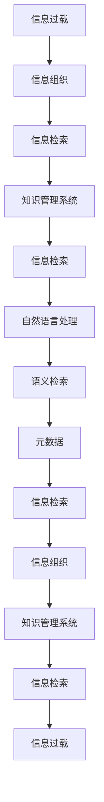

                 

# 信息过载与知识管理系统实施指南：有效组织和检索信息

> 关键词：信息过载, 知识管理, 信息组织, 信息检索, 系统设计, 数据工程

## 1. 背景介绍

### 1.1 问题由来

随着数字化转型和互联网技术的飞速发展，信息呈现出爆炸式增长态势。从海量文本、多媒体到社交网络数据，组织和利用这些信息成为企业和个人面临的巨大挑战。信息过载不仅导致信息噪音增加，阻碍了关键信息发现，还引发了信息获取效率低下、信息误判等问题。在此背景下，有效的信息组织和检索系统设计，对于解决信息过载问题，提升信息利用效率，具有重要意义。

### 1.2 问题核心关键点

信息过载问题的核心在于如何从海量数据中快速、准确地获取有用的信息。而知识管理系统的实施，则是通过信息组织和检索技术，帮助组织和个人有效管理和利用知识资源，提升信息获取效率和决策支持能力。

### 1.3 问题研究意义

有效的信息组织和检索系统，能够帮助用户快速定位所需信息，避免信息过载带来的问题，提升决策效率和工作质量。同时，知识管理系统通过结构化和语义化的信息表示，便于知识的存储、检索和复用，促进了知识积累和创新。因此，研究信息组织和检索技术，设计知识管理系统的实施方案，对于构建智能化的信息获取环境，促进知识驱动的业务发展，具有重要意义。

## 2. 核心概念与联系

### 2.1 核心概念概述

为更好地理解信息组织和检索系统的设计与实现，本节将介绍几个关键概念：

- **信息过载(Information Overload)**：指信息量远远超出个人或系统能够有效处理和利用的范围，导致信息质量下降、获取效率低下、误判风险增加的现象。
- **知识管理系统(Knowledge Management System, KMS)**：一种通过组织、管理和检索知识资源，提升信息获取效率和决策支持能力的系统。
- **信息组织(Information Organization)**：指对信息资源进行结构化、分类和编码的过程，以支持信息检索和利用。
- **信息检索(Information Retrieval)**：指通过计算机程序自动检索文档或数据，以回答用户查询的技术。
- **自然语言处理(Natural Language Processing, NLP)**：使计算机理解和处理人类语言的技术，在信息检索中具有重要作用。
- **语义检索(Semantic Retrieval)**：通过语义分析和理解，提高检索结果的相关性和准确性。
- **元数据(Metadata)**：描述信息资源的特征、来源和组织方式的数据，如标题、作者、分类等。

这些概念共同构成了信息组织和检索系统的理论基础，通过合理设计和使用这些技术，可以有效缓解信息过载问题，提升知识管理系统的性能。

### 2.2 核心概念原理和架构的 Mermaid 流程图



该流程图展示了信息组织、信息检索和知识管理系统的基本架构和数据流动方向：

1. 信息过载的数据首先经过信息组织，实现结构化处理。
2. 组织后的信息通过信息检索系统，快速响应用户查询。
3. 信息检索系统利用自然语言处理和语义检索技术，提高检索结果的相关性和准确性。
4. 检索结果进一步通过元数据进行优化，提升检索效率和质量。
5. 最终，优化后的信息通过知识管理系统存储和管理，供用户检索和利用。

## 3. 核心算法原理 & 具体操作步骤

### 3.1 算法原理概述

信息组织和检索系统设计中，核心算法主要分为两个部分：信息组织算法和信息检索算法。

- **信息组织算法**：主要涉及信息的分类、编码、索引等处理过程，目的是将信息资源结构化、有序化，便于检索。
- **信息检索算法**：主要涉及检索模型构建、匹配算法等，目的是快速、准确地找到与查询相匹配的信息资源。

信息组织和检索算法的结合，构成了知识管理系统的核心功能。

### 3.2 算法步骤详解

以下是对信息组织和检索系统设计中常用算法步骤的详细介绍：

**信息组织算法**：

1. **数据清洗**：对原始数据进行去重、去噪、格式转换等预处理操作，确保数据质量。
2. **特征提取**：提取文档或数据的关键词、短语、实体等信息特征，为分类和索引提供依据。
3. **分类和编码**：根据信息特征和领域知识，将文档或数据分配到相应的分类或主题下，并进行编码和标记。
4. **索引构建**：构建倒排索引、向量空间模型等索引结构，便于快速查找和检索信息。

**信息检索算法**：

1. **查询解析**：将用户查询转化为计算机可理解的形式，如关键词、短语等。
2. **检索模型构建**：选择合适的检索模型，如布尔模型、向量空间模型、概率模型等，并根据训练数据进行模型参数优化。
3. **匹配算法实现**：通过匹配算法，计算查询与文档的相似度，筛选出最相关的结果。
4. **排序和反馈**：对检索结果进行排序，并根据用户反馈调整检索策略，提高检索效果。

### 3.3 算法优缺点

信息组织和检索算法具有以下优点：

- **效率高**：通过自动化的信息组织和检索，显著提升信息获取速度和准确性。
- **可扩展性强**：系统可处理大规模数据，并支持动态数据更新，具有较强的可扩展性。
- **知识驱动**：通过领域专家的指导，可以更精准地组织和管理信息资源。

同时，这些算法也存在一定的局限性：

- **数据依赖**：系统性能很大程度上依赖于输入数据的质量和完整性。
- **算法复杂**：信息组织和检索算法涉及复杂的特征提取和模型构建，需要较强的技术背景和专业知识。
- **维护成本高**：系统的维护和更新需要专业知识，维护成本较高。

### 3.4 算法应用领域

信息组织和检索算法在多个领域得到广泛应用，如企业知识管理、图书馆信息检索、电子商务推荐系统等。

- **企业知识管理**：帮助企业整理、存储和检索内部文档、知识库等，提升员工工作效率和知识共享能力。
- **图书馆信息检索**：通过自动化索引和检索，提升图书馆的信息查找速度和用户体验。
- **电子商务推荐系统**：基于用户历史行为和商品特征，推荐相关商品，提升销售转化率。
- **社交媒体分析**：从海量社交数据中提取有价值的信息，分析用户兴趣和行为，支持社交网络运营。

这些应用场景展示了信息组织和检索系统在不同领域的具体应用，体现了其在提升信息利用效率和决策支持能力方面的巨大潜力。

## 4. 数学模型和公式 & 详细讲解 & 举例说明

### 4.1 数学模型构建

信息检索系统的核心在于构建有效的检索模型和匹配算法。常见的检索模型包括布尔模型、向量空间模型、概率模型等。以下以向量空间模型为例，介绍其基本原理和构建方法。

向量空间模型将文档和查询表示为高维向量，通过计算它们之间的相似度，找到最相关的文档。假设文档集合为 $D=\{d_1,d_2,\ldots,d_m\}$，查询为 $q$，设 $d_i=(w_{i1},w_{i2},\ldots,w_{in})$ 表示第 $i$ 个文档的词向量，$w_{ij}$ 表示文档 $d_i$ 中第 $j$ 个词的权重，$w_{ij}$ 可以采用 TF-IDF 等方法计算。则文档和查询的向量表示分别为：

$$
q=(w_{1q},w_{2q},\ldots,w_{nq})
$$

$$
d_i=(w_{i1},w_{i2},\ldots,w_{in})
$$

文档 $d_i$ 与查询 $q$ 的相似度 $s_i$ 可通过余弦相似度计算：

$$
s_i=\cos\theta=\frac{w_i \cdot q}{\|w_i\|\|q\|}
$$

其中 $w_i \cdot q$ 为向量的点积，$\|w_i\|$ 和 $\|q\|$ 为向量的范数。

### 4.2 公式推导过程

向量空间模型的推导过程如下：

假设文档集合 $D=\{d_1,d_2,\ldots,d_m\}$ 和查询 $q$，设 $d_i=(w_{i1},w_{i2},\ldots,w_{in})$ 表示第 $i$ 个文档的词向量，$w_{ij}$ 表示文档 $d_i$ 中第 $j$ 个词的权重，$w_{ij}$ 可以采用 TF-IDF 等方法计算。则文档和查询的向量表示分别为：

$$
q=(w_{1q},w_{2q},\ldots,w_{nq})
$$

$$
d_i=(w_{i1},w_{i2},\ldots,w_{in})
$$

文档 $d_i$ 与查询 $q$ 的相似度 $s_i$ 可通过余弦相似度计算：

$$
s_i=\cos\theta=\frac{w_i \cdot q}{\|w_i\|\|q\|}
$$

其中 $w_i \cdot q$ 为向量的点积，$\|w_i\|$ 和 $\|q\|$ 为向量的范数。

### 4.3 案例分析与讲解

以一个简单的信息检索案例为例，说明向量空间模型的应用：

假设有一个图书馆的信息检索系统，需要根据用户输入的查询 "Python 编程" 检索相关的书籍。图书馆中的书籍集合为 $D=\{d_1,d_2,\ldots,d_m\}$，每本书的词向量为 $d_i=(w_{i1},w_{i2},\ldots,w_{in})$。查询 "Python 编程" 可以表示为向量 $q=(w_{1q},w_{2q},\ldots,w_{nq})$。

首先，对书籍和查询的词向量进行 TF-IDF 计算，得到 $w_{ij}$。然后，计算每个书籍与查询的余弦相似度 $s_i$，找到最相关的书籍推荐给用户。

## 5. 项目实践：代码实例和详细解释说明

### 5.1 开发环境搭建

在进行信息组织和检索系统开发前，我们需要准备好开发环境。以下是使用 Python 进行 Elasticsearch 开发的环境配置流程：

1. 安装 Anaconda：从官网下载并安装 Anaconda，用于创建独立的 Python 环境。

2. 创建并激活虚拟环境：
```bash
conda create -n elasticsearch-env python=3.8 
conda activate elasticsearch-env
```

3. 安装 Elasticsearch：根据操作系统，从官网获取对应的安装命令。例如：
```bash
conda install elasticsearch
```

4. 安装其他工具包：
```bash
pip install pandas numpy scikit-learn NLTK tqdm
```

完成上述步骤后，即可在 `elasticsearch-env` 环境中开始开发实践。

### 5.2 源代码详细实现

这里我们以 Elasticsearch 为底层库，构建一个简单的信息检索系统。假设有一个企业内部的知识库，包含多个文档，每个文档都有一个描述和相关的关键词。

首先，需要安装 Elasticsearch 并启动服务：

```bash
# 安装 Elasticsearch
conda install elasticsearch

# 启动 Elasticsearch 服务
sudo elasticsearch -f
```

然后，使用 Python 编写一个简单的信息检索程序，实现从知识库中检索相关文档的功能。

```python
from elasticsearch import Elasticsearch
from elasticsearch_dsl import Search

# 连接 Elasticsearch 服务
es = Elasticsearch([{'host': 'localhost', 'port': 9200}])

# 定义文档和查询结构
class Document(Document):
    description = Text()
    keywords = Keyword()

    class Meta:
        index = 'knowledge'

class Query:
    def __init__(self, description=None, keywords=None):
        self.description = description
        self.keywords = keywords

    def __str__(self):
        query = Search().query('match', description=self.description, keywords=self.keywords)
        return query

# 构建索引和添加文档
def create_index():
    es.indices.create(index='knowledge', ignore=[400, 404])

def add_documents():
    documents = [
        {'title': 'Python 编程', 'description': 'Python 是一门流行的编程语言', 'keywords': 'Python, 编程, 语言'},
        {'title': '机器学习', 'description': '机器学习是人工智能的重要分支', 'keywords': '机器学习, 人工智能, 算法'},
        {'title': '数据分析', 'description': '数据分析是商业智能的重要工具', 'keywords': '数据分析, 商业智能, 数据可视化'}
    ]
    for doc in documents:
        es.index(index='knowledge', id=doc['title'], body=doc)

# 构建查询并检索文档
def search_documents(query):
    search = Query(query.description, query.keywords)
    results = es.search(index='knowledge', body=search)
    return results

# 测试代码
create_index()
add_documents()
search_documents(Query(description='机器学习', keywords='人工智能'))
```

### 5.3 代码解读与分析

让我们再详细解读一下关键代码的实现细节：

**Document类**：
- 定义了文档的描述和关键词字段，以及索引名称。

**Query类**：
- 定义了查询的描述和关键词，以及字符串表示方法。

**create_index和add_documents函数**：
- 创建索引并添加文档到 Elasticsearch 中。

**search_documents函数**：
- 构建查询，并使用 Elasticsearch 的 Search API 进行文档检索，返回结果。

通过上述代码，可以构建一个简单的信息检索系统，支持基于文档描述和关键词的检索。

### 5.4 运行结果展示

运行上述代码后，可以在 Elasticsearch 的 UI 中查看检索结果。假设查询 "机器学习"，系统应该返回所有包含 "机器学习" 关键词的文档。

## 6. 实际应用场景

### 6.1 企业知识管理系统

企业知识管理系统通过自动化地组织、检索和管理文档，帮助员工快速定位所需信息，提升工作效率。企业可以定期收集和整理内部文档、会议纪要、项目报告等，利用信息组织和检索技术，构建知识库。员工可以根据关键词或主题搜索相关文档，获取所需知识，促进知识共享和创新。

### 6.2 图书馆信息检索系统

图书馆信息检索系统利用 Elasticsearch 等技术，帮助读者快速检索书籍、期刊等文献资源。图书馆可以定期更新馆藏目录，建立索引，并提供全文检索、高级搜索、分类浏览等多种检索方式，提升用户体验和资源利用效率。

### 6.3 电子商务推荐系统

电子商务推荐系统通过用户行为数据和商品信息，利用信息检索和自然语言处理技术，推荐相关商品。平台可以实时收集用户的浏览、点击、购买等行为数据，构建用户画像，并结合商品描述和标签，实现个性化推荐，提升销售转化率。

### 6.4 未来应用展望

随着信息技术的不断进步，信息组织和检索系统将迎来更多应用场景和创新点：

- **智能推荐系统**：结合深度学习和自然语言处理技术，实现更精准、个性化的推荐。
- **多语言信息检索**：支持多种语言的信息检索，满足全球用户的查询需求。
- **语义搜索**：通过语义分析，理解查询意图，提供更相关、准确的检索结果。
- **融合多模态数据**：将文本、图像、音频等多模态数据融合，提供更丰富的信息检索体验。

## 7. 工具和资源推荐

### 7.1 学习资源推荐

为了帮助开发者系统掌握信息组织和检索系统的设计与实现，这里推荐一些优质的学习资源：

1. 《信息检索基础与实践》系列博文：介绍信息检索的基本原理和常用算法，结合实践案例，深入浅出地讲解信息检索技术。

2. CS224N《自然语言处理》课程：斯坦福大学开设的NLP明星课程，涵盖信息检索、文本分类、序列建模等NLP技术，系统学习NLP知识。

3. 《信息检索与文本挖掘》书籍：全面介绍信息检索和文本挖掘的理论与实践，涵盖多种检索模型和应用实例。

4. Elasticsearch官方文档：Elasticsearch的官方文档，提供详细的API和示例代码，帮助开发者快速上手。

5. NLTK库：Python自然语言处理库，提供丰富的文本处理和分析工具，支持分词、词性标注、情感分析等NLP任务。

通过这些资源的学习实践，相信你一定能够快速掌握信息组织和检索系统的精髓，并用于解决实际的NLP问题。

### 7.2 开发工具推荐

高效的开发离不开优秀的工具支持。以下是几款用于信息检索系统开发的常用工具：

1. Elasticsearch：开源搜索引擎，支持全文检索、分布式部署、数据分析和可视化，是信息检索系统的核心工具。

2. NLTK：Python自然语言处理库，提供丰富的文本处理和分析工具，支持分词、词性标注、情感分析等NLP任务。

3. Elasticsearch Query DSL：Elasticsearch的查询语言，支持灵活构建复杂的检索查询。

4. Kibana：Elasticsearch的可视化工具，支持数据可视化、仪表盘构建和实时监控，帮助开发者理解和优化系统性能。

5. Jupyter Notebook：交互式编程环境，支持Python代码的在线执行和可视化展示，方便开发者进行实验和调试。

合理利用这些工具，可以显著提升信息检索系统的开发效率，加快创新迭代的步伐。

### 7.3 相关论文推荐

信息检索和知识管理领域的研究进展如下：

1. "The SMART Approach to Information Retrieval"（智能信息检索方法）：介绍基于机器学习的智能信息检索技术，提升检索精度和效率。

2. "An Overview of Knowledge Management Systems"（知识管理系统的综述）：全面介绍知识管理系统的架构、技术和应用案例，涵盖信息组织、检索、共享等多个方面。

3. "Semantic Information Retrieval: An Overview"（语义信息检索综述）：介绍语义信息检索的基本原理和应用，提升检索结果的相关性和准确性。

4. "Knowledge Discovery and Information Retrieval"（知识发现与信息检索）：探讨知识发现与信息检索的结合，通过结构化和语义化的信息表示，提升知识管理和检索的效果。

这些论文代表了大语言模型微调技术的发展脉络。通过学习这些前沿成果，可以帮助研究者把握学科前进方向，激发更多的创新灵感。

## 8. 总结：未来发展趋势与挑战

### 8.1 总结

本文对信息组织和检索系统的设计与实现进行了全面系统的介绍。首先阐述了信息过载问题的背景和研究意义，明确了知识管理系统的实施方案和目标。其次，从原理到实践，详细讲解了信息检索的基本算法和步骤，给出了信息检索任务开发的完整代码实例。同时，本文还广泛探讨了信息检索系统在企业知识管理、图书馆信息检索、电子商务推荐等多个行业领域的应用前景，展示了信息检索系统的巨大潜力。最后，本文精选了信息检索技术的各类学习资源，力求为读者提供全方位的技术指引。

通过本文的系统梳理，可以看到，信息组织和检索系统设计在提升信息利用效率和决策支持能力方面具有重要意义。通过合理设计和使用这些技术，可以有效缓解信息过载问题，提升信息检索的准确性和效率。

### 8.2 未来发展趋势

展望未来，信息检索技术将呈现以下几个发展趋势：

1. **智能检索**：结合深度学习和自然语言处理技术，实现更精准、个性化的信息检索。
2. **语义检索**：通过语义分析和理解，提高检索结果的相关性和准确性。
3. **多模态检索**：将文本、图像、音频等多模态数据融合，提供更丰富的信息检索体验。
4. **实时检索**：实现对海量数据的实时处理和检索，满足实时性要求。
5. **自适应检索**：根据用户反馈和上下文信息，动态调整检索策略，提升检索效果。

这些趋势凸显了信息检索技术的广阔前景。这些方向的探索发展，必将进一步提升信息检索系统的性能和应用范围，为构建智能化的信息获取环境，促进知识驱动的业务发展，具有重要意义。

### 8.3 面临的挑战

尽管信息检索技术已经取得了瞩目成就，但在迈向更加智能化、普适化应用的过程中，仍面临诸多挑战：

1. **数据质量**：系统性能很大程度上依赖于输入数据的质量和完整性。数据缺失、噪声等问题会影响检索结果的准确性。
2. **算法复杂**：信息检索算法涉及复杂的特征提取和模型构建，需要较强的技术背景和专业知识。
3. **资源消耗**：系统需要处理大规模数据，并实时响应用户查询，对硬件资源和网络带宽有较高要求。
4. **用户体验**：系统需要提供友好的用户界面和高效的查询体验，满足用户的多样化需求。
5. **安全性**：系统需要确保数据和用户隐私的安全，避免信息泄露和滥用。

正视信息检索面临的这些挑战，积极应对并寻求突破，将是大语言模型微调技术迈向成熟的必由之路。相信随着学界和产业界的共同努力，这些挑战终将一一被克服，信息检索技术必将在构建智能化的信息获取环境，促进知识驱动的业务发展中发挥重要作用。

### 8.4 研究展望

面向未来，信息检索技术需要在以下几个方面寻求新的突破：

1. **融合多源数据**：将结构化和非结构化数据融合，提升信息检索的全面性和准确性。
2. **语义知识融合**：将符号化的先验知识，如知识图谱、逻辑规则等，与神经网络模型进行巧妙融合，引导检索过程学习更准确、合理的知识表示。
3. **个性化推荐**：基于用户历史行为和兴趣，提供个性化的信息推荐，提升用户满意度。
4. **实时互动**：通过实时互动和反馈机制，提升检索系统的交互性和用户体验。
5. **智能推理**：利用深度学习和推理技术，实现更加智能和精准的信息检索。

这些研究方向和创新点，必将引领信息检索技术迈向更高的台阶，为构建智能化的信息获取环境，促进知识驱动的业务发展，提供坚实的技术基础。总之，信息检索技术需要在数据、算法、工程、业务等多个维度协同发力，才能真正实现信息检索系统的智能化和普适化应用。

## 9. 附录：常见问题与解答

**Q1：信息组织和检索系统如何实现高效的数据处理？**

A: 信息组织和检索系统通常采用分布式架构，如Elasticsearch，能够处理大规模数据并实现高吞吐量。同时，系统可以利用缓存、索引、异步处理等技术，提升数据处理效率。

**Q2：信息检索系统如何实现高精度和高效检索？**

A: 信息检索系统可以通过多种技术提升检索精度和效率，如倒排索引、向量空间模型、TF-IDF权重计算、语义检索等。此外，系统还可以通过数据预处理、分布式计算等手段，提升处理能力和响应速度。

**Q3：信息组织和检索系统如何确保数据的安全性和隐私保护？**

A: 信息组织和检索系统需要采用数据加密、访问控制、审计日志等技术，确保数据的安全性和隐私保护。同时，系统需要遵守相关法律法规，如GDPR等，保护用户隐私。

**Q4：信息检索系统如何实现多语言支持？**

A: 信息检索系统可以通过多语言分词、词性标注、情感分析等技术，实现对多种语言的信息检索。同时，系统可以引入多语言索引和查询解析技术，支持多语言检索需求。

**Q5：信息组织和检索系统如何应对大数据和高并发挑战？**

A: 信息组织和检索系统可以采用分布式存储和处理技术，如Hadoop、Spark等，处理大规模数据和高并发请求。同时，系统可以通过数据分片和负载均衡等手段，提升系统的稳定性和可扩展性。

通过这些问答，可以看到信息组织和检索系统在应对大数据和高并发挑战时，需要采用分布式架构和多种技术手段，才能实现高效、安全、可靠的系统设计。

---

作者：禅与计算机程序设计艺术 / Zen and the Art of Computer Programming

