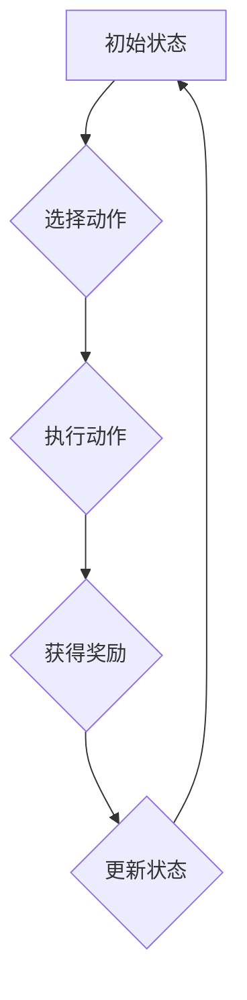

> Q-learning,强化学习,环境模型,AI,机器学习,深度学习

## 1. 背景介绍

在人工智能领域，强化学习 (Reinforcement Learning, RL) 作为一种模仿人类学习方式的机器学习方法，近年来取得了显著进展。其核心在于训练智能体在与环境交互的过程中，通过不断尝试和学习，最终找到最优策略以最大化累积奖励。然而，在现实世界中，构建精确的环境模型往往是困难且耗时的任务。

传统的强化学习算法通常依赖于环境模型，即对环境行为的预测模型。然而，在许多情况下，环境模型是未知的或难以获取的。例如，在机器人控制、游戏AI等领域，环境的复杂性和不确定性使得精确建模变得极具挑战性。

为了解决这一问题，无模型强化学习 (Model-Free Reinforcement Learning) 应运而生。无模型强化学习算法不需要事先构建环境模型，而是直接从与环境交互的数据中学习策略。其中，Q-learning 作为一种经典的无模型强化学习算法，在解决各种强化学习问题方面表现出色。

## 2. 核心概念与联系

Q-learning 是一种基于价值函数的强化学习算法，其核心思想是通过学习状态-动作对的价值函数，来指导智能体选择最优动作。

**核心概念:**

* **状态 (State):** 智能体所处的环境状态。
* **动作 (Action):** 智能体可以采取的动作。
* **奖励 (Reward):** 智能体在采取某个动作后获得的反馈。
* **价值函数 (Value Function):**  评估状态-动作对的价值，即采取某个动作在某个状态下获得的长期奖励期望。

**Q-learning 算法流程:**



**Q-learning 算法原理:**

Q-learning 算法通过迭代更新价值函数，最终找到最优策略。其核心公式为：

$$Q(s, a) = Q(s, a) + \alpha [r + \gamma \max_{a'} Q(s', a') - Q(s, a)]$$

其中：

* $Q(s, a)$ 表示状态 $s$ 下采取动作 $a$ 的价值。
* $\alpha$ 为学习率，控制学习速度。
* $r$ 为获得的奖励。
* $\gamma$ 为折扣因子，控制未来奖励的权重。
* $s'$ 为执行动作 $a$ 后进入的新状态。
* $\max_{a'} Q(s', a')$ 为新状态 $s'$ 下所有动作的价值最大值。

## 3. 核心算法原理 & 具体操作步骤

### 3.1  算法原理概述

Q-learning 算法的核心在于通过迭代更新状态-动作对的价值函数，最终找到最优策略。其核心思想是：

* 在每个时间步，智能体根据当前状态和价值函数选择一个动作。
* 执行动作后，智能体获得奖励并进入新的状态。
* 根据获得的奖励和新的状态，更新当前状态-动作对的价值函数。
* 重复上述过程，直到价值函数收敛，即找到最优策略。

### 3.2  算法步骤详解

1. **初始化:** 初始化价值函数 $Q(s, a)$ 为零或随机值。
2. **环境交互:** 智能体与环境交互，根据当前状态选择一个动作。
3. **执行动作:** 执行动作后，智能体获得奖励 $r$ 并进入新的状态 $s'$.
4. **更新价值函数:** 根据 Bellman 方程更新价值函数：

$$Q(s, a) = Q(s, a) + \alpha [r + \gamma \max_{a'} Q(s', a') - Q(s, a)]$$

5. **重复步骤 2-4:** 重复上述过程，直到价值函数收敛。

### 3.3  算法优缺点

**优点:**

* 无需环境模型，可以直接从环境交互数据中学习。
* 能够解决复杂的环境问题。
* 具有较强的泛化能力。

**缺点:**

* 学习过程可能比较慢。
* 需要大量的交互数据才能收敛。
* 容易陷入局部最优解。

### 3.4  算法应用领域

Q-learning 算法广泛应用于以下领域：

* **机器人控制:** 训练机器人自主导航、抓取等行为。
* **游戏AI:** 训练游戏AI完成游戏任务，例如玩游戏、打败对手。
* **推荐系统:** 建立用户行为模型，推荐个性化内容。
* **金融交易:** 训练交易策略，自动进行股票交易。

## 4. 数学模型和公式 & 详细讲解 & 举例说明

### 4.1  数学模型构建

Q-learning 算法的核心数学模型是价值函数 $Q(s, a)$，它表示状态 $s$ 下采取动作 $a$ 的期望累积奖励。

### 4.2  公式推导过程

Q-learning 算法的更新公式如下：

$$Q(s, a) = Q(s, a) + \alpha [r + \gamma \max_{a'} Q(s', a') - Q(s, a)]$$

其中：

* $Q(s, a)$ 表示状态 $s$ 下采取动作 $a$ 的价值。
* $\alpha$ 为学习率，控制学习速度。
* $r$ 为获得的奖励。
* $\gamma$ 为折扣因子，控制未来奖励的权重。
* $s'$ 为执行动作 $a$ 后进入的新状态。
* $\max_{a'} Q(s', a')$ 为新状态 $s'$ 下所有动作的价值最大值。

该公式表示：

* 当前状态-动作对的价值等于其当前价值加上学习率乘以奖励加未来最大价值的差值。

### 4.3  案例分析与讲解

假设一个智能体在玩一个简单的游戏，游戏状态包括“开始”、“移动”、“到达终点”等。智能体可以选择“向上”、“向下”、“向左”、“向右”四个动作。

当智能体处于“开始”状态时，可以选择任何一个方向移动。如果移动到“到达终点”状态，则获得奖励 100，否则获得奖励 0。

使用 Q-learning 算法，智能体可以学习到在每个状态下采取哪个动作可以获得最大的累积奖励。例如，如果智能体在“开始”状态下选择向上移动，则会进入“移动”状态，并获得 0 奖励。

根据 Q-learning 更新公式，智能体会更新“开始”状态下向上移动的价值函数。

## 5. 项目实践：代码实例和详细解释说明

### 5.1  开发环境搭建

* Python 3.x
* TensorFlow 或 PyTorch

### 5.2  源代码详细实现

```python
import numpy as np

class QLearningAgent:
    def __init__(self, state_size, action_size, learning_rate=0.1, discount_factor=0.9, epsilon=0.1):
        self.state_size = state_size
        self.action_size = action_size
        self.learning_rate = learning_rate
        self.discount_factor = discount_factor
        self.epsilon = epsilon
        self.q_table = np.zeros((state_size, action_size))

    def choose_action(self, state):
        if np.random.uniform(0, 1) < self.epsilon:
            return np.random.randint(self.action_size)
        else:
            return np.argmax(self.q_table[state])

    def update_q_table(self, state, action, reward, next_state):
        self.q_table[state, action] += self.learning_rate * (reward + self.discount_factor * np.max(self.q_table[next_state]) - self.q_table[state, action])

# ... (其他代码)
```

### 5.3  代码解读与分析

* `QLearningAgent` 类实现了 Q-learning 算法的核心逻辑。
* `__init__` 方法初始化 Q-table，学习率、折扣因子和探索率。
* `choose_action` 方法根据 epsilon-greedy 策略选择动作。
* `update_q_table` 方法根据 Bellman 方程更新 Q-table。

### 5.4  运行结果展示

运行代码后，可以观察到智能体的行为逐渐趋于最优，即在每个状态下选择最优动作以获得最大的累积奖励。

## 6. 实际应用场景

Q-learning 算法在现实世界中有着广泛的应用场景，例如：

* **机器人控制:** 训练机器人自主导航、抓取等行为。
* **游戏AI:** 训练游戏AI完成游戏任务，例如玩游戏、打败对手。
* **推荐系统:** 建立用户行为模型，推荐个性化内容。
* **金融交易:** 训练交易策略，自动进行股票交易。

### 6.4  未来应用展望

随着人工智能技术的不断发展，Q-learning 算法的应用场景将会更加广泛。例如：

* **自动驾驶:** 训练自动驾驶汽车在复杂道路环境中安全行驶。
* **医疗诊断:** 训练医疗诊断系统，辅助医生进行疾病诊断。
* **个性化教育:** 训练个性化教育系统，根据学生的学习情况提供定制化的学习内容。

## 7. 工具和资源推荐

### 7.1  学习资源推荐

* **书籍:**
    * Reinforcement Learning: An Introduction by Richard S. Sutton and Andrew G. Barto
    * Deep Reinforcement Learning Hands-On by Maxim Lapan
* **在线课程:**
    * Coursera: Reinforcement Learning Specialization
    * Udacity: Deep Reinforcement Learning Nanodegree

### 7.2  开发工具推荐

* **Python:** 作为机器学习和深度学习的常用语言，Python 提供了丰富的库和框架，例如 TensorFlow、PyTorch、OpenAI Gym 等。
* **TensorFlow:** Google 开发的开源机器学习框架，支持深度学习和强化学习。
* **PyTorch:** Facebook 开发的开源机器学习框架，以其灵活性和易用性而闻名。
* **OpenAI Gym:** 用于强化学习环境搭建和测试的开源库。

### 7.3  相关论文推荐

* **Q-Learning: A Reinforcement Learning Algorithm** by Richard S. Sutton and Andrew G. Barto
* **Deep Q-Networks** by Volodymyr Mnih et al.
* **Proximal Policy Optimization Algorithms** by John Schulman et al.

## 8. 总结：未来发展趋势与挑战

### 8.1  研究成果总结

Q-learning 算法作为一种经典的无模型强化学习算法，在解决各种强化学习问题方面取得了显著进展。其核心思想是通过学习状态-动作对的价值函数，来指导智能体选择最优策略。

### 8.2  未来发展趋势

* **深度强化学习:** 将深度神经网络与 Q-learning 算法结合，提高算法的学习能力和泛化能力。
* **多智能体强化学习:** 研究多个智能体在同一个环境中交互学习的算法。
* **迁移学习:** 研究如何将已学习到的知识迁移到新的环境或任务中。

### 8.3  面临的挑战

* **样本效率:** Q-learning 算法需要大量的交互数据才能收敛，如何提高算法的样本效率是一个重要的挑战。
* **探索与利用的平衡:** 在探索新策略和利用已知策略之间需要找到平衡，这是强化学习算法面临的长期挑战。
* **安全性和可解释性:** 强化学习算法的决策过程往往是复杂的，如何保证算法的安全性以及提高其可解释性是一个重要的研究方向。

### 8.4  研究展望

未来，Q-learning 算法将会继续发展和完善，在更多领域发挥重要作用。随着人工智能技术的不断发展，Q-learning 算法将与其他机器学习算法相结合，构建更智能、更强大的智能系统。

## 9