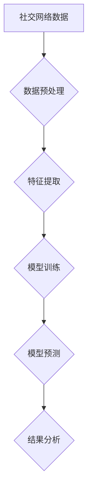

> 社交网络分析，AI，机器学习，深度学习，图数据库，网络结构，社区发现，情感分析，预测模型

## 1. 背景介绍

社交网络已经成为现代社会不可或缺的一部分，它连接着数以亿计的用户，并为我们提供了丰富的社交互动、信息获取和内容分享的平台。随着社交网络的蓬勃发展，社交网络数据也呈指数级增长，蕴藏着巨大的价值。如何有效地挖掘和分析这些数据，从中获取有价值的洞察和知识，成为了一个重要的研究课题。

人工智能（AI）技术的快速发展为社交网络分析提供了强大的工具和方法。AI算法能够从海量的数据中识别出隐藏的模式和关系，并对用户行为、网络结构和社会趋势进行深入的分析。

## 2. 核心概念与联系

社交网络分析的核心是理解和分析社交网络中的节点（用户）和边（关系）之间的连接和互动。

**社交网络图**

社交网络可以被抽象为一个图结构，其中节点代表用户，边代表用户之间的关系，例如朋友关系、关注关系、评论关系等。

**图数据库**

图数据库是一种专门用于存储和查询图结构数据的数据库，它能够高效地处理复杂的图查询和分析。

**机器学习**

机器学习是人工智能的一个分支，它通过算法学习数据中的模式和规律，并用于预测和分类。

**深度学习**

深度学习是机器学习的一个子领域，它使用多层神经网络来学习数据中的复杂特征，能够处理更复杂的数据和任务。

**Mermaid 流程图**



## 3. 核心算法原理 & 具体操作步骤

### 3.1  算法原理概述

社交网络分析中常用的算法包括：

* **社区发现算法**: 用于识别社交网络中的社区结构，例如 Louvain算法、Girvan-Newman算法等。
* **中心性算法**: 用于度量节点在社交网络中的重要性，例如度中心性、介数中心性、接近中心性等。
* **情感分析算法**: 用于分析用户在社交媒体上的情感倾向，例如文本分类、情感词典等。
* **预测模型**: 用于预测用户行为，例如用户购买行为、用户流失率等。

### 3.2  算法步骤详解

以社区发现算法为例，其基本步骤如下：

1. **构建社交网络图**: 将用户和关系表示为图结构。
2. **计算节点之间的连接度**: 统计每个节点与其他节点的连接数。
3. **迭代优化社区结构**: 通过不断调整节点之间的连接，使得每个社区内的节点连接度更高，而社区之间的连接度更低。
4. **评估社区结构**: 使用指标，例如模块度，来评估社区结构的质量。

### 3.3  算法优缺点

不同的算法具有不同的优缺点，需要根据具体应用场景选择合适的算法。

### 3.4  算法应用领域

社交网络分析算法广泛应用于各个领域，例如：

* **市场营销**: 识别潜在客户，进行精准营销。
* **舆情监测**: 监测用户对品牌、产品和事件的评价，及时了解舆情变化。
* **社交关系分析**: 分析用户之间的关系，了解社交网络结构。
* **推荐系统**: 基于用户行为和社交关系，推荐感兴趣的内容和用户。

## 4. 数学模型和公式 & 详细讲解 & 举例说明

### 4.1  数学模型构建

社区发现算法通常使用模块度来衡量社区结构的质量。模块度定义为：

$$
Q = \frac{1}{2m} \sum_{i,j} A_{ij} \left( \frac{k_i}{2m} - \frac{c_i c_j}{2m} \right)
$$

其中：

* $A_{ij}$ 是图中节点 $i$ 和节点 $j$ 之间的连接权重。
* $k_i$ 是节点 $i$ 的度数，即连接到节点 $i$ 的边的数量。
* $c_i$ 是节点 $i$ 所属的社区的标识。
* $m$ 是图中所有边的数量。

### 4.2  公式推导过程

模块度公式的推导过程比较复杂，涉及到概率论和统计学等知识。

### 4.3  案例分析与讲解

通过计算模块度，我们可以评估不同的社区结构，选择模块度最高的社区结构作为最优的社区划分。

## 5. 项目实践：代码实例和详细解释说明

### 5.1  开发环境搭建

使用 Python 语言进行开发，并安装必要的库，例如 NetworkX、Scikit-learn 等。

### 5.2  源代码详细实现

```python
import networkx as nx

# 构建社交网络图
graph = nx.Graph()
graph.add_edges_from([(1, 2), (1, 3), (2, 3), (2, 4), (3, 5)])

# 使用 Louvain算法进行社区发现
communities = nx.community.greedy_modularity_communities(graph)

# 打印社区结构
print(communities)
```

### 5.3  代码解读与分析

代码首先构建了一个简单的社交网络图，然后使用 Louvain算法进行社区发现。 Louvain算法是一种贪心算法，它通过不断移动节点，使得社区内部的连接度更高，而社区之间的连接度更低，最终找到最优的社区结构。

### 5.4  运行结果展示

运行代码后，会输出社区结构，例如：

```
[{1, 2, 3}, {4, 5}]
```

表示社交网络被划分成两个社区，第一个社区包含节点 1、2 和 3，第二个社区包含节点 4 和 5。

## 6. 实际应用场景

### 6.1  市场营销

社交网络分析可以帮助企业了解用户的兴趣爱好、消费习惯和社交行为，从而进行精准营销。例如，可以根据用户的社交关系，推荐相关产品或服务，或者针对不同的用户群体，进行个性化的广告投放。

### 6.2  舆情监测

社交网络分析可以帮助企业监测用户对品牌、产品和事件的评价，及时了解舆情变化。例如，可以监控用户对产品的评论和反馈，及时发现问题并进行改进，或者监测用户对品牌的负面评价，采取措施进行危机公关。

### 6.3  社交关系分析

社交网络分析可以帮助我们理解用户之间的关系，例如朋友关系、同事关系、客户关系等。例如，可以分析用户之间的互动频率、话题偏好等，了解用户之间的关系强度和类型。

### 6.4  未来应用展望

随着人工智能技术的不断发展，社交网络分析将在更多领域得到应用，例如：

* **个性化推荐**: 基于用户的社交关系和行为，提供更个性化的产品和服务推荐。
* **欺诈检测**: 利用社交网络分析算法，识别和预防网络欺诈行为。
* **疾病传播预测**: 分析社交网络中的传播模式，预测疾病的传播趋势。

## 7. 工具和资源推荐

### 7.1  学习资源推荐

* **书籍**:
    * 《社交网络分析》
    * 《网络分析与社会科学》
* **在线课程**:
    * Coursera 上的社交网络分析课程
    * edX 上的网络分析课程

### 7.2  开发工具推荐

* **NetworkX**: Python 的图处理库
* **Gephi**: 图形可视化工具
* **Neo4j**: 图数据库

### 7.3  相关论文推荐

* **Community Structure in Social Networks**
* **A Survey of Social Network Analysis**

## 8. 总结：未来发展趋势与挑战

### 8.1  研究成果总结

社交网络分析已经取得了显著的成果，在市场营销、舆情监测、社交关系分析等领域得到了广泛应用。

### 8.2  未来发展趋势

未来，社交网络分析将朝着以下方向发展：

* **更精准的分析**: 利用深度学习等先进算法，对用户行为进行更精准的分析。
* **更全面的数据**: 融合更多类型的社交数据，例如文本、图片、视频等，进行更全面的分析。
* **更个性化的服务**: 基于用户个性化需求，提供更个性化的服务和体验。

### 8.3  面临的挑战

社交网络分析也面临着一些挑战，例如：

* **数据隐私**: 如何保护用户隐私，是社交网络分析面临的重要挑战。
* **算法可解释性**: 许多深度学习算法的决策过程难以解释，这使得算法的可信度和可解释性成为一个问题。
* **数据质量**: 社交网络数据往往存在噪声和不完整性，这会影响分析结果的准确性。

### 8.4  研究展望

未来，需要进一步研究如何解决这些挑战，提高社交网络分析的准确性、可信度和可解释性，并将其应用于更多领域，为社会发展做出贡献。

## 9. 附录：常见问题与解答

### 9.1  常见问题

* 社交网络分析的应用场景有哪些？
* 如何选择合适的社区发现算法？
* 如何保护用户隐私？

### 9.2  解答

* 社交网络分析的应用场景包括市场营销、舆情监测、社交关系分析等。
* 选择合适的社区发现算法需要根据具体应用场景和数据特点进行选择。
* 保护用户隐私可以通过匿名化处理数据、使用加密技术等方式来实现。


作者：禅与计算机程序设计艺术 / Zen and the Art of Computer Programming 
<end_of_turn>