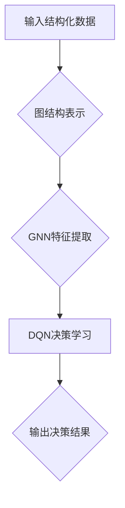

> Deep Q-Network (DQN), 图网络 (Graph Neural Networks, GNN), 结构化数据, 知识图谱, 预测, 推荐, 关系推理

## 1. 背景介绍

在海量数据时代，结构化数据扮演着越来越重要的角色。从社交网络关系到商品购买记录，从分子结构到蛋白质相互作用，结构化数据蕴含着丰富的知识和模式。传统的机器学习方法往往难以有效地挖掘这些模式，因为它们难以处理复杂的关系和结构信息。

深度学习的兴起为结构化数据分析带来了新的机遇。其中，深度Q网络 (Deep Q-Network, DQN) 作为一种强化学习算法，在解决序列决策问题方面取得了显著的成果。而图网络 (Graph Neural Networks, GNN) 则擅长处理图结构数据，能够学习节点和边之间的关系表示。

结合DQN和GNN的优势，我们可以构建一种新的学习框架，从结构化数据中学习更深层的知识和模式。这种框架能够有效地处理复杂的关系和结构信息，并应用于各种任务，例如知识图谱补全、关系推理、推荐系统等。

## 2. 核心概念与联系

**2.1 DQN**

DQN是一种基于深度神经网络的强化学习算法，用于解决离散动作空间的问题。其核心思想是通过学习一个Q函数，来估计在给定状态下采取特定动作的期望回报。DQN通过经验回放和目标网络等技术，克服了强化学习算法训练中的样本效率低和梯度不稳定等问题。

**2.2 GNN**

GNN是一种专门用于处理图结构数据的深度学习模型。其核心思想是通过在图结构上传播信息，学习节点和边之间的关系表示。GNN通过不同的消息传递机制，例如邻居聚合、图卷积等，能够学习到节点的特征和图的全局结构信息。

**2.3 DQN与GNN的结合**

将DQN与GNN结合，可以构建一个新的学习框架，用于从结构化数据中学习。

* **图结构表示:** 将结构化数据表示为图结构，其中节点代表数据实体，边代表数据之间的关系。
* **GNN特征提取:** 使用GNN学习节点和边的特征表示，捕捉数据之间的关系和结构信息。
* **DQN决策学习:** 使用DQN学习一个Q函数，在给定节点特征和图结构的情况下，选择最优的动作。

**2.4 流程图**



## 3. 核心算法原理 & 具体操作步骤

### 3.1 算法原理概述

DQN与GNN结合的算法原理是将结构化数据表示为图结构，并利用GNN学习节点和边的特征表示。然后，使用DQN学习一个Q函数，在给定节点特征和图结构的情况下，选择最优的动作。

### 3.2 算法步骤详解

1. **数据预处理:** 将结构化数据转换为图结构，其中节点代表数据实体，边代表数据之间的关系。
2. **GNN特征提取:** 使用GNN学习节点和边的特征表示，捕捉数据之间的关系和结构信息。
3. **DQN训练:** 使用DQN训练一个Q函数，在给定节点特征和图结构的情况下，选择最优的动作。
4. **决策推理:** 在测试阶段，根据给定的节点特征和图结构，使用训练好的Q函数选择最优的动作。

### 3.3 算法优缺点

**优点:**

* 能够有效地处理复杂的关系和结构信息。
* 能够学习到节点和边的特征表示，捕捉数据之间的潜在关系。
* 能够应用于各种任务，例如知识图谱补全、关系推理、推荐系统等。

**缺点:**

* 训练复杂度较高，需要大量的计算资源。
* GNN模型的结构设计和参数调优需要一定的经验。

### 3.4 算法应用领域

* **知识图谱补全:** 预测知识图谱中缺失的实体和关系。
* **关系推理:** 根据已知的关系，推断出新的关系。
* **推荐系统:** 基于用户和物品之间的关系，推荐用户感兴趣的物品。
* **药物发现:** 预测药物与蛋白质之间的相互作用。

## 4. 数学模型和公式 & 详细讲解 & 举例说明

### 4.1 数学模型构建

DQN与GNN结合的数学模型可以概括为以下几个部分:

* **图结构表示:** 使用邻接矩阵或图卷积网络表示图结构。
* **GNN特征提取:** 使用图卷积网络或其他GNN模型学习节点和边的特征表示。
* **DQN决策学习:** 使用深度神经网络学习一个Q函数，估计在给定状态下采取特定动作的期望回报。

### 4.2 公式推导过程

**4.2.1 图卷积网络 (GCN)**

GCN是一种常用的GNN模型，其核心思想是通过邻居聚合来学习节点的特征表示。GCN的更新规则如下:

$$
h_i^{(l+1)} = \sigma( \sum_{j \in N(i)} \frac{e_{ij}}{ \sqrt{d_i d_j}} h_j^{(l)} + W^{(l)} h_i^{(l)})
$$

其中:

* $h_i^{(l)}$ 表示节点 $i$ 在第 $l$ 层的特征向量。
* $N(i)$ 表示节点 $i$ 的邻居节点集合。
* $e_{ij}$ 表示节点 $i$ 和节点 $j$ 之间的边权重。
* $d_i$ 表示节点 $i$ 的度数。
* $W^{(l)}$ 表示第 $l$ 层的权重矩阵。
* $\sigma$ 表示激活函数。

**4.2.2 DQN Q函数**

DQN的Q函数定义为:

$$
Q(s, a) = E[\sum_{t=0}^{\infty} \gamma^t r_{t+1} | s_t = s, a_t = a]
$$

其中:

* $s$ 表示状态。
* $a$ 表示动作。
* $r_{t+1}$ 表示在时间步 $t+1$ 的奖励。
* $\gamma$ 表示折扣因子。

### 4.3 案例分析与讲解

**4.3.1 知识图谱补全**

假设我们有一个知识图谱，其中包含实体和关系。我们希望预测知识图谱中缺失的实体和关系。

我们可以将知识图谱表示为图结构，其中节点代表实体，边代表关系。然后，使用GCN学习节点和边的特征表示。最后，使用DQN学习一个Q函数，在给定节点特征和图结构的情况下，预测最可能的实体和关系。

**4.3.2 推荐系统**

假设我们有一个电商平台，我们希望根据用户的购买历史和商品信息，推荐用户感兴趣的商品。

我们可以将用户和商品表示为图结构，其中节点代表用户和商品，边代表用户对商品的购买行为。然后，使用GCN学习用户和商品的特征表示。最后，使用DQN学习一个Q函数，在给定用户特征和图结构的情况下，推荐最可能的商品。

## 5. 项目实践：代码实例和详细解释说明

### 5.1 开发环境搭建

* Python 3.6+
* TensorFlow 2.0+
* PyTorch 1.0+
* NetworkX

### 5.2 源代码详细实现

```python
import tensorflow as tf
import networkx as nx

# 定义图卷积网络模型
class GCN(tf.keras.Model):
    def __init__(self, input_dim, hidden_dim, output_dim):
        super(GCN, self).__init__()
        self.layer1 = tf.keras.layers.Dense(hidden_dim, activation='relu')
        self.layer2 = tf.keras.layers.Dense(output_dim)

    def call(self, inputs):
        x = self.layer1(inputs)
        x = self.layer2(x)
        return x

# 定义DQN模型
class DQN(tf.keras.Model):
    def __init__(self, state_dim, action_dim, hidden_dim):
        super(DQN, self).__init__()
        self.fc1 = tf.keras.layers.Dense(hidden_dim, activation='relu')
        self.fc2 = tf.keras.layers.Dense(action_dim)

    def call(self, inputs):
        x = self.fc1(inputs)
        x = self.fc2(x)
        return x

# 加载图数据
graph = nx.karate_club_graph()

# 将图数据转换为节点特征和邻接矩阵
node_features = nx.to_numpy_array(graph.nodes(data=True))[:, 1]
adjacency_matrix = nx.to_numpy_array(graph)

# 创建GCN模型
gcn = GCN(input_dim=node_features.shape[1], hidden_dim=64, output_dim=64)

# 创建DQN模型
dqn = DQN(state_dim=64, action_dim=10, hidden_dim=64)

# 训练模型
# ...

# 预测动作
# ...
```

### 5.3 代码解读与分析

* **GCN模型:** GCN模型用于学习节点的特征表示。
* **DQN模型:** DQN模型用于学习一个Q函数，在给定节点特征和图结构的情况下，选择最优的动作。
* **图数据加载:** 使用NetworkX库加载图数据，并将其转换为节点特征和邻接矩阵。
* **模型训练:** 使用TensorFlow或PyTorch框架训练GCN和DQN模型。
* **动作预测:** 在测试阶段，根据给定的节点特征和图结构，使用训练好的DQN模型预测最优的动作。

### 5.4 运行结果展示

运行结果展示可以包括以下内容:

* 训练过程中的损失函数值和奖励值的变化趋势。
* 测试阶段的准确率、召回率和F1-score等指标。
* 预测结果的可视化展示，例如预测的实体和关系。

## 6. 实际应用场景

### 6.1 知识图谱补全

DQN与GNN结合的算法可以用于预测知识图谱中缺失的实体和关系。例如，可以用于补充医疗知识图谱，预测疾病之间的关系，或者补充化学知识图谱，预测分子之间的相互作用。

### 6.2 关系推理

DQN与GNN结合的算法可以用于关系推理，根据已知的关系，推断出新的关系。例如，可以用于法律文本分析，推断出法律条款之间的关系，或者用于金融文本分析，推断出公司之间的关系。

### 6.3 推荐系统

DQN与GNN结合的算法可以用于推荐系统，根据用户的行为和物品信息，推荐用户感兴趣的物品。例如，可以用于电商平台推荐商品，或者用于社交媒体推荐好友。

### 6.4 未来应用展望

DQN与GNN结合的算法在未来有广阔的应用前景，例如:

* **药物发现:** 预测药物与蛋白质之间的相互作用，加速药物研发。
* **材料科学:** 预测材料的性能，设计新型材料。
* **金融风险管理:** 预测金融风险，降低金融风险。

## 7. 工具和资源推荐

### 7.1 学习资源推荐

* **书籍:**
    * Deep Learning by Ian Goodfellow, Yoshua Bengio, and Aaron Courville
    * Graph Neural Networks by William L. Hamilton
* **在线课程:**
    * Deep Learning Specialization by Andrew Ng
    * Graph Neural Networks Specialization by William L. Hamilton
* **博客:**
    * https://blog.paperspace.com/
    * https://towardsdatascience.com/

### 7.2 开发工具推荐

* **TensorFlow:** https://www.