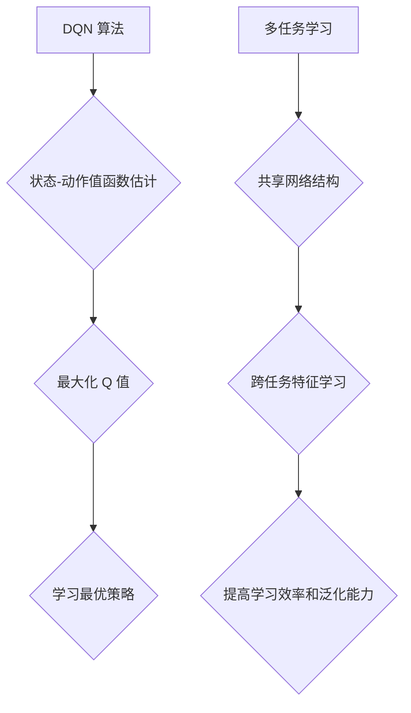

> Deep Q-Network (DQN), 多任务学习, 共享网络结构, 迁移学习, 强化学习, 神经网络

## 1. 背景介绍

在机器学习领域，强化学习 (Reinforcement Learning, RL) 作为一种模仿人类学习的算法，在解决复杂决策问题方面展现出强大的潜力。其中，Deep Q-Network (DQN) 作为一种深度强化学习算法，通过将深度神经网络应用于 Q-learning 算法，成功地解决了传统 Q-learning 算法在处理高维状态空间上的挑战。

然而，在实际应用中，一个智能体通常需要同时处理多个不同的任务。例如，一个自动驾驶汽车需要同时处理避障、路径规划、速度控制等多个任务。传统的 DQN 算法需要针对每个任务单独训练一个独立的网络，这不仅浪费了计算资源，也难以充分利用不同任务之间的知识共享。

多任务学习 (Multi-Task Learning, MTL) 旨在通过训练一个共享网络结构来学习多个任务，从而提高学习效率和泛化能力。共享网络结构可以帮助模型学习到跨任务的通用特征，从而更好地应对新的任务。

## 2. 核心概念与联系

**2.1 DQN 算法原理**

DQN 算法的核心思想是利用深度神经网络来估计状态-动作值函数 Q(s, a)，该函数表示在状态 s 下执行动作 a 的期望回报。DQN 算法通过最大化 Q 值来学习最优策略。

**2.2 多任务学习 (MTL) 原理**

MTL 算法的核心思想是共享一个网络结构来学习多个任务，并通过任务之间的交互来提高学习效率和泛化能力。MTL 算法通常采用以下两种策略：

* **Hard Parameter Sharing:** 所有任务共享同一个网络结构和参数。
* **Soft Parameter Sharing:** 所有任务共享一个基础网络结构，每个任务在其基础上添加了特定的层或参数。

**2.3 共享网络结构的优势**

共享网络结构在多任务学习中具有以下优势：

* **提高学习效率:** 通过共享网络结构，可以减少模型参数的数量，从而降低训练时间和计算资源消耗。
* **增强泛化能力:** 共享网络结构可以帮助模型学习到跨任务的通用特征，从而更好地应对新的任务。
* **促进知识迁移:** MTL 算法可以促进不同任务之间的知识迁移，从而提高模型在新的任务上的性能。

**2.4 Mermaid 流程图**



## 3. 核心算法原理 & 具体操作步骤

### 3.1 算法原理概述

DQN 算法的核心思想是利用深度神经网络来估计状态-动作值函数 Q(s, a)，该函数表示在状态 s 下执行动作 a 的期望回报。DQN 算法通过最大化 Q 值来学习最优策略。

多任务学习 (MTL) 算法的核心思想是共享一个网络结构来学习多个任务，并通过任务之间的交互来提高学习效率和泛化能力。MTL 算法通常采用以下两种策略：

* **Hard Parameter Sharing:** 所有任务共享同一个网络结构和参数。
* **Soft Parameter Sharing:** 所有任务共享一个基础网络结构，每个任务在其基础上添加了特定的层或参数。

### 3.2 算法步骤详解

**DQN 算法步骤:**

1. 初始化深度神经网络，并随机初始化网络参数。
2. 从环境中获取初始状态 s。
3. 根据策略 π 选择动作 a。
4. 执行动作 a，并观察下一个状态 s' 和奖励 r。
5. 更新 Q 值表，并根据经验回放算法从经验池中随机抽取样本进行训练。
6. 重复步骤 2-5，直到达到训练目标。

**MTL 算法步骤:**

1. 初始化共享网络结构，并随机初始化网络参数。
2. 对于每个任务，定义任务特定的损失函数。
3. 使用所有任务的训练数据进行联合训练，并根据任务特定的损失函数进行权重调整。
4. 重复步骤 2-3，直到达到训练目标。

### 3.3 算法优缺点

**DQN 算法:**

* **优点:** 可以处理高维状态空间，学习能力强。
* **缺点:** 训练过程不稳定，容易出现震荡。

**MTL 算法:**

* **优点:** 提高学习效率，增强泛化能力，促进知识迁移。
* **缺点:** 需要设计合理的任务权重，避免任务之间的冲突。

### 3.4 算法应用领域

**DQN 算法:**

* 游戏 AI
* 自动驾驶
* 机器人控制

**MTL 算法:**

* 自然语言处理
* 图像识别
* 医疗诊断

## 4. 数学模型和公式 & 详细讲解 & 举例说明

### 4.1 数学模型构建

**状态-动作值函数:**

$$Q(s, a) = E[\sum_{t=0}^{\infty} \gamma^t r_{t+1} | s_t = s, a_t = a]$$

其中:

* $s$ 表示状态
* $a$ 表示动作
* $r_{t+1}$ 表示在时间步 t+1 获得的奖励
* $\gamma$ 表示折扣因子，控制未来奖励的权重

**损失函数:**

$$L = E[(y - Q(s, a))^2]$$

其中:

* $y$ 表示目标值，计算公式为 $y = r + \gamma \max_{a'} Q(s', a')$
* $s'$ 表示下一个状态

**任务损失函数:**

$$L_i = \frac{1}{N_i} \sum_{j=1}^{N_i} L_j$$

其中:

* $i$ 表示任务索引
* $N_i$ 表示任务 i 的样本数量
* $L_j$ 表示任务 i 的第 j 个样本的损失

### 4.2 公式推导过程

DQN 算法的目标是最大化 Q 值，因此使用梯度下降算法进行训练。损失函数的梯度可以用来更新网络参数。

MTL 算法的目标是联合训练多个任务，因此需要设计合理的任务损失函数。任务损失函数可以根据任务的重要性进行权重调整。

### 4.3 案例分析与讲解

假设我们有两个任务：

* 任务 1: 预测股票价格
* 任务 2: 预测天气

我们可以使用 MTL 算法训练一个共享网络结构来学习这两个任务。

在训练过程中，我们可以根据任务的重要性调整任务损失函数的权重。例如，如果预测股票价格比预测天气更重要，那么我们可以将任务 1 的损失函数权重设置为 2，任务 2 的损失函数权重设置为 1。

## 5. 项目实践：代码实例和详细解释说明

### 5.1 开发环境搭建

* Python 3.6+
* TensorFlow 2.0+
* PyTorch 1.0+

### 5.2 源代码详细实现

```python
import tensorflow as tf

# 定义共享网络结构
class SharedNetwork(tf.keras.Model):
    def __init__(self):
        super(SharedNetwork, self).__init__()
        self.dense1 = tf.keras.layers.Dense(128, activation='relu')
        self.dense2 = tf.keras.layers.Dense(64, activation='relu')
        self.output = tf.keras.layers.Dense(1)

    def call(self, x):
        x = self.dense1(x)
        x = self.dense2(x)
        return self.output(x)

# 定义任务 1 的损失函数
def task1_loss(y_true, y_pred):
    return tf.keras.losses.MeanSquaredError()(y_true, y_pred)

# 定义任务 2 的损失函数
def task2_loss(y_true, y_pred):
    return tf.keras.losses.BinaryCrossentropy()(y_true, y_pred)

# 创建共享网络结构
shared_network = SharedNetwork()

# 创建任务 1 的模型
model1 = tf.keras.Model(inputs=shared_network.input, outputs=shared_network.output)
model1.compile(optimizer='adam', loss=task1_loss)

# 创建任务 2 的模型
model2 = tf.keras.Model(inputs=shared_network.input, outputs=shared_network.output)
model2.compile(optimizer='adam', loss=task2_loss)

# 训练模型
model1.fit(x_train1, y_train1, epochs=10)
model2.fit(x_train2, y_train2, epochs=10)
```

### 5.3 代码解读与分析

* 代码首先定义了一个共享网络结构，该网络结构包含两个全连接层和一个输出层。
* 然后，代码定义了任务 1 和任务 2 的损失函数。
* 接着，代码创建了任务 1 和任务 2 的模型，并将共享网络结构作为模型的输入层。
* 最后，代码训练了任务 1 和任务 2 的模型。

### 5.4 运行结果展示

运行结果展示可以根据实际情况进行调整，例如：

* 训练过程中损失函数的变化趋势
* 测试集上的准确率

## 6. 实际应用场景

### 6.1 自动驾驶

自动驾驶系统需要同时处理多个任务，例如避障、路径规划、速度控制等。使用 MTL 算法可以训练一个共享网络结构来学习这些任务，从而提高学习效率和泛化能力。

### 6.2 机器人控制

机器人控制系统需要控制机器人的运动和操作。使用 MTL 算法可以训练一个共享网络结构来学习不同的控制策略，从而提高机器人的控制精度和鲁棒性。

### 6.3 自然语言处理

自然语言处理任务通常需要处理多个子任务，例如文本分类、情感分析、机器翻译等。使用 MTL 算法可以训练一个共享网络结构来学习这些子任务，从而提高模型的性能和效率。

### 6.4 未来应用展望

随着深度学习技术的不断发展，MTL 算法在未来将有更广泛的应用场景。例如，在医疗诊断、金融预测、个性化推荐等领域，MTL 算法可以帮助模型学习到更丰富的知识，从而提高模型的性能和准确性。

## 7. 工具和资源推荐

### 7.1 学习资源推荐

* **书籍:**
    * Deep Reinforcement Learning Hands-On
    * Multi-Task Learning: A Survey
* **论文:**
    * Deep Multi-Task Learning
    * Multi-Task Learning with Deep Neural Networks

### 7.2 开发工具推荐

* **TensorFlow:** https://www.tensorflow.org/
* **PyTorch:** https://pytorch.org/

### 7.3 相关论文推荐

* **Multi-Task Learning with Deep Neural Networks**
* **Deep Multi-Task Learning**
* **Hierarchical Multi-Task Learning**

## 8. 总结：未来发展趋势与挑战

### 8.1 研究成果总结

DQN 算法和 MTL 算法在强化学习和多任务学习领域取得了显著的成果，为解决复杂决策问题提供了新的思路和方法。

### 8.2 未来发展趋势

* **更有效的 MTL 算法:** 研究更有效的 MTL 算法，例如动态任务选择、任务关系挖掘等。
* **更强大的模型架构:** 设计更强大的模型架构，例如 Transformer、Graph Neural Network 等，用于处理更复杂的任务。
* **更广泛的应用场景:** 将 MTL 算法应用于更多领域，例如医疗诊断、金融预测、个性化推荐等。

### 8.3 面临的挑战

* **任务冲突:** 不同任务之间可能存在冲突，需要设计合理的策略来解决任务冲突。
* **数据稀缺:** 某些任务的数据可能稀缺，需要探索数据增强和迁移学习等方法