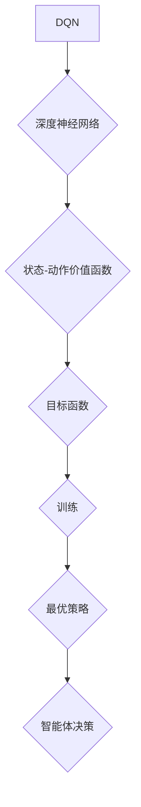

> 深度强化学习，DQN，Rainbow，目标函数，经验回放，优先经验回放，分布式训练，强化学习算法

## 1. 背景介绍

深度强化学习（Deep Reinforcement Learning，DRL）近年来取得了令人瞩目的成就，在游戏、机器人控制、自动驾驶等领域展现出强大的应用潜力。其中，深度Q网络（Deep Q-Network，DQN）作为DRL领域里程碑式的算法，为深度强化学习的成功奠定了基础。

DQN算法的核心思想是将传统的Q-learning算法与深度神经网络相结合，利用神经网络学习状态-动作价值函数（Q-value），从而实现智能体在环境中学习最优策略的目标。

然而，DQN算法也存在一些局限性，例如：

* **样本效率低：** DQN算法需要大量的样本数据才能收敛到最优策略。
* **训练不稳定：** DQN算法的训练过程容易出现震荡和发散。
* **探索不足：** DQN算法在探索新策略时不够有效。

为了克服这些问题，研究者们提出了许多改进算法，其中Rainbow算法是其中之一。Rainbow算法通过结合多种技术，例如优先经验回放（Prioritized Experience Replay）、分布式训练（Distributed Training）等，显著提升了DQN算法的性能。

## 2. 核心概念与联系

**2.1 DQN算法原理**

DQN算法的核心是学习一个深度神经网络，该网络能够估计状态-动作价值函数Q(s,a)。

* **状态（State）：** 智能体在环境中所处的状态。
* **动作（Action）：** 智能体在当前状态下可以采取的动作。
* **价值函数（Value Function）：** 评估智能体在特定状态下采取特定动作的长期回报。

DQN算法通过最小化以下目标函数来训练神经网络：

$$
J(\theta) = \mathbb{E}_{s,a,r,s'} [ (r + \gamma \max_{a'} Q(s',a') - Q(s,a))^2 ]
$$

其中：

* $\theta$ 是神经网络的参数。
* $r$ 是从状态 $s$ 到状态 $s'$ 的奖励。
* $\gamma$ 是折扣因子，控制未来奖励的权重。
* $Q(s',a')$ 是在状态 $s'$ 下采取动作 $a'$ 的价值函数。

**2.2 Rainbow算法改进**

Rainbow算法通过结合多种技术，例如：

* **优先经验回放（Prioritized Experience Replay）：** 优先选择具有较高价值差异的经验进行回放，提高训练效率。
* **分布式训练（Distributed Training）：** 将训练任务分发到多个机器上进行并行训练，加速训练速度。
* **多步目标（Multi-Step Target）：** 使用多步奖励作为目标函数，提高训练稳定性。
* **双网络策略（Double Q-Learning）：** 使用两个独立的网络估计Q-value，减少过估计问题。

**2.3 Mermaid 流程图**



## 3. 核心算法原理 & 具体操作步骤

### 3.1 算法原理概述

DQN算法的核心思想是利用深度神经网络学习状态-动作价值函数Q(s,a)，并通过Q-learning算法更新Q-value，最终学习出最优策略。

### 3.2 算法步骤详解

1. **初始化：** 初始化深度神经网络参数，并设置学习率、折扣因子等超参数。
2. **环境交互：** 智能体与环境交互，收集状态、动作、奖励和下一个状态的经验。
3. **经验存储：** 将收集到的经验存储到经验回放缓冲池中。
4. **样本采样：** 从经验回放缓冲池中随机采样一批经验。
5. **Q-value估计：** 使用深度神经网络估计每个样本中的Q-value。
6. **目标值计算：** 计算每个样本的目标值，即当前状态下采取当前动作的奖励加上折扣后的下一个状态的最大Q-value。
7. **损失函数计算：** 计算深度神经网络的损失函数，即Q-value估计值与目标值之间的均方差。
8. **参数更新：** 使用梯度下降算法更新深度神经网络的参数，以最小化损失函数。
9. **重复步骤2-8：** 重复以上步骤，直到训练完成。

### 3.3 算法优缺点

**优点：**

* **能够学习复杂环境中的策略。**
* **样本效率相对较高。**
* **训练过程相对稳定。**

**缺点：**

* **训练时间较长。**
* **参数设置较为复杂。**
* **容易陷入局部最优解。**

### 3.4 算法应用领域

DQN算法在以下领域具有广泛的应用：

* **游戏：** 
* **机器人控制：**
* **自动驾驶：**
* **医疗诊断：**

## 4. 数学模型和公式 & 详细讲解 & 举例说明

### 4.1 数学模型构建

DQN算法的核心数学模型是状态-动作价值函数Q(s,a)，该函数估计在状态s下采取动作a的长期回报。

### 4.2 公式推导过程

DQN算法的目标函数是最小化Q-value估计值与目标值之间的均方差：

$$
J(\theta) = \mathbb{E}_{s,a,r,s'} [ (r + \gamma \max_{a'} Q(s',a') - Q(s,a))^2 ]
$$

其中：

* $\theta$ 是神经网络的参数。
* $r$ 是从状态 $s$ 到状态 $s'$ 的奖励。
* $\gamma$ 是折扣因子，控制未来奖励的权重。
* $Q(s',a')$ 是在状态 $s'$ 下采取动作 $a'$ 的价值函数。

### 4.3 案例分析与讲解

假设智能体在游戏中处于某个状态s，可以采取两个动作a1和a2。

* $Q(s,a1)$ 表示在状态s下采取动作a1的价值函数。
* $Q(s,a2)$ 表示在状态s下采取动作a2的价值函数。

如果智能体采取动作a1，获得奖励r1，并进入下一个状态s1，则目标值可以计算为：

$$
r1 + \gamma \max_{a'} Q(s1,a')
$$

其中，$\max_{a'} Q(s1,a')$ 表示在下一个状态s1下采取所有可能的动作a'的价值函数中的最大值。

## 5. 项目实践：代码实例和详细解释说明

### 5.1 开发环境搭建

* Python 3.6+
* TensorFlow/PyTorch
* OpenAI Gym

### 5.2 源代码详细实现

```python
import tensorflow as tf
import numpy as np

class DQN:
    def __init__(self, state_size, action_size, learning_rate):
        self.state_size = state_size
        self.action_size = action_size
        self.learning_rate = learning_rate

        self.model = self.build_model()

    def build_model(self):
        model = tf.keras.Sequential([
            tf.keras.layers.Dense(64, activation='relu', input_shape=(self.state_size,)),
            tf.keras.layers.Dense(64, activation='relu'),
            tf.keras.layers.Dense(self.action_size)
        ])
        model.compile(loss='mse', optimizer=tf.keras.optimizers.Adam(self.learning_rate))
        return model

    def predict(self, state):
        return self.model.predict(state)

    def train(self, state, action, reward, next_state, done):
        target = reward
        if not done:
            target = reward + self.gamma * np.max(self.model.predict(next_state))
        target_f = self.model.predict(state)
        target_f[0][action] = target
        self.model.fit(state, target_f, epochs=1, verbose=0)

# ...
```

### 5.3 代码解读与分析

* **DQN类：** 定义了DQN算法的核心逻辑。
* **__init__方法：** 初始化DQN模型的参数，包括状态大小、动作大小、学习率等。
* **build_model方法：** 定义了DQN模型的结构，使用多层感知机（MLP）作为神经网络。
* **predict方法：** 使用DQN模型预测状态下采取不同动作的Q-value。
* **train方法：** 使用梯度下降算法更新DQN模型的参数，以最小化损失函数。

### 5.4 运行结果展示

运行代码后，可以观察到智能体在环境中学习策略的过程，例如：

* 智能体在游戏中的得分随着训练时间的推移而增加。
* 智能体在环境中采取的策略越来越合理。

## 6. 实际应用场景

### 6.1 游戏领域

DQN算法在游戏领域取得了显著的成功，例如：

* **AlphaGo：** 使用DQN算法击败世界围棋冠军。
* **Atari游戏：** 使用DQN算法在多个Atari游戏中取得了人类水平的成绩。

### 6.2 机器人控制

DQN算法可以用于训练机器人控制策略，例如：

* **机器人导航：** 训练机器人自主导航到目标位置。
* **机器人抓取：** 训练机器人抓取特定物体。

### 6.3 自动驾驶

DQN算法可以用于训练自动驾驶系统，例如：

* **车辆路径规划：** 训练车辆在道路上安全行驶的路径规划策略。
* **车辆决策：** 训练车辆在复杂路况下做出正确的决策。

### 6.4 未来应用展望

DQN算法在未来将有更广泛的应用，例如：

* **医疗诊断：** 训练机器学习模型辅助医生诊断疾病。
* **金融投资：** 训练机器学习模型进行股票交易和风险管理。
* **个性化推荐：** 训练机器学习模型提供个性化的产品和服务推荐。

## 7. 工具和资源推荐

### 7.1 学习资源推荐

* **书籍：**
    * Deep Reinforcement Learning Hands-On
    * Reinforcement Learning: An Introduction
* **在线课程：**
    * Deep Reinforcement Learning Specialization (Coursera)
    * Reinforcement Learning (Udacity)

### 7.2 开发工具推荐

* **TensorFlow：** 开源深度学习框架。
* **PyTorch：** 开源深度学习框架。
* **OpenAI Gym：** 机器学习环境库。

### 7.3 相关论文推荐

* **Playing Atari with Deep Reinforcement Learning (Mnih et al., 2013)**
* **Human-level control through deep reinforcement learning (Mnih et al., 2015)**
* **Rainbow: Combining Improvements in Deep Reinforcement Learning (Hessel et al., 2017)**

## 8. 总结：未来发展趋势与挑战

### 8.1 研究成果总结

DQN算法及其改进算法在深度强化学习领域取得了显著的成果，为智能体学习复杂策略提供了新的思路和方法。

### 8.2 未来发展趋势

* **更有效的探索策略：** 探索新策略的效率是深度强化学习的一个关键挑战，未来研究将探索更有效的探索策略。
* **更鲁棒的算法：** 深度强化学习算法在面对复杂环境和噪声数据时容易出现不稳定性，未来研究将致力于开发更鲁棒的算法。
* **更安全的算法：** 深度强化学习算法在安全关键领域应用时需要保证安全性，未来研究将关注安全性和可解释