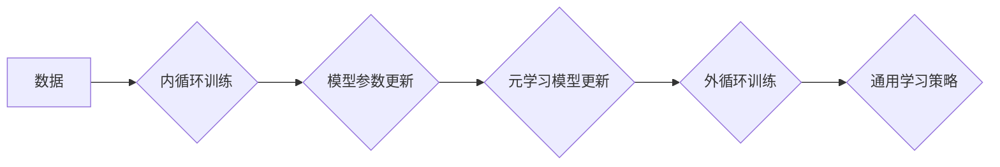

> 元学习，反向传播，神经网络，优化算法，迁移学习，深度学习

## 1. 背景介绍

在机器学习领域，模型的训练通常是一个耗时且资源密集的过程。对于每个新的任务，都需要从头开始收集数据、训练模型，这在现实应用中往往不可行。元学习（Meta-Learning）应运而生，它旨在学习如何学习，从而提高模型在新的任务上的泛化能力和学习效率。

反向传播算法（Backpropagation）是深度学习的核心训练算法，它通过计算梯度来更新模型参数，使得模型在训练数据上表现越来越好。然而，反向传播算法的局限性在于，它需要大量的训练数据才能达到最佳性能，并且在面对新的任务时，其性能往往会下降。

元学习试图解决这些问题，它通过学习一些通用的学习策略，使得模型能够更快速地适应新的任务。

## 2. 核心概念与联系

元学习的核心思想是将学习过程本身作为学习目标。它通过学习一些通用的学习策略，使得模型能够更快速地适应新的任务。

**元学习框架**

元学习框架通常包含以下几个关键部分：

* **内循环:** 针对单个任务进行训练，更新模型参数。
* **外循环:** 针对多个任务进行训练，更新元学习模型的参数。
* **元学习模型:** 学习通用的学习策略，指导内循环的训练过程。

**反向传播与元学习**

反向传播算法是元学习框架的基础，它用于更新模型参数。在元学习框架中，反向传播算法被应用于内循环的训练过程，以更新模型参数。

**Mermaid 流程图**



## 3. 核心算法原理 & 具体操作步骤

### 3.1  算法原理概述

元学习算法的核心是学习一个通用的学习策略，这个策略能够指导模型在新的任务上快速学习。常见的元学习算法包括：

* **Model-Agnostic Meta-Learning (MAML):** 通过在多个任务上进行微调，学习一个初始模型参数，使得模型能够快速适应新的任务。
* **Prototypical Networks:** 通过学习每个类的原型，使得模型能够快速分类新的数据点。
* **Matching Networks:** 通过学习一个匹配函数，使得模型能够比较两个数据点的相似性。

### 3.2  算法步骤详解

以MAML算法为例，其具体操作步骤如下：

1. **初始化:** 初始化一个模型参数θ。
2. **内循环训练:**
    * 随机选择一个任务，并从该任务的训练数据中抽取一小批数据。
    * 使用模型参数θ对数据进行训练，更新模型参数θ。
3. **外循环训练:**
    * 对所有任务进行内循环训练，更新模型参数θ。
    * 使用损失函数计算模型在所有任务上的性能，并根据梯度更新模型参数θ。
4. **测试:** 使用训练好的模型参数θ对新的任务进行测试。

### 3.3  算法优缺点

**优点:**

* 能够快速适应新的任务。
* 能够利用少量的训练数据。

**缺点:**

* 训练过程复杂，计算量大。
* 对于一些复杂的任务，性能可能不如传统方法。

### 3.4  算法应用领域

元学习算法在以下领域具有广泛的应用前景：

* **自然语言处理:** 文本分类、机器翻译、问答系统等。
* **计算机视觉:** 图像识别、目标检测、图像分割等。
* **机器人学:** 运动规划、任务学习、适应性控制等。

## 4. 数学模型和公式 & 详细讲解 & 举例说明

### 4.1  数学模型构建

元学习算法通常使用以下数学模型：

* **损失函数:** 用于衡量模型在训练数据上的性能。
* **优化器:** 用于更新模型参数，使得损失函数最小化。
* **学习率:** 控制优化器更新参数的步长。

### 4.2  公式推导过程

MAML算法的损失函数可以表示为：

$$
L(\theta) = \sum_{i=1}^{N} \mathcal{L}_i(\theta_i)
$$

其中：

* $L(\theta)$ 是模型的总损失函数。
* $N$ 是训练任务的数量。
* $\mathcal{L}_i(\theta_i)$ 是第 $i$ 个任务的损失函数。
* $\theta_i$ 是第 $i$ 个任务的模型参数。

### 4.3  案例分析与讲解

假设我们有一个图像分类任务，需要训练一个模型来识别猫和狗的图片。我们可以使用MAML算法来训练这个模型。

1. 我们首先收集一些猫和狗的图片，并将其分为训练集和测试集。
2. 然后，我们使用MAML算法训练一个模型，该模型能够识别猫和狗的图片。
3. 在训练过程中，我们随机选择一些任务，每个任务包含一些猫和狗的图片。
4. 模型在每个任务上进行微调，更新模型参数。
5. 最后，我们使用训练好的模型对测试集进行测试，评估模型的性能。

## 5. 项目实践：代码实例和详细解释说明

### 5.1  开发环境搭建

* Python 3.6+
* TensorFlow 2.0+
* PyTorch 1.0+

### 5.2  源代码详细实现

```python
import tensorflow as tf

# 定义模型
class Model(tf.keras.Model):
    def __init__(self):
        super(Model, self).__init__()
        self.dense1 = tf.keras.layers.Dense(128, activation='relu')
        self.dense2 = tf.keras.layers.Dense(10, activation='softmax')

    def call(self, x):
        x = self.dense1(x)
        x = self.dense2(x)
        return x

# 定义损失函数和优化器
loss_fn = tf.keras.losses.CategoricalCrossentropy()
optimizer = tf.keras.optimizers.Adam(learning_rate=0.001)

# 定义元学习模型
meta_model = Model()

# 定义训练任务
tasks = [
    # ...
]

# 元学习训练
for epoch in range(num_epochs):
    for task in tasks:
        # 内循环训练
        for step in range(num_steps):
            # 获取训练数据
            x_train, y_train = task.get_train_data()
            # 计算梯度
            with tf.GradientTape() as tape:
                predictions = meta_model(x_train)
                loss = loss_fn(y_train, predictions)
            # 更新模型参数
            gradients = tape.gradient(loss, meta_model.trainable_variables)
            optimizer.apply_gradients(zip(gradients, meta_model.trainable_variables))

# 测试
# ...
```

### 5.3  代码解读与分析

* 代码首先定义了模型、损失函数和优化器。
* 然后，定义了元学习模型，并定义了训练任务。
* 在元学习训练过程中，对每个任务进行内循环训练，更新模型参数。
* 最后，使用训练好的模型对测试集进行测试。

### 5.4  运行结果展示

* 训练过程中，可以监控模型在每个任务上的损失函数值。
* 测试完成后，可以评估模型在测试集上的准确率。

## 6. 实际应用场景

元学习算法在以下实际应用场景中具有广泛的应用前景：

* **个性化推荐:** 根据用户的历史行为，学习用户的偏好，并推荐个性化的商品或内容。
* **医疗诊断:** 学习医生诊断疾病的经验，辅助医生进行诊断。
* **金融风险控制:** 学习金融市场的数据模式，预测和控制金融风险。

### 6.4  未来应用展望

随着元学习算法的不断发展，其应用场景将会更加广泛。未来，元学习算法可能被应用于以下领域：

* **自动驾驶:** 学习驾驶员的驾驶习惯，提高自动驾驶系统的安全性。
* **机器人学习:** 使机器人能够更快速地学习新的任务，并适应不同的环境。
* **人工智能增强:** 增强人类智能，帮助人类解决更复杂的问题。

## 7. 工具和资源推荐

### 7.1  学习资源推荐

* **书籍:**
    * 《Deep Learning》 by Ian Goodfellow, Yoshua Bengio, and Aaron Courville
    * 《Meta-Learning with Neural Networks》 by Timothy Hospedales
* **论文:**
    * 《Model-Agnostic Meta-Learning for Fast Adaptation of Deep Networks》 by Finn et al.
    * 《Prototypical Networks for Few-Shot Learning》 by Snell et al.

### 7.2  开发工具推荐

* **TensorFlow:** https://www.tensorflow.org/
* **PyTorch:** https://pytorch.org/

### 7.3  相关论文推荐

* 《Meta-Learning with Differentiable Convex Optimization》 by Wang et al.
* 《Learning to Learn by Gradient Descent by Gradient Descent》 by Andrychowicz et al.

## 8. 总结：未来发展趋势与挑战

### 8.1  研究成果总结

元学习算法取得了显著的进展，在许多任务上都表现出优异的性能。

### 8.2  未来发展趋势

* **更有效的元学习算法:** 研究更有效的元学习算法，提高模型的学习效率和泛化能力。
* **更广泛的应用场景:** 将元学习算法应用于更多领域，解决更复杂的问题。
* **理论研究:** 深入研究元学习算法的理论基础，理解其工作原理。

### 8.3  面临的挑战

* **数据效率:** 元学习算法仍然需要大量的训练数据才能达到最佳性能。
* **计算复杂度:** 元学习算法的训练过程计算量大，需要强大的计算资源。
* **可解释性:** 元学习算法的决策过程难以解释，这限制了其在一些应用场景中的应用。

### 8.4  研究展望

未来，元学习算法将继续发展，成为人工智能领域的重要研究方向。

## 9. 附录：常见问题与解答

* **什么是元学习？**

元学习是指学习如何学习，它旨在学习通用的学习策略，使得模型能够更快速地适应新的任务。

* **元学习算法有哪些？**

常见的元学习算法包括MAML、Prototypical Networks和Matching Networks。

* **元学习算法的应用场景有哪些？**

元学习算法在自然语言处理、计算机视觉、机器人学等领域具有广泛的应用前景。


作者：禅与计算机程序设计艺术 / Zen and the Art of Computer Programming 
<end_of_turn>