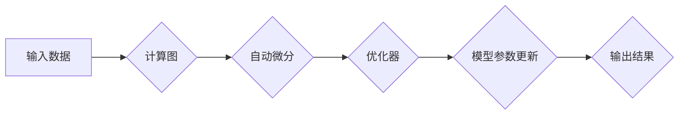

> 深度学习框架，定制化，扩展，模型训练，性能优化，应用场景

## 1. 背景介绍

深度学习近年来取得了令人瞩目的成就，在图像识别、自然语言处理、语音识别等领域展现出强大的能力。这些成就离不开深度学习框架的蓬勃发展。深度学习框架提供了一套完整的工具和机制，简化了模型构建、训练和部署的过程。

然而，现有的深度学习框架，例如TensorFlow、PyTorch、Keras等，虽然功能强大，但并非适用于所有场景。一些特定应用场景可能需要定制化的框架，以满足其独特的需求。例如，在资源受限的嵌入式设备上部署深度学习模型，需要一个轻量级的框架；在高性能计算环境下训练大型模型，需要一个能够充分利用并行计算能力的框架。

## 2. 核心概念与联系

深度学习框架的核心概念包括：

* **计算图:**  深度学习模型的计算过程可以表示为一个计算图，其中节点代表操作，边代表数据流。
* **自动微分:** 自动微分是深度学习框架的核心技术之一，它能够自动计算模型参数的梯度，从而实现模型的训练。
* **张量:** 张量是深度学习框架中用于表示数据的基本数据结构，它可以表示多维数组。
* **优化器:** 优化器用于更新模型参数，使其朝着最小化损失函数的方向进行调整。

**Mermaid 流程图:**



## 3. 核心算法原理 & 具体操作步骤

### 3.1  算法原理概述

深度学习框架的核心算法原理主要包括：

* **反向传播算法:** 反向传播算法用于计算模型参数的梯度，它是深度学习训练的基础。
* **梯度下降算法:** 梯度下降算法用于更新模型参数，使其朝着最小化损失函数的方向进行调整。
* **动量法:** 动量法是一种改进梯度下降算法的优化方法，它可以加速模型的收敛速度。

### 3.2  算法步骤详解

**反向传播算法步骤:**

1. 将输入数据输入到模型中，计算模型的输出。
2. 计算模型输出与真实值的损失函数。
3. 使用链式法则计算损失函数对每个参数的梯度。
4. 根据梯度更新模型参数。

**梯度下降算法步骤:**

1. 初始化模型参数。
2. 计算模型输出与真实值的损失函数。
3. 计算损失函数对每个参数的梯度。
4. 根据梯度更新模型参数。
5. 重复步骤2-4，直到损失函数收敛。

### 3.3  算法优缺点

**反向传播算法:**

* **优点:** 能够有效地计算模型参数的梯度，是深度学习训练的基础。
* **缺点:** 计算量较大，训练速度较慢。

**梯度下降算法:**

* **优点:** 简单易实现，能够有效地更新模型参数。
* **缺点:** 容易陷入局部最优解，收敛速度较慢。

### 3.4  算法应用领域

反向传播算法和梯度下降算法广泛应用于深度学习的各个领域，例如：

* **图像识别:** 用于训练图像分类、目标检测、图像分割等模型。
* **自然语言处理:** 用于训练文本分类、机器翻译、文本生成等模型。
* **语音识别:** 用于训练语音识别、语音合成等模型。

## 4. 数学模型和公式 & 详细讲解 & 举例说明

### 4.1  数学模型构建

深度学习模型的数学模型通常基于神经网络结构，其中每个神经元接收多个输入，并通过激活函数进行处理，最终输出一个值。

**神经网络模型数学表示:**

$$
y = f(W^L x^L + b^L)
$$

其中：

* $y$ 是模型输出
* $x^L$ 是第 $L$ 层的输入
* $W^L$ 是第 $L$ 层的权重矩阵
* $b^L$ 是第 $L$ 层的偏置向量
* $f$ 是激活函数

### 4.2  公式推导过程

反向传播算法的核心是计算损失函数对每个参数的梯度。

**损失函数:**

$$
L = \frac{1}{N} \sum_{i=1}^{N} (y_i - \hat{y}_i)^2
$$

其中：

* $L$ 是损失函数
* $N$ 是样本数量
* $y_i$ 是第 $i$ 个样本的真实值
* $\hat{y}_i$ 是第 $i$ 个样本的预测值

**梯度计算:**

使用链式法则可以计算损失函数对每个参数的梯度。

### 4.3  案例分析与讲解

**举例说明:**

假设我们有一个简单的线性回归模型，其数学模型为：

$$
y = Wx + b
$$

其中：

* $y$ 是模型输出
* $x$ 是输入
* $W$ 是权重
* $b$ 是偏置

损失函数为均方误差:

$$
L = \frac{1}{N} \sum_{i=1}^{N} (y_i - \hat{y}_i)^2
$$

使用反向传播算法可以计算损失函数对 $W$ 和 $b$ 的梯度，并根据梯度更新 $W$ 和 $b$ 的值。

## 5. 项目实践：代码实例和详细解释说明

### 5.1  开发环境搭建

深度学习框架的定制与扩展通常需要使用Python语言进行开发。开发环境搭建包括：

* 安装Python语言环境
* 安装深度学习框架（例如TensorFlow、PyTorch）
* 安装必要的库和工具

### 5.2  源代码详细实现

**代码示例:**

```python
import tensorflow as tf

# 定义模型
model = tf.keras.models.Sequential([
    tf.keras.layers.Dense(10, activation='relu', input_shape=(784,)),
    tf.keras.layers.Dense(10)
])

# 编译模型
model.compile(optimizer='adam',
              loss='sparse_categorical_crossentropy',
              metrics=['accuracy'])

# 训练模型
model.fit(x_train, y_train, epochs=10)

# 评估模型
loss, accuracy = model.evaluate(x_test, y_test)
print('Loss:', loss)
print('Accuracy:', accuracy)
```

### 5.3  代码解读与分析

**代码解读:**

* 首先，我们使用TensorFlow框架定义了一个简单的多层感知机模型。
* 然后，我们使用Adam优化器、稀疏类别交叉熵损失函数和准确率指标编译模型。
* 接着，我们使用训练数据训练模型，训练epochs设置为10。
* 最后，我们使用测试数据评估模型的性能。

### 5.4  运行结果展示

训练完成后，我们可以查看模型的训练损失和准确率曲线，以及测试集上的准确率。

## 6. 实际应用场景

深度学习框架的定制与扩展在以下场景中具有重要意义：

* **嵌入式设备:** 在资源受限的嵌入式设备上部署深度学习模型，需要一个轻量级的框架。
* **高性能计算:** 在高性能计算环境下训练大型模型，需要一个能够充分利用并行计算能力的框架。
* **特定应用场景:** 一些特定应用场景可能需要定制化的框架，以满足其独特的需求。

### 6.4  未来应用展望

随着深度学习技术的不断发展，深度学习框架的定制与扩展将变得更加重要。未来，我们可能会看到以下趋势：

* **更灵活的框架:** 框架将更加灵活，能够更好地适应不同的应用场景。
* **更易于使用的框架:** 框架将更加易于使用，降低了开发门槛。
* **更强大的功能:** 框架将提供更强大的功能，例如自动模型搜索、模型压缩等。

## 7. 工具和资源推荐

### 7.1  学习资源推荐

* **TensorFlow官方文档:** https://www.tensorflow.org/
* **PyTorch官方文档:** https://pytorch.org/
* **深度学习书籍:** 《深度学习》、《动手学深度学习》

### 7.2  开发工具推荐

* **Jupyter Notebook:** 用于深度学习代码开发和实验。
* **VS Code:** 一款功能强大的代码编辑器，支持深度学习开发。

### 7.3  相关论文推荐

* **《Attention Is All You Need》:** https://arxiv.org/abs/1706.03762
* **《BERT: Pre-training of Deep Bidirectional Transformers for Language Understanding》:** https://arxiv.org/abs/1810.04805

## 8. 总结：未来发展趋势与挑战

### 8.1  研究成果总结

深度学习框架的定制与扩展取得了显著进展，为深度学习的应用提供了更灵活、更强大的工具。

### 8.2  未来发展趋势

未来，深度学习框架将更加灵活、易用、功能强大，并更好地适应不同的应用场景。

### 8.3  面临的挑战

深度学习框架的定制与扩展仍然面临一些挑战，例如：

* 如何设计更灵活、更易于使用的框架。
* 如何提高框架的性能和效率。
* 如何确保框架的安全性、可靠性和可维护性。

### 8.4  研究展望

未来，我们将继续致力于深度学习框架的定制与扩展，以推动深度学习技术的进步和应用。

## 9. 附录：常见问题与解答

**常见问题:**

* 如何选择合适的深度学习框架？
* 如何定制深度学习框架？
* 如何扩展深度学习框架？

**解答:**

* 选择合适的深度学习框架取决于具体的应用场景和需求。
* 定制深度学习框架需要对框架的架构和代码进行修改。
* 扩展深度学习框架可以添加新的功能或模块。


作者：禅与计算机程序设计艺术 / Zen and the Art of Computer Programming 
<end_of_turn>