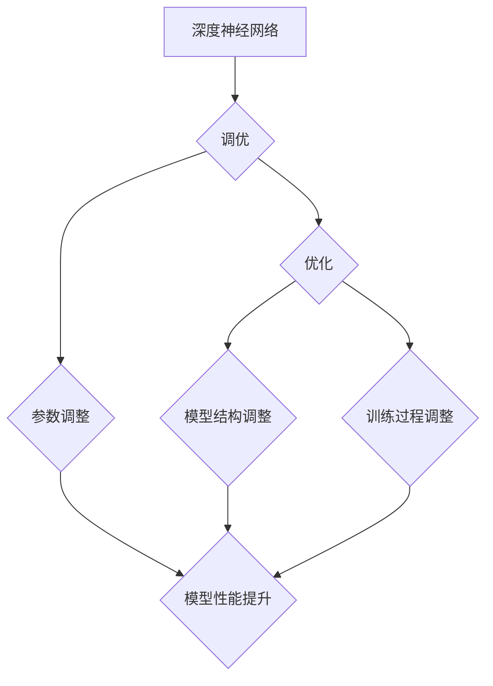

> 深度神经网络，调优，优化，梯度下降，正则化，迁移学习，超参数调优

## 1. 背景介绍

深度学习近年来取得了令人瞩目的成就，在图像识别、自然语言处理、语音识别等领域取得了突破性的进展。这些成就离不开深度神经网络（DNN）的不断发展和完善。然而，DNN的训练过程仍然面临着诸多挑战，例如过拟合、梯度消失、训练速度慢等。为了提高DNN的性能和效率，调优和优化策略成为了研究的热点。

本文将深入探讨深度神经网络的调优与优化策略，从核心概念、算法原理、数学模型、代码实现到实际应用场景，全面分析DNN调优的各个方面，并展望未来发展趋势。

## 2. 核心概念与联系

**2.1 核心概念**

* **深度神经网络 (DNN):** 由多层神经元组成的网络，能够学习复杂的数据模式。
* **调优 (Tuning):** 通过调整模型参数，以提高模型性能的过程。
* **优化 (Optimization):** 通过调整模型结构或训练过程，以提高模型性能的过程。

**2.2 联系**

DNN调优和优化是相互关联的，两者共同作用于提高DNN的性能。调优侧重于调整现有模型的参数，而优化则侧重于改进模型结构或训练过程。

**2.3 Mermaid 流程图**



## 3. 核心算法原理 & 具体操作步骤

**3.1 算法原理概述**

深度神经网络的调优和优化主要依赖于梯度下降算法及其变种。梯度下降算法的基本原理是通过计算损失函数对模型参数的梯度，并沿着梯度负方向更新参数，从而逐步降低损失函数的值。

**3.2 算法步骤详解**

1. **初始化模型参数:** 随机初始化模型参数。
2. **前向传播:** 将输入数据通过网络层层传递，计算输出结果。
3. **计算损失函数:** 计算输出结果与真实值的差异，即损失函数值。
4. **反向传播:** 计算损失函数对每个参数的梯度。
5. **参数更新:** 根据梯度更新模型参数，例如使用随机梯度下降 (SGD) 或动量法 (Momentum)。
6. **重复步骤 2-5:** 迭代多次，直到损失函数收敛或达到预设的迭代次数。

**3.3 算法优缺点**

* **优点:** 
    * 理论基础扎实，能够有效地降低损失函数值。
    * 算法实现简单，易于理解和编程。
* **缺点:** 
    * 容易陷入局部最优解。
    * 训练速度可能较慢，尤其是在处理大规模数据集时。

**3.4 算法应用领域**

梯度下降算法及其变种广泛应用于深度神经网络的调优和优化，例如图像识别、自然语言处理、语音识别等领域。

## 4. 数学模型和公式 & 详细讲解 & 举例说明

**4.1 数学模型构建**

深度神经网络可以看作一个复杂的函数映射，其输入为数据样本，输出为预测结果。

**4.2 公式推导过程**

损失函数通常采用均方误差 (MSE) 或交叉熵 (Cross-Entropy) 等函数，其目标是最小化模型预测结果与真实值的差异。梯度下降算法通过计算损失函数对模型参数的梯度，并沿着梯度负方向更新参数，从而逐步降低损失函数的值。

**4.3 案例分析与讲解**

假设我们有一个简单的线性回归模型，其损失函数为 MSE，则梯度下降算法的更新公式为：

$$
\theta = \theta - \alpha \frac{\partial L}{\partial \theta}
$$

其中：

* $\theta$ 为模型参数
* $\alpha$ 为学习率
* $\frac{\partial L}{\partial \theta}$ 为损失函数对模型参数的梯度

**5. 项目实践：代码实例和详细解释说明**

**5.1 开发环境搭建**

使用 Python 语言和深度学习框架 TensorFlow 或 PyTorch 搭建开发环境。

**5.2 源代码详细实现**

```python
import tensorflow as tf

# 定义模型
model = tf.keras.models.Sequential([
    tf.keras.layers.Dense(10, activation='relu', input_shape=(784,)),
    tf.keras.layers.Dense(10, activation='softmax')
])

# 定义损失函数和优化器
loss_fn = tf.keras.losses.SparseCategoricalCrossentropy()
optimizer = tf.keras.optimizers.Adam(learning_rate=0.001)

# 训练模型
model.compile(optimizer=optimizer, loss=loss_fn, metrics=['accuracy'])
model.fit(x_train, y_train, epochs=10)
```

**5.3 代码解读与分析**

这段代码定义了一个简单的深度神经网络模型，并使用 Adam 优化器和交叉熵损失函数进行训练。

**5.4 运行结果展示**

训练完成后，可以评估模型的性能，例如在测试集上的准确率。

## 6. 实际应用场景

深度神经网络调优和优化策略广泛应用于各个领域，例如：

* **图像识别:** 提高图像分类、目标检测、图像分割等任务的准确率。
* **自然语言处理:** 提升文本分类、情感分析、机器翻译等任务的性能。
* **语音识别:** 增强语音识别系统的准确性和鲁棒性。

**6.4 未来应用展望**

随着深度学习技术的不断发展，DNN调优和优化策略将发挥更加重要的作用，例如：

* **自动调优:** 利用自动化技术自动搜索最佳模型参数和结构。
* **联邦学习:** 在保护数据隐私的前提下，协同训练深度神经网络模型。
* **可解释性:** 研究深度神经网络的决策过程，提高模型的可解释性。

## 7. 工具和资源推荐

**7.1 学习资源推荐**

* **书籍:**
    * 深度学习 (Deep Learning) - Ian Goodfellow, Yoshua Bengio, Aaron Courville
    * 深度学习实践 (Deep Learning with Python) - Francois Chollet
* **在线课程:**
    * Coursera - Deep Learning Specialization
    * Udacity - Deep Learning Nanodegree

**7.2 开发工具推荐**

* **TensorFlow:** 开源深度学习框架，提供丰富的 API 和工具。
* **PyTorch:** 开源深度学习框架，以其灵活性和易用性而闻名。
* **Keras:** 高级深度学习 API，可以运行在 TensorFlow 或 Theano 后端。

**7.3 相关论文推荐**

* **ImageNet Classification with Deep Convolutional Neural Networks** - Alex Krizhevsky, Ilya Sutskever, Geoffrey E. Hinton
* **Attention Is All You Need** - Ashish Vaswani, Noam Shazeer, Niki Parmar, Jakob Uszkoreit, Llion Jones, Aidan N Gomez, Łukasz Kaiser, Illia Polosukhin

## 8. 总结：未来发展趋势与挑战

**8.1 研究成果总结**

深度神经网络调优和优化策略取得了显著的成果，例如：

* 提出了一系列高效的优化算法，例如 Adam、RMSprop 等。
* 开发了多种调优技术，例如正则化、迁移学习等。
* 构建了强大的深度学习框架，例如 TensorFlow、PyTorch 等。

**8.2 未来发展趋势**

* 自动调优技术将更加成熟，能够自动搜索最佳模型参数和结构。
* 联邦学习将得到更广泛的应用，在保护数据隐私的前提下协同训练深度神经网络模型。
* 深度神经网络的可解释性将得到进一步研究，提高模型的透明度和可信度。

**8.3 面临的挑战**

* 训练大规模深度神经网络仍然面临着计算资源和时间成本的挑战。
* 深度神经网络的泛化能力仍然需要进一步提升，避免过拟合问题。
* 深度神经网络的安全性与鲁棒性需要得到加强，防止攻击和误用。

**8.4 研究展望**

未来，深度神经网络调优和优化策略的研究将继续深入，探索更有效的算法、更强大的工具和更广泛的应用场景，推动深度学习技术的发展和应用。

## 9. 附录：常见问题与解答

**9.1 什么是过拟合？**

过拟合是指模型在训练数据上表现良好，但在测试数据上表现较差的情况。

**9.2 如何防止过拟合？**

常用的防止过拟合的方法包括：

* 正则化
* 数据增强
*  dropout

**9.3 什么是迁移学习？**

迁移学习是指利用预训练模型的知识，对新的任务进行训练。

**9.4 如何进行超参数调优？**

超参数调优是指通过调整模型训练过程中的超参数，以提高模型性能的过程。常用的超参数调优方法包括网格搜索和随机搜索。


作者：禅与计算机程序设计艺术 / Zen and the Art of Computer Programming 
<end_of_turn>