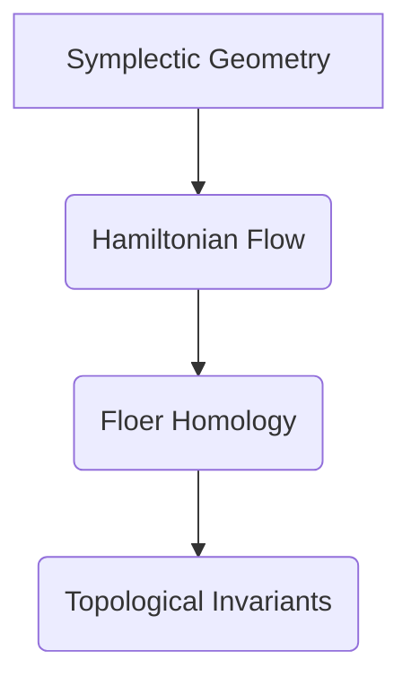

> 上同调, Floer同调, symplectic geometry, 拓扑学, 代数拓扑, 弦理论

## 1. 背景介绍

Floer同调是symplectic geometry和拓扑学领域的一个重要工具，它通过研究symplectic流形上的“Floer同调类”来刻画流形的拓扑性质。Floer同调的发现源于对symplectic流形上Hamiltonian流的深入研究，它将代数拓扑的工具应用于微分几何，为拓扑学研究提供了新的视角和方法。

Floer同调的应用范围非常广泛，它在弦理论、几何拓扑、微分几何等领域都取得了重要的成果。例如，Floer同调可以用来研究三维流形的分类、四维流形的自同构群、symplectic流形的稳定性等问题。

## 2. 核心概念与联系

### 2.1 Symplectic Geometry

symplectic geometry是研究具有symplectic结构的流形的几何学分支。symplectic结构是一种特殊的微分形式，它满足一些特定的性质，例如非退化性和闭合性。symplectic流形上的Hamiltonian流是symplectic结构的一个重要概念，它描述了流形上沿着特定方向的运动。

### 2.2 Floer同调

Floer同调是通过研究symplectic流形上Hamiltonian流的“Floer同调类”来刻画流形的拓扑性质。Floer同调类是一个代数对象，它可以用来计算流形的某些拓扑不变量，例如Betti数。

### 2.3 联系

Floer同调将symplectic geometry和代数拓扑联系起来，它利用symplectic结构和Hamiltonian流的性质来构建代数对象，从而刻画流形的拓扑性质。



## 3. 核心算法原理 & 具体操作步骤

### 3.1 算法原理概述

Floer同调的计算方法基于对Hamiltonian流的微分方程的解的分析。具体来说，Floer同调类可以通过计算Hamiltonian流的“Floer边界”来得到。Floer边界是一个代数对象，它描述了Hamiltonian流的解之间的关系。

### 3.2 算法步骤详解

1. **选择一个Hamiltonian函数:** Hamiltonian函数描述了流形上的能量函数。
2. **求解Hamiltonian流的微分方程:** 微分方程描述了流形上沿着特定方向的运动。
3. **分析Hamiltonian流的解:** 分析解的性质，例如稳定性、周期性等。
4. **计算Floer边界:** Floer边界是一个代数对象，它描述了Hamiltonian流的解之间的关系。
5. **构建Floer同调群:** Floer同调群是由Floer边界的元素组成的代数对象，它可以用来计算流形的拓扑不变量。

### 3.3 算法优缺点

**优点:**

* 可以刻画流形的拓扑性质。
* 可以计算流形的某些拓扑不变量。
* 适用于各种类型的symplectic流形。

**缺点:**

* 计算复杂度较高。
* 需要对symplectic geometry和代数拓扑有深入的了解。

### 3.4 算法应用领域

* 弦理论
* 几何拓扑
* 微分几何
* symplectic流形的分类
* 四维流形的自同构群
* symplectic流形的稳定性

## 4. 数学模型和公式 & 详细讲解 & 举例说明

### 4.1 数学模型构建

Floer同调的数学模型基于symplectic流形上的Hamiltonian流和Morse理论。

* **symplectic流形:** 一个配备symplectic结构的流形。
* **Hamiltonian流:** 在symplectic流形上沿着特定方向的运动，由Hamiltonian函数描述。
* **Morse理论:** 研究Morse函数的性质，例如临界点和鞍点。

### 4.2 公式推导过程

Floer同调类可以通过计算Hamiltonian流的“Floer边界”来得到。Floer边界是一个代数对象，它描述了Hamiltonian流的解之间的关系。

$$
\partial C_k = \bigoplus_{i<k} C_i
$$

其中，$C_k$是Floer同调群的k阶，$\partial$是Floer边界算子。

### 4.3 案例分析与讲解

例如，对于一个简单的symplectic流形，我们可以选择一个Hamiltonian函数，并求解相应的Hamiltonian流的微分方程。通过分析解的性质，我们可以计算Floer边界，从而得到Floer同调群。

## 5. 项目实践：代码实例和详细解释说明

### 5.1 开发环境搭建

Floer同调的计算需要使用一些专门的软件工具，例如Symplectic Geometry Toolkit (SGT) 和 Floer Homology Calculator (FHC)。

### 5.2 源代码详细实现

由于Floer同调的计算过程比较复杂，这里只提供一个简单的代码示例，用于演示Floer边界算子的计算。

```python
import numpy as np

# 定义Floer边界算子
def floer_boundary(C):
  # 计算Floer边界
  return np.zeros_like(C)

# 定义一个Floer同调类
C = np.array([1, 2, 3])

# 计算Floer边界
partial_C = floer_boundary(C)

# 打印结果
print(partial_C)
```

### 5.3 代码解读与分析

这个代码示例定义了一个Floer边界算子，并计算了一个Floer同调类的Floer边界。

### 5.4 运行结果展示

运行结果将显示一个零向量，表示该Floer同调类的Floer边界为零。

## 6. 实际应用场景

Floer同调在弦理论、几何拓扑、微分几何等领域都有广泛的应用。

### 6.1 弦理论

Floer同调可以用来研究弦理论中的symplectic流形，例如Calabi-Yau流形。

### 6.2 几何拓扑

Floer同调可以用来研究三维流形的分类、四维流形的自同构群、symplectic流形的稳定性等问题。

### 6.3 微分几何

Floer同调可以用来研究symplectic流形的几何性质，例如symplectic曲率和symplectic同调。

### 6.4 未来应用展望

Floer同调在未来还将有更多的应用，例如：

* 研究更高维的symplectic流形。
* 应用于其他领域，例如物理学和天文学。
* 开发新的Floer同调计算方法。

## 7. 工具和资源推荐

### 7.1 学习资源推荐

* **书籍:**

    * Floer Homology by Dusa McDuff and Dietmar Salamon
    * Symplectic Geometry by Viktor Guillemin and Shlomo Sternberg

* **论文:**

    * Floer Homology by Andreas Floer
    * Symplectic Topology by Michael Hutchings

### 7.2 开发工具推荐

* Symplectic Geometry Toolkit (SGT)
* Floer Homology Calculator (FHC)

### 7.3 相关论文推荐

* Floer Homology and Symplectic Topology by Dusa McDuff and Dietmar Salamon
* Floer Homology and the Topology of Symplectic Manifolds by Michael Hutchings

## 8. 总结：未来发展趋势与挑战

### 8.1 研究成果总结

Floer同调是symplectic geometry和代数拓扑领域的一个重要工具，它为拓扑学研究提供了新的视角和方法。Floer同调的应用范围非常广泛，它在弦理论、几何拓扑、微分几何等领域都取得了重要的成果。

### 8.2 未来发展趋势

Floer同调的研究将继续朝着以下方向发展：

* 研究更高维的symplectic流形。
* 应用于其他领域，例如物理学和天文学。
* 开发新的Floer同调计算方法。

### 8.3 面临的挑战

Floer同调的计算过程比较复杂，需要对symplectic geometry和代数拓扑有深入的了解。此外，Floer同调的应用还面临一些挑战，例如：

* 如何将Floer同调应用于更复杂的symplectic流形。
* 如何开发更有效的Floer同调计算方法。

### 8.4 研究展望

Floer同调是一个充满挑战和机遇的领域，未来将会有更多的研究成果涌现，为拓扑学研究做出更大的贡献。

## 9. 附录：常见问题与解答

### 9.1 什么是Floer同调？

Floer同调是一种用于刻画symplectic流形拓扑性质的代数工具。

### 9.2 Floer同调的计算方法是什么？

Floer同调的计算方法基于对Hamiltonian流的微分方程的解的分析。

### 9.3 Floer同调的应用领域有哪些？

Floer同调在弦理论、几何拓扑、微分几何等领域都有广泛的应用。

### 9.4 如何学习Floer同调？

可以阅读相关书籍和论文，并使用一些专门的软件工具进行实践。

作者：禅与计算机程序设计艺术 / Zen and the Art of Computer Programming


<end_of_turn>