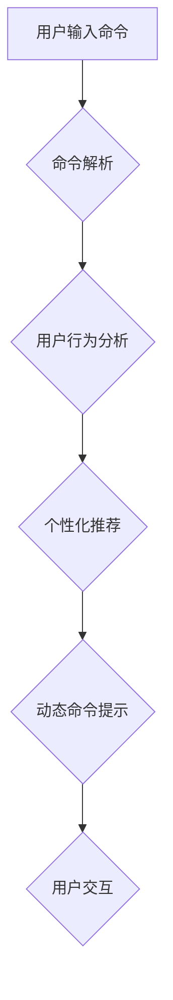

> 个性化推荐系统，CUI，自然语言处理，机器学习，用户行为分析，推荐算法，交互式体验

## 1. 背景介绍

随着人工智能技术的飞速发展，个性化推荐系统已成为各大互联网平台的核心竞争力。传统推荐系统主要依赖于用户显性反馈，如评分、点赞等，而个性化推荐系统则更注重挖掘用户隐性行为，例如浏览历史、搜索记录、购买偏好等，以提供更精准、更符合用户需求的推荐结果。

CUI（命令行界面）作为一种简洁高效的交互方式，在许多领域仍发挥着重要作用，例如科学计算、系统管理、数据分析等。然而，传统的CUI缺乏个性化定制功能，用户体验相对单一。将个性化推荐系统融入CUI，可以根据用户的历史交互行为和偏好，动态调整命令提示、推荐相关命令和功能，从而提升用户体验，提高工作效率。

## 2. 核心概念与联系

**2.1 个性化推荐系统**

个性化推荐系统旨在根据用户的个人特征、行为模式和偏好，提供个性化的产品、服务或内容推荐。其核心目标是提高用户满意度、促进用户参与度和转化率。

**2.2 CUI（命令行界面）**

CUI是一种文本驱动的用户界面，用户通过输入命令和文本指令与系统交互。CUI通常以简洁、高效的命令结构为特点，适用于需要快速执行特定任务的场景。

**2.3 核心概念联系**

将个性化推荐系统融入CUI，可以实现以下核心功能：

* **智能命令提示：**根据用户的历史交互记录和上下文信息，智能提示相关命令和参数，减少用户输入错误和学习成本。
* **个性化命令推荐：**根据用户的兴趣偏好和使用习惯，推荐用户可能需要的命令和功能，帮助用户发现新的功能和应用场景。
* **动态交互体验：**根据用户的实时交互行为，动态调整CUI界面和命令提示，提供更流畅、更人性化的交互体验。

**2.4 Mermaid 流程图**



## 3. 核心算法原理 & 具体操作步骤

**3.1 算法原理概述**

个性化推荐系统在CUI中的应用主要依赖于以下核心算法：

* **用户行为分析：**通过分析用户的命令输入、执行频率、时间分布等行为数据，构建用户行为模型，识别用户的兴趣偏好和使用习惯。
* **协同过滤：**根据用户的历史交互行为，识别具有相似兴趣的用户群体，推荐其他用户喜欢的命令和功能。
* **内容过滤：**根据命令的语义内容和用户兴趣偏好，推荐与用户需求相匹配的命令和功能。
* **深度学习：**利用深度神经网络模型，从用户的行为数据中提取更深层的特征，实现更精准的个性化推荐。

**3.2 算法步骤详解**

1. **数据收集与预处理：**收集用户的命令输入、执行时间、参数设置等行为数据，并进行清洗、格式化和特征提取。
2. **用户行为建模：**利用机器学习算法，构建用户行为模型，例如用户兴趣向量、用户行为序列等。
3. **推荐算法训练：**根据用户的行为数据和模型，训练个性化推荐算法，例如协同过滤算法、内容过滤算法或深度学习模型。
4. **个性化推荐：**根据用户的当前上下文信息和行为模式，利用训练好的推荐算法，生成个性化的命令推荐列表。
5. **命令提示与交互：**将个性化推荐结果融入CUI界面，提供智能命令提示和个性化命令推荐，引导用户完成任务。

**3.3 算法优缺点**

* **优点：**
    * 提升用户体验：提供更精准、更符合用户需求的命令推荐，减少用户学习成本和搜索时间。
    * 提高工作效率：帮助用户发现新的功能和应用场景，提高工作效率。
    * 个性化定制：根据用户的个人偏好和使用习惯，提供个性化的交互体验。
* **缺点：**
    * 数据依赖：个性化推荐算法依赖于大量的用户行为数据，数据质量直接影响推荐效果。
    * 算法复杂度：一些个性化推荐算法，例如深度学习模型，计算复杂度较高，需要强大的计算资源支持。
    * 隐私安全：用户行为数据涉及个人隐私，需要采取相应的安全措施保护用户数据。

**3.4 算法应用领域**

个性化推荐系统在CUI中的应用领域广泛，例如：

* **科学计算：**根据用户的科研领域和研究方向，推荐相关的命令和功能，提高科研效率。
* **系统管理：**根据用户的权限和操作习惯，推荐相关的系统管理命令，简化系统管理操作。
* **数据分析：**根据用户的分析需求和数据类型，推荐相关的分析命令和工具，提高数据分析效率。
* **编程开发：**根据用户的编程语言和开发经验，推荐相关的代码片段和开发工具，提高编程效率。

## 4. 数学模型和公式 & 详细讲解 & 举例说明

**4.1 数学模型构建**

个性化推荐系统通常采用基于用户的协同过滤模型，其核心思想是：

* 寻找具有相似兴趣的用户群体。
* 推荐其他用户喜欢的命令或功能。

**4.2 公式推导过程**

用户-物品评分矩阵 $R$，其中 $R_{ui}$ 表示用户 $u$ 对物品 $i$ 的评分。

* **相似度计算：**

    * 余弦相似度：

    $$
    sim(u,v) = \frac{u \cdot v}{||u|| ||v||}
    $$

    其中，$u$ 和 $v$ 是两个用户的兴趣向量，$u \cdot v$ 是两个向量的点积，$||u||$ 和 $||v||$ 是两个向量的模长。

* **推荐算法：**

    $$
    P(i|u) = \frac{\sum_{v \in N(u)} sim(u,v) * R_{v,i}}{\sum_{v \in N(u)} sim(u,v)}
    $$

    其中，$P(i|u)$ 是用户 $u$ 对物品 $i$ 的推荐概率，$N(u)$ 是用户 $u$ 的邻居用户集合。

**4.3 案例分析与讲解**

假设有一个用户行为数据矩阵 $R$，其中用户 $u1$ 和 $u2$ 的兴趣向量分别为 $[0.8, 0.2, 0.5]$ 和 $[0.5, 0.7, 0.3]$。

* 计算用户 $u1$ 和 $u2$ 的余弦相似度：

$$
sim(u1,u2) = \frac{[0.8, 0.2, 0.5] \cdot [0.5, 0.7, 0.3]}{|| [0.8, 0.2, 0.5] || || [0.5, 0.7, 0.3] ||}
$$

* 假设用户 $u2$ 对物品 $i$ 的评分为 $R_{u2,i} = 4$，则用户 $u1$ 对物品 $i$ 的推荐概率为：

$$
P(i|u1) = \frac{sim(u1,u2) * R_{u2,i}}{\sum_{v \in N(u1)} sim(u1,v)}
$$

## 5. 项目实践：代码实例和详细解释说明

**5.1 开发环境搭建**

* 操作系统：Linux/macOS
* Python 版本：3.7+
* 依赖库：pandas, numpy, scikit-learn, matplotlib

**5.2 源代码详细实现**

```python
import pandas as pd
from sklearn.metrics.pairwise import cosine_similarity

# 加载用户行为数据
data = pd.read_csv('user_behavior.csv')

# 构建用户-物品评分矩阵
R = data.pivot_table(index='user_id', columns='item_id', values='rating')

# 计算用户相似度
user_similarity = cosine_similarity(R.values)

# 用户推荐函数
def recommend_items(user_id, top_n=5):
    # 获取用户邻居
    neighbors = get_neighbors(user_id, user_similarity)

    # 计算推荐分数
    recommendations = calculate_recommendations(user_id, neighbors, R)

    # 返回推荐结果
    return recommendations[:top_n]

# 获取邻居用户函数
def get_neighbors(user_id, user_similarity):
    # 这里实现获取邻居用户的逻辑
    pass

# 计算推荐分数函数
def calculate_recommendations(user_id, neighbors, R):
    # 这里实现计算推荐分数的逻辑
    pass

# 示例使用
user_id = 1
recommendations = recommend_items(user_id)
print(f'推荐给用户 {user_id} 的 {len(recommendations)} 个物品：')
for item_id, score in recommendations.items():
    print(f'物品 {item_id}: 分数 {score}')
```

**5.3 代码解读与分析**

* 代码首先加载用户行为数据，构建用户-物品评分矩阵。
* 然后使用余弦相似度计算用户之间的相似度。
* `recommend_items` 函数实现个性化推荐逻辑，根据用户的邻居用户和评分矩阵计算推荐分数。
* `get_neighbors` 和 `calculate_recommendations` 函数分别实现获取邻居用户和计算推荐分数的具体逻辑。

**5.4 运行结果展示**

运行代码后，将输出推荐给指定用户 $user_id$ 的 $top_n$ 个物品及其推荐分数。

## 6. 实际应用场景

**6.1 科学计算**

在科学计算领域，个性化推荐系统可以根据用户的科研领域和研究方向，推荐相关的命令和功能，例如：

* 推荐与用户研究领域相关的数学库和工具。
* 推荐与用户正在进行的研究相关的文献和数据。
* 推荐与用户研究方法相关的计算脚本和代码片段。

**6.2 系统管理**

在系统管理领域，个性化推荐系统可以根据用户的权限和操作习惯，推荐相关的系统管理命令，例如：

* 推荐与用户权限相关的系统配置命令。
* 推荐与用户操作频率高的系统功能相关的命令。
* 推荐与用户正在处理的系统任务相关的命令。

**6.3 数据分析**

在数据分析领域，个性化推荐系统可以根据用户的分析需求和数据类型，推荐相关的分析命令和工具，例如：

* 推荐与用户分析目标相关的统计分析命令。
* 推荐与用户数据类型相关的可视化工具。
* 推荐与用户分析方法相关的机器学习算法。

**6.4 未来应用展望**

随着人工智能技术的不断发展，个性化推荐系统在CUI中的应用将更加广泛和深入。未来，个性化推荐系统可能具备以下能力：

* 更精准的推荐：利用更先进的机器学习算法和深度学习模型，实现更精准的个性化推荐。
* 更智能的交互：通过自然语言处理技术，实现更智能的CUI交互，例如用户可以使用自然语言进行命令输入和查询。
* 更个性化的定制：根据用户的个人偏好和使用习惯，提供更个性化的CUI界面和命令提示。

## 7. 工具和资源推荐

**7.1 学习资源推荐**

* **书籍：**
    * 《推荐系统》
    * 《机器学习》
    * 《深度学习》
* **在线课程：**
    * Coursera：推荐系统课程
    * edX：机器学习课程
    * Udacity：深度学习课程

**7.2 开发工具推荐**

* **Python：** 作为机器学习和数据分析的常用语言，Python 提供丰富的库和工具，例如 pandas, numpy, scikit-learn 等。
* **Jupyter Notebook：** 用于交互式编程和数据可视化，方便进行机器学习模型开发和测试。
* **TensorFlow/PyTorch：** 深度学习框架，用于构建和训练