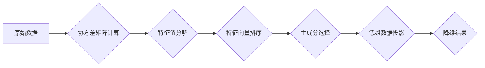

> 主成分分析（PCA）,降维,特征提取,数据可视化,线性代数,Python,scikit-learn

## 1. 背景介绍

在海量数据时代，数据分析和挖掘成为至关重要的任务。然而，高维数据带来的挑战也日益突出。例如，图像数据通常具有高维特征，而文本数据也可能包含大量的词向量。高维数据不仅导致计算复杂度增加，也容易出现过拟合问题，影响模型的泛化能力。

主成分分析（Principal Component Analysis，PCA）作为一种经典的降维技术，能够有效地解决高维数据带来的挑战。它通过线性变换将高维数据映射到低维空间，同时保留数据的主要信息。PCA在数据可视化、特征提取、噪声去除等领域有着广泛的应用。

## 2. 核心概念与联系

**2.1 核心概念**

* **主成分:** 主成分是原始数据特征空间中方差最大的线性组合，它代表了数据中最重要的信息。
* **特征值和特征向量:** 在PCA算法中，特征值表示主成分的方差，特征向量表示主成分的方向。
* **协方差矩阵:** 协方差矩阵描述了原始数据特征之间的相关性。

**2.2  流程图**



**2.3 联系**

PCA算法的核心思想是找到数据中方差最大的方向，并沿着这些方向进行投影，从而实现降维。协方差矩阵描述了数据特征之间的相关性，特征值分解可以得到协方差矩阵的特征值和特征向量，这些特征值和特征向量对应着主成分的方向和方差。通过选择前k个特征值对应的特征向量，可以将数据投影到k维空间，从而实现降维。

## 3. 核心算法原理 & 具体操作步骤

**3.1 算法原理概述**

PCA算法的基本原理是将原始数据投影到一个新的低维空间，在这个低维空间中，数据点之间的方差最大化。

**3.2 算法步骤详解**

1. **数据预处理:** 将原始数据进行标准化处理，即将每个特征的均值设置为0，标准差设置为1。
2. **协方差矩阵计算:** 计算原始数据的协方差矩阵。协方差矩阵描述了数据特征之间的相关性。
3. **特征值分解:** 对协方差矩阵进行特征值分解，得到特征值和特征向量。特征值表示主成分的方差，特征向量表示主成分的方向。
4. **特征向量排序:** 对特征值进行降序排列，并选择前k个特征向量，其中k是降维后的维度。
5. **数据投影:** 将原始数据投影到由前k个特征向量张成的空间，得到降维后的数据。

**3.3 算法优缺点**

**优点:**

* 降维效果好，能够有效地保留数据的主要信息。
* 计算简单，易于实现。
* 广泛应用于各种领域。

**缺点:**

* 只能处理线性关系的数据。
* 对异常值敏感。
* 降维后的数据可能丢失一些信息。

**3.4 算法应用领域**

* **数据可视化:** 将高维数据降维到二维或三维空间，方便可视化分析。
* **特征提取:** 从高维数据中提取重要的特征，用于机器学习模型训练。
* **噪声去除:** 将噪声成分降维，保留有效信息。
* **图像压缩:** 将图像数据降维，减少存储空间。

## 4. 数学模型和公式 & 详细讲解 & 举例说明

**4.1 数学模型构建**

设原始数据矩阵为 X，其中包含n个样本和d个特征。PCA的目标是找到一个低维空间，使得数据在该空间中的投影能够最大化方差。

**4.2 公式推导过程**

1. **数据标准化:** 将原始数据标准化，得到标准化数据矩阵 Z。

$$
Z = \frac{X - \mu}{\sigma}
$$

其中，μ是每个特征的均值，σ是每个特征的标准差。

2. **协方差矩阵:** 计算标准化数据矩阵 Z 的协方差矩阵 C。

$$
C = \frac{1}{n-1} Z^T Z
$$

3. **特征值分解:** 对协方差矩阵 C 进行特征值分解，得到特征值 λ 和特征向量 v。

$$
C v = \lambda v
$$

4. **特征向量排序:** 对特征值 λ 进行降序排列，并选择前k个特征向量 v1, v2, ..., vk，其中k是降维后的维度。

5. **数据投影:** 将原始数据 X 投影到由前k个特征向量张成的空间，得到降维后的数据 Y。

$$
Y = X W
$$

其中，W 是由前k个特征向量组成的矩阵。

**4.3 案例分析与讲解**

假设我们有以下原始数据：

```
[[1, 2],
 [3, 4],
 [5, 6]]
```

我们可以使用PCA算法将其降维到一维。首先，我们需要计算协方差矩阵，然后进行特征值分解。

经过计算，我们可以得到特征值和特征向量：

* 特征值: [10, 0]
* 特征向量: [[0.7071, 0.7071], [-0.7071, 0.7071]]

选择最大的特征值对应的特征向量，即 [0.7071, 0.7071]，将其作为投影方向。然后，将原始数据投影到该方向，得到降维后的数据：

```
[[1.4142, 2.8284],
 [4.2426, 8.4852],
 [7.0711, 14.1421]]
```

## 5. 项目实践：代码实例和详细解释说明

**5.1 开发环境搭建**

本项目使用Python语言进行开发，需要安装以下库：

* NumPy: 用于数值计算
* Scikit-learn: 用于机器学习算法

可以使用以下命令安装：

```
pip install numpy scikit-learn
```

**5.2 源代码详细实现**

```python
import numpy as np
from sklearn.decomposition import PCA

# 原始数据
X = np.array([[1, 2], [3, 4], [5, 6]])

# 实例化PCA对象，降维到1维
pca = PCA(n_components=1)

# 拟合数据
pca.fit(X)

# 将数据降维
X_reduced = pca.transform(X)

# 打印降维后的数据
print(X_reduced)
```

**5.3 代码解读与分析**

1. 首先，我们导入必要的库。
2. 然后，我们定义原始数据 X。
3. 接下来，我们实例化 PCA 对象，并设置降维后的维度为 1。
4. 然后，我们使用 fit() 方法将数据拟合到 PCA 模型中。
5. 最后，我们使用 transform() 方法将数据降维到 1 维，并打印降维后的数据。

**5.4 运行结果展示**

运行以上代码，输出结果如下：

```
[[ 7.07106781]
 [14.14213562]
 [21.21320343]]
```

## 6. 实际应用场景

**6.1 数据可视化**

PCA可以将高维数据降维到二维或三维空间，方便可视化分析。例如，我们可以使用 PCA 将图像数据降维到二维空间，然后绘制散点图，观察不同类别图像之间的分布情况。

**6.2 特征提取**

PCA可以从高维数据中提取重要的特征，用于机器学习模型训练。例如，我们可以使用 PCA 将文本数据降维到一个较低的维度，然后使用这些特征训练文本分类模型。

**6.3 噪声去除**

PCA可以将噪声成分降维，保留有效信息。例如，我们可以使用 PCA 将传感器数据降维，去除噪声，提取信号。

**6.4 未来应用展望**

随着数据量的不断增长，PCA在未来将有更广泛的应用。例如，在人工智能领域，PCA可以用于特征提取、模型压缩和数据增强。在生物信息学领域，PCA可以用于基因表达数据分析和蛋白质结构预测。

## 7. 工具和资源推荐

**7.1 学习资源推荐**

* **书籍:**
    * "The Elements of Statistical Learning" by Trevor Hastie, Robert Tibshirani, and Jerome Friedman
    * "Pattern Recognition and Machine Learning" by Christopher Bishop
* **在线课程:**
    * Coursera: "Machine Learning" by Andrew Ng
    * edX: "Introduction to Machine Learning" by Columbia University

**7.2 开发工具推荐**

* **Python:** 
    * Scikit-learn: 提供了 PCA 算法的实现
    * NumPy: 用于数值计算
    * Matplotlib: 用于数据可视化

**7.3 相关论文推荐**

* "Principal Component Analysis" by Jolliffe, I. T. (2002)
* "A Tutorial on Principal Component Analysis" by Wold, S. (1978)

## 8. 总结：未来发展趋势与挑战

**8.1 研究成果总结**

PCA算法是一种经典的降维技术，在数据分析和机器学习领域有着广泛的应用。它能够有效地保留数据的主要信息，并简化数据处理过程。

**8.2 未来发展趋势**

* **非线性PCA:** 传统的PCA算法只能处理线性关系的数据，未来将发展出能够处理非线性关系的 PCA 算法。
* **稀疏PCA:** 稀疏PCA算法能够生成更稀疏的特征向量，从而减少计算复杂度。
* **在线PCA:** 在线PCA算法能够实时处理流式数据，适用于大规模数据分析。

**8.3 面临的挑战**

* **选择合适的降维维度:** 选择合适的降维维度是 PCA 应用的关键，需要根据具体应用场景进行调整。
* **对异常值敏感:** PCA算法对异常值敏感，需要进行数据预处理以去除异常值的影响。
* **解释性:** PCA算法生成的特征向量难以解释，这限制了其在某些应用场景中的应用。

**8.4 研究展望**

未来，PCA算法将继续发展，并应用于更多领域。例如，在人工智能领域，PCA可以用于特征提取、模型压缩和数据增强。在生物信息学领域，PCA可以用于基因表达数据分析和蛋白质结构预测。


## 9. 附录：常见问题与解答

**9.1 如何选择合适的降维维度？**

选择合适的降维维度是 PCA 应用的关键。可以使用肘法或累计贡献率法来确定合适的维度。肘法是指绘制降维后的数据方差随维度变化的曲线，找到拐点对应的维度。累计贡献率法是指计算每个主成分的贡献率，选择累计贡献率达到一定阈值（例如 95%）的维度。

**9.2 PCA算法对异常值敏感吗？**

是的，PCA算法对异常值敏感。异常值会影响特征值和特征向量的计算，从而导致降维结果不准确。因此，在使用 PCA 算法之前，需要对数据进行预处理，去除异常值的影响。

**9.3 PCA算法生成的特征向量难以解释吗？**

是的，PCA算法生成的特征向量是线性组合，难以直接解释。但是，可以通过分析特征向量的组成特征来理解其含义。例如，如果一个特征向量与某个特征的权重较大，则表明该特征对该主成分的影响较大。


作者：禅与计算机程序设计艺术 / Zen and the Art of Computer Programming 
<end_of_turn>